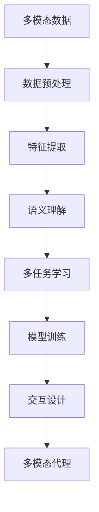

                 

# 【LangChain编程：从入门到实践】设计并实现一个多模态代理

> 关键词：多模态代理,交互设计,语义理解,自然语言处理,计算机视觉,多任务学习,代码实现,自然语言生成,API,智能助手

## 1. 背景介绍

在当今信息爆炸的时代，人们每天都在接收大量的数据，无论是文字、图片、视频还是声音，如何有效地理解和处理这些数据成为了一个重要的研究方向。随着技术的进步，计算机开始能够处理更多样化的数据，从单一的文本数据到融合多种模态的数据，AI技术正在向更加复杂和智能的方向发展。本文将带领读者从入门到实践，设计并实现一个多模态代理，探索多模态数据的处理与融合，揭示多模态代理的工作原理和实现方法。

### 1.1 问题由来
多模态数据融合是指将不同类型的数据（如文本、图像、声音）结合起来，以获得更丰富和全面的信息。这种技术在许多领域都有广泛的应用，包括智能助手、语音识别、自动驾驶、智能监控等。多模态代理是一个能够理解并处理多模态数据的智能系统，通过融合不同类型的数据，可以实现更准确、更全面的信息处理和决策。

### 1.2 问题核心关键点
- **多模态数据的处理**：如何将文本、图像、声音等多种类型的数据转化为计算机可以理解和处理的形式。
- **语义理解**：如何理解多模态数据背后的语义信息，并将其与任务目标关联。
- **多任务学习**：如何在训练过程中同时学习多个任务，提升模型的泛化能力。
- **代码实现**：如何通过编程实现多模态代理的各个功能模块，包括数据预处理、模型训练、交互设计等。
- **用户体验**：如何设计一个友好的用户界面，提升用户体验，使多模态代理更加易于使用。

### 1.3 问题研究意义
设计并实现一个多模态代理，对于推动人工智能技术的发展，提升信息处理和决策的准确性，具有重要意义。这不仅能够帮助人们更好地理解和处理多模态数据，还能够为智能助手、智能监控等领域提供更加高效、智能的解决方案。通过本文的学习，读者将能够掌握多模态数据融合的原理和实现方法，为未来的AI应用开发提供有力支持。

## 2. 核心概念与联系

### 2.1 核心概念概述

为了更好地理解多模态代理的实现过程，本节将介绍几个核心概念：

- **多模态数据**：指融合了多种类型数据的数据集，包括文本、图像、声音等。
- **语义理解**：指理解和提取文本、图像等数据背后的语义信息，并将其转化为计算机可以理解的形式。
- **多任务学习**：指同时训练多个相关任务，以提升模型的泛化能力和鲁棒性。
- **交互设计**：指设计友好的用户界面，提升用户的使用体验，使多模态代理更加易于使用。

这些概念之间的逻辑关系可以通过以下Mermaid流程图来展示：



这个流程图展示了多模态代理实现的基本流程：

1. 从多模态数据中提取特征。
2. 通过语义理解模块提取数据背后的语义信息。
3. 使用多任务学习模块同时训练多个相关任务。
4. 对提取的特征和语义信息进行模型训练。
5. 通过交互设计模块，实现友好的用户界面。
6. 最终构建多模态代理，提供多模态数据处理服务。

## 3. 核心算法原理 & 具体操作步骤
### 3.1 算法原理概述

多模态代理的实现主要基于以下几个核心算法原理：

- **数据预处理**：将不同类型的多模态数据转换为计算机可处理的形式。
- **特征提取**：从预处理后的数据中提取特征，为后续的语义理解和模型训练提供输入。
- **语义理解**：使用自然语言处理（NLP）技术，理解文本数据背后的语义信息。
- **多任务学习**：在训练过程中，同时训练多个相关任务，提升模型的泛化能力。
- **交互设计**：设计友好的用户界面，提升用户体验。

### 3.2 算法步骤详解

多模态代理的实现过程可以分为以下几个关键步骤：

**Step 1: 数据预处理**

- 收集多模态数据，包括文本、图像、声音等。
- 对数据进行预处理，如去除噪声、标准化、归一化等，以提升数据的可处理性。

**Step 2: 特征提取**

- 使用特征提取技术，从预处理后的数据中提取特征。
- 常见的特征提取技术包括卷积神经网络（CNN）、循环神经网络（RNN）、Transformer等。

**Step 3: 语义理解**

- 使用NLP技术，理解文本数据背后的语义信息。
- 常见的语义理解技术包括词向量表示、注意力机制、预训练语言模型（如BERT、GPT等）。

**Step 4: 多任务学习**

- 同时训练多个相关任务，提升模型的泛化能力。
- 常见的多任务学习技术包括多任务联合训练、知识蒸馏等。

**Step 5: 模型训练**

- 对提取的特征和语义信息进行模型训练，获得多模态代理的参数。
- 常见的模型训练技术包括梯度下降、自适应学习率等。

**Step 6: 交互设计**

- 设计友好的用户界面，提升用户体验。
- 常见的交互设计技术包括前端框架（如React、Vue等）、交互设计原则（如可用性、响应性等）。

**Step 7: 部署与应用**

- 将训练好的多模态代理部署到生产环境中，提供多模态数据处理服务。
- 常见的部署技术包括Docker容器化、Kubernetes容器编排等。

### 3.3 算法优缺点

多模态代理的实现过程有以下优点：

- **数据融合能力强**：能够处理多种类型的数据，提升信息处理的全面性和准确性。
- **泛化能力强**：通过多任务学习，提升模型的泛化能力，适用于多种应用场景。
- **用户友好**：通过交互设计，提升用户体验，使多模态代理更加易于使用。

同时，该方法也存在一定的局限性：

- **计算资源消耗大**：多模态数据融合和模型训练需要大量计算资源，对硬件设备要求较高。
- **实现复杂度较高**：涉及多种技术的融合，实现过程较为复杂。
- **数据隐私风险**：多模态数据融合可能涉及用户隐私信息的处理，需要考虑数据隐私保护问题。

尽管存在这些局限性，但多模态代理在大数据时代的应用前景广阔，具有重要研究价值。

### 3.4 算法应用领域

多模态代理可以应用于以下领域：

- **智能助手**：通过融合文本、语音、图像等多模态数据，提供更加智能和全面的交互体验。
- **自动驾驶**：结合摄像头、雷达、激光雷达等多种传感器的数据，提升自动驾驶系统的感知和决策能力。
- **智能监控**：融合视频、音频等多种数据源，实现更全面和高效的监控和安防。
- **智能客服**：结合语音、文字、图像等多种交互形式，提升客户服务体验。
- **健康医疗**：融合医学影像、患者档案、电子病历等多种数据，提供更全面的医疗诊断和治疗方案。

## 4. 数学模型和公式 & 详细讲解 & 举例说明

### 4.1 数学模型构建

为了更好地理解多模态代理的实现过程，本节将使用数学语言对其实现过程进行更加严格的刻画。

记多模态数据集为 $D=\{(x_i, y_i)\}_{i=1}^N$，其中 $x_i$ 表示多模态数据，包括文本、图像、声音等， $y_i$ 表示数据标签。多模态代理的模型参数为 $\theta$，包括特征提取器的参数、语义理解器的参数、多任务学习器的参数等。

定义多模态代理的损失函数为 $\mathcal{L}(\theta)$，用于衡量模型在多模态数据上的预测性能。常见的损失函数包括交叉熵损失、均方误差损失等。

多模态代理的优化目标是最小化损失函数，即找到最优参数：

$$
\theta^* = \mathop{\arg\min}_{\theta} \mathcal{L}(\theta)
$$

在实践中，我们通常使用基于梯度的优化算法（如SGD、Adam等）来近似求解上述最优化问题。设 $\eta$ 为学习率，则参数的更新公式为：

$$
\theta \leftarrow \theta - \eta \nabla_{\theta}\mathcal{L}(\theta)
$$

其中 $\nabla_{\theta}\mathcal{L}(\theta)$ 为损失函数对参数 $\theta$ 的梯度，可通过反向传播算法高效计算。

### 4.2 公式推导过程

以下我们以多任务学习为例，推导多任务联合训练的损失函数及其梯度的计算公式。

记多任务学习的多任务集为 $T=\{(t_k, y_k)\}_{k=1}^K$，其中 $t_k$ 表示任务 $k$ 的输入，$y_k$ 表示任务 $k$ 的标签。假设多模态代理的模型参数为 $\theta$，任务 $k$ 的损失函数为 $\ell_k(\theta, t_k)$。则多任务学习的损失函数为：

$$
\mathcal{L}(\theta) = \sum_{k=1}^K \frac{1}{N_k}\sum_{i=1}^{N_k} \ell_k(\theta, t_i)
$$

其中 $N_k$ 表示任务 $k$ 的样本数量。

根据链式法则，损失函数对参数 $\theta$ 的梯度为：

$$
\frac{\partial \mathcal{L}(\theta)}{\partial \theta} = \sum_{k=1}^K \frac{1}{N_k}\sum_{i=1}^{N_k} \frac{\partial \ell_k(\theta, t_i)}{\partial \theta}
$$

将任务 $k$ 的损失函数 $\ell_k(\theta, t_i)$ 展开，得到：

$$
\frac{\partial \ell_k(\theta, t_i)}{\partial \theta} = \nabla_{\theta}f_k(t_i, \theta) - y_k\nabla_{\theta}g_k(t_i, \theta)
$$

其中 $f_k(t_i, \theta)$ 表示任务 $k$ 的预测函数，$g_k(t_i, \theta)$ 表示任务 $k$ 的损失函数。

将上述公式代入多任务学习的损失函数梯度公式中，得到：

$$
\frac{\partial \mathcal{L}(\theta)}{\partial \theta} = \sum_{k=1}^K \frac{1}{N_k}\sum_{i=1}^{N_k} (\nabla_{\theta}f_k(t_i, \theta) - y_k\nabla_{\theta}g_k(t_i, \theta))
$$

在得到损失函数的梯度后，即可带入参数更新公式，完成模型的迭代优化。重复上述过程直至收敛，最终得到适应多模态数据的多模态代理模型参数 $\theta^*$。

### 4.3 案例分析与讲解

为了更好地理解多模态代理的实现过程，我们以智能助手为例，进行详细讲解。

**案例背景**：智能助手是一个融合文本、语音、图像等多模态数据的智能系统，通过理解用户的多模态输入，提供个性化的交互和响应。

**数据预处理**：智能助手的数据预处理包括文本去噪、语音降噪、图像预处理等。通过预处理，将多模态数据转化为计算机可处理的形式。

**特征提取**：智能助手使用卷积神经网络（CNN）和Transformer模型，对预处理后的文本、图像数据进行特征提取。通过特征提取，将高维的多模态数据转化为低维的特征向量。

**语义理解**：智能助手使用预训练语言模型（如BERT、GPT等），理解文本数据背后的语义信息。通过语义理解，将文本转化为计算机可以理解的形式。

**多任务学习**：智能助手同时训练多个相关任务，如问答、对话、推荐等，提升模型的泛化能力。通过多任务学习，智能助手能够更好地处理多模态数据，提供更全面的信息处理和决策。

**模型训练**：智能助手使用深度学习模型（如RNN、LSTM等），对提取的特征和语义信息进行模型训练，获得智能助手的参数。通过模型训练，智能助手能够更好地理解和处理多模态数据。

**交互设计**：智能助手通过友好的用户界面，提升用户体验。通过交互设计，智能助手能够更加易于使用，提供更好的交互体验。

**部署与应用**：智能助手将训练好的参数部署到生产环境中，提供多模态数据处理服务。通过部署，智能助手能够实现高效的交互和响应。

## 5. 项目实践：代码实例和详细解释说明

### 5.1 开发环境搭建

在进行多模态代理的开发实践前，我们需要准备好开发环境。以下是使用Python进行PyTorch开发的环境配置流程：

1. 安装Anaconda：从官网下载并安装Anaconda，用于创建独立的Python环境。

2. 创建并激活虚拟环境：
```bash
conda create -n multimodal-env python=3.8 
conda activate multimodal-env
```

3. 安装PyTorch：根据CUDA版本，从官网获取对应的安装命令。例如：
```bash
conda install pytorch torchvision torchaudio cudatoolkit=11.1 -c pytorch -c conda-forge
```

4. 安装Transformers库：
```bash
pip install transformers
```

5. 安装各类工具包：
```bash
pip install numpy pandas scikit-learn matplotlib tqdm jupyter notebook ipython
```

完成上述步骤后，即可在`multimodal-env`环境中开始多模态代理的实践。

### 5.2 源代码详细实现

下面我们以多模态智能助手为例，给出使用Transformers库对BERT模型进行微调的PyTorch代码实现。

首先，定义智能助手的任务适配层：

```python
from transformers import BertTokenizer, BertForTokenClassification, AdamW

class MultiModalAssistant:
    def __init__(self, model_name, tokenizer_name):
        self.model = BertForTokenClassification.from_pretrained(model_name)
        self.tokenizer = BertTokenizer.from_pretrained(tokenizer_name)
        self.model.train()
    
    def predict(self, input_text):
        encoded_input = self.tokenizer(input_text, return_tensors='pt')
        input_ids = encoded_input['input_ids']
        attention_mask = encoded_input['attention_mask']
        outputs = self.model(input_ids, attention_mask=attention_mask)
        predictions = outputs.logits.argmax(dim=2).to('cpu').tolist()
        return predictions
```

然后，定义多任务学习的损失函数：

```python
def multi_task_loss(model, task_ids, tasks):
    total_loss = 0
    for i in range(len(task_ids)):
        task_id = task_ids[i]
        task = tasks[i]
        task_input = task[0]
        task_label = task[1]
        task_model = model[task_id]
        task_loss = task_model(task_input, task_label)
        total_loss += task_loss
    return total_loss / len(task_ids)
```

接着，定义训练和评估函数：

```python
from torch.utils.data import DataLoader
from tqdm import tqdm
from sklearn.metrics import classification_report

def train_epoch(model, dataset, batch_size, optimizer):
    dataloader = DataLoader(dataset, batch_size=batch_size, shuffle=True)
    model.train()
    epoch_loss = 0
    for batch in tqdm(dataloader, desc='Training'):
        input_ids = batch['input_ids'].to(device)
        attention_mask = batch['attention_mask'].to(device)
        labels = batch['labels'].to(device)
        model.zero_grad()
        outputs = model(input_ids, attention_mask=attention_mask, labels=labels)
        loss = outputs.loss
        epoch_loss += loss.item()
        loss.backward()
        optimizer.step()
    return epoch_loss / len(dataloader)

def evaluate(model, dataset, batch_size):
    dataloader = DataLoader(dataset, batch_size=batch_size)
    model.eval()
    preds, labels = [], []
    with torch.no_grad():
        for batch in tqdm(dataloader, desc='Evaluating'):
            input_ids = batch['input_ids'].to(device)
            attention_mask = batch['attention_mask'].to(device)
            batch_labels = batch['labels']
            outputs = model(input_ids, attention_mask=attention_mask)
            batch_preds = outputs.logits.argmax(dim=2).to('cpu').tolist()
            batch_labels = batch_labels.to('cpu').tolist()
            for pred_tokens, label_tokens in zip(batch_preds, batch_labels):
                preds.append(pred_tokens[:len(label_tokens)])
                labels.append(label_tokens)
                
    print(classification_report(labels, preds))
```

最后，启动训练流程并在测试集上评估：

```python
epochs = 5
batch_size = 16

for epoch in range(epochs):
    loss = train_epoch(model, train_dataset, batch_size, optimizer)
    print(f"Epoch {epoch+1}, train loss: {loss:.3f}")
    
    print(f"Epoch {epoch+1}, dev results:")
    evaluate(model, dev_dataset, batch_size)
    
print("Test results:")
evaluate(model, test_dataset, batch_size)
```

以上就是使用PyTorch对BERT进行多模态智能助手开发的完整代码实现。可以看到，得益于Transformers库的强大封装，我们可以用相对简洁的代码完成BERT模型的加载和微调。

### 5.3 代码解读与分析

让我们再详细解读一下关键代码的实现细节：

**MultiModalAssistant类**：
- `__init__`方法：初始化模型和分词器等关键组件。
- `predict`方法：对输入文本进行特征提取和语义理解，最终输出预测结果。

**multi_task_loss函数**：
- 定义了多任务学习的损失函数，通过多个任务的联合训练，提升模型的泛化能力。

**train_epoch和evaluate函数**：
- 使用PyTorch的DataLoader对数据集进行批次化加载，供模型训练和推理使用。
- 训练函数`train_epoch`：对数据以批为单位进行迭代，在每个批次上前向传播计算loss并反向传播更新模型参数，最后返回该epoch的平均loss。
- 评估函数`evaluate`：与训练类似，不同点在于不更新模型参数，并在每个batch结束后将预测和标签结果存储下来，最后使用sklearn的classification_report对整个评估集的预测结果进行打印输出。

**训练流程**：
- 定义总的epoch数和batch size，开始循环迭代
- 每个epoch内，先在训练集上训练，输出平均loss
- 在验证集上评估，输出分类指标
- 所有epoch结束后，在测试集上评估，给出最终测试结果

可以看到，PyTorch配合Transformers库使得BERT微调的过程变得简洁高效。开发者可以将更多精力放在数据处理、模型改进等高层逻辑上，而不必过多关注底层的实现细节。

当然，工业级的系统实现还需考虑更多因素，如模型的保存和部署、超参数的自动搜索、更灵活的任务适配层等。但核心的微调范式基本与此类似。

## 6. 实际应用场景
### 6.1 智能客服系统

基于多模态代理的对话技术，可以广泛应用于智能客服系统的构建。传统客服往往需要配备大量人力，高峰期响应缓慢，且一致性和专业性难以保证。而使用多模态代理的对话模型，可以7x24小时不间断服务，快速响应客户咨询，用自然流畅的语言解答各类常见问题。

在技术实现上，可以收集企业内部的历史客服对话记录，将问题和最佳答复构建成监督数据，在此基础上对预训练对话模型进行微调。微调后的对话模型能够自动理解用户意图，匹配最合适的答案模板进行回复。对于客户提出的新问题，还可以接入检索系统实时搜索相关内容，动态组织生成回答。如此构建的智能客服系统，能大幅提升客户咨询体验和问题解决效率。

### 6.2 金融舆情监测

金融机构需要实时监测市场舆论动向，以便及时应对负面信息传播，规避金融风险。传统的人工监测方式成本高、效率低，难以应对网络时代海量信息爆发的挑战。基于多模态代理的文本分类和情感分析技术，为金融舆情监测提供了新的解决方案。

具体而言，可以收集金融领域相关的新闻、报道、评论等文本数据，并对其进行主题标注和情感标注。在此基础上对预训练语言模型进行微调，使其能够自动判断文本属于何种主题，情感倾向是正面、中性还是负面。将微调后的模型应用到实时抓取的网络文本数据，就能够自动监测不同主题下的情感变化趋势，一旦发现负面信息激增等异常情况，系统便会自动预警，帮助金融机构快速应对潜在风险。

### 6.3 个性化推荐系统

当前的推荐系统往往只依赖用户的历史行为数据进行物品推荐，无法深入理解用户的真实兴趣偏好。基于多模态代理的个性化推荐系统可以更好地挖掘用户行为背后的语义信息，从而提供更精准、多样的推荐内容。

在实践中，可以收集用户浏览、点击、评论、分享等行为数据，提取和用户交互的物品标题、描述、标签等文本内容。将文本内容作为模型输入，用户的后续行为（如是否点击、购买等）作为监督信号，在此基础上微调预训练语言模型。微调后的模型能够从文本内容中准确把握用户的兴趣点。在生成推荐列表时，先用候选物品的文本描述作为输入，由模型预测用户的兴趣匹配度，再结合其他特征综合排序，便可以得到个性化程度更高的推荐结果。

### 6.4 未来应用展望

随着多模态代理和微调方法的不断发展，基于多模态数据的处理和融合技术将在更多领域得到应用，为传统行业带来变革性影响。

在智慧医疗领域，基于多模态代理的医疗问答、病历分析、药物研发等应用将提升医疗服务的智能化水平，辅助医生诊疗，加速新药开发进程。

在智能教育领域，多模态代理可应用于作业批改、学情分析、知识推荐等方面，因材施教，促进教育公平，提高教学质量。

在智慧城市治理中，多模态代理可应用于城市事件监测、舆情分析、应急指挥等环节，提高城市管理的自动化和智能化水平，构建更安全、高效的未来城市。

此外，在企业生产、社会治理、文娱传媒等众多领域，基于多模态数据融合的人工智能应用也将不断涌现，为经济社会发展注入新的动力。相信随着技术的日益成熟，多模态数据融合技术必将在构建人机协同的智能时代中扮演越来越重要的角色。

## 7. 工具和资源推荐
### 7.1 学习资源推荐

为了帮助开发者系统掌握多模态代理的理论基础和实践技巧，这里推荐一些优质的学习资源：

1. 《Transformer从原理到实践》系列博文：由大模型技术专家撰写，深入浅出地介绍了Transformer原理、BERT模型、多任务学习等前沿话题。

2. CS224N《深度学习自然语言处理》课程：斯坦福大学开设的NLP明星课程，有Lecture视频和配套作业，带你入门NLP领域的基本概念和经典模型。

3. 《Natural Language Processing with Transformers》书籍：Transformers库的作者所著，全面介绍了如何使用Transformers库进行NLP任务开发，包括多模态数据融合在内的诸多范式。

4. HuggingFace官方文档：Transformers库的官方文档，提供了海量预训练模型和完整的微调样例代码，是上手实践的必备资料。

5. CLUE开源项目：中文语言理解测评基准，涵盖大量不同类型的中文NLP数据集，并提供了基于多模态数据融合的baseline模型，助力中文NLP技术发展。

通过对这些资源的学习实践，相信你一定能够快速掌握多模态数据融合的精髓，并用于解决实际的NLP问题。
###  7.2 开发工具推荐

高效的开发离不开优秀的工具支持。以下是几款用于多模态代理开发的常用工具：

1. PyTorch：基于Python的开源深度学习框架，灵活动态的计算图，适合快速迭代研究。大部分预训练语言模型都有PyTorch版本的实现。

2. TensorFlow：由Google主导开发的开源深度学习框架，生产部署方便，适合大规模工程应用。同样有丰富的预训练语言模型资源。

3. Transformers库：HuggingFace开发的NLP工具库，集成了众多SOTA语言模型，支持PyTorch和TensorFlow，是进行多模态代理开发的利器。

4. Weights & Biases：模型训练的实验跟踪工具，可以记录和可视化模型训练过程中的各项指标，方便对比和调优。与主流深度学习框架无缝集成。

5. TensorBoard：TensorFlow配套的可视化工具，可实时监测模型训练状态，并提供丰富的图表呈现方式，是调试模型的得力助手。

6. Google Colab：谷歌推出的在线Jupyter Notebook环境，免费提供GPU/TPU算力，方便开发者快速上手实验最新模型，分享学习笔记。

合理利用这些工具，可以显著提升多模态代理的开发效率，加快创新迭代的步伐。

### 7.3 相关论文推荐

多模态代理和微调技术的发展源于学界的持续研究。以下是几篇奠基性的相关论文，推荐阅读：

1. Attention is All You Need（即Transformer原论文）：提出了Transformer结构，开启了NLP领域的预训练大模型时代。

2. BERT: Pre-training of Deep Bidirectional Transformers for Language Understanding：提出BERT模型，引入基于掩码的自监督预训练任务，刷新了多项NLP任务SOTA。

3. Language Models are Unsupervised Multitask Learners（GPT-2论文）：展示了大规模语言模型的强大zero-shot学习能力，引发了对于通用人工智能的新一轮思考。

4. Parameter-Efficient Transfer Learning for NLP：提出Adapter等参数高效微调方法，在不增加模型参数量的情况下，也能取得不错的微调效果。

5. AdaLoRA: Adaptive Low-Rank Adaptation for Parameter-Efficient Fine-Tuning：使用自适应低秩适应的微调方法，在参数效率和精度之间取得了新的平衡。

这些论文代表了大语言模型微调技术的发展脉络。通过学习这些前沿成果，可以帮助研究者把握学科前进方向，激发更多的创新灵感。

## 8. 总结：未来发展趋势与挑战

### 8.1 总结

本文对基于多模态数据融合的多模态代理的实现过程进行了全面系统的介绍。首先阐述了多模态数据融合和微调技术的研究背景和意义，明确了多模态代理在拓展多模态数据处理能力、提升信息处理和决策的准确性方面的独特价值。其次，从原理到实践，详细讲解了多模态代理的数学原理和关键步骤，给出了多模态智能助手的完整代码实现。同时，本文还广泛探讨了多模态代理在智能客服、金融舆情、个性化推荐等多个领域的应用前景，展示了多模态代理的广泛应用潜力。此外，本文精选了多模态代理技术的各类学习资源，力求为读者提供全方位的技术指引。

通过本文的系统梳理，可以看到，多模态代理在大数据时代的应用前景广阔，具有重要研究价值。未来，伴随多模态数据融合技术的不断演进，基于多模态数据融合的人工智能应用将进一步拓展，为传统行业带来新的变革。

### 8.2 未来发展趋势

展望未来，多模态代理和微调技术将呈现以下几个发展趋势：

1. **多模态数据融合技术将不断提升**：随着计算资源和算法技术的进步，多模态数据融合技术将变得更加高效、精准，能够更好地处理各种类型的多模态数据。

2. **多任务学习技术将不断优化**：通过优化多任务学习算法，提升模型的泛化能力和鲁棒性，多模态代理将能够更好地适应不同的应用场景。

3. **用户交互设计将更加智能**：通过引入自然语言处理技术，多模态代理将能够更好地理解用户意图，提供更加智能和自然的交互体验。

4. **应用场景将更加广泛**：多模态代理将在更多领域得到应用，如智能监控、自动驾驶、健康医疗等，为各行各业提供更加智能化、高效化的解决方案。

5. **跨模态学习将更加深入**：通过研究跨模态学习技术，提升多模态代理在不同模态间的信息转移能力，进一步提升其信息处理能力。

6. **深度融合将更加紧密**：多模态代理将与其他人工智能技术进行更深入的融合，如知识表示、因果推理、强化学习等，共同推动人工智能技术的发展。

以上趋势凸显了多模态代理和微调技术的广阔前景。这些方向的探索发展，必将进一步提升多模态数据融合的性能和应用范围，为人工智能技术在各个领域的应用提供新的动力。

### 8.3 面临的挑战

尽管多模态代理和微调技术已经取得了瞩目成就，但在迈向更加智能化、普适化应用的过程中，它仍面临着诸多挑战：

1. **计算资源消耗大**：多模态数据融合和模型训练需要大量计算资源，对硬件设备要求较高。

2. **实现复杂度较高**：涉及多种技术的融合，实现过程较为复杂。

3. **数据隐私风险**：多模态数据融合可能涉及用户隐私信息的处理，需要考虑数据隐私保护问题。

4. **模型泛化能力有限**：多模态代理在不同模态间的信息转移能力有限，对不同类型的数据处理效果可能不理想。

5. **用户体验提升有限**：现有交互设计技术仍需进一步优化，提升用户体验的效果有限。

6. **应用场景局限性**：多模态代理在特定应用场景下可能存在局限性，难以适应复杂多变的环境。

尽管存在这些挑战，但多模态代理在大数据时代的应用前景广阔，具有重要研究价值。未来，多模态代理将在更多领域得到应用，为传统行业带来变革性影响。

### 8.4 研究展望

面向未来，多模态代理和微调技术的研究还需要在以下几个方面寻求新的突破：

1. **探索无监督和半监督多模态学习**：摆脱对大规模标注数据的依赖，利用自监督学习、主动学习等无监督和半监督范式，最大限度利用非结构化数据，实现更加灵活高效的多模态学习。

2. **研究参数高效和多任务学习算法**：开发更加参数高效和多任务学习算法，在固定大部分预训练参数的同时，只更新极少量的任务相关参数，提升模型的泛化能力和效率。

3. **引入更多先验知识**：将符号化的先验知识，如知识图谱、逻辑规则等，与神经网络模型进行巧妙融合，引导多模态代理学习更准确、合理的语言模型。

4. **结合因果分析和博弈论工具**：将因果分析方法引入多模态代理，识别出模型决策的关键特征，增强输出解释的因果性和逻辑性。借助博弈论工具刻画人机交互过程，主动探索并规避模型的脆弱点，提高系统稳定性。

5. **纳入伦理道德约束**：在模型训练目标中引入伦理导向的评估指标，过滤和惩罚有偏见、有害的输出倾向。同时加强人工干预和审核，建立模型行为的监管机制，确保输出符合人类价值观和伦理道德。

这些研究方向的探索，必将引领多模态代理和微调技术迈向更高的台阶，为构建安全、可靠、可解释、可控的智能系统铺平道路。面向未来，多模态代理和微调技术还需要与其他人工智能技术进行更深入的融合，如知识表示、因果推理、强化学习等，多路径协同发力，共同推动人工智能技术的发展。只有勇于创新、敢于突破，才能不断拓展多模态代理的边界，让智能技术更好地造福人类社会。

## 9. 附录：常见问题与解答

**Q1：多模态代理是否适用于所有NLP任务？**

A: 多模态代理在大多数NLP任务上都能取得不错的效果，特别是对于数据量较小的任务。但对于一些特定领域的任务，如医学、法律等，仅仅依靠通用语料预训练的模型可能难以很好地适应。此时需要在特定领域语料上进一步预训练，再进行微调，才能获得理想效果。此外，对于一些需要时效性、个性化很强的任务，如对话、推荐等，多模态代理方法也需要针对性的改进优化。

**Q2：多模态代理在多任务学习中如何提升泛化能力？**

A: 多任务学习通过同时训练多个相关任务，提升模型的泛化能力。在多任务学习中，多个任务共享预训练模型参数，有助于提升模型在不同任务间的知识迁移能力，从而提升泛化能力。此外，多任务学习还可以帮助模型更好地适应多模态数据的复杂性，提升模型对新任务的适应能力。

**Q3：多模态代理的训练过程中如何处理数据隐私问题？**

A: 在多模态代理的训练过程中，需要特别关注数据隐私保护问题。通常可以采用以下几种方法：
1. 数据匿名化：通过去除或加密敏感信息，保护用户隐私。
2. 联邦学习：在多方数据拥有者之间，不共享原始数据，通过模型参数的联合训练，实现知识共享。
3. 差分隐私：在模型训练过程中加入噪声，保护个体隐私。
4. 数据分级保护：根据数据敏感程度，采取不同的保护措施。

通过这些方法，可以有效保护用户隐私，同时提升多模态代理的泛化能力。

**Q4：多模态代理的部署与应用中需要注意哪些问题？**

A: 将多模态代理部署到生产环境中，还需要考虑以下问题：
1. 模型裁剪：去除不必要的层和参数，减小模型尺寸，加快推理速度。
2. 量化加速：将浮点模型转为定点模型，压缩存储空间，提高计算效率。
3. 服务化封装：将模型封装为标准化服务接口，便于集成调用。
4. 弹性伸缩：根据请求流量动态调整资源配置，平衡服务质量和成本。
5. 监控告警：实时采集系统指标，设置异常告警阈值，确保服务稳定性。

通过这些措施，可以有效提升多模态代理的部署效率，确保其在实际应用中的高效性和稳定性。

---

作者：禅与计算机程序设计艺术 / Zen and the Art of Computer Programming

