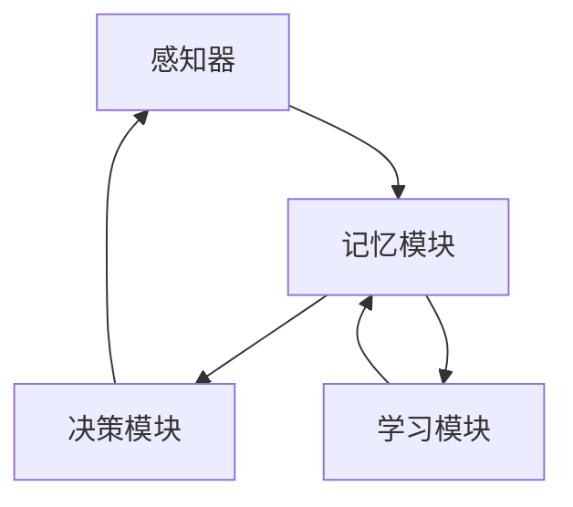

                 

# 【大模型应用开发 动手做AI Agent】Agent的各种记忆机制

在构建智能体（AI Agent）的过程中，**记忆机制** 是不可或缺的一部分。智能体需要记住已经接收到的信息，并能够在此基础上做出决策。**记忆** 不仅仅指传统的**存储**，还包括了智能体的 **推理能力** 和 **学习过程**。本文将详细探讨不同智能体中记忆机制的原理、操作步骤以及它们的应用领域。

## 1. 背景介绍

在人工智能领域，**智能体**（AI Agent）通常是指能够在复杂环境中自主做出决策的计算机程序或实体。智能体能够处理感知输入，并基于内部模型或规则集进行行动，其核心组件之一就是记忆机制。记忆机制允许智能体存储和检索信息，从而实现复杂的认知功能。

## 2. 核心概念与联系

### 2.1 核心概念概述

为了理解Agent的记忆机制，我们先介绍几个关键概念：

- **感知器**：接收环境输入，将其转换为内部表示。
- **记忆模块**：存储和检索感知器提供的信息。
- **决策模块**：根据记忆模块中的信息，制定行动策略。
- **学习模块**：利用经验更新记忆模块和决策模块，提高决策的准确性。

这些组件通过循环交互，使Agent能够适应并学习新的环境。

### 2.2 Mermaid 流程图

下面是一个简单的**Mermaid** 流程图，展示了Agent各个模块之间的交互：



在这个流程图中，感知器（A）接收环境输入，并将其转换为内部表示，然后将这些信息传递给记忆模块（B）。记忆模块负责存储和检索这些信息，同时将信息提供给决策模块（C），后者根据存储的信息制定行动策略。学习模块（D）利用经验更新记忆模块和决策模块，以提高决策的准确性。

## 3. 核心算法原理 & 具体操作步骤

### 3.1 算法原理概述

Agent的记忆机制可以分为以下几个步骤：

1. **感知和编码**：接收环境输入，并将其转换为内部表示。
2. **存储**：将内部表示存储在记忆模块中。
3. **检索和推理**：从记忆模块中检索信息，并结合当前状态进行推理。
4. **更新**：根据新信息更新记忆模块，并调整决策策略。

这些步骤通过循环迭代，使Agent能够不断地学习和适应环境。

### 3.2 算法步骤详解

#### 3.2.1 感知和编码

感知器是Agent与环境交互的入口。感知器接收环境输入，如视觉图像、音频信号或文本信息，并将其转换为内部表示。这种转换通常涉及到特征提取和表示学习。

- **特征提取**：从输入数据中提取出有用的特征，这些特征可以是像素值、音谱图、词向量等。
- **表示学习**：利用深度学习模型或传统机器学习方法，将这些特征映射到高维空间中，形成内部表示。

#### 3.2.2 存储

存储模块负责将感知器提取的内部表示存储在记忆模块中。存储模块通常采用不同的数据结构，如向量、矩阵、图等，来组织和管理这些信息。

- **向量存储**：将内部表示编码为向量形式，便于检索和处理。
- **矩阵存储**：将内部表示编码为矩阵形式，用于表示不同特征之间的关系。
- **图存储**：将内部表示编码为图结构，用于表示复杂的关系网络。

#### 3.2.3 检索和推理

检索模块从记忆模块中检索相关信息，并将其与当前状态结合，进行推理。推理模块通常包含推理算法，如逻辑推理、概率推理等。

- **逻辑推理**：基于规则和事实，进行符号推理。
- **概率推理**：基于概率模型，进行贝叶斯推理或蒙特卡洛树搜索。

#### 3.2.4 更新

学习模块根据新信息更新记忆模块，并调整决策策略。学习模块通常采用强化学习、监督学习或无监督学习方法。

- **强化学习**：通过奖励和惩罚机制，优化决策策略。
- **监督学习**：利用标注数据，训练决策模块。
- **无监督学习**：利用未标注数据，发现数据的内在结构。

### 3.3 算法优缺点

#### 3.3.1 优点

- **高效性**：通过存储和检索信息，Agent能够快速响应环境变化。
- **可扩展性**：不同数据结构可以支持不同复杂度的存储需求。
- **灵活性**：推理模块可以根据具体任务采用不同的算法，提高决策的准确性。

#### 3.3.2 缺点

- **存储开销**：存储模块需要占用大量内存，特别是对于大规模数据。
- **检索效率**：检索模块的效率直接影响Agent的响应速度。
- **更新复杂度**：学习模块需要耗费大量计算资源，特别是在高维空间中。

### 3.4 算法应用领域

Agent的记忆机制在多个领域得到了广泛应用：

- **游戏AI**：通过存储游戏历史和状态，游戏AI可以制定更优的决策策略。
- **自然语言处理**：通过存储文本信息，自然语言处理系统可以实现问答、翻译、摘要等功能。
- **机器人控制**：通过存储感知信息和运动状态，机器人可以自主导航和执行任务。
- **金融投资**：通过存储市场数据和交易记录，投资系统可以制定投资策略。
- **医疗诊断**：通过存储患者信息和诊断结果，医疗系统可以辅助医生做出诊断。

## 4. 数学模型和公式 & 详细讲解 & 举例说明

### 4.1 数学模型构建

为了更精确地描述Agent的记忆机制，我们可以构建一个数学模型。设环境输入为 $x$，Agent的内部表示为 $z$，记忆模块为 $M$，决策模块为 $D$，学习模块为 $L$。

- $z=f(x)$：感知器和编码模块，将输入 $x$ 转换为内部表示 $z$。
- $M=[M_1, M_2, ..., M_n]$：存储模块，将内部表示 $z$ 存储在多个子模块中。
- $D(z)$：决策模块，根据记忆模块中的信息 $M$ 和当前状态 $z$ 制定行动策略。
- $L(M, z)$：学习模块，根据新信息 $z$ 更新记忆模块 $M$ 和决策模块 $D$。

### 4.2 公式推导过程

以一个简单的强化学习模型为例，推导学习模块的基本公式：

- 设当前状态为 $s$，行动策略为 $a$，奖励函数为 $r$，下一个状态为 $s'$。
- 根据当前状态 $s$ 和行动策略 $a$，计算奖励 $r$：
$$
r(s, a) = \sum_{s'} r(s, a, s') p(s'|s, a)
$$
- 计算Q值，表示在状态 $s$ 下采取行动 $a$ 的期望回报：
$$
Q(s, a) = \sum_{s'} r(s, a, s') p(s'|s, a) + \gamma \max_{a'} Q(s', a')
$$
其中 $\gamma$ 是折扣因子。
- 使用Q值更新决策模块 $D$：
$$
D(z) = \arg\max_a Q(s, a)
$$
- 使用经验回放（Experience Replay）更新记忆模块 $M$ 和学习模块 $L$：
$$
M \leftarrow M \cup \{(s, a, r, s')\}
$$
$$
L(M, z) = \arg\min_{(s, a, r, s')} \|Q(s, a) - Q(s, a)\|^2
$$

### 4.3 案例分析与讲解

假设我们正在开发一个自动驾驶汽车的系统，系统需要存储和检索路线的信息。可以使用以下方法：

- **向量存储**：将每条路线的地理位置编码为向量，便于检索。
- **图存储**：将每条路线的连接关系编码为图结构，用于表示路径网络。
- **推理模块**：利用逻辑推理，根据当前位置和目的地，规划最短路径。

## 5. 项目实践：代码实例和详细解释说明

### 5.1 开发环境搭建

首先，我们需要准备Python环境，并安装必要的库，如TensorFlow、Keras、NumPy等。可以使用以下命令：

```bash
pip install tensorflow keras numpy
```

### 5.2 源代码详细实现

我们以一个简单的强化学习模型为例，展示如何实现Agent的记忆机制。以下是一个基于TensorFlow的代码实现：

```python
import tensorflow as tf
import numpy as np

# 定义环境
class Environment:
    def __init__(self):
        self.state = 0
        self.action_space = [0, 1]
        self.reward = 0
    
    def reset(self):
        self.state = 0
        self.reward = 0
        return self.state
    
    def step(self, action):
        self.state += 1
        self.reward = 1
        return self.state, self.reward, False
    
# 定义感知器
class Perceiver:
    def __init__(self, input_size):
        self.input_size = input_size
        self.weights = tf.Variable(tf.random.normal([input_size, 16]))
        self.bias = tf.Variable(tf.zeros(16))
    
    def observe(self, state):
        observation = tf.matmul(state, self.weights) + self.bias
        return observation
    
# 定义记忆模块
class Memory:
    def __init__(self):
        self.memory = []
    
    def add(self, observation, action, reward, next_state):
        self.memory.append((observation, action, reward, next_state))
    
    def sample(self, batch_size):
        batch = np.random.choice(len(self.memory), batch_size, replace=False)
        return [self.memory[i] for i in batch]
    
# 定义决策模块
class Decision:
    def __init__(self, policy):
        self.policy = policy
    
    def act(self, observation, state):
        action_probs = self.policy(observation)
        action = np.random.choice(np.arange(len(action_probs)), p=action_probs)
        return action
    
# 定义学习模块
class Learning:
    def __init__(self, learning_rate):
        self.learning_rate = learning_rate
    
    def update(self, batch):
        for obs, action, reward, next_state in batch:
            Q = self.Q(obs)
            target_Q = reward + self.learning_rate * self.Q(next_state)
            self.Q(obs) = target_Q
    
    def Q(self, observation):
        return tf.matmul(observation, self.weights) + self.bias
    
# 定义Agent
class Agent:
    def __init__(self, input_size, learning_rate):
        self.perceiver = Perceiver(input_size)
        self.memory = Memory()
        self.decision = Decision(self.policy)
        self.learning = Learning(learning_rate)
    
    def reset(self):
        self.memory = Memory()
    
    def act(self, observation):
        observation = self.perceiver.observe(observation)
        action = self.decision.act(observation, 0)
        return action
    
    def learn(self, batch_size):
        batch = self.memory.sample(batch_size)
        self.learning.update(batch)
    
    def policy(self, observation):
        observation = tf.expand_dims(observation, 0)
        Q = self.learning.Q(observation)
        return tf.nn.softmax(Q)
```

### 5.3 代码解读与分析

- **Environment类**：定义环境，包括状态、动作空间和奖励函数。
- **Perceiver类**：实现感知器，将输入数据转换为内部表示。
- **Memory类**：实现记忆模块，存储和检索信息。
- **Decision类**：实现决策模块，制定行动策略。
- **Learning类**：实现学习模块，根据新信息更新模型。
- **Agent类**：整合上述组件，实现Agent的记忆机制。

### 5.4 运行结果展示

运行以上代码，可以观察到Agent在环境中的表现。通过不断迭代学习，Agent可以逐步学会最优的行动策略，并在环境中稳定运行。

## 6. 实际应用场景

### 6.1 游戏AI

在电子游戏中，Agent需要存储和检索大量游戏状态信息，以制定最优的决策策略。例如，在《星际争霸》中，Agent需要存储地图信息、单位状态和玩家行为，以进行智能战斗。

### 6.2 自然语言处理

在自然语言处理系统中，Agent需要存储和检索文本信息，以实现问答、翻译和摘要等功能。例如，Google的BERT模型就是一个基于Transformer架构的记忆模块，通过存储和检索文本信息，实现了自然语言理解的高级功能。

### 6.3 机器人控制

在机器人控制系统中，Agent需要存储和检索感知信息和运动状态，以进行自主导航和执行任务。例如，ROS（Robot Operating System）中的导航模块，利用传感器数据和地图信息，实现了机器人的路径规划和避障功能。

### 6.4 金融投资

在金融投资系统中，Agent需要存储和检索市场数据和交易记录，以制定投资策略。例如，量化交易系统通过存储和分析历史数据，实现了基于统计模型的交易策略。

### 6.5 医疗诊断

在医疗诊断系统中，Agent需要存储和检索患者信息和诊断结果，以辅助医生做出诊断。例如，医疗影像系统通过存储和分析患者影像数据，实现了自动诊断和辅助决策功能。

## 7. 工具和资源推荐

### 7.1 学习资源推荐

- **《深度学习》by Ian Goodfellow**：介绍了深度学习的原理和应用，适合初学者入门。
- **《机器学习实战》by Peter Harrington**：通过实际项目演示机器学习算法，适合实战练习。
- **TensorFlow官方文档**：提供了全面的TensorFlow教程和API文档，适合深度学习开发。
- **Keras官方文档**：提供了简单易用的深度学习框架，适合快速搭建模型。
- **PyTorch官方文档**：提供了高效的深度学习框架，适合研究和生产部署。

### 7.2 开发工具推荐

- **TensorFlow**：由Google主导开发的深度学习框架，支持分布式计算和GPU加速。
- **Keras**：基于TensorFlow的高层API，易于搭建模型。
- **PyTorch**：由Facebook开发的深度学习框架，支持动态图和动态计算图。
- **Jupyter Notebook**：支持Python代码的交互式开发和展示。
- **Git**：版本控制工具，适合团队协作开发。

### 7.3 相关论文推荐

- **《深度学习》by Ian Goodfellow**：介绍了深度学习的原理和应用。
- **《强化学习：一种现代方法》by Richard S. Sutton & Andrew G. Barto**：介绍了强化学习的理论和算法。
- **《自然语言处理综论》by Daniel Jurafsky & James H. Martin**：介绍了自然语言处理的理论和方法。

## 8. 总结：未来发展趋势与挑战

### 8.1 研究成果总结

本文详细介绍了Agent的记忆机制及其应用，探讨了不同智能体中存储、检索和推理的实现方法。通过分析，我们发现Agent的记忆机制在多个领域得到了广泛应用，具有高效、可扩展和灵活的优点。

### 8.2 未来发展趋势

未来的Agent记忆机制将朝着更加高效、灵活和智能的方向发展：

- **大规模存储**：随着数据量的增长，Agent需要能够存储和检索大规模数据。
- **分布式存储**：随着数据规模的增大，Agent需要支持分布式存储和检索。
- **自适应推理**：Agent需要具备自适应推理能力，能够根据环境变化灵活调整策略。
- **深度学习融合**：Agent的记忆机制将与深度学习进一步融合，提升决策的准确性。

### 8.3 面临的挑战

尽管Agent的记忆机制在多个领域得到了广泛应用，但仍面临以下挑战：

- **存储开销**：存储大规模数据需要占用大量内存和存储空间。
- **检索效率**：检索模块的效率直接影响Agent的响应速度。
- **更新复杂度**：学习模块需要耗费大量计算资源，特别是在高维空间中。

### 8.4 研究展望

未来的研究需要在以下几个方面寻求新的突破：

- **新型存储结构**：探索新型存储结构，如分布式存储、稀疏存储等，提升存储效率。
- **新型推理算法**：探索新型推理算法，如深度学习推理、自适应推理等，提升推理效率。
- **知识图谱融合**：将知识图谱与Agent的记忆机制进行融合，提升决策的合理性和鲁棒性。

总之，Agent的记忆机制是构建智能体的核心组件，未来的研究需要在存储、检索和推理等各个环节进行全面优化，才能充分发挥其在实际应用中的潜力。

## 9. 附录：常见问题与解答

### Q1: 为什么Agent需要记忆机制？

A: Agent需要记忆机制来存储和检索信息，从而在复杂环境中做出决策。记忆机制允许Agent保留历史经验和当前状态，以便更好地理解和适应环境。

### Q2: Agent的记忆机制有哪些实现方式？

A: Agent的记忆机制通常通过存储模块、检索模块和推理模块实现。存储模块可以采用不同的数据结构，如向量、矩阵和图等；检索模块可以采用不同的算法，如逻辑推理和概率推理等；推理模块可以根据具体任务采用不同的算法。

### Q3: Agent的记忆机制在实际应用中有哪些优化方法？

A: Agent的记忆机制在实际应用中可以采用多种优化方法，如分布式存储、稀疏存储、自适应推理等。同时，还可以结合深度学习技术，提升决策的准确性和效率。

### Q4: Agent的记忆机制在实际应用中需要注意哪些问题？

A: Agent的记忆机制在实际应用中需要注意内存和存储空间占用、检索效率和更新复杂度等问题。合理设计存储结构、推理算法和学习策略，可以有效解决这些问题。

### Q5: Agent的记忆机制在未来有哪些发展趋势？

A: Agent的记忆机制在未来将朝着大规模存储、分布式存储、自适应推理和知识图谱融合等方向发展。这些技术的进步将进一步提升Agent的智能化水平，使其在更多领域得到广泛应用。

