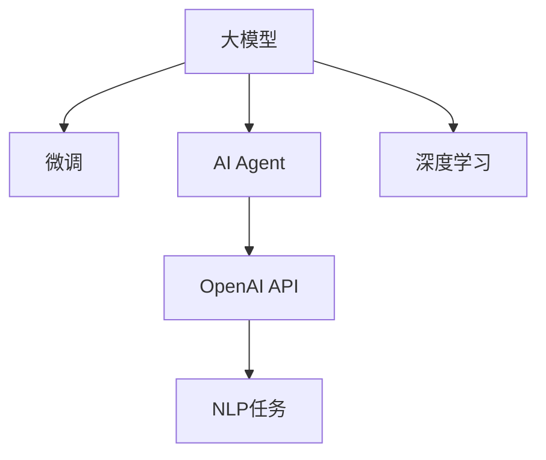

                 

# 【大模型应用开发 动手做AI Agent】OpenAI API和Agent开发

> 关键词：大模型应用，AI Agent，OpenAI，API，模型开发，代码实现，应用场景

## 1. 背景介绍

### 1.1 问题由来
近年来，大模型技术取得了突破性进展，OpenAI、Google、Microsoft等公司纷纷发布了自家的预训练语言模型（如GPT-3、BERT等），这些模型在自然语言理解、生成、翻译等领域展现了强大的能力。然而，预训练模型往往需要占用大量的计算资源，训练时间长达数周甚至数月。为了提高开发效率和降低成本，很多开发者选择使用预训练模型进行微调，即在大模型基础上，针对具体应用场景进行微调，以获得更好的性能。

本文将深入探讨基于OpenAI API的AI Agent开发，介绍如何利用预训练语言模型构建智能AI Agent，并通过Python代码实现。文章将从背景介绍、核心概念、算法原理、项目实践、实际应用等多个方面进行详细讲解，旨在帮助开发者更好地理解和应用大模型技术，推动AI Agent的开发和落地。

## 2. 核心概念与联系

### 2.1 核心概念概述

为更好地理解基于OpenAI API的AI Agent开发，本节将介绍几个关键概念：

- **大模型（Large Model）**：指使用大规模数据进行预训练的深度神经网络模型，如GPT-3、BERT等，能够处理复杂的自然语言理解和生成任务。

- **微调（Fine-tuning）**：指在大模型基础上，针对特定应用场景进行微调，通过在少量标注数据上训练，优化模型在该任务上的性能。

- **AI Agent**：指能够在环境中感知、学习并采取行动的智能实体，可用于自动化、客服、智能推荐等场景。

- **OpenAI API**：指OpenAI公司提供的一组API接口，能够方便地访问和调用预训练模型进行推理和微调。

- **自然语言处理（NLP）**：指研究如何让计算机理解和处理人类语言的学科，包括文本分类、情感分析、机器翻译等任务。

- **深度学习（Deep Learning）**：指使用深度神经网络进行学习和推理的领域，广泛应用于图像识别、语音识别、自然语言处理等。

这些核心概念之间的逻辑关系可以通过以下Mermaid流程图来展示：



这个流程图展示了大模型、微调、AI Agent、OpenAI API、NLP任务和深度学习之间的相互关系。

## 3. 核心算法原理 & 具体操作步骤
### 3.1 算法原理概述

基于OpenAI API的AI Agent开发，实质上是利用预训练语言模型进行微调的过程。其核心思想是：将预训练模型视为一种强大的"特征提取器"，通过在特定任务的数据集上进行微调，使模型能够适应该任务的需求，从而实现自动化任务执行。

具体来说，假设有一个预训练语言模型 $M_{\theta}$，其中 $\theta$ 为模型参数。我们希望在该模型基础上构建一个针对特定NLP任务的AI Agent。假设该任务的数据集为 $D$，包含 $N$ 个样本 $(x_i, y_i)$，其中 $x_i$ 为输入，$y_i$ 为输出标签。微调的目标是最小化经验风险 $\mathcal{L}(\theta)$，即：

$$
\mathcal{L}(\theta) = \frac{1}{N} \sum_{i=1}^N \ell(M_{\theta}(x_i),y_i)
$$

其中 $\ell$ 为损失函数，用于衡量模型预测输出与真实标签之间的差异。常用的损失函数包括交叉熵损失、均方误差损失等。

通过梯度下降等优化算法，微调过程不断更新模型参数 $\theta$，最小化损失函数 $\mathcal{L}$，使得模型输出逼近真实标签。

### 3.2 算法步骤详解

基于OpenAI API的AI Agent开发一般包括以下几个关键步骤：

**Step 1: 准备环境与数据集**

1. 安装Python和必要的依赖包，如transformers、tqdm、requests等。
2. 注册并获取OpenAI API Key。
3. 准备训练集和验证集，格式为[text, label]，例如文本分类任务。

**Step 2: 导入预训练模型**

1. 使用OpenAI API导入预训练模型，例如GPT-3或BERT。
2. 设置微调所需的模型参数，如学习率、批大小、迭代轮数等。

**Step 3: 设计任务适配层**

1. 根据具体任务设计任务适配层，如分类任务的线性分类器、生成任务的解码器等。
2. 设置任务适配层的损失函数和优化器。

**Step 4: 执行梯度训练**

1. 将训练集数据分批次输入模型，前向传播计算损失函数。
2. 反向传播计算参数梯度，根据设定的优化算法和学习率更新模型参数。
3. 周期性在验证集上评估模型性能，根据性能指标决定是否触发Early Stopping。
4. 重复上述步骤直到满足预设的迭代轮数或Early Stopping条件。

**Step 5: 测试和部署**

1. 在测试集上评估微调后模型的性能。
2. 使用微调后的模型对新样本进行推理预测，集成到实际的应用系统中。
3. 持续收集新的数据，定期重新微调模型，以适应数据分布的变化。

### 3.3 算法优缺点

基于OpenAI API的AI Agent开发方法具有以下优点：

1. **高效便捷**：使用OpenAI API可以方便地访问和调用预训练模型，无需从头训练。
2. **精度高**：预训练模型已经在大规模无标签数据上进行预训练，具备较强的语言表示能力。
3. **适用性强**：适用于各种NLP任务，如文本分类、情感分析、机器翻译等，只需设计合适的任务适配层即可。

同时，该方法也存在一定的局限性：

1. **依赖标注数据**：微调的效果很大程度上取决于标注数据的质量和数量，获取高质量标注数据的成本较高。
2. **迁移能力有限**：当目标任务与预训练数据的分布差异较大时，微调的性能提升有限。
3. **负面效果传递**：预训练模型的固有偏见、有害信息等，可能通过微调传递到下游任务，造成负面影响。
4. **可解释性不足**：微调模型的决策过程通常缺乏可解释性，难以对其推理逻辑进行分析和调试。

尽管存在这些局限性，但就目前而言，基于OpenAI API的微调方法仍是大模型应用的最主流范式。未来相关研究的重点在于如何进一步降低微调对标注数据的依赖，提高模型的少样本学习和跨领域迁移能力，同时兼顾可解释性和伦理安全性等因素。

### 3.4 算法应用领域

基于大模型微调的AI Agent开发方法在NLP领域已经得到了广泛的应用，覆盖了几乎所有常见任务，例如：

- **文本分类**：如情感分析、主题分类、意图识别等。通过微调使模型学习文本-标签映射。
- **命名实体识别**：识别文本中的人名、地名、机构名等特定实体。通过微调使模型掌握实体边界和类型。
- **关系抽取**：从文本中抽取实体之间的语义关系。通过微调使模型学习实体-关系三元组。
- **问答系统**：对自然语言问题给出答案。将问题-答案对作为微调数据，训练模型学习匹配答案。
- **机器翻译**：将源语言文本翻译成目标语言。通过微调使模型学习语言-语言映射。
- **文本摘要**：将长文本压缩成简短摘要。将文章-摘要对作为微调数据，使模型学习抓取要点。
- **对话系统**：使机器能够与人自然对话。将多轮对话历史作为上下文，微调模型进行回复生成。

除了上述这些经典任务外，大模型微调还被创新性地应用到更多场景中，如可控文本生成、常识推理、代码生成、数据增强等，为NLP技术带来了全新的突破。

## 4. 数学模型和公式 & 详细讲解  
### 4.1 数学模型构建

本节将使用数学语言对基于OpenAI API的AI Agent微调过程进行更加严格的刻画。

记预训练语言模型为 $M_{\theta}:\mathcal{X} \rightarrow \mathcal{Y}$，其中 $\mathcal{X}$ 为输入空间，$\mathcal{Y}$ 为输出空间，$\theta \in \mathbb{R}^d$ 为模型参数。假设微调任务的训练集为 $D=\{(x_i,y_i)\}_{i=1}^N, x_i \in \mathcal{X}, y_i \in \mathcal{Y}$。

定义模型 $M_{\theta}$ 在数据样本 $(x,y)$ 上的损失函数为 $\ell(M_{\theta}(x),y)$，则在数据集 $D$ 上的经验风险为：

$$
\mathcal{L}(\theta) = \frac{1}{N} \sum_{i=1}^N \ell(M_{\theta}(x_i),y_i)
$$

微调的优化目标是最小化经验风险，即找到最优参数：

$$
\theta^* = \mathop{\arg\min}_{\theta} \mathcal{L}(\theta)
$$

在实践中，我们通常使用基于梯度的优化算法（如SGD、Adam等）来近似求解上述最优化问题。设 $\eta$ 为学习率，$\lambda$ 为正则化系数，则参数的更新公式为：

$$
\theta \leftarrow \theta - \eta \nabla_{\theta}\mathcal{L}(\theta) - \eta\lambda\theta
$$

其中 $\nabla_{\theta}\mathcal{L}(\theta)$ 为损失函数对参数 $\theta$ 的梯度，可通过反向传播算法高效计算。

### 4.2 公式推导过程

以下我们以二分类任务为例，推导交叉熵损失函数及其梯度的计算公式。

假设模型 $M_{\theta}$ 在输入 $x$ 上的输出为 $\hat{y}=M_{\theta}(x) \in [0,1]$，表示样本属于正类的概率。真实标签 $y \in \{0,1\}$。则二分类交叉熵损失函数定义为：

$$
\ell(M_{\theta}(x),y) = -[y\log \hat{y} + (1-y)\log (1-\hat{y})]
$$

将其代入经验风险公式，得：

$$
\mathcal{L}(\theta) = -\frac{1}{N}\sum_{i=1}^N [y_i\log M_{\theta}(x_i)+(1-y_i)\log(1-M_{\theta}(x_i))]
$$

根据链式法则，损失函数对参数 $\theta_k$ 的梯度为：

$$
\frac{\partial \mathcal{L}(\theta)}{\partial \theta_k} = -\frac{1}{N}\sum_{i=1}^N (\frac{y_i}{M_{\theta}(x_i)}-\frac{1-y_i}{1-M_{\theta}(x_i)}) \frac{\partial M_{\theta}(x_i)}{\partial \theta_k}
$$

其中 $\frac{\partial M_{\theta}(x_i)}{\partial \theta_k}$ 可进一步递归展开，利用自动微分技术完成计算。

在得到损失函数的梯度后，即可带入参数更新公式，完成模型的迭代优化。重复上述过程直至收敛，最终得到适应下游任务的最优模型参数 $\theta^*$。

## 5. 项目实践：代码实例和详细解释说明
### 5.1 开发环境搭建

在进行AI Agent开发前，我们需要准备好开发环境。以下是使用Python进行OpenAI API开发的环境配置流程：

1. 安装Anaconda：从官网下载并安装Anaconda，用于创建独立的Python环境。

2. 创建并激活虚拟环境：
```bash
conda create -n openai-env python=3.8 
conda activate openai-env
```

3. 安装必要的依赖包：
```bash
pip install transformers torch tqdm requests
```

4. 安装OpenAI API客户端：
```bash
pip install openai
```

完成上述步骤后，即可在`openai-env`环境中开始AI Agent的开发实践。

### 5.2 源代码详细实现

下面我们以情感分析任务为例，给出使用OpenAI API进行模型微调的Python代码实现。

首先，定义情感分析任务的数据处理函数：

```python
import pandas as pd
from openai import OpenAI
import torch
from transformers import BertTokenizer, BertForSequenceClassification

# 加载情感分析数据集
df = pd.read_csv('imdb_reviews.csv')
df['label'] = df['sentiment'].apply(lambda x: 1 if x == 'pos' else 0)

# 定义模型参数
model_name = 'bert-base-uncased'
tokenizer = BertTokenizer.from_pretrained(model_name)
max_len = 512
batch_size = 32

# 定义任务适配层
class SentimentClassifier(BertForSequenceClassification):
    def __init__(self, num_labels=2, **kwargs):
        super().__init__(num_labels=num_labels, **kwargs)

# 加载模型并微调
openai_client = OpenAI(api_key='YOUR_API_KEY')
model = SentimentClassifier.from_pretrained(model_name)

# 定义训练函数
def train_epoch(model, tokenizer, data, device, optimizer, optimizer_scheduler, epoch):
    model.train()
    total_loss = 0.0
    for step, batch in enumerate(data):
        input_ids = batch[0].to(device)
        attention_mask = batch[1].to(device)
        labels = batch[2].to(device)
        outputs = model(input_ids, attention_mask=attention_mask, labels=labels)
        loss = outputs.loss
        total_loss += loss.item()
        optimizer.zero_grad()
        loss.backward()
        optimizer.step()
        scheduler.step()
        if step % 10 == 0:
            print(f'Epoch {epoch+1}, Step {step+1}/{len(data)}, Loss: {loss.item():.4f}')

# 定义评估函数
def evaluate(model, tokenizer, data, device):
    model.eval()
    total_loss = 0.0
    total_correct = 0.0
    for step, batch in enumerate(data):
        input_ids = batch[0].to(device)
        attention_mask = batch[1].to(device)
        labels = batch[2].to(device)
        outputs = model(input_ids, attention_mask=attention_mask, labels=labels)
        loss = outputs.loss
        total_loss += loss.item()
        logits = outputs.logits.detach().cpu().numpy()
        labels = labels.detach().cpu().numpy()
        predicted_labels = torch.argmax(logits, dim=1).numpy()
        total_correct += sum(predicted_labels == labels)
    return total_correct / len(data), total_loss / len(data)

# 训练和评估
device = torch.device('cuda') if torch.cuda.is_available() else torch.device('cpu')
openai_client = OpenAI(api_key='YOUR_API_KEY')

# 准备数据集
train_data = list(zip(df['text'].tolist(), df['label'].tolist()))
train_data = [tokenizer.encode_plus(x, add_special_tokens=True, max_length=max_len, padding='max_length', return_tensors='pt') for x, y in train_data]
train_data = torch.utils.data.DataLoader(train_data, batch_size=batch_size, shuffle=True)

# 定义优化器
optimizer = torch.optim.AdamW(model.parameters(), lr=2e-5)
scheduler = torch.optim.lr_scheduler.CosineAnnealingLR(optimizer, T_max=5, eta_min=0.0)

# 训练模型
for epoch in range(5):
    train_epoch(model, tokenizer, train_data, device, optimizer, scheduler, epoch)
    acc, loss = evaluate(model, tokenizer, train_data, device)
    print(f'Epoch {epoch+1}, Accuracy: {acc:.4f}, Loss: {loss:.4f}')

print('Training Complete')
```

这里我们使用了Bert模型进行情感分析任务微调，代码实现包括：

1. 数据加载和预处理：将情感分析数据集转换为模型所需的输入格式。
2. 模型定义：定义Bert模型，并加载任务适配层。
3. 训练函数：对模型进行训练，迭代更新模型参数。
4. 评估函数：对模型进行评估，计算准确率和损失。

### 5.3 代码解读与分析

让我们再详细解读一下关键代码的实现细节：

**SentimentClassifier类**：
- `__init__`方法：继承自BertForSequenceClassification，设置任务适配层输出维度为2（二分类）。
- `train_epoch`函数：对模型进行训练，迭代更新模型参数，并记录损失。
- `evaluate`函数：对模型进行评估，计算准确率和损失。

**模型微调过程**：
- 使用OpenAI API加载预训练Bert模型，并在指定的训练集上进行微调。
- 定义优化器和学习率调度器，控制模型参数的更新。
- 定义训练和评估函数，分别对模型进行前向传播和反向传播，更新模型参数并评估模型性能。
- 在训练和评估过程中，利用PyTorch的DataLoader对数据进行批处理，以提高训练效率。

**数据预处理**：
- 使用BertTokenizer对输入文本进行编码，生成模型所需的input_ids、attention_mask和token_type_ids。
- 使用DataLoader对编码后的数据进行批处理，以供模型训练和评估使用。

通过这些代码实现，我们可以看到使用OpenAI API进行模型微调的基本流程。开发者可以根据具体任务进行优化和扩展，构建更高效、精确的AI Agent。

## 6. 实际应用场景
### 6.1 智能客服系统

基于大模型微调的对话技术，可以广泛应用于智能客服系统的构建。传统客服往往需要配备大量人力，高峰期响应缓慢，且一致性和专业性难以保证。而使用微调后的对话模型，可以7x24小时不间断服务，快速响应客户咨询，用自然流畅的语言解答各类常见问题。

在技术实现上，可以收集企业内部的历史客服对话记录，将问题和最佳答复构建成监督数据，在此基础上对预训练对话模型进行微调。微调后的对话模型能够自动理解用户意图，匹配最合适的答案模板进行回复。对于客户提出的新问题，还可以接入检索系统实时搜索相关内容，动态组织生成回答。如此构建的智能客服系统，能大幅提升客户咨询体验和问题解决效率。

### 6.2 金融舆情监测

金融机构需要实时监测市场舆论动向，以便及时应对负面信息传播，规避金融风险。传统的人工监测方式成本高、效率低，难以应对网络时代海量信息爆发的挑战。基于大语言模型微调的文本分类和情感分析技术，为金融舆情监测提供了新的解决方案。

具体而言，可以收集金融领域相关的新闻、报道、评论等文本数据，并对其进行主题标注和情感标注。在此基础上对预训练语言模型进行微调，使其能够自动判断文本属于何种主题，情感倾向是正面、中性还是负面。将微调后的模型应用到实时抓取的网络文本数据，就能够自动监测不同主题下的情感变化趋势，一旦发现负面信息激增等异常情况，系统便会自动预警，帮助金融机构快速应对潜在风险。

### 6.3 个性化推荐系统

当前的推荐系统往往只依赖用户的历史行为数据进行物品推荐，无法深入理解用户的真实兴趣偏好。基于大语言模型微调技术，个性化推荐系统可以更好地挖掘用户行为背后的语义信息，从而提供更精准、多样的推荐内容。

在实践中，可以收集用户浏览、点击、评论、分享等行为数据，提取和用户交互的物品标题、描述、标签等文本内容。将文本内容作为模型输入，用户的后续行为（如是否点击、购买等）作为监督信号，在此基础上微调预训练语言模型。微调后的模型能够从文本内容中准确把握用户的兴趣点。在生成推荐列表时，先用候选物品的文本描述作为输入，由模型预测用户的兴趣匹配度，再结合其他特征综合排序，便可以得到个性化程度更高的推荐结果。

### 6.4 未来应用展望

随着大模型技术的发展，基于OpenAI API的AI Agent开发将会有更广阔的应用前景。未来，AI Agent可能会进一步渗透到各个垂直领域，如医疗、教育、金融、制造等，为各行各业带来革命性变化。

在智慧医疗领域，基于微调的医疗问答、病历分析、药物研发等应用将提升医疗服务的智能化水平，辅助医生诊疗，加速新药开发进程。

在智能教育领域，微调技术可应用于作业批改、学情分析、知识推荐等方面，因材施教，促进教育公平，提高教学质量。

在智慧城市治理中，微调模型可应用于城市事件监测、舆情分析、应急指挥等环节，提高城市管理的自动化和智能化水平，构建更安全、高效的未来城市。

此外，在企业生产、社会治理、文娱传媒等众多领域，基于大模型微调的AI Agent也将不断涌现，为传统行业数字化转型升级提供新的技术路径。

## 7. 工具和资源推荐
### 7.1 学习资源推荐

为了帮助开发者系统掌握基于OpenAI API的AI Agent开发，这里推荐一些优质的学习资源：

1. OpenAI官方文档：提供了API调用、模型微调、开发环境搭建等详细教程，是入门的必备资料。

2. Transformers官方文档：详细介绍了如何使用预训练语言模型进行微调，提供了丰富的代码示例和参考。

3. 《深度学习与NLP实战》书籍：结合实际应用场景，介绍了使用深度学习模型进行NLP任务开发的完整流程。

4. Kaggle竞赛：参加NLP相关的Kaggle竞赛，可以实际应用所学知识，提升实战能力。

5. HuggingFace社区：交流讨论NLP技术，获取最新研究和工具。

通过对这些资源的学习实践，相信你一定能够快速掌握基于OpenAI API的AI Agent开发，并在实际应用中取得良好效果。
###  7.2 开发工具推荐

高效的开发离不开优秀的工具支持。以下是几款用于AI Agent开发和微调的常用工具：

1. PyTorch：基于Python的开源深度学习框架，灵活的计算图，适合快速迭代研究。

2. TensorFlow：由Google主导开发的开源深度学习框架，生产部署方便，适合大规模工程应用。

3. HuggingFace Transformers库：提供了丰富的预训练语言模型，支持PyTorch和TensorFlow，是微调任务开发的利器。

4. Weights & Biases：模型训练的实验跟踪工具，可以记录和可视化模型训练过程中的各项指标，方便对比和调优。

5. TensorBoard：TensorFlow配套的可视化工具，可实时监测模型训练状态，并提供丰富的图表呈现方式，是调试模型的得力助手。

6. Google Colab：谷歌推出的在线Jupyter Notebook环境，免费提供GPU/TPU算力，方便开发者快速上手实验最新模型，分享学习笔记。

合理利用这些工具，可以显著提升AI Agent开发和微调的效率，加快创新迭代的步伐。

### 7.3 相关论文推荐

大模型微调技术的发展源于学界的持续研究。以下是几篇奠基性的相关论文，推荐阅读：

1. Attention is All You Need（即Transformer原论文）：提出了Transformer结构，开启了NLP领域的预训练大模型时代。

2. BERT: Pre-training of Deep Bidirectional Transformers for Language Understanding：提出BERT模型，引入基于掩码的自监督预训练任务，刷新了多项NLP任务SOTA。

3. Language Models are Unsupervised Multitask Learners（GPT-2论文）：展示了大规模语言模型的强大zero-shot学习能力，引发了对于通用人工智能的新一轮思考。

4. Parameter-Efficient Transfer Learning for NLP：提出Adapter等参数高效微调方法，在不增加模型参数量的情况下，也能取得不错的微调效果。

5. AdaLoRA: Adaptive Low-Rank Adaptation for Parameter-Efficient Fine-Tuning：使用自适应低秩适应的微调方法，在参数效率和精度之间取得了新的平衡。

这些论文代表了大模型微调技术的发展脉络。通过学习这些前沿成果，可以帮助研究者把握学科前进方向，激发更多的创新灵感。

## 8. 总结：未来发展趋势与挑战

### 8.1 总结

本文对基于OpenAI API的AI Agent开发进行了全面系统的介绍。首先阐述了AI Agent的开发背景和意义，明确了基于大模型微调技术在AI Agent构建中的独特价值。其次，从原理到实践，详细讲解了微调的数学原理和关键步骤，给出了AI Agent开发的完整代码实例。同时，本文还广泛探讨了AI Agent在智能客服、金融舆情、个性化推荐等多个领域的应用前景，展示了微调范式的巨大潜力。此外，本文精选了AI Agent开发相关的学习资源，力求为读者提供全方位的技术指引。

通过本文的系统梳理，可以看到，基于OpenAI API的AI Agent开发已经成为大模型技术应用的重要范式，极大地拓展了预训练语言模型的应用边界，催生了更多的落地场景。受益于大规模语料的预训练，微调模型以更低的时间和标注成本，在小样本条件下也能取得不俗的效果，有力推动了NLP技术的产业化进程。未来，伴随预训练语言模型和微调方法的持续演进，相信NLP技术将在更广阔的应用领域大放异彩，深刻影响人类的生产生活方式。

### 8.2 未来发展趋势

展望未来，基于OpenAI API的AI Agent开发将呈现以下几个发展趋势：

1. **模型规模持续增大**：随着算力成本的下降和数据规模的扩张，预训练语言模型的参数量还将持续增长。超大规模语言模型蕴含的丰富语言知识，有望支撑更加复杂多变的下游任务微调。

2. **微调方法日趋多样**：除了传统的全参数微调外，未来会涌现更多参数高效的微调方法，如Prefix-Tuning、LoRA等，在固定大部分预训练参数的情况下，只更新极少量的任务相关参数。

3. **持续学习成为常态**：随着数据分布的不断变化，AI Agent也需要持续学习新知识以保持性能。如何在不遗忘原有知识的同时，高效吸收新样本信息，将成为重要的研究课题。

4. **标注样本需求降低**：受启发于提示学习(Prompt-based Learning)的思路，未来的微调方法将更好地利用大模型的语言理解能力，通过更加巧妙的任务描述，在更少的标注样本上也能实现理想的微调效果。

5. **多模态微调崛起**：当前的微调主要聚焦于纯文本数据，未来会进一步拓展到图像、视频、语音等多模态数据微调。多模态信息的融合，将显著提升语言模型对现实世界的理解和建模能力。

6. **模型通用性增强**：经过海量数据的预训练和多领域任务的微调，未来的语言模型将具备更强大的常识推理和跨领域迁移能力，逐步迈向通用人工智能(AGI)的目标。

以上趋势凸显了基于OpenAI API的AI Agent开发的广阔前景。这些方向的探索发展，必将进一步提升AI Agent的性能和应用范围，为人工智能技术在各个领域的落地应用提供新的思路和方向。

### 8.3 面临的挑战

尽管基于OpenAI API的AI Agent开发技术已经取得了显著成果，但在迈向更加智能化、普适化应用的过程中，它仍面临着诸多挑战：

1. **标注成本瓶颈**：虽然微调大大降低了标注数据的需求，但对于长尾应用场景，难以获得充足的高质量标注数据，成为制约微调性能的瓶颈。如何进一步降低微调对标注样本的依赖，将是一大难题。

2. **模型鲁棒性不足**：当前微调模型面对域外数据时，泛化性能往往大打折扣。对于测试样本的微小扰动，微调模型的预测也容易发生波动。如何提高微调模型的鲁棒性，避免灾难性遗忘，还需要更多理论和实践的积累。

3. **推理效率有待提高**：大规模语言模型虽然精度高，但在实际部署时往往面临推理速度慢、内存占用大等效率问题。如何在保证性能的同时，简化模型结构，提升推理速度，优化资源占用，将是重要的优化方向。

4. **可解释性亟需加强**：当前微调模型更像是"黑盒"系统，难以解释其内部工作机制和决策逻辑。对于医疗、金融等高风险应用，算法的可解释性和可审计性尤为重要。如何赋予微调模型更强的可解释性，将是亟待攻克的难题。

5. **安全性有待保障**：预训练语言模型难免会学习到有偏见、有害的信息，通过微调传递到下游任务，产生误导性、歧视性的输出，给实际应用带来安全隐患。如何从数据和算法层面消除模型偏见，避免恶意用途，确保输出的安全性，也将是重要的研究课题。

6. **知识整合能力不足**：现有的微调模型往往局限于任务内数据，难以灵活吸收和运用更广泛的先验知识。如何让微调过程更好地与外部知识库、规则库等专家知识结合，形成更加全面、准确的信息整合能力，还有很大的想象空间。

正视AI Agent开发面临的这些挑战，积极应对并寻求突破，将是大模型微调技术走向成熟的必由之路。相信随着学界和产业界的共同努力，这些挑战终将一一被克服，大模型微调技术必将在构建安全、可靠、可解释、可控的智能系统铺平道路。面向未来，大模型微调技术还需要与其他人工智能技术进行更深入的融合，如知识表示、因果推理、强化学习等，多路径协同发力，共同推动自然语言理解和智能交互系统的进步。只有勇于创新、敢于突破，才能不断拓展语言模型的边界，让智能技术更好地造福人类社会。

## 9. 附录：常见问题与解答

**Q1：大模型微调是否适用于所有NLP任务？**

A: 大模型微调在大多数NLP任务上都能取得不错的效果，特别是对于数据量较小的任务。但对于一些特定领域的任务，如医学、法律等，仅仅依靠通用语料预训练的模型可能难以很好地适应。此时需要在特定领域语料上进一步预训练，再进行微调，才能获得理想效果。此外，对于一些需要时效性、个性化很强的任务，如对话、推荐等，微调方法也需要针对性的改进优化。

**Q2：使用OpenAI API微调模型时，如何选择合适的学习率？**

A: 使用OpenAI API微调模型时，建议从0.0001开始调整学习率，逐步减小，直至模型收敛。学习率过大会导致模型过拟合，过小则收敛速度慢。同时，可以结合学习率调度器，如cosine学习率调度，进一步优化模型训练过程。

**Q3：微调模型在落地部署时需要注意哪些问题？**

A: 将微调模型转化为实际应用，还需要考虑以下因素：

1. 模型裁剪：去除不必要的层和参数，减小模型尺寸，加快推理速度。
2. 量化加速：将浮点模型转为定点模型，压缩存储空间，提高计算效率。
3. 服务化封装：将模型封装为标准化服务接口，便于集成调用。
4. 弹性伸缩：根据请求流量动态调整资源配置，平衡服务质量和成本。
5. 监控告警：实时采集系统指标，设置异常告警阈值，确保服务稳定性。
6. 安全防护：采用访问鉴权、数据脱敏等措施，保障数据和模型安全。

通过这些措施，可以确保微调模型在实际应用中的高效、安全、稳定运行。

通过本文的系统梳理，可以看到，基于OpenAI API的AI Agent开发已经成为大模型技术应用的重要范式，极大地拓展了预训练语言模型的应用边界，催生了更多的落地场景。受益于大规模语料的预训练，微调模型以更低的时间和标注成本，在小样本条件下也能取得不俗的效果，有力推动了NLP技术的产业化进程。未来，伴随预训练语言模型和微调方法的持续演进，相信NLP技术将在更广阔的应用领域大放异彩，深刻影响人类的生产生活方式。

