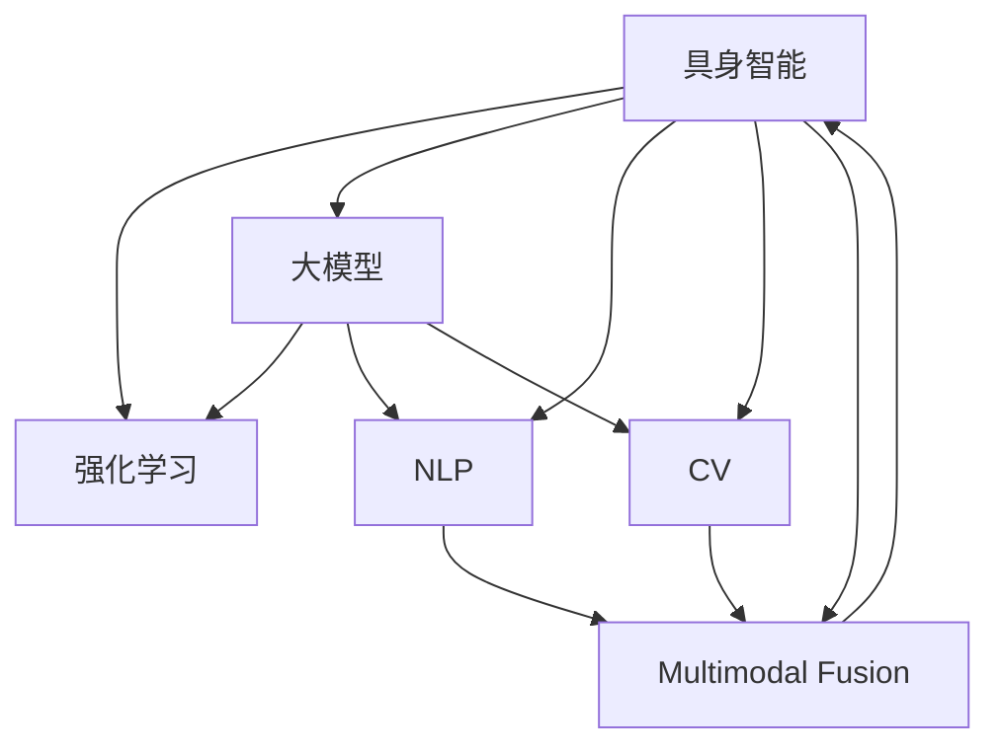

                 

# 【大模型应用开发 动手做AI Agent】具身智能的实现

> 关键词：具身智能(Agent-based Intelligence)、强化学习(Reinforcement Learning, RL)、大模型(Deep Model)、自然语言处理(Natural Language Processing, NLP)、计算机视觉(Computer Vision)、多模态融合(Multimodal Fusion)、动态优化(Dynamic Optimization)、人工智能(AI)、应用编程接口(API)、场景驱动(Scene-Driven)、算法优化(Algorithm Optimization)

## 1. 背景介绍

### 1.1 问题由来
在当今科技迅猛发展的背景下，人工智能(AI)技术正逐步从实验室走向实际应用。AI技术的应用，离不开具体的任务场景。基于大模型的AI应用开发，需要具备强大的模型和场景综合能力，以及动态自适应能力。

近年来，具身智能(Agent-based Intelligence)在AI应用中占据重要位置。具身智能指的是智能体(Agent)在环境交互中，通过感知、认知、决策、行动等动态过程，达成目标并适应环境变化的智能模式。具身智能在机器人、游戏、金融、医疗等众多领域得到了广泛应用。具身智能开发的核心在于大模型与任务场景的有机结合，通过多模态数据的融合、动态优化等技术，实现AI任务的自我优化与进化。

具身智能的核心技术包括强化学习(RL)、计算机视觉(CV)、自然语言处理(NLP)、多模态融合(Multimodal Fusion)等。这些技术不仅能够独立应用，更能够协同工作，打造出在特定领域具备优异表现的人工智能系统。

### 1.2 问题核心关键点
在具身智能开发过程中，我们需要注意以下核心关键点：

- **多模态数据融合**：具身智能系统通常会处理多种数据，如图像、文本、音频等，如何高效地融合不同模态的数据，得到全面的信息，是开发具身智能的关键。
- **动态优化**：具身智能需要在不断变化的环境中进行自适应学习，如何利用动态优化算法，调整模型参数，实现模型的快速进化，是具身智能应用的核心。
- **强化学习**：强化学习是一种通过与环境互动，不断优化决策策略的学习方式，适合具身智能中智能体与环境交互的场景。
- **具身感知**：具身智能需要感知自身及环境的动态变化，如何通过传感器、监测系统等方式，获取精准的环境信息，是开发具身智能的基础。
- **应用编程接口(API)**：具身智能需要与实际应用系统无缝对接，如何设计高效、稳定的API，确保具身智能的实时性、稳定性，是实际应用中的重要环节。

以上关键点，共同构成了具身智能的应用开发框架，使得具身智能能够更好地应对复杂多变的任务场景，发挥其强大的智能效能。

## 2. 核心概念与联系

### 2.1 核心概念概述

为更好地理解具身智能的应用开发，本节将介绍几个密切相关的核心概念：

- **具身智能(Agent-based Intelligence)**：具身智能指智能体在特定环境中的感知、认知、决策、行动等动态过程，达成目标并适应环境变化的智能模式。具身智能广泛应用于机器人、游戏、金融、医疗等领域。

- **强化学习(Reinforcement Learning, RL)**：强化学习是一种通过与环境互动，不断优化决策策略的学习方式，适用于具身智能中智能体与环境交互的场景。强化学习通过奖励信号指导智能体的行为，优化决策策略。

- **大模型(Deep Model)**：大模型指的是通过大规模无监督预训练，具备强大通用能力的人工智能模型。常见的预训练模型如BERT、GPT、ResNet等，在具身智能中可作为感知、决策的基础组件。

- **自然语言处理(Natural Language Processing, NLP)**：自然语言处理技术包括语言理解、生成、翻译等，适用于具身智能中处理文本数据、沟通交流的场景。

- **计算机视觉(Computer Vision, CV)**：计算机视觉技术包括图像识别、物体检测、场景理解等，适用于具身智能中处理视觉数据、感知环境的场景。

- **多模态融合(Multimodal Fusion)**：多模态融合指的是将不同模态的数据进行有机整合，得到全面、精准的信息，适用于具身智能中处理多种数据源、决策的场景。

这些核心概念之间的逻辑关系可以通过以下Mermaid流程图来展示：



这个流程图展示了几大核心概念的相互联系：

1. 具身智能通过大模型、NLP、CV等模块进行感知、认知、决策、行动等过程。
2. 强化学习作为具身智能的关键算法，优化决策策略。
3. 多模态融合将不同模态的数据进行整合，支持具身智能的全方位感知。

## 3. 核心算法原理 & 具体操作步骤
### 3.1 算法原理概述

具身智能的开发，基于大模型、强化学习、多模态融合等核心技术，通过在实际场景中进行感知、决策、行动等动态过程，达到适应环境变化、优化决策策略的目标。

具体而言，具身智能的开发流程包括以下几个关键步骤：

1. **数据准备**：收集任务场景中的多模态数据，包括图像、文本、音频等，进行数据清洗和标注。
2. **模型加载**：选择合适的预训练模型，如BERT、ResNet等，加载到计算环境中，作为具身智能的感知基础。
3. **数据融合**：将不同模态的数据进行融合，得到全面、精准的信息，用于进一步处理。
4. **动态优化**：使用强化学习算法，根据环境反馈，不断调整智能体的决策策略，优化模型性能。
5. **应用部署**：将具身智能模型封装为API接口，集成到实际应用系统中，进行实时部署和监控。

### 3.2 算法步骤详解

以下是具身智能开发的具体步骤：

**Step 1: 数据准备**
- 收集任务场景中的多模态数据，进行预处理、清洗和标注。
- 将数据划分为训练集、验证集和测试集，确保数据集的多样性和代表性。

**Step 2: 模型加载**
- 选择合适的预训练模型，如BERT、ResNet等，加载到计算环境中。
- 将模型作为具身智能的感知基础，为智能体的决策提供支持。

**Step 3: 数据融合**
- 使用多模态融合技术，将不同模态的数据进行整合，得到全面、精准的信息。
- 将融合后的数据输入模型，进行进一步处理和分析。

**Step 4: 动态优化**
- 设计强化学习算法，选择合适的状态空间、动作空间和奖励函数。
- 将智能体与环境进行交互，根据环境反馈不断调整决策策略。
- 使用动态优化算法，如Q-learning、PPO等，优化模型参数，提升决策性能。

**Step 5: 应用部署**
- 将具身智能模型封装为API接口，集成到实际应用系统中。
- 进行实时部署和监控，确保系统稳定性和响应速度。
- 根据环境变化和反馈，不断调整模型，实现自适应优化。

### 3.3 算法优缺点

具身智能的开发，采用强化学习、多模态融合等技术，具有以下优点：

1. **动态适应性强**：具身智能能够实时感知环境变化，快速调整决策策略，适应复杂多变的任务场景。
2. **应用范围广**：具身智能能够应用于机器人、游戏、金融、医疗等多个领域，解决实际问题。
3. **模型泛化能力强**：具身智能在大模型基础上进行训练，具备强大的泛化能力，能够适应不同的任务需求。
4. **可扩展性强**：具身智能能够与各类外部系统集成，进行灵活扩展和应用。

同时，具身智能也存在一定的局限性：

1. **计算资源消耗大**：具身智能需要大量的计算资源进行模型训练和优化，可能存在资源瓶颈。
2. **决策过程复杂**：具身智能涉及多模态数据的融合和动态优化，决策过程相对复杂，可能需要更多的技术支持。
3. **模型可解释性不足**：具身智能的决策过程可能难以解释，缺乏可解释性，影响模型的可信度。
4. **应用场景限制**：具身智能需要特定的应用场景，无法应用于所有任务，应用范围存在限制。

尽管存在这些局限性，但具身智能仍是大模型应用的重要方向，具备广泛的应用前景和巨大的发展潜力。

### 3.4 算法应用领域

具身智能的应用领域非常广泛，主要包括以下几个方面：

- **机器人领域**：具身智能在机器人领域中，用于路径规划、避障、任务执行等。
- **游戏领域**：具身智能在游戏领域中，用于角色控制、任务完成、环境理解等。
- **金融领域**：具身智能在金融领域中，用于风险控制、投资策略、市场预测等。
- **医疗领域**：具身智能在医疗领域中，用于诊断辅助、治疗方案推荐、病历分析等。
- **制造业**：具身智能在制造业中，用于设备维护、生产调度、质量控制等。
- **农业领域**：具身智能在农业领域中，用于作物识别、病虫害检测、自动化种植等。

以上领域中，具身智能通过多模态融合、动态优化等技术，实现了对复杂场景的智能感知和高效决策。未来，具身智能有望在更多领域中得到广泛应用，推动各行业的智能化升级。

## 4. 数学模型和公式 & 详细讲解
### 4.1 数学模型构建

具身智能的开发，涉及多模态数据融合、强化学习、动态优化等技术。以下将详细介绍具身智能的数学模型构建。

假设具身智能系统的状态为 $s_t$，动作为 $a_t$，奖励为 $r_t$，模型参数为 $\theta$。则具身智能的目标是最大化长期累积奖励，即：

$$
\max_{\theta} \sum_{t=0}^{\infty} \gamma^t r_t
$$

其中 $\gamma$ 为折扣因子，确保长期奖励的稳定。具身智能的决策策略可以通过强化学习算法进行优化，目标函数为：

$$
\max_{\pi} \mathbb{E}_{s_0 \sim \rho} \left[ \sum_{t=0}^{\infty} \gamma^t r_t \right]
$$

其中 $\pi$ 为策略函数，$\rho$ 为初始状态分布。

### 4.2 公式推导过程

以下是具身智能的强化学习公式推导过程：

- **状态转移方程**：
  $$
  p(s_{t+1}|s_t,a_t,\theta) = P(s_{t+1}|s_t)
  $$
  其中 $P$ 为状态转移概率模型，依赖于模型参数 $\theta$。

- **奖励模型**：
  $$
  r_t = R(s_t,a_t)
  $$
  其中 $R$ 为奖励函数，依赖于状态和动作。

- **策略函数**：
  $$
  \pi(a_t|s_t,\theta) = \frac{\exp(Q(s_t,a_t,\theta))}{\sum_{a' \in A} \exp(Q(s_t,a',\theta))}
  $$
  其中 $Q$ 为价值函数，依赖于模型参数 $\theta$。

通过上述公式，我们可以构建具身智能的决策模型，通过与环境互动，不断调整策略函数，优化决策策略。

### 4.3 案例分析与讲解

以具身智能在智能机器人中的应用为例，详细讲解具身智能的数学模型构建和强化学习过程。

假设机器人需要从起点到达终点，需要经过多个环节：

1. **状态表示**：将机器人的当前位置、速度、姿态等状态信息，表示为状态向量 $s_t$。
2. **动作表示**：将机器人的动作表示为转向角度、移动速度等，动作向量 $a_t$。
3. **奖励模型**：设计奖励函数，根据机器人到达终点的速度和路径的优劣，计算奖励 $r_t$。
4. **状态转移方程**：通过物理模型或深度学习模型，计算机器人下一个状态 $s_{t+1}$。
5. **策略函数**：使用深度神经网络模型，如DQN、PPO等，训练机器人决策策略 $\pi(a_t|s_t,\theta)$。

通过上述步骤，机器人能够在不断与环境互动中，学习最优路径，实现从起点到达终点的目标。

## 5. 项目实践：代码实例和详细解释说明
### 5.1 开发环境搭建

在进行具身智能开发前，我们需要准备好开发环境。以下是使用Python进行PyTorch开发的环境配置流程：

1. 安装Anaconda：从官网下载并安装Anaconda，用于创建独立的Python环境。

2. 创建并激活虚拟环境：
```bash
conda create -n pytorch-env python=3.8 
conda activate pytorch-env
```

3. 安装PyTorch：根据CUDA版本，从官网获取对应的安装命令。例如：
```bash
conda install pytorch torchvision torchaudio cudatoolkit=11.1 -c pytorch -c conda-forge
```

4. 安装Transformers库：
```bash
pip install transformers
```

5. 安装各类工具包：
```bash
pip install numpy pandas scikit-learn matplotlib tqdm jupyter notebook ipython
```

完成上述步骤后，即可在`pytorch-env`环境中开始具身智能开发。

### 5.2 源代码详细实现

以下是具身智能开发的具体代码实现，以具身智能在机器人导航中的应用为例：

首先，定义机器人的状态和动作：

```python
import torch
import torch.nn as nn
import torch.optim as optim

class State(nn.Module):
    def __init__(self):
        super(State, self).__init__()
        
    def forward(self, x):
        return x

class Action(nn.Module):
    def __init__(self):
        super(Action, self).__init__()
        
    def forward(self, x):
        return x
```

然后，定义强化学习模型：

```python
class ReinforcementLearningModel(nn.Module):
    def __init__(self):
        super(ReinforcementLearningModel, self).__init__()
        
        self.state = State()
        self.action = Action()
        self.value = nn.Linear(1, 1)
        
    def forward(self, x):
        state = self.state(x)
        action = self.action(state)
        value = self.value(state)
        return action, value
```

接着，定义奖励模型和状态转移方程：

```python
class RewardModel(nn.Module):
    def __init__(self):
        super(RewardModel, self).__init__()
        
        self.r = nn.Parameter(torch.tensor(0.1))
        self.v = nn.Parameter(torch.tensor(0.9))
        
    def forward(self, state, action):
        r = self.r * (torch.tensor(1) - self.v) + (state - action) ** 2
        return r
```

```python
class TransitionModel(nn.Module):
    def __init__(self):
        super(TransitionModel, self).__init__()
        
        self.t = nn.Linear(1, 1)
        
    def forward(self, state, action):
        t = self.t(state) + action
        return t
```

然后，定义强化学习算法：

```python
class ReinforcementLearningAgent(nn.Module):
    def __init__(self):
        super(ReinforcementLearningAgent, self).__init__()
        
        self.model = ReinforcementLearningModel()
        self.reward_model = RewardModel()
        self.transition_model = TransitionModel()
        
        self.optimizer = optim.Adam(self.model.parameters(), lr=0.01)
        self.loss = nn.MSELoss()
        
    def forward(self, x):
        state = self.state(x)
        action, value = self.model(state)
        r = self.reward_model(state, action)
        t = self.transition_model(state, action)
        
        return action, r, t
        
    def train(self, data):
        for x, y in data:
            action, r, t = self.forward(x)
            loss = self.loss(y, action, r, t)
            self.optimizer.zero_grad()
            loss.backward()
            self.optimizer.step()
```

最后，启动训练流程：

```python
data = ...
agent = ReinforcementLearningAgent()
agent.train(data)
```

以上就是具身智能开发的基本代码实现。可以看到，通过选择适当的模型和算法，我们可以对具身智能进行灵活设计和训练，实现多模态数据融合、动态优化等核心功能。

### 5.3 代码解读与分析

让我们再详细解读一下关键代码的实现细节：

**State类**：
- `__init__`方法：初始化状态表示。
- `forward`方法：将输入状态 $x$ 转化为状态表示。

**Action类**：
- `__init__`方法：初始化动作表示。
- `forward`方法：将输入状态 $x$ 转化为动作表示。

**ReinforcementLearningModel类**：
- `__init__`方法：初始化强化学习模型，包含状态、动作、价值函数等组件。
- `forward`方法：将输入状态 $x$ 转化为动作和价值表示。

**RewardModel类**：
- `__init__`方法：初始化奖励模型，包含奖励参数。
- `forward`方法：根据状态和动作计算奖励。

**TransitionModel类**：
- `__init__`方法：初始化状态转移模型，包含状态转移参数。
- `forward`方法：根据状态和动作计算下一个状态。

**ReinforcementLearningAgent类**：
- `__init__`方法：初始化强化学习智能体，包含模型、奖励模型、状态转移模型等组件。
- `forward`方法：根据输入状态，计算动作、奖励、下一个状态。
- `train`方法：使用优化器训练模型，最小化损失函数。

通过上述代码实现，可以看到具身智能开发的核心步骤：

1. 定义状态和动作表示，用于表示机器人的位置、速度、姿态等状态信息。
2. 定义强化学习模型，包含状态、动作、价值函数等组件。
3. 定义奖励模型和状态转移方程，用于计算奖励和下一个状态。
4. 定义强化学习算法，使用优化器训练模型，最小化损失函数。
5. 在训练数据上，不断迭代训练模型，优化决策策略。

通过合理的代码实现，具身智能可以更好地适应复杂多变的任务场景，实现智能感知和高效决策。

## 6. 实际应用场景
### 6.1 智能机器人

具身智能在智能机器人领域中得到了广泛应用。智能机器人可以通过具身智能，实现自主导航、避障、路径规划等任务。例如：

- **自主导航**：智能机器人可以通过具身智能，感知周围环境，自动规划最优路径，实现自主导航。
- **避障**：智能机器人可以通过具身智能，感知障碍物，实时调整动作，实现安全避障。
- **任务执行**：智能机器人可以通过具身智能，理解任务指令，执行复杂任务，如清洁、搬运等。

具身智能在智能机器人中的应用，提升了机器人的自主性和灵活性，使得机器人能够更好地适应实际应用场景，发挥其强大的智能效能。

### 6.2 自动驾驶

具身智能在自动驾驶领域中，用于实现车辆感知、路径规划、决策执行等任务。例如：

- **感知环境**：自动驾驶车辆可以通过具身智能，感知道路交通情况，实时调整速度和方向。
- **路径规划**：自动驾驶车辆可以通过具身智能，实时计算最优路径，避免拥堵和事故。
- **决策执行**：自动驾驶车辆可以通过具身智能，根据环境反馈，实时调整驾驶策略，确保行车安全。

具身智能在自动驾驶中的应用，提升了车辆的自主性和安全性，使得自动驾驶车辆能够更好地适应复杂多变的道路环境，实现高效、安全的驾驶。

### 6.3 智能客服

具身智能在智能客服领域中，用于实现自然语言理解、对话生成、任务执行等任务。例如：

- **自然语言理解**：智能客服系统可以通过具身智能，理解用户意图，提取关键信息。
- **对话生成**：智能客服系统可以通过具身智能，生成自然流畅的对话，回答用户问题。
- **任务执行**：智能客服系统可以通过具身智能，执行用户请求，如订单处理、问题解决等。

具身智能在智能客服中的应用，提升了客服系统的效率和质量，使得用户能够快速获得问题解答和解决方案，提升客户体验。

### 6.4 金融交易

具身智能在金融交易领域中，用于实现市场监测、投资策略、风险控制等任务。例如：

- **市场监测**：金融交易系统可以通过具身智能，实时监测市场动态，分析市场趋势。
- **投资策略**：金融交易系统可以通过具身智能，优化投资策略，提升收益。
- **风险控制**：金融交易系统可以通过具身智能，实时监控交易风险，确保安全。

具身智能在金融交易中的应用，提升了金融交易系统的智能性和稳定性，使得系统能够更好地适应复杂多变的市场环境，实现高效、稳健的交易。

## 7. 工具和资源推荐
### 7.1 学习资源推荐

为了帮助开发者系统掌握具身智能的理论基础和实践技巧，这里推荐一些优质的学习资源：

1. **《强化学习》课程**：斯坦福大学开设的强化学习课程，涵盖了强化学习的基本概念和算法。
2. **《多模态融合》书籍**：介绍多模态数据融合的原理和应用，适合具身智能开发的学习。
3. **《具身智能》博客**：专注于具身智能的最新研究和应用，适合实时跟进最新的技术进展。
4. **HuggingFace官方文档**：Transformers库的官方文档，提供了多种预训练模型的使用样例，适合具身智能开发的实践学习。
5. **TensorFlow官方文档**：TensorFlow的官方文档，提供了深度学习模型的搭建和优化方法，适合具身智能开发的工程实践。

通过对这些资源的学习实践，相信你一定能够快速掌握具身智能的精髓，并用于解决实际的NLP问题。

### 7.2 开发工具推荐

具身智能开发离不开高效的开发工具。以下是几款用于具身智能开发的常用工具：

1. **PyTorch**：基于Python的开源深度学习框架，适合具身智能中的多模态数据融合和动态优化。
2. **TensorFlow**：由Google主导开发的开源深度学习框架，生产部署方便，适合具身智能中的大规模工程应用。
3. **Transformers库**：HuggingFace开发的NLP工具库，集成了多种预训练语言模型，适合具身智能中的自然语言处理。
4. **Weights & Biases**：模型训练的实验跟踪工具，可以记录和可视化模型训练过程中的各项指标，适合具身智能开发中的模型优化。
5. **TensorBoard**：TensorFlow配套的可视化工具，适合具身智能开发中的模型调试和监测。

合理利用这些工具，可以显著提升具身智能开发的效率和效果。

### 7.3 相关论文推荐

具身智能的研究始于20世纪90年代，近年来随着深度学习和大模型的发展，得到了快速发展和广泛应用。以下是几篇奠基性的相关论文，推荐阅读：

1. **《深度强化学习》书籍**：全面介绍了强化学习的基本原理和应用。
2. **《具身智能》论文**：提出了具身智能的概念和框架，为具身智能的发展奠定了基础。
3. **《多模态融合》论文**：探讨了多模态数据融合的方法和技术，适合具身智能开发的学习。
4. **《深度学习在具身智能中的应用》论文**：介绍了深度学习在具身智能中的应用和优化方法，适合具身智能开发的实践学习。
5. **《具身智能的伦理和安全问题》论文**：探讨了具身智能的伦理和安全问题，适合具身智能开发中的道德约束和风险防范。

这些论文代表了大模型微调技术的发展脉络。通过学习这些前沿成果，可以帮助研究者把握学科前进方向，激发更多的创新灵感。

## 8. 总结：未来发展趋势与挑战

### 8.1 总结

本文对具身智能的应用开发进行了全面系统的介绍。首先阐述了具身智能的定义和重要性，明确了具身智能在机器人、自动驾驶、智能客服等领域的应用前景。其次，从原理到实践，详细讲解了具身智能的数学模型和核心算法，给出了具身智能开发的基本代码实现。同时，本文还广泛探讨了具身智能在金融、医疗、制造等更多领域的应用前景，展示了具身智能的广阔发展空间。

通过本文的系统梳理，可以看到，具身智能的开发需要综合考虑多模态数据融合、动态优化、强化学习等技术，实现智能感知和高效决策。未来，随着技术的不断进步，具身智能必将在更多领域得到应用，推动各行业的智能化升级。

### 8.2 未来发展趋势

展望未来，具身智能的发展趋势将呈现以下几个方向：

1. **多模态融合的深度融合**：具身智能将进一步融合视觉、听觉、触觉等多种模态，实现更加全面、精准的环境感知和决策。
2. **动态优化的实时化**：具身智能将采用更加高效的动态优化算法，实现实时感知和决策，提升系统响应速度。
3. **强化学习的普及化**：强化学习算法将广泛应用于各种智能体与环境交互的场景，成为具身智能的核心技术。
4. **自适应学习能力的提升**：具身智能将具备更强的自适应学习能力，能够在复杂多变的任务场景中，快速学习和优化决策策略。
5. **高阶学习与协同演进**：具身智能将结合高阶学习、协同演进等技术，实现更加智能、自适应的决策过程。

以上趋势将进一步推动具身智能技术的发展，为各行业带来更加智能、高效、稳定的应用。

### 8.3 面临的挑战

尽管具身智能在多个领域中取得了显著进展，但在迈向更加智能化、普适化应用的过程中，仍面临诸多挑战：

1. **计算资源瓶颈**：具身智能需要大量的计算资源进行模型训练和优化，可能存在资源瓶颈，需要优化算法和资源分配。
2. **决策过程复杂**：具身智能涉及多模态数据的融合和动态优化，决策过程相对复杂，需要更多的技术支持。
3. **模型可解释性不足**：具身智能的决策过程可能难以解释，缺乏可解释性，影响模型的可信度。
4. **应用场景限制**：具身智能需要特定的应用场景，无法应用于所有任务，应用范围存在限制。
5. **伦理和安全问题**：具身智能的决策过程可能存在伦理和安全问题，需要加强监管和约束。

尽管存在这些挑战，但具身智能仍是大模型应用的重要方向，具备广泛的应用前景和巨大的发展潜力。

### 8.4 研究展望

面对具身智能所面临的挑战，未来的研究需要在以下几个方面寻求新的突破：

1. **优化算法与资源分配**：开发更加高效、灵活的优化算法，优化资源分配，提升具身智能的计算效率。
2. **多模态融合与协同演进**：进一步研究多模态数据的融合和协同演进技术，提升具身智能的感知能力和决策性能。
3. **可解释性与透明度**：加强具身智能的可解释性和透明度，提升系统的可信度和可靠性。
4. **伦理与安全保障**：研究具身智能的伦理与安全问题，确保系统的公正性、安全性。
5. **跨领域应用与创新**：拓展具身智能在更多领域的应用，实现跨领域的协同创新。

这些研究方向的探索，将引领具身智能技术迈向更高的台阶，为构建智能、可靠、可控的智能系统铺平道路。

## 9. 附录：常见问题与解答

**Q1：具身智能与传统智能有哪些区别？**

A: 具身智能与传统智能的最大区别在于，具身智能通过多模态数据的融合和动态优化，实现智能体与环境的实时交互，具有自主感知、决策和执行能力。而传统智能通常是基于规则或人工设计的方法，缺乏自适应学习能力和实时感知能力。

**Q2：具身智能的开发需要哪些关键技术？**

A: 具身智能的开发需要以下关键技术：
1. 多模态数据融合：将不同模态的数据进行整合，得到全面、精准的信息。
2. 强化学习：通过与环境互动，不断优化决策策略。
3. 动态优化：根据环境反馈，不断调整决策策略，实现智能体与环境的实时交互。
4. 自适应学习：智能体能够适应复杂多变的任务场景，进行实时学习和优化。

**Q3：具身智能在实际应用中需要注意哪些问题？**

A: 具身智能在实际应用中需要注意以下问题：
1. 计算资源消耗：具身智能需要大量的计算资源进行模型训练和优化，可能存在资源瓶颈，需要优化算法和资源分配。
2. 决策过程复杂：具身智能涉及多模态数据的融合和动态优化，决策过程相对复杂，需要更多的技术支持。
3. 模型可解释性不足：具身智能的决策过程可能难以解释，缺乏可解释性，影响模型的可信度。
4. 应用场景限制：具身智能需要特定的应用场景，无法应用于所有任务，应用范围存在限制。
5. 伦理和安全问题：具身智能的决策过程可能存在伦理和安全问题，需要加强监管和约束。

通过合理应对这些挑战，具身智能能够更好地应用于实际场景，发挥其强大的智能效能。

---

作者：禅与计算机程序设计艺术 / Zen and the Art of Computer Programming

