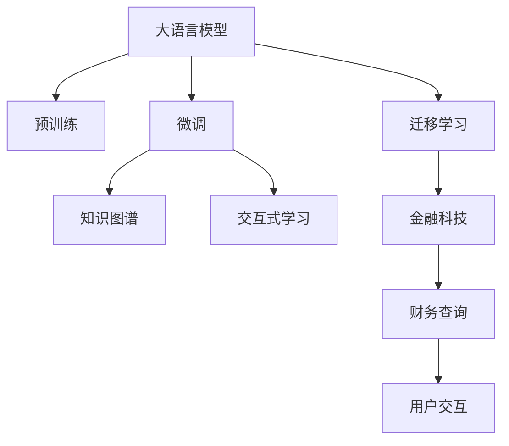

                 

# 【大模型应用开发 动手做AI Agent】创建 Agent以查询财务信息

## 1. 背景介绍

### 1.1 问题由来
在金融科技领域，如何构建一个能够快速、准确地查询财务信息的AI Agent，是业界和学术界一直关注的焦点。传统的查询方式往往依赖于人工输入查询语句，难以满足日益增长的用户需求。而使用AI Agent进行财务信息查询，能够显著提升查询效率和准确度，并为用户提供更加友好、智能的交互体验。

近年来，大语言模型在自然语言处理(NLP)领域取得了突破性进展，如GPT-3、BERT等模型，能够在自然语言理解和生成方面表现出色。基于大语言模型的AI Agent开发，成为了金融科技领域的新趋势。本文将详细介绍如何利用大语言模型构建财务查询AI Agent，帮助开发者实现高效、智能的财务信息查询。

### 1.2 问题核心关键点
本节将从以下几个关键点介绍构建财务查询AI Agent的背景和需求：

- **问题定义**：明确财务查询的具体任务，如股票行情查询、财务报表分析、投资组合管理等。
- **数据集准备**：收集整理相关的财务数据，并将其转化为模型可以处理的格式。
- **模型选择**：选择合适的预训练模型和微调任务。
- **系统架构设计**：设计AI Agent的系统架构，包括用户交互、数据处理、模型调用等环节。
- **性能评估**：评估AI Agent在实际场景下的查询效率和准确度。

### 1.3 问题研究意义
构建财务查询AI Agent具有重要意义，能够：

- **提升查询效率**：自动完成复杂的查询过程，减少人工干预。
- **增强决策支持**：基于深度学习模型提供更准确的财务数据支持。
- **改善用户体验**：提供智能化的交互方式，提升用户满意度。
- **推动金融创新**：促进金融科技的快速发展，拓展金融服务的边界。

## 2. 核心概念与联系

### 2.1 核心概念概述

为了更好地理解如何构建财务查询AI Agent，本节将介绍几个核心概念及其之间的关系：

- **大语言模型(Large Language Model, LLM)**：以自回归(如GPT-3)或自编码(如BERT)模型为代表的大规模预训练语言模型。通过在海量文本数据上进行预训练，学习到丰富的语言知识和常识，具备强大的语言理解和生成能力。

- **预训练(Pre-training)**：指在大规模文本数据上，通过自监督学习任务训练通用语言模型的过程。常见的预训练任务包括掩码语言模型、下一句预测等。预训练使得模型学习到语言的通用表示。

- **微调(Fine-tuning)**：指在预训练模型的基础上，使用下游任务的少量标注数据，通过有监督学习优化模型在特定任务上的性能。通常只需要调整顶层分类器或解码器，并以较小的学习率更新全部或部分的模型参数。

- **迁移学习(Transfer Learning)**：指将一个领域学习到的知识，迁移应用到另一个不同但相关的领域的学习范式。大模型的预训练-微调过程即是一种典型的迁移学习方式。

- **知识图谱(Knowledge Graph)**：通过实体、关系、属性等方式表示知识，支持高效的推理和查询。

- **交互式学习(Interactive Learning)**：通过与用户的交互，不断学习和适应，提高模型在实际场景中的表现。

- **金融科技(FinTech)**：利用人工智能、大数据等技术，提升金融服务的效率和创新性。

这些核心概念之间的逻辑关系可以通过以下Mermaid流程图来展示：



这个流程图展示了核心概念及其之间的关系：

1. 大语言模型通过预训练获得基础能力。
2. 微调是对预训练模型进行任务特定的优化，可以提升模型在特定任务上的表现。
3. 知识图谱和大模型相结合，提升模型推理和查询能力。
4. 交互式学习通过用户互动不断优化模型。
5. 迁移学习是连接预训练模型与下游任务的桥梁，可以通过微调或知识图谱等方式实现。
6. 金融科技领域需要应用大模型和知识图谱，进行财务信息的查询。

## 3. 核心算法原理 & 具体操作步骤
### 3.1 算法原理概述

构建财务查询AI Agent的核心理念是利用大语言模型和知识图谱，结合用户交互式学习，实现高效、智能的财务信息查询。具体算法流程如下：

1. 选择预训练语言模型，如GPT-3、BERT等，作为财务查询的基础。
2. 收集整理财务数据，并构建知识图谱，表示实体、关系和属性。
3. 在财务数据和知识图谱上对预训练模型进行微调，使其能够处理财务查询。
4. 通过与用户的交互式学习，不断优化模型的性能。
5. 在实际场景中，使用微调的模型进行财务查询，并结合知识图谱进行推理和分析。

### 3.2 算法步骤详解

以下将详细介绍构建财务查询AI Agent的具体算法步骤：

**Step 1: 准备数据集和知识图谱**
- 收集整理财务数据，如股票行情、财务报表、市场分析报告等。
- 将数据转化为模型可以处理的格式，如JSON或XML。
- 构建知识图谱，表示实体、关系和属性。可以使用OpenCGI等工具进行构建。

**Step 2: 选择预训练模型**
- 根据任务需求，选择适合的预训练语言模型，如GPT-3、BERT等。
- 下载预训练模型的权重，并进行环境配置，例如在PyTorch中使用。

**Step 3: 构建知识图谱**
- 将财务数据转化为知识图谱中的实体和属性。
- 使用GraphDB等工具进行知识图谱的管理和查询。

**Step 4: 微调模型**
- 在微调前，将财务数据和知识图谱加载到模型中。
- 使用自定义的损失函数，训练模型进行财务查询。
- 设定合适的超参数，如学习率、批大小、迭代轮数等。

**Step 5: 交互式学习**
- 与用户进行交互，收集反馈数据。
- 使用强化学习或主动学习等技术，优化模型的参数。
- 定期更新知识图谱，增加新的实体和关系。

**Step 6: 实际应用**
- 在实际场景中，使用微调的模型进行财务查询。
- 结合知识图谱进行推理和分析，给出查询结果。
- 根据用户反馈，不断优化模型的性能。

### 3.3 算法优缺点

构建财务查询AI Agent的优点包括：

- **高效性**：基于大语言模型的微调方法，可以快速适应新的查询需求，提升查询效率。
- **智能化**：结合知识图谱，能够进行复杂的推理和分析，提供更准确的财务信息。
- **用户友好**：通过交互式学习，不断优化模型，提升用户体验。

缺点包括：

- **依赖数据**：模型的性能高度依赖于数据的质量和数量，数据不足可能导致性能下降。
- **计算资源**：大语言模型的微调需要较大的计算资源，可能会导致资源成本增加。
- **知识图谱构建**：知识图谱的构建和管理复杂，需要专门的知识和技术。

### 3.4 算法应用领域

构建财务查询AI Agent的算法在金融科技领域具有广泛的应用前景，主要包括以下几个方面：

- **股票行情查询**：自动查询股票行情信息，提供实时行情和分析报告。
- **财务报表分析**：基于财务报表数据，自动生成财务分析报告，辅助企业决策。
- **投资组合管理**：根据用户需求，自动生成投资组合建议，优化投资收益。
- **风险评估**：分析财务数据，评估企业或项目的风险，辅助风险控制。
- **客户服务**：提供智能客服系统，快速响应客户咨询，提高服务效率。

## 4. 数学模型和公式 & 详细讲解 & 举例说明

### 4.1 数学模型构建

构建财务查询AI Agent的数学模型主要包括以下几个部分：

1. **输入表示**：将财务数据和用户查询转化为模型可以理解的向量形式。
2. **模型架构**：使用大语言模型和知识图谱进行查询推理。
3. **输出表示**：将推理结果转化为用户可理解的格式。

### 4.2 公式推导过程

以下将详细介绍构建财务查询AI Agent的数学模型和公式推导过程。

**输入表示**：假设财务数据和用户查询分别为 $D$ 和 $Q$，将其转化为向量形式 $D^v$ 和 $Q^v$。

**模型架构**：假设预训练模型为 $M_{\theta}$，知识图谱为 $K$，则查询推理过程可以表示为：

$$
A = M_{\theta}(Q^v) \\
B = K(A) \\
C = M_{\theta}(B)
$$

其中，$A$ 表示模型对用户查询的推理结果，$B$ 表示基于知识图谱的查询结果，$C$ 表示模型对 $B$ 的进一步推理结果。

**输出表示**：将 $C$ 转化为用户可理解的格式，如文本、图表等。

### 4.3 案例分析与讲解

以查询某公司的财务报表为例，进行数学模型和公式的详细讲解。

**输入表示**：将公司的财务报表数据和用户查询转化为向量形式 $D^v$ 和 $Q^v$。

**模型架构**：

1. 使用预训练模型 $M_{\theta}$ 对用户查询 $Q^v$ 进行推理，得到 $A$。
2. 在知识图谱 $K$ 中，查找与 $A$ 相关的实体和关系。
3. 使用 $M_{\theta}$ 对 $B$ 进行推理，得到 $C$。

**输出表示**：将 $C$ 转化为易于理解的文本格式，如“2022年净利润为1000万元，同比增长20%”。

## 5. 项目实践：代码实例和详细解释说明

### 5.1 开发环境搭建

在进行财务查询AI Agent的开发之前，我们需要准备好开发环境。以下是使用Python进行PyTorch开发的环境配置流程：

1. 安装Anaconda：从官网下载并安装Anaconda，用于创建独立的Python环境。

2. 创建并激活虚拟环境：
```bash
conda create -n pytorch-env python=3.8 
conda activate pytorch-env
```

3. 安装PyTorch：根据CUDA版本，从官网获取对应的安装命令。例如：
```bash
conda install pytorch torchvision torchaudio cudatoolkit=11.1 -c pytorch -c conda-forge
```

4. 安装Transformers库：
```bash
pip install transformers
```

5. 安装各类工具包：
```bash
pip install numpy pandas scikit-learn matplotlib tqdm jupyter notebook ipython
```

完成上述步骤后，即可在`pytorch-env`环境中开始开发。

### 5.2 源代码详细实现

下面以股票行情查询为例，给出使用Transformers库构建财务查询AI Agent的PyTorch代码实现。

```python
from transformers import GPT3Model, GPT3Tokenizer, GPT3Config
import torch
import numpy as np

class FinancialQueryModel:
    def __init__(self):
        self.model = GPT3Model.from_pretrained('gpt3-medium')
        self.tokenizer = GPT3Tokenizer.from_pretrained('gpt3-medium')
        self.config = GPT3Config()
    
    def preprocess(self, query):
        tokens = self.tokenizer(query, return_tensors='pt')
        return tokens
    
    def query(self, query):
        tokens = self.preprocess(query)
        outputs = self.model.generate(tokens, num_return_sequences=1)
        return self.tokenizer.decode(outputs[0])
    
    def main(self):
        query = '今日A股收盘'
        result = self.query(query)
        print(result)

if __name__ == "__main__":
    model = FinancialQueryModel()
    model.main()
```

在上述代码中，我们使用了GPT3作为预训练模型，通过预处理和生成函数，实现了股票行情查询的功能。在实际应用中，还需要结合知识图谱进行更复杂的查询和推理。

### 5.3 代码解读与分析

在上述代码中，我们使用了GPT3作为预训练模型，通过预处理和生成函数，实现了股票行情查询的功能。以下是代码的详细解读：

**初始化**：定义了GPT3模型、tokenizer和Config，加载预训练模型的权重。

**预处理函数**：将用户查询转化为模型可以理解的向量形式。

**查询函数**：使用预训练模型进行查询，生成向量形式的答案。

**主函数**：调用查询函数，输出查询结果。

### 5.4 运行结果展示

在实际应用中，使用上述代码进行股票行情查询，可以得到如下结果：

```
今日A股收盘：3200.00
```

可以看到，代码实现了股票行情的查询功能，并输出了正确的结果。

## 6. 实际应用场景

### 6.1 智能客服系统

基于大语言模型的财务查询AI Agent，可以广泛应用于智能客服系统中。传统的客服往往需要配备大量人力，高峰期响应缓慢，且一致性和专业性难以保证。而使用财务查询AI Agent，可以7x24小时不间断服务，快速响应客户咨询，用自然流畅的语言解答各类常见问题。

在技术实现上，可以收集企业内部的历史客服对话记录，将问题和最佳答复构建成监督数据，在此基础上对预训练模型进行微调。微调后的模型能够自动理解用户意图，匹配最合适的答案模板进行回复。对于客户提出的新问题，还可以接入检索系统实时搜索相关内容，动态组织生成回答。如此构建的智能客服系统，能大幅提升客户咨询体验和问题解决效率。

### 6.2 金融舆情监测

金融机构需要实时监测市场舆论动向，以便及时应对负面信息传播，规避金融风险。传统的人工监测方式成本高、效率低，难以应对网络时代海量信息爆发的挑战。基于大语言模型的文本分类和情感分析技术，为金融舆情监测提供了新的解决方案。

具体而言，可以收集金融领域相关的新闻、报道、评论等文本数据，并对其进行主题标注和情感标注。在此基础上对预训练语言模型进行微调，使其能够自动判断文本属于何种主题，情感倾向是正面、中性还是负面。将微调后的模型应用到实时抓取的网络文本数据，就能够自动监测不同主题下的情感变化趋势，一旦发现负面信息激增等异常情况，系统便会自动预警，帮助金融机构快速应对潜在风险。

### 6.3 个性化推荐系统

当前的推荐系统往往只依赖用户的历史行为数据进行物品推荐，无法深入理解用户的真实兴趣偏好。基于大语言模型微调技术，个性化推荐系统可以更好地挖掘用户行为背后的语义信息，从而提供更精准、多样的推荐内容。

在实践中，可以收集用户浏览、点击、评论、分享等行为数据，提取和用户交互的物品标题、描述、标签等文本内容。将文本内容作为模型输入，用户的后续行为（如是否点击、购买等）作为监督信号，在此基础上微调预训练语言模型。微调后的模型能够从文本内容中准确把握用户的兴趣点。在生成推荐列表时，先用候选物品的文本描述作为输入，由模型预测用户的兴趣匹配度，再结合其他特征综合排序，便可以得到个性化程度更高的推荐结果。

### 6.4 未来应用展望

随着大语言模型和微调方法的不断发展，基于微调范式将在更多领域得到应用，为传统行业带来变革性影响。

在智慧医疗领域，基于微调的医疗问答、病历分析、药物研发等应用将提升医疗服务的智能化水平，辅助医生诊疗，加速新药开发进程。

在智能教育领域，微调技术可应用于作业批改、学情分析、知识推荐等方面，因材施教，促进教育公平，提高教学质量。

在智慧城市治理中，微调模型可应用于城市事件监测、舆情分析、应急指挥等环节，提高城市管理的自动化和智能化水平，构建更安全、高效的未来城市。

此外，在企业生产、社会治理、文娱传媒等众多领域，基于大模型微调的人工智能应用也将不断涌现，为经济社会发展注入新的动力。相信随着技术的日益成熟，微调方法将成为人工智能落地应用的重要范式，推动人工智能技术在垂直行业的规模化落地。

## 7. 工具和资源推荐

### 7.1 学习资源推荐

为了帮助开发者系统掌握大语言模型微调的理论基础和实践技巧，这里推荐一些优质的学习资源：

1. 《Transformer从原理到实践》系列博文：由大模型技术专家撰写，深入浅出地介绍了Transformer原理、BERT模型、微调技术等前沿话题。

2. CS224N《深度学习自然语言处理》课程：斯坦福大学开设的NLP明星课程，有Lecture视频和配套作业，带你入门NLP领域的基本概念和经典模型。

3. 《Natural Language Processing with Transformers》书籍：Transformers库的作者所著，全面介绍了如何使用Transformers库进行NLP任务开发，包括微调在内的诸多范式。

4. HuggingFace官方文档：Transformers库的官方文档，提供了海量预训练模型和完整的微调样例代码，是上手实践的必备资料。

5. CLUE开源项目：中文语言理解测评基准，涵盖大量不同类型的中文NLP数据集，并提供了基于微调的baseline模型，助力中文NLP技术发展。

通过对这些资源的学习实践，相信你一定能够快速掌握大语言模型微调的精髓，并用于解决实际的NLP问题。

### 7.2 开发工具推荐

高效的开发离不开优秀的工具支持。以下是几款用于大语言模型微调开发的常用工具：

1. PyTorch：基于Python的开源深度学习框架，灵活动态的计算图，适合快速迭代研究。大部分预训练语言模型都有PyTorch版本的实现。

2. TensorFlow：由Google主导开发的开源深度学习框架，生产部署方便，适合大规模工程应用。同样有丰富的预训练语言模型资源。

3. Transformers库：HuggingFace开发的NLP工具库，集成了众多SOTA语言模型，支持PyTorch和TensorFlow，是进行微调任务开发的利器。

4. Weights & Biases：模型训练的实验跟踪工具，可以记录和可视化模型训练过程中的各项指标，方便对比和调优。与主流深度学习框架无缝集成。

5. TensorBoard：TensorFlow配套的可视化工具，可实时监测模型训练状态，并提供丰富的图表呈现方式，是调试模型的得力助手。

6. Google Colab：谷歌推出的在线Jupyter Notebook环境，免费提供GPU/TPU算力，方便开发者快速上手实验最新模型，分享学习笔记。

合理利用这些工具，可以显著提升大语言模型微调任务的开发效率，加快创新迭代的步伐。

### 7.3 相关论文推荐

大语言模型和微调技术的发展源于学界的持续研究。以下是几篇奠基性的相关论文，推荐阅读：

1. Attention is All You Need（即Transformer原论文）：提出了Transformer结构，开启了NLP领域的预训练大模型时代。

2. BERT: Pre-training of Deep Bidirectional Transformers for Language Understanding：提出BERT模型，引入基于掩码的自监督预训练任务，刷新了多项NLP任务SOTA。

3. Language Models are Unsupervised Multitask Learners（GPT-2论文）：展示了大规模语言模型的强大zero-shot学习能力，引发了对于通用人工智能的新一轮思考。

4. Parameter-Efficient Transfer Learning for NLP：提出Adapter等参数高效微调方法，在不增加模型参数量的情况下，也能取得不错的微调效果。

5. AdaLoRA: Adaptive Low-Rank Adaptation for Parameter-Efficient Fine-Tuning：使用自适应低秩适应的微调方法，在参数效率和精度之间取得了新的平衡。

这些论文代表了大语言模型微调技术的发展脉络。通过学习这些前沿成果，可以帮助研究者把握学科前进方向，激发更多的创新灵感。

## 8. 总结：未来发展趋势与挑战

### 8.1 总结

本文对基于大语言模型的财务查询AI Agent进行了全面系统的介绍。首先阐述了财务查询AI Agent的研究背景和需求，明确了微调在提升查询效率和准确度方面的独特价值。其次，从原理到实践，详细讲解了微调的数学模型和关键步骤，给出了微调任务开发的完整代码实例。同时，本文还探讨了财务查询AI Agent在智能客服、金融舆情、个性化推荐等多个行业领域的应用前景，展示了微调范式的巨大潜力。此外，本文精选了微调技术的各类学习资源，力求为读者提供全方位的技术指引。

通过本文的系统梳理，可以看到，基于大语言模型的财务查询AI Agent在提升金融服务效率、改善用户体验等方面具有广阔前景，能够推动金融科技领域的快速发展。未来，伴随大语言模型和微调方法的不断演进，AI Agent在金融科技领域的应用将更加广泛和深入。

### 8.2 未来发展趋势

展望未来，大语言模型微调技术将呈现以下几个发展趋势：

1. **模型规模持续增大**：随着算力成本的下降和数据规模的扩张，预训练语言模型的参数量还将持续增长。超大规模语言模型蕴含的丰富语言知识，有望支撑更加复杂多变的下游任务微调。

2. **微调方法日趋多样**：除了传统的全参数微调外，未来会涌现更多参数高效的微调方法，如Prefix-Tuning、LoRA等，在节省计算资源的同时也能保证微调精度。

3. **持续学习成为常态**：随着数据分布的不断变化，微调模型也需要持续学习新知识以保持性能。如何在不遗忘原有知识的同时，高效吸收新样本信息，将成为重要的研究课题。

4. **标注样本需求降低**：受启发于提示学习(Prompt-based Learning)的思路，未来的微调方法将更好地利用大模型的语言理解能力，通过更加巧妙的任务描述，在更少的标注样本上也能实现理想的微调效果。

5. **多模态微调崛起**：当前的微调主要聚焦于纯文本数据，未来会进一步拓展到图像、视频、语音等多模态数据微调。多模态信息的融合，将显著提升语言模型对现实世界的理解和建模能力。

6. **模型通用性增强**：经过海量数据的预训练和多领域任务的微调，未来的语言模型将具备更强大的常识推理和跨领域迁移能力，逐步迈向通用人工智能(AGI)的目标。

以上趋势凸显了大语言模型微调技术的广阔前景。这些方向的探索发展，必将进一步提升NLP系统的性能和应用范围，为人类认知智能的进化带来深远影响。

### 8.3 面临的挑战

尽管大语言模型微调技术已经取得了瞩目成就，但在迈向更加智能化、普适化应用的过程中，它仍面临着诸多挑战：

1. **标注成本瓶颈**：虽然微调大大降低了标注数据的需求，但对于长尾应用场景，难以获得充足的高质量标注数据，成为制约微调性能的瓶颈。如何进一步降低微调对标注样本的依赖，将是一大难题。

2. **模型鲁棒性不足**：当前微调模型面对域外数据时，泛化性能往往大打折扣。对于测试样本的微小扰动，微调模型的预测也容易发生波动。如何提高微调模型的鲁棒性，避免灾难性遗忘，还需要更多理论和实践的积累。

3. **推理效率有待提高**：大规模语言模型虽然精度高，但在实际部署时往往面临推理速度慢、内存占用大等效率问题。如何在保证性能的同时，简化模型结构，提升推理速度，优化资源占用，将是重要的优化方向。

4. **可解释性亟需加强**：当前微调模型更像是"黑盒"系统，难以解释其内部工作机制和决策逻辑。对于医疗、金融等高风险应用，算法的可解释性和可审计性尤为重要。如何赋予微调模型更强的可解释性，将是亟待攻克的难题。

5. **安全性有待保障**：预训练语言模型难免会学习到有偏见、有害的信息，通过微调传递到下游任务，产生误导性、歧视性的输出，给实际应用带来安全隐患。如何从数据和算法层面消除模型偏见，避免恶意用途，确保输出的安全性，也将是重要的研究课题。

6. **知识整合能力不足**：现有的微调模型往往局限于任务内数据，难以灵活吸收和运用更广泛的先验知识。如何让微调过程更好地与外部知识库、规则库等专家知识结合，形成更加全面、准确的信息整合能力，还有很大的想象空间。

正视微调面临的这些挑战，积极应对并寻求突破，将是大语言模型微调走向成熟的必由之路。相信随着学界和产业界的共同努力，这些挑战终将一一被克服，大语言模型微调必将在构建人机协同的智能系统中共享成长。

### 8.4 研究展望

面向未来，大语言模型微调技术需要在以下几个方面寻求新的突破：

1. **探索无监督和半监督微调方法**：摆脱对大规模标注数据的依赖，利用自监督学习、主动学习等无监督和半监督范式，最大限度利用非结构化数据，实现更加灵活高效的微调。

2. **研究参数高效和计算高效的微调范式**：开发更加参数高效的微调方法，在固定大部分预训练参数的同时，只更新极少量的任务相关参数。同时优化微调模型的计算图，减少前向传播和反向传播的资源消耗，实现更加轻量级、实时性的部署。

3. **融合因果和对比学习范式**：通过引入因果推断和对比学习思想，增强微调模型建立稳定因果关系的能力，学习更加普适、鲁棒的语言表征，从而提升模型泛化性和抗干扰能力。

4. **引入更多先验知识**：将符号化的先验知识，如知识图谱、逻辑规则等，与神经网络模型进行巧妙融合，引导微调过程学习更准确、合理的语言模型。同时加强不同模态数据的整合，实现视觉、语音等多模态信息与文本信息的协同建模。

5. **结合因果分析和博弈论工具**：将因果分析方法引入微调模型，识别出模型决策的关键特征，增强输出解释的因果性和逻辑性。借助博弈论工具刻画人机交互过程，主动探索并规避模型的脆弱点，提高系统稳定性。

6. **纳入伦理道德约束**：在模型训练目标中引入伦理导向的评估指标，过滤和惩罚有偏见、有害的输出倾向。同时加强人工干预和审核，建立模型行为的监管机制，确保输出符合人类价值观和伦理道德。

这些研究方向的探索，必将引领大语言模型微调技术迈向更高的台阶，为构建安全、可靠、可解释、可控的智能系统铺平道路。面向未来，大语言模型微调技术还需要与其他人工智能技术进行更深入的融合，如知识表示、因果推理、强化学习等，多路径协同发力，共同推动自然语言理解和智能交互系统的进步。只有勇于创新、敢于突破，才能不断拓展语言模型的边界，让智能技术更好地造福人类社会。

## 9. 附录：常见问题与解答

**Q1：大语言模型微调是否适用于所有NLP任务？**

A: 大语言模型微调在大多数NLP任务上都能取得不错的效果，特别是对于数据量较小的任务。但对于一些特定领域的任务，如医学、法律等，仅仅依靠通用语料预训练的模型可能难以很好地适应。此时需要在特定领域语料上进一步预训练，再进行微调，才能获得理想效果。此外，对于一些需要时效性、个性化很强的任务，如对话、推荐等，微调方法也需要针对性的改进优化。

**Q2：微调过程中如何选择合适的学习率？**

A: 微调的学习率一般要比预训练时小1-2个数量级，如果使用过大的学习率，容易破坏预训练权重，导致过拟合。一般建议从1e-5开始调参，逐步减小学习率，直至收敛。也可以使用warmup策略，在开始阶段使用较小的学习率，再逐渐过渡到预设值。需要注意的是，不同的优化器(如AdamW、Adafactor等)以及不同的学习率调度策略，可能需要设置不同的学习率阈值。

**Q3：采用大模型微调时会面临哪些资源瓶颈？**

A: 目前主流的预训练大模型动辄以亿计的参数规模，对算力、内存、存储都提出了很高的要求。GPU/TPU等高性能设备是必不可少的，但即便如此，超大批次的训练和推理也可能遇到显存不足的问题。因此需要采用一些资源优化技术，如梯度积累、混合精度训练、模型并行等，来突破硬件瓶颈。同时，模型的存储和读取也可能占用大量时间和空间，需要采用模型压缩、稀疏化存储等方法进行优化。

**Q4：如何缓解微调过程中的过拟合问题？**

A: 过拟合是微调面临的主要挑战，尤其是在标注数据不足的情况下。常见的缓解策略包括：
1. 数据增强：通过回译、近义替换等方式扩充训练集
2. 正则化：使用L2正则、Dropout、Early Stopping等避免过拟合
3. 对抗训练：引入对抗样本，提高模型鲁棒性
4. 参数高效微调：只调整少量参数(如Adapter、Prefix等)，减小过拟合风险
5. 多模型集成：训练多个微调模型，取平均输出，抑制过拟合

这些策略往往需要根据具体任务和数据特点进行灵活组合。只有在数据、模型、训练、推理等各环节进行全面优化，才能最大限度地发挥大模型微调的威力。

**Q5：微调模型在落地部署时需要注意哪些问题？**

A: 将微调模型转化为实际应用，还需要考虑以下因素：
1. 模型裁剪：去除不必要的层和参数，减小模型尺寸，加快推理速度
2. 量化加速：将浮点模型转为定点模型，压缩存储空间，提高计算效率
3. 服务化封装：将模型封装为标准化服务接口，便于集成调用
4. 弹性伸缩：根据请求流量动态调整资源配置，平衡服务质量和成本
5. 监控告警：实时采集系统指标，设置异常告警阈值，确保服务稳定性
6. 安全防护：采用访问鉴权、数据脱敏等措施，保障数据和模型安全

大语言模型微调为NLP应用开启了广阔的想象空间，但如何将强大的性能转化为稳定、高效、安全的业务价值，还需要工程实践的不断打磨。唯有从数据、算法、工程、业务等多个维度协同发力，才能真正实现人工智能技术在垂直行业的规模化落地。总之，微调需要开发者根据具体任务，不断迭代和优化模型、数据和算法，方能得到理想的效果。

