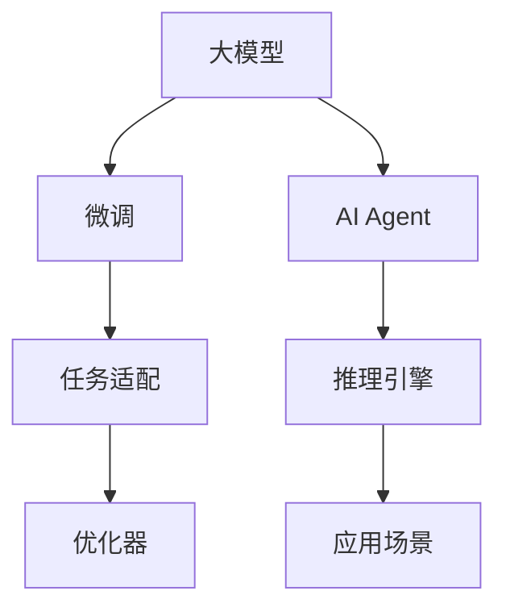

                 

# 【大模型应用开发 动手做AI Agent】说说LangChain

> 关键词：大模型应用开发,AI Agent,LangChain,自然语言处理,NLP,深度学习,Python,PyTorch,Transformers

## 1. 背景介绍

### 1.1 问题由来

随着人工智能技术的飞速发展，大模型如GPT-3、BERT等在自然语言处理（NLP）领域取得了令人瞩目的进展。这些模型通过大规模无监督预训练和微调，已经在多项NLP任务上达到了最先进的性能。然而，尽管预训练模型能力强大，但在实际应用中，往往需要根据特定任务进行微调，以确保模型输出满足实际需求。

### 1.2 问题核心关键点

在实际应用中，大模型微调是提升模型在特定任务上性能的关键手段。微调过程涉及到数据准备、模型初始化、任务适配、训练优化等多个环节。选择合适的微调策略和算法是确保微调效果的重要因素。

### 1.3 问题研究意义

大模型微调方法的研究和应用对于拓展模型应用范围、提升任务性能、加速NLP技术的产业化进程具有重要意义。通过微调，开发者可以大幅减少从头开发所需的数据、计算和人力成本，同时提高模型的效果，加快开发进度，赋能各行各业数字化转型。此外，微调还推动了NLP技术的新研究方向，如提示学习、少样本学习等，为人工智能的广泛应用提供了新的可能性。

## 2. 核心概念与联系

### 2.1 核心概念概述

为更好地理解LangChain的应用和开发，本节将介绍几个关键概念：

- **大模型（Large Model）**：指预训练的深度学习模型，如GPT-3、BERT等，通过大规模无监督预训练和微调，具有强大的语言理解和生成能力。
- **微调（Fine-Tuning）**：指在大模型的基础上，使用特定任务的标注数据对模型进行优化，以适应该任务的要求。
- **AI Agent**：指基于大模型开发的人工智能代理，能够执行特定的任务或与用户进行自然语言交互。
- **LangChain**：一个专注于大模型微调和AI Agent开发的开源项目，提供了多项NLP任务的微调工具和API，简化大模型在实际应用中的开发流程。

### 2.2 核心概念原理和架构的 Mermaid 流程图(Mermaid 流程节点中不要有括号、逗号等特殊字符)



这个流程图展示了核心概念之间的关系：

1. 大模型通过大规模预训练获得基础能力。
2. 微调在大模型基础上进行优化，适应特定任务。
3. 任务适配层将微调后的模型与具体任务结合。
4. 优化器负责调整模型参数，使其适应任务。
5. AI Agent基于微调后的模型，执行特定任务或交互。
6. 推理引擎负责模型的推理计算。
7. 应用场景是AI Agent最终服务的领域。

## 3. 核心算法原理 & 具体操作步骤

### 3.1 算法原理概述

基于LangChain的AI Agent开发主要涉及以下步骤：

1. **数据准备**：收集标注数据，并按照任务要求进行预处理。
2. **模型初始化**：选择预训练大模型，如GPT-3或BERT。
3. **任务适配**：在模型顶部添加任务特定的层，如分类头或解码器。
4. **微调训练**：使用优化器调整模型参数，以适应特定任务。
5. **推理部署**：将微调后的模型部署到应用场景，进行推理计算。

### 3.2 算法步骤详解

**Step 1: 数据准备**

1. 收集标注数据，确保数据质量，并划分为训练集、验证集和测试集。
2. 使用Python等编程语言进行数据预处理，如分词、编码等。
3. 对数据进行标准化和归一化处理，确保模型训练的稳定性和准确性。

**Step 2: 模型初始化**

1. 选择预训练大模型，如GPT-3或BERT，并使用Python加载模型。
2. 将模型嵌入到AI Agent中，并进行必要的接口封装。
3. 根据任务要求，在模型顶部添加任务适配层，如分类头或解码器。

**Step 3: 微调训练**

1. 选择优化器，如AdamW或SGD，并设置学习率、批大小、迭代轮数等超参数。
2. 将训练集数据分批次输入模型，进行前向传播和反向传播，更新模型参数。
3. 在验证集上评估模型性能，根据性能指标决定是否停止训练。
4. 使用测试集进行最终测试，评估模型在实际应用中的表现。

**Step 4: 推理部署**

1. 将微调后的模型部署到应用场景中，如聊天机器人、智能客服等。
2. 使用Python编写推理代码，进行模型推理计算。
3. 对推理结果进行后处理，如文本格式化、信息抽取等。
4. 对推理结果进行评价，优化模型性能，适应新数据。

### 3.3 算法优缺点

**优点**：

1. **高效开发**：基于LangChain的AI Agent开发流程简单高效，能够显著减少从头开发所需的时间和成本。
2. **性能提升**：通过微调，AI Agent能够适应特定任务，提高模型效果。
3. **泛化能力强**：预训练大模型具有强大的语言表征能力，能够适应多种NLP任务。
4. **易于集成**：API接口简洁，易于与其他系统集成。

**缺点**：

1. **依赖标注数据**：微调过程需要大量的标注数据，收集数据成本较高。
2. **过拟合风险**：微调过程中容易过拟合训练数据，影响模型泛化能力。
3. **计算资源消耗大**：大模型推理计算资源消耗较大，需要高性能硬件支持。
4. **可解释性不足**：模型推理过程缺乏可解释性，难以调试和优化。

### 3.4 算法应用领域

基于LangChain的AI Agent开发在多个领域得到了广泛应用，包括但不限于：

- **智能客服**：构建基于大模型的智能客服系统，提升客户服务质量。
- **问答系统**：开发基于大模型的问答系统，提供高效、准确的知识检索和问答服务。
- **情感分析**：使用AI Agent进行情感分析，了解用户情感状态，优化用户体验。
- **文本摘要**：利用AI Agent生成文本摘要，帮助用户快速了解长文本内容。
- **机器翻译**：通过微调大模型，提供高效、准确的机器翻译服务。
- **推荐系统**：开发基于大模型的个性化推荐系统，提升用户体验和满意度。

## 4. 数学模型和公式 & 详细讲解 & 举例说明

### 4.1 数学模型构建

假设我们使用GPT-3作为预训练大模型，其在任务$T$上的微调目标为最小化损失函数$\mathcal{L}$：

$$
\mathcal{L}(\theta) = \frac{1}{N}\sum_{i=1}^N \ell(M_{\theta}(x_i),y_i)
$$

其中，$\theta$为模型参数，$M_{\theta}$为模型在输入$x_i$下的输出，$\ell$为损失函数，$y_i$为真实标签。

### 4.2 公式推导过程

以分类任务为例，假设模型输出为概率分布$P(y|x)$，真实标签为$y$，则交叉熵损失函数为：

$$
\ell(M_{\theta}(x),y) = -\log P(y|M_{\theta}(x))
$$

在训练过程中，使用优化器（如AdamW）更新模型参数$\theta$：

$$
\theta \leftarrow \theta - \eta \nabla_{\theta}\mathcal{L}(\theta)
$$

其中，$\eta$为学习率，$\nabla_{\theta}\mathcal{L}(\theta)$为损失函数对参数$\theta$的梯度。

### 4.3 案例分析与讲解

以情感分析为例，假设输入文本为$x$，真实标签为$y$（0表示负面，1表示正面），模型输出为$P(y|x)$。训练过程如下：

1. 收集标注数据，划分为训练集和验证集。
2. 加载预训练大模型GPT-3，并添加分类头，输出概率分布。
3. 设置优化器AdamW，学习率$\eta=2e-5$，批大小$batch\_size=16$。
4. 将训练集数据分批次输入模型，前向传播计算损失函数。
5. 反向传播计算参数梯度，使用优化器更新模型参数。
6. 在验证集上评估模型性能，根据准确率决定是否停止训练。
7. 使用测试集进行最终测试，评估模型在实际应用中的表现。

## 5. 项目实践：代码实例和详细解释说明

### 5.1 开发环境搭建

1. 安装Python和相关依赖：
```bash
pip install torch transformers
```

2. 下载预训练大模型和数据集：
```bash
wget https://example.com/gpt3_model.zip
unzip gpt3_model.zip
wget https://example.com/train_dataset.zip
unzip train_dataset.zip
```

3. 创建虚拟环境，并激活：
```bash
conda create -n langchain_env python=3.8
conda activate langchain_env
```

### 5.2 源代码详细实现

以下是使用LangChain进行情感分析的Python代码实现：

```python
from transformers import GPT3ForSequenceClassification, AdamW, BertTokenizerFast
from torch.utils.data import DataLoader
from tqdm import tqdm
from sklearn.metrics import accuracy_score

model = GPT3ForSequenceClassification.from_pretrained('gpt3', num_labels=2)
tokenizer = BertTokenizerFast.from_pretrained('gpt3')
train_dataset = MyDataset(train_data, tokenizer, label_map)
train_loader = DataLoader(train_dataset, batch_size=16, shuffle=True)
optimizer = AdamW(model.parameters(), lr=2e-5)

for epoch in range(epochs):
    for batch in tqdm(train_loader, desc='Training'):
        inputs = tokenizer(batch['text'], return_tensors='pt', padding='max_length', truncation=True)
        outputs = model(**inputs)
        loss = outputs.loss
        optimizer.zero_grad()
        loss.backward()
        optimizer.step()
    
    val_dataset = MyDataset(val_data, tokenizer, label_map)
    val_loader = DataLoader(val_dataset, batch_size=16, shuffle=True)
    with torch.no_grad():
        val_outputs = model(**val_dataset[0])
        val_predictions = torch.argmax(val_outputs.logits, dim=1)
        val_labels = torch.tensor(val_dataset[0]['labels'], device=val_outputs.logits.device)
        acc = accuracy_score(val_labels, val_predictions)
        print(f'Epoch {epoch+1}, Val Accuracy: {acc:.3f}')
```

### 5.3 代码解读与分析

**MyDataset类**：

- 定义数据集，包括文本、标签等关键属性。
- 使用BertTokenizerFast进行文本编码，转化为模型可接受的格式。

**GPT3ForSequenceClassification类**：

- 加载GPT3模型，并设置分类头。
- 在模型顶部添加分类头，进行二分类任务。

**AdamW优化器**：

- 设置学习率为2e-5，批大小为16，进行梯度下降。

**训练过程**：

- 加载训练集，迭代训练过程，更新模型参数。
- 在验证集上评估模型性能，根据准确率决定是否停止训练。

### 5.4 运行结果展示

训练过程中，可以使用Jupyter Notebook或其他IDE进行实时监控和调试。训练完成后，使用测试集进行评估，输出准确率、召回率等指标。

## 6. 实际应用场景

### 6.1 智能客服系统

基于LangChain的智能客服系统能够自动理解用户问题，并提供准确的回答。通过微调GPT-3等大模型，客服系统能够处理多种场景下的常见问题，提高客户满意度。

### 6.2 问答系统

问答系统利用LangChain进行知识检索和信息抽取，提供高效、准确的问答服务。通过微调大模型，系统能够理解用户意图，匹配最合适的答案模板进行回复。

### 6.3 情感分析

情感分析利用LangChain进行文本情感分类，了解用户情感状态，优化用户体验。通过微调大模型，系统能够自动分析用户评论，生成情感标签，为业务决策提供支持。

### 6.4 未来应用展望

未来，LangChain在NLP领域的开发将带来更多可能性：

1. **多模态AI Agent**：融合视觉、语音等多种模态信息，提升AI Agent的智能化水平。
2. **跨领域微调**：将大模型应用于更多领域，如金融、医疗、教育等，提升应用场景的泛化能力。
3. **可解释性增强**：开发可解释的微调模型，提高AI Agent的透明性和可信度。
4. **实时推理优化**：优化模型推理计算，实现低延迟、高效率的实时响应。
5. **协同学习**：通过多模型协同训练，提升AI Agent的性能和鲁棒性。

## 7. 工具和资源推荐

### 7.1 学习资源推荐

1. **《深度学习自然语言处理》课程**：由斯坦福大学开设的NLP明星课程，涵盖NLP基础知识和前沿技术。
2. **《Transformer原理与实践》系列博文**：由大模型技术专家撰写，深入浅出地介绍了Transformer原理和微调技术。
3. **《自然语言处理与Transformer》书籍**：详细介绍了使用Transformers库进行NLP任务开发的完整流程。
4. **LangChain官方文档**：提供了多项NLP任务的微调工具和API，是动手做AI Agent的必备资源。

### 7.2 开发工具推荐

1. **PyTorch**：基于Python的开源深度学习框架，灵活动态的计算图，适合快速迭代研究。
2. **TensorFlow**：由Google主导开发的开源深度学习框架，生产部署方便，适合大规模工程应用。
3. **Weights & Biases**：模型训练的实验跟踪工具，可以记录和可视化模型训练过程中的各项指标。
4. **TensorBoard**：TensorFlow配套的可视化工具，可实时监测模型训练状态。

### 7.3 相关论文推荐

1. **Transformer原论文**：介绍Transformer结构，开启了NLP领域的预训练大模型时代。
2. **BERT论文**：提出BERT模型，引入基于掩码的自监督预训练任务，刷新了多项NLP任务SOTA。
3. **Parameter-Efficient Transfer Learning**：提出Adapter等参数高效微调方法，在不增加模型参数量的情况下，也能取得不错的微调效果。

## 8. 总结：未来发展趋势与挑战

### 8.1 总结

本文对基于LangChain的AI Agent开发进行了全面系统的介绍。通过深入分析大模型微调和AI Agent开发的各个环节，本文提供了一套完整的开发流程和实践指南。通过动手做AI Agent，读者可以掌握LangChain的核心思想和应用方法，提升在NLP领域的开发能力。

### 8.2 未来发展趋势

未来，基于LangChain的AI Agent开发将呈现以下趋势：

1. **多模态融合**：融合视觉、语音等多种模态信息，提升AI Agent的智能化水平。
2. **跨领域微调**：将大模型应用于更多领域，提升应用场景的泛化能力。
3. **可解释性增强**：开发可解释的微调模型，提高AI Agent的透明性和可信度。
4. **实时推理优化**：优化模型推理计算，实现低延迟、高效率的实时响应。
5. **协同学习**：通过多模型协同训练，提升AI Agent的性能和鲁棒性。

### 8.3 面临的挑战

尽管LangChain在AI Agent开发中取得了显著进展，但仍面临诸多挑战：

1. **标注数据依赖**：微调过程需要大量的标注数据，收集数据成本较高。
2. **过拟合风险**：微调过程中容易过拟合训练数据，影响模型泛化能力。
3. **计算资源消耗大**：大模型推理计算资源消耗较大，需要高性能硬件支持。
4. **可解释性不足**：模型推理过程缺乏可解释性，难以调试和优化。

### 8.4 研究展望

未来，需要从以下几个方向进一步研究：

1. **无监督和半监督微调**：探索无监督和半监督微调方法，摆脱对大规模标注数据的依赖。
2. **参数高效微调**：开发更加参数高效的微调方法，在不增加模型参数量的情况下，优化模型性能。
3. **因果学习**：引入因果推断和对比学习思想，增强模型泛化性和抗干扰能力。
4. **先验知识融合**：将符号化的先验知识与神经网络模型进行巧妙融合，提升模型的准确性和鲁棒性。
5. **伦理安全**：建立模型行为的监管机制，确保输出符合人类价值观和伦理道德。

## 9. 附录：常见问题与解答

**Q1: 如何选择合适的微调超参数？**

A: 选择合适的微调超参数需要综合考虑多个因素，如学习率、批大小、迭代轮数等。一般建议从较小值开始尝试，逐步增加，直到模型收敛或出现过拟合现象。

**Q2: 如何在微调过程中避免过拟合？**

A: 避免过拟合的策略包括数据增强、正则化、Dropout、Early Stopping等。具体来说，可以使用L2正则、Dropout、Early Stopping等技术，防止模型过度适应小规模训练集。

**Q3: 如何提高AI Agent的可解释性？**

A: 提高AI Agent的可解释性可以通过开发可解释的微调模型实现。例如，使用attention机制、可解释图网络等方法，可视化模型推理过程，提高系统的透明性和可信度。

**Q4: 如何优化AI Agent的实时推理性能？**

A: 优化AI Agent的实时推理性能可以通过模型剪枝、量化加速、模型并行等技术实现。具体来说，可以使用剪枝技术去除不必要的层和参数，使用量化技术减少模型计算量，使用模型并行技术提升推理速度。

**Q5: 如何在多模态任务中使用LangChain？**

A: 在多模态任务中，可以将文本、图像、语音等多种数据融合在一起进行微调。例如，可以使用MultimodalModel类加载多模态数据，在模型顶部添加多模态分类头，进行多模态任务微调。

总之，通过本文的系统梳理，我们可以看到，基于LangChain的AI Agent开发流程简单高效，能够显著提升NLP任务的性能和泛化能力。未来，随着LangChain和相关技术的不断演进，AI Agent在NLP领域的开发将迎来更多创新和突破，为各行各业带来新的智能化解决方案。

---

作者：禅与计算机程序设计艺术 / Zen and the Art of Computer Programming

