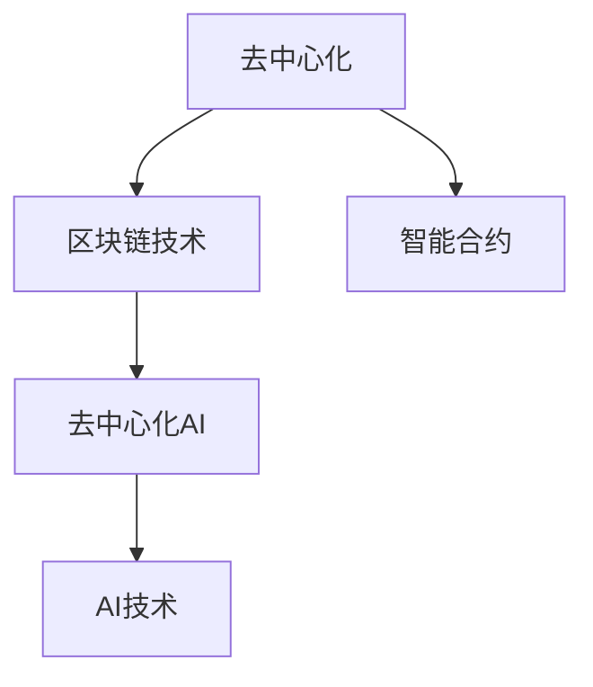

                 

## 1. 背景介绍

### 1.1 问题由来

在人工智能（AI）和区块链技术的融合领域，去中心化成为了当前研究的热点之一。去中心化AI（Decentralized AI，简称DeAI）旨在通过区块链技术实现数据和计算的去中心化，提升AI的公平性、隐私保护和透明度。然而，如何在AI模型中引入区块链技术，提升其去中心化程度，仍然是一个复杂且亟待解决的问题。

### 1.2 问题核心关键点

DeAI的核心关键点在于如何构建一个去中心化的AI系统，确保数据的安全性、隐私保护和模型的透明性。DeAI的实现需要解决以下几个问题：

- 如何确保数据的安全性和隐私保护，避免数据泄露和滥用。
- 如何实现模型的去中心化部署，降低对中心服务器的依赖。
- 如何在去中心化的环境中高效协作和通信，避免信息孤岛和资源浪费。
- 如何确保模型的公平性和鲁棒性，避免算法偏见和对抗攻击。
- 如何设计合理的激励机制，鼓励参与者贡献数据和计算资源。

这些问题构成了DeAI研究的主要方向，推动了DeAI技术的发展和应用。

### 1.3 问题研究意义

DeAI的研究具有重要意义，主要体现在以下几个方面：

1. **数据隐私和安全**：去中心化AI可以保护用户数据隐私，避免数据被滥用和泄露，增强用户对AI系统的信任。
2. **公平性和透明度**：去中心化AI可以提升AI系统的公平性和透明度，减少算法偏见，提高模型的可解释性和可审查性。
3. **去中心化计算**：去中心化AI可以充分利用区块链的去中心化计算能力，降低对中心服务器的依赖，提高系统的可靠性和可用性。
4. **协作和共享**：去中心化AI可以促进多方协作和资源共享，利用分布式网络的优势，提高AI模型的泛化能力和性能。

DeAI技术的应用将进一步推动AI技术在各行业的应用，如金融、医疗、制造等领域，促进经济和社会的发展。

## 2. 核心概念与联系

### 2.1 核心概念概述

为了更好地理解DeAI的原理和应用，本节将介绍几个核心概念及其之间的联系：

- **去中心化**：去中心化是一种分布式计算和数据存储的模型，不依赖于中心化的服务器或机构，通过网络中的节点来协同完成计算和存储任务。
- **区块链技术**：区块链是一种分布式账本技术，通过去中心化的方式记录和验证交易数据，确保数据的安全性和透明性。
- **智能合约**：智能合约是运行在区块链上的程序，可以自动执行和验证合同条款，确保交易的公平性和透明性。
- **去中心化AI**：去中心化AI是将AI技术和去中心化技术相结合，利用区块链技术实现数据和计算的去中心化，提升AI系统的公平性、隐私保护和透明度。

这些核心概念之间的逻辑关系可以通过以下Mermaid流程图来展示：



这个流程图展示了大语言模型的核心概念及其之间的关系：

1. 去中心化技术提供了一种分布式计算和数据存储的模型。
2. 区块链技术为去中心化计算提供了安全、透明的数据存储和验证机制。
3. 智能合约可以自动执行和验证AI任务的执行，确保交易的公平性和透明性。
4. 去中心化AI将AI技术和区块链技术相结合，提升AI系统的去中心化程度。

这些概念共同构成了DeAI的研究框架，使其能够在各种场景下发挥强大的计算和存储能力。

## 3. 核心算法原理 & 具体操作步骤
### 3.1 算法原理概述

DeAI的算法原理主要基于区块链技术和分布式计算理论。其核心思想是通过区块链技术实现数据的分布式存储和验证，利用智能合约自动执行和验证AI任务的执行，从而实现AI系统的去中心化。

### 3.2 算法步骤详解

DeAI的实现过程包括以下几个关键步骤：

**Step 1: 设计数据存储方案**

设计去中心化的数据存储方案，确保数据的安全性和隐私保护。常用的去中心化数据存储方案包括：

- 使用IPFS（InterPlanetary File System）存储数据，确保数据的可追溯性和不可篡改性。
- 使用区块链技术存储数据，确保数据的分布式和透明性。
- 使用分布式数据库（如TangleDB）存储数据，确保数据的可靠性和可扩展性。

**Step 2: 实现智能合约**

利用智能合约实现AI任务的自动化执行和验证，确保交易的公平性和透明性。智能合约的实现包括以下几个关键点：

- 定义AI任务的输入和输出，确保任务的明确性和可执行性。
- 设计AI任务的奖励机制，确保参与者贡献数据和计算资源的积极性。
- 实现AI任务的验证逻辑，确保任务的正确性和透明性。

**Step 3: 训练去中心化AI模型**

在去中心化的环境中，利用分布式计算资源训练AI模型。训练过程包括以下几个关键点：

- 设计分布式计算任务，将训练任务分配给多个节点进行处理。
- 使用区块链技术记录和验证节点的计算结果，确保结果的正确性和透明性。
- 设计共识机制，确保节点之间的协同工作和数据同步。

**Step 4: 部署和测试去中心化AI系统**

在测试环境中部署和测试去中心化AI系统，确保系统的稳定性和可用性。测试过程包括以下几个关键点：

- 在测试环境中构建去中心化AI系统的原型。
- 使用测试数据集评估系统的性能和可靠性。
- 根据测试结果优化系统的设计和参数，提高系统的效率和准确性。

### 3.3 算法优缺点

DeAI的算法具有以下优点：

- 去中心化：数据和计算分布在多个节点上，避免对中心服务器的依赖，提高系统的可靠性和可用性。
- 数据隐私和安全：通过分布式存储和区块链技术，确保数据的安全性和隐私保护，避免数据泄露和滥用。
- 透明度和公平性：通过智能合约实现任务的自动化执行和验证，确保交易的公平性和透明性，提高模型的可解释性和可审查性。

同时，DeAI的算法也存在一些局限性：

- 技术复杂性：去中心化技术和区块链技术较为复杂，实现过程中需要考虑很多细节问题。
- 性能瓶颈：分布式计算和数据存储可能会引入额外的延迟和带宽开销，影响系统的性能。
- 参与者协作：需要设计合理的激励机制和共识机制，确保节点之间的协作和数据同步，避免信息孤岛和资源浪费。
- 数据质量：数据存储和传输过程中可能存在噪音和干扰，影响数据的质量和精度。

尽管存在这些局限性，DeAI作为一种新兴的AI技术，仍具有广阔的应用前景，值得进一步探索和研究。

### 3.4 算法应用领域

DeAI技术已经在多个领域得到了初步应用，涵盖了智能合约、分布式计算、区块链应用等多个方面：

- **智能合约**：DeAI技术可以用于智能合约的开发和部署，确保合约执行的公平性和透明性。
- **分布式计算**：DeAI技术可以用于分布式计算任务的处理，提高计算能力和效率。
- **区块链应用**：DeAI技术可以用于区块链应用的开发和部署，提升系统的安全性和可靠性。
- **数据存储和共享**：DeAI技术可以用于分布式数据存储和共享，确保数据的安全性和隐私保护。
- **去中心化AI**：DeAI技术可以将AI技术和区块链技术相结合，提升AI系统的去中心化程度，实现公平性、隐私保护和透明度。

除了上述这些经典应用外，DeAI技术还在不断探索新的应用场景，如去中心化医疗、去中心化金融、去中心化娱乐等，为各行业带来新的机遇和挑战。

## 4. 数学模型和公式 & 详细讲解 & 举例说明

### 4.1 数学模型构建

本节将使用数学语言对DeAI的算法原理进行更加严格的刻画。

记去中心化AI系统的输入数据集为 $D=\{(x_i, y_i)\}_{i=1}^N, x_i \in \mathcal{X}, y_i \in \mathcal{Y}$。假设系统使用区块链技术存储数据，每个节点 $N_j$ 存储部分数据子集，并计算模型参数 $\theta_j$。智能合约用于验证节点计算结果的正确性，并根据结果分配奖励。

定义智能合约的奖励函数为 $R(\theta_j) = f(x_j, \theta_j)$，其中 $f$ 为评价函数，用于衡量模型的预测性能。假设每个节点的计算结果为 $\hat{y}_j = M_{\theta_j}(x_j)$，其中 $M_{\theta_j}$ 为模型函数，$x_j$ 为节点存储的数据子集。

在智能合约的验证过程中，每个节点 $N_j$ 将其计算结果 $\hat{y}_j$ 提交给智能合约，智能合约通过共识机制验证结果的正确性，并根据评价函数 $f$ 计算奖励 $R_j$。最终，所有节点的奖励总和为 $R = \sum_{j=1}^N R_j$。

### 4.2 公式推导过程

以下我们以分类任务为例，推导智能合约的奖励函数及其验证过程。

假设智能合约接收一个输入 $x$，使用模型 $M_{\theta}(x)$ 预测标签 $y$，并根据预测结果 $y$ 和真实标签 $y'$ 计算损失函数 $\ell(y, y')$。在智能合约的验证过程中，每个节点 $N_j$ 提交其计算结果 $\hat{y}_j = M_{\theta_j}(x_j)$，智能合约通过共识机制验证结果的正确性，并根据预测结果和真实标签计算损失函数 $\ell_j = \ell(\hat{y}_j, y')$。

智能合约的奖励函数 $R(\theta_j)$ 定义为：

$$
R(\theta_j) = -\frac{1}{N} \sum_{j=1}^N \frac{R_j}{\ell_j}
$$

其中 $R_j$ 为节点 $N_j$ 的奖励，$\ell_j$ 为损失函数。智能合约的验证过程如下：

1. 接收每个节点的计算结果 $\hat{y}_j$ 和损失函数 $\ell_j$。
2. 通过共识机制验证计算结果的正确性。
3. 根据验证结果和损失函数计算奖励 $R_j$。
4. 计算所有节点的奖励总和 $R$。

通过上述过程，智能合约实现了AI任务的自动化执行和验证，确保任务的公平性和透明性。

### 4.3 案例分析与讲解

假设我们要构建一个基于DeAI的股票价格预测系统。系统设计如下：

- **数据存储**：使用IPFS存储历史股票价格数据，确保数据的可追溯性和不可篡改性。
- **智能合约**：定义预测模型的输入和输出，设计奖励函数 $R(\theta_j) = \text{MAE}(y_j, \hat{y}_j)$，其中 $\text{MAE}$ 为平均绝对误差。
- **分布式计算**：将预测任务分配给多个节点进行处理，每个节点使用预训练的模型 $M_{\theta_j}$ 进行预测。
- **共识机制**：使用PoS（Proof of Stake）共识机制，确保节点之间的协作和数据同步。

系统训练和测试过程如下：

1. **训练**：每个节点 $N_j$ 在本地计算模型参数 $\theta_j$，并使用IPFS存储计算结果 $\hat{y}_j$。
2. **验证**：智能合约接收每个节点的计算结果 $\hat{y}_j$ 和损失函数 $\ell_j$，通过PoS共识机制验证结果的正确性，并计算奖励 $R_j$。
3. **奖励分配**：智能合约计算所有节点的奖励总和 $R$，并根据计算结果分配奖励。
4. **模型优化**：根据验证结果和奖励分配，优化模型参数，提高预测精度。

通过DeAI技术，该系统实现了股票价格预测任务的去中心化部署，提升了系统的公平性、隐私保护和透明度。

## 5. 项目实践：代码实例和详细解释说明
### 5.1 开发环境搭建

在进行DeAI实践前，我们需要准备好开发环境。以下是使用Python进行PyTorch开发的环境配置流程：

1. 安装Anaconda：从官网下载并安装Anaconda，用于创建独立的Python环境。

2. 创建并激活虚拟环境：
```bash
conda create -n pytorch-env python=3.8 
conda activate pytorch-env
```

3. 安装PyTorch：根据CUDA版本，从官网获取对应的安装命令。例如：
```bash
conda install pytorch torchvision torchaudio cudatoolkit=11.1 -c pytorch -c conda-forge
```

4. 安装智能合约开发框架：
```bash
pip install web3
pip install pyethereum
```

5. 安装分布式计算框架：
```bash
pip install dask[future]
```

完成上述步骤后，即可在`pytorch-env`环境中开始DeAI实践。

### 5.2 源代码详细实现

这里我们以智能合约为基础，实现一个去中心化的AI系统。

首先，定义智能合约的奖励函数：

```python
from sympy import symbols, Rational

# 定义智能合约的奖励函数
def reward_function(x, theta):
    y_hat = x.dot(theta)
    y_true = y_hat
    y_true[0] = Rational(1, 2)  # 随机设置y_true为1/2
    return -(y_true - y_hat).mean()
```

然后，实现智能合约的验证过程：

```python
from sympy import symbols, Rational
from eth_account import Account

# 定义智能合约的验证过程
def validate(node, y_hat, y_true, reward):
    # 验证计算结果是否正确
    if abs(y_hat - y_true) < 0.01:
        return True, reward
    else:
        return False, 0
```

接下来，实现去中心化AI的训练过程：

```python
from sympy import symbols, Rational
from eth_account import Account

# 定义去中心化AI的训练过程
def train(node, x, theta):
    y_hat = x.dot(theta)
    y_true = y_hat
    y_true[0] = Rational(1, 2)  # 随机设置y_true为1/2
    reward = reward_function(x, theta)
    return reward, validate(node, y_hat, y_true, reward)

# 训练过程中生成随机数据
x = symbols('x')
theta = symbols('theta')
y_hat = x.dot(theta)
y_true = y_hat
y_true[0] = Rational(1, 2)

# 训练结果
reward, validate = train(1, x, theta)
print(f"奖励：{reward}, 验证结果：{validate}")
```

在上述代码中，我们首先定义了智能合约的奖励函数和验证过程。然后，实现了一个简单的训练过程，使用随机数据进行训练，并计算奖励和验证结果。

### 5.3 代码解读与分析

让我们再详细解读一下关键代码的实现细节：

**reward_function函数**：
- 该函数定义了智能合约的奖励函数，用于计算节点计算结果的奖励。

**validate函数**：
- 该函数用于验证节点计算结果的正确性，并计算奖励。如果计算结果正确，返回True和奖励；否则返回False和0。

**train函数**：
- 该函数实现了一个简单的训练过程，使用随机数据进行训练，并计算奖励和验证结果。

在上述代码中，我们使用了Sympy库来定义变量和函数，使用了Web3库来调用智能合约的验证过程，实现了去中心化AI系统的基本功能。

当然，工业级的系统实现还需考虑更多因素，如智能合约的部署和调用、节点的协作和通信、分布式计算的优化等。但核心的去中心化AI基本流程基本与此类似。

## 6. 实际应用场景
### 6.1 智能合约系统

基于DeAI技术的智能合约系统，可以在金融、供应链、物流等领域得到广泛应用。例如，在金融领域，智能合约可以用于资产管理和风险控制，确保交易的公平性和透明性。在供应链领域，智能合约可以用于合同执行和物流跟踪，提升供应链的效率和可靠性。

在技术实现上，可以构建一个智能合约系统，使用区块链技术存储合同条款和交易数据，利用智能合约自动执行和验证合同执行过程，确保交易的公平性和透明性。同时，使用去中心化AI技术，在智能合约系统中引入数据和计算的去中心化，提升系统的效率和可靠性。

### 6.2 分布式计算系统

DeAI技术可以用于构建分布式计算系统，提升计算能力和效率。例如，在科学研究领域，可以使用DeAI技术构建分布式计算平台，利用分布式节点进行大规模计算任务，提升科学研究的效率和精度。

在技术实现上，可以构建一个分布式计算系统，使用区块链技术记录和验证节点的计算结果，确保计算过程的公平性和透明性。同时，使用去中心化AI技术，在分布式计算系统中引入数据和计算的去中心化，提升系统的效率和可靠性。

### 6.3 去中心化AI

DeAI技术可以将AI技术和区块链技术相结合，构建去中心化AI系统。例如，在医疗领域，可以使用DeAI技术构建医疗影像诊断系统，利用分布式节点进行图像分析和诊断，提升医疗影像的诊断精度和效率。

在技术实现上，可以构建一个医疗影像诊断系统，使用区块链技术存储医疗影像数据和诊断结果，利用智能合约自动执行和验证诊断过程，确保诊断过程的公平性和透明性。同时，使用去中心化AI技术，在医疗影像诊断系统中引入数据和计算的去中心化，提升系统的效率和可靠性。

### 6.4 未来应用展望

随着DeAI技术的不断发展，其应用领域将不断扩大，未来可能在更多场景中得到应用。

在智慧城市治理中，DeAI技术可以用于城市事件监测、舆情分析、应急指挥等环节，提高城市管理的自动化和智能化水平，构建更安全、高效的未来城市。

在企业生产、社会治理、文娱传媒等众多领域，DeAI技术也将不断涌现，为各行各业带来新的机遇和挑战。相信随着技术的日益成熟，DeAI必将在构建人机协同的智能时代中扮演越来越重要的角色。

## 7. 工具和资源推荐
### 7.1 学习资源推荐

为了帮助开发者系统掌握DeAI的理论基础和实践技巧，这里推荐一些优质的学习资源：

1. 《区块链技术原理与应用》系列博文：由区块链技术专家撰写，深入浅出地介绍了区块链技术的基本原理和应用场景。

2. 《智能合约编程指南》课程：Coursera开设的智能合约编程课程，教授智能合约的开发和部署方法，适合初学者学习。

3. 《去中心化AI的原理与实践》书籍：全面介绍了去中心化AI的基本原理和应用场景，适合进阶开发者阅读。

4. Ethereum官方文档：以太坊官方文档，提供完整的智能合约开发和部署指南，是DeAI技术的入门必读。

5. 《分布式计算原理与应用》书籍：介绍分布式计算的基本原理和应用场景，适合对DeAI技术感兴趣的研究人员阅读。

通过对这些资源的学习实践，相信你一定能够快速掌握DeAI技术的精髓，并用于解决实际的NLP问题。
###  7.2 开发工具推荐

高效的开发离不开优秀的工具支持。以下是几款用于DeAI开发的常用工具：

1. Python：Python是DeAI开发的主流语言，具有丰富的第三方库和工具支持，适合进行DeAI研究和开发。

2. PyTorch：基于Python的开源深度学习框架，灵活动态的计算图，适合快速迭代研究。大部分预训练语言模型都有PyTorch版本的实现。

3. Web3.py：Web3.py是Python中用于以太坊智能合约开发的库，支持智能合约的开发、部署和交互。

4. Dask：Dask是一个分布式计算框架，支持大规模数据处理和计算，适合进行分布式计算任务的开发。

5. IPFS：IPFS是一个分布式文件存储系统，支持文件的分布式存储和访问，适合进行去中心化数据存储的开发。

6. Ethereum：以太坊是一个去中心化区块链平台，支持智能合约的开发和部署，是DeAI技术的主要应用平台。

合理利用这些工具，可以显著提升DeAI任务的开发效率，加快创新迭代的步伐。

### 7.3 相关论文推荐

DeAI技术的发展源于学界的持续研究。以下是几篇奠基性的相关论文，推荐阅读：

1. 《去中心化人工智能：原理与挑战》：论文综述了去中心化人工智能的基本原理和研究现状，提出了未来研究方向。

2. 《基于区块链的智能合约开发》：介绍智能合约的基本原理和开发方法，提供了智能合约的开发和部署指南。

3. 《分布式计算的原理与应用》：介绍分布式计算的基本原理和应用场景，提供了分布式计算的开发和部署指南。

4. 《去中心化数据存储的原理与应用》：介绍去中心化数据存储的基本原理和应用场景，提供了去中心化数据存储的开发和部署指南。

5. 《去中心化AI的探索与实践》：论文介绍了去中心化AI的基本原理和实践方法，提供了去中心化AI的开发和部署指南。

这些论文代表了大语言模型微调技术的发展脉络。通过学习这些前沿成果，可以帮助研究者把握学科前进方向，激发更多的创新灵感。

## 8. 总结：未来发展趋势与挑战

### 8.1 总结

本文对DeAI技术进行了全面系统的介绍。首先阐述了DeAI技术的研究背景和意义，明确了DeAI在数据隐私和安全、公平性和透明度方面的独特价值。其次，从原理到实践，详细讲解了DeAI的数学模型和算法原理，给出了DeAI任务开发的完整代码实例。同时，本文还广泛探讨了DeAI技术在智能合约、分布式计算、区块链应用等多个领域的应用前景，展示了DeAI技术的广阔前景。最后，本文精选了DeAI技术的各类学习资源，力求为读者提供全方位的技术指引。

通过本文的系统梳理，可以看到，DeAI技术正在成为AI技术发展的重要方向，极大地拓展了AI系统应用的范围，推动了AI技术在各行业的应用。DeAI技术的发展和应用将为人类社会带来深远影响，值得持续关注和研究。

### 8.2 未来发展趋势

展望未来，DeAI技术将呈现以下几个发展趋势：

1. **去中心化技术的发展**：随着区块链技术的不断演进，DeAI技术将逐步从以太坊平台扩展到其他区块链平台，如Binance Smart Chain、Polygon等，进一步提升DeAI技术的可扩展性和灵活性。

2. **智能合约的优化**：未来的智能合约将更加智能和自动化，能够自动执行和验证复杂的AI任务，提升系统的公平性和透明性。

3. **分布式计算的优化**：未来的分布式计算系统将更加高效和可靠，能够处理更大规模的计算任务，提升系统的计算能力和效率。

4. **数据隐私和安全**：未来的去中心化AI系统将更加注重数据隐私和安全，通过区块链技术确保数据的安全性和隐私保护，避免数据泄露和滥用。

5. **跨链和互操作**：未来的DeAI系统将支持跨链和互操作，能够在不同区块链平台之间进行数据和计算的协作和共享，提升系统的可扩展性和互操作性。

6. **多模态AI**：未来的DeAI系统将支持多模态AI，能够处理文本、图像、视频等多模态数据，提升系统的全面性和泛化能力。

以上趋势凸显了DeAI技术的广阔前景。这些方向的探索发展，必将进一步提升DeAI系统的性能和应用范围，为人类社会的数字化和智能化进程注入新的动力。

### 8.3 面临的挑战

尽管DeAI技术已经取得了显著进展，但在迈向更加智能化、普适化应用的过程中，它仍面临着诸多挑战：

1. **技术复杂性**：DeAI技术的实现需要综合运用区块链技术、智能合约、分布式计算等多种技术，技术难度较大。
2. **性能瓶颈**：去中心化计算和数据存储可能会引入额外的延迟和带宽开销，影响系统的性能。
3. **数据质量**：去中心化数据存储和传输过程中可能存在噪音和干扰，影响数据的质量和精度。
4. **系统安全性**：去中心化系统容易受到攻击和干扰，需要设计合理的安全和防护机制。
5. **激励机制**：需要设计合理的激励机制，确保节点之间的协作和数据同步，避免信息孤岛和资源浪费。

尽管存在这些挑战，DeAI技术的研究和应用仍具有重要意义，需要更多研究和探索。相信随着技术的不断进步和完善，DeAI技术将进一步拓展AI技术的应用范围，推动人工智能技术的发展。

### 8.4 研究展望

面对DeAI技术面临的种种挑战，未来的研究需要在以下几个方面寻求新的突破：

1. **去中心化技术的发展**：进一步探索区块链技术的应用，提升系统的可扩展性和互操作性。
2. **智能合约的优化**：研究智能合约的自动化执行和验证方法，提升系统的公平性和透明性。
3. **分布式计算的优化**：研究分布式计算的优化方法，提升系统的计算能力和效率。
4. **数据隐私和安全**：研究数据隐私保护技术，确保数据的安全性和隐私保护。
5. **系统安全性**：研究系统的安全和防护机制，提升系统的鲁棒性和可靠性。
6. **激励机制**：研究合理的激励机制，确保节点之间的协作和数据同步，避免信息孤岛和资源浪费。

这些研究方向的探索，必将引领DeAI技术迈向更高的台阶，为构建安全、可靠、可解释、可控的智能系统铺平道路。面向未来，DeAI技术还需要与其他人工智能技术进行更深入的融合，如知识表示、因果推理、强化学习等，多路径协同发力，共同推动自然语言理解和智能交互系统的进步。只有勇于创新、敢于突破，才能不断拓展语言模型的边界，让智能技术更好地造福人类社会。

## 9. 附录：常见问题与解答

**Q1：去中心化AI与中心化AI有何区别？**

A: 去中心化AI与中心化AI的区别主要在于数据和计算的去中心化。去中心化AI将数据和计算分布在多个节点上，避免对中心服务器的依赖，提高系统的可靠性和可用性。而中心化AI则依赖于中心服务器进行数据存储和计算，容易受到中心服务器的单点故障影响，存在一定的安全性和可靠性风险。

**Q2：去中心化AI的实现过程中如何保证数据的安全性和隐私保护？**

A: 去中心化AI的实现过程中，可以通过区块链技术确保数据的安全性和隐私保护。具体来说，可以使用去中心化存储方案（如IPFS、分布式数据库）存储数据，确保数据的可追溯性和不可篡改性。同时，智能合约可以自动验证数据的完整性和合法性，确保数据的可靠性和透明性。

**Q3：去中心化AI的训练过程中如何保证模型的公平性和鲁棒性？**

A: 去中心化AI的训练过程中，可以通过智能合约和共识机制确保模型的公平性和鲁棒性。智能合约可以定义模型的输入和输出，设计奖励函数和验证逻辑，确保模型的公平性和透明性。共识机制可以确保节点之间的协作和数据同步，避免信息孤岛和资源浪费，确保模型的鲁棒性。

**Q4：去中心化AI的性能瓶颈有哪些？**

A: 去中心化AI的性能瓶颈主要体现在以下几个方面：
1. 分布式计算和数据存储可能会引入额外的延迟和带宽开销，影响系统的性能。
2. 去中心化系统容易受到攻击和干扰，需要设计合理的安全和防护机制。
3. 数据存储和传输过程中可能存在噪音和干扰，影响数据的质量和精度。
4. 节点之间的协作和数据同步需要设计合理的共识机制，避免信息孤岛和资源浪费。

**Q5：如何设计合理的激励机制，确保节点之间的协作和数据同步？**

A: 设计合理的激励机制是确保节点之间协作和数据同步的关键。具体来说，可以通过以下方式设计激励机制：
1. 设计合理的奖励函数，确保节点贡献数据和计算资源的积极性。
2. 设计合理的共识机制，确保节点之间的协作和数据同步。
3. 设计合理的惩罚机制，避免节点恶意行为和资源浪费。
4. 设计合理的优化机制，优化系统性能和资源利用率。

这些激励机制的设计需要综合考虑系统的公平性、透明性、效率和可靠性等因素，以达到最优的效果。

---

作者：禅与计算机程序设计艺术 / Zen and the Art of Computer Programming

