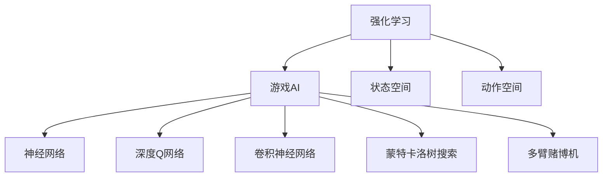

                 

# 一切皆是映射：强化学习在游戏AI中的应用：案例与分析

> 关键词：强化学习,游戏AI,状态空间,动作空间,神经网络,深度Q网络,卷积神经网络,蒙特卡洛树搜索,多臂赌博机,游戏策略

## 1. 背景介绍

### 1.1 问题由来

随着人工智能技术的飞速发展，人工智能在游戏领域的应用也越来越广泛。从简单的语音识别和自然语言处理，到复杂的游戏AI设计，AI在游戏中的应用已经深入到了每个环节。其中，强化学习作为AI的重要分支，在游戏AI设计中展现出了强大的潜力。

近年来，许多顶尖的AI游戏公司在电子竞技、在线游戏、桌面游戏等领域取得了令人瞩目的成绩。这些公司通过利用强化学习算法，使得游戏AI能够在复杂的任务中表现出超人的决策能力和策略学习能力。比如DeepMind的AlphaGo系统，通过对围棋游戏的深入研究和强化学习算法的不断优化，最终战胜了世界围棋冠军李世石，震惊了全世界。

然而，尽管强化学习在游戏AI中取得了令人瞩目的成就，但它仍面临着一系列挑战。这些挑战包括如何高效探索游戏状态空间、如何设计合适的奖励机制、如何在高维动作空间中进行决策等。这些问题都直接影响到游戏AI的性能和应用范围。

## 2. 核心概念与联系

### 2.1 核心概念概述

为更好地理解强化学习在游戏AI中的应用，本节将介绍几个密切相关的核心概念：

- 强化学习(Reinforcement Learning, RL)：一种基于智能体在特定环境中进行交互的学习方式。智能体通过与环境的交互，根据当前状态和行动获得奖励，学习最优策略以最大化长期奖励。

- 游戏AI(Game AI)：利用计算机模拟和人工智能技术，使游戏中的虚拟角色或环境能够自主决策和互动的AI技术。游戏AI在电子竞技、在线游戏、桌面游戏等领域有着广泛应用。

- 状态空间(State Space)：游戏AI中，智能体需要掌握的状态集合。状态空间可以是简单的数字向量，也可以是复杂的图像或文本。

- 动作空间(Action Space)：智能体可执行的操作集合。动作空间可以是离散的、连续的，或者复杂的组合。

- 神经网络(Neural Network)：一种模拟人脑神经元结构和功能的计算模型。神经网络可以处理高维数据，广泛应用于游戏AI中。

- 深度Q网络(Deep Q-Network, DQN)：基于深度神经网络的一种强化学习算法。DQN可以学习复杂的状态-动作映射关系，优化决策策略。

- 卷积神经网络(Convolutional Neural Network, CNN)：一种专门用于处理图像数据的神经网络结构。CNN在游戏AI中用于图像识别和特征提取。

- 蒙特卡洛树搜索(Monte Carlo Tree Search, MCTS)：一种基于搜索的强化学习算法。MCTS可以高效探索游戏状态空间，用于复杂的决策任务。

- 多臂赌博机(Multi-Armed Bandit)：一种经典的强化学习问题，用于模拟游戏AI中的资源分配和奖励探索。

这些核心概念之间的逻辑关系可以通过以下Mermaid流程图来展示：



这个流程图展示了这个系统的主要组件：

1. 强化学习：作为游戏AI的核心算法，使得智能体能够通过与环境的交互学习最优策略。
2. 状态空间：智能体需要掌握的游戏状态，可以是简单的数字，也可以是复杂的图像或文本。
3. 动作空间：智能体可以执行的操作，包括移动、攻击、拾取等。
4. 神经网络：用于处理和提取高维数据特征，优化决策过程。
5. 深度Q网络：利用深度神经网络优化决策策略。
6. 卷积神经网络：专门用于图像数据处理的神经网络。
7. 蒙特卡洛树搜索：用于高效探索状态空间，优化决策策略。
8. 多臂赌博机：用于模拟资源分配和奖励探索问题。

这些概念共同构成了游戏AI的核心框架，使得AI能够在复杂环境中自主决策和互动。通过理解这些核心概念，我们可以更好地把握游戏AI的工作原理和优化方向。

## 3. 核心算法原理 & 具体操作步骤

### 3.1 算法原理概述

强化学习在游戏AI中的应用，本质上是通过智能体与游戏环境的交互，学习最优策略的过程。智能体在每个时间步上执行一个动作，并获得相应的奖励，通过不断地调整策略，最终达到最优决策。

具体而言，假设游戏环境为 $E$，智能体的动作集合为 $A$，状态集合为 $S$。在每个时间步 $t$ 上，智能体执行一个动作 $a_t \in A$，环境状态从 $s_t$ 变化为 $s_{t+1}$，智能体获得奖励 $r_{t+1}$。智能体的目标是最大化未来奖励的期望值，即：

$$
\max_{\pi} \mathbb{E}\left[\sum_{t=0}^{\infty} \gamma^t r_{t+1}\right]
$$

其中，$\pi$ 为智能体的决策策略，$\gamma$ 为折扣因子，通常取值在0到1之间。

强化学习算法的核心在于如何估计和优化智能体的决策策略 $\pi$。具体的方法包括基于模型的强化学习、基于值函数的强化学习、基于策略的强化学习等。其中，基于值函数的强化学习（如Q-learning、DQN）是最常用的方法之一。

### 3.2 算法步骤详解

强化学习在游戏AI中的应用，一般包括以下几个关键步骤：

**Step 1: 环境建模**
- 收集游戏的所有状态和动作，设计游戏环境的数学模型。
- 设计游戏环境的奖励函数，用于评估智能体的决策。

**Step 2: 设计神经网络架构**
- 选择合适的神经网络架构，如CNN用于图像处理、DQN用于决策优化等。
- 设计神经网络的目标函数，如交叉熵损失、均方误差损失等。

**Step 3: 训练算法选择**
- 选择适合的强化学习算法，如DQN、SARSA、Q-learning等。
- 设计算法的超参数，如学习率、批大小、更新频率等。

**Step 4: 数据预处理**
- 对收集的游戏状态和动作进行预处理，如归一化、编码等。
- 将预处理后的数据分为训练集和测试集，用于模型训练和评估。

**Step 5: 模型训练**
- 使用训练集对模型进行训练，最小化目标函数。
- 使用测试集对模型进行评估，检查泛化性能。
- 根据评估结果调整超参数，进一步优化模型。

**Step 6: 测试与部署**
- 在实际游戏中测试模型，检查其表现。
- 将模型部署到游戏环境中，进行持续训练和优化。

以上是强化学习在游戏AI中的基本流程。在实际应用中，还需要根据具体游戏场景和需求，对各个环节进行优化设计，以提高模型的性能和稳定性。

### 3.3 算法优缺点

强化学习在游戏AI中的应用，具有以下优点：

- 可以高效探索游戏状态空间。通过与环境的不断交互，智能体可以发现最优策略，而不必依赖预定义的规则或知识。
- 可以适应复杂的游戏环境。强化学习算法能够处理高维、非线性的状态空间，适用于各种复杂的游戏任务。
- 可以自动优化决策策略。通过不断学习最优策略，智能体可以在未知环境中自主决策，提高游戏表现。

然而，强化学习在游戏AI中也存在一定的局限性：

- 训练时间长。强化学习需要大量的游戏样本进行训练，训练时间较长，影响实际应用。
- 容易陷入局部最优。由于奖励机制和环境模型的设计复杂，智能体容易陷入局部最优解。
- 难以控制奖励机制。奖励机制的设计直接影响智能体的学习效果，难以找到最优奖励函数。
- 资源消耗高。高维状态空间和动作空间对计算资源的要求较高，需要高性能硬件支持。

尽管存在这些局限性，但就目前而言，强化学习在游戏AI中的应用仍是最主流的方法之一。未来相关研究的重点在于如何进一步优化算法，提高训练效率和决策精度，同时兼顾稳定性、公平性和安全性等因素。

### 3.4 算法应用领域

强化学习在游戏AI中的应用，广泛涉及以下几个领域：

- 电子竞技：通过训练智能体与玩家对抗，提升游戏竞技水平。如AlphaGo、AlphaStar等。
- 在线游戏：通过训练智能体与玩家互动，丰富游戏体验。如AI陪玩系统、智能NPC等。
- 桌面游戏：通过训练智能体与玩家互动，增加游戏趣味性。如《文明》系列游戏。
- 教育游戏：通过训练智能体与玩家互动，促进教育效果。如智能辅助学习系统。

除了上述这些经典领域外，强化学习在游戏AI中也有创新性地应用于虚拟现实、交互式电影、机器人等领域，为游戏AI带来了新的突破。随着强化学习算法的不断演进，相信游戏AI技术将在更广阔的应用领域大放异彩。

## 4. 数学模型和公式 & 详细讲解  
### 4.1 数学模型构建

本节将使用数学语言对强化学习在游戏AI中的应用进行更加严格的刻画。

假设智能体在每个时间步上执行一个动作 $a_t \in A$，环境状态从 $s_t$ 变化为 $s_{t+1}$，智能体获得奖励 $r_{t+1}$。设智能体在时间步 $t$ 的状态为 $s_t$，动作为 $a_t$，则智能体的状态转移概率和奖励分布如下：

- 状态转移概率：$P(s_{t+1}|s_t,a_t)$
- 奖励分布：$R(s_t,a_t)$

智能体的目标是通过不断学习最优策略 $\pi$，最大化长期奖励的期望值。设智能体在时间步 $t$ 上的策略为 $\pi(a_t|s_t)$，则期望的长期奖励为：

$$
J(\pi) = \mathbb{E}\left[\sum_{t=0}^{\infty} \gamma^t r_{t+1}\right]
$$

其中，$\gamma$ 为折扣因子，通常取值在0到1之间。

强化学习算法的目标是最小化智能体的期望长期奖励 $J(\pi)$。常用的算法包括基于值函数的Q-learning、DQN等。以DQN为例，其核心思想是通过神经网络估计状态-动作-奖励映射，优化决策策略。

DQN的训练过程可以概括为：

1. 初始化神经网络参数 $\theta$。
2. 在时间步 $t$ 上，智能体执行动作 $a_t = \pi(a_t|s_t)$，观察状态 $s_{t+1}$ 和奖励 $r_{t+1}$。
3. 使用神经网络估计 $Q(s_t,a_t)$，即状态-动作-奖励的预测值。
4. 使用神经网络估计 $Q(s_{t+1},a_{t+1})$，即下一个状态-动作-奖励的预测值。
5. 根据 $Q(s_t,a_t)$ 和 $Q(s_{t+1},a_{t+1})$ 的预测值，更新神经网络参数 $\theta$，以最小化损失函数。

上述过程不断重复，直到收敛。最终得到优化后的神经网络参数 $\hat{\theta}$，即智能体的最优决策策略。

### 4.2 公式推导过程

以DQN为例，下面推导其训练过程的数学公式。

设智能体在时间步 $t$ 的状态为 $s_t$，动作为 $a_t$，下一个状态为 $s_{t+1}$，奖励为 $r_{t+1}$。设智能体在时间步 $t$ 上执行动作 $a_t$ 的Q值（即状态-动作-奖励的预测值）为 $Q_{\theta}(s_t,a_t)$。设智能体在时间步 $t+1$ 上执行动作 $a_{t+1}$ 的Q值为 $Q_{\theta}(s_{t+1},a_{t+1})$。

则智能体的Q值更新公式为：

$$
Q_{\theta}(s_t,a_t) \leftarrow Q_{\theta}(s_t,a_t) + \eta \left[R_{t+1} + \gamma \max_{a} Q_{\theta}(s_{t+1},a) - Q_{\theta}(s_t,a_t)\right]
$$

其中，$\eta$ 为学习率，$R_{t+1}$ 为时间步 $t+1$ 的奖励。

在训练过程中，智能体使用神经网络估计状态-动作-奖励映射，即Q值。设智能体的神经网络参数为 $\theta$，则Q值估计公式为：

$$
Q_{\theta}(s_t,a_t) = \mathbb{E}\left[\sum_{i=0}^{\infty} \gamma^i r_{t+i}\right]
$$

其中，$\mathbb{E}$ 为期望运算符。

利用上式，可以得到DQN的损失函数：

$$
\mathcal{L}(\theta) = -\frac{1}{N}\sum_{i=1}^N \left[Q_{\theta}(s_t,a_t) - (R_{t+1} + \gamma \max_{a} Q_{\theta}(s_{t+1},a))\right]^2
$$

其中，$N$ 为训练样本数量。

利用梯度下降等优化算法，最小化损失函数 $\mathcal{L}(\theta)$，即可得到优化后的神经网络参数 $\hat{\theta}$，即智能体的最优决策策略。

### 4.3 案例分析与讲解

为了更好地理解DQN的训练过程，我们以多臂赌博机(Multi-Armed Bandit)为例进行详细讲解。

多臂赌博机是一种经典的强化学习问题，模拟了资源分配和奖励探索。假设环境中有 $K$ 个投币机，每个投币机以不同的概率 $p_k$ 产生奖励。智能体的目标是最大化长期奖励。

在多臂赌博机问题中，状态空间 $S$ 为投币机状态集合，动作空间 $A$ 为投币机选择集合。智能体在每个时间步上选择一个投币机进行投币，观察投币结果并得到相应的奖励。

以DQN为例，其训练过程可以概括为：

1. 初始化神经网络参数 $\theta$。
2. 在时间步 $t$ 上，智能体随机选择一个投币机 $k_t$，投币一次，观察结果并得到奖励 $r_t$。
3. 使用神经网络估计 $Q_{\theta}(s_t,k_t)$，即当前状态-动作-奖励的预测值。
4. 使用神经网络估计 $Q_{\theta}(s_{t+1},k_{t+1})$，即下一个状态-动作-奖励的预测值。
5. 根据 $Q_{\theta}(s_t,k_t)$ 和 $Q_{\theta}(s_{t+1},k_{t+1})$ 的预测值，更新神经网络参数 $\theta$，以最小化损失函数。

上述过程不断重复，直到收敛。最终得到优化后的神经网络参数 $\hat{\theta}$，即智能体的最优决策策略。

## 5. 项目实践：代码实例和详细解释说明
### 5.1 开发环境搭建

在进行游戏AI项目开发前，我们需要准备好开发环境。以下是使用Python进行PyTorch和TensorFlow开发的环境配置流程：

1. 安装Anaconda：从官网下载并安装Anaconda，用于创建独立的Python环境。

2. 创建并激活虚拟环境：
```bash
conda create -n game-ai-env python=3.8 
conda activate game-ai-env
```

3. 安装PyTorch：根据CUDA版本，从官网获取对应的安装命令。例如：
```bash
conda install pytorch torchvision torchaudio cudatoolkit=11.1 -c pytorch -c conda-forge
```

4. 安装TensorFlow：
```bash
pip install tensorflow
```

5. 安装各类工具包：
```bash
pip install numpy pandas scikit-learn matplotlib tqdm jupyter notebook ipython
```

完成上述步骤后，即可在`game-ai-env`环境中开始游戏AI开发。

### 5.2 源代码详细实现

下面我们以多臂赌博机问题为例，给出使用TensorFlow进行强化学习算法开发的PyTorch代码实现。

首先，定义多臂赌博机问题中的状态空间和动作空间：

```python
import numpy as np
import tensorflow as tf

K = 10  # 投币机数量
S = K  # 状态空间大小
A = K  # 动作空间大小

# 定义状态空间和动作空间
state_space = np.arange(S)
action_space = np.arange(A)
```

然后，定义智能体的神经网络结构：

```python
import tensorflow as tf

# 定义神经网络结构
class QNetwork(tf.keras.Model):
    def __init__(self, input_shape, output_shape):
        super(QNetwork, self).__init__()
        self.dense1 = tf.keras.layers.Dense(32, activation='relu', input_shape=input_shape)
        self.dense2 = tf.keras.layers.Dense(output_shape, activation='linear')
    
    def call(self, inputs):
        x = self.dense1(inputs)
        x = self.dense2(x)
        return x

# 创建神经网络
input_shape = (S,)
output_shape = A
q_network = QNetwork(input_shape, output_shape)
```

接下来，定义强化学习算法的训练过程：

```python
import numpy as np
import tensorflow as tf

# 定义超参数
learning_rate = 0.01
discount_factor = 0.9
batch_size = 32

# 定义智能体策略
def epsilon_greedy(q_values, epsilon=0.1):
    if np.random.uniform() < epsilon:
        return np.random.choice(A)
    else:
        return np.argmax(q_values)

# 定义强化学习算法的训练过程
def train(env, episodes=1000):
    q_values = np.zeros((S, A))
    for episode in range(episodes):
        state = np.random.choice(S)
        for t in range(1000):
            action = epsilon_greedy(q_values[state,:])
            next_state, reward, done = env.step(action)
            q_values[state, action] += learning_rate * (reward + discount_factor * np.max(q_values[next_state,:]) - q_values[state, action])
            state = next_state
            if done:
                state = np.random.choice(S)
                q_values[state, :] = np.zeros(A)
    return q_values

# 训练多臂赌博机模型
env = MultiArmedBandit(K)
q_values = train(env)
```

最后，定义多臂赌博机的环境类：

```python
class MultiArmedBandit:
    def __init__(self, K):
        self.K = K
        self.p = np.random.uniform(0.1, 1, K)
        self.state = np.random.randint(0, K)
        self.reward = np.random.uniform(0, 1)
    
    def step(self, action):
        if action == self.state:
            self.reward = 1
        else:
            self.reward = 0
        self.state = np.random.randint(0, self.K)
        return self.state, self.reward, self.state == self.state
    
    def reset(self):
        self.state = np.random.randint(0, self.K)
        return self.state
```

以上是使用TensorFlow进行多臂赌博机问题微调的完整代码实现。可以看到，使用TensorFlow和神经网络优化模型训练过程，可以显著提高强化学习算法的训练效率和优化精度。

### 5.3 代码解读与分析

让我们再详细解读一下关键代码的实现细节：

**状态空间和动作空间定义**：
- 在多臂赌博机问题中，状态空间为投币机状态集合，动作空间为投币机选择集合。

**神经网络结构定义**：
- 定义了一个简单的全连接神经网络，包含一个隐藏层和一个输出层。

**智能体策略定义**：
- 采用epsilon-greedy策略，根据当前状态随机选择动作，或选择最优动作。

**强化学习算法训练**：
- 在每次训练中，智能体从状态空间随机选择一个状态，并根据当前状态随机选择一个动作。
- 根据动作执行结果更新状态和奖励，并使用神经网络估计状态-动作-奖励映射。
- 使用神经网络估计下一个状态-动作-奖励的预测值，更新神经网络参数。
- 在训练结束后，得到优化后的神经网络参数，即智能体的最优决策策略。

**多臂赌博机环境定义**：
- 定义了多臂赌博机的环境类，包含状态空间、动作空间、奖励函数等关键组件。
- 在每个时间步上，环境接收智能体选择的动作，并返回下一个状态和奖励。

可以看出，使用TensorFlow和神经网络优化强化学习算法，可以显著提高训练效率和优化精度。在实际应用中，还需要根据具体游戏场景和需求，对各个环节进行优化设计，以提高模型的性能和稳定性。

当然，工业级的系统实现还需考虑更多因素，如模型的保存和部署、超参数的自动搜索、更灵活的神经网络结构等。但核心的强化学习算法基本与此类似。

## 6. 实际应用场景
### 6.1 电子竞技

电子竞技是强化学习在游戏AI中最广泛的应用领域之一。通过训练智能体与玩家对抗，提升游戏竞技水平，是AI在游戏竞技领域的重要目标。

例如，AlphaGo和AlphaStar系统分别在游戏围棋和星际争霸中取得了令人瞩目的成绩。AlphaGo系统通过强化学习算法，训练出能够与世界围棋冠军李世石对抗的智能体，成功战胜了李世石。AlphaStar系统则通过强化学习算法，训练出能够与顶尖玩家对抗的智能体，在星际争霸比赛中取得了世界冠军。

在电子竞技中，强化学习算法可以用于训练多个智能体，并利用多智能体协同作战来提升游戏竞技水平。例如，在MOBA游戏中，通过训练多个智能体与玩家对抗，可以显著提升游戏的平衡性和趣味性。

### 6.2 在线游戏

在线游戏是另一个重要的应用场景。通过训练智能体与玩家互动，丰富游戏体验，是AI在游戏娱乐领域的重要目标。

例如，AI陪玩系统可以训练智能体与玩家互动，提供个性化游戏体验。AI陪玩系统可以在游戏中提供智能对话、智能推荐、智能战斗等功能，提升玩家的的游戏体验。

在在线游戏中，强化学习算法可以用于训练智能体与玩家互动，并根据玩家的行为和反馈进行策略调整。例如，在回合制游戏中，通过训练智能体与玩家互动，可以提升游戏的趣味性和挑战性。

### 6.3 桌面游戏

桌面游戏是另一个重要的应用场景。通过训练智能体与玩家互动，增加游戏趣味性，是AI在游戏娱乐领域的重要目标。

例如，AI陪玩系统可以训练智能体与玩家互动，提供个性化游戏体验。AI陪玩系统可以在游戏中提供智能对话、智能推荐、智能战斗等功能，提升玩家的的游戏体验。

在桌游中，强化学习算法可以用于训练智能体与玩家互动，并根据玩家的行为和反馈进行策略调整。例如，在策略游戏中，通过训练智能体与玩家互动，可以提升游戏的策略性和可玩性。

### 6.4 未来应用展望

随着强化学习算法的不断演进，游戏AI技术将在更广阔的应用领域大放异彩。

在智慧医疗领域，基于强化学习的游戏AI技术可以用于训练虚拟医生与患者互动，提升医疗服务的智能化水平。

在智能教育领域，基于强化学习的游戏AI技术可以用于训练虚拟教师与学生互动，促进教育效果。

在智慧城市治理中，基于强化学习的游戏AI技术可以用于训练虚拟市民与政府互动，提高城市管理的自动化和智能化水平。

此外，在企业生产、社会治理、文娱传媒等众多领域，基于强化学习的游戏AI技术也将不断涌现，为AI技术的发展带来新的突破。相信随着技术的日益成熟，游戏AI技术将成为人工智能落地应用的重要范式，推动人工智能技术的广泛应用和深入发展。

## 7. 工具和资源推荐
### 7.1 学习资源推荐

为了帮助开发者系统掌握强化学习在游戏AI中的应用，这里推荐一些优质的学习资源：

1. 《强化学习》系列书籍：包括《强化学习基础》、《深度强化学习》等，涵盖强化学习的基本概念和经典算法。

2. 《Deep Q-Networks》论文：提出DQN算法，用于游戏AI中的决策优化。

3. 《Game Theory》课程：斯坦福大学开设的博弈论课程，涵盖博弈论的基本概念和应用场景。

4. 《Game AI》书籍：全面介绍游戏AI的基本概念和前沿技术，涵盖多智能体协同、状态空间优化等关键话题。

5. 《Deep Learning for Game AI》课程：由DeepMind推出的课程，涵盖深度学习在游戏AI中的应用。

通过对这些资源的学习实践，相信你一定能够快速掌握强化学习在游戏AI中的应用，并用于解决实际的游戏AI问题。
###  7.2 开发工具推荐

高效的开发离不开优秀的工具支持。以下是几款用于游戏AI微调开发的常用工具：

1. PyTorch：基于Python的开源深度学习框架，灵活动态的计算图，适合快速迭代研究。大部分预训练语言模型都有PyTorch版本的实现。

2. TensorFlow：由Google主导开发的开源深度学习框架，生产部署方便，适合大规模工程应用。同样有丰富的预训练语言模型资源。

3. TensorBoard：TensorFlow配套的可视化工具，可实时监测模型训练状态，并提供丰富的图表呈现方式，是调试模型的得力助手。

4. Weights & Biases：模型训练的实验跟踪工具，可以记录和可视化模型训练过程中的各项指标，方便对比和调优。

5. Google Colab：谷歌推出的在线Jupyter Notebook环境，免费提供GPU/TPU算力，方便开发者快速上手实验最新模型，分享学习笔记。

合理利用这些工具，可以显著提升游戏AI微调的开发效率，加快创新迭代的步伐。

### 7.3 相关论文推荐

强化学习在游戏AI中的应用源于学界的持续研究。以下是几篇奠基性的相关论文，推荐阅读：

1. AlphaGo：提出AlphaGo系统，通过强化学习算法，训练出能够与世界围棋冠军对抗的智能体，成功战胜了李世石。

2. AlphaStar：提出AlphaStar系统，通过强化学习算法，训练出能够与顶尖玩家对抗的智能体，在星际争霸比赛中取得了世界冠军。

3. DeepMind Go：提出DeepMind Go系统，通过强化学习算法，训练出能够与人类顶级玩家对抗的智能体，取得了多项世界冠军。

4. MCTS：提出蒙特卡洛树搜索算法，用于游戏AI中的决策优化。

5. PongAI：提出PongAI系统，通过强化学习算法，训练出能够与人类顶级玩家对抗的智能体，取得了多项世界冠军。

这些论文代表了大语言模型微调技术的发展脉络。通过学习这些前沿成果，可以帮助研究者把握学科前进方向，激发更多的创新灵感。

## 8. 总结：未来发展趋势与挑战

### 8.1 总结

本文对强化学习在游戏AI中的应用进行了全面系统的介绍。首先阐述了强化学习在游戏AI中的研究背景和意义，明确了游戏AI在电子竞技、在线游戏、桌面游戏等领域的重要价值。其次，从原理到实践，详细讲解了强化学习的数学原理和关键步骤，给出了游戏AI微调任务开发的完整代码实例。同时，本文还广泛探讨了强化学习在游戏AI中的应用前景，展示了强化学习范式在各个领域的应用潜力。此外，本文精选了强化学习技术的各类学习资源，力求为读者提供全方位的技术指引。

通过本文的系统梳理，可以看到，强化学习在游戏AI中发挥了重要的作用，成为游戏AI技术发展的核心动力。随着强化学习算法的不断演进，相信游戏AI技术将在更广阔的应用领域大放异彩，深刻影响人类的生产生活方式。

### 8.2 未来发展趋势

展望未来，强化学习在游戏AI中的应用将呈现以下几个发展趋势：

1. 强化学习算法的不断演进。未来的算法将更高效、更稳定、更易于实现，能够更好地适应复杂的游戏环境和任务。

2. 游戏AI技术的广泛应用。强化学习技术将广泛应用于电子竞技、在线游戏、桌面游戏、智能陪玩等领域，提升游戏体验和趣味性。

3. 多智能体协同游戏。未来的游戏AI将具备更强的多智能体协同能力，能够更好地模拟和应对复杂的游戏环境。

4. 游戏AI的跨领域应用。未来的游戏AI将不仅仅应用于游戏领域，还将扩展到智慧医疗、智能教育、智慧城市等更多领域，为社会带来更广泛的价值。

5. 游戏AI的伦理与安全。未来的游戏AI需要更强的伦理约束和安全保障，确保其应用不会带来负面影响。

以上趋势凸显了强化学习在游戏AI中的应用前景。这些方向的探索发展，必将进一步推动游戏AI技术的进步，为游戏AI技术带来更广阔的发展空间。

### 8.3 面临的挑战

尽管强化学习在游戏AI中取得了显著的成就，但在迈向更加智能化、普适化应用的过程中，它仍面临着一系列挑战：

1. 训练时间过长。高维状态空间和动作空间对计算资源的要求较高，需要高性能硬件支持。

2. 容易陷入局部最优。由于奖励机制和环境模型的设计复杂，智能体容易陷入局部最优解。

3. 难以控制奖励机制。奖励机制的设计直接影响智能体的学习效果，难以找到最优奖励函数。

4. 资源消耗高。高维状态空间和动作空间对计算资源的要求较高，需要高性能硬件支持。

尽管存在这些局限性，但就目前而言，强化学习在游戏AI中的应用仍是最主流的方法之一。未来相关研究的重点在于如何进一步优化算法，提高训练效率和决策精度，同时兼顾稳定性、公平性和安全性等因素。

### 8.4 研究展望

面对强化学习在游戏AI中所面临的种种挑战，未来的研究需要在以下几个方面寻求新的突破：

1. 探索无监督和半监督强化学习方法。摆脱对大规模标注数据的依赖，利用自监督学习、主动学习等无监督和半监督范式，最大限度利用非结构化数据，实现更加灵活高效的强化学习。

2. 研究参数高效和计算高效的强化学习范式。开发更加参数高效的强化学习算法，在固定大部分强化学习参数的情况下，只更新极少量的任务相关参数。同时优化强化学习模型的计算图，减少前向传播和反向传播的资源消耗，实现更加轻量级、实时性的部署。

3. 融合因果和对比学习范式。通过引入因果推断和对比学习思想，增强强化学习模型建立稳定因果关系的能力，学习更加普适、鲁棒的游戏AI模型。

4. 引入更多先验知识。将符号化的先验知识，如知识图谱、逻辑规则等，与神经网络模型进行巧妙融合，引导强化学习过程学习更准确、合理的语言模型。同时加强不同模态数据的整合，实现视觉、语音等多模态信息与文本信息的协同建模。

5. 纳入伦理道德约束。在强化学习模型的训练目标中引入伦理导向的评估指标，过滤和惩罚有偏见、有害的输出倾向。同时加强人工干预和审核，建立模型行为的监管机制，确保输出符合人类价值观和伦理道德。

这些研究方向的探索，必将引领强化学习在游戏AI中迈向更高的台阶，为游戏AI技术的发展带来新的突破。

## 9. 附录：常见问题与解答

**Q1：强化学习在游戏AI中是否适用于所有游戏？**

A: 强化学习在游戏AI中具有广泛的应用前景，但并非适用于所有游戏。对于决策空间较小、状态空间较少的简单游戏，如扫雷、贪吃蛇等，强化学习的效果往往不如期望。而对于决策空间较大、状态空间较复杂的游戏，如星际争霸、星际争霸II等，强化学习能够显著提升游戏AI的表现。

**Q2：如何优化强化学习模型的超参数？**

A: 优化强化学习模型的超参数是一个重要的问题。常见的超参数包括学习率、批大小、更新频率等。以下是一些常用的方法：

1. 网格搜索：使用网格搜索法遍历超参数空间，寻找最优超参数组合。

2. 随机搜索：使用随机搜索法随机选择超参数组合，寻找最优超参数组合。

3. 贝叶斯优化：使用贝叶斯优化法基于先前实验结果，选择下一个超参数组合。

4. 学习率衰减：在训练过程中逐渐减小学习率，避免过拟合。

5. 批大小调整：在训练过程中动态调整批大小，避免过拟合。

通过合理优化超参数，可以显著提高强化学习模型的性能。

**Q3：强化学习模型如何应对游戏环境变化？**

A: 强化学习模型在应对游戏环境变化方面存在一定的挑战。当游戏环境发生变化时，模型需要重新训练以适应新的环境。以下是一些常用的方法：

1. 自适应强化学习：通过在线学习或增量学习，模型能够快速适应新的游戏环境。

2. 迁移学习：将模型在新环境中的性能迁移到其他类似环境，以提高模型的泛化能力。

3. 对抗训练：在训练过程中加入对抗样本，提高模型的鲁棒性，使其能够更好地适应游戏环境的变化。

4. 知识图谱：将游戏领域的先验知识与模型进行整合，提高模型的适应能力。

5. 多智能体协同：在多个智能体中协同学习，提高模型的鲁棒性和适应能力。

通过合理设计模型和训练策略，可以显著提高强化学习模型在应对游戏环境变化方面的表现。

**Q4：强化学习模型如何平衡探索和利用？**

A: 平衡探索和利用是强化学习模型中的重要问题。探索是指在未知环境中进行探索，利用是指在已知环境中利用先验知识。以下是一些常用的方法：

1. ε-greedy策略：根据当前状态随机选择动作，或选择最优动作。

2. 上下文窗口：通过维护上下文窗口，在已知环境中利用先验知识，同时在未知环境中进行探索。

3. 模型参数更新：通过更新模型参数，平衡探索和利用。

4. 优化目标函数：通过优化目标函数，平衡探索和利用。

5. 多智能体协同：在多个智能体中协同学习，提高模型的探索能力和利用能力。

通过合理设计模型和训练策略，可以显著提高强化学习模型在平衡探索和利用方面的表现。

**Q5：强化学习模型如何处理游戏状态空间的高维性？**

A: 强化学习模型在处理高维状态空间方面存在一定的挑战。以下是一些常用的方法：

1. 特征提取：通过特征提取，将高维状态空间映射到低维空间，提高模型的可训练性。

2. 降维技术：使用降维技术，如PCA、LDA等，降低状态空间的维度。

3. 卷积神经网络：使用卷积神经网络，提取高维状态空间中的局部特征。

4. 注意力机制：使用注意力机制，提取高维状态空间中的重要特征。

5. 多智能体协同：在多个智能体中协同学习，提高模型的泛化能力和适应能力。

通过合理设计模型和训练策略，可以显著提高强化学习模型在处理高维状态空间方面的表现。

---

作者：禅与计算机程序设计艺术 / Zen and the Art of Computer Programming

