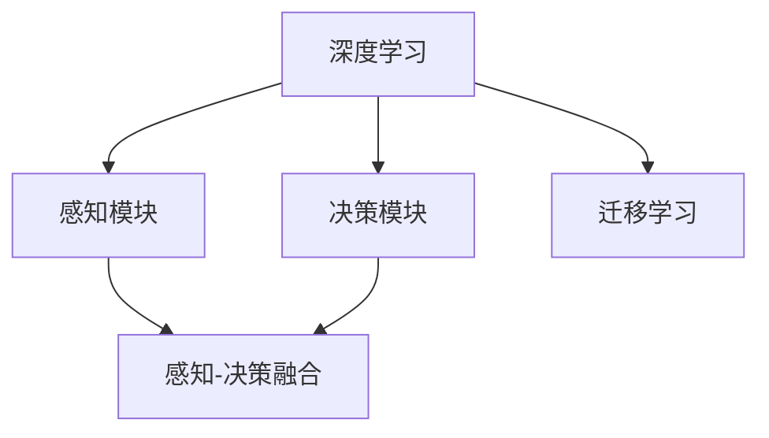

                 

# 一切皆是映射：深度学习在无人驾驶技术中的应用

> 关键词：深度学习,无人驾驶,映射学习,感知,决策,感知-决策融合

## 1. 背景介绍

### 1.1 问题由来
随着深度学习技术的发展，深度学习被广泛应用于无人驾驶领域，从车辆感知到路径规划和控制，都在不同程度上运用了深度学习的技术。深度学习赋予了无人驾驶车辆强大的环境感知和决策能力，使得车辆在复杂的交通环境中能够自主、安全地行驶。

深度学习的核心思想是映射学习，即通过训练神经网络模型，将输入数据（如图像、激光雷达数据等）映射到输出结果（如车辆控制指令）。无人驾驶技术中的核心模块如感知、决策、感知-决策融合等，都是深度学习在无人驾驶中广泛应用的例证。

### 1.2 问题核心关键点
深度学习在无人驾驶技术中的应用主要集中在以下几个方面：
1. **感知模块**：通过深度学习模型处理传感器数据，如摄像头、激光雷达、雷达等，获取车辆周围环境的准确信息。
2. **决策模块**：利用深度学习模型对感知结果进行决策，包括路径规划、行为选择等。
3. **感知-决策融合**：将感知与决策结合，实现对复杂交通环境的实时响应和处理。
4. **知识迁移与泛化**：利用迁移学习技术，将无人驾驶车辆在特定场景中学习的知识迁移到新的场景中，提高泛化能力。

深度学习在无人驾驶中的应用，不仅提升了车辆在复杂环境中的驾驶能力，还为自动驾驶技术的商业化应用提供了有力支持。但深度学习的存在局限性，如黑箱性、泛化能力有限、对传感器依赖等，需要通过不断的技术创新来克服。

### 1.3 问题研究意义
深度学习在无人驾驶技术中的应用具有重要的研究意义：

1. **提升驾驶安全性**：通过深度学习提升车辆感知和决策能力，能够显著降低交通事故的发生率，提升驾驶安全性。
2. **提高驾驶效率**：深度学习能够实时处理大量传感器数据，加速决策过程，提高驾驶效率。
3. **推动技术进步**：深度学习的广泛应用加速了无人驾驶技术的进步，为未来交通系统提供了新的可能性。
4. **促进产业升级**：深度学习的应用促进了自动驾驶行业的技术升级和市场扩张，带来了新的经济增长点。
5. **支持政策落地**：深度学习技术的发展为无人驾驶相关政策法规的制定提供了技术支撑。

## 2. 核心概念与联系

### 2.1 核心概念概述

为了更好地理解深度学习在无人驾驶技术中的应用，本节将介绍几个密切相关的核心概念：

- **深度学习**：一种基于多层神经网络的机器学习技术，通过训练数据学习复杂的映射关系。
- **感知模块**：利用深度学习模型处理传感器数据，获取车辆周围环境的准确信息。
- **决策模块**：利用深度学习模型对感知结果进行决策，包括路径规划、行为选择等。
- **感知-决策融合**：将感知与决策结合，实现对复杂交通环境的实时响应和处理。
- **迁移学习**：一种利用已有知识来提高新任务学习效率的方法，应用于无人驾驶中的知识迁移。

这些核心概念之间的逻辑关系可以通过以下Mermaid流程图来展示：



这个流程图展示了大语言模型的核心概念及其之间的关系：

1. 深度学习作为通用技术，通过感知和决策两个子模块，为无人驾驶提供了感知和决策能力。
2. 感知-决策融合模块将感知和决策结合，实现对复杂交通环境的实时响应。
3. 迁移学习用于加速新场景中的知识学习，提高模型的泛化能力。

## 3. 核心算法原理 & 具体操作步骤
### 3.1 算法原理概述

深度学习在无人驾驶技术中的应用，本质上是通过训练神经网络模型，将输入数据（如传感器数据）映射到输出结果（如控制指令）。具体来说，深度学习的核心是映射学习，即通过训练神经网络，将输入数据映射到输出结果。

在无人驾驶中，深度学习的映射学习主要体现在以下几个方面：

- **感知映射**：利用深度学习模型处理传感器数据，获取车辆周围环境的准确信息。
- **决策映射**：利用深度学习模型对感知结果进行决策，包括路径规划、行为选择等。
- **感知-决策映射**：将感知与决策结合，实现对复杂交通环境的实时响应。

形式化地，假设输入数据为 $X$，输出结果为 $Y$，则深度学习的目标是通过训练神经网络，使得映射函数 $f$ 最小化输入和输出的误差：

$$
\min_{f} \sum_{i=1}^N || f(x_i) - y_i ||^2
$$

其中 $x_i$ 和 $y_i$ 分别为第 $i$ 个样本的输入和输出，$N$ 为样本数量。

通过优化目标函数，深度学习模型能够学习到输入和输出之间的复杂映射关系，从而实现无人驾驶中的感知和决策。

### 3.2 算法步骤详解

深度学习在无人驾驶技术中的应用，通常包括以下几个关键步骤：

**Step 1: 数据收集与预处理**
- 收集无人驾驶车辆的各种传感器数据，如摄像头图像、激光雷达点云、雷达信号等。
- 对数据进行预处理，如降噪、归一化、数据增强等。

**Step 2: 模型选择与训练**
- 选择适合的深度学习模型，如卷积神经网络（CNN）、循环神经网络（RNN）、变压器（Transformer）等。
- 将预处理后的数据划分为训练集、验证集和测试集。
- 使用训练集对模型进行训练，优化模型参数。

**Step 3: 感知模块训练**
- 利用深度学习模型对摄像头、激光雷达、雷达等传感器数据进行处理，提取车辆周围环境的特征。
- 将提取的特征输入到感知-决策融合模块中，进行后续处理。

**Step 4: 决策模块训练**
- 利用深度学习模型对感知结果进行决策，包括路径规划、行为选择等。
- 将决策结果输出到控制模块，生成控制指令。

**Step 5: 感知-决策融合训练**
- 将感知模块和决策模块结合，训练感知-决策融合模型。
- 利用训练集和验证集对模型进行优化，确保在测试集上也能获得理想的性能。

**Step 6: 模型评估与部署**
- 在测试集上评估模型的性能，对比训练前后的精度提升。
- 使用微调后的模型对新样本进行推理预测，集成到实际的应用系统中。

以上是深度学习在无人驾驶技术中的典型应用流程。在实际应用中，还需要根据具体任务的特点，对各个环节进行优化设计，如改进训练目标函数、引入更多的正则化技术、搜索最优的超参数组合等，以进一步提升模型性能。

### 3.3 算法优缺点

深度学习在无人驾驶技术中的应用具有以下优点：
1. 强大感知能力：深度学习模型能够处理大量的传感器数据，提取丰富的环境信息。
2. 高效决策：深度学习模型能够实时处理数据，快速生成控制指令。
3. 良好的泛化能力：深度学习模型在大量的标注数据上进行训练，具有较好的泛化能力。
4. 支持端到端优化：深度学习模型可以实现端到端的优化，提升了系统整体性能。

同时，深度学习在无人驾驶中的应用也存在以下局限性：
1. 数据依赖：深度学习需要大量的标注数据进行训练，数据采集成本高。
2. 黑箱性：深度学习模型难以解释其内部工作机制，调试和优化难度大。
3. 对传感器依赖：深度学习对传感器数据的质量和稳定性要求较高。
4. 泛化能力有限：深度学习模型在特定场景中训练，泛化能力有限。
5. 计算资源需求高：深度学习模型参数量大，对计算资源要求高。

尽管存在这些局限性，但就目前而言，深度学习在无人驾驶中的应用是最主流范式。未来相关研究的重点在于如何进一步降低对标注数据的依赖，提高模型的泛化能力和可解释性，同时兼顾可解释性和伦理安全性等因素。

### 3.4 算法应用领域

深度学习在无人驾驶技术中的应用已经得到了广泛的应用，覆盖了无人驾驶领域的多个方面，例如：

- **环境感知**：通过深度学习模型处理传感器数据，获取车辆周围环境的准确信息。
- **路径规划**：利用深度学习模型对感知结果进行路径规划，选择最优路径。
- **行为选择**：利用深度学习模型对感知结果进行行为选择，如加速、减速、变道等。
- **决策支持**：利用深度学习模型对车辆周围环境进行动态分析，提供决策支持。
- **异常检测**：利用深度学习模型对传感器数据进行异常检测，避免异常情况对驾驶造成影响。

除了上述这些经典应用外，深度学习还被创新性地应用于无人驾驶中的多车协作、自适应巡航控制、车联网等场景，为无人驾驶技术的智能化和自动化带来了新的突破。随着深度学习技术的不断进步，相信无人驾驶技术将在更广阔的应用领域大放异彩。

## 4. 数学模型和公式 & 详细讲解  
### 4.1 数学模型构建

深度学习在无人驾驶技术中的应用，通常使用多层神经网络模型。以下以卷积神经网络（CNN）为例，介绍其数学模型构建。

**CNN的数学模型**：

假设输入数据 $x$ 为 $n$ 维向量，输出结果 $y$ 为 $m$ 维向量，则CNN的数学模型可以表示为：

$$
f(x; \theta) = W^{(m)} * g(W^{(l)} * g(\cdots * g(W^{(1)} * x + b^{(1)}) + b^{(l)}) + b^{(m)})
$$

其中 $W^{(i)}$ 和 $b^{(i)}$ 分别为第 $i$ 层的权重和偏置项，$g(x) = max(0, x)$ 为激活函数。

**反向传播算法**：

假设损失函数为 $\mathcal{L}(\theta)$，则反向传播算法的步骤如下：

1. 前向传播：计算损失函数对输出层的导数 $\frac{\partial \mathcal{L}}{\partial y^{(m)}}$。
2. 反向传播：逐层计算导数，更新权重和偏置项。

数学公式如下：

$$
\frac{\partial \mathcal{L}}{\partial W^{(i)}} = \frac{\partial \mathcal{L}}{\partial y^{(i)}} * g'(W^{(i)} * g(x) + b^{(i)})
$$

$$
\frac{\partial \mathcal{L}}{\partial b^{(i)}} = \frac{\partial \mathcal{L}}{\partial y^{(i)}} * 1
$$

其中 $g'(x) = 1$ 为激活函数导数。

通过反向传播算法，深度学习模型能够实时更新权重和偏置项，最小化损失函数，从而实现对输入数据的映射学习。

### 4.2 公式推导过程

以下我们以单层卷积神经网络（CNN）为例，推导其数学模型和反向传播算法的详细过程。

假设输入数据 $x$ 为 $n$ 维向量，输出结果 $y$ 为 $m$ 维向量，则CNN的数学模型可以表示为：

$$
y = W * g(x + b)
$$

其中 $W$ 为权重矩阵，$b$ 为偏置项，$g(x) = max(0, x)$ 为激活函数。

设损失函数为 $\mathcal{L}(y, t)$，则反向传播算法的步骤如下：

1. 前向传播：计算损失函数对输出层的导数 $\frac{\partial \mathcal{L}}{\partial y}$。
2. 反向传播：逐层计算导数，更新权重和偏置项。

数学公式如下：

$$
\frac{\partial \mathcal{L}}{\partial y} = \frac{\partial \mathcal{L}}{\partial t} * \frac{\partial t}{\partial y}
$$

$$
\frac{\partial \mathcal{L}}{\partial W} = \frac{\partial \mathcal{L}}{\partial y} * \frac{\partial y}{\partial x} * g'(x)
$$

$$
\frac{\partial \mathcal{L}}{\partial b} = \frac{\partial \mathcal{L}}{\partial y}
$$

其中 $\frac{\partial t}{\partial y}$ 为输出层对损失函数的导数，$\frac{\partial y}{\partial x}$ 为输出层对输入层的导数，$g'(x)$ 为激活函数导数。

在得到损失函数的梯度后，即可带入反向传播算法，完成模型的迭代优化。重复上述过程直至收敛，最终得到适应下游任务的最优模型参数。

## 5. 项目实践：代码实例和详细解释说明
### 5.1 开发环境搭建

在进行无人驾驶深度学习开发前，我们需要准备好开发环境。以下是使用Python进行TensorFlow开发的环境配置流程：

1. 安装Anaconda：从官网下载并安装Anaconda，用于创建独立的Python环境。

2. 创建并激活虚拟环境：
```bash
conda create -n tf-env python=3.8 
conda activate tf-env
```

3. 安装TensorFlow：从官网获取对应的安装命令。例如：
```bash
pip install tensorflow-gpu==2.7
```

4. 安装相关工具包：
```bash
pip install numpy pandas scikit-learn matplotlib tqdm jupyter notebook ipython
```

完成上述步骤后，即可在`tf-env`环境中开始深度学习开发。

### 5.2 源代码详细实现

下面我们以无人驾驶中的环境感知为例，给出使用TensorFlow进行深度学习代码实现。

首先，定义输入数据的占位符和权重偏置项的初始化：

```python
import tensorflow as tf
from tensorflow.keras import layers

# 定义输入数据占位符
input_data = tf.keras.Input(shape=(None, None, 3))

# 定义权重和偏置项的初始化
kernel_initializer = tf.keras.initializers.RandomNormal(stddev=0.01)
bias_initializer = tf.keras.initializers.Zeros()
```

然后，定义卷积神经网络（CNN）模型：

```python
# 定义第一层卷积层
conv1 = layers.Conv2D(32, (3, 3), activation='relu', padding='same', kernel_initializer=kernel_initializer, bias_initializer=bias_initializer)(input_data)

# 定义池化层
pool1 = layers.MaxPooling2D(pool_size=(2, 2))(conv1)

# 定义第二层卷积层
conv2 = layers.Conv2D(64, (3, 3), activation='relu', padding='same', kernel_initializer=kernel_initializer, bias_initializer=bias_initializer)(pool1)

# 定义池化层
pool2 = layers.MaxPooling2D(pool_size=(2, 2))(conv2)

# 定义全连接层
flatten = layers.Flatten()(pool2)

# 定义输出层
output = layers.Dense(10, activation='softmax')(flatten)
```

接着，定义训练和评估函数：

```python
# 定义损失函数和优化器
loss = tf.keras.losses.CategoricalCrossentropy()
optimizer = tf.keras.optimizers.Adam()

# 定义训练函数
def train_step(inputs, labels):
    with tf.GradientTape() as tape:
        logits = model(inputs, training=True)
        loss_value = loss(labels, logits)
    gradients = tape.gradient(loss_value, model.trainable_variables)
    optimizer.apply_gradients(zip(gradients, model.trainable_variables))
    return loss_value

# 定义评估函数
def evaluate_step(inputs, labels):
    logits = model(inputs, training=False)
    loss_value = loss(labels, logits)
    return loss_value
```

最后，启动训练流程并在测试集上评估：

```python
# 定义训练和测试集
train_dataset = tf.data.Dataset.from_tensor_slices((train_images, train_labels))
test_dataset = tf.data.Dataset.from_tensor_slices((test_images, test_labels))

# 定义数据增强操作
data_augmentation = tf.keras.Sequential([
    layers.experimental.preprocessing.RandomFlip('horizontal'),
    layers.experimental.preprocessing.RandomRotation(0.1),
])

# 对训练集进行数据增强和批处理
train_dataset = train_dataset.map(lambda x, y: (data_augmentation(x), y))
train_dataset = train_dataset.shuffle(buffer_size=1024).batch(batch_size).map(lambda x, y: (tf.expand_dims(x, axis=0), y))

# 对测试集进行批处理
test_dataset = test_dataset.batch(batch_size).map(lambda x, y: (tf.expand_dims(x, axis=0), y))

# 定义模型并编译
model = tf.keras.Model(inputs=input_data, outputs=output)
model.compile(optimizer=optimizer, loss=loss, metrics=['accuracy'])

# 开始训练
history = model.fit(train_dataset, epochs=num_epochs, validation_data=test_dataset)
```

以上就是使用TensorFlow对无人驾驶环境感知进行深度学习代码实现。可以看到，TensorFlow提供了丰富的API和模型组件，可以快速搭建深度学习模型。

### 5.3 代码解读与分析

让我们再详细解读一下关键代码的实现细节：

**CNN模型定义**：
- `tf.keras.Input`：定义输入数据的占位符。
- `layers.Conv2D`：定义卷积层，进行特征提取。
- `layers.MaxPooling2D`：定义池化层，进行特征降维。
- `layers.Flatten`：将多维特征展平，为全连接层做准备。
- `layers.Dense`：定义输出层，进行分类。

**训练和评估函数**：
- `tf.keras.losses.CategoricalCrossentropy`：定义损失函数，用于衡量模型输出和真实标签的差异。
- `tf.keras.optimizers.Adam`：定义优化器，用于更新模型参数。
- `train_step`和`evaluate_step`函数：分别用于训练和评估，计算损失并更新模型参数。

**数据增强操作**：
- `tf.keras.Sequential`：定义数据增强序列。
- `layers.experimental.preprocessing.RandomFlip`：随机翻转图像。
- `layers.experimental.preprocessing.RandomRotation`：随机旋转图像。

合理利用这些工具，可以显著提升深度学习模型的训练效率和效果，加快创新迭代的步伐。

当然，工业级的系统实现还需考虑更多因素，如模型的保存和部署、超参数的自动搜索、更灵活的任务适配层等。但核心的深度学习开发流程基本与此类似。

## 6. 实际应用场景
### 6.1 智能驾驶系统

深度学习在无人驾驶技术中的应用，已经广泛用于智能驾驶系统的构建。智能驾驶系统能够实现车辆自动感知环境、决策和控制，从而实现自动驾驶。

在智能驾驶系统中，深度学习主要应用于以下几个方面：

- **环境感知**：利用深度学习模型处理传感器数据，获取车辆周围环境的准确信息。
- **决策支持**：利用深度学习模型对感知结果进行动态分析，提供决策支持。
- **路径规划**：利用深度学习模型对感知结果进行路径规划，选择最优路径。
- **行为选择**：利用深度学习模型对感知结果进行行为选择，如加速、减速、变道等。

利用深度学习技术，智能驾驶系统能够实现更加高效、安全、可靠的自动驾驶。未来，随着深度学习技术的不断发展，智能驾驶系统的应用范围将进一步扩大，为交通安全和城市出行带来新的变革。

### 6.2 自动泊车系统

深度学习在无人驾驶技术中的应用，已经扩展到了自动泊车系统。自动泊车系统利用深度学习模型对车辆周围环境进行感知，识别出可泊车区域，并规划最优泊车路径。

在自动泊车系统中，深度学习主要应用于以下几个方面：

- **环境感知**：利用深度学习模型处理传感器数据，获取车辆周围环境的准确信息。
- **路径规划**：利用深度学习模型对感知结果进行路径规划，选择最优路径。
- **行为选择**：利用深度学习模型对感知结果进行行为选择，如转向、减速等。

利用深度学习技术，自动泊车系统能够实现更加高效、安全、可靠的自动泊车。未来，随着深度学习技术的不断发展，自动泊车系统的应用范围将进一步扩大，为城市停车带来新的变革。

### 6.3 未来应用展望

深度学习在无人驾驶技术中的应用前景广阔，未来可能迎来新的突破：

1. **多模态融合**：将视觉、雷达、激光雷达等多种传感器数据融合，提升环境感知能力。
2. **跨领域迁移**：将无人驾驶技术迁移到其他领域，如工业自动化、医疗诊断等。
3. **端到端学习**：实现端到端学习，提升整体系统的性能和稳定性。
4. **联邦学习**：在分布式系统中，通过联邦学习技术，共享知识，提升模型泛化能力。
5. **自适应学习**：利用自适应学习技术，动态调整模型参数，提升模型性能。
6. **强化学习**：利用强化学习技术，优化决策过程，提升驾驶安全性。

随着深度学习技术的不断进步，相信无人驾驶技术将在更广阔的应用领域大放异彩，为人类出行带来新的便利和体验。

## 7. 工具和资源推荐
### 7.1 学习资源推荐

为了帮助开发者系统掌握深度学习在无人驾驶技术中的应用，这里推荐一些优质的学习资源：

1. **《深度学习》书籍**：由深度学习领域的专家撰写，全面介绍了深度学习的原理和应用，包括无人驾驶技术。

2. **DeepDriving repository**：GitHub上无人驾驶技术开源项目，包含大量深度学习模型和代码实现。

3. **Udacity自动驾驶课程**：Udacity提供的自动驾驶课程，涵盖无人驾驶技术的各个方面，包括深度学习、感知、决策等。

4. **IEEE Transactions on Intelligent Transportation Systems**：无人驾驶技术领域的重要期刊，定期发布最新的研究成果和应用案例。

5. **arXiv.org**：深度学习研究的重要平台，涵盖无人驾驶技术相关的最新论文和技术进展。

通过对这些资源的学习实践，相信你一定能够快速掌握深度学习在无人驾驶技术中的应用精髓，并用于解决实际的无人驾驶问题。

### 7.2 开发工具推荐

高效的开发离不开优秀的工具支持。以下是几款用于无人驾驶深度学习开发的常用工具：

1. **TensorFlow**：由Google主导开发的深度学习框架，具有丰富的API和组件，适合构建复杂的深度学习模型。

2. **PyTorch**：由Facebook主导开发的深度学习框架，具有动态计算图和高效的内存管理，适合快速迭代研究。

3. **Keras**：高级深度学习框架，提供高层次的API，适合快速搭建深度学习模型。

4. **MXNet**：由亚马逊主导开发的深度学习框架，具有高效的分布式计算能力和丰富的组件。

5. **Caffe**：由伯克利大学主导开发的深度学习框架，具有高效的图像处理能力。

合理利用这些工具，可以显著提升无人驾驶深度学习模型的开发效率，加快创新迭代的步伐。

### 7.3 相关论文推荐

深度学习在无人驾驶技术中的应用源于学界的持续研究。以下是几篇奠基性的相关论文，推荐阅读：

1. **"End to End Training of a Deep Neural Network for Self-Driving Cars"**：首次提出利用端到端学习训练无人驾驶车辆，实现了从感知到决策的端到端训练。

2. **"Deep Blue-Box: Towards Visual Awareness for Automated Vehicles"**：提出了基于视觉的无人驾驶系统，通过深度学习模型实现车辆周围环境的感知。

3. **"Learning to Drive: Autonomous Vehicle Control Using a Stochastic Dual Dynamic Programming"**：利用深度学习模型优化无人驾驶车辆的路径规划和控制策略，实现了自动驾驶。

4. **"Learning to Drive through Simulated Human-Robot Interaction"**：利用深度学习模型实现无人驾驶车辆在模拟环境中的学习和训练，提高了实际驾驶的安全性和效率。

5. **"Deep Neural Networks for Real-Time Stereo Object Detection and Track Following"**：利用深度学习模型实现车辆周围物体的实时检测和跟踪，提高了无人驾驶系统的感知能力。

这些论文代表了大语言模型微调技术的发展脉络。通过学习这些前沿成果，可以帮助研究者把握学科前进方向，激发更多的创新灵感。

## 8. 总结：未来发展趋势与挑战

### 8.1 总结

本文对深度学习在无人驾驶技术中的应用进行了全面系统的介绍。首先阐述了深度学习在无人驾驶技术中的研究背景和意义，明确了深度学习在无人驾驶中的核心模块和应用范式。其次，从原理到实践，详细讲解了深度学习在无人驾驶中的数学模型和操作步骤，给出了深度学习代码实现。同时，本文还广泛探讨了深度学习在无人驾驶中的实际应用场景，展示了深度学习技术的广泛应用前景。

通过本文的系统梳理，可以看到，深度学习在无人驾驶技术中的应用已经取得了显著成效，推动了无人驾驶技术的进步。未来，随着深度学习技术的不断进步，无人驾驶技术将在更广阔的应用领域大放异彩，为人类出行带来新的便利和体验。

### 8.2 未来发展趋势

展望未来，深度学习在无人驾驶技术中的应用将呈现以下几个发展趋势：

1. **多模态融合**：将视觉、雷达、激光雷达等多种传感器数据融合，提升环境感知能力。
2. **跨领域迁移**：将无人驾驶技术迁移到其他领域，如工业自动化、医疗诊断等。
3. **端到端学习**：实现端到端学习，提升整体系统的性能和稳定性。
4. **联邦学习**：在分布式系统中，通过联邦学习技术，共享知识，提升模型泛化能力。
5. **自适应学习**：利用自适应学习技术，动态调整模型参数，提升模型性能。
6. **强化学习**：利用强化学习技术，优化决策过程，提升驾驶安全性。

以上趋势凸显了深度学习在无人驾驶技术中的广阔前景。这些方向的探索发展，必将进一步提升无人驾驶系统的性能和应用范围，为无人驾驶技术的落地应用提供新的动力。

### 8.3 面临的挑战

尽管深度学习在无人驾驶技术中的应用已经取得了显著成效，但在迈向更加智能化、普适化应用的过程中，它仍面临诸多挑战：

1. **数据依赖**：深度学习需要大量的标注数据进行训练，数据采集成本高。
2. **黑箱性**：深度学习模型难以解释其内部工作机制，调试和优化难度大。
3. **对传感器依赖**：深度学习对传感器数据的质量和稳定性要求较高。
4. **泛化能力有限**：深度学习模型在特定场景中训练，泛化能力有限。
5. **计算资源需求高**：深度学习模型参数量大，对计算资源要求高。

尽管存在这些挑战，但通过不断技术创新和优化，深度学习在无人驾驶技术中的应用前景仍然广阔。未来研究需要在以下几个方面寻求新的突破：

1. **探索无监督和半监督学习方法**：摆脱对大规模标注数据的依赖，利用自监督学习、主动学习等无监督和半监督范式，最大限度利用非结构化数据，实现更加灵活高效的微调。

2. **研究参数高效和计算高效的微调范式**：开发更加参数高效的微调方法，在固定大部分预训练参数的同时，只更新极少量的任务相关参数。同时优化微调模型的计算图，减少前向传播和反向传播的资源消耗，实现更加轻量级、实时性的部署。

3. **引入因果分析和博弈论工具**：将因果分析方法引入微调模型，识别出模型决策的关键特征，增强输出解释的因果性和逻辑性。借助博弈论工具刻画人机交互过程，主动探索并规避模型的脆弱点，提高系统稳定性。

4. **纳入伦理道德约束**：在模型训练目标中引入伦理导向的评估指标，过滤和惩罚有偏见、有害的输出倾向。同时加强人工干预和审核，建立模型行为的监管机制，确保输出符合人类价值观和伦理道德。

这些研究方向的探索，必将引领深度学习在无人驾驶技术中的应用迈向更高的台阶，为构建安全、可靠、可解释、可控的智能系统铺平道路。面向未来，深度学习技术还需要与其他人工智能技术进行更深入的融合，如知识表示、因果推理、强化学习等，多路径协同发力，共同推动无人驾驶技术的进步。

### 8.4 研究展望

未来，深度学习在无人驾驶技术中的应用将继续拓展，新的突破和应用将不断涌现。以下是对未来研究的一些展望：

1. **多模态感知**：利用多模态感知技术，提升环境感知能力，实现更加全面、准确的环境理解。

2. **自监督学习**：利用自监督学习方法，提高数据利用率，减少对标注数据的依赖。

3. **迁移学习**：利用迁移学习方法，实现知识迁移，提升模型的泛化能力。

4. **强化学习**：利用强化学习方法，优化决策过程，提升驾驶安全性。

5. **联邦学习**：利用联邦学习方法，实现分布式系统中的知识共享，提升模型泛化能力。

6. **可解释性研究**：研究可解释性方法，提高模型的可解释性，增强用户信任。

7. **安全与隐私保护**：研究安全与隐私保护技术，确保数据和模型的安全。

这些研究方向的探索，必将引领深度学习在无人驾驶技术中的应用迈向更高的台阶，为构建安全、可靠、可解释、可控的智能系统铺平道路。面向未来，深度学习技术还需要与其他人工智能技术进行更深入的融合，如知识表示、因果推理、强化学习等，多路径协同发力，共同推动无人驾驶技术的进步。

## 9. 附录：常见问题与解答

**Q1: 深度学习在无人驾驶技术中应用的核心模块有哪些？**

A: 深度学习在无人驾驶技术中的核心模块包括：

1. **环境感知模块**：利用深度学习模型处理传感器数据，获取车辆周围环境的准确信息。

2. **决策支持模块**：利用深度学习模型对感知结果进行动态分析，提供决策支持。

3. **路径规划模块**：利用深度学习模型对感知结果进行路径规划，选择最优路径。

4. **行为选择模块**：利用深度学习模型对感知结果进行行为选择，如加速、减速、变道等。

5. **多模态融合模块**：将视觉、雷达、激光雷达等多种传感器数据融合，提升环境感知能力。

这些模块共同构成了无人驾驶系统的核心，实现从感知到决策的全过程。

**Q2: 深度学习在无人驾驶技术中的数据依赖有哪些？**

A: 深度学习在无人驾驶技术中的数据依赖主要有以下几点：

1. **标注数据需求高**：深度学习需要大量的标注数据进行训练，数据采集成本高。

2. **数据质量要求高**：深度学习对传感器数据的质量和稳定性要求较高，数据预处理工作量大。

3. **数据多样性要求高**：深度学习模型需要多样化的数据进行训练，才能泛化到新的场景中。

4. **数据分布要求高**：深度学习模型需要分布均衡的数据进行训练，避免数据不平衡问题。

合理利用数据增强、迁移学习等技术，可以降低对标注数据的依赖，提高模型的泛化能力。

**Q3: 深度学习在无人驾驶技术中如何实现自适应学习？**

A: 深度学习在无人驾驶技术中的自适应学习主要包括以下几个方面：

1. **在线学习**：利用在线学习技术，实时更新模型参数，适应新环境和新数据。

2. **动态调整超参数**：利用自适应学习技术，动态调整学习率和正则化参数，提高模型性能。

3. **模型压缩与优化**：利用模型压缩和优化技术，提高模型计算效率和泛化能力。

4. **联邦学习**：利用联邦学习技术，实现分布式系统中的知识共享，提高模型泛化能力。

通过这些技术，深度学习在无人驾驶技术中可以实现自适应学习，适应新场景和新数据。

**Q4: 深度学习在无人驾驶技术中如何确保模型的可解释性？**

A: 深度学习在无人驾驶技术中确保模型的可解释性主要包括以下几个方面：

1. **可解释模型**：利用可解释模型，如决策树、线性回归等，提供模型的内部机制解释。

2. **可视化技术**：利用可视化技术，如图像生成、特征可视化等，提供模型的决策过程解释。

3. **规则嵌入**：将符号化的先验知识，如知识图谱、逻辑规则等，与神经网络模型进行融合，增强模型的可解释性。

4. **因果分析**：利用因果分析方法，识别出模型决策的关键特征，增强输出解释的因果性和逻辑性。

5. **人工智能治理**：利用人工智能治理技术，建立模型行为的监管机制，确保输出符合人类价值观和伦理道德。

通过这些技术，深度学习在无人驾驶技术中可以实现可解释性，增强用户信任和系统安全性。

**Q5: 深度学习在无人驾驶技术中的计算资源需求有哪些？**

A: 深度学习在无人驾驶技术中的计算资源需求主要有以下几点：

1. **参数量大**：深度学习模型参数量大，需要大量的计算资源进行训练和推理。

2. **计算密集**：深度学习模型计算密集，需要高性能计算资源支持。

3. **内存占用高**：深度学习模型内存占用高，需要高效内存管理技术支持。

4. **存储需求高**：深度学习模型需要大量的存储资源进行数据存储和模型保存。

通过参数高效和计算高效的微调方法，如LoRA、AdaLoRA等，可以降低计算资源需求，实现更加轻量级、实时性的部署。

**Q6: 深度学习在无人驾驶技术中如何应对泛化能力有限的问题？**

A: 深度学习在无人驾驶技术中应对泛化能力有限的问题主要包括以下几个方面：

1. **迁移学习**：利用迁移学习方法，将预训练知识迁移到新的任务中，提高泛化能力。

2. **多模态感知**：利用多模态感知技术，提高环境感知能力，提升泛化能力。

3. **自适应学习**：利用自适应学习技术，动态调整模型参数，提高泛化能力。

4. **联邦学习**：利用联邦学习技术，实现分布式系统中的知识共享，提高泛化能力。

5. **对抗训练**：利用对抗训练技术，增强模型鲁棒性，提高泛化能力。

通过这些技术，深度学习在无人驾驶技术中可以实现更高的泛化能力，适应新场景和新数据。

---

作者：禅与计算机程序设计艺术 / Zen and the Art of Computer Programming

