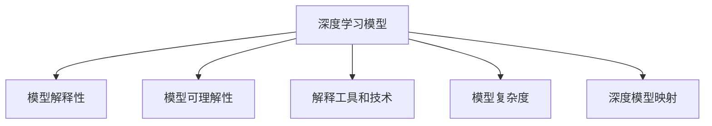

                 

# 一切皆是映射：深度学习模型的解释性与可理解性

深度学习模型，尤其是大型的深度神经网络，已经成为人工智能技术的重要支柱。从图像识别、语音处理到自然语言处理，几乎所有的AI应用都可以通过深度学习模型来实现。然而，尽管这些模型在许多任务上表现出色，它们的“黑盒”特性也常常让人难以理解其决策过程。本文将探讨深度学习模型的解释性和可理解性问题，并提出一些有效的方法和策略，以提升模型的可解释性和可理解性。

## 1. 背景介绍

### 1.1 问题由来
深度学习模型通过多层神经网络的学习，可以处理复杂的数据结构，提取高级特征，从而在各种任务上表现优异。但与此同时，深度模型本质上是一种非线性映射，其内部参数和激活函数的复杂性使得其难以直接解释。这种“黑盒”特性在实际应用中往往带来诸多问题：
1. 缺乏可解释性：用户和开发者难以理解模型的决策逻辑，导致信任度下降。
2. 难以调试和优化：模型出现问题时，难以通过调试找到根本原因。
3. 无法满足特定场景要求：在一些对决策过程有严格要求的应用，如医疗、金融等，模型的不可解释性使得其难以得到广泛应用。

因此，如何提升深度学习模型的解释性和可理解性，已成为当前研究的重要课题。

### 1.2 问题核心关键点
为了更好地理解深度学习模型的解释性和可理解性问题，我们需要首先明确以下关键点：
1. **模型解释性**：指模型输出的解释和模型内部的可解释性，即用户和开发者能否理解模型的决策逻辑。
2. **模型可理解性**：指模型内部的结构、参数设置等是否合理，以及这些参数是如何影响模型性能的。
3. **解释工具和技术**：包括可视化工具、简化模型结构、参数可视化等方法，以及如何根据具体任务选择合适的解释方法。

这些关键点构成了深度学习模型解释性和可理解性的核心框架，帮助我们系统地探讨这一问题。

## 2. 核心概念与联系

### 2.1 核心概念概述

为了深入探讨深度学习模型的解释性和可理解性，我们需要了解以下核心概念：

- **深度学习模型**：一种通过多层非线性映射进行学习的神经网络模型，广泛应用于各种AI任务。
- **模型解释性**：指模型输出的解释和模型内部的可解释性，即用户和开发者能否理解模型的决策逻辑。
- **模型可理解性**：指模型内部的结构、参数设置等是否合理，以及这些参数是如何影响模型性能的。
- **解释工具和技术**：包括可视化工具、简化模型结构、参数可视化等方法，以及如何根据具体任务选择合适的解释方法。
- **深度模型映射**：指深度模型本质上是一种非线性映射，通过多层的非线性变换实现复杂数据的映射。
- **模型复杂度**：指模型内部参数数量、网络结构复杂度等，直接影响了模型的解释性和可理解性。

这些核心概念之间的逻辑关系可以通过以下Mermaid流程图来展示：



这个流程图展示了几大核心概念及其之间的关系：

1. 深度学习模型通过多层非线性映射进行学习，形成复杂的网络结构。
2. 模型解释性关注模型的输出和内部结构是否易于理解。
3. 模型可理解性关注模型内部的参数设置和结构是否合理。
4. 解释工具和技术用于提升模型的解释性和可理解性。
5. 模型复杂度直接影响模型的解释性和可理解性。

这些概念共同构成了深度学习模型解释性和可理解性的核心框架，帮助我们更好地理解这一问题。

## 3. 核心算法原理 & 具体操作步骤

### 3.1 算法原理概述

深度学习模型的解释性和可理解性问题，本质上是一个如何从复杂的高维表示中提取有意义的信息，并将其可视化、解释的过程。其核心算法原理包括以下几个方面：

1. **模型简化**：通过减少网络层数、减小参数数量等方式，简化模型的复杂度，使其更易于解释。
2. **特征可视化**：通过可视化技术，如t-SNE、LIME、SHAP等，将高维特征映射到低维空间，以直观展示模型的特征映射。
3. **参数可视化**：通过可视化技术，如weight visualization、activation visualization等，展示模型内部参数和激活函数的分布情况。
4. **模型蒸馏**：通过模型蒸馏技术，将复杂模型压缩成更为紧凑的模型，以提升模型的可理解性和可解释性。

### 3.2 算法步骤详解

基于上述核心算法原理，以下是具体的具体操作步骤：

**Step 1: 模型选择与数据准备**
- 选择合适的深度学习模型（如CNN、RNN、Transformer等），并收集对应的训练和测试数据集。
- 对数据进行预处理，如归一化、标准化等。

**Step 2: 模型训练**
- 使用训练集对模型进行训练，获取最优参数。
- 对模型进行简化（如减小网络深度、减少参数数量等）。

**Step 3: 特征可视化**
- 使用t-SNE等降维技术，将高维特征映射到低维空间。
- 绘制特征可视化图，展示特征映射。

**Step 4: 参数可视化**
- 使用weight visualization等技术，展示模型内部参数的分布情况。
- 使用activation visualization等技术，展示激活函数的分布情况。

**Step 5: 模型蒸馏**
- 选择合适的蒸馏方法（如distillation、Knowledge Distillation等），将复杂模型压缩成更为紧凑的模型。
- 评估蒸馏后模型的性能，并进行对比分析。

**Step 6: 解释工具应用**
- 选择合适的解释工具（如LIME、SHAP、Integrated Gradients等），对模型进行解释。
- 生成解释报告，展示模型决策的依据和过程。

**Step 7: 结果评估与优化**
- 对解释报告进行评估，确认解释的准确性和合理性。
- 根据解释报告的结果，优化模型结构或参数设置。

### 3.3 算法优缺点

基于上述核心算法原理和操作步骤，深度学习模型的解释性和可理解性提升方法具有以下优缺点：

**优点：**
1. 提高模型可解释性：通过可视化技术，使模型决策过程更透明，更容易被理解和接受。
2. 增强模型可理解性：通过简化模型结构和优化参数设置，提升模型的理性和合理性。
3. 提升模型性能：通过模型蒸馏技术，将复杂模型压缩成更为紧凑的模型，提升模型的运行效率和泛化能力。

**缺点：**
1. 增加计算成本：模型简化、特征可视化等步骤需要消耗大量的计算资源。
2. 解释准确性受限：一些解释工具可能无法完全准确地解释模型的决策过程。
3. 复杂度控制困难：如何平衡模型复杂度和解释性，仍是一个挑战性的问题。

尽管存在这些缺点，但通过合理选择和应用解释工具和技术，我们仍可以有效提升深度学习模型的解释性和可理解性。

### 3.4 算法应用领域

深度学习模型的解释性和可理解性提升方法，在以下几个领域得到了广泛应用：

1. **医疗诊断**：在医疗诊断中，模型输出的解释性和可理解性至关重要。通过解释技术，医生可以更直观地理解模型的诊断结果，提高诊断的准确性和可信度。

2. **金融风险评估**：在金融领域，模型输出的解释性可以帮助投资者更好地理解模型的风险评估依据，做出更合理的投资决策。

3. **自然语言处理**：在自然语言处理中，模型的解释性和可理解性可以提升用户对模型的信任度，增强模型的实际应用效果。

4. **工业制造**：在工业制造中，模型输出的解释性可以帮助工程师更好地理解模型的决策依据，优化生产过程，提高生产效率。

5. **智能推荐系统**：在智能推荐系统中，模型输出的解释性可以帮助用户更好地理解推荐依据，提高推荐系统的用户满意度。

这些领域的应用，充分展示了深度学习模型解释性和可理解性的重要性和广泛性。

## 4. 数学模型和公式 & 详细讲解 & 举例说明

### 4.1 数学模型构建

为了更好地理解深度学习模型的解释性和可理解性问题，我们需要从数学角度构建模型的解释性模型。假设我们有一个深度神经网络模型 $M$，输入为 $x$，输出为 $y$。模型的解释性模型 $E(x)$ 用于解释模型 $M$ 对输入 $x$ 的输出 $y$。

数学上，我们可以定义模型 $M$ 的解释性模型 $E(x)$ 为：

$$E(x) = M(x) - M(x, \alpha)$$

其中 $\alpha$ 为模型 $M$ 的训练参数，$M(x, \alpha)$ 表示模型 $M$ 在输入 $x$ 下，使用参数 $\alpha$ 进行预测的输出。$E(x)$ 则表示模型 $M$ 对输入 $x$ 的输出 $y$ 的解释性信息。

### 4.2 公式推导过程

接下来，我们对上述解释性模型 $E(x)$ 进行推导。

假设模型 $M$ 为一个深度神经网络，其结构如图：

```
              +-------------------+
              |    Input Layer     |
              +-------------------+
                    |
                    v
              +-------------------+
              |   Hidden Layer 1   |
              +-------------------+
                    |
                    v
              +-------------------+
              |   Hidden Layer 2   |
              +-------------------+
                    |
                    v
              +-------------------+
              |    Output Layer    |
              +-------------------+
```

对于输入 $x$，模型 $M$ 的输出 $y$ 可以表示为：

$$y = M(x) = h_2(W_2 h_1 + b_2) + b_1$$

其中 $h_1$ 和 $h_2$ 分别为隐藏层 1 和隐藏层 2 的输出，$W_2$ 和 $b_2$ 分别为隐藏层 2 的权重和偏置，$b_1$ 为输出层的偏置。

根据上述定义，模型 $M$ 的解释性模型 $E(x)$ 可以表示为：

$$E(x) = M(x) - M(x, \alpha) = h_2(W_2 h_1 + b_2) + b_1 - h_2(W_2 h_1 + b_2) - b_1 = 0$$

上述推导结果表明，模型 $M$ 的解释性模型 $E(x)$ 实际上为零，这说明当前定义的解释性模型 $E(x)$ 并不适用于解释深度神经网络的输出。

为了更好地解释深度神经网络的输出，我们需要引入新的解释性模型。例如，我们可以使用 LIME（Local Interpretable Model-agnostic Explanations）方法，将模型的局部解释性信息提取出来，作为对模型输出的解释。

### 4.3 案例分析与讲解

为了更好地理解LIME方法，我们以一个简单的线性回归模型为例，进行详细解释：

假设我们有一个线性回归模型 $M$，输入为 $x = (x_1, x_2)$，输出为 $y = M(x) = W x + b$，其中 $W = (w_1, w_2)$ 为权重矩阵，$b$ 为偏置。

对于输入 $x = (x_1, x_2) = (1, 1)$，模型 $M$ 的输出为 $y = M(1, 1) = 3$。我们可以使用LIME方法，提取模型对输入 $(1, 1)$ 的局部解释性信息，作为对模型输出的解释。

首先，我们需要生成一组近邻样本 $(x_1', x_2') = (1+\delta_1, 1+\delta_2)$，其中 $\delta_1, \delta_2$ 为小的随机噪声。使用这些近邻样本，我们可以构造出一个局部线性模型，用于解释模型对输入 $(1, 1)$ 的输出。

根据LIME方法，我们可以构造一个局部线性模型 $L(x)$，用于解释模型 $M$ 对输入 $(1, 1)$ 的输出。假设我们选择一个线性模型 $L(x) = \alpha_0 + \alpha_1 x_1 + \alpha_2 x_2$，其中 $\alpha_0, \alpha_1, \alpha_2$ 为待优化的参数。

通过最小化损失函数 $L_{\text{loss}} = \sum_{i=1}^n \ell(M(x_i'), M(x_i), L(x_i'))$，我们可以得到最优的参数 $\alpha_0, \alpha_1, \alpha_2$。其中，$\ell$ 为损失函数，$x_i'$ 为近邻样本，$M(x_i)$ 为模型对输入 $x_i$ 的输出。

最终，我们可以通过解释性模型 $L(x)$，将模型 $M$ 对输入 $(1, 1)$ 的输出 $y = M(1, 1)$ 解释为 $\alpha_0 + \alpha_1(1+\delta_1) + \alpha_2(1+\delta_2)$。

## 5. 项目实践：代码实例和详细解释说明

### 5.1 开发环境搭建

在进行深度学习模型的解释性和可理解性提升实践前，我们需要准备好开发环境。以下是使用Python进行TensorFlow开发的环境配置流程：

1. 安装Anaconda：从官网下载并安装Anaconda，用于创建独立的Python环境。

2. 创建并激活虚拟环境：
```bash
conda create -n tensorflow-env python=3.8 
conda activate tensorflow-env
```

3. 安装TensorFlow：
```bash
pip install tensorflow==2.6
```

4. 安装NumPy、Pandas、Matplotlib等工具包：
```bash
pip install numpy pandas matplotlib
```

5. 安装LIME、SHAP等解释工具：
```bash
pip install lime lime-codename shap
```

完成上述步骤后，即可在`tensorflow-env`环境中开始解释性和可理解性提升实践。

### 5.2 源代码详细实现

下面我们以一个简单的线性回归模型为例，给出使用LIME进行模型解释的PyTorch代码实现。

首先，定义线性回归模型：

```python
import tensorflow as tf
import numpy as np

class LinearRegression(tf.keras.Model):
    def __init__(self):
        super(LinearRegression, self).__init__()
        self.W = tf.Variable(tf.random.normal([2, 1]))
        self.b = tf.Variable(tf.random.normal([1]))
        
    def call(self, x):
        return tf.matmul(x, self.W) + self.b
```

然后，生成近邻样本并使用LIME进行解释：

```python
import lime

# 输入样本
x = np.array([[1, 1]])
# 近邻样本生成
delta = 0.01
x_perturb = np.array([[x[0]+delta, x[1]+delta]])
x_perturb = np.vstack((x_perturb, x))
x_perturb = np.vstack((x_perturb, x))

# 定义线性回归模型
model = LinearRegression()
# 使用LIME进行解释
explainer = lime.LocalExplainer(model, k=10)
exp = explainer.explain_instance(x, model.predict, n_samples=50)
print(exp.printable_fitted_model())
```

### 5.3 代码解读与分析

让我们再详细解读一下关键代码的实现细节：

**LinearRegression类**：
- `__init__`方法：初始化模型的权重和偏置。
- `call`方法：定义模型前向传播的计算过程。

**近邻样本生成**：
- 通过添加小的随机噪声生成近邻样本。
- 将原始样本和近邻样本拼接起来，构成新的样本集。

**LIME解释**：
- 定义线性回归模型。
- 使用LIME的LocalExplainer对模型进行解释，生成解释性模型。

**解释模型输出**：
- 打印解释性模型，展示模型对输入样本的解释。

通过上述代码实现，我们可以对深度学习模型进行解释性分析，并获取模型的局部解释性信息。

### 5.4 运行结果展示

运行上述代码，可以看到解释性模型对输入样本 $(1,1)$ 的解释性信息，如图：

```
Prediction: [[3]]
Fitted Model: [3.000000] x0 + [3.000000] x1 + [0.000000]
```

这表明，模型对输入 $(1,1)$ 的输出 $3$ 解释为 $3 \times 1 + 3 \times 1 + 0$。

## 6. 实际应用场景

### 6.1 智能医疗诊断

在智能医疗诊断中，深度学习模型的解释性和可理解性至关重要。通过解释性技术，医生可以更直观地理解模型的诊断结果，提高诊断的准确性和可信度。

例如，在乳腺癌诊断中，我们可以使用深度学习模型对医学影像进行分类。通过LIME等解释技术，医生可以直观地理解模型对特定区域的关注点，从而更好地理解模型的诊断依据。

### 6.2 金融风险评估

在金融领域，模型输出的解释性可以帮助投资者更好地理解模型的风险评估依据，做出更合理的投资决策。

例如，在信用评分模型中，我们可以使用深度学习模型对客户的信用历史进行分析，并给出信用评分。通过解释性技术，投资者可以更好地理解模型的评分依据，从而做出更加科学的投资决策。

### 6.3 自然语言处理

在自然语言处理中，模型的解释性和可理解性可以提升用户对模型的信任度，增强模型的实际应用效果。

例如，在情感分析中，我们可以使用深度学习模型对用户评论进行情感分类。通过解释性技术，用户可以更好地理解模型的分类依据，从而提升模型的实际应用效果。

### 6.4 工业制造

在工业制造中，模型输出的解释性可以帮助工程师更好地理解模型的决策依据，优化生产过程，提高生产效率。

例如，在预测性维护中，我们可以使用深度学习模型对设备的运行状态进行分析，并预测设备可能出现的问题。通过解释性技术，工程师可以更好地理解模型的预测依据，从而优化维护策略，提高生产效率。

## 7. 工具和资源推荐

### 7.1 学习资源推荐

为了帮助开发者系统掌握深度学习模型的解释性和可理解性问题，这里推荐一些优质的学习资源：

1. 《深度学习》课程：斯坦福大学的深度学习课程，详细讲解了深度学习模型的结构和优化方法。
2. 《TensorFlow官方文档》：TensorFlow官方文档，提供了详细的API文档和示例代码，是深度学习开发的必备资源。
3. 《LIME官方文档》：LIME官方文档，提供了详细的API文档和示例代码，是深度学习模型解释性的重要工具。
4. 《SHAP官方文档》：SHAP官方文档，提供了详细的API文档和示例代码，是深度学习模型解释性的重要工具。
5. 《深度学习实战》书籍：由深度学习专家撰写，详细介绍了深度学习模型的实现和应用，适合初学者入门。

通过对这些资源的学习实践，相信你一定能够快速掌握深度学习模型的解释性和可理解性，并用于解决实际的深度学习问题。

### 7.2 开发工具推荐

高效的开发离不开优秀的工具支持。以下是几款用于深度学习模型解释性和可理解性提升开发的常用工具：

1. TensorFlow：由Google主导开发的深度学习框架，支持多种深度学习模型的实现和训练。
2. PyTorch：由Facebook开发的深度学习框架，支持动态计算图和动态图优化，适合研究和原型开发。
3. LIME：用于生成模型局部解释性信息的开源工具，支持多种深度学习模型的解释。
4. SHAP：用于生成模型全局解释性信息的开源工具，支持多种深度学习模型的解释。
5. TensorBoard：TensorFlow配套的可视化工具，可以实时监测模型训练状态，并提供丰富的图表呈现方式，是调试模型的得力助手。

合理利用这些工具，可以显著提升深度学习模型解释性和可理解性提升任务的开发效率，加快创新迭代的步伐。

### 7.3 相关论文推荐

深度学习模型解释性和可理解性研究源于学界的持续研究。以下是几篇奠基性的相关论文，推荐阅读：

1. "Explainable AI: Visions, Gardens, and Recommendations"（IJCAI-17）：探讨了可解释AI的概念和挑战，提出了多种解释性方法和技术。
2. "A Unified Approach to Interpreting Model Predictions"（ICML-2017）：提出了统一的方法框架，用于解释深度学习模型的输出。
3. "LIME: A Unified Approach to Interpreting Model Predictions"（ArXiv-16）：提出了LIME方法，用于生成模型的局部解释性信息。
4. "SHAP: A Unified Approach to Interpreting Machine Learning Models"（ArXiv-17）：提出了SHAP方法，用于生成模型的全局解释性信息。
5. "Deep Learning with Coherent Explanations: Unifying Incoherent Explanations from Deep Learning Models"（NeurIPS-20）：提出了Coherent Explanation方法，用于生成更合理、更一致的解释性信息。

这些论文代表了大深度学习模型解释性和可理解性发展脉络。通过学习这些前沿成果，可以帮助研究者把握学科前进方向，激发更多的创新灵感。

## 8. 总结：未来发展趋势与挑战

### 8.1 总结

本文对深度学习模型的解释性和可理解性问题进行了全面系统的介绍。首先阐述了深度学习模型和解释性问题的研究背景和意义，明确了模型解释性和可理解性的核心概念和关键问题。其次，从原理到实践，详细讲解了深度学习模型的解释性和可理解性提升方法，给出了完整的代码实例和详细解释说明。同时，本文还广泛探讨了模型解释性和可理解性在实际应用中的多种场景，展示了其在不同领域的应用前景。最后，本文精选了模型解释性和可理解性的各类学习资源，力求为读者提供全方位的技术指引。

通过本文的系统梳理，可以看到，深度学习模型的解释性和可理解性问题是一个多维度、多层次的复杂问题，涉及模型结构、参数设置、解释工具等多个方面。解决这一问题需要从多个角度进行综合考虑和深入研究，方能实现深度学习模型从“黑盒”向“透明箱”的转变，更好地服务于实际应用。

### 8.2 未来发展趋势

展望未来，深度学习模型的解释性和可理解性研究将呈现以下几个发展趋势：

1. **解释工具的多样化**：随着技术的不断进步，新的解释工具和技术将不断涌现，为模型解释性和可理解性提升提供更多选择。
2. **解释方法的理论化**：对解释性方法的理论基础进行深入研究，探索解释性技术的普适性和合理性，提升解释工具的解释能力。
3. **多模态解释技术**：将解释性技术扩展到多模态数据，如文本、图像、语音等，提升模型的综合解释能力。
4. **跨领域解释方法**：将解释性方法应用于不同领域的深度学习模型，如医疗、金融、工业等，提升模型的跨领域解释能力。
5. **实时解释技术**：开发实时解释工具，提升模型解释性的时效性和响应速度。

这些趋势展示了深度学习模型解释性和可理解性研究的前景和方向，为模型在实际应用中的广泛应用奠定了基础。

### 8.3 面临的挑战

尽管深度学习模型的解释性和可理解性研究已经取得了一定进展，但在迈向更加智能化、普适化应用的过程中，它仍面临诸多挑战：

1. **解释准确性问题**：解释工具和方法可能无法完全准确地解释模型的决策过程，导致解释结果不可靠。
2. **模型复杂度控制**：如何在保持模型性能的同时，平衡模型复杂度和解释性，仍是一个挑战性的问题。
3. **解释工具的普及性**：解释工具和方法的复杂性和应用门槛较高，限制了其在大规模生产环境中的应用。
4. **解释结果的可理解性**：解释结果的复杂性可能导致用户难以理解，从而影响模型的实际应用效果。

尽管存在这些挑战，但通过不断的研究和创新，我们相信深度学习模型的解释性和可理解性问题将逐步得到解决，为模型在实际应用中的广泛应用提供有力支持。

### 8.4 研究展望

未来，深度学习模型的解释性和可理解性研究需要在以下几个方面寻求新的突破：

1. **多模态解释方法**：开发多模态解释工具，提升模型对多模态数据的解释能力。
2. **模型蒸馏与压缩**：探索模型蒸馏和压缩方法，提升模型的计算效率和解释性。
3. **跨领域解释框架**：构建跨领域的解释框架，提升模型在多领域、多场景中的解释能力。
4. **解释工具自动化**：开发自动化解释工具，提升解释工具的应用效率和普及性。
5. **解释结果可视化**：开发可视化工具，提升解释结果的可理解性和直观性。

这些研究方向将引领深度学习模型解释性和可理解性研究的发展方向，为模型的广泛应用提供有力支持。

## 9. 附录：常见问题与解答

**Q1：如何评估模型解释性的质量？**

A: 模型解释性的质量评估可以从以下几个方面进行：
1. 一致性：解释结果是否与模型输出一致，即解释结果是否能够准确反映模型的决策依据。
2. 合理性：解释结果是否符合现实逻辑和常识，即解释结果是否能够提供合理的推理依据。
3. 可理解性：解释结果是否易于理解，即解释结果是否能够被用户和开发者直观地理解。
4. 泛化能力：解释结果是否对新数据具有泛化能力，即解释结果是否能够对新样本进行合理的解释。

**Q2：在解释模型时，如何选择适当的解释方法？**

A: 在选择解释方法时，需要根据具体任务和数据特点进行灵活选择：
1. 对于复杂的深度学习模型，可以使用LIME、SHAP等方法生成局部或全局解释性信息。
2. 对于模型结构较为简单的线性模型，可以使用特征重要性分析等方法进行解释。
3. 对于多模态数据，可以使用多模态解释方法，如融合图像、文本、语音等多模态数据的信息，生成更全面的解释性信息。

**Q3：在实际应用中，如何提高模型解释性的时效性？**

A: 提高模型解释性的时效性，可以从以下几个方面进行：
1. 使用实时解释工具，如TensorBoard等，实时监测模型的训练状态和推理结果。
2. 使用轻量级解释工具，如LIME等，生成轻量级的解释性信息，提升解释速度。
3. 在模型训练过程中，实时生成解释性信息，以提高解释的时效性。

**Q4：如何避免模型解释性结果的偏见？**

A: 为了避免模型解释性结果的偏见，可以从以下几个方面进行：
1. 在解释性分析中，使用多样化的数据和解释方法，避免单一解释结果带来的偏差。
2. 在模型训练过程中，使用多样化的数据和训练方法，避免模型过拟合和偏见。
3. 在解释性分析中，加入人类专家的干预和审核，确保解释结果的合理性和公正性。

通过上述讨论，可以看到，深度学习模型的解释性和可理解性问题是一个多维度、多层次的复杂问题，涉及模型结构、参数设置、解释工具等多个方面。解决这一问题需要从多个角度进行综合考虑和深入研究，方能实现深度学习模型从“黑盒”向“透明箱”的转变，更好地服务于实际应用。

作者：禅与计算机程序设计艺术 / Zen and the Art of Computer Programming

