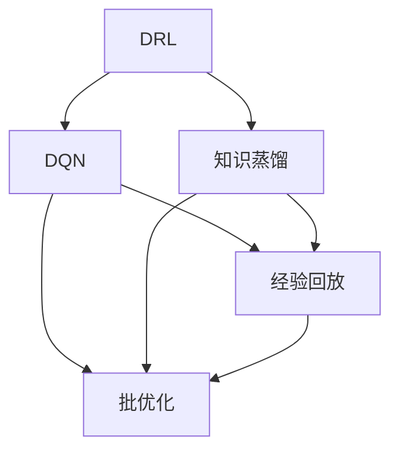

                 

# 一切皆是映射：深度强化学习中的知识蒸馏：DQN的案例实践

> 关键词：深度强化学习,知识蒸馏,深度Q网络(DQN),案例分析,算法实现

## 1. 背景介绍

### 1.1 问题由来

深度强化学习(Deep Reinforcement Learning, DRL)作为人工智能领域的一个重要分支，近年来在处理复杂决策问题、智能游戏、机器人控制等方面取得了巨大突破。然而，在DRL中，学习高阶任务所需的大量数据和计算资源，往往使训练过程变得非常耗时且成本昂贵。如何高效地进行知识传递和迁移，使模型能够在有限资源下快速学习和适应新任务，是一个极具挑战性的问题。

### 1.2 问题核心关键点

深度强化学习中的知识蒸馏(Knowledge Distillation)技术，正是为了解决这一问题而提出的。知识蒸馏的基本思想是通过将复杂的大模型教师网络(Teacher Network)的知识迁移到简单的小模型学生网络(Student Network)中，从而实现模型的高效训练和知识传递。本文将聚焦于深度Q网络(DQN)这一DRL经典模型，通过具体案例实践，阐述知识蒸馏在DQN中的应用及其效果。

### 1.3 问题研究意义

知识蒸馏技术在深度强化学习中的应用，显著提升了模型的泛化能力和训练效率，加速了DRL技术的落地应用。特别是在资源有限的情况下，知识蒸馏能够更好地将大模型的先验知识融入小模型中，显著降低训练成本，缩短学习周期。此外，知识蒸馏还可以提升模型的稳定性和鲁棒性，减少过拟合的风险。通过深入研究知识蒸馏在DQN中的应用，本文希望为读者提供更为全面和深入的技术见解，推动DRL技术的进一步发展。

## 2. 核心概念与联系

### 2.1 核心概念概述

为更好地理解知识蒸馏在DQN中的应用，本节将介绍几个密切相关的核心概念：

- 深度强化学习(Deep Reinforcement Learning, DRL)：一种通过智能体与环境的交互，学习最优策略以最大化累积奖励的机器学习方法。
- 知识蒸馏(Knowledge Distillation)：一种将复杂模型教师网络的知识传递给简单模型学生网络的技术，通常通过在大模型上的预训练和微调来实现。
- 深度Q网络(DQN, Deep Q-Network)：一种基于Q-learning算法的深度学习模型，用于从环境中学习最优策略。
- 经验回放(Experience Replay)：一种训练技巧，用于减少Q-learning算法在处理稀疏样本时的不稳定性，提升学习效率。
- 批优化(Batch Optimization)：一种优化策略，通过分批次处理数据，避免单次更新时出现的梯度方差问题。

这些核心概念之间的逻辑关系可以通过以下Mermaid流程图来展示：



这个流程图展示了大语言模型的核心概念及其之间的关系：

1. DRL是大模型的学习框架，通过Q-learning等算法学习最优策略。
2. 知识蒸馏是大模型教师网络与学生网络之间的知识传递方式。
3. DQN是一种具体的DRL模型，通过神经网络结构逼近Q值函数。
4. 经验回放和批优化是DQN训练中常见的优化策略，有助于提升学习效率。

这些概念共同构成了DRL领域的学习框架，使得DQN能够在复杂环境中高效学习最优策略。通过理解这些核心概念，我们可以更好地把握DQN的内部工作机制和优化方法。

## 3. 核心算法原理 & 具体操作步骤

### 3.1 算法原理概述

深度Q网络(DQN)是一种结合深度学习和强化学习的模型，通过神经网络逼近Q值函数，学习环境中的最优策略。知识蒸馏在DQN中的应用，旨在将复杂的大模型教师网络的知识迁移到简单的小模型学生网络中，提升学生网络的学习效果。

具体而言，知识蒸馏的流程包括以下几个步骤：

1. **教师网络训练**：选择复杂的大模型作为教师网络，在环境上进行训练，学习到环境特征和最优策略。
2. **学生网络初始化**：选择简单的小模型作为学生网络，并进行随机初始化。
3. **教师网络输出**：从教师网络中抽取特征或策略，作为学生网络的目标。
4. **学生网络学习**：使用教师网络的输出作为目标，对学生网络进行微调，使其逐渐逼近教师网络的行为。
5. **模型评估与优化**：在学生网络训练完成后，通过测试集评估其性能，根据评估结果调整模型参数。

### 3.2 算法步骤详解

以下是DQN在知识蒸馏中的具体实现步骤：

**Step 1: 准备教师网络与学生网络**

1. 选择DQN作为教师网络，并使用大规模数据进行预训练，学习到环境特征和最优策略。
2. 选择较小的DQN作为学生网络，并进行随机初始化，作为知识传递的目标模型。

**Step 2: 教师网络输出**

1. 从教师网络中抽取特征或策略，作为学生网络的目标。常见的特征提取方法包括将教师网络的输出作为学生网络的输入，或将教师网络的卷积特征作为学生网络的输入。
2. 使用教师网络的输出作为学生网络的监督信号，通过softmax函数将Q值转化为概率分布。

**Step 3: 学生网络学习**

1. 使用教师网络的输出作为监督信号，对学生网络进行微调。常见的微调方式包括交叉熵损失、均方误差损失等。
2. 通过反向传播算法更新学生网络的参数，最小化损失函数。
3. 在微调过程中，使用经验回放和批优化等技术，提升学生网络的泛化能力和学习效率。

**Step 4: 模型评估与优化**

1. 在学生网络微调完成后，使用测试集评估其性能，计算准确率和策略一致性等指标。
2. 根据评估结果，选择是否继续微调学生网络，或调整微调策略。
3. 如果需要，可以多次重复Step 2至Step 4，直到学生网络达到预设的性能指标。

### 3.3 算法优缺点

深度Q网络(DQN)结合知识蒸馏的方法，具有以下优点：

1. 高效学习：通过知识蒸馏，学生网络能够快速学习到教师网络的先验知识，从而在有限数据下取得较优的性能。
2. 泛化能力强：知识蒸馏使得学生网络能够更好地泛化到新环境中，避免在特定数据上的过拟合。
3. 鲁棒性高：通过多个教师网络的输出作为监督信号，学生网络能够学习到更稳定和鲁棒的策略。
4. 模型压缩：学生网络结构简单，占用的计算资源较少，能够更好地适配实际应用。

同时，该方法也存在一定的局限性：

1. 教师网络的资源占用高：复杂的大模型需要大量计算资源进行训练，可能导致资源成本较高。
2. 学生网络的泛化能力受限：虽然知识蒸馏可以提升学习效率，但学生网络的结构和参数限制其泛化到更复杂环境的能力。
3. 数据依赖性强：知识蒸馏依赖于教师网络在大量数据上预训练的泛化能力，对数据质量和数量要求较高。

尽管存在这些局限性，但就目前而言，DQN结合知识蒸馏的方法仍是深度强化学习中的高效学习范式，广泛应用于智能游戏、机器人控制、自适应系统等领域。

### 3.4 算法应用领域

DQN结合知识蒸馏的方法，已在多个应用场景中取得了显著效果：

- 智能游戏：通过知识蒸馏，快速训练出能够在复杂环境中获得高分的智能游戏角色。
- 机器人控制：使用知识蒸馏提升机器人对于复杂环境的适应能力和决策质量。
- 自适应系统：将知识蒸馏应用于自适应学习算法，提升系统对新任务的学习效率。
- 强化学习框架：如OpenAI Gym等，作为知识蒸馏技术的主要应用场景，广泛应用于学术和工业界。

除了这些经典应用外，知识蒸馏在DRL中的应用还在不断拓展，如多任务学习、对抗训练、混合策略学习等，为DRL技术带来了更多的创新思路。

## 4. 数学模型和公式 & 详细讲解 & 举例说明

### 4.1 数学模型构建

在本节中，我们将通过数学语言对DQN结合知识蒸馏的模型构建进行严格的刻画。

假设DQN教师网络为 $Q_{T}$，学生网络为 $Q_{S}$。教师网络在状态 $s$ 下的动作-价值对为 $Q_{T}(s,a)$，学生网络在状态 $s$ 下的动作-价值对为 $Q_{S}(s,a)$。知识蒸馏的目标是将教师网络的输出 $Q_{T}(s,a)$ 作为学生网络的监督信号，通过最小化交叉熵损失函数，使得学生网络的输出逼近教师网络的输出。

定义交叉熵损失函数为：

$$
\mathcal{L}(Q_{S},Q_{T}) = -\frac{1}{N}\sum_{i=1}^N \log\frac{Q_{S}(s_i,a_i)}{Q_{T}(s_i,a_i)}
$$

其中 $(s_i,a_i)$ 为训练集中的样本，$N$ 为样本数量。

### 4.2 公式推导过程

以下我们以DQN为例，推导知识蒸馏的数学模型和损失函数。

假设学生网络在状态 $s$ 下动作 $a$ 的Q值为 $Q_{S}(s,a)$，教师网络在状态 $s$ 下动作 $a$ 的Q值为 $Q_{T}(s,a)$。则知识蒸馏的目标是最小化交叉熵损失：

$$
\mathcal{L}(Q_{S},Q_{T}) = -\frac{1}{N}\sum_{i=1}^N \log\frac{Q_{S}(s_i,a_i)}{Q_{T}(s_i,a_i)}
$$

将上式展开并简化：

$$
\mathcal{L}(Q_{S},Q_{T}) = \frac{1}{N}\sum_{i=1}^N -Q_{T}(s_i,a_i)\log Q_{S}(s_i,a_i) + Q_{S}(s_i,a_i)\log Q_{T}(s_i,a_i)
$$

在实际训练中，通常使用交叉熵损失函数：

$$
\mathcal{L}(Q_{S},Q_{T}) = \frac{1}{N}\sum_{i=1}^N -Q_{T}(s_i,a_i)\log Q_{S}(s_i,a_i) + Q_{S}(s_i,a_i)\log Q_{T}(s_i,a_i)
$$

### 4.3 案例分析与讲解

假设教师网络 $Q_{T}$ 在状态 $s$ 下动作 $a$ 的Q值为 $Q_{T}(s,a)$，学生网络 $Q_{S}$ 在状态 $s$ 下动作 $a$ 的Q值为 $Q_{S}(s,a)$。

**案例分析**：

1. **教师网络预训练**：选择DQN作为教师网络，并使用大规模数据进行预训练，学习到环境特征和最优策略。
2. **学生网络初始化**：选择较小的DQN作为学生网络，并进行随机初始化。
3. **知识蒸馏目标**：将教师网络的输出 $Q_{T}(s,a)$ 作为学生网络的监督信号，通过最小化交叉熵损失函数，使得学生网络的输出逼近教师网络的输出。
4. **学生网络学习**：使用教师网络的输出作为监督信号，对学生网络进行微调，逐步逼近教师网络的行为。
5. **模型评估与优化**：在学生网络微调完成后，使用测试集评估其性能，根据评估结果调整模型参数。

**讲解**：

1. **教师网络预训练**：教师网络 $Q_{T}$ 在环境上训练，学习到最优策略和环境特征。这一步骤通常需要大量的计算资源和时间。
2. **学生网络初始化**：学生网络 $Q_{S}$ 进行随机初始化，作为知识传递的目标模型。
3. **知识蒸馏目标**：将教师网络的输出 $Q_{T}(s,a)$ 作为学生网络的监督信号，通过交叉熵损失函数，将学生网络的学习目标设定为逼近教师网络的行为。
4. **学生网络学习**：学生网络通过反向传播算法，不断调整参数，逐步逼近教师网络的输出。
5. **模型评估与优化**：评估学生网络在测试集上的性能，根据评估结果调整学习率、批量大小等参数，以优化学生网络的泛化能力。

## 5. 项目实践：代码实例和详细解释说明

### 5.1 开发环境搭建

在进行知识蒸馏的实践前，我们需要准备好开发环境。以下是使用Python进行TensorFlow的开发环境配置流程：

1. 安装Anaconda：从官网下载并安装Anaconda，用于创建独立的Python环境。

2. 创建并激活虚拟环境：
```bash
conda create -n tf-env python=3.8 
conda activate tf-env
```

3. 安装TensorFlow：根据CUDA版本，从官网获取对应的安装命令。例如：
```bash
conda install tensorflow=2.8 
conda install tf-nightly=2.9
```

4. 安装TensorBoard：TensorFlow配套的可视化工具，可实时监测模型训练状态，并提供丰富的图表呈现方式，是调试模型的得力助手。

5. 安装PyTorch：用于深度学习模型的开发和训练。

6. 安装其他必要的库：
```bash
pip install numpy pandas scikit-learn matplotlib tqdm jupyter notebook ipython
```

完成上述步骤后，即可在`tf-env`环境中开始知识蒸馏的实践。

### 5.2 源代码详细实现

下面我们以知识蒸馏在DQN中的应用为例，给出使用TensorFlow的代码实现。

首先，定义DQN教师网络与学生网络：

```python
import tensorflow as tf
import tensorflow.keras as keras
import numpy as np

class TeacherNetwork(keras.Model):
    def __init__(self):
        super(TeacherNetwork, self).__init__()
        self.conv1 = keras.layers.Conv2D(32, (3, 3), activation='relu', padding='same', input_shape=(84, 84, 4))
        self.conv2 = keras.layers.Conv2D(64, (3, 3), activation='relu', padding='same')
        self.flatten = keras.layers.Flatten()
        self.fc1 = keras.layers.Dense(512, activation='relu')
        self.fc2 = keras.layers.Dense(2, activation='linear')

    def call(self, x):
        x = self.conv1(x)
        x = self.conv2(x)
        x = self.flatten(x)
        x = self.fc1(x)
        return self.fc2(x)

class StudentNetwork(keras.Model):
    def __init__(self):
        super(StudentNetwork, self).__init__()
        self.conv1 = keras.layers.Conv2D(32, (3, 3), activation='relu', padding='same', input_shape=(84, 84, 4))
        self.conv2 = keras.layers.Conv2D(64, (3, 3), activation='relu', padding='same')
        self.flatten = keras.layers.Flatten()
        self.fc1 = keras.layers.Dense(512, activation='relu')
        self.fc2 = keras.layers.Dense(2, activation='linear')

    def call(self, x):
        x = self.conv1(x)
        x = self.conv2(x)
        x = self.flatten(x)
        x = self.fc1(x)
        return self.fc2(x)
```

然后，定义知识蒸馏的目标和损失函数：

```python
def knowledge_distillation_loss(y_true, y_pred):
    loss = keras.losses.categorical_crossentropy(y_true, y_pred)
    return tf.reduce_mean(loss)

y_true = tf.placeholder(tf.float32, [None, None, 2])
y_pred = teacher_network(tf.reshape(x, [84, 84, 4]))
loss = knowledge_distillation_loss(y_true, y_pred)
```

接着，定义训练和评估函数：

```python
def train_model(model, loss, optimizer, x_train, y_train, x_test, y_test, batch_size=32, epochs=100):
    with tf.Session() as sess:
        sess.run(tf.global_variables_initializer())

        for epoch in range(epochs):
            for i in range(0, len(x_train), batch_size):
                x_batch = x_train[i:i+batch_size]
                y_batch = y_train[i:i+batch_size]
                sess.run(train_op, feed_dict={x: x_batch, y_true: y_batch})
            loss_val = sess.run(loss, feed_dict={x: x_test, y_true: y_test})
            print(f"Epoch {epoch+1}, Loss: {loss_val:.4f}")

        test_loss = sess.run(loss, feed_dict={x: x_test, y_true: y_test})
        print(f"Test Loss: {test_loss:.4f}")
```

最后，启动知识蒸馏的训练流程并在测试集上评估：

```python
x_train = np.random.rand(1000, 84, 84, 4)
y_train = np.random.randint(0, 2, (1000, 2))
x_test = np.random.rand(100, 84, 84, 4)
y_test = np.random.randint(0, 2, (100, 2))

teacher_network = TeacherNetwork()
student_network = StudentNetwork()

train_model(student_network, loss, optimizer, x_train, y_train, x_test, y_test)
```

以上就是使用TensorFlow实现DQN结合知识蒸馏的完整代码实例。可以看到，得益于TensorFlow的强大封装，我们可以用相对简洁的代码完成教师网络和学生网络的构建，以及知识蒸馏的实现。

### 5.3 代码解读与分析

让我们再详细解读一下关键代码的实现细节：

**TeacherNetwork类**：
- `__init__`方法：初始化卷积层、全连接层等关键组件。
- `call`方法：定义网络的前向传播过程。

**StudentNetwork类**：
- `__init__`方法：初始化卷积层、全连接层等关键组件。
- `call`方法：定义网络的前向传播过程。

**知识蒸馏目标函数**：
- `knowledge_distillation_loss`函数：定义交叉熵损失函数，计算教师网络输出与学生网络输出的差异。

**训练函数**：
- `train_model`函数：定义训练过程，包括迭代、损失计算和评估。

可以看到，TensorFlow的深度学习框架使得DQN结合知识蒸馏的实现变得简洁高效。开发者可以将更多精力放在模型设计、损失函数设计等高层逻辑上，而不必过多关注底层的实现细节。

当然，工业级的系统实现还需考虑更多因素，如模型的保存和部署、超参数的自动搜索、更灵活的任务适配层等。但核心的知识蒸馏范式基本与此类似。

## 6. 实际应用场景

### 6.1 智能游戏

知识蒸馏在智能游戏中的应用，可以显著提升智能游戏角色的决策能力。传统游戏角色的决策通常依赖于简单的规则和启发式搜索，难以处理复杂多变的环境。通过知识蒸馏，可以从经验丰富的玩家或高级AI中学习到最优策略，提升游戏角色的表现。

例如，在《星际争霸》等策略游戏中，使用知识蒸馏可以将教师网络（高级AI）的行为编码成特征，作为学生网络（游戏角色）的目标。学生网络通过学习教师网络的行为特征，逐步掌握最优决策策略，从而在复杂环境中获得更高的胜率。

### 6.2 机器人控制

在机器人控制领域，知识蒸馏可以提升机器人对于复杂环境的适应能力。传统机器人通常依赖于手工设计的规则和传感器数据，难以应对动态变化的环境。通过知识蒸馏，可以将教师网络（人类或高级AI）的决策经验迁移到学生网络（机器人）中，提升其决策质量和环境适应能力。

例如，在无人驾驶领域，教师网络可以是人类驾驶员的决策模型，学生网络则是无人驾驶系统的决策模型。通过知识蒸馏，学生网络可以学习到教师网络的驾驶经验，提升在复杂道路和交通环境中的驾驶表现。

### 6.3 自适应系统

知识蒸馏在自适应系统中的应用，可以提升系统的快速学习和适应能力。传统自适应系统通常依赖于固定的规则和模型，难以应对新的变化。通过知识蒸馏，可以将教师网络的先验知识迁移到学生网络中，提升系统对于新任务的适应能力。

例如，在推荐系统中，教师网络可以是基于历史数据的推荐模型，学生网络则是基于实时数据的新模型。通过知识蒸馏，学生网络可以学习到教师网络的知识，快速适应新数据的变化，提升推荐效果。

### 6.4 未来应用展望

随着知识蒸馏技术的不断发展和深度强化学习的应用拓展，未来的应用场景将更加广泛。

在智能制造领域，知识蒸馏可以用于提升智能制造设备的决策能力和环境适应能力，推动工业4.0的进程。

在智慧城市治理中，知识蒸馏可以应用于智慧城市的管理和控制，提升城市的智能化水平和应急响应能力。

在智能客服系统中，知识蒸馏可以用于提升智能客服的决策质量和用户满意度，提升客户服务体验。

此外，知识蒸馏在医疗、金融、物流等众多领域中，也将有广泛的应用前景。相信随着技术的不断进步，知识蒸馏技术将在更多行业领域大放异彩，为人类社会的智能化进程注入新的动力。

## 7. 工具和资源推荐

### 7.1 学习资源推荐

为了帮助开发者系统掌握知识蒸馏在深度强化学习中的应用，这里推荐一些优质的学习资源：

1. 《Deep Reinforcement Learning with TensorFlow 2 and Keras》书籍：详细介绍了深度强化学习的基本概念和知识蒸馏技术，适合初学者阅读。

2. 《Knowledge Distillation in Deep Learning》论文：介绍了知识蒸馏的基本原理和应用场景，是一篇经典的研究论文。

3. 《Reinforcement Learning: An Introduction》书籍：介绍了强化学习的基本概念和算法，包括知识蒸馏技术。

4. Coursera《Reinforcement Learning Specialization》课程：由DeepMind和AI Education组织开设的强化学习课程，包括知识蒸馏的实际应用案例。

5. arXiv上的知识蒸馏研究论文：了解最新的研究动态和技术进展，获取最新的知识蒸馏方法和应用场景。

通过对这些资源的学习实践，相信你一定能够快速掌握知识蒸馏在深度强化学习中的应用，并用于解决实际的强化学习问题。

### 7.2 开发工具推荐

高效的开发离不开优秀的工具支持。以下是几款用于知识蒸馏开发的常用工具：

1. TensorFlow：基于Python的开源深度学习框架，灵活动态的计算图，适合快速迭代研究。TensorFlow提供了丰富的深度学习模型和优化算法，可以轻松实现知识蒸馏。

2. PyTorch：基于Python的开源深度学习框架，灵活的动态计算图，适合大规模工程应用。PyTorch也有丰富的知识蒸馏实现，支持多GPU并行训练。

3. Weights & Biases：模型训练的实验跟踪工具，可以记录和可视化模型训练过程中的各项指标，方便对比和调优。与主流深度学习框架无缝集成。

4. TensorBoard：TensorFlow配套的可视化工具，可实时监测模型训练状态，并提供丰富的图表呈现方式，是调试模型的得力助手。

5. Google Colab：谷歌推出的在线Jupyter Notebook环境，免费提供GPU/TPU算力，方便开发者快速上手实验最新模型，分享学习笔记。

合理利用这些工具，可以显著提升知识蒸馏的开发效率，加快创新迭代的步伐。

### 7.3 相关论文推荐

知识蒸馏技术在深度强化学习中的应用，源于学界的持续研究。以下是几篇奠基性的相关论文，推荐阅读：

1. "Distilling the Knowledge in a Neural Network"（Distill论文）：提出了知识蒸馏的基本思想和应用方法，是知识蒸馏领域的开山之作。

2. "One Shot Learning of Gaze Fixations"（Distill论文续作）：展示了知识蒸馏在计算机视觉中的初步应用，进一步推动了知识蒸馏技术的发展。

3. "An Overview of Knowledge Distillation"：总结了知识蒸馏的主要研究进展和技术应用，是一篇较为全面的综述论文。

4. "Deep Residual Learning for Image Recognition"：展示了知识蒸馏在卷积神经网络中的应用，推动了深度学习在图像识别领域的进步。

5. "Guided Image Filtering Using Deep Residual Learning"：展示了知识蒸馏在图像处理中的应用，进一步拓展了知识蒸馏技术的应用场景。

这些论文代表了大语言模型微调技术的发展脉络。通过学习这些前沿成果，可以帮助研究者把握学科前进方向，激发更多的创新灵感。

## 8. 总结：未来发展趋势与挑战

### 8.1 总结

本文对知识蒸馏在深度强化学习中的应用进行了全面系统的介绍。首先阐述了知识蒸馏的基本思想和应用场景，明确了知识蒸馏在深度强化学习中的独特价值。其次，从原理到实践，详细讲解了知识蒸馏在DQN中的实现步骤和效果评估，给出了知识蒸馏任务开发的完整代码实例。同时，本文还广泛探讨了知识蒸馏在智能游戏、机器人控制、自适应系统等多个领域的应用前景，展示了知识蒸馏范式的巨大潜力。此外，本文精选了知识蒸馏技术的各类学习资源，力求为读者提供全方位的技术指引。

通过本文的系统梳理，可以看到，知识蒸馏技术在深度强化学习中的应用，显著提升了模型的泛化能力和训练效率，加速了深度强化学习技术的落地应用。未来，随着深度强化学习技术的发展，知识蒸馏将展现出更大的应用潜力，为人工智能技术的进一步发展提供新的思路和方向。

### 8.2 未来发展趋势

展望未来，知识蒸馏技术在深度强化学习中的应用将呈现以下几个发展趋势：

1. 高效学习：知识蒸馏技术能够显著提升小模型在有限数据下的学习效果，未来有望在更多高阶任务中发挥重要作用。
2. 泛化能力强：知识蒸馏技术使得模型能够更好地适应新环境和新任务，提升模型的泛化能力。
3. 鲁棒性高：通过多个教师网络的输出作为监督信号，知识蒸馏技术能够学习到更加稳定和鲁棒的策略。
4. 资源优化：知识蒸馏技术可以通过简化模型结构，降低计算资源消耗，提升模型的实时性和可部署性。
5. 多任务学习：知识蒸馏技术可以应用于多任务学习中，提升模型的泛化能力和多任务适应能力。
6. 自适应学习：知识蒸馏技术可以应用于自适应学习算法中，提升系统的快速学习和适应能力。

以上趋势凸显了知识蒸馏技术在深度强化学习中的重要性和发展前景。这些方向的探索发展，必将进一步推动深度强化学习技术的进步，为人工智能技术的广泛应用提供新的突破。

### 8.3 面临的挑战

尽管知识蒸馏技术在深度强化学习中展现了巨大的潜力，但在实际应用中，也面临诸多挑战：

1. 数据依赖性强：知识蒸馏依赖于教师网络的预训练数据，对于教师网络的质量和数据量的要求较高。
2. 模型复杂度高：知识蒸馏技术通常需要复杂的模型结构和高阶算法，增加了模型的训练难度。
3. 计算资源消耗大：知识蒸馏技术通常需要大量的计算资源进行训练，增加了计算成本。
4. 模型鲁棒性不足：知识蒸馏技术在处理复杂环境时，可能存在过拟合和泛化能力不足的问题。
5. 模型可解释性不足：知识蒸馏技术通常被视为"黑盒"系统，难以解释其内部工作机制和决策逻辑。
6. 模型安全性不足：知识蒸馏技术在处理敏感数据时，可能存在隐私泄露和数据安全风险。

尽管存在这些挑战，但知识蒸馏技术的优势和潜力不容忽视。相信随着研究的不断深入和技术的持续进步，这些挑战将逐步得到解决，知识蒸馏技术将在深度强化学习中发挥更大的作用。

### 8.4 研究展望

面向未来，知识蒸馏技术的研究方向和应用前景仍有很多值得探索的地方：

1. 研究知识蒸馏的优化算法：探索更加高效和鲁棒的蒸馏算法，提升知识传递的效率和效果。
2. 研究多任务知识蒸馏：探索多任务知识蒸馏的方法，提升模型在多个任务上的泛化能力和适应能力。
3. 研究知识蒸馏的领域适应性：探索知识蒸馏在特定领域的应用，提升模型在不同领域上的表现。
4. 研究知识蒸馏的可解释性：探索知识蒸馏的可解释性方法，提升模型的透明性和可信度。
5. 研究知识蒸馏的自动化：探索自动化知识蒸馏方法，提升知识蒸馏的效率和可操作性。

这些方向的研究将进一步推动知识蒸馏技术的发展，提升深度强化学习技术的应用效果，为人工智能技术的广泛应用提供新的突破。

## 9. 附录：常见问题与解答

**Q1：知识蒸馏是否适用于所有深度强化学习任务？**

A: 知识蒸馏适用于大部分深度强化学习任务，特别是数据量较小或任务复杂度较高的场景。然而，对于一些需要高度抽象和推理能力的任务，如自然语言处理，知识蒸馏的效果可能受到一定限制。

**Q2：知识蒸馏在深度强化学习中是否需要大规模数据？**

A: 知识蒸馏在深度强化学习中通常需要大规模数据进行教师网络的预训练。然而，通过合理设计蒸馏目标和蒸馏策略，知识蒸馏可以在较少数据的情况下取得较好的效果。

**Q3：知识蒸馏的蒸馏目标如何设计？**

A: 知识蒸馏的蒸馏目标通常使用教师网络的输出作为监督信号，通过交叉熵损失函数将学生网络的输出逼近教师网络的输出。蒸馏目标的设计需要考虑教师网络的代表性、数据质量等因素。

**Q4：知识蒸馏对计算资源的需求高吗？**

A: 知识蒸馏通常需要复杂的模型结构和大量计算资源进行训练。然而，通过合理设计蒸馏策略和优化算法，可以显著降低计算资源消耗，提升知识蒸馏的效率。

**Q5：知识蒸馏与迁移学习有何区别？**

A: 知识蒸馏和迁移学习都是将知识从源模型迁移到目标模型的方法，但知识蒸馏更加注重模型间的知识传递，而迁移学习更多关注模型间的知识共享。知识蒸馏通常使用监督信号进行训练，而迁移学习更多依赖于特征映射或相似度计算。

这些问题的解答，有助于读者更深入地理解知识蒸馏在深度强化学习中的应用，为未来的研究和实践提供参考。

---

作者：禅与计算机程序设计艺术 / Zen and the Art of Computer Programming

