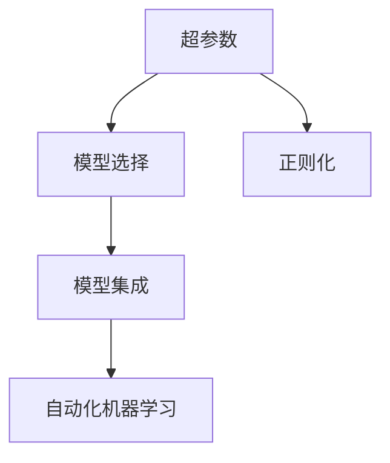

                 

# 一切皆是映射：深度神经网络的调优与优化策略

## 1. 背景介绍

### 1.1 问题由来

深度学习技术的迅猛发展，推动了人工智能(AI)在各个领域的广泛应用。深度神经网络（DNN）作为深度学习的主要分支，由于其强大的表示学习能力和泛化能力，已经成为解决复杂计算问题的利器。然而，由于其巨大的参数量和复杂性，深度神经网络的训练和调优工作变得异常复杂，传统的手工调参方法难以满足现代大规模模型的需求。

调优（Tuning）是深度学习应用中的重要一环，其目的是通过调整网络结构、超参数和训练策略等手段，使模型在给定数据集上达到最优性能。然而，传统的调优工作往往基于经验，难以系统地处理庞大的超参数空间。近年来，随着自动化机器学习的兴起，调优技术逐渐自动化、系统化，向着更加科学和高效的方向发展。

本文将详细阐述深度神经网络调优的核心概念、核心算法原理，以及具体的具体操作步骤和操作步骤，并通过大量实例和案例分析来展示如何高效地调优深度神经网络，使其在特定场景下达到最优性能。

## 2. 核心概念与联系

### 2.1 核心概念概述

深度神经网络调优涉及多个核心概念，包括但不限于：

- **超参数**（Hyperparameters）：这些参数需要手动设置，包括学习率、批量大小、优化器等，它们直接影响模型的训练效果。
- **正则化**（Regularization）：用于防止模型过拟合的多种技术，如L2正则、Dropout等。
- **模型集成**（Model Ensemble）：将多个独立训练的模型结合起来，通过投票或加权平均来提升模型性能。
- **自动化机器学习**（AutoML）：利用机器学习算法自动进行超参数选择、模型选择等调优过程，以减少人工干预。

这些概念之间的逻辑关系可以通过以下Mermaid流程图来展示：



该流程图展示了超参数与模型选择、正则化、模型集成和自动化机器学习之间的联系。超参数的选择直接影响模型的性能和泛化能力，而正则化和模型集成技术则用于提升模型的鲁棒性和泛化能力，自动化机器学习则进一步减少了人工干预，提升了调优的效率和效果。

## 3. 核心算法原理 & 具体操作步骤

### 3.1 算法原理概述

深度神经网络调优的核心在于选择合适的超参数和正则化策略，以防止模型过拟合，并找到最优的模型结构，以提升模型在特定数据集上的性能。调优过程通常包括以下步骤：

1. **数据准备**：收集并预处理训练数据，确保数据集的质量和多样性。
2. **模型选择**：根据任务需求选择合适的网络结构，包括层数、每层的神经元个数等。
3. **超参数选择**：选择一组合理的超参数，包括学习率、批量大小、优化器等。
4. **正则化**：在模型训练过程中加入正则化技术，如L2正则、Dropout等，以防止过拟合。
5. **模型训练**：使用训练集进行模型训练，调整超参数和正则化策略，以获得最优性能。
6. **模型评估**：使用验证集评估模型性能，进行交叉验证等，以确保模型的泛化能力。
7. **模型调优**：根据评估结果调整模型和超参数，重复训练和评估过程，直到达到最优性能。

### 3.2 算法步骤详解

#### 3.2.1 数据准备

数据准备是调优过程的第一步，主要包括以下步骤：

1. **数据收集**：根据任务需求，收集并整理训练数据。数据质量是调优成功的关键，因此需要确保数据的多样性和代表性。
2. **数据预处理**：对数据进行归一化、标准化、缺失值处理等操作，以提高模型的训练效率和稳定性。
3. **数据划分**：将数据划分为训练集、验证集和测试集，以用于模型的训练、调优和评估。

#### 3.2.2 模型选择

模型选择是调优过程中的重要环节，通常包括以下步骤：

1. **网络结构选择**：根据任务需求选择合适的网络结构，如卷积神经网络（CNN）、循环神经网络（RNN）、深度神经网络（DNN）等。
2. **网络层数和神经元个数选择**：根据任务复杂度和数据量，选择合适的层数和每层的神经元个数。
3. **激活函数选择**：选择合适的激活函数，如ReLU、Sigmoid、Tanh等，以提高模型的非线性表达能力。

#### 3.2.3 超参数选择

超参数的选择直接影响模型的训练效果，通常包括以下步骤：

1. **学习率选择**：学习率是控制模型训练速度的关键参数，通常需要进行调参以找到最优值。
2. **批量大小选择**：批量大小影响模型的训练速度和稳定性能，需要进行调参以找到最优值。
3. **优化器选择**：选择合适的优化器，如SGD、Adam、RMSprop等，以提高模型的收敛速度和稳定性。

#### 3.2.4 正则化

正则化是防止模型过拟合的重要手段，通常包括以下步骤：

1. **L2正则化**：通过在损失函数中加入L2正则项，限制模型的参数范围，防止过拟合。
2. **Dropout**：在训练过程中随机丢弃部分神经元，以防止模型过拟合。
3. **Early Stopping**：在验证集上监测模型性能，一旦性能不再提升，立即停止训练。

#### 3.2.5 模型训练

模型训练是调优过程的核心步骤，通常包括以下步骤：

1. **初始化模型参数**：随机初始化模型参数，以避免梯度消失或爆炸问题。
2. **前向传播**：将输入数据输入模型，计算预测结果。
3. **计算损失函数**：计算预测结果与真实结果之间的差异，即损失函数。
4. **反向传播**：根据损失函数计算梯度，更新模型参数。
5. **重复训练**：多次迭代训练，直到模型性能达到最优。

#### 3.2.6 模型评估

模型评估是调优过程的最终环节，通常包括以下步骤：

1. **交叉验证**：使用交叉验证技术评估模型的泛化能力，确保模型在不同数据集上的性能稳定。
2. **性能指标选择**：选择合适的性能指标，如准确率、召回率、F1值等，评估模型性能。
3. **模型调优**：根据评估结果调整模型和超参数，重复训练和评估过程，直到达到最优性能。

### 3.3 算法优缺点

深度神经网络调优技术具有以下优点：

1. **自动化调参**：利用自动化机器学习技术，减少了人工干预，提高了调优效率。
2. **泛化能力提升**：通过正则化和模型集成等技术，提升了模型的泛化能力和鲁棒性。
3. **性能提升**：通过合理的超参数选择和正则化策略，显著提升了模型的性能和泛化能力。

然而，深度神经网络调优技术也存在以下缺点：

1. **计算资源消耗大**：调优过程需要大量的计算资源和计算时间，尤其是超参数调优和模型集成等操作。
2. **超参数选择复杂**：超参数的选择需要大量经验和实验，有时难以找到最优值。
3. **模型复杂度高**：调优后的模型通常具有较大的复杂度，推理速度较慢。

### 3.4 算法应用领域

深度神经网络调优技术已经在多个领域得到了广泛应用，包括但不限于：

1. **计算机视觉**：在图像分类、目标检测、人脸识别等任务中，调优技术广泛应用于模型选择、超参数调优和正则化等环节。
2. **自然语言处理**：在机器翻译、文本分类、情感分析等任务中，调优技术广泛应用于模型选择、超参数调优和正则化等环节。
3. **推荐系统**：在个性化推荐、协同过滤等任务中，调优技术广泛应用于模型选择、超参数调优和正则化等环节。
4. **语音识别**：在语音识别、语音合成等任务中，调优技术广泛应用于模型选择、超参数调优和正则化等环节。

## 4. 数学模型和公式 & 详细讲解 & 举例说明

### 4.1 数学模型构建

深度神经网络调优的数学模型构建主要包括以下步骤：

1. **定义损失函数**：根据任务需求定义合适的损失函数，如交叉熵损失、均方误差损失等。
2. **定义优化器**：选择合适的优化器，如SGD、Adam等，并设定学习率等参数。
3. **定义正则化项**：根据任务需求加入正则化项，如L2正则、Dropout等。
4. **定义训练过程**：根据上述定义，写出模型训练的伪代码，包括前向传播、反向传播和梯度更新等操作。

以图像分类任务为例，其数学模型构建可以如下表示：

$$
L(y, \hat{y}) = -\frac{1}{N}\sum_{i=1}^N(y_i\log(\hat{y}_i) + (1-y_i)\log(1-\hat{y}_i))
$$

其中，$y$表示真实标签，$\hat{y}$表示模型预测结果。

### 4.2 公式推导过程

以图像分类任务为例，其损失函数和梯度更新过程如下：

1. **损失函数**：
$$
L(y, \hat{y}) = -\frac{1}{N}\sum_{i=1}^N(y_i\log(\hat{y}_i) + (1-y_i)\log(1-\hat{y}_i))
$$

2. **梯度更新**：
$$
\theta \leftarrow \theta - \eta \nabla_{\theta}L(y, \hat{y})
$$

其中，$\theta$表示模型参数，$\eta$表示学习率，$\nabla_{\theta}L(y, \hat{y})$表示损失函数对模型参数的梯度。

### 4.3 案例分析与讲解

以目标检测任务为例，其数学模型构建可以如下表示：

1. **损失函数**：
$$
L(y, \hat{y}) = -\frac{1}{N}\sum_{i=1}^N(y_i\log(\hat{y}_i) + (1-y_i)\log(1-\hat{y}_i)) + \lambda(\sum_{j=1}^N||\delta_j||^2)
$$

其中，$\lambda$表示正则化系数，$\delta_j$表示模型预测结果与真实结果之间的误差。

2. **梯度更新**：
$$
\theta \leftarrow \theta - \eta \nabla_{\theta}L(y, \hat{y}) - \eta\lambda\theta
$$

其中，$\nabla_{\theta}L(y, \hat{y})$表示损失函数对模型参数的梯度，$\eta\lambda\theta$表示正则化项对模型参数的梯度。

## 5. 项目实践：代码实例和详细解释说明

### 5.1 开发环境搭建

在开始项目实践之前，需要先搭建好开发环境。以下是在Python环境下搭建深度神经网络调优开发环境的步骤：

1. **安装Python**：从官网下载安装Python，并设置环境变量。
2. **安装TensorFlow**：使用pip安装TensorFlow，并根据CUDA版本选择对应的安装命令。
3. **安装Keras**：使用pip安装Keras，以简化深度神经网络的构建和训练过程。
4. **安装相关库**：安装numpy、scipy、matplotlib等库，以支持数据处理和可视化。

### 5.2 源代码详细实现

以下是一个简单的图像分类任务的深度神经网络调优的代码实现：

```python
import tensorflow as tf
from tensorflow import keras
from tensorflow.keras import layers

# 定义模型
model = keras.Sequential([
    layers.Conv2D(32, (3, 3), activation='relu', input_shape=(28, 28, 1)),
    layers.MaxPooling2D((2, 2)),
    layers.Flatten(),
    layers.Dense(10, activation='softmax')
])

# 编译模型
model.compile(optimizer='adam', loss='sparse_categorical_crossentropy', metrics=['accuracy'])

# 训练模型
model.fit(train_images, train_labels, epochs=10, batch_size=32, validation_data=(test_images, test_labels))

# 评估模型
test_loss, test_acc = model.evaluate(test_images, test_labels)
print('Test accuracy:', test_acc)
```

### 5.3 代码解读与分析

上述代码中，首先定义了一个简单的卷积神经网络模型，包括卷积层、池化层和全连接层。然后，编译模型时选择了Adam优化器和交叉熵损失函数，以提高模型的收敛速度和性能。在训练模型时，使用了交叉验证技术，并设定了10个epochs和32个batch size。最后，评估模型在测试集上的性能，并输出测试精度。

## 6. 实际应用场景

### 6.1 智能推荐系统

深度神经网络调优技术在智能推荐系统中得到了广泛应用，其主要作用在于：

1. **模型选择**：选择合适的深度神经网络模型，如深度神经网络（DNN）、卷积神经网络（CNN）、循环神经网络（RNN）等，以提高推荐系统的性能。
2. **超参数调优**：通过自动化调参技术，调整学习率、批量大小、激活函数等超参数，以提高推荐系统的收敛速度和性能。
3. **正则化**：通过L2正则、Dropout等正则化技术，防止模型过拟合，提高推荐系统的泛化能力。

### 6.2 自动驾驶

深度神经网络调优技术在自动驾驶中得到了广泛应用，其主要作用在于：

1. **模型选择**：选择合适的深度神经网络模型，如卷积神经网络（CNN）、循环神经网络（RNN）等，以提高自动驾驶系统的感知和决策能力。
2. **超参数调优**：通过自动化调参技术，调整学习率、批量大小、激活函数等超参数，以提高自动驾驶系统的训练速度和性能。
3. **正则化**：通过L2正则、Dropout等正则化技术，防止模型过拟合，提高自动驾驶系统的鲁棒性和泛化能力。

### 6.3 医学影像诊断

深度神经网络调优技术在医学影像诊断中得到了广泛应用，其主要作用在于：

1. **模型选择**：选择合适的深度神经网络模型，如卷积神经网络（CNN）、循环神经网络（RNN）等，以提高医学影像诊断系统的性能。
2. **超参数调优**：通过自动化调参技术，调整学习率、批量大小、激活函数等超参数，以提高医学影像诊断系统的训练速度和性能。
3. **正则化**：通过L2正则、Dropout等正则化技术，防止模型过拟合，提高医学影像诊断系统的鲁棒性和泛化能力。

### 6.4 未来应用展望

未来，深度神经网络调优技术将在更多领域得到应用，为人工智能落地应用提供新的思路和方法。以下是一些未来应用展望：

1. **自动调参**：通过自动化调参技术，进一步减少人工干预，提高调优效率和效果。
2. **多任务学习**：将深度神经网络应用于多个任务，通过多任务学习提升模型的泛化能力和鲁棒性。
3. **联邦学习**：通过联邦学习技术，将分散的模型进行联合训练，提升模型的性能和鲁棒性。
4. **迁移学习**：将预训练模型应用于新任务，通过迁移学习提高模型的泛化能力和性能。
5. **异构调优**：通过异构调优技术，提高深度神经网络在异构平台上的性能和鲁棒性。

## 7. 工具和资源推荐

### 7.1 学习资源推荐

1. **《深度学习》课程**：斯坦福大学的深度学习课程，涵盖了深度学习的基础理论和常用算法，适合初学者入门。
2. **《TensorFlow实战》书籍**：讲解TensorFlow的使用方法和深度神经网络的调优技巧，适合进阶学习。
3. **Kaggle竞赛**：参加Kaggle竞赛，通过实践提升深度神经网络的调优能力。
4. **GitHub代码库**：查看并学习其他开发者分享的高质量深度神经网络调优代码。

### 7.2 开发工具推荐

1. **TensorFlow**：Google开发的深度学习框架，支持分布式训练和优化，适合大规模深度神经网络调优。
2. **Keras**：高层次的深度学习API，简单易用，适合快速构建和训练深度神经网络。
3. **AutoKeras**：基于TensorFlow和Keras的自动化机器学习库，适合自动化调参和模型选择。

### 7.3 相关论文推荐

1. **《神经网络中的自适应矩估计方法》**：介绍深度神经网络中的自适应矩估计方法，如Adagrad、Adadelta、Adam等，适用于深度神经网络调优。
2. **《深度学习框架的分布式优化》**：介绍深度神经网络分布式优化的实现方法，适用于大规模深度神经网络调优。
3. **《深度学习中的数据增强》**：介绍深度神经网络中的数据增强方法，适用于提高深度神经网络的泛化能力。

## 8. 总结：未来发展趋势与挑战

### 8.1 研究成果总结

深度神经网络调优技术经过多年的发展，已经取得了显著的成果，广泛应用于各个领域。其主要研究成果包括：

1. **自动化调参**：通过自动化机器学习技术，减少了人工干预，提高了调优效率。
2. **正则化技术**：通过L2正则、Dropout等正则化技术，防止模型过拟合，提高了模型的泛化能力和鲁棒性。
3. **模型集成**：通过模型集成技术，提升了模型的性能和泛化能力。

### 8.2 未来发展趋势

未来，深度神经网络调优技术将朝着以下几个方向发展：

1. **自动化调参**：通过自动化调参技术，进一步减少人工干预，提高调优效率和效果。
2. **多任务学习**：将深度神经网络应用于多个任务，通过多任务学习提升模型的泛化能力和鲁棒性。
3. **联邦学习**：通过联邦学习技术，将分散的模型进行联合训练，提升模型的性能和鲁棒性。
4. **迁移学习**：将预训练模型应用于新任务，通过迁移学习提高模型的泛化能力和性能。
5. **异构调优**：通过异构调优技术，提高深度神经网络在异构平台上的性能和鲁棒性。

### 8.3 面临的挑战

深度神经网络调优技术在发展过程中，也面临着诸多挑战：

1. **计算资源消耗大**：调优过程需要大量的计算资源和计算时间，尤其是超参数调优和模型集成等操作。
2. **超参数选择复杂**：超参数的选择需要大量经验和实验，有时难以找到最优值。
3. **模型复杂度高**：调优后的模型通常具有较大的复杂度，推理速度较慢。

### 8.4 研究展望

未来，深度神经网络调优技术需要从以下几个方面进行深入研究：

1. **高效调参算法**：开发高效调参算法，减少计算资源消耗，提高调优效率。
2. **模型压缩技术**：开发模型压缩技术，减小模型复杂度，提高推理速度。
3. **可解释性研究**：研究深度神经网络的可解释性，提高模型的透明度和可信度。
4. **异构调优技术**：开发异构调优技术，提高深度神经网络在异构平台上的性能和鲁棒性。

## 9. 附录：常见问题与解答

**Q1: 什么是深度神经网络调优？**

A: 深度神经网络调优是指通过调整网络结构、超参数和训练策略等手段，使模型在给定数据集上达到最优性能的过程。

**Q2: 如何选择合适的超参数？**

A: 选择合适的超参数需要结合任务需求和数据特点，通常需要进行多次实验和调参以找到最优值。

**Q3: 什么是正则化？**

A: 正则化是防止模型过拟合的技术，包括L2正则、Dropout等。

**Q4: 什么是模型集成？**

A: 模型集成是将多个独立训练的模型结合起来，通过投票或加权平均来提升模型性能。

**Q5: 什么是自动化机器学习？**

A: 自动化机器学习（AutoML）是利用机器学习算法自动进行超参数选择、模型选择等调优过程，以减少人工干预。

