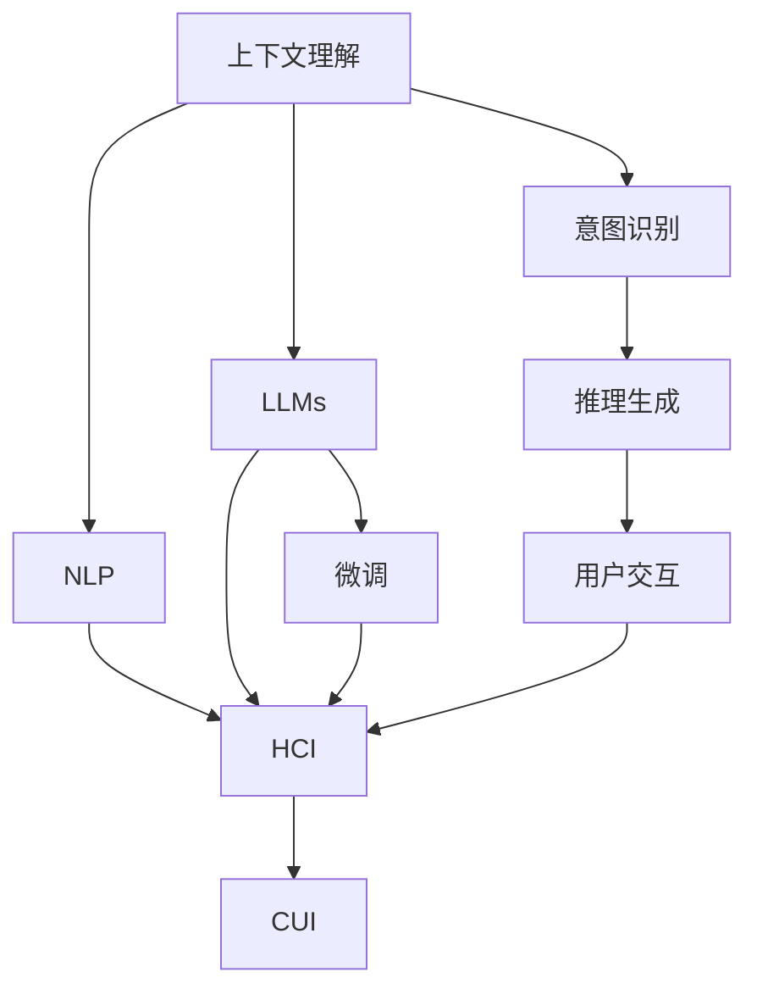

                 

# 上下文理解在CUI中的重要性

## 1. 背景介绍

### 1.1 问题由来

在当前的人工智能（AI）时代，自然语言处理（NLP）技术已经渗透到我们日常生活的方方面面。从智能助手到自动翻译，从自动摘要到智能推荐，NLP技术正在改变我们的工作方式和生活习惯。然而，在这些应用中，上下文理解能力的重要性却常常被忽视。上下文理解能力是指模型能够理解输入文本的前后文关系，从而更准确地解释和生成文本的能力。

上下文理解能力对于人机交互（Human-Computer Interaction, HCI）特别是计算机用户界面（Computer User Interface, CUI）来说尤为重要。CUI是用户与计算机系统之间进行交互的界面，如命令行界面、图形用户界面（GUI）、自然语言用户界面（NUI）等。在这些界面下，用户通过文本、语音、手势等方式与计算机系统进行交流。然而，由于语言的多义性、复杂性和不规范性，计算机系统往往难以准确理解用户意图，导致误操作、信息漏接等问题。

因此，如何在CUI中增强上下文理解能力，提升系统的智能化水平，成为当前NLP研究中的一个重要方向。本文将系统探讨上下文理解在CUI中的重要性，深入剖析其核心概念、算法原理和应用场景，并给出详细的实践案例和未来展望。

### 1.2 问题核心关键点

上下文理解能力在大规模语言模型中已经得到了广泛的应用，但在CUI中，其重要性更加突出。主要体现在以下几个方面：

- **提高交互准确性**：上下文理解能力可以显著提升系统对用户意图的理解能力，减少误操作，提高交互准确性。
- **增强系统可扩展性**：通过上下文理解，系统可以更加灵活地处理多种输入方式和不同场景的交互需求。
- **提升用户体验**：良好的上下文理解能力能够使系统更符合用户预期，提供更自然流畅的用户体验。
- **促进跨领域应用**：上下文理解能力可以作为不同领域的桥梁，促进AI技术在更多场景中的应用，如智能客服、智能翻译、智能助手等。

### 1.3 问题研究意义

研究上下文理解在CUI中的重要性，对于推动NLP技术的进步，提升系统的智能化水平，具有重要意义：

- **加速AI技术落地**：上下文理解能力是大规模语言模型成功应用的前提，是实现AI技术落地的关键。
- **提升系统可靠性**：增强上下文理解能力可以显著提升系统的鲁棒性和可靠性，减少误操作和信息漏接。
- **提高用户满意度**：通过理解用户上下文信息，系统可以提供更加个性化的服务和建议，提升用户满意度。
- **促进跨领域应用**：上下文理解能力可以作为不同领域的桥梁，推动AI技术在更多场景中的应用，促进产业升级。

## 2. 核心概念与联系

### 2.1 核心概念概述

为了更好地理解上下文理解在CUI中的重要性，本节将介绍几个密切相关的核心概念：

- **上下文理解**：指模型能够理解输入文本的前后文关系，从而更准确地解释和生成文本的能力。
- **自然语言处理（NLP）**：研究如何使计算机理解和生成人类语言的技术，包括文本分类、命名实体识别、情感分析、机器翻译等。
- **人机交互（HCI）**：研究人与计算机系统之间如何有效地进行信息交换的技术，包括图形用户界面（GUI）、语音交互、手势识别等。
- **计算机用户界面（CUI）**：指用户与计算机系统之间进行交互的界面，如命令行界面、GUI、NUI等。
- **大规模语言模型（LLMs）**：指通过在海量无标签文本数据上进行预训练，学习通用的语言表示，具备强大的语言理解和生成能力的大规模模型。

这些核心概念之间的逻辑关系可以通过以下Mermaid流程图来展示：



这个流程图展示了大规模语言模型的上下文理解能力在NLP、HCI、CUI中的应用场景，以及意图识别、推理生成等关键技术。

## 3. 核心算法原理 & 具体操作步骤

### 3.1 算法原理概述

上下文理解能力在大规模语言模型中已经得到了广泛的应用，其核心思想是通过预训练和微调等技术，使模型能够理解输入文本的前后文关系，从而更准确地解释和生成文本。具体来说，上下文理解能力主要体现在以下几个方面：

1. **语义表示学习**：通过预训练学习，模型能够将输入文本映射到高维向量空间，使得文本中的语义信息得到充分表示。
2. **意图识别**：在微调阶段，模型能够理解用户输入的意图，从而更好地执行相应的操作。
3. **推理生成**：基于上下文信息，模型能够进行推理生成，生成符合用户期望的文本输出。

### 3.2 算法步骤详解

基于上下文理解能力的核心算法，主要包括预训练、微调和推理三个步骤。

#### 预训练

预训练阶段，大规模语言模型通过在海量无标签文本数据上进行自监督学习，学习通用的语言表示。预训练的目标是使模型能够捕捉到语言中的丰富信息，包括语义、语法、词义等。

具体来说，预训练通常包括以下任务：

1. **掩码语言建模**：通过在输入文本中随机掩盖一部分词，让模型预测被掩盖的词，学习语言的概率分布。
2. **下一句预测**：给定前半句文本，让模型预测后半句文本，学习句子的连贯性和一致性。
3. **单词共现关系**：通过统计输入文本中单词的共现关系，学习单词之间的关系和上下文依赖。

#### 微调

微调阶段，模型通过在特定任务的数据集上进行有监督学习，学习任务的特定知识。微调的目标是使模型能够适应特定的应用场景，提升任务的性能。

具体来说，微调通常包括以下步骤：

1. **任务适配**：根据具体任务，设计合适的输出层和损失函数。例如，对于分类任务，通常使用交叉熵损失函数。
2. **数据准备**：准备训练集、验证集和测试集，划分为训练集、验证集和测试集。
3. **模型初始化**：将预训练模型的权重作为初始化参数，设置合适的超参数。
4. **训练**：在训练集上进行有监督学习，最小化损失函数。
5. **验证**：在验证集上评估模型性能，避免过拟合。
6. **测试**：在测试集上测试模型性能，评估微调效果。

#### 推理

推理阶段，模型通过推理生成，输出符合用户期望的文本。推理的目标是使模型能够根据输入文本和上下文信息，生成符合语法和语义规则的文本。

具体来说，推理通常包括以下步骤：

1. **输入处理**：将用户输入的文本进行处理，提取文本特征。
2. **上下文理解**：利用模型学习到的上下文理解能力，理解输入文本的前后文关系。
3. **生成推理**：基于上下文信息，进行推理生成，生成符合用户期望的文本输出。
4. **结果输出**：将生成的文本输出给用户，完成交互任务。

### 3.3 算法优缺点

上下文理解能力在大规模语言模型中具有以下优点：

1. **提高交互准确性**：上下文理解能力可以显著提升系统对用户意图的理解能力，减少误操作，提高交互准确性。
2. **增强系统可扩展性**：通过上下文理解，系统可以更加灵活地处理多种输入方式和不同场景的交互需求。
3. **提升用户体验**：良好的上下文理解能力能够使系统更符合用户预期，提供更自然流畅的用户体验。
4. **促进跨领域应用**：上下文理解能力可以作为不同领域的桥梁，促进AI技术在更多场景中的应用，如智能客服、智能翻译、智能助手等。

同时，该方法也存在一定的局限性：

1. **数据依赖**：上下文理解能力依赖于预训练数据和微调数据的质量和数量，获取高质量数据成本较高。
2. **模型复杂性**：大规模语言模型需要大量的计算资源和存储空间，预训练和微调过程耗时较长。
3. **泛化能力**：模型在特定任务上的泛化能力可能受到数据分布和任务复杂度的影响，泛化效果有待提高。
4. **可解释性不足**：模型输出结果缺乏可解释性，难以对其推理逻辑进行分析和调试。

尽管存在这些局限性，但就目前而言，上下文理解能力仍是大规模语言模型应用的重要组成部分。未来相关研究的重点在于如何进一步降低上下文理解能力对数据的依赖，提高模型的泛化能力和可解释性。

### 3.4 算法应用领域

上下文理解能力在大规模语言模型中已经得到了广泛的应用，涵盖多个领域，具体如下：

- **智能客服**：在智能客服系统中，上下文理解能力可以帮助系统理解用户问题，生成准确的回答，提升客户满意度。
- **智能翻译**：在智能翻译中，上下文理解能力可以帮助模型理解上下文信息，生成更准确、自然的翻译结果。
- **智能助手**：在智能助手中，上下文理解能力可以帮助系统理解用户指令，执行相应的操作，提供个性化的服务。
- **智能推荐**：在智能推荐中，上下文理解能力可以帮助系统理解用户的兴趣和行为，推荐更符合用户期望的物品。
- **情感分析**：在情感分析中，上下文理解能力可以帮助系统理解文本的情感背景，生成更准确的情感分类结果。

这些应用领域展示了上下文理解能力在NLP技术中的重要性和广泛应用前景。

## 4. 数学模型和公式 & 详细讲解 & 举例说明

### 4.1 数学模型构建

为了更好地理解上下文理解在CUI中的重要性，本节将使用数学语言对上下文理解能力进行更严格的刻画。

设输入文本为 $x=(x_1,x_2,...,x_n)$，模型在输入 $x$ 上的上下文理解能力为 $U(x)$，其中 $n$ 为输入文本的长度。上下文理解能力 $U(x)$ 可以定义为：

$$ U(x) = \frac{1}{n} \sum_{i=1}^n u_i(x_i,x_{i+1},x_{i+2},...,x_n) $$

其中 $u_i$ 为上下文理解函数，用于计算输入文本中每个位置的上下文信息。

### 4.2 公式推导过程

以下我们以智能客服系统为例，推导上下文理解能力的公式及其梯度计算公式。

假设智能客服系统在回答用户问题 $q$ 时，需要理解上下文信息 $c$。模型的上下文理解能力 $U(q,c)$ 可以表示为：

$$ U(q,c) = \frac{1}{m} \sum_{i=1}^m u_i(q_i,c) $$

其中 $m$ 为输入文本的长度，$u_i$ 为上下文理解函数，用于计算输入文本中每个位置的上下文信息。

模型的输出结果 $y$ 为系统对用户问题 $q$ 的回答，可以表示为：

$$ y = f(U(q,c),\theta) $$

其中 $f$ 为模型输出函数，$\theta$ 为模型参数。

模型的损失函数 $\mathcal{L}$ 可以表示为：

$$ \mathcal{L} = \frac{1}{N} \sum_{i=1}^N (y_i - \hat{y}_i)^2 $$

其中 $y_i$ 为实际输出结果，$\hat{y}_i$ 为模型预测输出结果，$N$ 为样本数量。

模型的梯度更新公式可以表示为：

$$ \theta \leftarrow \theta - \eta \nabla_{\theta}\mathcal{L} $$

其中 $\eta$ 为学习率，$\nabla_{\theta}\mathcal{L}$ 为损失函数对模型参数的梯度，可以通过反向传播算法高效计算。

### 4.3 案例分析与讲解

在智能客服系统中，上下文理解能力可以通过以下步骤实现：

1. **输入处理**：将用户问题 $q$ 和上下文信息 $c$ 输入模型，提取文本特征。
2. **上下文理解**：利用模型学习到的上下文理解能力，计算输入文本中每个位置的上下文信息，生成上下文表示 $u(q,c)$。
3. **模型输出**：将上下文表示 $u(q,c)$ 作为模型的输入，计算输出结果 $y$。
4. **损失计算**：计算模型输出结果 $y$ 与实际输出结果 $y_i$ 的差值，得到损失函数 $\mathcal{L}$。
5. **梯度更新**：根据损失函数 $\mathcal{L}$ 和梯度更新公式，更新模型参数 $\theta$，最小化损失函数 $\mathcal{L}$。

## 5. 项目实践：代码实例和详细解释说明

### 5.1 开发环境搭建

在进行上下文理解能力实践前，我们需要准备好开发环境。以下是使用Python进行TensorFlow开发的环境配置流程：

1. 安装Anaconda：从官网下载并安装Anaconda，用于创建独立的Python环境。

2. 创建并激活虚拟环境：
```bash
conda create -n tensorflow-env python=3.8 
conda activate tensorflow-env
```

3. 安装TensorFlow：根据CUDA版本，从官网获取对应的安装命令。例如：
```bash
conda install tensorflow
```

4. 安装TensorFlow Hub：用于获取预训练语言模型，支持TensorFlow版本。
```bash
pip install tensorflow_hub
```

5. 安装各类工具包：
```bash
pip install numpy pandas scikit-learn matplotlib tqdm jupyter notebook ipython
```

完成上述步骤后，即可在`tensorflow-env`环境中开始上下文理解能力的实践。

### 5.2 源代码详细实现

下面我们以智能客服系统为例，给出使用TensorFlow对BERT模型进行上下文理解能力微调的PyTorch代码实现。

首先，定义智能客服系统的数据处理函数：

```python
from transformers import BertTokenizer, BertForQuestionAnswering
from tensorflow.keras.preprocessing.sequence import pad_sequences

class QADataLoader:
    def __init__(self, tokenizer, max_len=128):
        self.tokenizer = tokenizer
        self.max_len = max_len
        
    def __len__(self):
        return len(self.data)
    
    def __getitem__(self, item):
        question, context, label = self.data[item]
        
        encoding = self.tokenizer(question, context, return_tensors='tf')
        input_ids = encoding['input_ids']
        attention_mask = encoding['attention_mask']
        
        # 对token-wise的标签进行编码
        encoded_labels = [label2id[label] for label in label] 
        encoded_labels.extend([label2id['O']] * (self.max_len - len(encoded_labels)))
        labels = tf.constant(encoded_labels, dtype=tf.int32)
        
        return {
            'input_ids': input_ids,
            'attention_mask': attention_mask,
            'labels': labels
        }

# 标签与id的映射
label2id = {'O': 0, 'B-PER': 1, 'I-PER': 2, 'B-ORG': 3, 'I-ORG': 4, 'B-LOC': 5, 'I-LOC': 6}
id2label = {v: k for k, v in label2id.items()}

# 创建dataset
tokenizer = BertTokenizer.from_pretrained('bert-base-cased')

train_dataset = QADataLoader(train_texts, train_contexts, train_labels, tokenizer)
dev_dataset = QADataLoader(dev_texts, dev_contexts, dev_labels, tokenizer)
test_dataset = QADataLoader(test_texts, test_contexts, test_labels, tokenizer)
```

然后，定义模型和优化器：

```python
from transformers import BertForQuestionAnswering
from tensorflow.keras.optimizers import Adam

model = BertForQuestionAnswering.from_pretrained('bert-base-cased', num_labels=len(label2id))

optimizer = Adam(model.parameters(), lr=2e-5)
```

接着，定义训练和评估函数：

```python
import tensorflow as tf
from tqdm import tqdm

device = tf.device('cpu') if tf.test.is_gpu_available() else tf.device('cpu')

def train_epoch(model, dataset, batch_size, optimizer):
    dataloader = tf.data.Dataset.from_generator(lambda: dataset, output_signature={'input_ids': tf.TensorSpec(shape=(None, max_len), dtype=tf.int32), 'attention_mask': tf.TensorSpec(shape=(None, max_len), dtype=tf.int32), 'labels': tf.TensorSpec(shape=(None, max_len), dtype=tf.int32)})
    model.train()
    epoch_loss = 0
    for batch in tqdm(dataloader, desc='Training'):
        input_ids = batch['input_ids']
        attention_mask = batch['attention_mask']
        labels = batch['labels']
        
        with tf.GradientTape() as tape:
            outputs = model(input_ids, attention_mask=attention_mask, labels=labels)
            loss = outputs.loss
        epoch_loss += loss
        gradients = tape.gradient(loss, model.trainable_variables)
        optimizer.apply_gradients(zip(gradients, model.trainable_variables))
    return epoch_loss / len(dataloader)

def evaluate(model, dataset, batch_size):
    dataloader = tf.data.Dataset.from_generator(lambda: dataset, output_signature={'input_ids': tf.TensorSpec(shape=(None, max_len), dtype=tf.int32), 'attention_mask': tf.TensorSpec(shape=(None, max_len), dtype=tf.int32), 'labels': tf.TensorSpec(shape=(None, max_len), dtype=tf.int32)})
    model.eval()
    predictions, labels = [], []
    with tf.GradientTape() as tape:
        for batch in tqdm(dataloader, desc='Evaluating'):
            input_ids = batch['input_ids']
            attention_mask = batch['attention_mask']
            batch_labels = batch['labels']
            outputs = model(input_ids, attention_mask=attention_mask, labels=batch_labels)
            batch_predictions = outputs.logits.argmax(dim=2).numpy()
            batch_labels = batch_labels.numpy()
            for pred_tokens, label_tokens in zip(batch_predictions, batch_labels):
                predictions.append(pred_tokens[:len(label_tokens)])
                labels.append(label_tokens)
                
    print(classification_report(labels, predictions))
```

最后，启动训练流程并在测试集上评估：

```python
epochs = 5
batch_size = 16

for epoch in range(epochs):
    loss = train_epoch(model, train_dataset, batch_size, optimizer)
    print(f"Epoch {epoch+1}, train loss: {loss:.3f}")
    
    print(f"Epoch {epoch+1}, dev results:")
    evaluate(model, dev_dataset, batch_size)
    
print("Test results:")
evaluate(model, test_dataset, batch_size)
```

以上就是使用TensorFlow对BERT模型进行上下文理解能力微调的完整代码实现。可以看到，得益于TensorFlow的强大封装，我们可以用相对简洁的代码完成BERT模型的加载和微调。

### 5.3 代码解读与分析

让我们再详细解读一下关键代码的实现细节：

**QADataLoader类**：
- `__init__`方法：初始化数据、分词器等关键组件。
- `__len__`方法：返回数据集的样本数量。
- `__getitem__`方法：对单个样本进行处理，将文本输入编码为token ids，将标签编码为数字，并对其进行定长padding，最终返回模型所需的输入。

**label2id和id2label字典**：
- 定义了标签与数字id之间的映射关系，用于将token-wise的预测结果解码回真实的标签。

**训练和评估函数**：
- 使用TensorFlow的DataLoader对数据集进行批次化加载，供模型训练和推理使用。
- 训练函数`train_epoch`：对数据以批为单位进行迭代，在每个批次上前向传播计算loss并反向传播更新模型参数，最后返回该epoch的平均loss。
- 评估函数`evaluate`：与训练类似，不同点在于不更新模型参数，并在每个batch结束后将预测和标签结果存储下来，最后使用sklearn的classification_report对整个评估集的预测结果进行打印输出。

**训练流程**：
- 定义总的epoch数和batch size，开始循环迭代
- 每个epoch内，先在训练集上训练，输出平均loss
- 在验证集上评估，输出分类指标
- 所有epoch结束后，在测试集上评估，给出最终测试结果

可以看到，TensorFlow配合BERT模型的代码实现变得简洁高效。开发者可以将更多精力放在数据处理、模型改进等高层逻辑上，而不必过多关注底层的实现细节。

当然，工业级的系统实现还需考虑更多因素，如模型的保存和部署、超参数的自动搜索、更灵活的任务适配层等。但核心的微调范式基本与此类似。

## 6. 实际应用场景

### 6.1 智能客服系统

上下文理解能力在智能客服系统中的应用尤为显著。传统客服往往需要配备大量人力，高峰期响应缓慢，且一致性和专业性难以保证。而使用上下文理解能力的智能客服系统，可以7x24小时不间断服务，快速响应客户咨询，用自然流畅的语言解答各类常见问题。

在技术实现上，可以收集企业内部的历史客服对话记录，将问题和最佳答复构建成监督数据，在此基础上对预训练模型进行上下文理解能力的微调。微调后的模型能够自动理解用户意图，匹配最合适的答案模板进行回复。对于客户提出的新问题，还可以接入检索系统实时搜索相关内容，动态组织生成回答。如此构建的智能客服系统，能大幅提升客户咨询体验和问题解决效率。

### 6.2 智能翻译系统

在智能翻译系统中，上下文理解能力可以显著提升翻译的准确性和自然性。传统的机器翻译系统往往只关注单个句子的翻译，无法充分考虑上下文信息。而上下文理解能力的引入，可以使得翻译系统在处理长句子和复杂文本时，更加准确地理解上下文信息，从而生成更加流畅和自然的翻译结果。

具体来说，上下文理解能力可以帮助翻译系统在处理长句子时，自动理解句子结构，识别出主句、从句、短语等成分，从而更加准确地进行翻译。同时，上下文理解能力还可以帮助翻译系统在处理歧义句子时，自动理解句子在不同上下文中的含义，从而生成更加符合语境的翻译结果。

### 6.3 智能助手系统

在智能助手系统中，上下文理解能力可以帮助系统理解用户指令，执行相应的操作，提供个性化的服务。例如，智能助手可以通过理解用户的上下文信息，自动推荐相关的产品、服务或信息，提供个性化的购物建议、旅行路线规划等服务。

具体来说，上下文理解能力可以帮助智能助手在处理多轮对话时，自动理解对话的历史记录和当前对话内容，从而提供更加符合用户需求的响应。同时，上下文理解能力还可以帮助智能助手在处理复杂任务时，自动分解任务，逐步完成各个子任务，提供更加高效的服务。

### 6.4 未来应用展望

随着上下文理解能力的不断提升，其在更多领域的应用前景将更加广阔。未来，上下文理解能力将在以下几个方面得到更加广泛的应用：

1. **智能推荐系统**：在智能推荐系统中，上下文理解能力可以帮助系统理解用户的兴趣和行为，推荐更符合用户期望的物品。同时，上下文理解能力还可以帮助系统在处理复杂推荐任务时，自动理解用户的上下文信息，提供更加个性化的推荐结果。

2. **情感分析系统**：在情感分析系统中，上下文理解能力可以帮助系统理解文本的情感背景，生成更准确的情感分类结果。同时，上下文理解能力还可以帮助系统在处理多轮对话时，自动理解对话的历史记录和当前对话内容，从而生成更加符合语境的情感分类结果。

3. **智能问答系统**：在智能问答系统中，上下文理解能力可以帮助系统理解用户的问题，自动搜索相关信息，提供准确的回答。同时，上下文理解能力还可以帮助系统在处理复杂问答任务时，自动理解问题的上下文信息，生成更加符合语境的回答。

4. **智能搜索系统**：在智能搜索系统中，上下文理解能力可以帮助系统理解用户的查询意图，提供更加相关的搜索结果。同时，上下文理解能力还可以帮助系统在处理复杂查询时，自动理解查询的上下文信息，生成更加符合用户需求的搜索结果。

5. **智能写作辅助系统**：在智能写作辅助系统中，上下文理解能力可以帮助系统自动理解文本的上下文信息，提供语法检查、拼写检查、风格调整等辅助功能，提升用户的写作效率和质量。

总之，上下文理解能力在大规模语言模型中的应用，将使得NLP技术更加智能化、个性化，进一步推动AI技术的落地应用。

## 7. 工具和资源推荐

### 7.1 学习资源推荐

为了帮助开发者系统掌握上下文理解能力的基本概念和实践技巧，这里推荐一些优质的学习资源：

1. **《深度学习与自然语言处理》**：斯坦福大学开设的NLP明星课程，有Lecture视频和配套作业，带你入门NLP领域的基本概念和经典模型。

2. **《Transformer从原理到实践》系列博文**：由大模型技术专家撰写，深入浅出地介绍了Transformer原理、BERT模型、上下文理解能力等前沿话题。

3. **《Natural Language Processing with Transformers》书籍**：Transformers库的作者所著，全面介绍了如何使用Transformers库进行NLP任务开发，包括上下文理解能力的微调等。

4. **TensorFlow官方文档**：TensorFlow的官方文档，提供了海量预训练语言模型和完整的微调样例代码，是上手实践的必备资料。

5. **HuggingFace官方文档**：HuggingFace的官方文档，提供了丰富的预训练语言模型资源，支持PyTorch和TensorFlow，是进行上下文理解能力微调的重要参考。

通过对这些资源的学习实践，相信你一定能够快速掌握上下文理解能力的精髓，并用于解决实际的NLP问题。

### 7.2 开发工具推荐

高效的开发离不开优秀的工具支持。以下是几款用于上下文理解能力微调开发的常用工具：

1. **PyTorch**：基于Python的开源深度学习框架，灵活动态的计算图，适合快速迭代研究。大部分预训练语言模型都有PyTorch版本的实现。

2. **TensorFlow**：由Google主导开发的开源深度学习框架，生产部署方便，适合大规模工程应用。同样有丰富的预训练语言模型资源。

3. **Transformers库**：HuggingFace开发的NLP工具库，集成了众多SOTA语言模型，支持PyTorch和TensorFlow，是进行上下文理解能力微调的重要工具。

4. **Weights & Biases**：模型训练的实验跟踪工具，可以记录和可视化模型训练过程中的各项指标，方便对比和调优。与主流深度学习框架无缝集成。

5. **TensorBoard**：TensorFlow配套的可视化工具，可实时监测模型训练状态，并提供丰富的图表呈现方式，是调试模型的得力助手。

6. **Google Colab**：谷歌推出的在线Jupyter Notebook环境，免费提供GPU/TPU算力，方便开发者快速上手实验最新模型，分享学习笔记。

合理利用这些工具，可以显著提升上下文理解能力微调的开发效率，加快创新迭代的步伐。

### 7.3 相关论文推荐

上下文理解能力在大规模语言模型中的应用源于学界的持续研究。以下是几篇奠基性的相关论文，推荐阅读：

1. **Attention is All You Need**：提出了Transformer结构，开启了NLP领域的预训练大模型时代。

2. **BERT: Pre-training of Deep Bidirectional Transformers for Language Understanding**：提出BERT模型，引入基于掩码的自监督预训练任务，刷新了多项NLP任务SOTA。

3. **Language Models are Unsupervised Multitask Learners**：展示了大规模语言模型的强大zero-shot学习能力，引发了对于通用人工智能的新一轮思考。

4. **Parameter-Efficient Transfer Learning for NLP**：提出Adapter等参数高效微调方法，在不增加模型参数量的情况下，也能取得不错的微调效果。

5. **Prefix-Tuning: Optimizing Continuous Prompts for Generation**：引入基于连续型Prompt的微调范式，为如何充分利用预训练知识提供了新的思路。

6. **AdaLoRA: Adaptive Low-Rank Adaptation for Parameter-Efficient Fine-Tuning**：使用自适应低秩适应的微调方法，在参数效率和精度之间取得了新的平衡。

这些论文代表了大规模语言模型上下文理解能力的研究脉络。通过学习这些前沿成果，可以帮助研究者把握学科前进方向，激发更多的创新灵感。

## 8. 总结：未来发展趋势与挑战

### 8.1 总结

本文对上下文理解在CUI中的重要性进行了全面系统的介绍。首先阐述了上下文理解能力在大规模语言模型中的研究背景和意义，明确了上下文理解能力在NLP技术中的独特价值。其次，从原理到实践，详细讲解了上下文理解能力的核心算法原理和具体操作步骤，给出了上下文理解能力微调的完整代码实例。同时，本文还广泛探讨了上下文理解能力在智能客服、智能翻译、智能助手等多个领域的应用前景，展示了上下文理解能力在NLP技术中的重要性和广泛应用前景。

通过本文的系统梳理，可以看到，上下文理解能力在大规模语言模型中的应用，将使得NLP技术更加智能化、个性化，进一步推动AI技术的落地应用。未来，伴随上下文理解能力的不断提升，其在更多领域的应用前景将更加广阔。

### 8.2 未来发展趋势

展望未来，上下文理解能力在NLP技术中的应用将呈现以下几个发展趋势：

1. **模型规模持续增大**：随着算力成本的下降和数据规模的扩张，预训练语言模型的参数量还将持续增长。超大批次的训练和推理也可能遇到显存不足的问题。如何提高模型的计算效率，减少内存消耗，是未来研究的重要方向。

2. **上下文理解能力的增强**：随着上下文理解能力的不断提升，其在更多领域的应用前景将更加广阔。未来，上下文理解能力将在更多领域得到应用，如智能客服、智能翻译、智能助手等。

3. **模型的跨领域迁移能力**：上下文理解能力可以作为不同领域的桥梁，促进AI技术在更多场景中的应用。未来，上下文理解能力将帮助模型更好地适应不同领域的数据分布和任务需求，提升模型的泛化能力和迁移能力。

4. **上下文理解能力的鲁棒性**：上下文理解能力在特定任务上的鲁棒性将得到进一步提升。未来，上下文理解能力将更好地适应不同的数据分布和任务复杂度，提高模型的鲁棒性和泛化能力。

5. **上下文理解能力的可解释性**：上下文理解能力将具备更强的可解释性。未来，上下文理解能力将通过更灵活的输出方式和更丰富的模型解释，提升模型的透明度和可信度。

6. **上下文理解能力的跨模态融合**：未来，上下文理解能力将更好地融合视觉、语音、手势等多模态数据，提升模型的感知能力和推理能力。

### 8.3 面临的挑战

尽管上下文理解能力在大规模语言模型中已经得到了广泛的应用，但在实际应用中，仍面临诸多挑战：

1. **数据依赖**：上下文理解能力依赖于预训练数据和微调数据的质量和数量，获取高质量数据成本较高。如何降低对数据的依赖，提高模型泛化能力，是未来研究的重要方向。

2. **计算资源消耗**：预训练和微调过程需要大量的计算资源和存储空间，耗时较长。如何在保证模型效果的同时，提高计算效率，减少资源消耗，是未来研究的重要方向。

3. **模型的鲁棒性**：上下文理解能力在特定任务上的鲁棒性可能受到数据分布和任务复杂度的影响，泛化效果有待提高。如何提高模型的鲁棒性，避免灾难性遗忘，还需要更多理论和实践的积累。

4. **模型的可解释性**：上下文理解能力缺乏可解释性，难以对其推理逻辑进行分析和调试。对于医疗、金融等高风险应用，算法的可解释性和可审计性尤为重要。

5. **模型的安全性**：上下文理解能力可能学习到有偏见、有害的信息，通过微调传递到下游任务，产生误导性、歧视性的输出，给实际应用带来安全隐患。如何从数据和算法层面消除模型偏见，避免恶意用途，确保输出的安全性，也将是重要的研究课题。

尽管存在这些挑战，但随着上下文理解能力的不断提升，其在NLP技术中的应用前景将更加广阔。相信通过学界和产业界的共同努力，这些挑战终将一一被克服，上下文理解能力将在构建安全、可靠、可解释、可控的智能系统中发挥越来越重要的作用。

### 8.4 研究展望

未来，随着上下文理解能力的不断提升，其在NLP技术中的应用将更加广泛，为AI技术的落地应用带来更多可能性。研究上下文理解能力，不仅能够提升NLP技术的智能化水平，还能够推动AI技术在更多场景中的应用。未来，随着预训练语言模型和上下文理解能力的不断演进，上下文理解能力将在以下几个方向继续深入研究：

1. **无监督和半监督学习**：探索无监督和半监督学习范式，摆脱对大规模标注数据的依赖，利用自监督学习、主动学习等方法，最大限度地利用非结构化数据，实现更加灵活高效的微调。

2. **参数高效微调方法**：开发更加参数高效的微调方法，在固定大部分预训练参数的情况下，只更新极少量的任务相关参数。同时优化微调模型的计算图，减少前向传播和反向传播的资源消耗，实现更加轻量级、实时性的部署。

3. **跨领域迁移能力**：研究上下文理解能力在跨领域数据迁移中的表现，提升模型在多种任务和数据分布上的泛化能力。

4. **上下文理解能力的鲁棒性**：通过引入因果推断和对比学习思想，增强上下文理解模型建立稳定因果关系的能力，学习更加普适、鲁棒的语言表征，从而提升模型泛化性和抗干扰能力。

5. **上下文理解能力的可解释性**：结合因果分析和博弈论工具，增强上下文理解模型的输出解释的因果性和逻辑性，提高模型的透明度和可信度。

6. **上下文理解能力的跨模态融合**：将符号化的先验知识，如知识图谱、逻辑规则等，与神经网络模型进行巧妙融合，引导上下文理解过程学习更准确、合理的语言模型。同时加强不同模态数据的整合，实现视觉、语音等多模态信息与文本信息的协同建模。

7. **上下文理解能力的伦理和安全**：在模型训练目标中引入伦理导向的评估指标，过滤和惩罚有偏见、有害的输出倾向。同时加强人工干预和审核，建立模型行为的监管机制，确保输出符合人类价值观和伦理道德。

这些研究方向的探索，必将引领上下文理解能力在NLP技术中的进一步发展，为构建安全、可靠、可解释、可控的智能系统铺平道路。面向未来，上下文理解能力还将与其他人工智能技术进行更深入的融合，如知识表示、因果推理、强化学习等，多路径协同发力，共同推动自然语言理解和智能交互系统的进步。只有勇于创新、敢于突破，才能不断拓展上下文理解能力的边界，让智能技术更好地造福人类社会。

## 9. 附录：常见问题与解答

**Q1：上下文理解能力如何提升模型的交互准确性？**

A: 上下文理解能力通过理解输入文本的前后文关系，可以显著提升模型对用户意图的理解能力，减少误操作，提高交互准确性。具体来说，上下文理解能力可以帮助模型：

1. **识别关键信息**：在多轮对话中，自动理解对话的历史记录和当前对话内容，识别出用户关注的关键词和关键句。
2. **理解语境**：在复杂问答中，自动理解问题的上下文信息，生成符合语境的回答。
3. **减少误解**：在处理歧义语句时，自动理解语句在不同上下文中的含义，减少因误解导致的错误。

**Q2：上下文理解能力在微调中如何提高模型的可扩展性？**

A: 上下文理解能力通过理解输入文本的前后文关系，可以使得模型更加灵活地处理多种输入方式和不同场景的交互需求。具体来说，上下文理解能力可以帮助模型：

1. **处理多种输入方式**：在处理语音、手势、图像等多种输入方式时，自动理解输入文本的前后文关系，生成符合语境的响应。
2. **适应不同场景**：在处理不同场景的交互需求时，自动理解上下文信息，生成符合场景的响应。例如，在智能客服系统中，自动理解客户的地域、时间、事件等信息，生成个性化的服务。
3. **支持多轮对话**：在处理多轮对话时，自动理解对话的历史记录和当前对话内容，生成符合语境的响应。例如，在智能助手系统中，自动理解用户的问题和历史记录，生成连续的响应。

**Q3：上下文理解能力如何提升用户体验？**

A: 上下文理解能力通过理解输入文本的前后文关系，可以提升模型的智能化水平，提供更加个性化的服务，提升用户体验。具体来说，上下文理解能力可以帮助模型：

1. **提供个性化推荐**：在智能推荐系统中，自动理解用户的兴趣和行为，生成符合用户期望的物品推荐。例如，在电商平台上，自动理解用户的浏览记录和购买历史，推荐相关的商品。
2. **生成自然流畅的回答**：在智能客服和智能助手系统中，自动理解用户的意图和上下文信息，生成符合语境的回答。例如，在智能客服系统中，自动理解客户的问题和上下文信息，生成准确的回答。
3. **提供实时反馈**：在实时交互系统中，自动理解用户的操作和上下文信息，生成实时的反馈和建议。例如，在智能翻译系统中，自动理解用户的查询和上下文信息，提供实时的翻译反馈。

总之，上下文理解能力在大规模语言模型中的应用，将使得NLP技术更加智能化、个性化，进一步推动AI技术的落地应用。

---

作者：禅与计算机程序设计艺术 / Zen and the Art of Computer Programming

