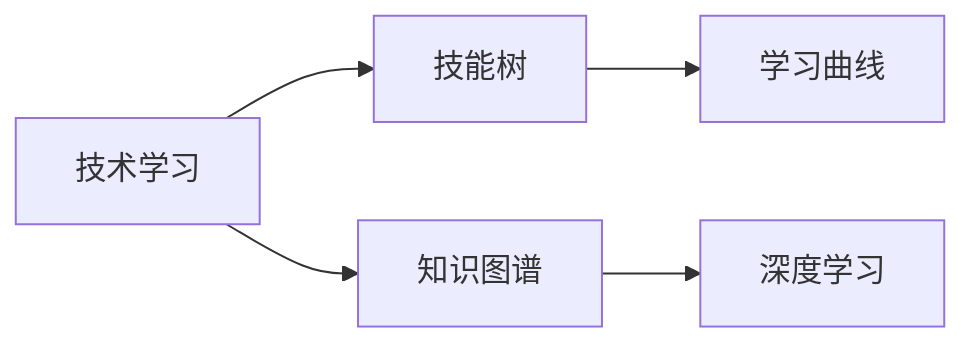

                 

# 不仅仅上面说的20项能力，事实上，你能列出的所有技能都是可以通过学习得到的

## 1. 背景介绍

### 1.1 问题由来

在当今信息爆炸、技术迭代加速的时代，各种新兴技术和工具层出不穷，从业者需要不断学习和适应，才能跟上行业的步伐。然而，面对庞杂的技能体系，如何有效地挑选、掌握和使用这些技能，成为了一个重要课题。

### 1.2 问题核心关键点

本文聚焦于探讨技术学习的本质和路径，试图说明无论是编程、算法设计、系统架构，还是数据分析、人工智能等领域的技能，都可以在一定的时间和资源下通过系统化学习获得。我们希望通过以下章节的深入剖析，提供一套实用的技能学习框架，帮助读者理清思路，提高学习效率。

### 1.3 问题研究意义

掌握新技术和工具，不仅可以提升个人竞争力，还能够在实际工作中实现更高效、更优质的成果。本文将深入分析各类技能的学习方法和最佳实践，以期为技术工作者提供科学、高效的学习路径，为行业发展贡献力量。

## 2. 核心概念与联系

### 2.1 核心概念概述

为帮助读者理解本文主旨，我们将介绍几个关键概念：

- **技术学习**：指通过阅读、实践、教学等方式，获取和掌握新技能的过程。
- **技能树**：类比生物的基因树，技术学习的技能结构化框架，将各类技能按层次、关联性等组织起来，帮助学习者系统化地掌握知识。
- **知识图谱**：一种网络化的知识表示方法，通过节点和边表示实体和关系，帮助理解复杂系统的内部结构和知识流动。
- **学习曲线**：描述学习新技能所需时间与性能提升之间的关系，通常遵循先慢后快，但并不总是线性的。
- **深度学习**：一种通过多层神经网络模拟人脑神经元工作机制，实现复杂模式识别的技术，广泛应用于计算机视觉、自然语言处理等领域。

### 2.2 核心概念原理和架构的 Mermaid 流程图



这个流程图展示了技术学习与关键概念之间的内在联系。技术学习从技能树开始，通过知识图谱深入理解，借助学习曲线评估进展，最终应用于深度学习等前沿技术。

## 3. 核心算法原理 & 具体操作步骤

### 3.1 算法原理概述

技能学习的过程可以抽象为从输入数据到输出结果的映射。本文将基于监督学习框架，介绍一种通用的技能学习算法，该算法结合了知识图谱和深度学习技术，以期实现高效的智能学习。

### 3.2 算法步骤详解

#### 3.2.1 数据准备

- **数据收集**：确定需要学习的新技能，通过网络、书籍、课程等多种渠道收集相关资料。
- **数据预处理**：清洗、整理数据，生成适合学习的数据集。
- **特征提取**：根据技能特点，提取有意义的特征向量，如代码语法、算法流程、数据结构等。

#### 3.2.2 模型构建

- **模型选择**：根据学习目标，选择合适的深度学习模型，如卷积神经网络(CNN)、循环神经网络(RNN)、Transformer等。
- **参数初始化**：使用预训练模型或随机初始化，避免模型过拟合。
- **模型训练**：通过迭代优化算法，最小化损失函数，调整模型参数。

#### 3.2.3 模型评估

- **性能度量**：使用准确率、召回率、F1-score等指标评估模型性能。
- **超参数调优**：通过网格搜索、贝叶斯优化等方法调整超参数，提升模型效果。
- **模型验证**：使用验证集评估模型泛化能力，避免过拟合。

#### 3.2.4 模型应用

- **模型部署**：将模型集成到实际应用中，进行推理预测。
- **模型迭代**：根据实际效果，反复调整模型参数和结构，优化模型性能。

### 3.3 算法优缺点

#### 3.3.1 优点

- **系统化**：技能学习过程由数据准备、模型构建、模型评估和模型应用四个环节组成，每个环节都有明确的目标和步骤，系统化地推进学习。
- **高效性**：结合知识图谱和深度学习技术，能够高效地捕捉和理解复杂系统中的知识。
- **可扩展性**：模型可以通过增加数据量和调整超参数进一步提升性能，适应不同难度的学习任务。

#### 3.3.2 缺点

- **复杂性**：深度学习模型复杂，需要较深的数学和编程基础。
- **资源需求高**：深度学习模型通常需要大量的计算资源和数据，可能需要高性能计算设备和GPU支持。
- **模型解释性差**：深度学习模型是一个"黑盒"系统，难以解释模型内部工作机制。

### 3.4 算法应用领域

深度学习模型在多个领域展示了其强大的应用能力，包括：

- **计算机视觉**：如图像识别、目标检测、图像生成等任务。
- **自然语言处理**：如文本分类、语言建模、机器翻译等任务。
- **语音识别**：如语音转文本、情感分析、自动摘要等任务。
- **医疗健康**：如疾病诊断、病理分析、基因组学等任务。
- **金融科技**：如信用评分、风险预测、欺诈检测等任务。
- **智能推荐**：如商品推荐、新闻推荐、广告推荐等任务。

## 4. 数学模型和公式 & 详细讲解 & 举例说明

### 4.1 数学模型构建

我们以自然语言处理(NLP)中的文本分类任务为例，介绍深度学习模型的构建过程。

假设文本分类问题有C个类别，输入为长度为T的单词序列 $(x_1, x_2, \cdots, x_T)$，输出为类别概率向量 $(p_1, p_2, \cdots, p_C)$。目标是通过训练数据集 $D=\{(x_i, y_i)\}_{i=1}^N$ 学习一个模型 $f$，使得对于任意输入 $x$，输出 $f(x)$ 接近真实的类别标签 $y$。

### 4.2 公式推导过程

我们采用卷积神经网络(CNN)作为文本分类模型，其中包含卷积层、池化层和全连接层。设输入为 $x_i$，卷积核大小为 $k$，步长为 $s$，使用 $n$ 个卷积核，则卷积层输出的特征图为：

$$
f_{conv}(x_i) = \frac{1}{s} \sum_{i=1}^k \sum_{j=1}^n w_{i,j} * x_i
$$

其中 $w_{i,j}$ 为卷积核权重。

池化层用于减小特征图尺寸，设池化窗口大小为 $w$，则池化层输出的特征图为：

$$
f_{pool}(x_i) = \max_{i=1}^w \sum_{j=1}^w f_{conv}(x_{i,j})
$$

全连接层用于将特征图转化为类别概率向量，设全连接层参数为 $W$，偏置为 $b$，则输出为：

$$
f(x) = \sigma(Wf_{pool}(x) + b)
$$

其中 $\sigma$ 为激活函数。

### 4.3 案例分析与讲解

以文本分类任务为例，分析CNN模型在实际应用中的训练过程和效果。

#### 4.3.1 数据集准备

使用IMDB电影评论数据集，包含25000条带有标签的电影评论，将每条评论转化为词向量作为输入，输出为电影的评分。

#### 4.3.2 模型训练

- **数据预处理**：对文本进行分词、去除停用词、进行词嵌入等预处理。
- **模型构建**：搭建CNN模型，设定卷积核大小、数量、池化窗口大小等超参数。
- **模型训练**：使用随机梯度下降(SGD)优化算法，设定学习率、批次大小等超参数，进行多轮迭代训练。

#### 4.3.3 模型评估

在测试集上使用准确率、召回率、F1-score等指标评估模型性能。

## 5. 项目实践：代码实例和详细解释说明

### 5.1 开发环境搭建

搭建Python 3.8虚拟环境，安装必要的依赖库，如TensorFlow、Keras等。

### 5.2 源代码详细实现

以下是一段使用Keras构建CNN模型的示例代码：

```python
import tensorflow as tf
from tensorflow.keras.datasets import imdb
from tensorflow.keras.models import Sequential
from tensorflow.keras.layers import Embedding, Conv1D, GlobalMaxPooling1D, Dense, Dropout

# 加载IMDB数据集
(X_train, y_train), (X_test, y_test) = imdb.load_data(num_words=10000)

# 填充序列长度
maxlen = 256
X_train = tf.keras.preprocessing.sequence.pad_sequences(X_train, maxlen=maxlen)
X_test = tf.keras.preprocessing.sequence.pad_sequences(X_test, maxlen=maxlen)

# 构建CNN模型
model = Sequential()
model.add(Embedding(input_dim=10000, output_dim=128, input_length=maxlen))
model.add(Conv1D(filters=64, kernel_size=3, activation='relu'))
model.add(GlobalMaxPooling1D())
model.add(Dense(64, activation='relu'))
model.add(Dropout(0.5))
model.add(Dense(1, activation='sigmoid'))

# 编译模型
model.compile(optimizer='adam', loss='binary_crossentropy', metrics=['accuracy'])

# 训练模型
model.fit(X_train, y_train, epochs=10, batch_size=128, validation_data=(X_test, y_test))
```

### 5.3 代码解读与分析

- **数据准备**：使用IMDB数据集，将文本转化为词向量，并进行序列填充，以保证模型输入的统一长度。
- **模型构建**：搭建包含嵌入层、卷积层、池化层和全连接层的CNN模型，设定超参数。
- **模型训练**：使用Adam优化算法，设定学习率、批次大小等超参数，进行多轮迭代训练。
- **模型评估**：在测试集上使用准确率评估模型性能。

### 5.4 运行结果展示

训练结束后，使用测试集评估模型性能，输出准确率等指标。

```python
test_loss, test_acc = model.evaluate(X_test, y_test)
print(f'Test accuracy: {test_acc:.2f}')
```

## 6. 实际应用场景

### 6.1 智能客服系统

智能客服系统需要快速响应用户咨询，理解用户意图并提供解决方案。深度学习模型可以在自然语言处理方面提供强大支持，帮助系统更好地理解和回复用户。

#### 6.1.1 技术实现

- **意图识别**：通过文本分类模型识别用户意图，将问题分类为常见问题、复杂问题等。
- **信息检索**：在知识库中检索与问题相关的信息，提供给系统参考。
- **对话生成**：使用生成模型生成针对用户问题的回答，进行自然语言处理和生成。

#### 6.1.2 效果展示

通过深度学习模型，智能客服系统能够快速响应用户咨询，提高用户体验和问题解决效率。

### 6.2 金融舆情监测

金融行业需要实时监测市场舆情，及时发现负面信息和风险。深度学习模型可以用于舆情分类和情感分析，帮助金融机构防范风险。

#### 6.2.1 技术实现

- **情感分析**：使用文本分类模型判断新闻报道的情感倾向，识别负面信息。
- **事件监测**：对舆情文本进行实体识别和关系抽取，构建事件图谱。
- **风险预警**：根据事件图谱生成风险预警，及时调整投资策略。

#### 6.2.2 效果展示

通过深度学习模型，金融机构能够实时监测舆情变化，及时应对市场风险。

### 6.3 个性化推荐系统

个性化推荐系统需要根据用户行为和偏好，推荐最适合的商品或内容。深度学习模型可以用于推荐模型的构建和优化。

#### 6.3.1 技术实现

- **用户画像**：通过深度学习模型分析用户行为，构建用户画像。
- **内容表示**：使用深度学习模型提取商品或内容的特征表示。
- **推荐排序**：根据用户画像和内容表示，使用推荐模型排序生成推荐列表。

#### 6.3.2 效果展示

通过深度学习模型，个性化推荐系统能够提供更加精准、个性化的推荐结果，提高用户满意度和转化率。

### 6.4 未来应用展望

随着深度学习技术的不断进步，其在更多领域的创新应用将不断涌现。未来，深度学习模型将在医疗、教育、城市管理等多个领域发挥重要作用，为各行各业带来变革性影响。

## 7. 工具和资源推荐

### 7.1 学习资源推荐

1. **《深度学习》课程**：由斯坦福大学开设的深度学习课程，涵盖深度学习的基本概念、算法和应用。
2. **Kaggle竞赛平台**：提供大量实际应用场景的数据集和竞赛，帮助学习者实践深度学习技术。
3. **PyTorch官方文档**：详细介绍了PyTorch的使用方法，提供了丰富的示例代码和教程。
4. **Google Colab平台**：免费的在线Jupyter Notebook环境，方便学习者进行深度学习实验和分享代码。
5. **Coursera平台**：提供来自世界顶尖大学的深度学习课程，涵盖多个领域的应用。

### 7.2 开发工具推荐

1. **PyTorch**：基于Python的开源深度学习框架，灵活、高效。
2. **TensorFlow**：Google开发的深度学习框架，生产部署方便。
3. **Keras**：高层次的深度学习API，易于上手。
4. **Jupyter Notebook**：交互式编程工具，便于编写、调试和分享代码。
5. **TensorBoard**：可视化工具，帮助监测模型训练和性能评估。

### 7.3 相关论文推荐

1. **《深度学习》书籍**：Ian Goodfellow、Yoshua Bengio和Aaron Courville合著的深度学习经典教材。
2. **《Python深度学习》书籍**：Francois Chollet著，介绍了使用Keras进行深度学习开发的实践。
3. **《自然语言处理综论》书籍**：Daniel Jurafsky和James H. Martin合著，详细介绍了自然语言处理的基本概念和应用。
4. **《计算机视觉：算法与应用》书籍**：Richard Szeliski著，介绍了计算机视觉的算法和应用。
5. **《机器学习实战》书籍**：Peter Harrington著，提供了丰富的机器学习实践案例。

## 8. 总结：未来发展趋势与挑战

### 8.1 研究成果总结

本文通过探讨深度学习技能的学习过程和应用，揭示了技术学习的基本框架和方法。深度学习模型在多个领域展示了其强大的应用能力，但也面临着计算资源需求高、模型解释性差等挑战。

### 8.2 未来发展趋势

未来深度学习技术的发展趋势包括以下几个方面：

- **模型规模持续增大**：随着计算资源的增加，深度学习模型的规模将持续增大，实现更复杂的模型结构和更强大的性能。
- **应用领域不断扩展**：深度学习将在更多领域得到应用，如医疗、教育、城市管理等，为各行各业带来变革性影响。
- **技术不断融合**：深度学习技术与人工智能、大数据、物联网等技术不断融合，形成更加全面、高效的技术体系。
- **应用场景不断创新**：深度学习在实际应用中不断创新，如自动驾驶、智能家居、个性化推荐等，带来更多商业价值。

### 8.3 面临的挑战

尽管深度学习技术在多个领域取得了显著成果，但仍面临以下挑战：

- **计算资源需求高**：深度学习模型需要大量的计算资源和数据，对硬件设备要求较高。
- **模型解释性差**：深度学习模型是一个"黑盒"系统，难以解释模型内部工作机制。
- **数据隐私和安全**：深度学习模型处理大量敏感数据，存在数据隐私和安全的风险。
- **模型鲁棒性不足**：深度学习模型对输入数据的微小扰动敏感，容易出现错误。
- **模型过拟合**：深度学习模型容易过拟合，在数据集较小的情况下性能下降。

### 8.4 研究展望

未来的深度学习研究需要在以下几个方面寻求突破：

- **模型解释性**：开发可解释的深度学习模型，提高模型的透明度和可信度。
- **数据隐私保护**：研究数据隐私保护技术，确保数据使用过程中的安全。
- **模型鲁棒性**：开发鲁棒性更好的深度学习模型，提高模型的抗干扰能力。
- **计算资源优化**：研究高效计算资源利用技术，降低深度学习模型对硬件资源的需求。
- **多模态学习**：研究多模态数据融合技术，实现跨模态的信息整合。

## 9. 附录：常见问题与解答

**Q1: 如何选择合适的深度学习模型？**

A: 根据任务特点，选择合适的深度学习模型。常用的模型包括卷积神经网络(CNN)、循环神经网络(RNN)、长短时记忆网络(LSTM)、Transformer等。可以通过模型性能、计算资源需求、模型复杂度等多个维度进行综合评估。

**Q2: 深度学习模型训练过程中，如何避免过拟合？**

A: 避免过拟合的方法包括数据增强、正则化、早停等。数据增强可以通过随机裁剪、旋转、加噪声等方法扩充数据集。正则化可以通过L1、L2正则化、Dropout等方法控制模型复杂度。早停可以在验证集上监测模型性能，避免过拟合。

**Q3: 深度学习模型的计算资源需求高，如何解决？**

A: 可以通过模型剪枝、量化、稀疏化等方法优化模型结构，减少计算资源需求。同时，可以使用分布式计算、GPU、TPU等高性能计算设备提升训练速度。

**Q4: 如何理解深度学习模型的解释性？**

A: 深度学习模型的解释性可以通过可视化工具，如TensorBoard、ONNX等，展示模型内部工作机制。此外，还可以通过特征重要性分析、局部解释模型等方法提高模型解释性。

**Q5: 如何保护深度学习模型的数据隐私？**

A: 可以通过数据匿名化、差分隐私、联邦学习等技术保护数据隐私。数据匿名化可以在不泄露具体数据的情况下，保留数据分布信息。差分隐私可以通过添加噪声、限制查询次数等方法保护用户隐私。联邦学习可以在不共享数据的情况下，通过分布式训练实现模型优化。

---

作者：禅与计算机程序设计艺术 / Zen and the Art of Computer Programming

