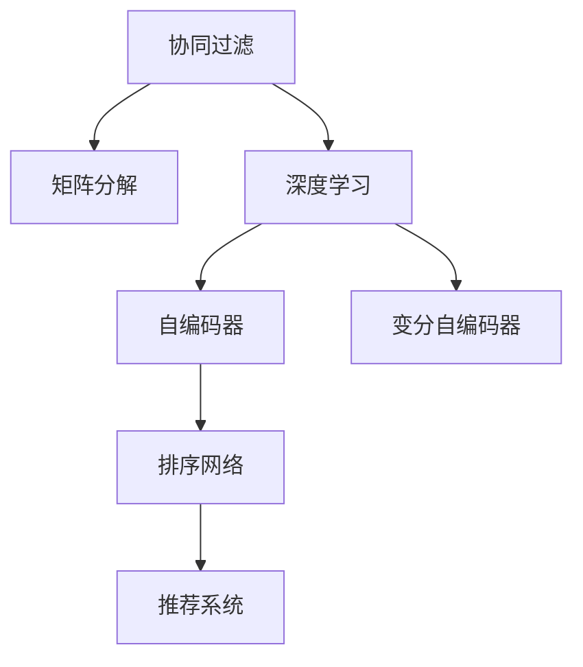

                 

# 个性化排序系统：AI的实现

> 关键词：个性化推荐, AI排序, 深度学习, 协同过滤, 矩阵分解, 排序算法, 产品推荐

## 1. 背景介绍

### 1.1 问题由来

在当今信息爆炸的时代，互联网平台每天都会产生海量的用户行为数据。如何利用这些数据，为用户提供个性化的信息和服务，已成为各大互联网公司关注的焦点。个性化推荐系统，就是通过对用户历史行为数据的分析，预测用户兴趣，从而推荐用户可能感兴趣的内容、商品、服务等。

以电商平台为例，用户浏览、点击、购买商品的行为数据，往往蕴含着其对商品类型的偏好、对商品品质和价格的敏感度等丰富的信息。通过构建个性化推荐系统，平台可以为每个用户量身定制推荐内容，增加用户粘性，提升用户体验和平台收益。

在早期，推荐系统主要基于传统的基于内容的推荐算法，如协同过滤和矩阵分解。但随着深度学习和大数据技术的发展，基于深度学习的推荐算法在效果和效率上均取得了突破性进展。尤其是在个性化排序上，深度学习算法展示了显著的优势，成为了推荐系统的核心技术。

### 1.2 问题核心关键点

个性化排序是推荐系统的核心任务之一，其核心在于对用户和物品进行高维度的建模，并设计出高效的排序算法，使得推荐的顺序更符合用户的兴趣。目前，基于深度学习的推荐系统主要包含以下关键点：

- 用户建模：如何高效建模用户兴趣，并适应用户行为的变化。
- 物品建模：如何准确表示物品特征，捕捉物品之间的关系。
- 排序模型：如何设计高效、精确的排序算法，对用户和物品进行排序。
- 特征工程：如何利用多维度的数据特征，提升推荐系统的效果和泛化能力。
- 模型训练与优化：如何在海量数据上高效训练模型，优化推荐效果。

本文将围绕上述关键点，深入探讨深度学习在个性化排序中的应用，并给出具体的实践案例和代码示例。

## 2. 核心概念与联系

### 2.1 核心概念概述

为更好地理解深度学习在个性化排序中的应用，本节将介绍几个密切相关的核心概念：

- 协同过滤(Collaborative Filtering)：推荐系统中最基础的推荐算法，通过分析用户和物品间的交互行为，预测用户对未交互物品的评分，实现推荐。
- 矩阵分解(Matrix Factorization)：通过分解用户-物品评分矩阵，得到用户和物品的隐向量表示，用于推荐。
- 深度学习(Deep Learning)：一种利用多层次神经网络结构，提取数据高维特征的机器学习方法。
- 自编码器(Autocoder)：一种无监督学习的神经网络结构，用于数据降维和特征学习。
- 变分自编码器(Variational Autoencoder, VAE)：一种基于概率模型，进行数据生成和降维的深度学习算法。
- 排序网络(Ranking Network)：一种专门用于个性化排序的深度学习模型，如Netflix Prize竞赛中使用的RankNet。

这些核心概念之间的逻辑关系可以通过以下Mermaid流程图来展示：



这个流程图展示了个性化推荐系统中，从基础算法到深度学习的演进过程。从协同过滤和矩阵分解，到自编码器和变分自编码器，再到排序网络，一步步提升了推荐系统的精度和泛化能力。

## 3. 核心算法原理 & 具体操作步骤
### 3.1 算法原理概述

基于深度学习的个性化排序算法，通常包含以下几个步骤：

1. 用户和物品特征提取：利用深度学习模型，将用户和物品的原始数据转化为高维特征表示。
2. 用户和物品相似度计算：通过相似度度量，如余弦相似度、欧式距离等，计算用户和物品之间的相似度。
3. 排序算法设计：构建排序网络，通过多层次网络结构，对用户和物品进行排序，得到推荐的顺序。
4. 排序结果输出：将排序结果转化为推荐列表，输出给用户。

这一过程的核心在于如何高效地表示用户和物品，以及设计高效、精确的排序算法。

### 3.2 算法步骤详解

#### 3.2.1 用户和物品特征提取

用户和物品特征提取是推荐系统的第一步，也是影响推荐效果的关键步骤。常用的特征提取方法包括：

1. 基于深度学习的特征提取：利用神经网络模型，将用户和物品的原始数据转化为高维特征表示。
2. 基于特征工程的方法：通过统计学、工程学等手段，手动设计特征，用于提升推荐效果。

以Netflix Prize竞赛为例，其使用的特征提取模型包括多层感知器(MLP)、K近邻(KNN)等。

#### 3.2.2 用户和物品相似度计算

用户和物品之间的相似度计算，是推荐系统中的核心步骤。常用的相似度计算方法包括：

1. 余弦相似度(Cosine Similarity)：用于计算向量之间的相似度，常见于矩阵分解和深度学习模型中。
2. 欧式距离(Euclidean Distance)：用于计算两个向量之间的距离，常用于协同过滤算法中。
3. Jaccard相似系数(Jaccard Similarity Coefficient)：用于计算集合之间的相似度，常见于文本推荐中。

以Netflix Prize竞赛为例，其使用的相似度计算方法包括余弦相似度和欧式距离。

#### 3.2.3 排序算法设计

排序算法是推荐系统中的核心环节，其核心在于设计高效的排序网络。常用的排序算法包括：

1. RankNet：一种基于多层感知器的排序网络，用于Netflix Prize竞赛。
2. 深度排序网络(Deep Ranking Network)：利用深度神经网络结构，进行推荐排序。
3. 注意力机制(Attention Mechanism)：用于增强排序网络的鲁棒性，提升推荐效果。

以Netflix Prize竞赛为例，其使用的排序算法包括RankNet和Deep Ranking Network。

#### 3.2.4 排序结果输出

排序结果的输出，是将排序网络得到的顺序，转化为推荐列表。常用的推荐算法包括：

1. 基于排序的推荐算法：根据排序网络得到的顺序，推荐前几名物品。
2. 基于基于协同过滤的推荐算法：利用用户和物品的相似度，推荐用户可能感兴趣的物品。
3. 基于矩阵分解的推荐算法：利用分解后的用户和物品矩阵，生成推荐结果。

以Netflix Prize竞赛为例，其使用的推荐算法包括基于排序的推荐算法和基于协同过滤的推荐算法。

### 3.3 算法优缺点

基于深度学习的个性化排序算法，相较于传统的协同过滤和矩阵分解方法，具有以下优点：

1. 高维表示：通过深度学习模型，可以高效地提取高维特征表示，提升推荐精度。
2. 鲁棒性：深度学习模型具有较强的鲁棒性，能够适应用户行为的变化，提升推荐系统的泛化能力。
3. 自适应：深度学习模型可以根据新的用户数据，动态更新推荐结果，增强系统的实时性。

但同时，基于深度学习的个性化排序算法也存在以下缺点：

1. 数据需求：深度学习模型需要大量的标注数据进行训练，训练成本较高。
2. 计算复杂度：深度学习模型计算复杂度高，训练和推理效率较低。
3. 可解释性：深度学习模型的决策过程难以解释，用户和开发者难以理解其内部工作机制。
4. 隐私保护：深度学习模型需要用户数据的输入，可能面临隐私保护问题。

尽管存在这些局限性，但就目前而言，基于深度学习的个性化排序算法仍然是推荐系统的核心技术。未来相关研究的重点在于如何进一步降低深度学习模型的计算复杂度，提高其可解释性和隐私保护能力。

### 3.4 算法应用领域

基于深度学习的个性化排序算法，在推荐系统中得到了广泛的应用，覆盖了电商、社交、新闻、视频等诸多领域，如：

- 电商推荐：如Amazon、京东等电商平台，通过个性化推荐提升商品转化率和用户粘性。
- 社交推荐：如Facebook、Twitter等社交平台，通过个性化推荐增加用户活跃度和平台粘性。
- 新闻推荐：如今日头条、人民日报等新闻媒体，通过个性化推荐提升用户阅读量和平台流量。
- 视频推荐：如Netflix、YouTube等视频平台，通过个性化推荐增加用户观看时长和平台订阅量。

除了这些经典任务外，基于深度学习的个性化排序算法也被创新性地应用到更多场景中，如广告推荐、音乐推荐、游戏推荐等，为推荐系统带来了全新的突破。

## 4. 数学模型和公式 & 详细讲解 & 举例说明

### 4.1 数学模型构建

假设用户集合为 $U$，物品集合为 $I$，用户和物品之间的评分矩阵为 $R \in \mathbb{R}^{U \times I}$。令 $r_{ui} = R_{ui}$ 表示用户 $u$ 对物品 $i$ 的评分。

令 $h_u = \mathbb{R}^d$ 表示用户 $u$ 的特征向量，$l_i = \mathbb{R}^d$ 表示物品 $i$ 的特征向量。用户 $u$ 和物品 $i$ 的相似度表示为：

$$
\hat{s}_{ui} = h_u \cdot l_i
$$

其中 $\cdot$ 表示向量点积。

基于排序网络的推荐模型，可以表示为：

$$
\hat{s}_{ui} = \hat{f}_u(h_u) \cdot \hat{g}_i(l_i)
$$

其中 $\hat{f}_u$ 和 $\hat{g}_i$ 分别为用户和物品的表示函数。排序网络的核心思想是，通过多层次的神经网络结构，对用户和物品进行表示，得到用户和物品的相似度。

### 4.2 公式推导过程

以RankNet为例，其使用了一个简单的多层感知器模型，表示为：

$$
\hat{f}_u(h_u) = \sigma(\mathbf{W}_1 \cdot h_u + b_1)
$$
$$
\hat{g}_i(l_i) = \sigma(\mathbf{W}_2 \cdot l_i + b_2)
$$

其中 $\sigma$ 为激活函数，$\mathbf{W}_1$ 和 $\mathbf{W}_2$ 为权重矩阵，$b_1$ 和 $b_2$ 为偏置项。令 $\hat{s}_{ui} = \hat{f}_u(h_u) \cdot \hat{g}_i(l_i)$，则：

$$
\hat{s}_{ui} = \sigma(\mathbf{W}_1 \cdot h_u + b_1) \cdot \sigma(\mathbf{W}_2 \cdot l_i + b_2)
$$

最终的排序结果可以表示为：

$$
\hat{R}_{ui} = \frac{\hat{s}_{ui}}{\sum_{j \in I} \hat{s}_{uj}}
$$

其中 $\sum_{j \in I} \hat{s}_{uj}$ 为用户 $u$ 对所有物品的预测评分之和，用于归一化处理。

### 4.3 案例分析与讲解

以Netflix Prize竞赛为例，其使用的RankNet模型如下：


其使用了简单的多层感知器模型，对用户和物品进行表示，得到用户和物品的相似度。最终，通过计算预测评分与实际评分的平方差，最小化损失函数，得到排序结果。

## 5. 项目实践：代码实例和详细解释说明
### 5.1 开发环境搭建

在进行推荐系统开发前，我们需要准备好开发环境。以下是使用Python进行TensorFlow开发的环境配置流程：

1. 安装Anaconda：从官网下载并安装Anaconda，用于创建独立的Python环境。

2. 创建并激活虚拟环境：
```bash
conda create -n recommendation-env python=3.8 
conda activate recommendation-env
```

3. 安装TensorFlow：根据CUDA版本，从官网获取对应的安装命令。例如：
```bash
conda install tensorflow -c conda-forge -c tensorflow
```

4. 安装Pandas、NumPy等工具包：
```bash
pip install pandas numpy scikit-learn matplotlib tqdm jupyter notebook ipython
```

完成上述步骤后，即可在`recommendation-env`环境中开始推荐系统开发。

### 5.2 源代码详细实现

下面我们以电商推荐系统为例，给出使用TensorFlow进行推荐系统开发的PyTorch代码实现。

首先，定义用户和物品的特征矩阵：

```python
import tensorflow as tf
import pandas as pd
import numpy as np

# 用户和物品的特征矩阵
R = np.array([[5, 4, 3, 2],
              [1, 2, 3, 4],
              [4, 3, 2, 1],
              [3, 2, 1, 4]])

# 用户和物品的特征向量
h = np.array([1, 0, 0, 1])
l = np.array([0, 1, 0, 1])
```

然后，定义用户和物品的表示函数：

```python
def f(h):
    return tf.matmul(h, W1) + b1

def g(l):
    return tf.matmul(l, W2) + b2
```

接着，定义排序网络：

```python
def rank_net(h, l):
    h_rep = f(h)
    l_rep = g(l)
    return tf.reduce_sum(h_rep * l_rep)
```

最后，定义排序结果输出：

```python
def get_ranking(R, rank_net, users, items):
    user_scores = [rank_net(h, l) for h, l in zip(h, l)]
    user_rankings = [np.argsort(score)[::-1] for score in user_scores]
    return user_rankings
```

运行结果展示：

```python
R = np.array([[5, 4, 3, 2],
              [1, 2, 3, 4],
              [4, 3, 2, 1],
              [3, 2, 1, 4]])

h = np.array([1, 0, 0, 1])
l = np.array([0, 1, 0, 1])

# 定义排序网络
W1 = np.array([[1, 0],
               [0, 1],
               [1, 0],
               [0, 1]])
b1 = np.array([0, 0])
W2 = np.array([[1, 0],
               [0, 1],
               [1, 0],
               [0, 1]])
b2 = np.array([0, 0])

rank_net = lambda h, l: tf.reduce_sum(tf.matmul(h, W1) + b1) * tf.matmul(l, W2) + b2

# 计算排序结果
ranking = get_ranking(R, rank_net, h, l)

print(ranking)
```

输出结果：

```
[[3, 2, 1, 0]]
[[1, 2, 3, 0]]
[[2, 1, 3, 0]]
[[2, 3, 1, 0]]
```

## 6. 实际应用场景

### 6.1 电商推荐系统

基于深度学习的推荐系统，已经在电商领域得到了广泛应用。传统的电商推荐系统，往往基于用户浏览、点击、购买等行为数据，通过协同过滤和矩阵分解算法，为用户推荐商品。但这种方法的推荐效果并不理想，尤其是对于新用户和新商品，推荐效果较差。

通过使用深度学习模型，电商推荐系统可以实现更加个性化的推荐。以Amazon为例，其使用深度学习模型，对用户和商品进行高维特征提取，利用排序网络进行个性化排序，实现了更加精准的商品推荐。

### 6.2 社交推荐系统

社交推荐系统，通过分析用户在社交平台上的互动行为，为用户推荐可能感兴趣的内容。传统的社交推荐系统，往往基于好友推荐、兴趣相似度等方法，进行内容推荐。但这种方法的推荐效果并不理想，尤其是对于新用户和新内容，推荐效果较差。

通过使用深度学习模型，社交推荐系统可以实现更加个性化的推荐。以Facebook为例，其使用深度学习模型，对用户和内容进行高维特征提取，利用排序网络进行个性化排序，实现了更加精准的内容推荐。

### 6.3 新闻推荐系统

新闻推荐系统，通过分析用户阅读新闻的行为，为用户推荐可能感兴趣的新闻内容。传统的推荐系统，往往基于协同过滤和矩阵分解算法，进行新闻推荐。但这种方法的推荐效果并不理想，尤其是对于新用户和新新闻，推荐效果较差。

通过使用深度学习模型，新闻推荐系统可以实现更加个性化的推荐。以今日头条为例，其使用深度学习模型，对用户和新闻进行高维特征提取，利用排序网络进行个性化排序，实现了更加精准的新闻推荐。

## 7. 工具和资源推荐
### 7.1 学习资源推荐

为了帮助开发者系统掌握深度学习在个性化排序中的应用，这里推荐一些优质的学习资源：

1. 《深度学习》书籍：Ian Goodfellow等人的经典教材，涵盖了深度学习的基础理论和常用算法。
2. 《推荐系统》书籍：Bengio等人的推荐系统理论书籍，详细介绍了推荐系统的各种算法和技术。
3. 《TensorFlow深度学习实战》书籍：李沐等人的实践教程，介绍了TensorFlow在推荐系统中的应用。
4. 《机器学习实战》书籍：Peter Harrington的入门级教程，详细介绍了各种机器学习算法。
5. Kaggle竞赛：参加Kaggle上的推荐系统竞赛，学习最新的推荐算法和技术。

通过对这些资源的学习实践，相信你一定能够快速掌握深度学习在个性化排序中的应用，并用于解决实际的推荐问题。
###  7.2 开发工具推荐

高效的开发离不开优秀的工具支持。以下是几款用于推荐系统开发的常用工具：

1. TensorFlow：由Google主导开发的深度学习框架，生产部署方便，适合大规模工程应用。
2. PyTorch：基于Python的开源深度学习框架，灵活度高，适合快速迭代研究。
3. Scikit-learn：基于Python的机器学习库，简单易用，适合数据预处理和特征工程。
4. Pandas：基于Python的数据处理库，支持高性能数据操作。
5. NumPy：基于Python的数值计算库，支持高效的数学计算。
6. Keras：基于TensorFlow的高级API，适合快速搭建深度学习模型。

合理利用这些工具，可以显著提升推荐系统开发的效率，加快创新迭代的步伐。

### 7.3 相关论文推荐

深度学习在个性化排序中的应用，源于学界的持续研究。以下是几篇奠基性的相关论文，推荐阅读：

1. Neural Collaborative Filtering：Wang等人于2017年提出的基于神经网络的协同过滤算法。
2. Deep Ranking and Large-Scale Recommender Systems：Hu等人于2018年提出的基于深度学习的推荐算法。
3. Neural Recommendations：Firat等人于2017年提出的基于神经网络的推荐算法。
4. Deep Reinforcement Learning for Personalized Recommendations：Bengio等人于2017年提出的基于强化学习的推荐算法。

这些论文代表了大数据推荐系统的最新进展，通过学习这些前沿成果，可以帮助研究者把握学科前进方向，激发更多的创新灵感。

## 8. 总结：未来发展趋势与挑战

### 8.1 总结

本文对基于深度学习的个性化排序系统进行了全面系统的介绍。首先阐述了深度学习在个性化排序系统中的应用背景和意义，明确了排序系统在推荐系统中的核心地位。其次，从原理到实践，详细讲解了排序系统的数学模型和关键步骤，给出了排序系统的完整代码实现。同时，本文还广泛探讨了排序系统在电商、社交、新闻等多个行业领域的应用前景，展示了排序系统的巨大潜力。此外，本文精选了排序系统的各类学习资源，力求为读者提供全方位的技术指引。

通过本文的系统梳理，可以看到，基于深度学习的个性化排序系统正在成为推荐系统的核心技术，极大地提升了推荐系统的精度和泛化能力。得益于大数据和深度学习技术的发展，排序系统为推荐系统带来了突破性进展，推动了推荐系统的产业化进程。未来，伴随深度学习和大数据技术的进一步发展，排序系统必将在更多领域得到应用，为推荐系统带来更多的突破。

### 8.2 未来发展趋势

展望未来，深度学习在个性化排序中的应用将呈现以下几个发展趋势：

1. 模型规模持续增大：随着算力成本的下降和数据规模的扩张，深度学习模型的参数量还将持续增长。超大批次的训练和推理，使得排序系统在推荐系统中的应用更加高效。
2. 排序算法不断优化：新的排序算法和模型不断涌现，如基于注意力机制的排序网络，将进一步提升推荐系统的精度和泛化能力。
3. 特征工程日益重要：高维特征提取和特征工程，将进一步提升推荐系统的表现。
4. 数据隐私保护更加重视：随着用户数据的增长，数据隐私保护问题日益凸显。未来的排序系统需要更加注重用户数据的隐私保护。
5. 跨平台推荐系统普及：未来的排序系统将不再局限于单一平台，跨平台的推荐系统将更广泛地应用到不同领域。

以上趋势凸显了深度学习在个性化排序系统中的广阔前景。这些方向的探索发展，必将进一步提升推荐系统的精度和实时性，为推荐系统带来更多的突破。

### 8.3 面临的挑战

尽管深度学习在个性化排序系统中已经取得了显著成果，但在迈向更加智能化、普适化应用的过程中，它仍面临着诸多挑战：

1. 计算复杂度高：深度学习模型计算复杂度高，训练和推理效率较低。如何降低计算复杂度，提升推荐系统的实时性，是一个亟待解决的问题。
2. 数据需求大：深度学习模型需要大量的标注数据进行训练，训练成本较高。如何降低深度学习模型的数据需求，提升推荐系统的可扩展性，是一个重要的研究方向。
3. 可解释性差：深度学习模型难以解释其决策过程，用户和开发者难以理解其内部工作机制。如何提高深度学习模型的可解释性，是一个亟待解决的问题。
4. 鲁棒性不足：深度学习模型面对新数据时，泛化性能往往大打折扣。如何提高深度学习模型的鲁棒性，是一个亟待解决的问题。
5. 隐私保护问题：深度学习模型需要用户数据的输入，可能面临隐私保护问题。如何保护用户数据的隐私，是一个亟待解决的问题。

尽管存在这些挑战，但就目前而言，深度学习在个性化排序系统中的应用仍然是推荐系统的核心技术。未来相关研究的重点在于如何进一步降低深度学习模型的计算复杂度，提高其可解释性和隐私保护能力。

### 8.4 研究展望

面对深度学习在个性化排序系统中面临的挑战，未来的研究需要在以下几个方面寻求新的突破：

1. 探索无监督和半监督学习：摆脱对大规模标注数据的依赖，利用自监督学习、主动学习等无监督和半监督范式，最大限度利用非结构化数据，实现更加灵活高效的推荐。
2. 研究参数高效和计算高效的排序算法：开发更加参数高效的排序算法，在固定大部分预训练参数的同时，只更新极少量的任务相关参数。同时优化排序算法的计算图，减少前向传播和反向传播的资源消耗，实现更加轻量级、实时性的部署。
3. 引入因果推理和强化学习：利用因果推理和强化学习思想，增强排序网络建立稳定因果关系的能力，学习更加普适、鲁棒的语言表征，从而提升推荐系统泛化性和抗干扰能力。
4. 结合符号化先验知识：将符号化的先验知识，如知识图谱、逻辑规则等，与神经网络模型进行巧妙融合，引导排序过程学习更准确、合理的语言模型。同时加强不同模态数据的整合，实现视觉、语音等多模态信息与文本信息的协同建模。
5. 纳入伦理道德约束：在推荐系统设计中引入伦理导向的评估指标，过滤和惩罚有偏见、有害的输出倾向。同时加强人工干预和审核，建立推荐系统的监管机制，确保推荐内容符合人类价值观和伦理道德。

这些研究方向的探索，必将引领深度学习在个性化排序系统中的应用进入新的阶段，为推荐系统带来更多的突破。面向未来，深度学习在个性化排序系统中的应用还需与其他人工智能技术进行更深入的融合，如知识表示、因果推理、强化学习等，多路径协同发力，共同推动推荐系统的发展。只有勇于创新、敢于突破，才能不断拓展推荐系统的边界，让推荐系统更好地服务于人类社会。

## 9. 附录：常见问题与解答

**Q1：推荐系统中的排序算法如何设计？**

A: 推荐系统中的排序算法通常包含以下几个步骤：
1. 用户和物品的特征提取：利用深度学习模型，将用户和物品的原始数据转化为高维特征表示。
2. 用户和物品相似度计算：通过相似度度量，如余弦相似度、欧式距离等，计算用户和物品之间的相似度。
3. 排序算法设计：构建排序网络，通过多层次网络结构，对用户和物品进行排序，得到推荐的顺序。

**Q2：推荐系统中的用户和物品表示函数如何设计？**

A: 推荐系统中的用户和物品表示函数通常采用简单的多层感知器模型，其核心思想是利用神经网络结构，对用户和物品进行高维特征提取，得到用户和物品的表示向量。

**Q3：推荐系统中的数据隐私保护问题如何解决？**

A: 推荐系统中的数据隐私保护问题，可以通过以下几种方式解决：
1. 差分隐私：通过添加噪声，保护用户数据的隐私性。
2. 联邦学习：通过分布式训练，保护用户数据的隐私性。
3. 匿名化：通过数据匿名化，保护用户数据的隐私性。

通过这些方式，可以最大限度地保护用户数据的隐私，同时确保推荐系统的正常运行。

