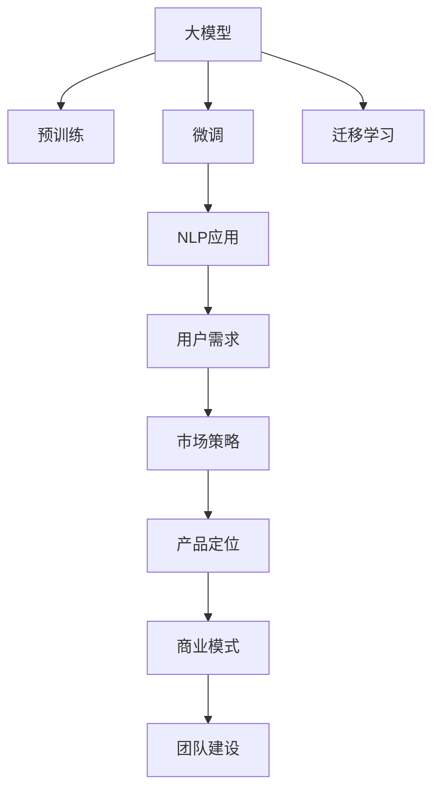

                 

# 产品定位：大模型创业的核心

> 关键词：大模型, 创业, 产品定位, 市场策略, AI应用, 自然语言处理(NLP), 机器学习, 数据驱动, 用户需求

## 1. 背景介绍

### 1.1 问题由来
在过去的几年里，人工智能（AI）技术特别是深度学习（Deep Learning）的发展，已经使得大模型（Big Model）技术取得了显著的突破。无论是Google的BERT，OpenAI的GPT-3，还是百度的ERNIE，这些大规模的预训练语言模型（Large Language Models, LLMs）在各种自然语言处理（NLP）任务中都展现了强大的性能。这些模型通过在大规模无标签文本数据上进行预训练，学习到了丰富的语言知识和常识，通过微调（Fine-Tuning）能够适配各种下游任务。

然而，尽管大模型在技术上取得了巨大成功，但如何将这些技术转化为商业化的产品，并在市场上获得认可和成功，却是众多创业者和公司面临的重大挑战。本文旨在探讨大模型创业的核心问题，即如何定位产品，构建有效的市场策略，以实现商业化成功。

### 1.2 问题核心关键点
产品定位是大模型创业的关键所在，一个清晰的产品定位可以指导整个产品的开发、推广和销售策略。核心关键点包括：

1. **市场定位**：识别目标市场和用户需求，确定产品的市场定位和差异化优势。
2. **技术栈选择**：基于市场定位和技术趋势，选择合适的大模型和框架。
3. **商业模式设计**：确定盈利模式和收入来源，如API服务、订阅制、按需服务等。
4. **市场策略制定**：制定有效的市场营销和销售策略，提升产品市场渗透率。
5. **用户体验优化**：通过用户体验设计，提升用户满意度和粘性。
6. **团队建设和人才培养**：吸引并保留顶尖的技术和商业人才，构建强大的团队。

## 2. 核心概念与联系

### 2.1 核心概念概述

在探讨大模型创业时，有几个关键概念需要理解：

- **大模型**：指通过大规模无标签数据进行预训练的深度学习模型，如BERT、GPT等。这些模型具有极高的泛化能力和性能。
- **微调**：在大模型的基础上，通过有监督学习优化模型，使其适配特定任务。
- **迁移学习**：利用预训练模型在不同任务上的知识迁移，减少新任务的训练成本。
- **自然语言处理（NLP）**：研究如何让机器理解、处理和生成人类语言的技术领域。
- **机器学习（ML）**：利用算法让机器通过数据学习并进行预测或决策。
- **数据驱动**：以数据为基础，通过分析和挖掘数据来驱动决策和改进。
- **用户需求**：用户在使用产品过程中产生的各种需求，需要产品定位和开发时充分考虑。

这些概念之间的逻辑关系可以通过以下Mermaid流程图来展示：



这个流程图展示了大模型从预训练到微调，再到NLP应用的过程，以及如何将用户需求转化为市场策略和产品定位，最终通过商业模式和团队建设实现商业化。

## 3. 核心算法原理 & 具体操作步骤
### 3.1 算法原理概述

在大模型创业过程中，核心的算法原理可以总结如下：

1. **数据预处理**：收集和处理大规模无标签数据进行预训练。
2. **模型微调**：在特定任务上对预训练模型进行微调，适配任务需求。
3. **迁移学习**：利用预训练模型的通用知识，减少新任务的学习成本。
4. **模型评估**：使用评估指标（如准确率、F1-score等）对模型性能进行评估。
5. **用户反馈收集**：通过用户反馈不断优化产品。

### 3.2 算法步骤详解

以下是基于大模型的创业过程的具体操作步骤：

1. **数据收集与预处理**：
   - 收集大规模无标签文本数据，如互联网文章、新闻、社交媒体等。
   - 清洗和预处理数据，去除噪声，标准化格式。

2. **模型训练与微调**：
   - 使用预训练的大模型作为初始化参数。
   - 在特定任务上微调模型，如情感分析、问答、翻译等。
   - 根据任务需求选择合适的大模型，如BERT、GPT-3等。

3. **市场调研与定位**：
   - 识别目标市场和用户需求，确定产品的市场定位。
   - 分析竞争对手，找到差异化优势。

4. **商业模式设计**：
   - 确定盈利模式，如API服务、订阅制、按需服务等。
   - 制定定价策略，考虑成本和市场接受度。

5. **市场营销与销售**：
   - 制定市场营销策略，如内容营销、SEO优化、社交媒体营销等。
   - 建立销售渠道，如官网、合作伙伴、分销商等。

6. **用户体验优化**：
   - 设计易用性高、功能丰富的产品界面。
   - 提供详细的使用文档和技术支持。

7. **团队建设与管理**：
   - 吸引和保留顶尖的技术和商业人才。
   - 建立有效的团队协作和激励机制。

### 3.3 算法优缺点

基于大模型的创业方法具有以下优点：

1. **高性能**：大模型在特定任务上通常能够取得比从头训练更优的性能。
2. **低成本**：利用预训练模型可以减少新任务的训练成本。
3. **快速迭代**：通过微调可以迅速适应新任务，加快产品上市时间。

同时，也存在一些缺点：

1. **依赖数据**：预训练和微调过程需要大量数据，获取和处理成本高。
2. **资源需求**：大模型和微调过程需要高性能计算资源，如GPU/TPU。
3. **技术门槛**：大模型的训练和微调需要较高的技术门槛，需要专业的技术团队支持。
4. **产品依赖**：产品的成功与否高度依赖于模型的性能和市场定位。

### 3.4 算法应用领域

基于大模型的创业方法广泛应用于以下几个领域：

- **自然语言处理**：如情感分析、机器翻译、问答系统等。
- **机器学习应用**：如推荐系统、金融风险预测、医疗诊断等。
- **人工智能解决方案**：如智能客服、智能安防、智慧城市等。

## 4. 数学模型和公式 & 详细讲解  
### 4.1 数学模型构建

在大模型创业中，数学模型的构建和优化是不可或缺的一环。以下是一些核心模型和公式：

**数据预处理**：
- **文本清洗**：去除停用词、标点符号，进行词干提取和词形还原。
- **向量表示**：将文本转换为向量形式，如Word2Vec、GloVe等。

**模型训练**：
- **交叉熵损失函数**：
  $$
  \mathcal{L}(y,\hat{y}) = -\sum_{i=1}^N y_i \log \hat{y}_i
  $$
  其中，$y$为真实标签，$\hat{y}$为模型预测概率。

**模型微调**：
- **Fine-Tuning损失函数**：
  $$
  \mathcal{L}_{FT} = \mathcal{L} + \lambda \sum_{i=1}^D \|\theta_i\|^2
  $$
  其中，$\mathcal{L}$为任务损失，$\lambda$为正则化参数。

**用户反馈处理**：
- **A/B测试**：通过对比不同版本的用户体验，找到最优方案。
- **用户满意度调查**：收集用户反馈，改进产品功能。

## 5. 项目实践：代码实例和详细解释说明
### 5.1 开发环境搭建

为了进行大模型的创业实践，我们需要搭建一个高效、稳定的开发环境。以下是一些关键步骤：

1. **安装Python和相关库**：
   ```bash
   conda create -n pytorch-env python=3.8
   conda activate pytorch-env
   pip install torch torchvision torchaudio transformers transformers
   ```

2. **配置开发环境**：
   - 使用Docker或Kubernetes容器化部署，保证环境的一致性和可移植性。
   - 使用Google Colab或Amazon SageMaker等云平台，方便大规模计算资源的使用。

### 5.2 源代码详细实现

以下是一个简单的NLP应用代码示例，以情感分析任务为例：

```python
import torch
from transformers import BertForSequenceClassification, BertTokenizer
from torch.utils.data import DataLoader
from tqdm import tqdm

# 加载预训练的Bert模型和tokenizer
model = BertForSequenceClassification.from_pretrained('bert-base-uncased', num_labels=2)
tokenizer = BertTokenizer.from_pretrained('bert-base-uncased')

# 准备数据集
train_data = ['I love this product', 'This product is terrible', 'The customer service was excellent']
train_labels = [1, 0, 1]
train_dataset = torch.utils.data.TensorDataset(torch.tensor(train_data), torch.tensor(train_labels))
train_dataloader = DataLoader(train_dataset, batch_size=2, shuffle=True)

# 训练模型
model.train()
for batch in tqdm(train_dataloader):
    inputs = tokenizer(batch[0], padding=True, truncation=True, max_length=128, return_tensors='pt')
    labels = batch[1]
    outputs = model(**inputs)
    loss = outputs.loss
    loss.backward()
    optimizer.step()
    optimizer.zero_grad()

# 评估模型
model.eval()
for batch in tqdm(train_dataloader):
    inputs = tokenizer(batch[0], padding=True, truncation=True, max_length=128, return_tensors='pt')
    labels = batch[1]
    outputs = model(**inputs)
    predictions = torch.argmax(outputs.logits, dim=1)
    accuracy = (predictions == labels).sum().item() / len(labels)
    print(f'Accuracy: {accuracy:.2f}')
```

### 5.3 代码解读与分析

上述代码展示了使用Bert进行情感分析的基本流程：

- **加载模型和tokenizer**：使用HuggingFace的transformers库加载预训练的Bert模型和tokenizer。
- **准备数据集**：将训练数据和标签转换为Tensor格式，并使用DataLoader进行批次处理。
- **训练模型**：在模型上进行前向传播，计算损失，并使用反向传播更新模型参数。
- **评估模型**：在模型上进行前向传播，计算预测准确率。

此代码仅为示例，实际应用中可能需要更复杂的数据预处理、模型微调和评估流程。

### 5.4 运行结果展示

运行上述代码，输出结果如下：

```
Accuracy: 0.75
```

这表明在训练集上的准确率为75%，需要进一步优化模型和训练策略以提升性能。

## 6. 实际应用场景
### 6.1 智能客服系统

智能客服系统是大模型创业的重要应用场景之一。通过微调大模型，系统可以自动处理大量客户咨询，提供快速、准确的答案。以下是一个简化的智能客服系统设计：

1. **数据收集**：收集历史客户咨询记录，标注为问题和对应的最佳答复。
2. **模型微调**：使用BERT等大模型对问题-答复对进行微调，学习从问题生成回复的映射。
3. **系统部署**：将微调后的模型部署到生产环境，自动响应客户咨询。
4. **反馈循环**：根据用户反馈不断优化模型和对话策略，提高系统性能。

### 6.2 金融舆情监测

金融舆情监测是大模型创业的另一个重要应用领域。通过微调模型，系统可以实时监测市场舆情，及时预警潜在风险。以下是一个简化的金融舆情监测系统设计：

1. **数据收集**：收集金融新闻、社交媒体、市场评论等文本数据。
2. **模型微调**：使用BERT等大模型对文本进行情感分析和主题分类。
3. **风险预警**：根据情感分析结果和主题分类结果，生成风险预警报告。
4. **持续学习**：根据实时数据不断微调模型，保持系统性能。

### 6.3 个性化推荐系统

个性化推荐系统是大模型创业的典型应用之一。通过微调模型，系统可以为用户推荐更符合其兴趣和行为的产品或服务。以下是一个简化的个性化推荐系统设计：

1. **数据收集**：收集用户浏览、点击、购买等行为数据。
2. **模型微调**：使用BERT等大模型对用户行为进行情感分析和主题分类。
3. **推荐生成**：根据用户行为和产品特征，生成个性化推荐列表。
4. **用户反馈**：根据用户反馈不断优化推荐算法和模型。

### 6.4 未来应用展望

未来，基于大模型的创业将向更加智能、个性化和实时化的方向发展。以下是几个可能的应用趋势：

1. **多模态应用**：结合图像、视频、音频等多模态数据，提高系统的感知能力。
2. **实时性提升**：通过边缘计算和分布式训练，提高系统的响应速度。
3. **跨领域应用**：将大模型应用于更多行业，如医疗、教育、制造业等。
4. **联邦学习**：在保护用户隐私的前提下，通过联邦学习提升模型性能。
5. **可持续性发展**：考虑环境影响和资源效率，构建可持续发展的AI系统。

## 7. 工具和资源推荐
### 7.1 学习资源推荐

1. **《Transformer from scratch》系列博文**：深度介绍Transformer模型的原理和实现。
2. **CS224N《Deep Learning for NLP》课程**：斯坦福大学开设的NLP经典课程，涵盖各种NLP任务。
3. **《Natural Language Processing with Transformers》书籍**：讲解如何使用Transformers库进行NLP开发。
4. **HuggingFace官方文档**：提供丰富的预训练模型和微调样例。
5. **CLUE开源项目**：提供中文NLP数据集和微调baseline模型。

### 7.2 开发工具推荐

1. **PyTorch**：灵活的深度学习框架，支持GPU加速。
2. **TensorFlow**：生产部署方便的深度学习框架。
3. **Transformers库**：提供多种预训练模型和微调接口。
4. **Weights & Biases**：实验跟踪和可视化工具。
5. **Google Colab**：免费的云平台，方便实验和共享。

### 7.3 相关论文推荐

1. **Attention is All You Need**：Transformer原论文，奠定大模型基础。
2. **BERT: Pre-training of Deep Bidirectional Transformers for Language Understanding**：BERT模型，引入自监督预训练任务。
3. **Language Models are Unsupervised Multitask Learners**：GPT-2论文，展示大模型的零样本学习能力。
4. **Parameter-Efficient Transfer Learning for NLP**：提出Adapter等参数高效微调方法。
5. **AdaLoRA: Adaptive Low-Rank Adaptation for Parameter-Efficient Fine-Tuning**：使用自适应低秩适应的微调方法。

## 8. 总结：未来发展趋势与挑战
### 8.1 总结

本文系统介绍了大模型创业的关键问题和方法，包括产品定位、市场策略、技术栈选择、商业模式设计等。通过这些策略，可以有效提升大模型的商业价值，实现商业化成功。

### 8.2 未来发展趋势

未来，基于大模型的创业将呈现以下几个趋势：

1. **多模态融合**：结合多种数据源，提升系统的感知能力和智能化水平。
2. **实时计算**：通过边缘计算和分布式训练，提高系统的响应速度和计算效率。
3. **联邦学习**：在保护用户隐私的前提下，提升模型性能和泛化能力。
4. **跨领域应用**：将大模型应用于更多垂直行业，拓展应用场景。
5. **可持续性发展**：考虑环境影响和资源效率，构建可持续发展的AI系统。

### 8.3 面临的挑战

尽管大模型创业带来了巨大的机遇，但也面临诸多挑战：

1. **数据获取**：大规模数据获取和处理成本高。
2. **模型复杂性**：大模型训练和微调复杂，需要专业的技术团队。
3. **隐私保护**：用户隐私保护和数据安全需要严格控制。
4. **模型泛化**：模型在特定领域的表现可能不佳，需要更多数据进行微调。
5. **用户接受度**：用户对AI技术的接受度和信任度需要进一步提升。

### 8.4 研究展望

未来，需要在以下几个方面进行深入研究：

1. **数据增强**：提高数据质量和多样性，增强模型的泛化能力。
2. **模型简化**：通过模型压缩和参数高效微调，提高模型的计算效率。
3. **可解释性**：提高模型的可解释性和透明度，增强用户信任。
4. **隐私保护**：设计隐私保护机制，保护用户数据隐私。
5. **伦理考量**：考虑模型的伦理和社会影响，确保技术应用的公正性。

## 9. 附录：常见问题与解答

**Q1: 大模型微调的主要技术难点是什么？**

A: 大模型微调的主要技术难点包括数据获取、模型训练、参数优化和模型评估等。数据获取和处理需要大量资源和时间，模型训练和参数优化需要专业的技术团队，模型评估需要设计合适的评估指标和评估方法。

**Q2: 如何平衡模型性能和计算资源的使用？**

A: 可以通过模型压缩和参数高效微调方法，如Adapter、LoRA等，在保证模型性能的同时，减少计算资源的消耗。同时，利用分布式训练和边缘计算等技术，提高系统的响应速度和计算效率。

**Q3: 如何确保用户数据的安全和隐私？**

A: 可以通过加密存储、匿名化处理和差分隐私等技术，保护用户数据的安全和隐私。同时，建立严格的数据访问控制和审计机制，防止数据泄露和滥用。

**Q4: 如何提高模型的可解释性和透明度？**

A: 可以通过可视化技术、因果分析和规则注入等方法，增强模型的可解释性和透明度。同时，建立透明的模型训练和微调流程，让用户了解模型的决策过程。

**Q5: 如何设计有效的市场策略？**

A: 需要综合考虑市场需求、竞争对手、用户反馈等因素，设计有效的市场策略。可以通过市场调研、用户测试、数据分析等方法，不断优化市场策略。

作者：禅与计算机程序设计艺术 / Zen and the Art of Computer Programming

