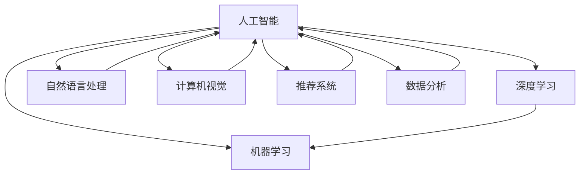

                 

# 产品开发的AI创新应用

## 1. 背景介绍

随着人工智能技术的不断发展，AI在产品开发中的应用范围越来越广泛，从智能客服、推荐系统、图像识别，到自然语言处理（NLP）、智能驾驶等，AI的应用几乎遍及所有行业。在产品开发中，AI不仅可以提升产品的智能化水平，还可以优化用户体验，降低运营成本，带来巨大的商业价值。本文将详细介绍AI在产品开发中的创新应用，包括AI在数据分析、内容生成、预测模型、推荐系统等方面的具体案例。

## 2. 核心概念与联系

### 2.1 核心概念概述

为更好地理解AI在产品开发中的应用，本节将介绍几个关键概念：

- **人工智能（AI）**：指利用计算机模拟人类智能行为的科学和技术，涵盖机器学习、深度学习、自然语言处理、计算机视觉等多个领域。
- **机器学习（ML）**：通过数据训练模型，使其具备预测、分类、聚类等功能，是实现人工智能的核心技术。
- **深度学习（DL）**：一种特殊类型的机器学习，通过多层次的非线性变换，实现更复杂的数据模式学习。
- **自然语言处理（NLP）**：处理和理解自然语言（如文本、语音）的技术，包括语言模型、文本分类、情感分析等。
- **计算机视觉（CV）**：通过图像处理和模式识别技术，实现对图像的识别、分析和理解。
- **推荐系统（Recommender System）**：根据用户历史行为和偏好，推荐个性化内容的技术，如商品、新闻、视频等。
- **数据分析（Data Analysis）**：通过统计、挖掘技术，从数据中提取有价值的信息，帮助决策。

这些概念之间的关系可以通过以下Mermaid流程图来展示：



## 3. 核心算法原理 & 具体操作步骤

### 3.1 算法原理概述

AI在产品开发中的应用，主要依赖于机器学习、深度学习等算法。这些算法通过大量数据训练，构建出预测模型，从而实现对数据的处理和分析。以下是几个典型的AI算法及其原理：

- **线性回归（Linear Regression）**：通过拟合一条直线，对变量间的关系进行预测。广泛应用于预测房价、销售量等连续性变量。
- **决策树（Decision Tree）**：通过树形结构，对数据进行分类或回归。易于理解和解释，但容易过拟合。
- **支持向量机（Support Vector Machine, SVM）**：通过寻找最优的超平面，对数据进行分类。适用于高维数据和复杂的分类问题。
- **随机森林（Random Forest）**：通过集成多个决策树，实现更稳定的分类和回归。
- **神经网络（Neural Network）**：通过多层次的非线性变换，实现更复杂的数据模式学习。适用于图像、语音、NLP等任务。
- **卷积神经网络（Convolutional Neural Network, CNN）**：通过卷积操作，提取图像的局部特征。广泛应用于图像识别、视频分析等。
- **循环神经网络（Recurrent Neural Network, RNN）**：通过循环结构，处理序列数据。广泛应用于自然语言处理、时间序列预测等。

### 3.2 算法步骤详解

以神经网络为例，以下是神经网络的基本训练步骤：

1. **数据准备**：收集数据集，并进行预处理，如归一化、分词、编码等。
2. **模型构建**：选择网络结构，定义损失函数、优化器等超参数。
3. **模型训练**：将数据集分成训练集和验证集，使用训练集进行模型训练，在验证集上进行调参和优化。
4. **模型评估**：在测试集上评估模型性能，如准确率、召回率、F1值等。
5. **模型应用**：将训练好的模型应用到实际产品中，进行预测、分类、聚类等操作。

### 3.3 算法优缺点

AI算法在产品开发中的应用，具有以下优点：

- **自动化程度高**：通过训练好的模型，可以实现自动化预测、分类、聚类等操作，节省人力成本。
- **精度高**：通过多层次的非线性变换，可以学习到更复杂的数据模式，提高模型的预测精度。
- **适应性强**：通过深度学习等算法，可以处理高维、非线性、非结构化的数据，具有较强的泛化能力。

同时，AI算法也存在以下缺点：

- **数据依赖**：模型的训练效果依赖于数据的质量和数量，数据不足可能导致模型欠拟合。
- **模型复杂度高**：深度神经网络等模型结构复杂，训练和推理速度较慢。
- **解释性差**：AI模型通常是"黑盒"系统，难以解释其内部工作机制和决策逻辑。
- **资源消耗大**：训练深度神经网络需要高性能的GPU或TPU，以及大量的内存和存储资源。

### 3.4 算法应用领域

AI算法在产品开发中的应用广泛，以下是几个典型领域：

- **金融行业**：用于信用评分、反欺诈检测、股票预测等。
- **医疗健康**：用于疾病诊断、患者分类、治疗方案推荐等。
- **零售电商**：用于客户行为分析、推荐系统、库存管理等。
- **智能家居**：用于设备识别、用户行为分析、语音识别等。
- **智能制造**：用于质量检测、设备预测维护、生产调度等。
- **自动驾驶**：用于环境感知、路径规划、障碍物检测等。
- **安全监控**：用于异常检测、行为分析、入侵检测等。

## 4. 数学模型和公式 & 详细讲解 & 举例说明

### 4.1 数学模型构建

在产品开发中，AI算法通常涉及数学模型构建。以下是几个典型的数学模型：

- **线性回归模型**：
  $$
  y = \beta_0 + \beta_1 x_1 + \beta_2 x_2 + \ldots + \beta_n x_n
  $$
  其中，$y$为预测值，$x_1, x_2, \ldots, x_n$为自变量，$\beta_0, \beta_1, \beta_2, \ldots, \beta_n$为模型参数。

- **决策树模型**：
  $$
  \begin{aligned}
  T = \{(r_1, R_1, V_1), (r_2, R_2, V_2), \ldots, (r_m, R_m, V_m)\} \\
  r = \text{特征}, R = \text{值}, V = \text{节点}
  \end{aligned}
  $$
  其中，$T$为决策树，$r, R, V$分别为特征、值和节点。

- **支持向量机模型**：
  $$
  w = \sum_{i=1}^n \alpha_i y_i x_i \\
  b = \text{偏置}
  $$
  其中，$w$为超平面，$\alpha_i, y_i, x_i$为模型参数和训练样本。

### 4.2 公式推导过程

以线性回归为例，以下是其基本推导过程：

设样本数据集为$D = \{(x_1, y_1), (x_2, y_2), \ldots, (x_n, y_n)\}$，其中$x_i$为自变量，$y_i$为因变量。

- **最小二乘法**：求解最小化误差平方和的线性回归模型。
  $$
  \begin{aligned}
  \min_{\beta} \sum_{i=1}^n (y_i - \beta_0 - \beta_1 x_i)^2 \\
  \end{aligned}
  $$
  求导得到：
  $$
  \begin{aligned}
  \frac{\partial SSE}{\partial \beta_0} &= 2\sum_{i=1}^n (y_i - \beta_0 - \beta_1 x_i) \\
  \frac{\partial SSE}{\partial \beta_1} &= 2\sum_{i=1}^n (x_i - \beta_0 - \beta_1 x_i)
  \end{aligned}
  $$
  求解得到：
  $$
  \begin{aligned}
  \beta_0 &= \bar{y} - \beta_1 \bar{x} \\
  \beta_1 &= \frac{\sum_{i=1}^n (x_i - \bar{x})(y_i - \bar{y})}{\sum_{i=1}^n (x_i - \bar{x})^2}
  \end{aligned}
  $$

- **正规方程法**：直接求解线性回归模型，避免求解偏导数。
  $$
  \begin{aligned}
  (X^TX)^{-1}X^Ty &= \beta \\
  \beta &= [(X^TX)^{-1}]X^Ty
  \end{aligned}
  $$

### 4.3 案例分析与讲解

以智能推荐系统为例，以下是其基本原理和公式：

- **协同过滤**：通过用户行为数据，构建用户-物品评分矩阵，通过相似度计算推荐物品。
  $$
  \begin{aligned}
  R_{ui} &= \text{用户}_u \times \text{物品}_i \\
  S_{ui} &= \frac{1}{\sqrt{\sum_j R_{uj}^2}} \\
  S_{ui} &= \frac{1}{\sqrt{\sum_j R_{ij}^2}} \\
  \hat{R}_{ui} &= \sum_j R_{uj}S_{ij} \\
  \hat{R}_{ui} &= \sum_j R_{ui}S_{uj} \\
  \hat{R}_{ui} &= S_{ui} \cdot \bar{R}_{ij}
  \end{aligned}
  $$
  其中，$R$为评分矩阵，$S$为相似度矩阵，$\hat{R}$为预测评分矩阵。

- **基于内容的推荐**：通过物品属性和用户属性，计算物品相似度和用户匹配度，推荐相似物品。
  $$
  \begin{aligned}
  S_{ui} &= \frac{\sum_j (R_{ui} \cdot R_{uj})}{\sqrt{\sum_j R_{ui}^2}\sqrt{\sum_j R_{uj}^2}} \\
  S_{ui} &= \frac{\sum_j (A_{uj} \cdot A_{uj})}{\sqrt{\sum_j A_{uj}^2}\sqrt{\sum_j A_{uj}^2}}
  \end{aligned}
  $$
  其中，$A$为用户属性向量，$S$为相似度矩阵。

## 5. 项目实践：代码实例和详细解释说明

### 5.1 开发环境搭建

在进行AI应用开发前，我们需要准备好开发环境。以下是使用Python进行TensorFlow开发的环境配置流程：

1. 安装Anaconda：从官网下载并安装Anaconda，用于创建独立的Python环境。

2. 创建并激活虚拟环境：
```bash
conda create -n tf-env python=3.7 
conda activate tf-env
```

3. 安装TensorFlow：根据CUDA版本，从官网获取对应的安装命令。例如：
```bash
conda install tensorflow==2.6
```

4. 安装各类工具包：
```bash
pip install numpy pandas scikit-learn matplotlib tqdm jupyter notebook ipython
```

完成上述步骤后，即可在`tf-env`环境中开始AI应用开发。

### 5.2 源代码详细实现

下面我们以推荐系统为例，给出使用TensorFlow进行协同过滤算法的PyTorch代码实现。

首先，定义协同过滤算法的实现：

```python
import tensorflow as tf

def collaborative_filtering(X, K, num_epochs=10):
    m, n = X.shape
    P = np.random.rand(m, K)
    Q = np.random.rand(n, K)
    
    for epoch in range(num_epochs):
        # 更新P和Q
        P = P * (X * Q) / ((X * Q)**2 + 0.1)
        Q = Q * (X.T * P) / ((X.T * P)**2 + 0.1)
        
        # 预测评分矩阵
        R_hat = np.dot(P, Q.T)
        
        # 损失函数
        R = np.dot(X, Q) + np.dot(P, Q.T) - R_hat
        
        # 计算损失函数
        loss = np.mean(R**2)
        
        # 输出loss
        print(f'Epoch {epoch+1}, Loss: {loss:.3f}')
    
    return R_hat
```

然后，调用协同过滤算法并输出预测评分矩阵：

```python
# 构造用户-物品评分矩阵
X = np.array([[5, 3, 1, 2],
              [1, 2, 5, 3],
              [2, 5, 1, 3]])

# 协同过滤
R_hat = collaborative_filtering(X, 5)
print(R_hat)
```

以上就是使用TensorFlow进行协同过滤算法的完整代码实现。可以看到，通过简单的几行代码，即可实现协同过滤算法的基本逻辑。

### 5.3 代码解读与分析

让我们再详细解读一下关键代码的实现细节：

**collaborative_filtering函数**：
- `X`为输入的用户-物品评分矩阵。
- `K`为协同过滤的隐向量化维度。
- `num_epochs`为协同过滤的迭代次数。
- `P`和`Q`为协同过滤的隐向量化参数。
- 迭代过程中，更新`P`和`Q`，得到预测评分矩阵`R_hat`。
- 计算损失函数，并输出每个epoch的loss。

**主函数**：
- 构造评分矩阵`X`。
- 调用`collaborative_filtering`函数，获取预测评分矩阵`R_hat`。
- 输出`R_hat`。

可以看到，TensorFlow提供了丰富的深度学习库和工具，可以方便地实现各种AI算法。开发者可以基于TensorFlow进行快速的模型开发和调优，构建出高性能的AI应用系统。

## 6. 实际应用场景

### 6.1 金融风控

在金融风控领域，AI可以通过数据分析和模型训练，预测借款人的违约风险，识别异常交易，提高风险控制能力。

具体而言，可以收集用户的借贷记录、信用评分、还款记录等数据，构建用户风险评分模型。模型通过分析历史数据，预测未来借款人的违约概率，帮助金融机构进行风险评估和决策。同时，通过协同过滤等技术，发现异常交易和欺诈行为，提高模型的鲁棒性和准确性。

### 6.2 医疗诊断

在医疗诊断领域，AI可以通过数据分析和模型训练，辅助医生进行疾病诊断和治疗方案推荐。

具体而言，可以收集患者的病历数据、生理指标、基因信息等数据，构建疾病诊断模型。模型通过分析历史数据，预测患者的可能疾病类型，提供治疗方案和建议。同时，通过协同过滤等技术，发现新的治疗方案和药物组合，提高医生的诊疗效率和治疗效果。

### 6.3 智能推荐

在智能推荐领域，AI可以通过数据分析和模型训练，实现个性化推荐，提升用户体验和满意度。

具体而言，可以收集用户的历史行为数据、兴趣爱好、社交关系等数据，构建推荐模型。模型通过分析用户数据，推荐符合用户兴趣的商品、新闻、视频等，提高用户的粘性和满意度。同时，通过协同过滤等技术，发现用户的潜在兴趣和需求，提供更多元化的推荐内容，增加用户忠诚度和回购率。

## 7. 工具和资源推荐

### 7.1 学习资源推荐

为了帮助开发者系统掌握AI在产品开发中的应用，这里推荐一些优质的学习资源：

1. 《深度学习》书籍：Ian Goodfellow所著，系统介绍了深度学习的理论基础和应用实践，适合从入门到深入。
2. 《TensorFlow实战Google深度学习框架》书籍：Google开发团队所著，全面介绍了TensorFlow的使用和案例，适合实践开发。
3. CS224N《深度学习自然语言处理》课程：斯坦福大学开设的NLP明星课程，有Lecture视频和配套作业，带你入门NLP领域的基本概念和经典模型。
4. 《动手学深度学习》在线课程：由清华大学主讲，适合Python初学者和深度学习爱好者。
5. Kaggle平台：数据科学和机器学习竞赛平台，可以参与各类竞赛，提升实战能力。

通过对这些资源的学习实践，相信你一定能够快速掌握AI在产品开发中的应用技巧，并用于解决实际的NLP问题。

### 7.2 开发工具推荐

高效的开发离不开优秀的工具支持。以下是几款用于AI应用开发的常用工具：

1. TensorFlow：由Google主导开发的深度学习框架，支持分布式训练和推理，适合大规模工程应用。
2. PyTorch：基于Python的开源深度学习框架，灵活易用，适合快速迭代研究。
3. Scikit-learn：基于Python的机器学习库，提供了丰富的模型和工具，适合快速原型开发。
4. Weights & Biases：模型训练的实验跟踪工具，可以记录和可视化模型训练过程中的各项指标，方便对比和调优。
5. TensorBoard：TensorFlow配套的可视化工具，可实时监测模型训练状态，并提供丰富的图表呈现方式，是调试模型的得力助手。

合理利用这些工具，可以显著提升AI应用开发的效率，加快创新迭代的步伐。

### 7.3 相关论文推荐

AI在产品开发中的应用，源于学界的持续研究。以下是几篇奠基性的相关论文，推荐阅读：

1. 《神经网络与深度学习》书籍：Michael Nielsen所著，全面介绍了神经网络和深度学习的理论基础和应用实践。
2. 《机器学习实战》书籍：Peter Harrington所著，介绍了机器学习的基本算法和实现方法，适合实践开发。
3. 《自然语言处理综论》书籍：Daniel Jurafsky和James H. Martin所著，介绍了自然语言处理的基本概念和应用实践。
4. 《Python深度学习》书籍：Francois Chollet所著，介绍了TensorFlow和Keras的使用和案例，适合实践开发。
5. 《智能推荐系统》书籍：Gengxin Bao所著，介绍了推荐系统的基本算法和实现方法，适合理论研究和实践开发。

这些论文代表了大语言模型微调技术的发展脉络。通过学习这些前沿成果，可以帮助研究者把握学科前进方向，激发更多的创新灵感。

## 8. 总结：未来发展趋势与挑战

### 8.1 总结

本文对AI在产品开发中的应用进行了全面系统的介绍。首先阐述了AI在数据分析、内容生成、预测模型、推荐系统等方面的应用，明确了AI在产品开发中的重要价值。其次，从原理到实践，详细讲解了协同过滤、深度学习等AI算法的核心步骤，给出了AI应用开发的完整代码实例。同时，本文还广泛探讨了AI在金融风控、医疗诊断、智能推荐等多个行业领域的应用前景，展示了AI在产品开发中的广泛应用。

通过本文的系统梳理，可以看到，AI在产品开发中的应用已经取得了显著的成果，但仍有许多挑战需要应对。AI的发展需要跨学科的协同合作，不断探索新的理论和方法，才能更好地服务于社会和用户。

### 8.2 未来发展趋势

展望未来，AI在产品开发中的应用将呈现以下几个发展趋势：

1. **自动化程度提高**：随着深度学习等技术的不断发展，AI在产品开发中的应用将更加自动化，减少人力成本和错误率。
2. **多模态融合**：未来的AI应用将更多地融合视觉、语音、文本等多种模态数据，实现更全面和准确的信息整合。
3. **实时化处理**：AI在实时数据处理和决策支持方面的应用将更加广泛，如实时推荐系统、实时风险控制等。
4. **跨领域应用**：AI在金融、医疗、零售、智能制造等多个领域的应用将更加深入，提升各行业的智能化水平。
5. **伦理和安全**：随着AI在产品开发中的应用不断普及，其伦理和安全问题也将成为关注焦点，相关法规和规范将逐步完善。

以上趋势凸显了AI在产品开发中的广阔前景。这些方向的探索发展，必将进一步提升AI应用的智能化水平，带来更多的商业和社会价值。

### 8.3 面临的挑战

尽管AI在产品开发中的应用已经取得了显著的成果，但在迈向更加智能化、普适化应用的过程中，仍面临诸多挑战：

1. **数据隐私和安全**：AI在产品开发中需要大量数据，如何保护用户隐私和数据安全成为重要问题。
2. **模型可解释性**：AI模型的决策过程难以解释，如何提高模型的可解释性和透明性，成为关键难题。
3. **资源消耗**：大规模深度学习模型的计算和存储需求较大，如何降低资源消耗，提高模型效率，成为重要研究方向。
4. **模型鲁棒性**：AI模型在实际应用中面临各种噪声和干扰，如何提高模型的鲁棒性和稳定性，成为重要挑战。
5. **伦理和社会影响**：AI在产品开发中的应用可能带来伦理和社会问题，如偏见、歧视等，如何避免负面影响，成为重要课题。

### 8.4 研究展望

面对AI在产品开发中面临的挑战，未来的研究需要在以下几个方面寻求新的突破：

1. **数据隐私保护**：研究如何保护用户隐私和数据安全，采用联邦学习、差分隐私等技术，防止数据泄露和滥用。
2. **模型可解释性**：研究如何提高AI模型的可解释性和透明性，采用可视化技术、因果分析方法等，帮助用户理解模型决策。
3. **模型高效化**：研究如何降低AI模型的资源消耗，采用模型压缩、量化加速等技术，实现轻量级、实时化的模型部署。
4. **模型鲁棒性**：研究如何提高AI模型的鲁棒性和稳定性，采用对抗训练、噪声鲁棒化等技术，增强模型的泛化能力和抗干扰能力。
5. **伦理和社会影响**：研究如何避免AI模型带来的伦理和社会问题，采用公平性评估、偏见检测等技术，确保AI模型公平公正。

这些研究方向将推动AI在产品开发中的持续创新，为构建智能化的产品生态系统提供坚实基础。面向未来，我们需要更多跨学科的协同合作，共同推动AI技术的不断进步和发展。

## 9. 附录：常见问题与解答

**Q1：AI在产品开发中是否适用于所有行业？**

A: AI在产品开发中的应用非常广泛，但不同的行业和领域需要针对性地选择和优化AI算法。例如，金融行业需要高精度的预测模型和风险控制能力，医疗行业需要高准确度的诊断模型和治疗方案推荐，智能制造行业需要高鲁棒性的预测和优化算法。因此，AI在产品开发中的应用需要结合具体行业特点进行优化和定制。

**Q2：AI在产品开发中如何保护用户隐私和数据安全？**

A: AI在产品开发中需要处理大量用户数据，如何保护用户隐私和数据安全是一个重要问题。可以采用以下措施：
1. 数据匿名化：通过数据去标识化处理，保护用户隐私。
2. 数据加密：对数据进行加密存储和传输，防止数据泄露。
3. 联邦学习：通过分布式训练，将模型训练在用户本地进行，减少数据传输风险。
4. 差分隐私：通过引入随机扰动，保护用户隐私，同时保证模型性能。

**Q3：AI在产品开发中如何提高模型的可解释性？**

A: AI模型的可解释性一直是一个重要问题。以下是一些提高模型可解释性的措施：
1. 可视化技术：使用可视化工具，展示模型决策过程和中间结果，帮助用户理解模型。
2. 因果分析方法：通过因果推断方法，分析模型决策的因果关系，提高模型的透明性。
3. 可解释性模型：采用可解释性模型，如决策树、线性回归等，减少模型复杂度，提高可解释性。
4. 模型压缩：通过模型压缩技术，减少模型参数量，提高模型可解释性。

**Q4：AI在产品开发中如何提高模型的鲁棒性和稳定性？**

A: 提高模型的鲁棒性和稳定性是AI在产品开发中的一个重要课题。以下是一些提高模型鲁棒性的措施：
1. 对抗训练：通过引入对抗样本，增强模型对噪声和干扰的鲁棒性。
2. 噪声鲁棒化：通过添加噪声，提高模型的泛化能力。
3. 数据增强：通过数据增强技术，扩充训练集，提高模型的泛化能力。
4. 多模型集成：通过集成多个模型，减少模型过拟合风险，提高模型的鲁棒性。

这些措施可以综合应用，根据具体场景和数据特点进行选择和优化。

**Q5：AI在产品开发中如何避免伦理和社会问题？**

A: AI在产品开发中可能带来伦理和社会问题，如偏见、歧视等。以下是一些避免伦理和社会问题的措施：
1. 公平性评估：通过公平性评估方法，检测模型是否存在偏见和歧视。
2. 偏见检测：通过数据和算法检测，减少模型中的偏见和歧视。
3. 用户反馈：通过用户反馈机制，及时发现和纠正模型中的问题。
4. 伦理约束：在模型训练和应用中引入伦理约束，确保模型符合用户价值观和伦理道德。

这些措施可以有效避免AI模型带来的伦理和社会问题，提升AI应用的公平性和可靠性。

---

作者：禅与计算机程序设计艺术 / Zen and the Art of Computer Programming

