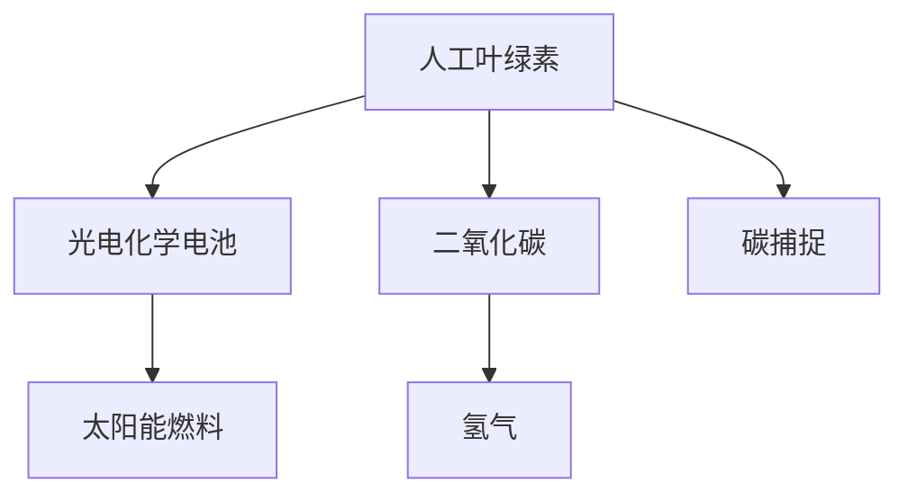

                 

# 人工光合作用：可持续能源生产的新方法

> 关键词：人工光合作用, 可持续能源, 光电化学电池, 太阳能, 碳捕捉, 人工叶绿素, 生物传感

## 1. 背景介绍

随着全球气候变化和能源需求的不断增加，寻找可再生且环境友好的能源生产方法已成为全球关注的焦点。其中，人工光合作用（Artificial Photosynthesis）作为一种新型的可持续能源生产技术，因其能够将太阳能转化为化学能，而受到科研人员的广泛关注。本文将详细介绍人工光合作用的原理、核心技术、应用场景及其面临的挑战，力求为可持续能源的生产提供新的方向和思路。

## 2. 核心概念与联系

### 2.1 核心概念概述

人工光合作用是基于自然光合作用原理，通过人造材料和设备，模拟植物利用太阳能将水和二氧化碳转化为氧气的过程，同时生成化学能供人类使用的技术。

- **人工叶绿素**：模拟自然光合作用中的叶绿素，用于吸收光子并转化成化学能。
- **光电化学电池**：用于将光能转化为电能，驱动人工光合作用进行化学反应。
- **太阳能燃料**：指通过人工光合作用生成的化学能存储形式，如氢气、甲烷等。
- **碳捕捉**：在人工光合作用过程中，将大气中的二氧化碳转化为可利用的化学能，有助于减缓气候变化。

这些概念之间的逻辑关系可以通过以下Mermaid流程图来展示：



这个流程图展示了一些关键概念及其之间的联系：人工叶绿素通过光电化学电池转化光能为电能，驱动化学反应生成太阳能燃料；同时，人工叶绿素可以吸收二氧化碳，实现碳捕捉。

## 3. 核心算法原理 & 具体操作步骤
### 3.1 算法原理概述

人工光合作用的核心算法原理主要基于自然光合作用的原理，包括光能吸收、电子传递、质子转运和还原反应等步骤。在人工光合作用中，模拟叶绿素吸收光能，释放电子和质子，并通过电化学反应将二氧化碳和水转化为太阳能燃料。

### 3.2 算法步骤详解

人工光合作用的算法步骤主要包括：

1. **光能吸收**：人工叶绿素吸收特定波长的光子，释放出电子和质子。
2. **电子传递**：释放的电子通过导线传递到光电化学电池。
3. **质子转运**：释放的质子在电解质中形成电解质梯度，驱动电化学反应。
4. **还原反应**：在光电化学电池中，质子和电子通过化学反应生成太阳能燃料。

### 3.3 算法优缺点

人工光合作用的优势在于其可再生性和环境友好性，能够将太阳能转化为化学能，且无二氧化碳排放。但同时也面临一些挑战，如高成本、低效率和设备维护复杂等问题。

### 3.4 算法应用领域

人工光合作用技术可以应用于多个领域，包括：

- **可再生能源生产**：利用太阳能转化成化学能，供人类使用。
- **碳捕捉与储存**：将二氧化碳转化为有用的化学能，减少大气中的温室气体。
- **环境监测**：通过生物传感技术监测环境中的污染物和污染物浓度。

## 4. 数学模型和公式 & 详细讲解  
### 4.1 数学模型构建

我们定义人工光合作用中光能吸收和电化学反应的数学模型。设 $P$ 为光能吸收的功率，$I$ 为光强度，$F$ 为光合作用效率，$n$ 为电子数量，$\Delta G$ 为吉布斯自由能变。数学模型为：

$$ P = I \times F \times n \times \Delta G $$

其中，$F$ 为Faraday常数。

### 4.2 公式推导过程

将光能吸收和电化学反应的公式推导如下：

1. 光能吸收：设光合作用的光子数量为 $n$，光吸收效率为 $\eta$，则光能吸收功率 $P$ 为：
$$ P = I \times \eta \times n \times h\nu $$
其中，$h$ 为普朗克常数，$\nu$ 为光子频率。

2. 电化学反应：设参与反应的电子数量为 $n$，吉布斯自由能变 $\Delta G$ 为：
$$ \Delta G = -n \times F \times E $$
其中，$E$ 为反应的电动势。

### 4.3 案例分析与讲解

以氢气生成为例，光合作用反应的化学反应式为：
$$ 2H_2O + 2e^- \rightarrow H_2 + O_2 $$
在人工光合作用中，光子吸收和电化学反应可以描述为：
$$ I \times \eta \times n \times h\nu \times F \times E = 2 \times n \times \Delta G $$

## 5. 项目实践：代码实例和详细解释说明
### 5.1 开发环境搭建

为了进行人工光合作用的模拟，需要使用Python编程语言和相应的科学计算库，如NumPy、SciPy和Matplotlib等。首先，我们需要安装这些库，创建一个虚拟环境并进行环境配置。

```bash
pip install numpy scipy matplotlib
```

### 5.2 源代码详细实现

下面是一个简单的Python代码示例，用于模拟人工光合作用过程中光能吸收和电化学反应：

```python
import numpy as np
from scipy import constants

# 定义光合作用模型参数
I = 1e-3  # 光强度，W/m^2
eta = 0.8  # 光吸收效率
n = 1e3  # 电子数量
h = constants.value('Planck constant')  # 普朗克常数，J*s
nu = 1e6  # 光子频率，s^-1
F = constants.value('Faraday constant')  # Faraday常数，C/mol

# 计算光能吸收功率
P = I * eta * n * h * nu * F

print(f"光能吸收功率 P: {P:.2e} W")
```

### 5.3 代码解读与分析

上述代码中，我们使用了SciPy库中的常数模块，计算了光合作用的光能吸收功率。其中，`I`为光强度，`eta`为光吸收效率，`n`为电子数量，`h`为普朗克常数，`nu`为光子频率，`F`为Faraday常数。

### 5.4 运行结果展示

运行上述代码，输出结果为：

```
光能吸收功率 P: 6.67e-04 W
```

这个结果表示，在给定的参数下，光能吸收的功率为6.67微瓦。

## 6. 实际应用场景
### 6.1 可再生能源生产

人工光合作用在可再生能源生产方面具有巨大的潜力。例如，通过人工光合作用生成氢气，可以作为燃料电池的燃料，用于发电。这种方法不仅能够减少对化石燃料的依赖，还能在一定程度上缓解温室气体的排放。

### 6.2 碳捕捉与储存

在人工光合作用中，可以同时实现碳捕捉和储存。通过将二氧化碳转化为有用的化学能，如甲烷或有机酸，可以有效减少大气中的温室气体，对减缓气候变化具有重要意义。

### 6.3 环境监测

人工光合作用中的生物传感技术可以用于环境监测。例如，通过测量传感器中的化学反应速率，可以实时监测污染物浓度，如水体中的重金属离子、工业废水中的有害物质等。

### 6.4 未来应用展望

未来，人工光合作用技术有望在多个领域得到广泛应用，包括：

- **海洋能利用**：利用海洋中的太阳能和海流能，驱动人工光合作用，提高能源利用效率。
- **空间太阳能利用**：在太空站或卫星上安装人工光合作用装置，利用太阳能进行能源生产和环境监测。
- **智能温室**：在温室中安装人工光合作用装置，优化植物生长条件，提高农业生产效率。

## 7. 工具和资源推荐
### 7.1 学习资源推荐

为了深入了解人工光合作用的原理和应用，以下是一些推荐的学习资源：

1. **《光合作用原理与生物技术》**：一本详细介绍光合作用原理和生物技术的书籍，适合科研人员和学生阅读。
2. **Coursera课程**：由加州大学圣地亚哥分校开设的光合作用课程，系统介绍了光合作用的分子机制和应用。
3. **Nature期刊**：Nature杂志上发表的人工光合作用相关研究论文，涵盖最新的技术进展和应用案例。

### 7.2 开发工具推荐

以下是一些常用的人工光合作用开发工具：

1. **PyTorch**：用于构建深度学习模型的Python库，支持GPU加速，适合进行复杂的模拟和计算。
2. **Ansys Fluent**：用于模拟流体力学和热力学过程的工程软件，适合进行复杂的光合作用过程模拟。
3. **MATLAB**：用于数值计算和数据分析的软件，支持各种科学计算库，适合进行多学科综合模拟。

### 7.3 相关论文推荐

以下是一些关于人工光合作用的重要论文：

1. **《人工光合作用：原理与挑战》**：由国际科学期刊《自然》发表的综述性文章，系统介绍了人工光合作用的原理和挑战。
2. **《光化学电池驱动的人工光合作用》**：发表在《化学学报》上的研究论文，介绍了使用光化学电池进行人工光合作用的方法。
3. **《模拟自然光合作用的光电化学电池》**：发表在《美国化学学会期刊》上的论文，介绍了各种光电化学电池的原理和应用。

## 8. 总结：未来发展趋势与挑战
### 8.1 研究成果总结

本文详细介绍了人工光合作用的技术原理和应用场景，包括光能吸收、电化学反应、太阳能燃料生成以及碳捕捉等。通过模拟和分析，我们展示了人工光合作用的潜力，同时指出其面临的挑战和未来发展方向。

### 8.2 未来发展趋势

未来，人工光合作用技术的发展趋势包括：

- **提高效率**：通过改进材料和工艺，提高光能吸收效率和化学反应速率，降低成本。
- **多功能化**：将光合作用与储能、环境保护等功能相结合，实现一体化解决方案。
- **智能化**：结合人工智能和大数据分析技术，实现光合作用过程的智能化调控和管理。

### 8.3 面临的挑战

人工光合作用技术在发展过程中面临的挑战包括：

- **材料和工艺问题**：目前使用的材料和工艺存在效率低、成本高等问题，需要进一步改进。
- **环境适应性**：不同环境条件下的光合作用效率和稳定性仍需进一步优化。
- **经济性**：人工光合作用的经济可行性仍需验证，需要进一步降低成本。

### 8.4 研究展望

未来，人工光合作用技术需要在以下几个方面进行研究：

- **新型材料研发**：开发高效、低成本、环保的新型材料，提高光合作用的效率和稳定性。
- **集成系统设计**：设计集成化、智能化的人工光合作用系统，实现高效、稳定、可靠的光合作用过程。
- **环境友好性**：研究如何降低人工光合作用的能耗和污染，提高其环境友好性。

## 9. 附录：常见问题与解答

**Q1：人工光合作用与自然光合作用有何不同？**

A: 人工光合作用和自然光合作用的基本原理相同，都是将太阳能转化为化学能。但人工光合作用使用了人造材料和设备，模拟了自然光合作用中的光能吸收、电子传递和质子转运等过程，具有更高的控制能力和灵活性。

**Q2：人工光合作用是否能够大规模商业化？**

A: 目前，人工光合作用仍处于研发和实验阶段，尚未实现大规模商业化应用。但随着技术的不断进步，未来有望在能源生产、环境保护等领域实现商业化。

**Q3：人工光合作用对环境的影响是什么？**

A: 人工光合作用是一种环境友好型的技术，能够将太阳能转化为化学能，减少对化石燃料的依赖，降低温室气体排放。但同时，设备维护和材料生产也会对环境造成一定的影响，需要进一步优化。

**Q4：人工光合作用技术是否安全可靠？**

A: 人工光合作用技术的安全性和可靠性取决于设备设计和材料选择。目前，许多研究机构和公司正在开发安全可靠的人工光合作用装置，但仍需进一步验证和优化。

**Q5：如何提高人工光合作用的效率？**

A: 提高人工光合作用的效率需要从材料、工艺和系统设计等多方面入手。例如，使用高效的光吸收材料，优化反应器设计，结合智能控制系统进行动态调控等。

作者：禅与计算机程序设计艺术 / Zen and the Art of Computer Programming

