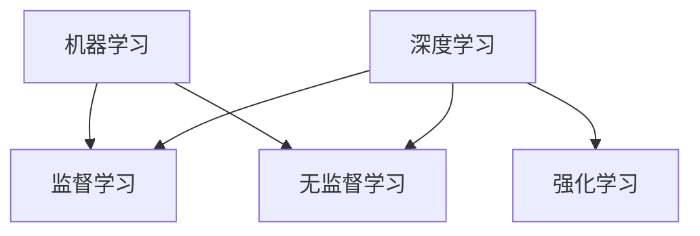

                 

# 人工智能 原理与代码实例讲解

## 1. 背景介绍

### 1.1 问题由来

人工智能(Artificial Intelligence, AI)是计算机科学的一个分支，致力于创建能够执行通常需要人类智能的任务的机器。AI的核心在于机器学习（Machine Learning, ML）和深度学习（Deep Learning, DL）等技术。通过大量数据和计算资源的训练，机器可以学习复杂的模式和规律，进而自动完成任务。

人工智能的发展已经从早期的规则系统和专家系统逐步演化到当前的机器学习和深度学习范式。这一变迁不仅源于计算能力的提升，也得益于数据存储和处理技术的突破。在数据驱动的现代AI中，数据质量和数量对于模型的性能至关重要。而随着预训练大模型的出现，AI进入了一个新的阶段，预训练模型能够在大规模无标签数据上学习通用的知识表示，显著提升了模型性能。

### 1.2 问题核心关键点

本文将详细探讨人工智能的原理，并通过代码实例讲解关键的机器学习和深度学习算法。主要关注以下问题：
- 什么是机器学习？
- 深度学习的原理和架构是什么？
- 如何利用深度学习进行图像分类、文本生成等任务？
- 常用的机器学习算法和模型有哪些？
- 如何高效地实现和应用这些算法？

通过对这些问题的深入解答，读者能够对人工智能的原理和实践有更全面的理解。

## 2. 核心概念与联系

### 2.1 核心概念概述

为便于理解，首先概述人工智能中几个核心概念及其联系：

- 机器学习（Machine Learning, ML）：一种利用数据和算法让计算机从经验中自动改进的技术。通过训练数据，机器学习模型能够学习到数据中隐含的模式，并在新数据上做出预测。
- 深度学习（Deep Learning, DL）：一种特殊的机器学习方法，通过构建多层的神经网络模型，自动学习到数据的层次化表示。深度学习在图像识别、自然语言处理等领域表现优异。
- 监督学习（Supervised Learning）：一种机器学习范式，使用带有标签的数据进行训练，目标是学习一个能够准确预测标签的模型。
- 无监督学习（Unsupervised Learning）：一种机器学习范式，使用未标注的数据进行训练，目标是发现数据中的隐含结构。
- 强化学习（Reinforcement Learning）：一种机器学习范式，通过与环境互动，根据奖励信号进行学习，目标是优化某个目标指标。

这些概念通过以下Mermaid流程图展示了它们之间的联系：



这个流程图说明机器学习是所有AI技术的基础，而深度学习、监督学习、无监督学习和强化学习则是机器学习的主要分支，各自有不同的应用场景。

## 3. 核心算法原理 & 具体操作步骤

### 3.1 算法原理概述

深度学习算法是一种特殊的机器学习技术，通过构建多层神经网络，自动学习数据的表示，并在新的数据上做出预测。深度学习的核心在于神经网络的结构和训练方法。本文将重点讲解深度学习中的前向传播、反向传播和优化算法。

- **前向传播**：将输入数据通过神经网络的前向层进行逐层计算，得到输出结果。
- **反向传播**：通过计算输出结果与真实标签的误差，反向更新每个神经元的权重，以最小化误差。
- **优化算法**：如梯度下降（Gradient Descent）、Adam等，用于调整模型参数，使得误差最小化。

### 3.2 算法步骤详解

以下以一个简单的神经网络模型为例，详细介绍深度学习的训练过程。

**步骤1：准备数据集**

假设我们有一个手写数字识别数据集，其中包含了一系列的数字图像和对应的标签。数据集被划分为训练集和测试集。

```python
import numpy as np
from sklearn.datasets import load_digits

digits = load_digits()
X_train, X_test, y_train, y_test = digits.data, digits.target, digits.target[0:800], digits.target[800:]
```

**步骤2：定义模型**

定义一个包含两个隐藏层的神经网络，使用ReLU激活函数。

```python
import tensorflow as tf

def create_model(input_shape):
    model = tf.keras.Sequential([
        tf.keras.layers.Dense(64, activation='relu', input_shape=input_shape),
        tf.keras.layers.Dense(32, activation='relu'),
        tf.keras.layers.Dense(10)
    ])
    return model
```

**步骤3：编译模型**

定义损失函数、优化器和评价指标。

```python
model = create_model(input_shape=X_train.shape[1:])
model.compile(optimizer='adam',
              loss=tf.keras.losses.SparseCategoricalCrossentropy(from_logits=True),
              metrics=['accuracy'])
```

**步骤4：训练模型**

在训练集上训练模型，设置训练轮数和批大小。

```python
model.fit(X_train, y_train, epochs=10, batch_size=32, validation_data=(X_test, y_test))
```

**步骤5：评估模型**

在测试集上评估模型性能。

```python
test_loss, test_acc = model.evaluate(X_test, y_test)
print('Test accuracy:', test_acc)
```

### 3.3 算法优缺点

深度学习算法具有以下优点：
- 能够自动学习数据的复杂表示，适应各种复杂任务。
- 训练过程通过反向传播算法，可以高效地调整模型参数。
- 通过神经网络的多层结构，可以处理高维度的数据。

同时，深度学习算法也存在一些缺点：
- 需要大量的数据和计算资源进行训练。
- 模型复杂度较高，容易出现过拟合。
- 模型训练过程较长，调试和优化较为困难。

### 3.4 算法应用领域

深度学习算法在图像分类、文本生成、语音识别、自然语言处理等领域有着广泛的应用：
- 图像分类：如手写数字识别、物体检测、人脸识别等。
- 文本生成：如机器翻译、文本摘要、对话系统等。
- 语音识别：如语音转文本、语音合成等。
- 自然语言处理：如文本分类、情感分析、问答系统等。

## 4. 数学模型和公式 & 详细讲解 & 举例说明

### 4.1 数学模型构建

深度学习模型的数学模型通常包括输入层、隐藏层和输出层。以一个简单的前馈神经网络为例，其数学模型为：

$$
h = g(w_1 x + b_1) \\
y = w_2 h + b_2
$$

其中，$x$ 为输入，$y$ 为输出，$h$ 为隐藏层输出，$g$ 为激活函数，$w$ 和 $b$ 分别为权重和偏置。

### 4.2 公式推导过程

以一个简单的全连接神经网络为例，推导其反向传播算法。设输入层有 $n$ 个神经元，隐藏层有 $m$ 个神经元，输出层有 $k$ 个神经元，激活函数为 $g$。

前向传播计算输出的公式为：

$$
z^{(l)} = w^{(l)} x + b^{(l)} \\
a^{(l+1)} = g(z^{(l)}) \\
y = w^{(L)} a^{(L)} + b^{(L)}
$$

其中，$^{(l)}$ 表示第 $l$ 层。

假设输出与真实标签的误差为 $J$，反向传播算法计算权重和偏置的更新量 $\Delta w$ 和 $\Delta b$ 的公式为：

$$
\Delta w^{(l)} = \frac{\partial J}{\partial w^{(l)}} \\
\Delta b^{(l)} = \frac{\partial J}{\partial b^{(l)}}
$$

利用链式法则，可以得到：

$$
\Delta w^{(l)} = \frac{\partial J}{\partial z^{(l+1)}} \frac{\partial z^{(l+1)}}{\partial a^{(l)}} \frac{\partial a^{(l)}}{\partial z^{(l)}} \frac{\partial z^{(l)}}{\partial w^{(l)}} \\
\Delta b^{(l)} = \frac{\partial J}{\partial z^{(l+1)}} \frac{\partial z^{(l+1)}}{\partial a^{(l)}} \frac{\partial a^{(l)}}{\partial z^{(l)}} \\
\Delta w^{(l-1)} = \frac{\partial J}{\partial z^{(l)}} \frac{\partial z^{(l)}}{\partial a^{(l-1)}} \frac{\partial a^{(l-1)}}{\partial z^{(l-1)}} \frac{\partial z^{(l-1)}}{\partial w^{(l-1)}} \\
\Delta b^{(l-1)} = \frac{\partial J}{\partial z^{(l)}} \frac{\partial z^{(l)}}{\partial a^{(l-1)}} \frac{\partial a^{(l-1)}}{\partial z^{(l-1)}}
$$

### 4.3 案例分析与讲解

以MNIST手写数字识别为例，展示深度学习模型的训练过程。

**数据准备**：

```python
import tensorflow as tf
from tensorflow.keras.datasets import mnist

(X_train, y_train), (X_test, y_test) = mnist.load_data()
X_train, X_test = X_train / 255.0, X_test / 255.0
```

**模型定义**：

```python
model = tf.keras.Sequential([
    tf.keras.layers.Flatten(input_shape=(28, 28)),
    tf.keras.layers.Dense(128, activation='relu'),
    tf.keras.layers.Dropout(0.2),
    tf.keras.layers.Dense(10)
])
```

**编译和训练**：

```python
model.compile(optimizer='adam',
              loss=tf.keras.losses.SparseCategoricalCrossentropy(from_logits=True),
              metrics=['accuracy'])

model.fit(X_train, y_train, epochs=5, validation_data=(X_test, y_test))
```

**评估**：

```python
test_loss, test_acc = model.evaluate(X_test, y_test)
print('Test accuracy:', test_acc)
```

## 5. 项目实践：代码实例和详细解释说明

### 5.1 开发环境搭建

在进行深度学习项目时，需要搭建合适的开发环境。以Python和TensorFlow为例，搭建过程如下：

1. 安装Python：从官网下载并安装Python，选择适合你的版本。
2. 安装TensorFlow：使用pip安装TensorFlow，建议使用GPU版本以加速计算。
3. 安装必要的依赖包：如numpy、pandas、scikit-learn等。

```bash
pip install tensorflow
pip install numpy pandas scikit-learn matplotlib
```

### 5.2 源代码详细实现

以下是一个简单的图像分类项目的代码实现，以CIFAR-10数据集为例。

```python
import tensorflow as tf
from tensorflow.keras.datasets import cifar10
from tensorflow.keras.utils import to_categorical

(X_train, y_train), (X_test, y_test) = cifar10.load_data()

# 数据预处理
X_train, X_test = X_train / 255.0, X_test / 255.0
y_train = to_categorical(y_train, num_classes=10)
y_test = to_categorical(y_test, num_classes=10)

# 模型定义
model = tf.keras.Sequential([
    tf.keras.layers.Conv2D(32, (3, 3), activation='relu', input_shape=(32, 32, 3)),
    tf.keras.layers.MaxPooling2D((2, 2)),
    tf.keras.layers.Flatten(),
    tf.keras.layers.Dense(10, activation='softmax')
])

# 编译和训练
model.compile(optimizer='adam',
              loss=tf.keras.losses.CategoricalCrossentropy(),
              metrics=['accuracy'])

model.fit(X_train, y_train, epochs=10, validation_data=(X_test, y_test))

# 评估
test_loss, test_acc = model.evaluate(X_test, y_test)
print('Test accuracy:', test_acc)
```

### 5.3 代码解读与分析

1. **数据预处理**：将图像像素值缩放到[0,1]之间，并将标签进行独热编码。
2. **模型定义**：构建一个包含卷积层、池化层和全连接层的神经网络。
3. **编译和训练**：选择适当的优化器和损失函数，并指定评价指标。
4. **评估**：在测试集上评估模型的性能。

## 6. 实际应用场景

### 6.1 图像识别

图像识别是深度学习的一个重要应用领域，广泛应用于自动驾驶、人脸识别、医学影像分析等场景。例如，谷歌的Inception模型在图像分类竞赛中取得了优异的成绩，OpenCV库提供了多种深度学习算法。

### 6.2 自然语言处理

自然语言处理（NLP）是AI的另一个重要分支，包括文本分类、情感分析、机器翻译等任务。BERT模型通过在大规模语料上预训练，显著提升了NLP任务的性能，被广泛应用于智能客服、智能问答等系统。

### 6.3 语音识别

语音识别是AI的重要应用领域，使得计算机能够理解和生成人类语言。谷歌的DeepSpeech模型和亚马逊的Alexa语音助手都基于深度学习技术。

### 6.4 未来应用展望

未来，AI将进一步拓展应用领域，如自动驾驶、智能家居、个性化推荐等。随着深度学习算法和计算能力的提升，AI将变得更加智能和普适，为各行各业带来革命性的变革。

## 7. 工具和资源推荐

### 7.1 学习资源推荐

1. **《深度学习》书籍**：Ian Goodfellow等人著，介绍了深度学习的理论和算法，是深度学习领域的经典教材。
2. **Coursera深度学习课程**：Andrew Ng开设的深度学习课程，内容深入浅出，适合初学者入门。
3. **Kaggle竞赛平台**：提供了大量的机器学习竞赛，可以练习算法和模型。
4. **TensorFlow官网**：提供了大量的教程和示例代码，适合学习深度学习。

### 7.2 开发工具推荐

1. **TensorFlow**：Google开发的深度学习框架，提供了强大的计算图和自动微分功能。
2. **PyTorch**：Facebook开发的深度学习框架，提供了灵活的动态计算图和丰富的优化器。
3. **Jupyter Notebook**：交互式开发环境，支持Python、R等语言。
4. **GitHub**：代码托管平台，方便版本控制和协作开发。

### 7.3 相关论文推荐

1. **《ImageNet Classification with Deep Convolutional Neural Networks》**：Alex Krizhevsky等人所著，介绍了使用CNN进行图像分类的经典算法。
2. **《Attention is All You Need》**：Ashish Vaswani等人所著，介绍了使用Transformer进行序列到序列任务的算法。
3. **《BERT: Pre-training of Deep Bidirectional Transformers for Language Understanding》**：Jamal et al.所著，介绍了使用BERT进行NLP任务的算法。
4. **《AlphaGo Zero: Mastering the Game of Go without Human Knowledge》**：David Silver等人所著，介绍了使用强化学习进行游戏策略优化的算法。

## 8. 总结：未来发展趋势与挑战

### 8.1 研究成果总结

深度学习技术已经取得了显著的进展，广泛应用于各个领域。未来，AI将继续扩展其应用范围，带来更多的创新和变革。

### 8.2 未来发展趋势

1. **模型规模进一步扩大**：随着计算能力和数据规模的增长，预训练模型将具备更强的学习能力和泛化能力。
2. **多模态学习兴起**：AI将融合视觉、语音、文本等多种模态数据，实现更全面的理解。
3. **无监督学习发展**：无监督学习将进一步应用于数据探索和特征提取。
4. **强化学习优化**：强化学习将应用于更复杂的任务，如机器人控制、自动驾驶等。
5. **深度学习在医疗和金融等领域的应用**：深度学习将为医疗诊断、金融风险控制等提供新思路。

### 8.3 面临的挑战

尽管深度学习取得了巨大进展，但仍面临以下挑战：
1. **数据获取困难**：高质量标注数据的获取成本较高。
2. **模型复杂度高**：模型规模和参数量庞大，训练和推理耗时较长。
3. **算法透明性不足**：深度学习模型的决策过程缺乏可解释性。
4. **伦理和安全性问题**：模型可能存在偏见，输出可能有害。

### 8.4 研究展望

未来，AI的研究方向将更加注重伦理、安全性和可解释性。随着计算能力的提升和算法的改进，AI将变得更加智能和普适，为人类社会带来更多的福祉。

## 9. 附录：常见问题与解答

**Q1: 深度学习算法的核心是什么？**

A: 深度学习算法的核心是神经网络，通过多层非线性变换，自动学习数据的表示。

**Q2: 如何优化深度学习模型的训练过程？**

A: 优化深度学习模型的训练过程，通常采用以下策略：
1. 使用适当的网络结构，避免过拟合。
2. 使用合适的优化器和损失函数。
3. 进行数据增强和正则化。
4. 使用模型剪枝和量化加速技术，提高推理速度。

**Q3: 如何避免深度学习模型中的梯度消失问题？**

A: 避免梯度消失问题，通常采用以下策略：
1. 使用适当的激活函数，如ReLU、Tanh等。
2. 使用合适的权重初始化方法。
3. 使用批标准化技术，提高模型的稳定性和收敛速度。

**Q4: 深度学习模型如何进行迁移学习？**

A: 深度学习模型可以通过迁移学习的方式，将在大规模数据上预训练的模型，应用于新的任务上。具体步骤如下：
1. 在大规模数据上预训练模型。
2. 冻结预训练模型的部分或全部参数。
3. 在新的任务上微调模型，只更新部分参数。

**Q5: 深度学习模型如何进行模型压缩和加速？**

A: 深度学习模型可以通过以下方法进行模型压缩和加速：
1. 使用知识蒸馏技术，将复杂模型压缩为轻量级模型。
2. 使用模型剪枝技术，去除冗余参数。
3. 使用量化技术，将浮点模型转换为定点模型。

这些方法能够有效提高深度学习模型的性能和效率，使其更加适应实际应用场景。

