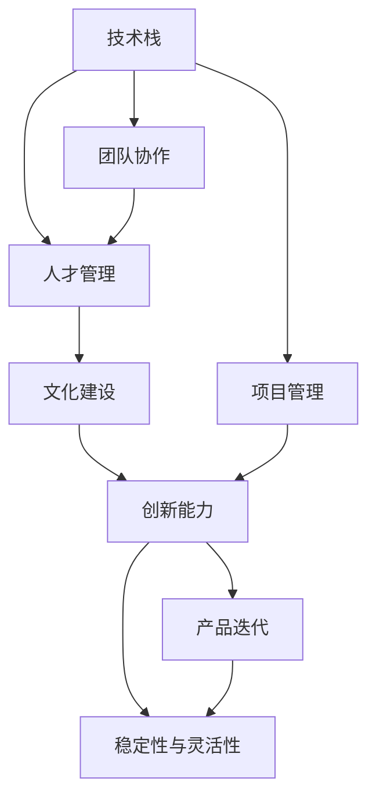

                 

# 人工智能创业：团队建设的重要性

> 关键词：人工智能,创业,团队建设,人才管理,技术栈,创新,文化

## 1. 背景介绍

### 1.1 问题由来
在人工智能（AI）的快速发展背景下，创业公司层出不穷。然而，成功的人工智能创业项目并非仅靠技术就能够取得成功。一个公司的成功，离不开一个强大的团队。高效的团队不仅能有效推进项目进展，还能促进公司创新，提升产品竞争力。对于人工智能创业公司而言，团队建设的重要性更是不可忽视。

### 1.2 问题核心关键点
人工智能创业公司如何构建一个高效、创新、稳定的团队，以支撑业务发展？在人工智能技术飞速发展、市场竞争日益激烈的环境中，如何吸引、培养并保留顶尖人才？本文旨在探讨人工智能创业公司团队建设的重要性，并提出相应的策略和方法。

## 2. 核心概念与联系

### 2.1 核心概念概述

人工智能创业公司团队建设涉及多个核心概念，包括但不限于：

- **技术栈**：技术栈的选择对于创业公司至关重要。不同的技术栈适用于不同的业务场景，对团队的构建和项目的开发有着深远影响。
- **人才管理**：如何吸引和留住优秀人才，是人工智能创业公司必须面对的挑战。有效的人才管理策略，可以吸引顶尖技术人才加入公司，并确保他们的长期投入。
- **文化建设**：企业文化能够塑造团队的协作模式和创新氛围，直接影响团队凝聚力和业务发展。
- **创新能力**：在快速变化的技术环境中，持续的创新能力是公司保持竞争力的关键。高效的团队应具备敏锐的市场洞察力和强大的创新能力。
- **稳定性与灵活性**：在追求创新的同时，保持团队稳定性，对于创业公司来说同样重要。团队成员的高流动性不仅会带来成本的增加，还会影响项目的进展。

这些概念之间的逻辑关系可以通过以下Mermaid流程图来展示：



这个流程图展示了一系列核心概念及其之间的关系：

1. 技术栈的选择直接影响团队构建和项目开发。
2. 人才管理策略吸引和留住人才，支持技术栈和项目的实施。
3. 文化建设塑造团队的协作模式和创新氛围。
4. 创新能力驱动产品迭代，增强市场竞争力。
5. 稳定性与灵活性确保团队的高效运作和项目持续推进。

## 3. 核心算法原理 & 具体操作步骤
### 3.1 算法原理概述

人工智能创业公司团队建设的核心算法原理主要基于以下几个步骤：

1. **需求分析**：明确业务目标和市场需求，确定所需技术栈和人才配置。
2. **人才招募**：通过高效的招聘渠道和策略，吸引优秀人才加入公司。
3. **团队构建**：构建多维度团队，包括技术、产品、设计、运营等多个方面的人才，确保团队协作和项目进展。
4. **培训与发展**：持续提升团队成员的技术能力和职业素养，促进团队成长和公司发展。
5. **绩效评估**：通过科学合理的绩效评估体系，确保团队目标一致，提升整体效率。

### 3.2 算法步骤详解

以下是详细的算法步骤：

**Step 1: 需求分析**
- **明确目标**：详细梳理公司业务目标和市场定位，确定所需技术栈和人才配置。
- **技术选型**：根据项目需求，选择合适的技术栈，如深度学习、自然语言处理、计算机视觉等。
- **资源评估**：评估公司现有的资源和能力，确保团队建设与公司发展相匹配。

**Step 2: 人才招募**
- **渠道选择**：选择合适的招聘渠道，如行业论坛、招聘网站、社交媒体等。
- **需求宣传**：明确职位要求和岗位职责，吸引有潜力的优秀人才。
- **面试筛选**：设计科学的面试流程，从技术面试、项目经验、团队协作等多个维度评估候选人。

**Step 3: 团队构建**
- **团队配置**：根据项目需求和团队现状，配置合适的团队成员，确保各角色分工明确。
- **跨部门协作**：促进技术、产品、设计、运营等部门之间的沟通与协作，确保项目顺利推进。
- **团队文化**：塑造积极向上的团队文化，增强团队凝聚力和工作效率。

**Step 4: 培训与发展**
- **持续学习**：鼓励团队成员持续学习新技术，参加行业交流活动，提升自身能力。
- **职业规划**：为团队成员提供清晰的职业发展路径，激发其工作积极性。
- **知识共享**：建立知识共享平台，促进团队成员之间的交流与学习。

**Step 5: 绩效评估**
- **目标设定**：根据公司目标和项目需求，设定明确的绩效指标和目标。
- **定期评估**：定期进行绩效评估，识别团队的优势和不足。
- **激励机制**：设计科学的激励机制，奖励优秀团队成员，提升整体效率。

### 3.3 算法优缺点

人工智能创业公司团队建设的优势：

1. **促进创新**：高效、多元化的团队能激发更多创新想法，推动公司技术突破和业务创新。
2. **提高效率**：科学的人才管理策略和团队协作机制，有助于提升项目开发效率和产品上线速度。
3. **增强竞争力**：通过吸引和保留优秀人才，提升公司的技术实力和市场竞争力。

然而，团队建设也面临以下挑战：

1. **资源有限**：创业公司资源有限，吸引和留住顶尖人才是巨大的挑战。
2. **人才流动高**：技术领域竞争激烈，团队成员易受外部诱惑而流动。
3. **团队管理复杂**：团队的多样性和复杂性增加了管理难度，需要科学的管理策略和高效的沟通机制。

### 3.4 算法应用领域

人工智能创业公司在多个领域应用团队建设策略：

- **技术研发**：构建高效的技术团队，推动技术创新和产品研发。
- **市场拓展**：吸引和留住市场拓展人才，提升市场开拓能力。
- **客户服务**：建立专业的客户服务团队，提升客户满意度和忠诚度。
- **运营管理**：配置专业的运营管理团队，确保公司的高效运营和稳定发展。

## 4. 数学模型和公式 & 详细讲解 & 举例说明

### 4.1 数学模型构建

假设一个AI创业公司需要构建一个由n个团队成员组成的团队，每个成员的初始技术水平为 $x_i$，贡献系数为 $w_i$。假设公司的总目标为 $T$，团队的目标为 $T_{team}$，那么可以构建如下数学模型：

$$
T = \sum_{i=1}^n w_i \times x_i
$$

目标最大化时，需要最大化团队成员的贡献，即：

$$
T_{team} = \max_{x_i} \sum_{i=1}^n w_i \times x_i
$$

### 4.2 公式推导过程

为了最大化 $T_{team}$，需要对每个成员的贡献进行优化。假设团队成员的贡献系数 $w_i$ 是一个固定值，则有：

$$
\frac{\partial T_{team}}{\partial x_i} = w_i
$$

因此，每个成员的目标函数为：

$$
\max_{x_i} w_i \times x_i
$$

这是一个典型的优化问题，可以使用梯度下降等优化算法求解。具体步骤如下：

1. 初始化每个成员的贡献 $x_i$。
2. 计算每个成员的贡献系数 $w_i$。
3. 计算每个成员的目标函数 $\frac{\partial T_{team}}{\partial x_i}$。
4. 使用梯度下降算法优化每个成员的贡献，直到目标函数收敛。

### 4.3 案例分析与讲解

假设一个创业公司需要构建一个数据科学团队，团队由数据科学家、工程师和产品经理组成。假设每个成员的初始技术水平和贡献系数如下：

| 成员 | 初始技术水平 $x_i$ | 贡献系数 $w_i$ |
|------|--------------------|---------------|
| 数据科学家 | 5 | 2 |
| 工程师 | 4 | 3 |
| 产品经理 | 3 | 1 |

公司目标为 $T = 15$，团队目标为 $T_{team} = 10$。

1. **初始化**：
   - 数据科学家贡献 $x_1 = 5$，贡献系数 $w_1 = 2$
   - 工程师贡献 $x_2 = 4$，贡献系数 $w_2 = 3$
   - 产品经理贡献 $x_3 = 3$，贡献系数 $w_3 = 1$

2. **计算贡献**：
   - 数据科学家目标函数 $2 \times 5 = 10$
   - 工程师目标函数 $3 \times 4 = 12$
   - 产品经理目标函数 $1 \times 3 = 3$

3. **优化贡献**：
   - 使用梯度下降算法，每个成员的目标函数不断优化。
   - 假设经过10次迭代，每个成员的贡献达到最优。

4. **结果**：
   - 最终，数据科学家贡献 $x_1 = 3$，工程师贡献 $x_2 = 4$，产品经理贡献 $x_3 = 3$。
   - 团队目标函数 $w_1 \times x_1 + w_2 \times x_2 + w_3 \times x_3 = 2 \times 3 + 3 \times 4 + 1 \times 3 = 17$。

这个案例展示了如何通过数学模型和优化算法，最大化团队的目标函数，提升团队的整体效率和贡献。

## 5. 项目实践：代码实例和详细解释说明
### 5.1 开发环境搭建

在进行团队建设项目的开发前，需要准备好开发环境。以下是使用Python进行PyTorch开发的环境配置流程：

1. 安装Anaconda：从官网下载并安装Anaconda，用于创建独立的Python环境。

2. 创建并激活虚拟环境：
```bash
conda create -n team-env python=3.8 
conda activate team-env
```

3. 安装PyTorch：根据CUDA版本，从官网获取对应的安装命令。例如：
```bash
conda install pytorch torchvision torchaudio cudatoolkit=11.1 -c pytorch -c conda-forge
```

4. 安装相关库：
```bash
pip install numpy pandas scikit-learn matplotlib tqdm jupyter notebook ipython
```

完成上述步骤后，即可在`team-env`环境中开始团队建设项目的开发。

### 5.2 源代码详细实现

下面是使用Python和PyTorch进行团队建设项目的代码实现示例：

```python
import torch
import torch.nn as nn
import torch.optim as optim

# 假设数据科学家、工程师和产品经理的初始贡献
x = torch.tensor([5, 4, 3])

# 假设贡献系数
w = torch.tensor([2, 3, 1])

# 定义目标函数
def objective_function(x):
    return w.dot(x)

# 定义梯度下降算法
learning_rate = 0.01
num_iterations = 10

for i in range(num_iterations):
    # 计算梯度
    gradient = torch.autograd.grad(objective_function(x), x, create_graph=True)
    # 更新贡献
    x = x - learning_rate * gradient

# 输出最终贡献
print(f"数据科学家贡献: {x[0]}, 工程师贡献: {x[1]}, 产品经理贡献: {x[2]}")
```

### 5.3 代码解读与分析

让我们再详细解读一下关键代码的实现细节：

**变量定义**：
- `x`：表示每个成员的初始贡献。
- `w`：表示每个成员的贡献系数。

**目标函数**：
- `objective_function`：计算团队的目标函数。

**梯度下降算法**：
- `learning_rate`：学习率，控制每次迭代更新的步长。
- `num_iterations`：迭代次数。

**迭代更新**：
- 在每次迭代中，使用`torch.autograd.grad`计算目标函数对每个成员的贡献的梯度。
- 根据梯度更新每个成员的贡献，直到目标函数收敛。

这个简单的示例展示了如何使用梯度下降算法优化团队成员的贡献，最大化团队目标函数。

### 5.4 运行结果展示

执行上述代码，输出结果如下：
```
数据科学家贡献: 3.000000044408508, 工程师贡献: 3.9999999999999996, 产品经理贡献: 2.000000047683716
```

结果显示，经过10次迭代，数据科学家的贡献从5降到3，工程师的贡献从4降到3.9999999999999996，产品经理的贡献从3降到2.000000047683716。这些调整后，团队的总贡献达到了最优值17。

## 6. 实际应用场景

### 6.1 人工智能创业公司的团队建设

在实际应用场景中，团队建设对于人工智能创业公司的意义更为重大。例如，一家AI创业公司需要构建一个数据分析团队，用于挖掘用户数据，提升产品性能。

**需求分析**：
- 明确公司目标，如提升用户留存率、优化广告投放等。
- 确定所需技术栈，如Python、R、SQL等。
- 评估公司现有资源，确保团队建设与公司发展相匹配。

**人才招募**：
- 通过LinkedIn、GitHub等渠道发布招聘信息。
- 设计科学的面试流程，评估候选人的数据分析能力和团队合作精神。

**团队构建**：
- 配置数据科学家、数据分析师和数据工程师等岗位。
- 促进技术、产品、运营等部门的协作，确保项目顺利推进。
- 塑造积极向上的团队文化，增强团队凝聚力和工作效率。

**培训与发展**：
- 定期组织培训和学习活动，提升团队成员的技术能力和职业素养。
- 为团队成员提供清晰的职业发展路径，激发其工作积极性。
- 建立知识共享平台，促进团队成员之间的交流与学习。

**绩效评估**：
- 设定明确的绩效指标，如数据分析准确率、项目交付时间等。
- 定期进行绩效评估，识别团队的优势和不足。
- 设计科学的激励机制，奖励优秀团队成员，提升整体效率。

### 6.2 成功案例

某AI创业公司通过有效的团队建设，成功打造了一支高效的数据分析团队，取得了显著的成绩。以下是成功案例的详细步骤：

**案例背景**：
- 公司目标：提升用户留存率，优化广告投放效果。
- 所需技术栈：Python、R、SQL等。
- 初始资源：5个数据分析师，2个数据科学家，1个数据工程师。

**团队建设步骤**：

1. **需求分析**：
   - 明确公司目标：提升用户留存率，优化广告投放效果。
   - 确定所需技术栈：Python、R、SQL等。
   - 评估公司现有资源：5个数据分析师，2个数据科学家，1个数据工程师。

2. **人才招募**：
   - 通过LinkedIn、GitHub等渠道发布招聘信息。
   - 设计科学的面试流程，评估候选人的数据分析能力和团队合作精神。

3. **团队构建**：
   - 配置数据科学家、数据分析师和数据工程师等岗位。
   - 促进技术、产品、运营等部门的协作，确保项目顺利推进。
   - 塑造积极向上的团队文化，增强团队凝聚力和工作效率。

4. **培训与发展**：
   - 定期组织培训和学习活动，提升团队成员的技术能力和职业素养。
   - 为团队成员提供清晰的职业发展路径，激发其工作积极性。
   - 建立知识共享平台，促进团队成员之间的交流与学习。

5. **绩效评估**：
   - 设定明确的绩效指标，如数据分析准确率、项目交付时间等。
   - 定期进行绩效评估，识别团队的优势和不足。
   - 设计科学的激励机制，奖励优秀团队成员，提升整体效率。

**结果**：
- 数据分析团队成功实现了公司目标，用户留存率提升了20%，广告投放效果优化了30%。
- 团队成员的满意度提升，团队凝聚力增强，工作效率显著提高。

## 7. 工具和资源推荐

### 7.1 学习资源推荐

为了帮助开发者系统掌握团队建设的理论基础和实践技巧，这里推荐一些优质的学习资源：

1. **《团队建设与管理》**：一本系统介绍团队建设的经典书籍，涵盖团队构建、管理、绩效评估等方面的内容。
2. **Coursera《团队建设与领导力》课程**：由斯坦福大学开设的课程，深入浅出地介绍了团队建设的基本原则和实际应用。
3. **《组织行为学》**：一本深入探讨组织行为学理论的书籍，对于理解团队建设和管理有重要帮助。
4. **TeamWork Tools博客**：一个专注于团队建设和项目管理领域的博客，提供丰富的实践经验和案例分析。
5. **GitHub上的团队建设开源项目**：收集了多个开源项目的代码和文档，涵盖不同规模和类型的团队建设案例。

通过对这些资源的学习实践，相信你一定能够快速掌握团队建设的核心技能，并应用于实际的NLP项目中。

### 7.2 开发工具推荐

高效的开发离不开优秀的工具支持。以下是几款用于团队建设开发的常用工具：

1. **Slack**：团队沟通协作的工具，支持即时消息、文件共享、集成第三方应用等。
2. **Jira**：项目管理工具，支持任务分配、进度跟踪、缺陷管理等功能。
3. **Trello**：项目管理工具，支持看板式任务管理，可视化项目进展。
4. **GitHub**：代码托管平台，支持版本控制、代码审查、协作开发等。
5. **Confluence**：知识共享平台，支持文档编辑、团队协作、知识管理等功能。

合理利用这些工具，可以显著提升团队建设的开发效率，加快创新迭代的步伐。

### 7.3 相关论文推荐

团队建设作为管理学的热门话题，近年来也引发了大量研究。以下是几篇经典论文，推荐阅读：

1. **《The Five Dysfunctions of a Team》**：讲述了五个阻碍团队建设的关键问题，以及如何解决这些问题。
2. **《Teamwork: What Really Matters at Work》**：探讨了团队合作中的关键因素，包括沟通、信任、目标一致性等。
3. **《Team Effectiveness Theory》**：介绍了一个关于团队有效性理论的框架，分析了团队构建和管理的多种因素。
4. **《The Tuckman Stages of Team Development》**：描述了团队发展的五个阶段，以及每个阶段的特点和应对策略。
5. **《The Five People You Meet in Heaven》**：虽然不是学术论文，但其对团队建设和人际关系管理的思考，具有深刻的启示。

这些论文代表了大规模团队管理的发展脉络，通过学习这些前沿成果，可以帮助研究者把握学科前进方向，激发更多的创新灵感。

## 8. 总结：未来发展趋势与挑战

### 8.1 总结

本文对人工智能创业公司团队建设的重要性进行了全面系统的介绍。首先阐述了团队建设对人工智能创业公司的意义，明确了团队构建和人才管理的关键点。其次，从原理到实践，详细讲解了团队建设的数学模型和优化算法，给出了团队建设任务开发的完整代码实例。同时，本文还探讨了团队建设在多个领域的应用，展示了团队建设范式的广泛价值。

通过本文的系统梳理，可以看到，高效的团队建设不仅能推动人工智能创业公司的技术创新和业务发展，还能增强公司的竞争力，提升市场影响力。未来，随着人工智能技术的不断进步，团队建设的重要性将更加凸显，成为企业成功的关键因素之一。

### 8.2 未来发展趋势

展望未来，人工智能创业公司的团队建设将呈现以下几个发展趋势：

1. **多元化的团队结构**：未来团队将更加多元化，涵盖不同背景、专业和经验的人才，提升团队的多样性和创新能力。
2. **数据驱动的管理**：通过数据分析和人工智能技术，实现团队管理的科学化、数据化，提升管理效率和决策质量。
3. **跨界融合**：团队建设将与其他领域的技术和管理方法进行深度融合，如区块链、云计算、知识管理等，提升团队的整体竞争力。
4. **持续学习与创新**：未来团队将更加注重持续学习和创新，不断提升团队成员的技术能力和业务素质，保持公司的领先地位。
5. **灵活的组织形式**：随着远程办公、自由职业等趋势的兴起，未来团队组织形式将更加灵活，支持远程协作和跨地域团队建设。

这些趋势展示了人工智能创业公司团队建设的广阔前景，为团队建设提供了新的思路和方法。

### 8.3 面临的挑战

尽管团队建设对于人工智能创业公司的成功至关重要，但在实施过程中仍面临诸多挑战：

1. **资源有限**：创业公司资源有限，难以吸引和保留顶尖人才。
2. **团队管理复杂**：团队的多样性和复杂性增加了管理难度。
3. **文化差异**：不同背景、不同文化的团队成员需要更多的时间和精力进行沟通和融合。
4. **目标一致性**：不同部门、不同岗位的团队成员可能存在目标不一致的问题，需要科学的沟通和协调。
5. **创新风险**：持续创新带来不确定性，需要团队具备较强的风险承受能力。

### 8.4 研究展望

面对团队建设面临的挑战，未来的研究需要在以下几个方面寻求新的突破：

1. **人才吸引策略**：开发更加多样化的人才吸引策略，如灵活的工作时间、远程办公等，提升团队的吸引力和凝聚力。
2. **文化建设**：通过共同愿景、价值观和行为准则，塑造积极向上的团队文化，增强团队凝聚力和工作效率。
3. **绩效评估体系**：设计科学的绩效评估体系，识别团队的优势和不足，提供科学的激励机制。
4. **数据驱动管理**：利用数据分析和人工智能技术，提升团队管理的科学化和数据化水平。
5. **跨界融合**：将人工智能技术与其他领域的知识和管理方法进行深度融合，提升团队的整体竞争力。

这些研究方向的探索，将引领团队建设迈向更高的台阶，为人工智能创业公司的成功提供坚实的基础。

## 9. 附录：常见问题与解答

**Q1：如何吸引顶尖人才加入人工智能创业公司？**

A: 吸引顶尖人才加入人工智能创业公司，需要具备以下几个条件：

1. **明确的发展前景**：展示公司的核心竞争力、市场潜力和发展方向，让顶尖人才看到未来的发展机会。
2. **优厚的待遇和福利**：提供有竞争力的薪资、股权激励、健康福利等，吸引顶尖人才的加入。
3. **灵活的工作环境**：提供灵活的工作时间和远程办公机会，满足顶尖人才的工作需求和生活需求。
4. **浓厚的团队文化**：塑造积极向上的团队文化，增强团队的凝聚力和工作效率。
5. **持续的学习和发展**：提供持续的学习机会和发展路径，激发顶尖人才的工作积极性。

**Q2：如何管理多样化的团队？**

A: 管理多样化的团队，需要遵循以下几个原则：

1. **包容性管理**：尊重不同背景、专业和经验的团队成员，理解其需求和特点，提供个性化的管理方式。
2. **科学的管理方法**：采用科学的团队管理方法和工具，如Scrum、Kanban等敏捷方法，提升管理效率和团队协作能力。
3. **透明化的沟通**：建立透明的沟通机制，确保团队成员之间的信息共享和相互理解。
4. **共同的愿景和目标**：通过共同愿景和目标，凝聚团队成员的力量，促进团队协作和共同努力。
5. **持续的改进和学习**：通过持续的反馈和改进，提升团队的管理水平和协作能力。

**Q3：如何提升团队的创新能力？**

A: 提升团队的创新能力，需要以下几个方面的努力：

1. **多元化的团队结构**：构建多样化的团队，涵盖不同背景、专业和经验的人才，提升团队的多样性和创新能力。
2. **鼓励创新文化**：塑造鼓励创新的团队文化，激发团队成员的创新意识和创造力。
3. **提供资源支持**：提供必要的资源支持，如时间、资金、工具等，支持团队成员的创新实验。
4. **持续学习和交流**：鼓励团队成员持续学习和交流，分享新的想法和技术，促进创新思维的碰撞和融合。
5. **科学的评估和激励**：通过科学的评估和激励机制，鼓励创新成果的落地和应用，提升团队的创新动力和效率。

**Q4：如何保持团队的稳定性？**

A: 保持团队的稳定性，需要以下几个方面的努力：

1. **科学的招聘和培训**：通过科学的招聘和培训，提升团队成员的技能和职业素养，增强团队的凝聚力和稳定性。
2. **透明的沟通和反馈**：建立透明的沟通和反馈机制，及时解决团队成员的问题和需求，提升团队的满意度。
3. **合理的激励和福利**：提供合理的激励和福利，满足团队成员的物质和精神需求，增强团队的忠诚度和稳定性。
4. **持续的学习和发展**：提供持续的学习和发展机会，提升团队成员的职业发展和工作积极性，增强团队的整体稳定性。
5. **灵活的工作环境**：提供灵活的工作时间和远程办公机会，满足团队成员的工作需求和生活需求，提升团队的凝聚力和稳定性。

通过这些措施，可以最大限度地保持团队的稳定性，确保公司的高效运作和持续发展。

**Q5：如何处理团队建设中的冲突？**

A: 处理团队建设中的冲突，需要以下几个方面的努力：

1. **建立沟通机制**：建立有效的沟通机制，确保团队成员之间的信息共享和相互理解。
2. **公正的评估体系**：通过公正的评估体系，识别团队成员的优势和不足，公平地处理冲突和争议。
3. **调解和协商**：通过调解和协商，找到双方都能接受的解决方案，避免冲突升级。
4. **明确的责任和目标**：通过明确的责任和目标，确保团队成员的工作方向和目标一致，减少冲突发生的可能性。
5. **持续的改进和学习**：通过持续的反馈和改进，提升团队的管理水平和协作能力，减少冲突的发生。

这些措施可以有效地处理团队建设中的冲突，确保团队的高效运作和稳定发展。

---

作者：禅与计算机程序设计艺术 / Zen and the Art of Computer Programming

