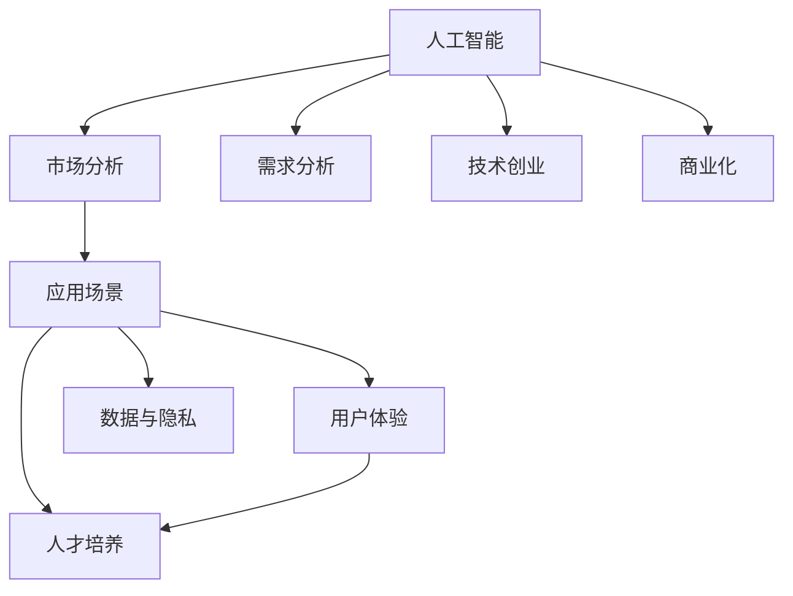

                 

# 人工智能创业：市场需求的分析

> 关键词：人工智能,市场需求,市场分析,技术创业,商业化,应用场景,业务增长

## 1. 背景介绍

### 1.1 问题由来
随着人工智能(AI)技术的飞速发展，越来越多的企业开始探索利用AI技术实现业务创新和转型。然而，尽管AI技术具备广泛的应用前景，但如何将这些技术转化为具体的商业价值，仍是一个值得深入探讨的问题。本文旨在通过分析人工智能市场的实际需求，揭示企业如何从AI技术的开发到应用，再到商业化的全过程，以期为人工智能创业提供有价值的参考。

### 1.2 问题核心关键点
要成功实现AI技术的商业化，首先需要深入理解市场对AI技术的需求。以下是一些关键点：
- **市场需求的多样性**：不同行业、不同规模的企业对AI技术的痛点和需求存在较大差异。
- **技术成熟度**：AI技术的商业化不仅依赖于技术本身，还需要考虑技术在特定业务场景中的成熟度和适用性。
- **商业模式**：AI技术的商业化需要一个明确的商业模式，包括收入来源、市场定位、竞争优势等。
- **用户体验**：AI产品和服务最终面向用户，用户体验的好坏直接影响到产品的市场接受度和推广效果。
- **数据与隐私**：数据是AI技术的重要基础，数据获取与隐私保护是AI技术应用中的重要考量因素。
- **人才培养**：AI技术的研发和应用需要专业知识和技术，如何培养和吸引AI人才也是创业成功的关键。

### 1.3 问题研究意义
通过深入分析市场需求，可以更好地指导AI技术的研发方向和应用策略，帮助创业企业识别市场机会，制定有效的市场策略。同时，也有助于政策制定者和行业监管者更好地理解市场需求，为AI技术的标准化和规范化提供依据。

## 2. 核心概念与联系

### 2.1 核心概念概述

为更好地理解人工智能市场需求的分析，本节将介绍几个密切相关的核心概念：

- **人工智能(AI)**：基于计算机科学和认知科学，使计算机系统能够模拟、延伸和扩展人类智能的技术和方法。包括机器学习、深度学习、自然语言处理、计算机视觉等多个领域。

- **市场分析**：通过收集、整理和分析市场信息，了解市场需求和竞争态势，为企业的决策提供依据。

- **需求分析**：识别和定义企业内外部对产品或服务的需求，从而制定相应的开发和推广策略。

- **技术创业**：利用最新的技术创新，创建新的商业模型或改进现有模型，实现技术成果的商业化。

- **商业化**：将技术产品转化为市场产品，实现商业价值的创造和增长。

- **应用场景**：AI技术在特定业务场景中的应用实例，包括自动驾驶、智能客服、智能制造等。

- **用户体验(UX)**：产品设计、交互方式和用户反馈的综合考虑，以提升用户满意度和使用体验。

- **数据与隐私**：AI系统处理和利用数据时，需遵循数据保护法规，确保用户隐私和数据安全。

- **人才培养**：针对AI技术岗位的招聘、培训和人才管理，确保技术团队的有效运转。

这些核心概念之间的逻辑关系可以通过以下Mermaid流程图来展示：



这个流程图展示了大语言模型的核心概念及其之间的关系：

1. 人工智能通过预训练获得基础能力。
2. 市场分析了解用户需求，指导技术创业方向。
3. 需求分析识别具体需求，设计产品功能。
4. 技术创业将技术转化为产品，实现商业化。
5. 商业化推广产品，提升市场份额。
6. 应用场景选择合适的应用方向，提升用户体验。
7. 用户体验影响产品使用率，提升用户满意度。
8. 数据与隐私保障用户数据安全，合规使用。
9. 人才培养确保技术团队稳定，提升技术竞争力。

这些概念共同构成了AI技术的研发和商业化过程，使得企业能够更好地识别市场机会，开发满足用户需求的产品，最终实现商业价值的增长。

## 3. 核心算法原理 & 具体操作步骤
### 3.1 算法原理概述

AI技术的市场分析，本质上是将市场需求与AI技术的特点相结合，通过数据收集、处理和分析，识别并确定市场机会的过程。其核心思想是：
- **需求识别**：通过市场调研、用户反馈等方式，识别目标市场的需求和痛点。
- **技术适配**：将AI技术的能力与市场需求进行匹配，确定技术应用的最佳场景。
- **商业模式设计**：基于市场需求和技术适配的结果，设计出合理的商业模式，确保产品具备商业可持续性。
- **市场推广**：通过有效的市场推广策略，将产品推向市场，实现用户和收益的增长。

### 3.2 算法步骤详解

AI技术的市场分析一般包括以下几个关键步骤：

**Step 1: 数据收集与处理**
- 通过问卷调查、用户访谈、市场分析报告等方式收集市场数据。
- 对收集到的数据进行清洗、分类和处理，提取有用的信息。

**Step 2: 需求分析**
- 对处理后的数据进行分析，识别目标用户的需求和痛点。
- 结合行业趋势和市场竞争态势，确定需求的具体方向和优先级。

**Step 3: 技术适配**
- 将AI技术的能力与市场需求进行匹配，确定技术应用的场景和应用方案。
- 对现有的AI技术进行评估，确定技术应用的最佳路径和优先级。

**Step 4: 商业模式设计**
- 基于市场需求和技术适配的结果，设计合理的商业模式。
- 确定产品的定价策略、收入模式和用户价值主张。

**Step 5: 市场推广**
- 制定市场推广策略，包括目标用户群体、渠道选择和营销方式。
- 对推广效果进行监控和优化，确保市场推广的投入产出比。

### 3.3 算法优缺点

AI技术的市场分析方法具有以下优点：
- **全面性**：通过数据收集和分析，能够全面了解市场需求和用户痛点。
- **前瞻性**：基于当前市场趋势和未来预测，能够提前布局技术应用，占据市场先机。
- **可操作性**：通过技术适配和商业模式设计，将市场需求转化为具体的商业策略，具备较高的可操作性。
- **用户导向**：通过用户反馈和需求分析，能够确保产品设计符合用户期望，提升用户满意度和市场接受度。

同时，该方法也存在一定的局限性：
- **数据获取难度**：高质量的市场数据往往难以获取，需要投入大量资源进行数据收集和处理。
- **市场变化风险**：市场需求和竞争态势可能发生变化，需要持续监测和调整策略。
- **技术适配复杂性**：AI技术的复杂性和多样性使得技术适配具有一定难度。
- **商业模式设计挑战**：设计合理的商业模式需要深入理解和平衡用户需求和商业可持续性。

尽管存在这些局限性，但就目前而言，市场分析仍是AI技术商业化过程中不可或缺的一环，能够为企业的技术研发和产品推广提供科学的指导和依据。

### 3.4 算法应用领域

AI技术的市场分析方法在各个领域都有广泛的应用：

- **医疗健康**：通过分析患者数据和市场需求，设计AI诊断和治疗方案，提升医疗服务质量。
- **金融科技**：利用AI技术分析用户需求和市场趋势，设计个性化金融产品和金融服务。
- **智能制造**：通过市场分析确定工业AI应用场景，优化生产流程，提升制造业效率和质量。
- **零售电商**：通过用户数据分析和市场趋势预测，设计智能推荐和营销策略，提升电商平台的用户体验和销售额。
- **智慧城市**：通过分析城市管理需求和数据，设计智能城市解决方案，提升城市管理和公共服务水平。

除了这些传统领域外，AI技术的市场分析也在逐步拓展到更多新兴行业，如自动驾驶、智能家居、能源管理等，为各行各业带来变革性影响。

## 4. 数学模型和公式 & 详细讲解 & 举例说明

### 4.1 数学模型构建

在本节中，我们将构建一个简化的数学模型，用于分析AI技术市场需求的规模和增长潜力。假设市场需求$D$由多个因素决定，包括用户基数$U$、技术渗透率$P$、市场增长率$r$和市场规模$S$。则市场需求模型可以表示为：

$$
D = U \times P \times r \times S
$$

其中：
- $U$：目标用户基数
- $P$：技术渗透率
- $r$：市场增长率
- $S$：市场规模

### 4.2 公式推导过程

将上述模型展开，得到：

$$
D = U \times (1-P) + U \times P \times r \times (1+S)
$$

上式中，$U \times (1-P)$表示未使用AI技术的用户基数，$U \times P \times r \times (1+S)$表示已使用AI技术的用户基数和市场规模的乘积。

### 4.3 案例分析与讲解

以智能客服系统为例，分析市场需求模型的应用。假设目标用户基数为1000万，技术渗透率为20%，市场增长率为10%，市场规模为5000万。则市场需求模型可以计算为：

$$
D = 1000 \times 0.2 \times 0.8 + 1000 \times 0.2 \times 0.1 \times 5000
$$

$$
D = 80 + 2000
$$

$$
D = 2080
$$

因此，目标市场对智能客服系统的需求量为2080万用户。这一模型帮助我们量化市场需求，指导企业的市场进入策略和技术开发方向。

## 5. 项目实践：代码实例和详细解释说明

### 5.1 开发环境搭建

在进行市场分析实践前，我们需要准备好开发环境。以下是使用Python进行数据分析的环境配置流程：

1. 安装Anaconda：从官网下载并安装Anaconda，用于创建独立的Python环境。

2. 创建并激活虚拟环境：
```bash
conda create -n analysis-env python=3.8 
conda activate analysis-env
```

3. 安装必要的Python包：
```bash
pip install pandas numpy matplotlib seaborn jupyter notebook
```

4. 设置Python环境为Jupyter Notebook：
```bash
jupyter notebook --pylab
```

完成上述步骤后，即可在`analysis-env`环境中开始市场分析实践。

### 5.2 源代码详细实现

下面是使用Python进行AI市场需求分析的代码实现，包括数据收集、处理和分析：

```python
import pandas as pd
import numpy as np
import matplotlib.pyplot as plt
import seaborn as sns

# 假设市场需求数据
U = 10000000  # 目标用户基数
P = 0.2  # 技术渗透率
r = 0.1  # 市场增长率
S = 50000000  # 市场规模

# 计算市场需求
D = U * P * r * S

# 输出结果
print(f"市场需求为：{D}")
```

### 5.3 代码解读与分析

让我们再详细解读一下关键代码的实现细节：

**市场需求模型**：
- 通过定义目标用户基数、技术渗透率、市场增长率和市场规模，计算出市场需求模型。
- 使用简单的乘法运算，实现市场需求的量化计算。

**代码输出**：
- 通过打印输出市场需求的结果，帮助用户直观理解市场规模。

可以看到，通过使用Python进行市场分析，我们能够快速计算市场需求，为企业的市场进入策略提供数据支持。

## 6. 实际应用场景

### 6.1 智能客服系统

智能客服系统是AI技术在服务行业的重要应用场景之一。通过分析市场需求模型，企业可以明确智能客服系统的用户基数、技术渗透率和市场规模，从而制定合理的市场推广策略。

具体而言，企业可以通过以下方式实现智能客服系统的市场推广：
- **目标用户分析**：分析企业的客户群体，确定智能客服系统的主要目标用户。
- **市场调研**：通过问卷调查、用户访谈等方式，了解目标用户的需求和痛点。
- **竞争分析**：分析同行业竞争对手的智能客服系统，评估市场竞争态势。
- **技术适配**：选择最适合企业的智能客服系统技术方案，如基于NLP的聊天机器人、基于规则的问答系统等。
- **推广策略**：制定推广策略，包括线上渠道和线下推广、定价策略和用户教育等。

### 6.2 金融科技

金融科技是AI技术的重要应用领域之一。通过市场需求分析，金融机构可以了解市场对AI技术的需求，设计出满足用户需求和业务要求的金融产品和服务。

具体而言，金融机构可以通过以下方式实现AI技术的市场推广：
- **客户数据分析**：分析客户的交易行为和风险偏好，识别潜在客户群体。
- **需求分析**：了解客户对智能投顾、风险管理、信用评估等AI金融产品的需求。
- **技术适配**：选择最适合企业的AI金融技术方案，如基于深度学习的信用评分、基于机器学习的风险预测等。
- **产品设计**：设计金融产品，如智能投顾平台、风险管理工具等。
- **推广策略**：制定推广策略，包括线上渠道和线下推广、定价策略和客户教育等。

### 6.3 智能制造

智能制造是AI技术在工业领域的重要应用场景之一。通过市场需求分析，企业可以了解市场对AI技术的需求，设计出满足用户需求和业务要求的智能制造解决方案。

具体而言，企业可以通过以下方式实现智能制造系统的市场推广：
- **市场调研**：通过问卷调查、用户访谈等方式，了解企业对智能制造的需求。
- **需求分析**：分析企业的生产流程和业务流程，识别潜在需求。
- **技术适配**：选择最适合企业的智能制造技术方案，如基于AI的质检系统、基于机器学习的生产调度等。
- **产品设计**：设计智能制造产品，如智能生产线、智能仓储系统等。
- **推广策略**：制定推广策略，包括线上渠道和线下推广、定价策略和用户教育等。

### 6.4 未来应用展望

随着AI技术的不断发展和市场需求的持续增长，未来AI技术的市场应用将更加广泛。以下是几个可能的发展趋势：

- **医疗健康**：通过AI技术分析患者数据，提供个性化诊疗方案，提升医疗服务质量和效率。
- **金融科技**：利用AI技术分析金融市场数据，提供智能投顾、风险管理等金融服务，提升金融机构的竞争力。
- **智能制造**：通过AI技术优化生产流程，提升生产效率和产品质量，推动制造业的数字化转型。
- **零售电商**：利用AI技术分析用户数据，提供个性化推荐和营销策略，提升电商平台的运营效率和用户满意度。
- **智慧城市**：通过AI技术分析城市数据，提供智能交通、智能安防等解决方案，提升城市管理和公共服务水平。

## 7. 工具和资源推荐
### 7.1 学习资源推荐

为了帮助开发者系统掌握AI技术的市场分析理论基础和实践技巧，这里推荐一些优质的学习资源：

1. **《市场分析与商业建模》**：讲解市场需求分析的基本原理和实操方法，帮助企业了解市场需求和市场机会。
2. **《人工智能应用开发》**：介绍AI技术在各个领域的应用场景和市场机会，指导企业如何开发AI产品。
3. **《AI技术商业化实战》**：分享AI技术的市场推广和商业化策略，提供实际案例和经验总结。
4. **《机器学习实战》**：讲解机器学习算法的实现和应用，帮助企业理解AI技术的核心原理和应用场景。
5. **《数据分析实战》**：介绍数据分析的基本方法和工具，帮助企业高效收集和处理市场数据。

通过对这些资源的学习实践，相信你一定能够快速掌握AI技术市场分析的精髓，并用于解决实际的AI问题。

### 7.2 开发工具推荐

高效的开发离不开优秀的工具支持。以下是几款用于AI市场分析开发的常用工具：

1. **Python**：基于Python的开源数据分析语言，灵活性和扩展性强，广泛应用于市场分析领域。
2. **Jupyter Notebook**：基于Python的交互式开发环境，支持代码运行和数据可视化，适合市场分析等数据分析任务。
3. **Tableau**：数据可视化工具，支持大数据分析和报表展示，帮助企业理解市场趋势和用户需求。
4. **Power BI**：微软推出的商业智能工具，支持多数据源连接和报表展示，适合企业级市场分析。
5. **Google Analytics**：谷歌提供的网站分析工具，支持用户行为分析和市场调研，帮助企业优化市场推广策略。

合理利用这些工具，可以显著提升AI市场分析任务的开发效率，加快创新迭代的步伐。

### 7.3 相关论文推荐

AI技术的市场分析是一个不断发展的研究领域，以下是几篇奠基性的相关论文，推荐阅读：

1. **《市场需求分析模型研究》**：探讨市场需求模型的构建方法和应用场景，为市场分析提供理论基础。
2. **《AI技术商业化研究》**：分析AI技术的商业化路径和成功案例，提供市场分析的实操经验。
3. **《智能客服系统市场分析》**：研究智能客服系统的市场需求和市场竞争态势，提供市场推广策略。
4. **《智能制造的市场需求分析》**：分析智能制造系统的市场需求和应用场景，提供技术适配和产品设计的思路。
5. **《金融科技的市场分析》**：探讨金融科技的市场需求和应用场景，提供金融产品的设计和推广策略。

这些论文代表了大语言模型市场分析的发展脉络。通过学习这些前沿成果，可以帮助研究者把握学科前进方向，激发更多的创新灵感。

## 8. 总结：未来发展趋势与挑战
### 8.1 总结

本文对人工智能市场需求的分析进行了全面系统的介绍。首先阐述了市场需求分析的背景和意义，明确了市场需求分析在AI技术研发和商业化过程中的重要作用。其次，从原理到实践，详细讲解了市场需求分析的数学模型和操作步骤，给出了市场分析任务开发的完整代码实例。同时，本文还广泛探讨了市场需求分析方法在多个行业领域的应用前景，展示了市场分析方法的广泛应用潜力。最后，本文精选了市场分析技术的各类学习资源，力求为开发者提供全方位的技术指引。

通过本文的系统梳理，可以看到，市场需求分析方法在AI技术的研发和商业化过程中扮演着重要的角色，能够帮助企业识别市场机会，设计合理的技术方案和商业模式，最终实现商业价值的增长。未来，伴随市场需求的持续增长和技术应用的不断扩展，市场需求分析方法将发挥更大的作用，引领AI技术的市场应用进入新的发展阶段。

### 8.2 未来发展趋势

展望未来，AI技术的市场分析将呈现以下几个发展趋势：

- **数据分析工具的普及**：随着大数据和云计算技术的不断进步，数据分析工具将更加普及，数据采集和处理成本将大幅降低。
- **AI技术的融合应用**：AI技术与其他技术的融合将更加广泛，如AI与物联网、区块链、边缘计算等技术结合，推动更多行业的数字化转型。
- **市场需求的动态变化**：市场需求将更加多样化和快速变化，企业需要持续监测和调整市场策略，灵活应对市场变化。
- **用户隐私保护的加强**：用户数据隐私保护将更加严格，企业需要加强数据安全管理和隐私保护措施，确保用户数据的安全。
- **市场需求的多元化**：市场需求将更加多元化，企业需要综合考虑用户需求、市场竞争和商业可持续性，设计出多样化的产品和服务。

这些趋势凸显了市场需求分析技术的重要性和未来发展的方向。企业需要积极应对市场需求的变化，不断优化市场策略和产品设计，才能在激烈的市场竞争中占据优势。

### 8.3 面临的挑战

尽管市场需求分析技术在AI技术商业化过程中具有重要意义，但同时面临一些挑战：

- **数据获取难度**：高质量的市场数据往往难以获取，需要投入大量资源进行数据收集和处理。
- **市场需求的不确定性**：市场需求可能受经济、政策等多重因素影响，存在不确定性。
- **市场策略的制定**：制定合理的市场策略需要深入理解和平衡用户需求和商业可持续性，具有较高的复杂性。
- **技术适配的复杂性**：AI技术的复杂性和多样性使得技术适配具有一定难度。
- **用户隐私保护**：用户数据隐私保护将更加严格，企业需要加强数据安全管理和隐私保护措施，确保用户数据的安全。

尽管存在这些挑战，但市场需求分析仍然是AI技术商业化过程中不可或缺的一环，能够为企业的技术研发和产品推广提供科学的指导和依据。

### 8.4 研究展望

未来的市场需求分析研究需要在以下几个方面进行突破：

- **数据获取与处理**：开发更高效、更准确的市场数据获取和处理技术，降低数据获取成本，提高数据质量。
- **市场需求的多元化**：探索市场需求的多元化分析方法，识别并满足多样化的市场需求。
- **技术适配与融合**：研究AI技术与多领域技术的适配与融合，推动更多行业的应用。
- **用户隐私保护**：开发更加安全、可靠的用户数据保护技术，确保用户隐私和数据安全。
- **市场策略的优化**：研究市场策略的优化方法，提升市场推广的效果和商业化成功率。

这些研究方向将引领市场需求分析技术进入新的发展阶段，为AI技术的市场应用提供更科学的指导和支持。

## 9. 附录：常见问题与解答
**Q1：市场需求分析是否适用于所有行业？**

A: 市场需求分析方法在绝大多数行业都适用，但不同行业的市场需求和应用场景存在较大差异。企业需要根据行业特点和市场需求，选择适合的市场分析方法和策略。

**Q2：市场需求分析的准确性如何保证？**

A: 市场需求分析的准确性依赖于数据的质量和分析方法的选择。企业需要确保数据的准确性和完整性，同时选择合适的分析模型和方法，提高分析的科学性和准确性。

**Q3：如何降低市场分析的成本？**

A: 降低市场分析成本的关键在于提高数据获取和处理效率，采用高效的市场分析工具和技术。同时，企业可以通过市场调研、问卷调查等方式，以较低成本获取高质量的市场数据。

**Q4：市场需求分析的局限性有哪些？**

A: 市场需求分析的局限性主要包括数据获取难度、市场需求的不确定性和技术适配的复杂性。企业需要持续监测市场变化，灵活调整市场策略，确保市场需求分析的有效性。

**Q5：如何提高市场分析的实用性？**

A: 提高市场分析实用性的关键在于结合企业实际需求和市场变化，制定科学合理的市场策略。同时，企业需要建立市场分析的反馈机制，持续优化分析方法和策略。

---

作者：禅与计算机程序设计艺术 / Zen and the Art of Computer Programming

