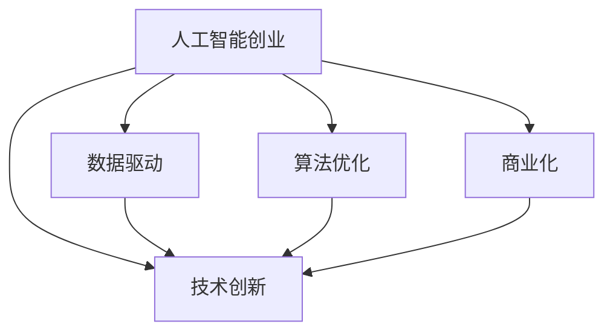

                 

# 人工智能创业：技术创新的策略

在当今信息科技飞速发展的时代，人工智能(AI)技术正逐渐成为引领新一轮科技革命和产业变革的关键力量。然而，将AI技术转化为商业价值，推动人工智能创业，并非易事。本文将深入探讨AI创业中的技术创新策略，结合实际案例，系统梳理AI创业的技术路径、商业模式、挑战与应对策略，为有志于在AI领域创业的朋友们提供实用的建议和启发。

## 1. 背景介绍

### 1.1 问题由来

随着深度学习、自然语言处理、计算机视觉等AI技术的不断突破，越来越多的AI应用在各行各业得到部署和应用，企业纷纷寻求AI赋能，提高业务效率和竞争优势。同时，由于AI技术专业性强、研发成本高、应用门槛高，因此在AI创业的过程中，如何实现技术创新，打造领先产品，是企业家们面临的重大挑战。

### 1.2 问题核心关键点

要成功进行AI创业，企业必须具备以下几点核心能力：

- 强大的技术研发能力：拥有技术领先的人工智能算法和模型，能够应对复杂的业务需求。
- 丰富的数据资源：拥有高质量、海量数据，能够持续推动模型优化和性能提升。
- 高效的商业化策略：具备将AI技术转化为实际业务的能力，形成有竞争力的产品和服务。
- 灵活的市场反应能力：能够快速适应市场变化，及时调整产品策略和技术方向。
- 卓越的团队协作能力：拥有跨学科、跨部门的顶尖人才团队，能够高效协同合作，快速解决问题。

本文将围绕这些关键点，深入探讨AI创业的技术创新策略。

## 2. 核心概念与联系

### 2.1 核心概念概述

为更好地理解AI创业中的技术创新策略，本节将介绍几个密切相关的核心概念：

- 人工智能创业：利用人工智能技术进行创业，打造创新产品和服务，提升企业竞争力的过程。
- 技术创新：通过研发新技术、新算法、新模型，提升产品性能，满足市场需求的过程。
- 数据驱动：利用数据进行决策和优化，优化模型和算法，提升产品性能。
- 算法优化：通过优化算法和模型，提高产品性能和效率的过程。
- 商业化：将技术转化为实际应用，形成商业模式的过程。

这些核心概念之间的逻辑关系可以通过以下Mermaid流程图来展示：



这个流程图展示了一些核心概念之间的关联关系：

1. 人工智能创业是技术创新的核心目标，旨在通过AI技术创新提升企业竞争力。
2. 数据驱动和算法优化是技术创新的基础手段，通过数据和算法不断优化模型和产品。
3. 商业化是将技术转化为实际应用，形成商业模式，为技术创新提供持续动力。

这些概念共同构成了AI创业中的技术创新框架，使得企业能够高效地进行技术研发和商业转化。

## 3. 核心算法原理 & 具体操作步骤
### 3.1 算法原理概述

AI创业中的技术创新，主要依赖于以下几个核心算法和原理：

- 深度学习算法：通过多层神经网络，从数据中学习特征表示，提升模型的性能和泛化能力。
- 自然语言处理技术：包括分词、命名实体识别、情感分析等，提升自然语言理解和生成能力。
- 计算机视觉技术：包括目标检测、图像分割、人脸识别等，提升图像处理和分析能力。
- 强化学习：通过试错学习，优化决策策略，提升智能决策和控制能力。
- 迁移学习：通过已有模型的知识，加速新模型的训练，提升模型泛化能力。

这些算法和原理通过不断优化和迭代，推动AI技术的持续创新和发展。

### 3.2 算法步骤详解

AI创业中的技术创新，一般遵循以下几个关键步骤：

**Step 1: 问题定义与数据收集**

- 明确业务需求和目标，定义需要解决的具体问题。
- 收集相关数据，包括文本、图像、视频等，为模型训练提供数据支持。

**Step 2: 模型设计与优化**

- 选择合适的算法和模型结构，进行初步的模型设计。
- 通过数据驱动的方式，对模型进行多轮训练和优化，提升模型性能。
- 应用正则化技术，如L2正则、Dropout等，防止模型过拟合。
- 应用迁移学习，利用已有模型的知识，加速新模型的训练。

**Step 3: 算法实验与验证**

- 通过多轮实验，验证模型在业务场景中的性能和效果。
- 通过对比不同算法和模型的性能，选择最优方案进行推广应用。

**Step 4: 产品实现与部署**

- 将优化后的模型集成到产品中，形成实际应用。
- 优化产品界面和用户体验，提升用户满意度。
- 部署模型到生产环境，确保系统稳定性和可靠性。

**Step 5: 持续改进与优化**

- 定期收集用户反馈和业务数据，进行持续改进和优化。
- 不断跟踪最新AI技术和算法，提升产品竞争力。

通过这些步骤，AI创业企业能够系统地进行技术创新，不断提升产品性能，满足市场和用户需求。

### 3.3 算法优缺点

AI创业中的技术创新方法，具有以下优点：

- 提升产品性能：通过不断优化算法和模型，提升产品性能和用户体验。
- 加速产品迭代：利用现有模型的知识，加速新模型的训练，提升产品迭代速度。
- 拓展应用场景：通过多种算法和技术的融合，拓展应用场景，提升产品竞争力。

同时，这些方法也存在一定的局限性：

- 研发成本高：AI技术的研发和部署需要大量资金和技术投入。
- 人才需求高：需要跨学科的顶尖人才，具备高水平的技术研发能力。
- 数据隐私问题：数据隐私和安全问题，需要严格遵守法律法规和伦理规范。

尽管存在这些局限性，但总体而言，AI创业中的技术创新方法仍然是推动企业发展的核心动力。

### 3.4 算法应用领域

AI创业中的技术创新，已经在多个领域得到了广泛应用，例如：

- 智能客服：利用自然语言处理技术，提升客户服务效率和质量。
- 智能制造：利用计算机视觉技术，优化生产流程和质量控制。
- 医疗诊断：利用深度学习技术，提高疾病诊断的准确率和效率。
- 金融风控：利用强化学习技术，优化风险评估和决策策略。
- 智慧城市：利用AI技术，提升城市管理智能化水平。
- 自动驾驶：利用计算机视觉和深度学习技术，实现自动驾驶。

除了这些经典应用外，AI技术还在更多领域得到创新应用，为各行各业带来颠覆性变革。

## 4. 数学模型和公式 & 详细讲解 & 举例说明

### 4.1 数学模型构建

为了更好地理解AI创业中的技术创新方法，本节将介绍几个关键的数学模型：

- 神经网络模型：包括多层感知器(MLP)、卷积神经网络(CNN)、循环神经网络(RNN)等，用于特征表示和分类。
- 自然语言处理模型：包括Word2Vec、BERT、GPT等，用于自然语言理解和生成。
- 图像处理模型：包括ResNet、Inception、U-Net等，用于图像特征提取和分类。
- 强化学习模型：包括Q-learning、DQN、PPO等，用于智能决策和控制。

这些数学模型通过不断优化和迭代，推动AI技术的持续创新和发展。

### 4.2 公式推导过程

以下我们以深度学习算法中的卷积神经网络(CNN)为例，推导其在图像处理中的应用。

卷积神经网络的核心思想是卷积操作和池化操作，通过多层卷积和池化，提取图像特征。以最简单的卷积层为例，其公式如下：

$$
y_{i,j} = \sum_{k=1}^{K} w_{k}^i * x_{i-k,j-k} + b_i
$$

其中 $w_k^i$ 为卷积核的权重，$x_{i-k,j-k}$ 为输入图像的像素值，$b_i$ 为偏置项。

在实际应用中，卷积层可以通过多个卷积核并行处理输入图像，形成多通道的特征表示。多个卷积层可以组成卷积神经网络，通过不断堆叠卷积层和池化层，提取更复杂的特征。

### 4.3 案例分析与讲解

以智能制造领域的图像处理应用为例，我们介绍如何使用卷积神经网络进行质量检测。

在生产线上，往往需要对产品图像进行缺陷检测，判断是否存在缺陷。通过构建卷积神经网络模型，可以高效地完成这一任务。

首先，对产品图像进行预处理，包括调整大小、灰度化、归一化等。然后，使用卷积神经网络模型对图像进行特征提取，输出缺陷特征图。最后，利用分类器对缺陷特征图进行分类，判断是否存在缺陷。

通过不断优化模型结构、调整参数，可以显著提升缺陷检测的准确率和效率，为智能制造提供有力支持。

## 5. 项目实践：代码实例和详细解释说明
### 5.1 开发环境搭建

在进行AI创业中的技术创新实践前，我们需要准备好开发环境。以下是使用Python进行TensorFlow开发的环境配置流程：

1. 安装Anaconda：从官网下载并安装Anaconda，用于创建独立的Python环境。

2. 创建并激活虚拟环境：
```bash
conda create -n tf-env python=3.8 
conda activate tf-env
```

3. 安装TensorFlow：根据CUDA版本，从官网获取对应的安装命令。例如：
```bash
conda install tensorflow -c conda-forge -c pytorch -c anaconda
```

4. 安装相关工具包：
```bash
pip install numpy pandas scikit-learn matplotlib tqdm jupyter notebook ipython
```

完成上述步骤后，即可在`tf-env`环境中开始AI创业中的技术创新实践。

### 5.2 源代码详细实现

下面以智能客服系统中的文本分类任务为例，给出使用TensorFlow实现卷积神经网络模型的PyTorch代码实现。

首先，定义文本分类任务的数据处理函数：

```python
import tensorflow as tf
from tensorflow.keras.preprocessing.text import Tokenizer
from tensorflow.keras.preprocessing.sequence import pad_sequences

def process_text(texts, max_len=128):
    tokenizer = Tokenizer(num_words=10000, oov_token='<OOV>')
    tokenizer.fit_on_texts(texts)
    sequences = tokenizer.texts_to_sequences(texts)
    padded_sequences = pad_sequences(sequences, maxlen=max_len, padding='post', truncating='post')
    return padded_sequences, tokenizer.word_index

# 加载数据
texts, labels = load_data('chatlog.txt')
padded_sequences, tokenizer = process_text(texts)
```

然后，定义模型和优化器：

```python
from tensorflow.keras.models import Sequential
from tensorflow.keras.layers import Embedding, Conv1D, GlobalMaxPooling1D, Dense

model = Sequential([
    Embedding(input_dim=len(tokenizer.word_index) + 1, output_dim=64),
    Conv1D(128, 5, activation='relu'),
    GlobalMaxPooling1D(),
    Dense(64, activation='relu'),
    Dense(1, activation='sigmoid')
])

optimizer = tf.keras.optimizers.Adam(learning_rate=0.001)
```

接着，定义训练和评估函数：

```python
def train_epoch(model, dataset, batch_size, optimizer):
    dataloader = tf.data.Dataset.from_tensor_slices((dataset[0], dataset[1])).batch(batch_size)
    model.compile(optimizer=optimizer, loss='binary_crossentropy', metrics=['accuracy'])
    model.fit(dataloader, epochs=10, verbose=1)

def evaluate(model, dataset, batch_size):
    dataloader = tf.data.Dataset.from_tensor_slices((dataset[0], dataset[1])).batch(batch_size)
    model.evaluate(dataloader, verbose=1)
```

最后，启动训练流程并在测试集上评估：

```python
batch_size = 64

for epoch in range(10):
    train_epoch(model, (padded_sequences, labels), batch_size, optimizer)
    evaluate(model, (padded_sequences, labels), batch_size)

print('模型训练完成')
```

以上就是使用TensorFlow实现卷积神经网络模型的完整代码实现。可以看到，得益于TensorFlow的强大封装，我们可以用相对简洁的代码完成模型训练和评估。

### 5.3 代码解读与分析

让我们再详细解读一下关键代码的实现细节：

**process_text函数**：
- 对文本进行分词、向量化、填充等预处理操作，得到模型的输入数据。

**train_epoch函数**：
- 对数据集进行批处理，使用Adam优化器进行模型训练，并输出每个epoch的训练结果。

**evaluate函数**：
- 对模型进行评估，输出测试集的精度和损失。

**训练流程**：
- 定义总的epoch数和batch size，开始循环迭代
- 每个epoch内，先训练模型，输出训练结果
- 在测试集上评估，输出测试结果

可以看到，TensorFlow配合TensorFlow的强大封装，使得模型训练和评估的代码实现变得简洁高效。开发者可以将更多精力放在数据处理、模型改进等高层逻辑上，而不必过多关注底层的实现细节。

当然，工业级的系统实现还需考虑更多因素，如模型的保存和部署、超参数的自动搜索、更灵活的任务适配层等。但核心的训练和评估流程基本与此类似。

## 6. 实际应用场景
### 6.1 智能客服系统

基于AI创业中的技术创新，智能客服系统可以广泛应用于各种业务场景。传统客服往往需要配备大量人力，高峰期响应缓慢，且一致性和专业性难以保证。而使用技术创新驱动的智能客服系统，可以7x24小时不间断服务，快速响应客户咨询，用自然流畅的语言解答各类常见问题。

在技术实现上，可以收集企业内部的历史客服对话记录，将问题和最佳答复构建成监督数据，在此基础上对卷积神经网络模型进行微调。微调后的模型能够自动理解用户意图，匹配最合适的答案模板进行回复。对于客户提出的新问题，还可以接入检索系统实时搜索相关内容，动态组织生成回答。如此构建的智能客服系统，能大幅提升客户咨询体验和问题解决效率。

### 6.2 金融舆情监测

金融机构需要实时监测市场舆论动向，以便及时应对负面信息传播，规避金融风险。传统的人工监测方式成本高、效率低，难以应对网络时代海量信息爆发的挑战。基于AI创业中的技术创新，金融舆情监测系统可以实时抓取网络文本数据，利用卷积神经网络等模型对舆情进行自动分类和情感分析，判断市场情绪变化趋势，并及时预警，帮助金融机构快速应对潜在风险。

### 6.3 个性化推荐系统

当前的推荐系统往往只依赖用户的历史行为数据进行物品推荐，无法深入理解用户的真实兴趣偏好。基于AI创业中的技术创新，个性化推荐系统可以更好地挖掘用户行为背后的语义信息，从而提供更精准、多样的推荐内容。

在实践中，可以收集用户浏览、点击、评论、分享等行为数据，提取和用户交互的物品标题、描述、标签等文本内容。将文本内容作为模型输入，用户的后续行为（如是否点击、购买等）作为监督信号，在此基础上微调卷积神经网络模型。微调后的模型能够从文本内容中准确把握用户的兴趣点。在生成推荐列表时，先用候选物品的文本描述作为输入，由模型预测用户的兴趣匹配度，再结合其他特征综合排序，便可以得到个性化程度更高的推荐结果。

### 6.4 未来应用展望

随着AI创业中的技术创新方法的不断发展，未来将在更多领域得到应用，为传统行业带来变革性影响。

在智慧医疗领域，基于AI创业中的技术创新，医疗问答、病历分析、药物研发等应用将提升医疗服务的智能化水平，辅助医生诊疗，加速新药开发进程。

在智能教育领域，技术创新驱动的个性化推荐系统、智能作业批改、学情分析等功能，因材施教，促进教育公平，提高教学质量。

在智慧城市治理中，基于AI创业中的技术创新，城市事件监测、舆情分析、应急指挥等环节，提高城市管理的自动化和智能化水平，构建更安全、高效的未来城市。

此外，在企业生产、社会治理、文娱传媒等众多领域，基于AI创业中的技术创新的人工智能应用也将不断涌现，为经济社会发展注入新的动力。

## 7. 工具和资源推荐
### 7.1 学习资源推荐

为了帮助开发者系统掌握AI创业中的技术创新理论基础和实践技巧，这里推荐一些优质的学习资源：

1. 《Deep Learning》系列书籍：Ian Goodfellow、Yoshua Bengio、Aaron Courville合著，系统介绍了深度学习的基本概念和应用。
2. 《Python深度学习》书籍：Francois Chollet著，介绍了使用TensorFlow、Keras等工具进行深度学习开发的方法和技巧。
3. 《自然语言处理综论》书籍：Christopher D. Manning等著，全面介绍了自然语言处理的基本概念、方法和应用。
4. 斯坦福大学CS224N《深度学习自然语言处理》课程：由斯坦福大学开设的NLP明星课程，有Lecture视频和配套作业，带你入门NLP领域的基本概念和经典模型。
5. 《Transformers》书籍：Ashish Vaswani等著，介绍了Transformer等先进模型的原理和应用，是NLP技术开发的重要参考资料。

通过对这些资源的学习实践，相信你一定能够快速掌握AI创业中的技术创新精髓，并用于解决实际的业务问题。
### 7.2 开发工具推荐

高效的开发离不开优秀的工具支持。以下是几款用于AI创业中的技术创新开发的常用工具：

1. TensorFlow：由Google主导开发的开源深度学习框架，生产部署方便，适合大规模工程应用。
2. PyTorch：基于Python的开源深度学习框架，灵活动态的计算图，适合快速迭代研究。
3. Weights & Biases：模型训练的实验跟踪工具，可以记录和可视化模型训练过程中的各项指标，方便对比和调优。
4. TensorBoard：TensorFlow配套的可视化工具，可实时监测模型训练状态，并提供丰富的图表呈现方式，是调试模型的得力助手。
5. Jupyter Notebook：强大的交互式开发环境，支持Python、TensorFlow等工具，便于进行模型训练和调试。
6. Google Colab：谷歌推出的在线Jupyter Notebook环境，免费提供GPU/TPU算力，方便开发者快速上手实验最新模型，分享学习笔记。

合理利用这些工具，可以显著提升AI创业中的技术创新任务的开发效率，加快创新迭代的步伐。

### 7.3 相关论文推荐

AI创业中的技术创新研究源于学界的持续研究。以下是几篇奠基性的相关论文，推荐阅读：

1. ImageNet Classification with Deep Convolutional Neural Networks（AlexNet论文）：提出了深度卷积神经网络，开启了计算机视觉领域的预训练大模型时代。
2. Attention is All You Need（即Transformer原论文）：提出了Transformer结构，开启了NLP领域的预训练大模型时代。
3. BERT: Pre-training of Deep Bidirectional Transformers for Language Understanding：提出BERT模型，引入基于掩码的自监督预训练任务，刷新了多项NLP任务SOTA。
4. Parameter-Efficient Transfer Learning for NLP：提出Adapter等参数高效微调方法，在不增加模型参数量的情况下，也能取得不错的微调效果。
5. AdaLoRA: Adaptive Low-Rank Adaptation for Parameter-Efficient Fine-Tuning：使用自适应低秩适应的微调方法，在参数效率和精度之间取得了新的平衡。
6. AdaHessian: Adaptive Hessian for Efficient Stochastic Optimization：提出自适应Hessian矩阵的方法，提高了深度学习模型的训练效率。

这些论文代表了大语言模型微调技术的发展脉络。通过学习这些前沿成果，可以帮助研究者把握学科前进方向，激发更多的创新灵感。

## 8. 总结：未来发展趋势与挑战

### 8.1 总结

本文对AI创业中的技术创新方法进行了全面系统的介绍。首先阐述了AI创业中技术创新的重要性，明确了技术创新在提升企业竞争力、推动产业升级方面的独特价值。其次，从原理到实践，详细讲解了深度学习、自然语言处理、计算机视觉等关键算法的应用，给出了AI创业中的技术创新实践案例。同时，本文还广泛探讨了技术创新在智能客服、金融舆情、个性化推荐等多个行业领域的应用前景，展示了技术创新范式的巨大潜力。此外，本文精选了技术创新的各类学习资源，力求为读者提供全方位的技术指引。

通过本文的系统梳理，可以看到，AI创业中的技术创新方法正在成为推动企业发展的核心动力。这些方向的探索发展，必将进一步提升AI技术的性能和应用范围，为人工智能技术在各个行业的应用提供更多创新思路。

### 8.2 未来发展趋势

展望未来，AI创业中的技术创新方法将呈现以下几个发展趋势：

1. 模型规模持续增大。随着算力成本的下降和数据规模的扩张，深度学习模型的参数量还将持续增长。超大规模模型蕴含的丰富知识，有望支撑更加复杂多变的业务需求。
2. 技术融合加速。深度学习、自然语言处理、计算机视觉等技术将不断融合，形成更加全面的AI解决方案。
3. 数据隐私保护加强。数据隐私和安全问题将越来越受到重视，需要在技术创新中引入更多的隐私保护机制。
4. 实时化、智能化提升。AI技术将更加注重实时性、智能化，提升用户体验和业务效率。
5. 跨领域应用拓展。AI技术将在更多领域得到应用，推动各行各业实现数字化转型升级。

以上趋势凸显了AI创业中的技术创新技术的广阔前景。这些方向的探索发展，必将进一步提升AI技术的性能和应用范围，为人工智能技术在各个行业的应用提供更多创新思路。

### 8.3 面临的挑战

尽管AI创业中的技术创新方法已经取得了瞩目成就，但在迈向更加智能化、普适化应用的过程中，它仍面临着诸多挑战：

1. 数据隐私和安全问题。AI技术依赖大量数据，但数据隐私和安全问题将越来越受到重视，需要在技术创新中引入更多的隐私保护机制。
2. 算法复杂性增加。深度学习模型越来越复杂，训练和调优难度增加，需要更多的工程实践和经验积累。
3. 业务场景多样化。不同行业的业务需求差异较大，AI技术需要在多个业务场景中进行适配和优化。
4. 技术落地困难。AI技术需要将复杂的算法和模型转化为实际业务，落地难度较大。
5. 人才需求高。AI技术需要跨学科的顶尖人才，具备高水平的技术研发能力。

尽管存在这些挑战，但总体而言，AI创业中的技术创新方法仍然是推动企业发展的核心动力。相信随着学界和产业界的共同努力，这些挑战终将一一被克服，AI创业中的技术创新必将在构建人机协同的智能时代中扮演越来越重要的角色。

### 8.4 研究展望

面对AI创业中的技术创新所面临的种种挑战，未来的研究需要在以下几个方面寻求新的突破：

1. 探索新的算法和模型结构。不断研发新的算法和模型结构，提升模型的性能和泛化能力。
2. 引入更多的跨学科知识。将符号化的先验知识，如知识图谱、逻辑规则等，与神经网络模型进行融合，引导技术创新过程学习更准确、合理的语言模型。
3. 提升技术落地能力。建立更多跨学科、跨领域的AI创业实践平台，提升技术落地的能力和效率。
4. 加强数据隐私保护。引入更多的隐私保护机制，确保数据安全，提升用户信任。
5. 开发更多开源工具。开发更多开源工具和资源，推动AI技术的普及和应用。

这些研究方向的探索，必将引领AI创业中的技术创新技术迈向更高的台阶，为构建安全、可靠、可解释、可控的智能系统铺平道路。面向未来，AI创业中的技术创新技术还需要与其他人工智能技术进行更深入的融合，如知识表示、因果推理、强化学习等，多路径协同发力，共同推动自然语言理解和智能交互系统的进步。只有勇于创新、敢于突破，才能不断拓展AI技术的边界，让智能技术更好地造福人类社会。

## 9. 附录：常见问题与解答

**Q1：AI创业中的技术创新方法是否适用于所有业务场景？**

A: AI创业中的技术创新方法在大多数业务场景中都能取得不错的效果，特别是对于数据量较大的业务需求。但对于一些特定领域的业务，如医疗、法律等，AI技术需要结合行业知识进行深度定制，才能满足实际需求。

**Q2：AI创业中如何选择适合的算法和模型？**

A: 选择适合的算法和模型需要综合考虑业务需求、数据规模、计算资源等因素。通常，可以通过以下步骤进行选择：
1. 定义业务需求和目标，明确需要解决的具体问题。
2. 收集相关数据，了解数据特征和规模。
3. 选择合适的算法和模型，进行初步的模型设计。
4. 通过数据驱动的方式，对模型进行多轮训练和优化，提升模型性能。

**Q3：AI创业中如何进行持续改进和优化？**

A: 持续改进和优化是AI创业中技术创新的重要环节。主要通过以下方式进行：
1. 收集用户反馈和业务数据，进行模型评估和优化。
2. 跟踪最新AI技术和算法，进行模型更新和迭代。
3. 引入外部知识库和规则库，丰富模型知识，提升模型性能。
4. 定期进行实验验证和测试，确保模型稳定性和可靠性。

**Q4：AI创业中如何应对数据隐私和安全问题？**

A: 数据隐私和安全问题在AI创业中非常重要，需要采取以下措施进行应对：
1. 数据匿名化处理，保护用户隐私。
2. 引入隐私保护技术，如差分隐私、联邦学习等，确保数据安全。
3. 建立数据访问权限管理机制，控制数据访问和使用。
4. 遵循相关法律法规和伦理规范，确保数据合规使用。

这些措施需要在技术创新过程中予以充分考虑，确保AI创业中的技术创新能够满足用户的隐私和安全需求。

---

作者：禅与计算机程序设计艺术 / Zen and the Art of Computer Programming

