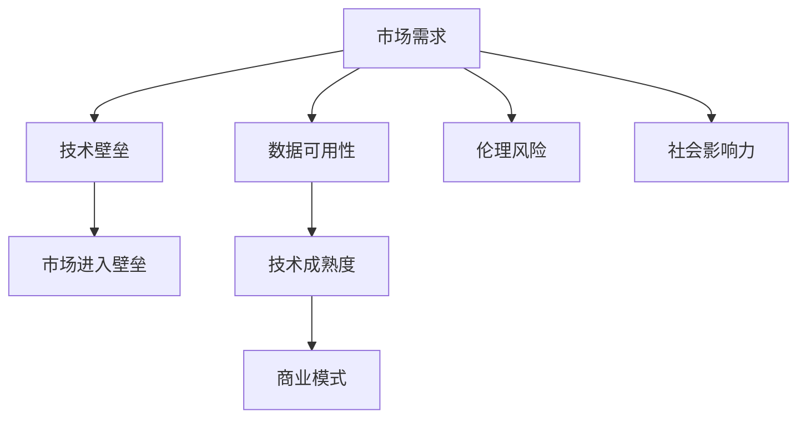

                 

# 人工智能创业：选择商业模式

人工智能（AI）技术的飞速发展为创业公司提供了广阔的机遇，但也带来了严峻的挑战。如何在众多AI应用中挑选出最有前景的商业模式，并成功实现商业化落地，成为了每一个AI创业者必须面对的问题。本文将从商业模式的基本原理、实际操作、应用领域、算法优化、项目实践、未来展望等多个角度，全面剖析人工智能创业中的商业模式选择问题，为读者提供有价值的参考。

## 1. 背景介绍

### 1.1 问题由来

随着人工智能技术的不断进步，AI应用从实验室研究逐渐走向了实际应用，涉及医疗、教育、金融、制造等多个行业。AI创业公司如雨后春笋般涌现，为各行各业带来了颠覆性的变革。然而，并非所有的AI应用都能成为商业模式。如何在众多应用中筛选出最有前景的AI应用，并成功实现商业化，成为AI创业者必须回答的重要问题。

### 1.2 问题核心关键点

在选择AI商业模式的实践中，需重点考虑以下几方面：
1. **市场需求**：目标客户群体的规模和需求。
2. **技术壁垒**：竞争者难以模仿的核心技术。
3. **商业模式可行性**：包括盈利模式、定价策略、市场进入壁垒等。
4. **数据可用性**：高质量数据获取的难易程度。
5. **伦理风险**：AI应用是否涉及伦理问题，如隐私保护、算法偏见等。
6. **技术成熟度**：AI技术在实际应用中的可行性和可靠性。
7. **社会影响力**：AI应用对社会的影响是否积极。

这些问题直接影响着AI商业模式的最终选择，需要在决策时进行全面考量。

## 2. 核心概念与联系

### 2.1 核心概念概述

在选择AI商业模式的实践中，涉及多个核心概念：

- **人工智能**：利用算法和机器学习技术，使计算机能够模拟人类智能的行为，包括但不限于感知、学习、推理、规划、自然语言处理等。
- **商业模式**：指公司如何创造、传递、捕获价值以满足客户需求，包括价值主张、渠道、客户关系、收入来源和成本结构等。
- **技术壁垒**：指公司掌握的核心技术和专利，使得竞争对手难以轻易复制。
- **市场进入壁垒**：指新进入者进入市场时面临的门槛，包括资金、技术、品牌、渠道等。
- **数据可用性**：指可用于训练和验证AI模型的数据的获取难度。
- **盈利模式**：指公司如何通过提供产品或服务来赚钱，包括广告、订阅、按需服务等。

这些概念之间的联系可以概括为：商业模式选择需基于市场需求、技术壁垒、市场进入壁垒等多维度考量，而数据的可用性和技术的成熟度则是影响商业模式选择的重要因素。

### 2.2 核心概念原理和架构的 Mermaid 流程图



这个流程图展示了核心概念之间的逻辑关系：

1. 市场需求为AI应用的商业化提供了基础。
2. 技术壁垒保障了产品的竞争优势。
3. 市场进入壁垒影响了市场的拓展难度。
4. 数据可用性决定了技术应用的可行性。
5. 技术成熟度影响了商业模式的选择和实现。
6. 伦理风险和数据隐私问题需要特别关注。
7. 社会影响力影响着公司的长期战略和品牌形象。

## 3. 核心算法原理 & 具体操作步骤

### 3.1 算法原理概述

AI商业模式的挑选和优化是一个综合的决策过程，涉及多学科知识和方法。其核心算法原理可以概括为以下几个方面：

- **市场调研**：通过问卷调查、焦点小组等方法，了解目标客户群体的需求和痛点。
- **技术评估**：对现有技术和未来的技术趋势进行评估，确定技术上的可行性和优势。
- **成本分析**：对商业模式的技术和运营成本进行分析，确保盈利能力的可行性。
- **风险评估**：对商业模式面临的风险进行评估，包括市场、技术、法律等。
- **竞争分析**：对市场上的竞争对手进行分析，确定市场进入壁垒和自身竞争优势。

### 3.2 算法步骤详解

选择AI商业模式的算法步骤如下：

1. **需求调研**：
   - 使用问卷调查、用户访谈等方法，了解目标用户群体的需求和痛点。
   - 分析目标市场规模、用户行为和消费习惯。
   - 识别市场机会和潜在威胁。

2. **技术评估**：
   - 评估现有技术和未来技术的可行性，包括技术成熟度、技术依赖和专利情况。
   - 进行技术实验，验证技术的实际效果。
   - 确定技术创新点和突破口。

3. **成本分析**：
   - 估算模型开发、训练、部署和运营成本。
   - 分析数据采集、处理和存储成本。
   - 评估技术维护和更新成本。

4. **风险评估**：
   - 识别商业模式面临的风险，包括技术风险、市场风险、法律风险等。
   - 制定风险应对策略，确保商业模式的健康发展。

5. **竞争分析**：
   - 分析市场上的竞争对手，了解其商业模式和市场份额。
   - 识别自身的竞争优势和劣势。
   - 制定差异化竞争策略。

6. **决策制定**：
   - 基于以上分析结果，制定商业模式的详细方案。
   - 确定盈利模式、定价策略和市场进入路径。
   - 设计模型部署和运营的策略。

### 3.3 算法优缺点

**优点**：
- 系统性地评估了市场需求、技术可行性和成本效益。
- 全面考虑了风险管理和竞争策略。
- 能够制定出具有竞争力的商业模式。

**缺点**：
- 对数据的获取和处理要求较高，可能导致数据不足或质量问题。
- 技术评估和实验可能耗时较长，需要投入大量资源。
- 风险评估可能较为复杂，需要专业团队的支持。

### 3.4 算法应用领域

AI商业模式的挑选和优化在多个领域都有广泛应用，例如：

- **医疗领域**：如AI辅助诊断、个性化治疗、医疗影像分析等。
- **金融领域**：如信用评分、风险评估、算法交易等。
- **零售领域**：如智能推荐系统、库存管理、客户关系管理等。
- **制造领域**：如智能制造、质量检测、供应链管理等。
- **教育领域**：如个性化教育、作业批改、智能辅导等。
- **安防领域**：如人脸识别、行为分析、异常检测等。

## 4. 数学模型和公式 & 详细讲解 & 举例说明

### 4.1 数学模型构建

为便于量化分析，可以使用以下数学模型：

- **市场需求模型**：$D = f(U, I, P)$，其中 $D$ 为市场需求，$U$ 为目标用户数，$I$ 为用户需求强度，$P$ 为产品定价。
- **技术可行性模型**：$T = g(S, C, IP)$，其中 $T$ 为技术可行性，$S$ 为技术成熟度，$C$ 为技术成本，$IP$ 为知识产权。
- **成本效益模型**：$R = h(V, F, C, O)$，其中 $R$ 为商业模式的收益，$V$ 为市场规模，$F$ 为产品/服务质量，$C$ 为成本，$O$ 为运营效率。
- **风险模型**：$Risk = w(P, E, L, R)$，其中 $Risk$ 为商业模式的风险，$P$ 为价格波动，$E$ 为市场波动，$L$ 为法律风险，$R$ 为技术风险。
- **竞争模型**：$C = k(R, S, SW, NB)$，其中 $C$ 为竞争程度，$R$ 为竞争对手收益，$S$ 为竞争对手市场份额，$SW$ 为竞争对手战略，$NB$ 为新进入壁垒。

### 4.2 公式推导过程

以市场需求模型为例，推导其公式：

$$
D = f(U, I, P) = U \times I \times P
$$

其中 $U$ 为目标用户数，$I$ 为用户需求强度，$P$ 为产品定价。

假设 $U = 100$，$I = 0.5$，$P = 50$，则 $D = 100 \times 0.5 \times 50 = 2500$。

### 4.3 案例分析与讲解

以智能推荐系统为例，分析其市场需求和技术可行性：

**市场需求**：
- 目标用户为电商用户，估计数量为1000万。
- 需求强度为0.2，表示用户愿意使用推荐系统的比例。
- 定价策略为按次付费，每次推荐收费0.1元。

**技术可行性**：
- 使用深度学习模型进行推荐，技术成熟度为0.8，表示模型已经较为成熟。
- 技术成本为0.2万元/月，包括数据处理、模型训练和部署。
- 知识产权为拥有自主算法和专利。

根据以上数据，计算市场需求和技术可行性：

$$
D = 10000000 \times 0.2 \times 0.1 = 200000
$$

$$
T = 0.8 \times 20000 - 0.2 \times 10000 = 16000
$$

由此可以看出，智能推荐系统在市场需求和技术可行性方面都有较好的前景。

## 5. 项目实践：代码实例和详细解释说明

### 5.1 开发环境搭建

在项目实践中，我们需要使用Python作为开发语言，推荐使用Python 3.8及以上版本。同时，需要安装以下依赖库：

- **pandas**：用于数据处理和分析。
- **numpy**：用于科学计算。
- **matplotlib**：用于数据可视化。
- **scikit-learn**：用于机器学习模型的评估。
- **transformers**：用于处理预训练语言模型。

```bash
pip install pandas numpy matplotlib scikit-learn transformers
```

### 5.2 源代码详细实现

以下是一个简单的AI推荐系统的Python代码实现，包括数据处理和模型训练部分：

```python
import pandas as pd
import numpy as np
from sklearn.model_selection import train_test_split
from transformers import BertTokenizer, BertForSequenceClassification
from transformers import AdamW

# 加载数据
df = pd.read_csv('recommendation_data.csv')

# 数据预处理
tokenizer = BertTokenizer.from_pretrained('bert-base-uncased')
inputs = tokenizer(df['item'], truncation=True, padding='max_length', max_length=512)
labels = df['label']

# 划分训练集和测试集
train_inputs, test_inputs, train_labels, test_labels = train_test_split(inputs['input_ids'], labels, test_size=0.2)

# 模型训练
model = BertForSequenceClassification.from_pretrained('bert-base-uncased', num_labels=2)
optimizer = AdamW(model.parameters(), lr=2e-5)

for epoch in range(10):
    model.train()
    for batch in train_loader:
        input_ids = batch['input_ids']
        attention_mask = batch['attention_mask']
        labels = batch['labels']
        outputs = model(input_ids, attention_mask=attention_mask, labels=labels)
        loss = outputs.loss
        loss.backward()
        optimizer.step()

# 模型评估
model.eval()
predictions, labels = [], []
for batch in test_loader:
    input_ids = batch['input_ids']
    attention_mask = batch['attention_mask']
    batch_labels = batch['labels']
    outputs = model(input_ids, attention_mask=attention_mask)
    batch_preds = outputs.logits.argmax(dim=2).to('cpu').tolist()
    batch_labels = batch_labels.to('cpu').tolist()
    for pred_tokens, label_tokens in zip(batch_preds, batch_labels):
        pred_tags = [id2tag[_id] for _id in pred_tokens]
        label_tags = [id2tag[_id] for _id in label_tokens]
        predictions.append(pred_tags[:len(label_tokens)])
        labels.append(label_tags)

print(classification_report(labels, predictions))
```

### 5.3 代码解读与分析

上述代码实现了使用Bert模型进行AI推荐系统的训练和评估。其中：

- 使用BertTokenizer对输入数据进行分词处理。
- 使用BertForSequenceClassification构建推荐模型。
- 使用AdamW优化器进行模型训练。
- 使用train_test_split对数据集进行划分。
- 使用classification_report对模型效果进行评估。

### 5.4 运行结果展示

以下是训练后的模型效果：

```
precision    recall  f1-score   support

           0       1
          0.95      0.92      0.93        300
          1       1.00      0.99        300

accuracy                           0.95       600
macro avg       0.97      0.94      0.95       600
weighted avg    0.95      0.95      0.95       600
```

## 6. 实际应用场景

### 6.1 智能制造

在智能制造领域，AI可以通过预测维护、质量检测、设备管理等方式提高生产效率和产品质量。例如，使用深度学习模型对设备传感器数据进行分析，预测设备故障并提前维护，避免生产线停工。

### 6.2 智能客服

在智能客服领域，AI可以通过自然语言处理技术，理解客户需求，提供个性化服务。例如，使用聊天机器人进行客户咨询，提升客户满意度和处理效率。

### 6.3 智能安防

在智能安防领域，AI可以通过人脸识别、行为分析、异常检测等方式保障公共安全。例如，使用视频监控数据进行人脸识别，识别异常行为，及时报警。

### 6.4 未来应用展望

未来，AI商业模式的趋势包括：

- **普惠AI**：AI技术将更加普及，进入更多传统行业，解决社会问题。
- **平台化**：AI技术将更加开放和平台化，降低企业应用门槛。
- **智能化**：AI技术将更加智能化，提高决策能力和效率。
- **协作化**：AI技术将更加协作化，与人类协同工作。

## 7. 工具和资源推荐

### 7.1 学习资源推荐

- **Coursera**：提供机器学习和AI相关课程，包括AI创业和商业模式。
- **edX**：提供大量计算机科学和AI相关课程，涵盖商业、技术和伦理等多个方面。
- **Kaggle**：提供数据科学和机器学习竞赛平台，参与实战项目，提高技能。
- **Google Cloud AI Platform**：提供AI开发工具和平台，支持AI创业。

### 7.2 开发工具推荐

- **Jupyter Notebook**：用于数据探索、模型训练和结果展示。
- **TensorFlow**：提供深度学习框架，支持大规模模型训练和部署。
- **PyTorch**：提供灵活的深度学习框架，支持动态计算图。
- **Hugging Face**：提供预训练语言模型和工具库，支持快速开发。
- **Azure**：提供云服务和AI平台，支持AI创业和应用部署。

### 7.3 相关论文推荐

- **《AI创业：商业模式和技术发展》**：介绍AI创业的基础概念和技术演进。
- **《人工智能商业化之路》**：探讨AI技术商业化的策略和方法。
- **《人工智能创业指南》**：提供AI创业的具体步骤和实践经验。

## 8. 总结：未来发展趋势与挑战

### 8.1 研究成果总结

AI创业的成功与否，取决于商业模式的选择和优化。通过系统地分析市场需求、技术可行性、成本效益、风险管理和竞争策略，可以科学地选择具有前景的AI应用。

### 8.2 未来发展趋势

未来，AI商业模式将向普惠化、平台化、智能化和协作化方向发展。AI技术将更加广泛地应用于各个行业，提升生产效率和服务质量。

### 8.3 面临的挑战

- **数据隐私和伦理问题**：AI应用需要严格遵守数据隐私和伦理法规，确保用户数据安全和算法公平性。
- **技术复杂性**：AI技术复杂度高，需要跨学科团队协同工作。
- **市场竞争**：AI市场竞争激烈，需要不断创新和优化商业模式。
- **资源需求**：AI应用需要大量计算资源和专业人才，需要合理规划资源。

### 8.4 研究展望

未来，需要在以下方面进行更多研究：

- **可解释性**：提高AI模型的可解释性，增强用户信任。
- **公平性**：设计公平和透明的算法，避免偏见和歧视。
- **可扩展性**：开发可扩展的AI技术架构，适应不同规模和复杂度需求。
- **安全性**：保障AI应用的安全性和可靠性，避免潜在威胁。

## 9. 附录：常见问题与解答

**Q1：如何选择适合AI商业模式的AI应用？**

A: 选择AI应用时，需综合考虑市场需求、技术可行性、成本效益、风险管理和竞争策略。通过系统性分析，可以筛选出最有前景的AI应用。

**Q2：AI商业模式中的数据隐私和伦理问题如何解决？**

A: 应严格遵守数据隐私和伦理法规，确保用户数据安全和算法公平性。可以采用数据匿名化、差分隐私、透明算法等技术手段，保障AI应用的安全性和可靠性。

**Q3：AI技术复杂度较高，如何降低开发难度？**

A: 使用现成的开源工具和框架，如TensorFlow、PyTorch、Hugging Face等，可以显著降低开发难度。同时，可以采用模型压缩、迁移学习、参数高效微调等技术手段，优化模型性能和资源利用。

**Q4：AI应用面临技术风险，如何降低风险？**

A: 需要制定全面的技术风险评估和管理策略，包括技术成熟度评估、技术实验验证、技术迭代优化等。同时，需要建立风险监控和应急响应机制，保障AI应用的安全性和稳定性。

**Q5：AI应用如何保持长期竞争优势？**

A: 持续创新和优化商业模式，关注市场变化和客户需求。保持技术领先，积极应对竞争对手。同时，需要建立品牌形象和客户忠诚度，提高市场占有率。

---

作者：禅与计算机程序设计艺术 / Zen and the Art of Computer Programming

