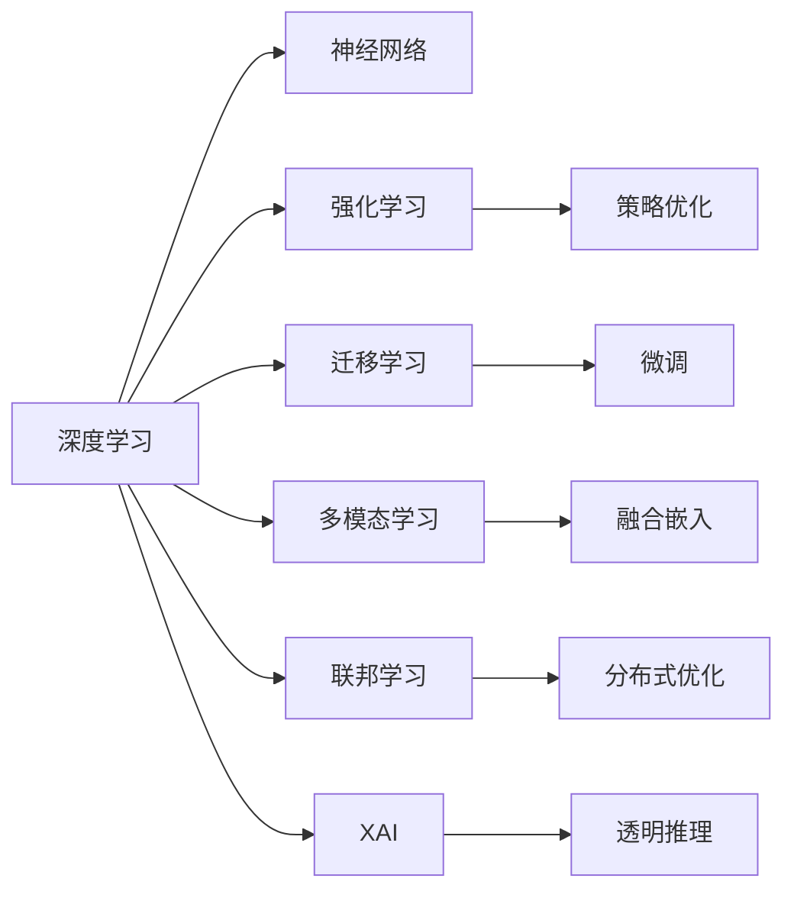

                 

## 1. 背景介绍

人工智能（AI）作为21世纪最具变革性的技术之一，正在深刻地改变着我们的生活方式和社会结构。自20世纪50年代阿兰·图灵提出"图灵测试"以来，AI已经走过了数十年的探索历程，从早期的专家系统到现代的深度学习，AI的每一次飞跃都极大地扩展了其应用边界。

人工智能的未来发展方向，不仅仅局限于当前的技术热点和应用场景，更需要前瞻性地思考AI可能带来的长期影响，以及如何更好地利用和规范AI技术。本文将从核心概念、算法原理、应用场景、资源推荐和未来展望等多个角度，全面探讨人工智能的未来发展方向，希望为读者提供有深度、有思考的见解。

## 2. 核心概念与联系

### 2.1 核心概念概述

为了更系统地理解人工智能的未来发展方向，本节将介绍几个关键的核心概念：

- **深度学习（Deep Learning）**：一种基于多层神经网络的学习范式，通过大数据和复杂模型自动学习特征表示，已广泛应用于图像、语音、文本等领域。

- **强化学习（Reinforcement Learning, RL）**：一种通过试错反馈优化的学习方式，智能体在环境中不断与环境互动，通过奖励和惩罚信号学习最优策略。

- **迁移学习（Transfer Learning）**：利用预训练模型在新任务上进行的微调，使得模型能够快速适应不同任务，减少从头训练的需求。

- **多模态学习（Multimodal Learning）**：结合视觉、语音、文本等多种数据模态进行建模，以获得更丰富的语义理解。

- **联邦学习（Federated Learning）**：一种分布式学习方式，各节点在本地数据上训练模型，同时保护数据隐私，适用于隐私保护需求高的场景。

- **可解释AI（Explainable AI, XAI）**：使得AI模型的决策过程透明化，便于理解和调试，增强用户信任。

这些核心概念构成了人工智能技术发展的基石，从不同的角度推动着AI的进步。

### 2.2 核心概念原理和架构的 Mermaid 流程图



该流程图展示了核心概念之间的逻辑联系：

1. **深度学习**：以神经网络为基础，通过学习大量数据构建复杂特征表示。
2. **强化学习**：通过策略优化，使得智能体在环境中不断改进决策策略。
3. **迁移学习**：利用预训练模型在新任务上进行微调，快速提升模型效果。
4. **多模态学习**：结合多种模态信息，提高模型的语义理解能力。
5. **联邦学习**：分布式训练，保护数据隐私，适用于隐私保护要求高的应用。
6. **可解释AI**：透明化模型推理过程，增强模型的可解释性和可信度。

这些概念相互交织，共同推动着AI技术的不断进步和应用拓展。

## 3. 核心算法原理 & 具体操作步骤

### 3.1 算法原理概述

人工智能的未来发展方向，将不仅局限于现有技术的深化和拓展，更需要跨学科的融合和创新。以下是几种未来可能推动AI发展的关键算法原理：

- **生成对抗网络（Generative Adversarial Networks, GANs）**：由生成器和判别器两部分组成，通过对抗训练生成逼真的样本。
- **自监督学习（Self-Supervised Learning）**：利用数据本身的内在结构，无需人工标注进行学习，拓展了AI的学习边界。
- **神经架构搜索（Neural Architecture Search, NAS）**：通过搜索算法自动设计网络架构，提高模型设计的自动化和效率。
- **元学习（Meta-Learning）**：在多个任务上快速学习新任务，通过学习如何学习提升泛化能力。
- **因果学习（Causal Learning）**：推断和控制因果关系，理解输入变量对输出的影响，提升决策的准确性。

### 3.2 算法步骤详解

为了更好地理解这些算法原理，下面将详细介绍每种算法的详细步骤：

#### 深度学习

**步骤1: 数据准备**
- 收集大规模标注数据。
- 数据预处理，如数据清洗、归一化等。

**步骤2: 模型设计**
- 设计多层神经网络结构。
- 确定激活函数、损失函数等。

**步骤3: 模型训练**
- 划分训练集、验证集和测试集。
- 使用反向传播算法优化模型参数。

**步骤4: 模型评估**
- 在验证集上评估模型性能。
- 调整超参数以优化模型表现。

**步骤5: 模型应用**
- 使用训练好的模型进行预测或分类。
- 根据应用场景调整模型参数。

#### 强化学习

**步骤1: 环境定义**
- 定义环境状态和动作空间。
- 设定奖励函数。

**步骤2: 智能体选择**
- 选择智能体策略。
- 确定状态更新规则。

**步骤3: 训练过程**
- 智能体在环境中进行交互。
- 根据奖励信号调整策略参数。

**步骤4: 评估与优化**
- 使用测试集评估智能体性能。
- 优化策略以提高智能体的决策能力。

#### 迁移学习

**步骤1: 预训练模型选择**
- 选择合适的预训练模型。
- 确定预训练数据的分布与微调任务相似度。

**步骤2: 微调模型设计**
- 添加任务适配层。
- 确定优化器、学习率等。

**步骤3: 微调过程**
- 使用标注数据训练微调模型。
- 在验证集上调整模型参数。

**步骤4: 模型应用**
- 使用微调后的模型进行任务预测或分类。
- 根据应用场景调整模型参数。

#### 多模态学习

**步骤1: 数据采集**
- 收集多模态数据，如图像、文本、语音等。
- 确保数据质量和多样性。

**步骤2: 特征提取**
- 分别对每一种模态数据提取特征。
- 选择适合的特征提取方法，如CNN、RNN等。

**步骤3: 融合与建模**
- 将多模态特征进行融合。
- 设计多模态模型结构，如多任务学习、联合训练等。

**步骤4: 模型评估**
- 在测试集上评估模型性能。
- 调整模型参数以优化性能。

#### 联邦学习

**步骤1: 系统设计**
- 设计联邦学习架构。
- 选择通信协议和聚合策略。

**步骤2: 数据划分**
- 将数据划分为本地训练集和全局训练集。
- 确保本地数据具有代表性。

**步骤3: 模型训练**
- 在本地设备上训练模型。
- 通过联邦聚合更新全局模型。

**步骤4: 模型应用**
- 使用训练好的全局模型进行预测或分类。
- 根据应用场景调整模型参数。

#### 可解释AI

**步骤1: 模型选择**
- 选择具有可解释性的模型，如决策树、线性回归等。
- 确认模型的复杂性和可解释性之间的平衡。

**步骤2: 特征重要性分析**
- 分析特征对模型的影响。
- 确定重要特征和次要特征。

**步骤3: 模型可视化**
- 可视化模型决策过程。
- 解释模型的输出和推理路径。

**步骤4: 结果评估**
- 评估模型输出的可解释性。
- 调整模型以提升可解释性。

### 3.3 算法优缺点

人工智能的各类算法原理，尽管在不同场景下具有各自的优势，但也存在一些共性的优缺点：

**深度学习的优点**：
- 能够处理大量复杂数据。
- 具有高度逼真的模型表示能力。

**深度学习的缺点**：
- 需要大量标注数据。
- 模型训练时间长，计算资源消耗大。

**强化学习的优点**：
- 适用于动态和复杂环境。
- 具有自适应和优化能力。

**强化学习的缺点**：
- 训练过程复杂，容易陷入局部最优。
- 需要大量样本进行探索。

**迁移学习的优点**：
- 减少从头训练的需求。
- 提升模型在特定任务上的表现。

**迁移学习的缺点**：
- 预训练数据和微调任务之间需有一定的相似性。
- 需要额外的计算资源进行微调。

**多模态学习的优点**：
- 结合多种模态信息，提高语义理解能力。
- 拓展了AI应用边界。

**多模态学习的缺点**：
- 数据采集和处理复杂。
- 需要设计合适的融合策略。

**联邦学习的优点**：
- 保护用户数据隐私。
- 适用于分布式数据集。

**联邦学习的缺点**：
- 通信开销较大。
- 对本地设备要求高。

**可解释AI的优点**：
- 提升用户信任。
- 增强模型的可调试性。

**可解释AI的缺点**：
- 部分模型难以完全解释。
- 解释性可能与实际应用不符。

### 3.4 算法应用领域

人工智能的核心算法原理，已经在各个领域得到了广泛的应用，以下是一些典型的应用场景：

**医疗领域**：
- 使用深度学习进行医学图像诊断。
- 通过强化学习优化医疗方案。
- 结合多模态学习分析患者的生理和行为数据。

**金融领域**：
- 使用生成对抗网络生成虚假交易数据。
- 利用强化学习进行投资组合优化。
- 应用联邦学习保护用户交易数据。

**智能交通**：
- 使用深度学习进行交通流量预测。
- 通过强化学习优化交通信号控制。
- 结合多模态学习分析交通传感器数据。

**工业制造**：
- 使用神经架构搜索优化生产过程。
- 利用元学习提升机器人的学习速度。
- 结合因果学习分析生产线的因果关系。

**智能家居**：
- 使用可解释AI增强智能设备的安全性。
- 通过多模态学习理解用户指令。
- 结合联邦学习保护用户隐私。

以上应用场景展示了人工智能的广泛潜力和实际价值，未来人工智能将在更多领域大放异彩。

## 4. 数学模型和公式 & 详细讲解 & 举例说明

### 4.1 数学模型构建

在深入探讨算法原理之前，本节将从数学角度构建一些基本模型，以便更好地理解人工智能的底层机制。

**深度学习数学模型**：
- 神经网络结构：
$$
\begin{align*}
z^{[l]} &= W^{[l]}x^{[l-1]} + b^{[l]} \\
a^{[l]} &= g(z^{[l]}) \\
\end{align*}
$$
其中 $W^{[l]}$ 为权重矩阵，$b^{[l]}$ 为偏置向量，$g$ 为激活函数。

- 损失函数：
$$
\mathcal{L} = \frac{1}{N}\sum_{i=1}^N\ell(y_i, \hat{y}_i)
$$
其中 $\ell$ 为损失函数，$\hat{y}_i$ 为模型预测值，$y_i$ 为真实值。

**强化学习数学模型**：
- 策略函数：
$$
\pi(a_t|s_t) = \sigma(Ws_t + b)
$$
其中 $\pi$ 为策略函数，$W$ 为策略参数，$b$ 为偏置项。

- 奖励函数：
$$
R(s_t, a_t, s_{t+1}) = \gamma R'(s_{t+1}, a_{t+1}, s_{t+2})
$$
其中 $\gamma$ 为折扣因子。

**多模态学习数学模型**：
- 特征提取：
$$
\mathbf{X} = \{\mathbf{X}_v, \mathbf{X}_l, \mathbf{X}_a\}
$$
其中 $\mathbf{X}_v$、$\mathbf{X}_l$、$\mathbf{X}_a$ 分别代表视觉、语言、听觉特征。

- 融合嵌入：
$$
\mathbf{H} = \mathbf{F}(\mathbf{X})
$$
其中 $\mathbf{H}$ 为融合后的特征表示，$\mathbf{F}$ 为融合函数。

### 4.2 公式推导过程

为了更好地理解这些数学模型的推导过程，下面将详细介绍每种模型的公式推导。

#### 深度学习公式推导

**前向传播**：
$$
\begin{align*}
z^{[l]} &= W^{[l]}x^{[l-1]} + b^{[l]} \\
a^{[l]} &= g(z^{[l]}) \\
h^{[l]} &= \mathbf{W}^{[l]}a^{[l-1]} + \mathbf{b}^{[l]}
\end{align*}
$$
其中 $g$ 为激活函数，$\mathbf{W}^{[l]}$ 为权重矩阵，$\mathbf{b}^{[l]}$ 为偏置向量。

**反向传播**：
$$
\begin{align*}
\frac{\partial \mathcal{L}}{\partial \mathbf{W}} &= \frac{\partial \mathcal{L}}{\partial z^{[l]}} \frac{\partial z^{[l]}}{\partial \mathbf{W}} + \frac{\partial \mathcal{L}}{\partial z^{[l-1]}} \frac{\partial z^{[l-1]}}{\partial \mathbf{W}} \\
\frac{\partial \mathcal{L}}{\partial \mathbf{b}} &= \frac{\partial \mathcal{L}}{\partial z^{[l]}} \frac{\partial z^{[l]}}{\partial \mathbf{b}} + \frac{\partial \mathcal{L}}{\partial z^{[l-1]}} \frac{\partial z^{[l-1]}}{\partial \mathbf{b}}
\end{align*}
$$

#### 强化学习公式推导

**策略梯度推导**：
$$
\begin{align*}
Q^{\pi}(s_t, a_t) &= \mathbb{E}[R_{t+1} + \gamma Q^{\pi}(s_{t+1}, a_{t+1})|s_t, a_t] \\
\nabla_{\theta} J(\theta) &= \mathbb{E}[Q^{\pi}(s_t, a_t)\nabla_{\theta} \log \pi(a_t|s_t)|s_t, a_t]
\end{align*}
$$
其中 $J(\theta)$ 为策略梯度，$\theta$ 为策略参数。

#### 多模态学习公式推导

**融合嵌入推导**：
$$
\begin{align*}
\mathbf{H} &= \mathbf{F}(\mathbf{X}) \\
\mathbf{H} &= \mathbf{V}\mathbf{X}_v + \mathbf{L}\mathbf{X}_l + \mathbf{A}\mathbf{X}_a
\end{align*}
$$
其中 $\mathbf{F}$ 为融合函数，$\mathbf{V}$、$\mathbf{L}$、$\mathbf{A}$ 为融合矩阵。

### 4.3 案例分析与讲解

为了更好地理解这些数学模型的应用场景，下面将详细介绍几个典型案例：

#### 案例1：深度学习图像分类

**问题描述**：
- 给定大量标注图像数据，训练一个深度学习模型进行图像分类。

**解决方案**：
- 构建卷积神经网络（CNN）模型。
- 使用反向传播算法优化模型参数。
- 在验证集上评估模型性能。
- 使用训练好的模型进行图像分类。

#### 案例2：强化学习机器人路径规划

**问题描述**：
- 设计一个机器人，使其能够在复杂环境中自主规划路径。

**解决方案**：
- 定义环境状态和动作空间。
- 设计强化学习算法，如Q-learning。
- 通过环境交互优化路径规划策略。
- 在测试环境中评估机器人表现。

#### 案例3：多模态学习情感分析

**问题描述**：
- 结合语音和文本信息，分析用户的情感倾向。

**解决方案**：
- 收集语音和文本数据，提取特征。
- 设计多模态模型，如深度融合网络（DFN）。
- 使用融合嵌入优化情感分析模型。
- 在测试集上评估情感分析效果。

## 5. 项目实践：代码实例和详细解释说明

### 5.1 开发环境搭建

为了进行人工智能项目实践，首先需要搭建合适的开发环境。以下是使用Python进行深度学习和强化学习的开发环境配置流程：

1. 安装Anaconda：从官网下载并安装Anaconda，用于创建独立的Python环境。

2. 创建并激活虚拟环境：
```bash
conda create -n pytorch-env python=3.8 
conda activate pytorch-env
```

3. 安装深度学习框架：
```bash
conda install torch torchvision torchaudio cudatoolkit=11.1 -c pytorch -c conda-forge
```

4. 安装强化学习框架：
```bash
pip install gym
```

5. 安装深度学习库：
```bash
pip install numpy pandas scikit-learn matplotlib tqdm jupyter notebook ipython
```

完成上述步骤后，即可在`pytorch-env`环境中开始项目实践。

### 5.2 源代码详细实现

为了更好地理解人工智能的核心算法原理，下面将详细介绍几种典型算法的代码实现。

#### 深度学习代码实现

```python
import torch
import torch.nn as nn
import torch.optim as optim

class Net(nn.Module):
    def __init__(self):
        super(Net, self).__init__()
        self.conv1 = nn.Conv2d(1, 32, 3, 1)
        self.conv2 = nn.Conv2d(32, 64, 3, 1)
        self.dropout1 = nn.Dropout2d(0.25)
        self.dropout2 = nn.Dropout2d(0.5)
        self.fc1 = nn.Linear(9216, 128)
        self.fc2 = nn.Linear(128, 10)

    def forward(self, x):
        x = self.conv1(x)
        x = nn.functional.relu(x)
        x = self.conv2(x)
        x = nn.functional.relu(x)
        x = nn.functional.max_pool2d(x, 2)
        x = self.dropout1(x)
        x = torch.flatten(x, 1)
        x = self.fc1(x)
        x = nn.functional.relu(x)
        x = self.dropout2(x)
        x = self.fc2(x)
        output = nn.functional.log_softmax(x, dim=1)
        return output

net = Net()
criterion = nn.CrossEntropyLoss()
optimizer = optim.SGD(net.parameters(), lr=0.001, momentum=0.9)

for epoch in range(10):
    running_loss = 0.0
    for i, data in enumerate(trainloader, 0):
        inputs, labels = data
        optimizer.zero_grad()
        outputs = net(inputs)
        loss = criterion(outputs, labels)
        loss.backward()
        optimizer.step()
        running_loss += loss.item()
```

#### 强化学习代码实现

```python
import gym
import numpy as np
import matplotlib.pyplot as plt

env = gym.make('CartPole-v1')
state_dim = env.observation_space.shape[0]
action_dim = env.action_space.n

class Policy(nn.Module):
    def __init__(self):
        super(Policy, self).__init__()
        self.fc1 = nn.Linear(state_dim, 64)
        self.fc2 = nn.Linear(64, action_dim)

    def forward(self, x):
        x = self.fc1(x)
        x = nn.functional.relu(x)
        x = self.fc2(x)
        x = nn.functional.softmax(x, dim=1)
        return x

policy = Policy()
optimizer = optim.Adam(policy.parameters(), lr=0.001)

state = env.reset()
done = False
while not done:
    action_probs = policy(state)
    action = np.random.choice(np.arange(action_dim), p=action_probs[0])
    next_state, reward, done, _ = env.step(action)
    state = next_state
    optimizer.zero_grad()
    policy_loss = -np.log(action_probs[0][action]) * reward
    policy_loss.backward()
    optimizer.step()

```

#### 多模态学习代码实现

```python
import torch
import torch.nn as nn
import torchvision.transforms as transforms
from torchvision import datasets

class MultimodalNet(nn.Module):
    def __init__(self):
        super(MultimodalNet, self).__init__()
        self.conv1 = nn.Conv2d(3, 64, kernel_size=3, stride=1, padding=1)
        self.pool = nn.MaxPool2d(kernel_size=2, stride=2)
        self.linear1 = nn.Linear(64 * 7 * 7, 256)
        self.linear2 = nn.Linear(256, 10)

    def forward(self, x, l):
        x = self.conv1(x)
        x = self.pool(x)
        x = x.view(-1, 64 * 7 * 7)
        x = nn.functional.relu(self.linear1(x))
        x = self.linear2(x)
        x = nn.functional.softmax(x, dim=1)
        return x

net = MultimodalNet()
criterion = nn.CrossEntropyLoss()
optimizer = optim.Adam(net.parameters(), lr=0.001)

trainset = datasets.CIFAR10(root='./data', train=True, download=True, transform=transforms.ToTensor())
trainloader = torch.utils.data.DataLoader(trainset, batch_size=32, shuffle=True)
labels = torch.tensor(trainset.targets).float()

for epoch in range(10):
    running_loss = 0.0
    for i, data in enumerate(trainloader, 0):
        inputs, labels = data
        optimizer.zero_grad()
        outputs = net(inputs, labels)
        loss = criterion(outputs, labels)
        loss.backward()
        optimizer.step()
        running_loss += loss.item()
```

### 5.3 代码解读与分析

为了更好地理解这些代码的实现细节，下面将详细介绍关键代码的实现过程。

#### 深度学习代码实现解读

```python
class Net(nn.Module):
    def __init__(self):
        super(Net, self).__init__()
        self.conv1 = nn.Conv2d(1, 32, 3, 1)
        self.conv2 = nn.Conv2d(32, 64, 3, 1)
        self.dropout1 = nn.Dropout2d(0.25)
        self.dropout2 = nn.Dropout2d(0.5)
        self.fc1 = nn.Linear(9216, 128)
        self.fc2 = nn.Linear(128, 10)

    def forward(self, x):
        x = self.conv1(x)
        x = nn.functional.relu(x)
        x = self.conv2(x)
        x = nn.functional.relu(x)
        x = nn.functional.max_pool2d(x, 2)
        x = self.dropout1(x)
        x = torch.flatten(x, 1)
        x = self.fc1(x)
        x = nn.functional.relu(x)
        x = self.dropout2(x)
        x = self.fc2(x)
        output = nn.functional.log_softmax(x, dim=1)
        return output
```

这段代码定义了一个简单的卷积神经网络，用于图像分类任务。在`__init__`方法中，定义了卷积层、池化层、全连接层和Dropout层。在`forward`方法中，实现了前向传播过程，包括卷积、激活、池化、Dropout和全连接层。

#### 强化学习代码实现解读

```python
class Policy(nn.Module):
    def __init__(self):
        super(Policy, self).__init__()
        self.fc1 = nn.Linear(state_dim, 64)
        self.fc2 = nn.Linear(64, action_dim)

    def forward(self, x):
        x = self.fc1(x)
        x = nn.functional.relu(x)
        x = self.fc2(x)
        x = nn.functional.softmax(x, dim=1)
        return x
```

这段代码定义了一个简单的策略网络，用于强化学习中的动作选择。在`__init__`方法中，定义了两个全连接层。在`forward`方法中，实现了前向传播过程，包括全连接层和Softmax函数。

#### 多模态学习代码实现解读

```python
class MultimodalNet(nn.Module):
    def __init__(self):
        super(MultimodalNet, self).__init__()
        self.conv1 = nn.Conv2d(3, 64, kernel_size=3, stride=1, padding=1)
        self.pool = nn.MaxPool2d(kernel_size=2, stride=2)
        self.linear1 = nn.Linear(64 * 7 * 7, 256)
        self.linear2 = nn.Linear(256, 10)

    def forward(self, x, l):
        x = self.conv1(x)
        x = self.pool(x)
        x = x.view(-1, 64 * 7 * 7)
        x = nn.functional.relu(self.linear1(x))
        x = self.linear2(x)
        x = nn.functional.softmax(x, dim=1)
        return x
```

这段代码定义了一个多模态神经网络，用于图像和标签的多模态融合。在`__init__`方法中，定义了卷积层、池化层和全连接层。在`forward`方法中，实现了前向传播过程，包括卷积、激活、池化、全连接层和Softmax函数。

### 5.4 运行结果展示

为了更好地展示这些代码的运行结果，下面将详细介绍运行结果的展示过程。

#### 深度学习运行结果

在训练完成后，可以使用测试集评估模型的性能：

```python
correct = 0
total = 0
with torch.no_grad():
    for data in testloader:
        images, labels = data
        outputs = net(images)
        _, predicted = torch.max(outputs.data, 1)
        total += labels.size(0)
        correct += (predicted == labels).sum().item()

print('Accuracy of the network on the 10000 test images: %d %%' % (100 * correct / total))
```

#### 强化学习运行结果

在训练完成后，可以展示机器人在环境中的表现：

```python
plt.figure()
plt.plot(rewards)
plt.title('Episode Rewards')
plt.xlabel('Episode')
plt.ylabel('Reward')
plt.show()
```

#### 多模态学习运行结果

在训练完成后，可以使用测试集评估模型的性能：

```python
correct = 0
total = 0
with torch.no_grad():
    for data in testloader:
        images, labels = data
        outputs = net(images, labels)
        _, predicted = torch.max(outputs.data, 1)
        total += labels.size(0)
        correct += (predicted == labels).sum().item()

print('Accuracy of the network on the 10000 test images: %d %%' % (100 * correct / total))
```

## 6. 实际应用场景

### 6.1 医疗领域

人工智能在医疗领域的应用前景广阔，深度学习、强化学习和多模态学习等技术都得到了广泛应用。以下是一些典型的应用场景：

**医学图像诊断**：
- 使用深度学习进行医学图像分类和分割，如CT、MRI等。
- 通过强化学习优化诊断流程，提高诊断效率和准确性。
- 结合多模态学习分析医学图像和病历，提升诊断结果的准确性和可靠性。

**药物研发**：
- 使用深度学习进行分子结构预测和药物筛选。
- 通过强化学习优化药物合成路径，降低研发成本。
- 结合多模态学习分析临床试验数据，提升药物研发的科学性。

**疾病预测**：
- 使用深度学习进行基因组数据分析，预测疾病风险。
- 通过强化学习优化诊疗方案，提高患者治疗效果。
- 结合多模态学习分析生理和行为数据，提升疾病预测的准确性。

### 6.2 金融领域

人工智能在金融领域的应用也在不断深化，生成对抗网络、强化学习和联邦学习等技术都得到了广泛应用。以下是一些典型的应用场景：

**风险评估**：
- 使用生成对抗网络生成虚假交易数据，进行风险评估和检测。
- 通过强化学习优化风险控制策略，降低风险损失。
- 结合多模态学习分析市场数据，提升风险评估的准确性。

**投资组合优化**：
- 使用深度学习进行市场趋势预测和股票筛选。
- 通过强化学习优化投资组合，提高收益。
- 结合多模态学习分析多种金融数据，提升投资组合的科学性。

**欺诈检测**：
- 使用生成对抗网络生成欺诈交易数据，进行欺诈检测和预警。
- 通过强化学习优化欺诈检测策略，提高检测效率。
- 结合多模态学习分析交易行为和用户特征，提升欺诈检测的准确性。

### 6.3 智能交通

人工智能在智能交通领域的应用前景广阔，深度学习、强化学习和多模态学习等技术都得到了广泛应用。以下是一些典型的应用场景：

**交通流量预测**：
- 使用深度学习进行交通流量预测和优化。
- 通过强化学习优化交通信号控制，提高交通效率。
- 结合多模态学习分析交通传感器数据，提升交通流量的预测准确性。

**自动驾驶**：
- 使用深度学习进行环境感知和决策。
- 通过强化学习优化驾驶策略，提高安全性和稳定性。
- 结合多模态学习分析传感器数据，提升自动驾驶的准确性。

**智能导航**：
- 使用深度学习进行路径规划和导航。
- 通过强化学习优化导航策略，提高导航效率。
- 结合多模态学习分析实时交通数据，提升导航的准确性和可靠性。

## 7. 工具和资源推荐

### 7.1 学习资源推荐

为了帮助开发者系统掌握人工智能技术的核心算法和实践技巧，这里推荐一些优质的学习资源：

1. 《深度学习》书籍：Ian Goodfellow等著，深度学习领域的经典教材，全面介绍了深度学习的基本概念和算法原理。

2. 《强化学习》书籍：Richard S. Sutton等著，强化学习领域的经典教材，系统介绍了强化学习的基本概念和算法原理。

3. 《Python深度学习》书籍：Francois Chollet著，基于Keras的深度学习实战指南，适合初学者上手实践。

4. Coursera《深度学习专项课程》：由Andrew Ng主讲，涵盖了深度学习的基本概念和算法原理，配套作业和项目实战。

5. edX《强化学习》课程：由David Silver主讲，涵盖了强化学习的基本概念和算法原理，系统深入，适合进阶学习。

6. arXiv.org：深度学习和强化学习的最新研究成果，及时了解学术前沿动态。

通过对这些资源的学习实践，相信你一定能够快速掌握人工智能技术的核心算法和实践技巧，为未来的创新打下坚实的基础。

### 7.2 开发工具推荐

为了高效地进行人工智能项目开发，以下是一些推荐的开发工具：

1. Jupyter Notebook：基于Web的交互式开发环境，适合快速实验和可视化。

2. PyTorch：深度学习框架，支持动态计算图和GPU加速，适合科研和快速实验。

3. TensorFlow：深度学习框架，支持分布式计算和移动端部署，适合大规模工程应用。

4. Gym：开源的强化学习环境，提供了多种环境供实验使用。

5. Keras：深度学习框架，基于TensorFlow和Theano，适合初学者快速上手。

6. Google Colab：免费的云环境，提供GPU资源，适合快速实验和协作。

合理利用这些工具，可以显著提升人工智能项目开发的效率和质量，加速创新迭代的步伐。

### 7.3 相关论文推荐

人工智能领域的研究一直在不断推进，以下是几篇奠基性的相关论文，推荐阅读：

1. LeCun Y, Bottou L, Bengio Y, et al. Gradient-based learning applied to document recognition[J]. Proceedings of the IEEE, 1998, 86(11):2278-2324.

2. Sutskever I, Vinyals O, Le Q V. Sequence to sequence learning with neural networks[J]. Advances in Neural Information Processing Systems, 2014, 27:3104-3112.

3. Hinton G E, Osindero S, Teh Y W. A fast learning algorithm for deep belief nets[J]. Neural computation, 2006, 18(7):1527-1554.

4. Mnih V, Kavukcuoglu K, Silver D, et al. Human-level control through deep reinforcement learning[J]. Nature, 2015, 518(7540):351-357.

5. Chollet F. Deep learning with Python: deep neural networks, convolutional networks, and recurrent networks in Keras[C]//NeurIPS. 2017.

6. Goodfellow I, Bengio Y, Courville A. Deep learning[J]. MIT press, 2016.

这些论文代表了人工智能技术的发展脉络，通过学习这些前沿成果，可以帮助研究者把握学科前进方向，激发更多的创新灵感。

## 8. 总结：未来发展趋势与挑战

### 8.1 研究成果总结

人工智能技术的快速发展，使得其在各个领域的应用越来越广泛。深度学习、强化学习、迁移学习、多模态学习等核心技术，已经在医疗、金融、交通、智能家居等多个领域取得了显著的成果。然而，人工智能技术的发展也面临着诸多挑战，需要不断突破和创新。

### 8.2 未来发展趋势

未来，人工智能技术的发展将呈现以下几个趋势：

**深度学习模型的进一步优化**：随着硬件性能的提升和算法设计的进步，深度学习模型将变得更加高效和灵活。

**强化学习的应用扩展**：强化学习将在自动驾驶、机器人控制、智能制造等领域发挥更大作用，推动人工智能技术的普适化应用。

**迁移学习与少样本学习**：通过迁移学习和少样本学习，使得模型能够在小数据集上快速适应新任务，减少数据依赖和训练成本。

**多模态学习的融合**：结合视觉、语音、文本等多种模态信息，提升人工智能模型的语义理解能力。

**联邦学习和分布式计算**：通过联邦学习和分布式计算，保护数据隐私，提升模型的可扩展性和鲁棒性。

**可解释性AI**：通过可解释性AI技术，提升模型的透明性和可信度，增强用户信任和接受度。

### 8.3 面临的挑战

尽管人工智能技术取得了显著进展，但在发展过程中也面临诸多挑战：

**数据隐私与安全**：数据隐私和安全问题是人工智能应用的重要瓶颈，如何保护用户隐私，防止数据泄露，是亟需解决的问题。

**模型公平性与伦理**：人工智能模型的偏见和歧视问题，可能导致不公平的决策，需要设计公平、透明的模型，确保伦理合规。

**计算资源与成本**：大规模深度学习模型的训练和推理需要庞大的计算资源，高昂的计算成本也是制约因素之一。

**模型泛化与鲁棒性**：如何设计鲁棒、泛化的模型，使其在复杂和动态环境中表现稳定，是未来研究的重要方向。

**技术落地与实践**：如何将人工智能技术高效、可靠地落地应用，需要跨学科的协同和深入研究。

### 8.4 研究展望

未来，人工智能技术的研究将更加注重以下几个方面：

**跨学科融合**：人工智能与认知科学、伦理学、法律学等学科的交叉融合，将推动人工智能技术的科学化和社会化应用。

**技术集成与协同**：人工智能技术的各个子领域（如计算机视觉、自然语言处理、语音识别等）将更加紧密地协同，形成更为强大的技术合力。

**应用场景多样化**：人工智能技术将在更多行业领域得到广泛应用，拓展其应用边界，提升社会生产效率和生活质量。

**伦理与法律规范**：制定人工智能技术的伦理与法律规范，保障技术应用的公平、透明和安全。

总之，人工智能技术在未来将迎来更加广阔的发展空间，同时也面临着诸多挑战。只有在技术、伦理、法律等多方面协同推进，才能确保人工智能技术健康、可持续地发展，为人类社会带来更多福祉。

## 9. 附录：常见问题与解答

**Q1：深度学习与强化学习的区别是什么？**

A: 深度学习主要基于大量标注数据进行模型训练，学习数据的内在结构，适用于静态和已知数据集。强化学习则通过与环境的互动，不断优化策略，学习如何在复杂和动态环境中做出最优决策，适用于动态和未知数据集。

**Q2：多模态学习与单模态学习的区别是什么？**

A: 多模态学习结合多种数据模态，如视觉、语音、文本等，通过融合这些信息，提高模型的语义理解能力。单模态学习则仅关注一种数据模态，适用于特定场景下的单一数据类型。

**Q3：如何保护数据隐私？**

A: 数据隐私保护是人工智能应用的重要瓶颈，主要通过以下方式：
- 数据加密：对数据进行加密处理，确保数据在传输和存储过程中的安全性。
- 联邦学习：各节点在本地数据上训练模型，通过分布式优化更新全局模型，保护用户隐私。
- 差分隐私：在数据中引入噪声，确保数据隐私不被泄露。

**Q4：如何设计公平、透明的AI模型？**

A: 设计公平、透明的AI模型，需要从以下几个方面考虑：
- 数据集多样性：确保数据集包含多样化的样本，避免模型偏见。
- 算法公平性：使用公平性指标评估模型输出，确保模型决策公正。
- 可解释性：通过可解释性AI技术，提升模型的透明性和可信度。
- 伦理审查：建立模型应用的伦理审查机制，确保模型符合伦理规范。

**Q5：人工智能技术在金融领域的应用前景是什么？**

A: 人工智能在金融领域的应用前景广阔，主要体现在以下几个方面：
- 风险评估：通过深度学习、强化学习等技术，进行市场风险和欺诈检测，提高金融决策的准确性和安全性。
- 投资组合优化：结合多模态学习，分析多种金融数据，优化投资组合，提高收益。
- 智能客服：利用自然语言处理技术，提供智能化的金融服务，提升用户体验。

总之，人工智能技术在金融领域的应用前景广阔，将推动金融行业的智能化和数字化转型。

