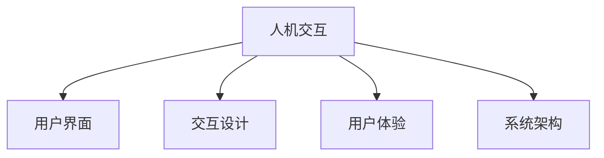

                 

# 人机交互：设计高效便捷的人类计算工具

> 关键词：人机交互, 人类计算, 高效便捷, 计算工具, 界面设计, 用户体验, 系统架构

## 1. 背景介绍

### 1.1 问题由来

随着计算技术的飞速发展，人类对计算工具的需求也随之增长。从最初的打孔卡片到现代的计算机，每一次技术变革都极大地提升了计算效率和用户体验。然而，现代计算工具虽然功能强大，但界面设计复杂、操作繁琐，难以满足用户日益增长的便捷性和高效性需求。因此，如何设计高效便捷的人类计算工具，提升用户体验，成为了当前人机交互领域的一个重要研究方向。

### 1.2 问题核心关键点

在当前的人机交互设计中，关键问题包括：

- 界面设计：如何设计简洁、易用的用户界面，让用户能够快速上手并高效完成任务。
- 交互模式：如何设计高效的交互模式，让用户能够在有限的时间内完成更多的操作。
- 交互体验：如何提升交互体验，让用户在使用过程中感到愉悦和满足。
- 数据处理：如何高效地处理和展示数据，使用户能够快速获取所需信息。
- 可访问性：如何设计可访问性友好的交互系统，让用户能够轻松访问和使用计算工具。

## 2. 核心概念与联系

### 2.1 核心概念概述

为更好地理解设计高效便捷的人类计算工具，本节将介绍几个密切相关的核心概念：

- 人机交互（Human-Computer Interaction, HCI）：研究如何让计算机更好地服务于人类，提升用户体验的学科。
- 用户界面（User Interface, UI）：提供给用户与计算机交互的媒介，包括图形界面、命令行界面等。
- 交互设计（Interaction Design, ID）：设计用户与计算机交互的方式，包括交互流程、界面元素等。
- 用户体验（User Experience, UX）：衡量用户对计算工具的满意度，关注用户在使用过程中的情感体验。
- 系统架构（System Architecture）：设计计算工具的整体结构，包括数据流、模块划分、接口定义等。

这些核心概念之间的逻辑关系可以通过以下Mermaid流程图来展示：



这个流程图展示了几个人机交互概念及其之间的关系：

1. 人机交互研究如何让计算机更好地服务于人类，提升用户体验。
2. 用户界面是提供给用户与计算机交互的媒介。
3. 交互设计关注用户与计算机交互的方式。
4. 用户体验衡量用户对计算工具的满意度。
5. 系统架构设计计算工具的整体结构。

这些概念共同构成了高效便捷人类计算工具的设计框架，使得设计过程能够系统性地进行。

## 3. 核心算法原理 & 具体操作步骤
### 3.1 算法原理概述

设计高效便捷的人类计算工具，本质上是一个系统化的设计过程，涉及界面设计、交互设计、用户体验等多个方面。其核心思想是：通过系统化的方法，设计简洁、易用的用户界面，设计高效的交互模式，提升用户在使用过程中的便捷性和高效性。

形式化地，假设设计目标为 $T$，用户需求为 $U$，设计结果为 $R$，设计过程可以表示为：

$$
R = \mathop{\arg\min}_{R} \mathcal{L}(R, U, T)
$$

其中 $\mathcal{L}$ 为衡量设计结果 $R$ 与用户需求 $U$ 和设计目标 $T$ 之间的差异的损失函数。

通过设计损失函数 $\mathcal{L}$，可以系统化地评估设计结果 $R$ 的优劣。一般而言，损失函数越小，设计结果越好。

### 3.2 算法步骤详解

设计高效便捷的人类计算工具，一般包括以下几个关键步骤：

**Step 1: 用户需求分析**

- 调研目标用户群体，收集用户需求和痛点，确定设计目标。
- 使用问卷、访谈等方式，获取用户对现有计算工具的意见和建议。
- 结合用户需求和市场趋势，确定设计优先级和关键要素。

**Step 2: 界面设计**

- 设计简洁、一致、易用的界面元素，如按钮、文本框、标签等。
- 使用标准化的设计规范，确保界面的一致性和可访问性。
- 优化布局和尺寸，确保用户在有限的空间内能够高效完成任务。

**Step 3: 交互设计**

- 设计高效的交互流程，使用户能够在有限的时间内完成更多的操作。
- 使用手势、语音等交互方式，提升交互便捷性。
- 优化交互反馈，使用户能够及时了解操作结果和系统状态。

**Step 4: 用户体验评估**

- 使用用户测试、可用性测试等方法，评估设计结果的用户体验。
- 收集用户反馈，不断迭代和优化设计结果。
- 使用用户体验指标（如任务完成时间、满意度等）评估设计结果的优劣。

**Step 5: 系统架构优化**

- 设计高效的系统架构，优化数据流和模块划分。
- 定义清晰的接口规范，确保模块之间的良好协作。
- 使用微服务架构、缓存机制等技术提升系统性能。

以上是设计高效便捷人类计算工具的一般流程。在实际应用中，还需要根据具体任务的特点，对设计过程的各个环节进行优化设计，如改进交互目标函数，引入更多的交互设计技术，搜索最优的设计组合等，以进一步提升设计效果。

### 3.3 算法优缺点

设计高效便捷的人类计算工具，具有以下优点：

- 用户友好：简洁易用的界面设计，使得用户能够快速上手并高效完成任务。
- 交互便捷：高效便捷的交互模式，提升用户在使用过程中的便捷性。
- 用户体验提升：通过不断迭代和优化设计，提升用户在使用过程中的满意度。
- 系统性能优化：高效的系统架构，提升系统的整体性能。

同时，该方法也存在一定的局限性：

- 设计成本较高：设计高效便捷的计算工具，需要投入大量时间和精力进行调研和设计。
- 设计复杂性高：设计过程涉及多个环节，需要跨学科的合作。
- 需求变化适应性差：设计一旦完成，适应需求变化的能力有限。
- 用户体验主观性强：用户体验的评估和优化需要依赖用户反馈，主观性强。

尽管存在这些局限性，但就目前而言，设计高效便捷的计算工具仍然是最主流的范式。未来相关研究的重点在于如何进一步降低设计成本，提高设计的灵活性和适应性，同时兼顾用户体验的客观性和科学性等因素。

### 3.4 算法应用领域

设计高效便捷的人类计算工具，在各个领域都得到了广泛的应用，包括但不限于：

- 桌面软件：如文本编辑器、设计工具、游戏等。
- 移动应用：如社交媒体、电商、出行等。
- 网站和Web应用：如电商平台、在线教育、新闻资讯等。
- 智能设备：如智能手表、智能家居、AR/VR设备等。

除了上述这些经典领域外，计算工具的应用还在不断拓展，如可穿戴设备、健康监测、智能交通等，为人类生活带来更多的便利和可能性。随着计算技术的不断进步，高效便捷的计算工具将无处不在，深刻影响人类的生产生活方式。

## 4. 数学模型和公式 & 详细讲解  
### 4.1 数学模型构建

本节将使用数学语言对设计高效便捷人类计算工具的数学模型进行更加严格的刻画。

记设计目标为 $T$，用户需求为 $U$，设计结果为 $R$，设计过程可以表示为：

$$
R = \mathop{\arg\min}_{R} \mathcal{L}(R, U, T)
$$

其中 $\mathcal{L}$ 为衡量设计结果 $R$ 与用户需求 $U$ 和设计目标 $T$ 之间的差异的损失函数。在实践中，一般使用以下几种损失函数：

- 任务完成时间：衡量用户完成特定任务所需的时间。
- 任务错误率：衡量用户在完成特定任务时的错误率。
- 用户满意度：衡量用户对计算工具的满意度。

### 4.2 公式推导过程

以任务完成时间为目标函数，进行公式推导：

假设设计结果 $R$ 为界面设计，用户需求 $U$ 为任务类型，设计目标 $T$ 为任务完成时间。则任务完成时间的损失函数可以表示为：

$$
\mathcal{L}_{time} = \frac{1}{N}\sum_{i=1}^N |T_i - R_i|
$$

其中 $N$ 为任务数量，$T_i$ 为任务 $i$ 的目标完成时间，$R_i$ 为任务 $i$ 在界面设计 $R$ 下用户完成该任务所需的实际时间。

对上式进行优化，得到最优设计结果：

$$
R^* = \mathop{\arg\min}_{R} \mathcal{L}_{time}(R)
$$

通过计算各个设计选项的损失函数值，选择最小值对应的设计结果作为最优设计。

## 5. 项目实践：代码实例和详细解释说明
### 5.1 开发环境搭建

在进行界面设计实践前，我们需要准备好开发环境。以下是使用Python进行Flask开发的开发环境配置流程：

1. 安装Anaconda：从官网下载并安装Anaconda，用于创建独立的Python环境。

2. 创建并激活虚拟环境：
```bash
conda create -n flask-env python=3.8 
conda activate flask-env
```

3. 安装Flask：
```bash
pip install flask
```

4. 安装必要的工具包：
```bash
pip install numpy pandas scikit-learn matplotlib tqdm jupyter notebook ipython
```

完成上述步骤后，即可在`flask-env`环境中开始界面设计实践。

### 5.2 源代码详细实现

下面我们以设计一个简单的文本编辑器为例，给出使用Flask进行界面设计的PyTorch代码实现。

首先，定义Flask应用程序：

```python
from flask import Flask, render_template, request
import numpy as np
import pandas as pd

app = Flask(__name__)

@app.route('/')
def index():
    return render_template('index.html')
```

然后，定义文本编辑器的功能：

```python
def open_text_editor():
    with open('data.txt', 'r') as f:
        text = f.read()
    return text

def save_text_editor(text):
    with open('data.txt', 'w') as f:
        f.write(text)

@app.route('/save', methods=['POST'])
def save():
    text = request.form['text']
    save_text_editor(text)
    return render_template('index.html', message='Text saved successfully!')
```

最后，实现文本编辑器界面的展示：

```python
from jinja2 import Template

template = Template("""
<html>
<head>
    <title>Text Editor</title>
</head>
<body>
    <form method="post">
        <textarea name="text" id="text-area" rows="20" cols="80">{{ text }}</textarea>
        <br>
        <button type="submit" name="submit">Save</button>
    </form>
    <script>
        const textArea = document.getElementById('text-area');
        textArea.value = '<%= text %>';
    </script>
</body>
</html>
""")

@app.route('/')
def editor():
    text = open_text_editor()
    return render_template('index.html', text=text)

if __name__ == '__main__':
    app.run(debug=True)
```

以上就是使用Flask对文本编辑器进行界面设计的完整代码实现。可以看到，利用Flask框架，我们能够快速搭建一个简洁、易用的文本编辑器，用户只需通过简单的网页操作即可完成文本的读写。

### 5.3 代码解读与分析

让我们再详细解读一下关键代码的实现细节：

**Flask应用程序定义**：
- 创建Flask应用程序实例，并定义路由函数。

**文本编辑器功能实现**：
- `open_text_editor`函数：读取文本文件，返回文本内容。
- `save_text_editor`函数：保存文本文件，接受文本内容作为参数。
- `save`函数：接收用户提交的文本内容，调用`save_text_editor`函数保存文本，并返回成功信息。

**界面展示**：
- 定义HTML模板，使用`Template`类渲染文本内容。
- `editor`函数：读取文本内容，渲染模板并返回HTML页面。
- `index`函数：渲染`index.html`页面。

**保存文本**：
- 用户点击提交按钮，将文本内容提交到服务器，调用`save`函数保存文本。
- 在HTML页面中使用JavaScript动态更新文本内容，提升用户体验。

可以看到，Flask框架使得界面设计的实现变得简单高效，开发者可以将更多精力放在界面设计和功能实现上，而不必过多关注底层的实现细节。

当然，工业级的系统实现还需考虑更多因素，如用户权限管理、数据安全、界面美观等。但核心的设计范式基本与此类似。

## 6. 实际应用场景
### 6.1 移动应用设计

移动应用设计是当前人机交互设计的重要领域。传统的移动应用设计往往以功能为主，界面复杂、操作繁琐，用户体验不佳。而设计高效便捷的移动应用，能够提升用户粘性和使用效率。

在技术实现上，可以收集用户的使用习惯和反馈，不断优化和迭代设计。设计简洁易用的UI，优化交互流程，提升用户体验。例如，支付宝的聊天界面，通过简洁的设计和高效的交互流程，提升了用户的支付体验，增强了用户粘性。

### 6.2 网站和Web应用设计

网站和Web应用设计是人机交互设计的另一个重要方向。当前大量的网站和Web应用仍然存在界面复杂、操作繁琐的问题。通过设计高效便捷的Web应用，能够提升用户的使用效率和满意度。

在技术实现上，可以使用Web框架如Flask、Django等，设计简洁易用的界面，优化交互流程，提升用户体验。例如，美团的网页版应用，通过简洁的设计和高效的交互流程，提升了用户的搜索和下单体验，增强了用户的消费意愿。

### 6.3 智能设备设计

智能设备设计是人机交互设计的新兴领域。当前许多智能设备仍然存在界面复杂、操作繁琐的问题。通过设计高效便捷的智能设备，能够提升用户的体验和设备的使用率。

在技术实现上，可以设计简洁易用的UI，优化交互流程，提升用户体验。例如，小米手环的交互界面，通过简洁的设计和高效的交互流程，提升了用户的使用体验，增强了用户的粘性。

### 6.4 未来应用展望

随着计算技术的不断发展，高效便捷的人机交互设计将展现出更大的潜力和应用价值。未来，高效便捷的人机交互设计将向以下几个方向发展：

1. 自适应设计：根据用户的使用习惯和偏好，动态调整界面设计和交互流程，提供个性化体验。

2. 多模态交互：结合语音、手势、触觉等多种交互方式，提升交互便捷性。

3. 自然语言理解：通过自然语言理解技术，提升交互的自然性和流畅性。

4. 智能推荐：通过智能推荐系统，提升用户的使用效率和满意度。

5. 可访问性设计：设计可访问性友好的交互系统，满足不同用户的需求。

6. 智能界面：通过智能界面技术，提升交互效率和用户满意度。

以上趋势展示了大规模人机交互设计的广阔前景。这些方向的探索发展，必将进一步提升人机交互体验，为人类生产生活方式带来深远影响。

## 7. 工具和资源推荐
### 7.1 学习资源推荐

为了帮助开发者系统掌握人机交互设计的基本知识和设计方法，这里推荐一些优质的学习资源：

1. 《Human-Computer Interaction: The Fundamentals》书籍：介绍了人机交互设计的基本概念和设计方法，适合初学者阅读。

2. 《Interaction Design Foundation》课程：由全球知名的设计机构提供，涵盖了人机交互设计的各个方面，内容丰富、实用性强。

3. 《Designing Interfaces》书籍：介绍了人机交互设计中的界面设计、交互设计、用户体验等关键内容，是界面设计的经典教材。

4. 《Interaction Design in the New Media》课程：介绍了交互设计的最新技术和趋势，内容前沿、前沿。

5. 《User Experience Design》课程：介绍了用户体验设计的各个方面，帮助开发者系统掌握用户体验设计的全流程。

通过对这些资源的学习实践，相信你一定能够快速掌握人机交互设计的精髓，并用于解决实际的计算工具设计问题。

### 7.2 开发工具推荐

高效的开发离不开优秀的工具支持。以下是几款用于人机交互设计开发的常用工具：

1. Adobe XD：专业的界面设计工具，支持原型设计、交互设计等，功能强大、易用性强。

2. Sketch：Mac平台上流行的界面设计工具，支持原型设计、交互设计等，界面简洁、功能丰富。

3. Figma：基于Web的界面设计工具，支持实时协作、云端同步等，使用方便、更新迅速。

4. Axure RP：专业的原型设计工具，支持交互设计、用户体验分析等，功能全面、灵活性高。

5. InVision：基于Web的原型设计工具，支持实时协作、云端同步等，使用方便、更新迅速。

合理利用这些工具，可以显著提升人机交互设计的开发效率，加快创新迭代的步伐。

### 7.3 相关论文推荐

人机交互设计的研究源于学界的持续研究。以下是几篇奠基性的相关论文，推荐阅读：

1. 《Designing the User Interface》书籍：作者是人机交互设计的先驱之一，系统介绍了人机交互设计的基本概念和方法。

2. 《Human Factors in Computing Systems》期刊：介绍了人机交互设计的研究动态和最新成果，是了解人机交互设计前沿进展的重要来源。

3. 《Interaction Design: Biology and Design of Interfaces》书籍：介绍了人机交互设计的基本理论和设计方法，是界面设计的经典教材。

4. 《Human-Computer Interaction》期刊：介绍了人机交互设计的研究动态和最新成果，是了解人机交互设计前沿进展的重要来源。

5. 《Interaction Design: Theory, Methods, and Patterns》书籍：介绍了人机交互设计的理论、方法和设计模式，是设计实践中不可缺少的参考书。

这些论文代表了大规模人机交互设计的发展脉络。通过学习这些前沿成果，可以帮助研究者把握学科前进方向，激发更多的创新灵感。

## 8. 总结：未来发展趋势与挑战

### 8.1 总结

本文对人机交互设计的系统方法和设计过程进行了全面系统的介绍。首先阐述了人机交互设计的背景和意义，明确了设计过程的系统性和科学性。其次，从原理到实践，详细讲解了人机交互设计的数学原理和关键步骤，给出了设计任务开发的完整代码实例。同时，本文还广泛探讨了人机交互设计在移动应用、网站和Web应用、智能设备等多个领域的应用前景，展示了人机交互设计的巨大潜力。此外，本文精选了设计技术的各类学习资源，力求为读者提供全方位的技术指引。

通过本文的系统梳理，可以看到，高效便捷的人机交互设计正在成为人机交互设计的重要范式，极大地提升了计算工具的使用效率和用户体验。未来，伴随计算技术的不断进步，人机交互设计还将持续演进，进一步提升用户的使用体验，推动计算技术在各个领域的应用。

### 8.2 未来发展趋势

展望未来，人机交互设计将呈现以下几个发展趋势：

1. 自适应设计：根据用户的使用习惯和偏好，动态调整界面设计和交互流程，提供个性化体验。

2. 多模态交互：结合语音、手势、触觉等多种交互方式，提升交互便捷性。

3. 自然语言理解：通过自然语言理解技术，提升交互的自然性和流畅性。

4. 智能推荐：通过智能推荐系统，提升用户的使用效率和满意度。

5. 可访问性设计：设计可访问性友好的交互系统，满足不同用户的需求。

6. 智能界面：通过智能界面技术，提升交互效率和用户满意度。

以上趋势展示了大规模人机交互设计的广阔前景。这些方向的探索发展，必将进一步提升人机交互体验，为人类生产生活方式带来深远影响。

### 8.3 面临的挑战

尽管人机交互设计已经取得了瞩目成就，但在迈向更加智能化、普适化应用的过程中，它仍面临着诸多挑战：

1. 设计成本较高：设计高效便捷的计算工具，需要投入大量时间和精力进行调研和设计。

2. 设计复杂性高：设计过程涉及多个环节，需要跨学科的合作。

3. 需求变化适应性差：设计一旦完成，适应需求变化的能力有限。

4. 用户体验主观性强：用户体验的评估和优化需要依赖用户反馈，主观性强。

尽管存在这些局限性，但就目前而言，设计高效便捷的计算工具仍然是最主流的范式。未来相关研究的重点在于如何进一步降低设计成本，提高设计的灵活性和适应性，同时兼顾用户体验的客观性和科学性等因素。

### 8.4 研究展望

面对人机交互设计所面临的种种挑战，未来的研究需要在以下几个方面寻求新的突破：

1. 探索无监督和半监督设计方法：摆脱对大规模用户调研的依赖，利用自监督学习、主动学习等无监督和半监督范式，最大限度利用用户数据，实现更加灵活高效的设计。

2. 研究智能设计工具：开发更加智能的设计工具，自动生成和优化设计方案，提高设计效率和效果。

3. 融合因果分析和博弈论工具：将因果分析方法引入设计过程，识别出设计决策的关键特征，增强设计结果的稳定性和可解释性。

4. 纳入伦理道德约束：在设计师理模型和评价指标中引入伦理导向的评估指标，过滤和惩罚有害的设计选项，确保设计结果符合伦理道德。

这些研究方向的探索，必将引领人机交互设计技术迈向更高的台阶，为构建更加智能、普适的计算工具铺平道路。面向未来，人机交互设计还需要与其他人工智能技术进行更深入的融合，如知识表示、因果推理、强化学习等，多路径协同发力，共同推动人机交互系统的进步。只有勇于创新、敢于突破，才能不断拓展人机交互设计的边界，让人机交互系统更好地服务于人类。

## 9. 附录：常见问题与解答

**Q1：如何设计高效便捷的界面设计？**

A: 设计高效便捷的界面设计，需要遵循以下几个原则：

1. 简洁易用：设计简洁、易用的界面元素，让用户能够快速上手并高效完成任务。

2. 一致性：保持界面元素的一致性，使用户能够快速熟悉和掌握操作。

3. 用户反馈：及时反馈用户的操作结果和系统状态，使用户能够快速了解操作效果。

4. 可访问性：设计可访问性友好的交互系统，满足不同用户的需求。

5. 功能灵活：根据用户需求和使用习惯，灵活调整界面设计和交互流程。

**Q2：如何提升用户体验？**

A: 提升用户体验，需要从以下几个方面入手：

1. 用户需求分析：通过调研和访谈，了解用户需求和痛点，确定设计目标。

2. 界面设计：设计简洁、易用的界面元素，保持界面的一致性。

3. 交互设计：设计高效的交互流程，优化交互反馈，提升用户体验。

4. 用户测试：通过用户测试和可用性测试，评估设计效果，不断优化设计。

5. 持续迭代：根据用户反馈和市场变化，不断迭代和优化设计，提升用户体验。

**Q3：如何设计高效的交互模式？**

A: 设计高效的交互模式，需要遵循以下几个原则：

1. 简洁易用：设计简洁、易用的交互方式，让用户能够快速上手并高效完成任务。

2. 一致性：保持交互方式的一致性，使用户能够快速熟悉和掌握操作。

3. 用户反馈：及时反馈用户的操作结果和系统状态，使用户能够快速了解操作效果。

4. 可访问性：设计可访问性友好的交互系统，满足不同用户的需求。

5. 功能灵活：根据用户需求和使用习惯，灵活调整交互方式。

**Q4：如何优化设计结果？**

A: 优化设计结果，需要从以下几个方面入手：

1. 用户需求分析：通过调研和访谈，了解用户需求和痛点，确定设计目标。

2. 界面设计：设计简洁、易用的界面元素，保持界面的一致性。

3. 交互设计：设计高效的交互流程，优化交互反馈，提升用户体验。

4. 用户测试：通过用户测试和可用性测试，评估设计效果，不断优化设计。

5. 持续迭代：根据用户反馈和市场变化，不断迭代和优化设计，提升用户体验。

**Q5：如何设计可访问性友好的交互系统？**

A: 设计可访问性友好的交互系统，需要遵循以下几个原则：

1. 简洁易用：设计简洁、易用的界面元素，让用户能够快速上手并高效完成任务。

2. 一致性：保持界面元素的一致性，使用户能够快速熟悉和掌握操作。

3. 用户反馈：及时反馈用户的操作结果和系统状态，使用户能够快速了解操作效果。

4. 辅助功能：设计辅助功能，如语音、触觉等，帮助用户更好地使用计算工具。

5. 用户测试：通过用户测试和可用性测试，评估设计效果，不断优化设计。

以上是对于设计高效便捷的人机交互工具的全面总结，通过系统性地掌握设计方法，相信你一定能够在设计实践中不断提升用户体验，构建高效便捷的计算工具。

---

作者：禅与计算机程序设计艺术 / Zen and the Art of Computer Programming

