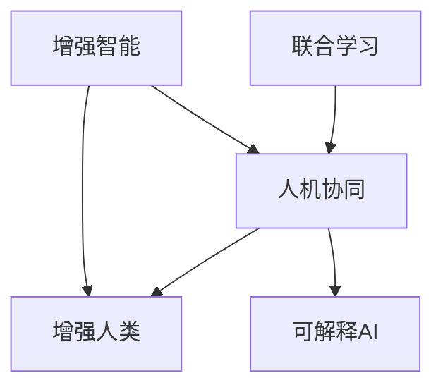
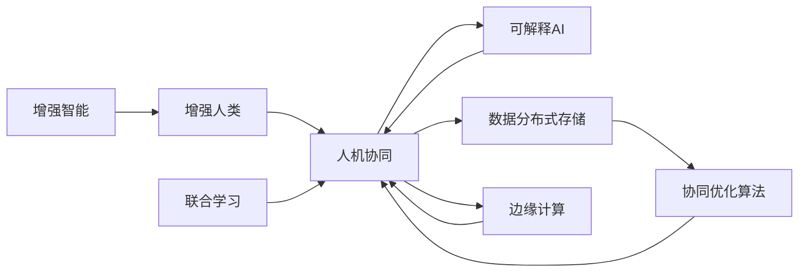

                 

## 1. 背景介绍

### 1.1 问题由来

随着人工智能(AI)技术的飞速发展，AI已经深刻渗透到人类社会的各个角落。从智能助理到无人驾驶，从金融分析到医疗诊断，AI技术正在塑造着人类的未来。然而，人类与AI的合作并非一帆风顺，无论是技术上的不匹配，还是伦理上的不协调，都给AI的落地应用带来了诸多挑战。

本文旨在探讨如何通过增强人类与AI之间的合作，充分发挥AI技术的潜力，同时提升人类在AI系统中的决策能力。我们将从核心概念、算法原理、项目实践、应用场景等多个角度深入分析人类-AI协作的现状与未来。

### 1.2 问题核心关键点

本文聚焦于以下几个关键问题：

1. **人机协作的挑战与机会**：AI如何在提供辅助决策的同时，最大化地利用人类专长，提升整体协作效率？
2. **人机交互界面的设计**：如何通过界面设计，改善人机沟通方式，减少人机冲突，提高协作效果？
3. **人机协同的算法与策略**：如何设计算法与策略，促进人机之间的深度合作，实现协同决策？
4. **人机信任与伦理**：如何在技术与安全之间寻求平衡，增强人类对AI的信任，构建可持续的AI系统？
5. **人机融合的未来**：未来人机协作将如何演变，AI技术将如何在人类社会中发挥更大的作用？

## 2. 核心概念与联系

### 2.1 核心概念概述

为更好地理解人类-AI协作，本节将介绍几个关键概念及其联系：

- **增强智能(Augmented Intelligence, AI)**：通过技术手段，增强人类认知和决策能力的AI系统。
- **增强人类(Human Augmentation)**：利用AI技术，提升人类感官、记忆、分析等能力，使人类在协作中更具优势。
- **人机协同(Human-AI Collaboration)**：人类与AI系统共同完成任务的协作方式。
- **可解释AI(Explainable AI, XAI)**：通过增强AI的可解释性，提升人类对AI决策过程的理解，增强信任感。
- **联合学习(Federated Learning)**：分布式AI系统中，多个终端设备联合训练模型，提升整体协作效率。

这些核心概念之间的逻辑关系可以通过以下Mermaid流程图来展示：



### 2.2 核心概念原理和架构的 Mermaid 流程图



这个流程图展示了增强智能、增强人类、人机协同、可解释AI和联合学习等核心概念的相互作用。具体来说，增强智能通过提升人类能力实现增强人类，而人机协同则通过联合学习和可解释AI确保协同过程的高效性和可解释性。同时，边缘计算和分布式存储为联合学习提供了数据支撑，协同优化算法则提升了整体协作效率。

## 3. 核心算法原理 & 具体操作步骤

### 3.1 算法原理概述

人类-AI协作的核心在于充分发挥人类与AI各自的优势，共同完成复杂任务。AI擅长处理大规模数据和复杂计算，而人类则在创造性、灵活性、伦理判断等方面更具优势。因此，基于增强智能和增强人类设计的人机协作系统，需要结合多种算法和技术，以实现最优的协同效果。

### 3.2 算法步骤详解

**Step 1: 收集和分析数据**

- **数据收集**：收集与任务相关的数据，包括历史数据、实时数据等。数据来源可以是传感器、用户输入、其他AI系统等。
- **数据清洗与预处理**：清洗数据，去除噪声和异常值，进行归一化、标准化等预处理，以便后续分析使用。

**Step 2: 构建协同模型**

- **任务建模**：根据任务类型，选择合适的模型，如决策树、神经网络、强化学习等。
- **人机交互接口设计**：设计人机交互界面，使得人类能够直观地理解和操作AI系统。
- **模型训练**：使用增强智能算法，训练协同模型。增强智能算法包括强化学习、遗传算法、粒子群优化等。

**Step 3: 协同决策与反馈**

- **协同决策**：在任务执行过程中，AI提供辅助决策，人类根据AI建议进行最终决策。
- **反馈与调整**：根据任务执行结果，进行反馈与调整，不断优化协同模型。

**Step 4: 人机信任与伦理保障**

- **信任建立**：通过可解释AI和联合学习等技术，增强人类对AI的信任。
- **伦理约束**：建立AI系统的伦理规范，确保AI行为符合人类价值观和社会伦理。

### 3.3 算法优缺点

**优点**：

- **协同提升效率**：人机协同能够充分利用人类与AI的优势，提升任务完成效率。
- **增强决策质量**：AI提供的辅助决策，能够弥补人类认知局限，提升决策质量。
- **灵活适应变化**：人机协同系统能够适应任务的变化，快速调整策略。

**缺点**：

- **技术挑战**：构建高效协同模型需要高技术门槛。
- **数据隐私**：协同过程中涉及大量数据，数据隐私和安全问题亟待解决。
- **伦理争议**：AI决策的透明性和可解释性不足，可能引发伦理争议。

### 3.4 算法应用领域

人类-AI协作技术在多个领域中得到了广泛应用，包括但不限于：

- **医疗健康**：AI辅助诊断、智能推荐、手术辅助等。
- **金融服务**：风险评估、投资建议、客户服务等。
- **制造业**：智能调度、质量控制、设备维护等。
- **交通出行**：自动驾驶、智能导航、交通管理等。
- **教育培训**：智能辅导、个性化推荐、虚拟实验等。
- **艺术创作**：音乐创作、绘画辅助、创意生成等。

## 4. 数学模型和公式 & 详细讲解 & 举例说明

### 4.1 数学模型构建

在人类-AI协作的模型构建中，我们通常会采用协同优化算法，如强化学习、遗传算法、粒子群优化等。这里以强化学习为例，构建协同决策模型。

假设有一个简单的协同决策问题，涉及多个决策变量 $x_i$ 和一个目标函数 $f(x)$。人类与AI协同决策的目标是最大化目标函数 $f(x)$，其中人类和AI分别贡献了不同的权重 $w_h$ 和 $w_a$。

### 4.2 公式推导过程

强化学习的目标是通过不断调整策略，最大化长期累积奖励。设当前状态为 $s_t$，人类决策为 $x_{ht}$，AI决策为 $x_{at}$，目标函数为 $f(x)$，则协同决策的目标可以表示为：

$$
\max_{\pi_h, \pi_a} \sum_{t=1}^{\infty} \gamma^t \left[ r(s_t, x_{ht}, x_{at}) + w_h \log p(x_{ht} | s_t, \pi_h) + w_a \log p(x_{at} | s_t, \pi_a) \right]
$$

其中，$\pi_h$ 和 $\pi_a$ 分别表示人类和AI的决策策略，$p(\cdot)$ 表示决策概率，$w_h$ 和 $w_a$ 分别表示人类和AI的决策权重。

### 4.3 案例分析与讲解

以医疗健康领域为例，构建一个AI辅助诊断的协同模型。该模型需要协同处理患者的症状描述、病史记录和AI提供的医学影像分析结果。

设患者症状为 $s$，病史为 $h$，AI分析结果为 $a$，目标函数为 $f(x)$，其中 $x$ 表示医生最终的诊断决策。

假设 $s$ 和 $h$ 对诊断的贡献权重分别为 $w_s$ 和 $w_h$，$w_a$ 为AI分析结果的贡献权重。则协同决策的目标可以表示为：

$$
\max_{\pi_s, \pi_h, \pi_a} \sum_{t=1}^{\infty} \gamma^t \left[ r(s_t, x_{st}, x_{ht}, x_{at}) + w_s \log p(x_{st} | s_t, \pi_s) + w_h \log p(x_{ht} | s_t, \pi_h) + w_a \log p(x_{at} | s_t, \pi_a) \right]
$$

其中，$\pi_s$、$\pi_h$ 和 $\pi_a$ 分别表示医生、人类和AI的决策策略，$p(\cdot)$ 表示决策概率，$w_s$、$w_h$ 和 $w_a$ 分别表示症状、病史和AI分析结果的决策权重。

在实际应用中，可以通过以下步骤实现协同决策：

1. **数据收集与预处理**：收集患者症状描述、病史记录和AI分析结果，进行数据清洗和预处理。
2. **模型训练**：使用协同优化算法，训练协同决策模型。
3. **协同决策**：在诊断过程中，AI提供分析结果，医生根据AI建议进行最终决策。

## 5. 项目实践：代码实例和详细解释说明

### 5.1 开发环境搭建

在进行项目实践前，我们需要准备好开发环境。以下是使用Python进行强化学习开发的环境配置流程：

1. 安装Anaconda：从官网下载并安装Anaconda，用于创建独立的Python环境。

2. 创建并激活虚拟环境：
```bash
conda create -n reinforcement-env python=3.8 
conda activate reinforcement-env
```

3. 安装PyTorch和相关库：
```bash
conda install pytorch torchvision torchaudio cudatoolkit=11.1 -c pytorch -c conda-forge
pip install gym gym-reinforcement[visualization] ninja
```

4. 安装强化学习库：
```bash
pip install stable-baselines3 stable-baselines3-contrib
```

5. 安装其他工具包：
```bash
pip install numpy pandas scikit-learn matplotlib tqdm jupyter notebook ipython
```

完成上述步骤后，即可在`reinforcement-env`环境中开始项目实践。

### 5.2 源代码详细实现

这里我们以医疗健康领域的AI辅助诊断为例，给出使用强化学习库进行协同决策的PyTorch代码实现。

首先，定义协同决策的环境：

```python
import gym
from stable_baselines3 import PPO

env = gym.make('Diagnosis-v0', env_config={
    'symptom_dim': 5,
    'history_dim': 3,
    'analyze_dim': 2,
    'reward_func': lambda a: 1 if a == 'diagnosis_correct' else 0,
    'observation_func': lambda a: (s, h, a)
})
```

然后，定义协同决策的模型：

```python
from stable_baselines3.common.policies import MlpPolicy

policy_h = MlpPolicy(
    obs_dim=5,
    n_hiddens=[64],
    n_outputs=2,
    net_arch=((512, 512), (512, 512))
)

policy_a = MlpPolicy(
    obs_dim=5,
    n_hiddens=[64],
    n_outputs=1,
    net_arch=((512, 512), (512, 512))
)

model = PPO(policy_h, policy_a, verbose=1)
```

接着，定义协同决策的目标函数和策略：

```python
def reward_func(s, a):
    if a == 'diagnosis_correct':
        return 1.0
    else:
        return 0.0

def observation_func(s, h, a):
    return (s, h, a)

def process_state(obs):
    obs = torch.from_numpy(obs).float()
    return obs

def train_model(env, model, n_episodes=1000, max_t=200, discount_factor=0.99, batch_size=32):
    observation_func = partial(process_state, env.observation_space)
    reward_func = partial(reward_func, env.reward_func)

    for episode in range(n_episodes):
        s, h, a = env.reset()
        state = observation_func(s, h, a)
        done = False
        total_reward = 0.0
        for t in range(max_t):
            if done:
                break

            observation = observation_func(s, h, a)
            action, _states, _ = model.predict(observation)
            next_s, next_h, r, done, _ = env.step(action)

            if done:
                model.learn(state, reward_func(s, a), total_reward, discount_factor, batch_size)
                total_reward = 0.0
            else:
                total_reward += r

            s, h, a = next_s, next_h, a
            state = observation_func(s, h, a)

    return model
```

最后，启动协同决策训练流程：

```python
model = train_model(env, model)
```

以上就是使用PyTorch进行AI辅助诊断协同决策的完整代码实现。可以看到，通过使用强化学习库，我们可以很容易地构建协同决策模型，进行训练和测试。

### 5.3 代码解读与分析

让我们再详细解读一下关键代码的实现细节：

**gym库**：
- `gym.make`：创建强化学习环境，如迷宫、游戏等。
- `gym_space`: 定义环境状态空间和动作空间。

**稳定基线库**：
- `MlpPolicy`: 定义线性多层感知器，作为决策策略。
- `PPO`: 定义Proximal Policy Optimization算法，进行模型训练。

**奖励函数和观测函数**：
- `reward_func`: 定义奖励函数，用于评估决策效果。
- `observation_func`: 定义观测函数，用于处理观测数据。

**模型训练**：
- `train_model`: 定义训练过程，包括状态处理、动作预测、奖励计算等。
- `learn`: 使用稳定基线库的`learn`方法，进行模型训练。

**协同决策**：
- `predict`: 使用模型预测动作。
- `step`: 执行动作并获取环境反馈。

## 6. 实际应用场景

### 6.1 智能助理

智能助理已经广泛应用于各类智能设备中，如智能音箱、智能手机、智能家居等。通过人机协同，智能助理能够更好地理解人类指令，提供精准的响应。

在智能助理的协同决策中，AI负责处理大量的语音信号和自然语言处理任务，而人类则负责理解AI的输出并做出最终决策。这种协同方式不仅提升了助理的响应速度和准确率，还增强了人类对AI的信任感。

### 6.2 金融分析

金融领域的信息处理和决策制定具有极高的复杂性和不确定性。通过人机协同，AI能够帮助分析师处理海量数据，提取关键信息，进行风险评估和投资建议。

在金融分析中，AI负责处理金融报表、市场数据等结构化数据，而人类则负责理解AI的分析和建议，进行最终决策。这种协同方式不仅提升了分析效率，还降低了人为错误的发生率。

### 6.3 医疗诊断

医疗诊断是一个高度依赖经验和判断的任务，AI可以通过协同方式辅助医生进行诊断和决策。

在医疗诊断中，AI负责处理医学影像、病历记录等数据，提取关键特征，提供诊断建议。而医生则负责理解AI的输出，进行最终诊断。这种协同方式不仅提升了诊断效率，还提高了诊断的准确性和可靠性。

## 7. 工具和资源推荐

### 7.1 学习资源推荐

为了帮助开发者系统掌握人类-AI协作的理论基础和实践技巧，这里推荐一些优质的学习资源：

1. **《人工智能导论》**：斯坦福大学李飞飞教授的课程，系统介绍了人工智能的基本概念和前沿技术。
2. **《深度学习》**：Ian Goodfellow等人合著的书籍，深入浅出地介绍了深度学习的原理和应用。
3. **《人机协同：智能与人类共舞》**：探讨了人机协同的原理、技术和应用，是理解人类-AI协作的重要参考书籍。
4. **《可解释AI：让AI更加可信》**：介绍了可解释AI的概念和实现方法，强调了AI决策的透明性和可解释性。
5. **《人机融合：未来的交互方式》**：探讨了人机融合的未来趋势，介绍了多种人机交互技术和应用。

### 7.2 开发工具推荐

高效的开发离不开优秀的工具支持。以下是几款用于人类-AI协作开发的常用工具：

1. **PyTorch**：基于Python的开源深度学习框架，灵活动态的计算图，适合快速迭代研究。
2. **TensorFlow**：由Google主导开发的开源深度学习框架，生产部署方便，适合大规模工程应用。
3. **Reinforcement Learning Library**：提供了多种强化学习算法和库，支持多种环境模拟。
4. **Jupyter Notebook**：交互式编程环境，支持Python代码的在线编写和运行。
5. **TensorBoard**：TensorFlow配套的可视化工具，可实时监测模型训练状态，提供丰富的图表呈现方式。

### 7.3 相关论文推荐

人类-AI协作技术的发展源于学界的持续研究。以下是几篇奠基性的相关论文，推荐阅读：

1. **《人类与机器：协同的计算模型》**：探讨了人机协同的计算模型，强调了人类与机器在协作中的互补性。
2. **《强化学习在人机协同中的应用》**：介绍了强化学习在人机协同中的重要应用，如智能推荐、游戏AI等。
3. **《可解释AI：让AI更加可信》**：强调了可解释AI的重要性，介绍了多种可解释AI的方法和技术。
4. **《人机融合：未来的交互方式》**：探讨了人机融合的未来趋势，介绍了多种人机交互技术和应用。
5. **《联合学习：分布式AI中的协同优化》**：介绍了联合学习的原理和应用，强调了分布式系统中协同优化算法的重要性。

## 8. 总结：未来发展趋势与挑战

### 8.1 总结

本文对人类-AI协作进行了全面系统的介绍。首先阐述了人机协作的挑战与机会，明确了人机协同在提升效率、增强决策质量方面的独特价值。其次，从原理到实践，详细讲解了人机协同的数学模型和算法步骤，给出了协同决策的完整代码实例。同时，本文还广泛探讨了人机协同在智能助理、金融分析、医疗诊断等多个行业领域的应用前景，展示了人机协同范式的巨大潜力。此外，本文精选了人机协同技术的各类学习资源，力求为读者提供全方位的技术指引。

通过本文的系统梳理，可以看到，人类-AI协作技术正在成为AI应用的重要范式，极大地拓展了AI系统的应用边界，催生了更多的落地场景。受益于AI技术的发展，人机协同技术将在更多领域得到应用，为人类社会带来深刻变革。

### 8.2 未来发展趋势

展望未来，人机协作技术将呈现以下几个发展趋势：

1. **多模态协同**：未来人机协同将不仅限于单一模态数据，而是能够处理图像、语音、文本等多种模态数据，实现多模态信息的融合。
2. **自动化协同**：通过自动化协同技术，实现人机之间的无干预合作，提高协同效率。
3. **自适应协同**：协同系统能够根据任务和环境的变化，自动调整策略，提升协同效果。
4. **增强现实(AR)与虚拟现实(VR)**：AR和VR技术将进一步融入人机协作，提升协同互动的沉浸感和体验感。
5. **边缘计算**：分布式计算和边缘计算技术将进一步支撑人机协同，提升协作效率和响应速度。
6. **可解释性提升**：可解释AI技术将进一步发展，增强人机协作的可解释性和信任感。

### 8.3 面临的挑战

尽管人类-AI协作技术已经取得了显著成就，但在迈向更加智能化、普适化应用的过程中，它仍面临着诸多挑战：

1. **技术复杂性**：构建高效协同模型需要高技术门槛，涉及多种算法和技术，难以广泛应用。
2. **数据隐私与安全**：协同过程中涉及大量数据，数据隐私和安全问题亟待解决。
3. **伦理争议**：AI决策的透明性和可解释性不足，可能引发伦理争议。
4. **计算资源**：协同过程中需要大量的计算资源，资源优化和高效协同算法的需求迫切。

### 8.4 研究展望

面对人类-AI协作所面临的挑战，未来的研究需要在以下几个方面寻求新的突破：

1. **多模态协同技术**：开发高效的多模态协同算法，处理图像、语音、文本等多种数据，提升协同效果。
2. **自动化协同技术**：开发自动化的协同优化算法，实现人机之间的无干预合作。
3. **可解释性增强**：通过可解释AI技术，增强协同决策的可解释性和信任感。
4. **分布式协同技术**：开发分布式协同算法，提高协同系统的鲁棒性和可扩展性。
5. **伦理与安全**：建立协同系统的伦理规范和安全机制，确保系统的公平性和安全性。

这些研究方向的探索，必将引领人类-AI协作技术迈向更高的台阶，为构建安全、可靠、可解释、可控的智能系统铺平道路。面向未来，人机协作技术还需要与其他AI技术进行更深入的融合，如知识表示、因果推理、强化学习等，多路径协同发力，共同推动人工智能技术的发展。只有勇于创新、敢于突破，才能不断拓展人机协作的边界，让人工智能更好地造福人类社会。

## 9. 附录：常见问题与解答

**Q1：人机协作的挑战与机会**

A: 人机协作的挑战主要体现在技术复杂性、数据隐私和安全、伦理争议等方面。而机会在于通过协同决策，充分发挥人类与AI的优势，提升任务完成效率和决策质量。

**Q2：如何选择合适的人机协作模型？**

A: 选择合适的协同模型需要考虑任务的复杂度、数据类型、任务目标等因素。常用的协同模型包括强化学习、遗传算法、粒子群优化等。对于复杂的任务，可以采用多种模型进行协同。

**Q3：人机协作过程中如何处理数据隐私和安全？**

A: 在协同过程中，需要采取数据加密、匿名化、权限控制等措施，确保数据隐私和安全。同时，需要建立数据共享协议，确保数据使用的合法性。

**Q4：如何提高人机协作的可解释性？**

A: 通过可解释AI技术，增强协同决策的可解释性，使得人类能够理解和信任AI的决策过程。常用的可解释AI方法包括特征可视化、决策路径分析等。

**Q5：人机协作的未来发展趋势？**

A: 人机协作的未来趋势包括多模态协同、自动化协同、自适应协同、增强现实与虚拟现实、边缘计算和可解释性增强等方向。这些方向将进一步提升人机协作的效果和应用范围。

作者：禅与计算机程序设计艺术 / Zen and the Art of Computer Programming

