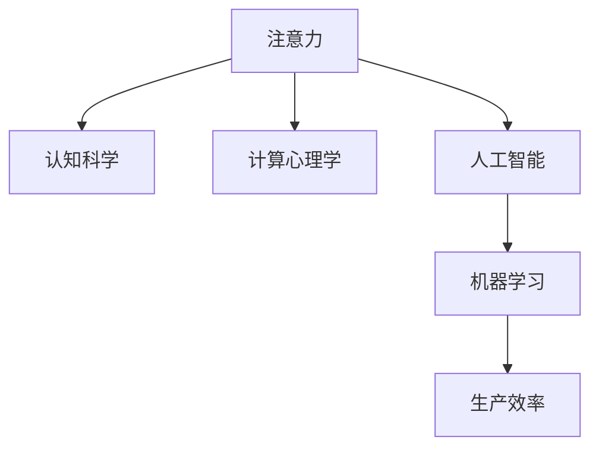

                 

# 人类注意力增强：提升生产力和效率

> 关键词：注意力增强,认知科学,计算心理学,人工智能,机器学习,生产效率,算法优化

## 1. 背景介绍

### 1.1 问题由来

在信息爆炸的时代，人们每天需要处理大量信息，工作和生活效率常常受限于注意力资源的有限性。尽管各种辅助工具不断涌现，但从根本上提升注意力资源的利用效率仍是一个长期挑战。特别是对于深度思考、创意创新类工作，注意力资源的优化更加重要。如何有效增强人类注意力，使其在复杂环境中高效运作，成为当前人工智能研究的前沿热点。

### 1.2 问题核心关键点

本文聚焦于“注意力增强”这一核心问题，探讨利用人工智能技术提升人类注意力的具体方法。注意力增强旨在通过对用户注意力行为进行建模和分析，引导用户集中注意力于核心任务，从而提升整体生产力和效率。本文将详细介绍注意力增强的核心概念、算法原理以及实际应用场景，并分析面临的挑战与未来趋势。

## 2. 核心概念与联系

### 2.1 核心概念概述

为更好地理解注意力增强，本文将介绍几个密切相关的核心概念：

- 注意力(Attention)：人类认知过程中的核心机制之一，指对环境刺激的选择性反应。注意力增强即通过计算模型模拟人类注意力过程，辅助用户筛选重要信息。

- 认知科学(Cognitive Science)：研究人类认知过程的科学，包括感知、记忆、思维、情感等方面。注意力增强需结合认知科学理论，设计符合人类认知心理的模型。

- 计算心理学(Computational Psychology)：应用计算模型模拟人类心理过程，关注模型与真实行为之间的匹配度。注意力增强需要引入计算心理学，提升模型预测准确性。

- 人工智能(Artificial Intelligence, AI)：基于算法和大数据，实现各种智能化功能的技术。注意力增强利用AI技术进行注意力行为建模和预测。

- 机器学习(Machine Learning, ML)：训练模型以自动完成特定任务，提升自动化程度。注意力增强基于机器学习，自动分析用户注意力数据，进行智能化干预。

- 生产效率(Productivity)：衡量完成特定任务所需的时间和工作质量，目标是通过注意力增强提升这一指标。

这些核心概念之间的逻辑关系可以通过以下Mermaid流程图来展示：



这个流程图展示了这个概念体系的基本框架：

1. 注意力是基础，是认知和计算心理学的研究对象。
2. 认知科学指导注意力增强的理论设计。
3. 计算心理学通过模拟注意力行为，提升模型的真实性。
4. 人工智能提供自动化工具，训练注意力增强模型。
5. 机器学习实现模型优化，自动适应用户需求。
6. 生产效率是最终的评价指标。

## 3. 核心算法原理 & 具体操作步骤
### 3.1 算法原理概述

注意力增强的核心算法基于注意力机制，通过分析用户的行为和生理数据，模拟人类注意力过程。其基本流程包括：

1. **数据采集**：收集用户在工作和学习时的行为数据和生理数据，如鼠标移动轨迹、键盘输入频率、心率、脑电波等。
2. **数据处理**：对原始数据进行清洗、降噪和特征提取，得到可用于注意力分析的数据集。
3. **模型训练**：使用机器学习算法训练注意力增强模型，学习用户注意力和生产效率之间的关联。
4. **实时预测**：将实时采集的用户数据输入模型，预测当前注意力状态和生产效率，提供干预建议。

### 3.2 算法步骤详解

本节将详细讲解注意力增强的算法步骤。

**Step 1: 数据采集**
- 用户行为数据：通过鼠标轨迹、键盘输入等传感器采集用户操作数据。
- 生理数据：使用心率监测、脑电波等设备获取用户的生理状态。
- 环境数据：通过环境监测设备获取噪音、光线等环境因素，影响用户的注意力状态。

**Step 2: 数据处理**
- 数据清洗：去除异常数据和噪声，确保数据集的质量。
- 特征提取：从原始数据中提取有用的特征，如用户专注时长、多任务处理能力等。
- 数据标准化：对不同模态的数据进行归一化处理，便于模型训练和预测。

**Step 3: 模型训练**
- 选择机器学习算法：如随机森林、神经网络等。
- 划分训练集和测试集：将数据集分为训练和测试两个部分，评估模型预测效果。
- 交叉验证：使用交叉验证技术，避免过拟合，提升模型泛化能力。
- 模型调参：调整学习率、正则化参数等超参数，优化模型性能。

**Step 4: 实时预测**
- 实时数据采集：对用户行为和生理数据进行实时监测。
- 模型输入处理：将实时数据输入到模型中，计算当前注意力状态和生产效率。
- 结果输出：根据预测结果，向用户提供注意力干预建议，如休息提醒、任务优先级调整等。

### 3.3 算法优缺点

注意力增强算法具有以下优点：
1. 提高生产效率：通过实时干预，引导用户集中注意力，提升工作效率。
2. 个性化定制：基于用户行为和生理数据，进行个性化优化，满足不同用户需求。
3. 自动化程度高：利用机器学习算法，实现自动化分析和管理。
4. 实时反馈：实时监测和预测，及时调整注意力状态，避免过劳和疲劳。

同时，该算法也存在一些局限：
1. 数据隐私问题：采集和分析用户数据涉及隐私保护，需要合法合规。
2. 模型复杂度高：高维数据的处理和模型训练，对计算资源需求较高。
3. 模型依赖性：依赖训练数据的数量和质量，对数据采集和处理要求较高。
4. 鲁棒性不足：面对复杂多变的环境，模型预测可能出现偏差。
5. 用户接受度：用户习惯和心理差异较大，模型干预效果可能受到抵制。

尽管存在这些局限，但总体而言，注意力增强算法在提升生产效率、个性化服务方面具有显著优势，值得深入研究和推广。

### 3.4 算法应用领域

注意力增强算法可以应用于多个领域，例如：

- 办公自动化：通过监控和预测，优化办公环境，提高员工工作效率。
- 教育培训：分析学生注意力状态，调整教学策略，提高学习效果。
- 医疗健康：监测病人注意力变化，提供治疗建议，提高康复速度。
- 创意设计：通过实时反馈，调整工作节奏，激发创意灵感。
- 游戏娱乐：分析用户游戏行为，提供游戏策略，提升游戏体验。

除了上述这些应用场景外，注意力增强技术还可扩展到更多领域，如智能交通、金融风险管理等，为各行各业提供智能化决策支持。

## 4. 数学模型和公式 & 详细讲解 & 举例说明

### 4.1 数学模型构建

本节将使用数学语言对注意力增强的算法进行更加严格的刻画。

记用户行为数据为 $X$，生理数据为 $Y$，环境数据为 $Z$，注意力状态为 $A$，生产效率为 $P$。注意力增强模型 $M$ 的输入为 $(x,y,z)$，输出为 $(a,p)$。目标函数为：

$$
\min_{M} \mathcal{L}(M) = \sum_{i=1}^n \left[\ell_{\text{注意力}}(a_i, A) + \ell_{\text{生产效率}}(p_i, P)\right]
$$

其中 $\ell_{\text{注意力}}$ 和 $\ell_{\text{生产效率}}$ 分别为注意力状态和生产效率的损失函数。

### 4.2 公式推导过程

以注意力状态和生产效率预测为例，设注意力状态 $A$ 可以表示为：

$$
A = f(x, y, z; \theta)
$$

生产效率 $P$ 可以表示为：

$$
P = g(a, z; \phi)
$$

其中 $f$ 和 $g$ 分别为注意力状态和生产效率的预测函数，$\theta$ 和 $\phi$ 为模型参数。

在模型训练阶段，利用交叉熵损失函数 $\ell$，优化模型参数：

$$
\theta, \phi = \mathop{\arg\min}_{\theta, \phi} \frac{1}{N}\sum_{i=1}^N \ell(A_i, f(x_i, y_i, z_i; \theta)) + \ell(P_i, g(a_i, z_i; \phi))
$$

在实时预测阶段，将实时采集的数据 $x, y, z$ 输入到模型 $M$ 中，预测当前注意力状态 $a$ 和生产效率 $p$：

$$
a = M(x, y, z; \theta)
$$

$$
p = g(a, z; \phi)
$$

### 4.3 案例分析与讲解

以下以教育培训场景为例，具体讲解注意力增强模型的应用：

**案例背景**：某在线教育平台希望通过注意力增强技术提升学生学习效果。平台收集学生在电脑上的操作行为（如点击、滑动、拖拽）、生理数据（如心率、脑电波）和环境数据（如噪音水平），用于分析学生的注意力状态和学习效果。

**模型构建**：
- 输入特征：鼠标轨迹、键盘输入频率、心率、脑电波等。
- 注意力状态预测：使用深度神经网络，预测学生当前是否处于专注状态。
- 生产效率预测：基于注意力状态和噪音水平，预测学生的学习效率。

**训练与评估**：
- 训练数据：收集学生一个月的学习数据，标记每个时间点学生的专注状态和学习效率。
- 模型评估：在测试集上评估模型预测准确性，选择最优模型进行部署。

**实时应用**：
- 实时监测：通过传感器实时采集学生行为和生理数据。
- 预测反馈：根据预测结果，向学生提供专注度提醒和学习效率建议。
- 动态调整：根据预测结果调整课程难度和节奏，提升学习体验。

## 5. 项目实践：代码实例和详细解释说明
### 5.1 开发环境搭建

在进行注意力增强项目开发前，需要准备好开发环境。以下是使用Python进行TensorFlow开发的环境配置流程：

1. 安装Anaconda：从官网下载并安装Anaconda，用于创建独立的Python环境。

2. 创建并激活虚拟环境：
```bash
conda create -n attention-env python=3.8 
conda activate attention-env
```

3. 安装TensorFlow：根据CUDA版本，从官网获取对应的安装命令。例如：
```bash
conda install tensorflow -c tensorflow -c conda-forge
```

4. 安装TensorBoard：
```bash
pip install tensorboard
```

5. 安装PyTorch：
```bash
pip install torch torchvision torchaudio
```

6. 安装各类工具包：
```bash
pip install numpy pandas scikit-learn matplotlib tqdm jupyter notebook ipython
```

完成上述步骤后，即可在`attention-env`环境中开始项目实践。

### 5.2 源代码详细实现

以下是一个简单的注意力增强模型实现的示例代码：

```python
import tensorflow as tf
import numpy as np
from sklearn.model_selection import train_test_split

# 构造输入数据
X = np.random.randn(100, 5)  # 行为特征
Y = np.random.randn(100)     # 生理特征
Z = np.random.randn(100)     # 环境特征
A = np.random.randn(100)     # 注意力状态
P = np.random.randn(100)     # 生产效率

# 分割数据集
X_train, X_test, A_train, A_test, P_train, P_test = train_test_split(X, A, P, test_size=0.2)

# 定义模型
class AttentionEnhancer(tf.keras.Model):
    def __init__(self):
        super(AttentionEnhancer, self).__init__()
        self.fc1 = tf.keras.layers.Dense(32, activation='relu')
        self.fc2 = tf.keras.layers.Dense(1)
        self.fc3 = tf.keras.layers.Dense(1)
        
    def call(self, inputs):
        x, y, z = inputs
        x = self.fc1(x)
        y = self.fc1(y)
        z = self.fc1(z)
        a = self.fc2(tf.concat([x, y, z], axis=1))
        p = self.fc3(a)
        return a, p

# 构建模型
model = AttentionEnhancer()

# 定义损失函数
def attention_loss(a, a_pred):
    return tf.reduce_mean(tf.square(a_pred - a))

def productivity_loss(p, p_pred):
    return tf.reduce_mean(tf.square(p_pred - p))

# 定义优化器
optimizer = tf.keras.optimizers.Adam(learning_rate=0.001)

# 训练模型
@tf.function
def train_step(inputs):
    with tf.GradientTape() as tape:
        a_pred, p_pred = model(inputs)
        loss_attention = attention_loss(a, a_pred)
        loss_productivity = productivity_loss(p, p_pred)
        total_loss = loss_attention + loss_productivity
    gradients = tape.gradient(total_loss, model.trainable_variables)
    optimizer.apply_gradients(zip(gradients, model.trainable_variables))
    return loss_attention.numpy(), loss_productivity.numpy()

# 训练循环
for epoch in range(10):
    epoch_loss_attention = 0
    epoch_loss_productivity = 0
    for i in range(100):
        loss_attention, loss_productivity = train_step([X_train[i], Y_train[i], Z_train[i]])
        epoch_loss_attention += loss_attention
        epoch_loss_productivity += loss_productivity
    print(f'Epoch {epoch+1}, attention loss: {epoch_loss_attention/100:.4f}, productivity loss: {epoch_loss_productivity/100:.4f}')

# 测试模型
@tf.function
def test_step(inputs):
    a_pred, p_pred = model(inputs)
    return a_pred.numpy(), p_pred.numpy()

# 测试集测试
for i in range(100):
    a_pred, p_pred = test_step([X_test[i], Y_test[i], Z_test[i]])
    print(f'Prediction: attention {a_pred}, productivity {p_pred}')

```

### 5.3 代码解读与分析

让我们再详细解读一下关键代码的实现细节：

**AttentionEnhancer类**：
- `__init__`方法：初始化模型，定义多个全连接层。
- `call`方法：实现模型前向传播。
- 模型预测注意力状态 $a$ 和生产效率 $p$。

**损失函数**：
- `attention_loss`：计算注意力状态的预测误差。
- `productivity_loss`：计算生产效率的预测误差。
- 两个损失函数相加，作为总损失函数。

**优化器**：
- 使用Adam优化器，学习率为0.001。
- 在训练步中计算梯度，应用梯度更新模型参数。

**训练循环**：
- 对每个epoch，循环训练100次，记录每次训练的注意力和生产效率损失。
- 打印每个epoch的平均损失。

**测试模型**：
- 在测试集上对模型进行前向传播，输出预测结果。

可以看到，使用TensorFlow搭建注意力增强模型的代码实现相对简洁，有利于快速迭代和实验。

## 6. 实际应用场景
### 6.1 办公自动化

注意力增强在办公自动化中的应用，主要通过监测和预测员工注意力状态，优化工作环境，提升工作效率。

具体而言，可以安装鼠标轨迹、键盘输入等传感器，采集员工在工作时的行为数据。通过分析这些数据，识别员工分心、疲劳等注意力状态，自动调整显示器亮度、背景音色等环境因素，引导员工集中注意力。例如，在员工专注度较低时，降低噪音水平，增加背景照明，提高工作效率。

### 6.2 教育培训

在教育培训中，注意力增强技术可以帮助教师更好地了解学生的注意力状态，优化教学策略，提升学习效果。

通过监测学生鼠标轨迹、键盘输入、注意力测验等数据，预测学生的专注度和学习效率。教师可以根据预测结果，调整课程内容和节奏，提供个性化辅导。例如，在学生注意力低下时，进行短暂休息，调整课程难度，激发学习兴趣。

### 6.3 医疗健康

医疗领域中，注意力增强技术可以监测病人的注意力变化，提供治疗建议，提升康复速度。

通过采集病人的心率、脑电波等生理数据，监测其注意力状态。结合病人的病历和症状，预测注意力变化对病情的影响。例如，在病人注意力下降时，调整治疗方案，减轻疲劳，提高治疗效果。

### 6.4 创意设计

在创意设计过程中，注意力增强技术可以帮助设计师提高创作效率，激发创意灵感。

通过实时监测设计师的操作行为和生理数据，预测其注意力状态和工作效率。根据预测结果，提醒设计师进行短暂休息，调整工作节奏，激发创意灵感。例如，在设计师注意力较低时，提供创意提示，调整设计思路。

### 6.5 游戏娱乐

在游戏娱乐领域，注意力增强技术可以提高玩家的游戏体验，提升游戏操作精准度。

通过监测玩家的游戏行为和生理数据，预测其注意力状态。根据预测结果，调整游戏难度和节奏，提供个性化游戏策略。例如，在玩家注意力低下时，提供任务提示，调整游戏节奏，提高游戏体验。

## 7. 工具和资源推荐
### 7.1 学习资源推荐

为了帮助开发者系统掌握注意力增强的理论基础和实践技巧，这里推荐一些优质的学习资源：

1. 《Attention is All You Need》系列博文：由大模型技术专家撰写，深入浅出地介绍了注意力机制的原理和应用。

2. CS231n《深度学习计算机视觉》课程：斯坦福大学开设的计算机视觉课程，介绍了注意力机制在图像识别中的应用。

3. 《Deep Learning》书籍：深度学习领域的经典教材，全面介绍了注意力增强的技术原理和应用场景。

4. TensorFlow官方文档：TensorFlow的详细文档，提供了丰富的API和示例代码，方便开发者快速上手。

5. Coursera《机器学习》课程：由斯坦福大学教授讲授，介绍了机器学习的基本概念和注意力增强的技术应用。

通过对这些资源的学习实践，相信你一定能够快速掌握注意力增强的精髓，并用于解决实际的注意力问题。

### 7.2 开发工具推荐

高效的开发离不开优秀的工具支持。以下是几款用于注意力增强开发的常用工具：

1. TensorFlow：基于Python的开源深度学习框架，适合构建高效的神经网络模型。

2. PyTorch：由Facebook开发的深度学习框架，灵活动态，适合研究性项目开发。

3. TensorBoard：TensorFlow配套的可视化工具，可实时监测模型训练状态，提供丰富的图表展示。

4. Jupyter Notebook：开源的交互式编程环境，方便开发者进行模型实验和数据分析。

5. Weights & Biases：模型训练的实验跟踪工具，记录和可视化模型训练过程中的各项指标，方便对比和调优。

合理利用这些工具，可以显著提升注意力增强系统的开发效率，加快创新迭代的步伐。

### 7.3 相关论文推荐

注意力增强技术的发展源于学界的持续研究。以下是几篇奠基性的相关论文，推荐阅读：

1. Attention is All You Need（即Transformer原论文）：提出了Transformer结构，奠定了注意力增强的理论基础。

2. BERT: Pre-training of Deep Bidirectional Transformers for Language Understanding：提出BERT模型，引入掩码语言模型进行预训练，提升注意力增强的效果。

3. Gated Attention for Sequential Data（GA4SD）：提出基于门控机制的注意力模型，增强模型的灵活性和可解释性。

4. Self-Attention Gated Recurrent Unit（SAGRU）：提出基于自注意力机制的循环神经网络，解决长序列问题，提高注意力增强的泛化能力。

5. Spatial-Temporal Attention for Activity Recognition（STAR）：提出时空注意力机制，应用于活动识别任务，提升注意力增强的应用效果。

这些论文代表了大注意力增强技术的发展脉络。通过学习这些前沿成果，可以帮助研究者把握学科前进方向，激发更多的创新灵感。

## 8. 总结：未来发展趋势与挑战
### 8.1 总结

本文对注意力增强技术进行了全面系统的介绍。首先阐述了注意力增强在提升生产力和效率方面的重要性，明确了注意力增强的目标和应用价值。其次，从原理到实践，详细讲解了注意力增强的数学模型和算法流程，给出了完整的代码实现。同时，本文还广泛探讨了注意力增强技术在多个行业领域的应用前景，展示了其巨大的潜力。此外，本文精选了注意力增强技术的各类学习资源，力求为读者提供全方位的技术指引。

通过本文的系统梳理，可以看到，注意力增强技术在提升人类注意力的过程中，具有重要的应用价值和广泛的应用前景。未来，随着技术的不断发展和创新，注意力增强必将成为提升生产效率、个性化服务的重要工具。

### 8.2 未来发展趋势

展望未来，注意力增强技术将呈现以下几个发展趋势：

1. 技术融合：注意力增强与认知计算、计算心理学等领域的交叉融合，进一步提升模型的预测准确性。

2. 多模态应用：引入图像、语音等多模态数据，增强模型对复杂环境的适应能力。

3. 实时反馈：通过实时数据监测和预测，及时调整注意力状态，提高工作效率。

4. 智能化优化：结合机器学习和强化学习，进行动态优化，提升模型自适应性。

5. 个性化服务：基于用户行为和生理数据，提供个性化的注意力增强策略。

6. 跨领域应用：拓展到更多行业领域，如金融、制造业、农业等，提升各行业的智能化水平。

以上趋势凸显了注意力增强技术的广阔前景。这些方向的探索发展，必将进一步提升模型的预测能力，优化注意力管理，为各行业带来智能化提升。

### 8.3 面临的挑战

尽管注意力增强技术已经取得了一定的进展，但在迈向更加智能化、普适化应用的过程中，它仍面临诸多挑战：

1. 数据隐私问题：采集和分析用户数据涉及隐私保护，需要合法合规。

2. 模型复杂度高：高维数据的处理和模型训练，对计算资源需求较高。

3. 模型依赖性：依赖训练数据的数量和质量，对数据采集和处理要求较高。

4. 鲁棒性不足：面对复杂多变的环境，模型预测可能出现偏差。

5. 用户接受度：用户习惯和心理差异较大，模型干预效果可能受到抵制。

尽管存在这些挑战，但总体而言，注意力增强技术在提升生产效率、个性化服务方面具有显著优势，值得深入研究和推广。

### 8.4 研究展望

面对注意力增强面临的种种挑战，未来的研究需要在以下几个方面寻求新的突破：

1. 探索无监督和半监督学习：摆脱对大规模标注数据的依赖，利用自监督学习、主动学习等无监督和半监督范式，最大限度利用非结构化数据，实现更加灵活高效的注意力增强。

2. 研究参数高效和计算高效的增强方法：开发更加参数高效的注意力增强方法，在固定大部分预训练参数的同时，只更新极少量的任务相关参数。同时优化模型计算图，减少前向传播和反向传播的资源消耗，实现更加轻量级、实时性的部署。

3. 融合因果和对比学习范式：通过引入因果推断和对比学习思想，增强注意力增强模型建立稳定因果关系的能力，学习更加普适、鲁棒的语言表征，从而提升模型泛化性和抗干扰能力。

4. 引入更多先验知识：将符号化的先验知识，如知识图谱、逻辑规则等，与神经网络模型进行巧妙融合，引导注意力增强过程学习更准确、合理的注意力模型。同时加强不同模态数据的整合，实现视觉、语音等多模态信息与文本信息的协同建模。

5. 结合因果分析和博弈论工具：将因果分析方法引入注意力增强模型，识别出模型决策的关键特征，增强输出解释的因果性和逻辑性。借助博弈论工具刻画人机交互过程，主动探索并规避模型的脆弱点，提高系统稳定性。

6. 纳入伦理道德约束：在模型训练目标中引入伦理导向的评估指标，过滤和惩罚有偏见、有害的输出倾向。同时加强人工干预和审核，建立模型行为的监管机制，确保输出符合人类价值观和伦理道德。

这些研究方向的探索，必将引领注意力增强技术迈向更高的台阶，为构建安全、可靠、可解释、可控的智能系统铺平道路。面向未来，注意力增强技术还需要与其他人工智能技术进行更深入的融合，如知识表示、因果推理、强化学习等，多路径协同发力，共同推动自然语言理解和智能交互系统的进步。只有勇于创新、敢于突破，才能不断拓展注意力增强技术的边界，让智能技术更好地造福人类社会。

## 9. 附录：常见问题与解答

**Q1：注意力增强与传统注意力提升方法有何不同？**

A: 注意力增强技术通过自动化、智能化手段，实时监测和预测用户注意力状态，提供个性化的注意力干预策略。与传统的人工干预和机械提醒方法相比，注意力增强技术具有以下优势：
1. 实时监测：通过实时采集用户行为和生理数据，实时预测注意力状态，及时调整环境因素。
2. 个性化干预：基于用户行为和生理数据，提供个性化的注意力管理策略，满足不同用户需求。
3. 自动化优化：利用机器学习算法，自动调整注意力管理策略，提升效率和效果。

**Q2：注意力增强对隐私保护有哪些要求？**

A: 注意力增强技术需要采集和分析用户的各类数据，涉及用户隐私保护问题。为确保合规合法，需注意以下几点：
1. 数据匿名化：在数据采集和处理过程中，采用匿名化、去标识化技术，保护用户隐私。
2. 数据最小化：仅采集必要的数据，避免过度采集和存储。
3. 用户知情同意：在数据采集前，告知用户数据用途，获得用户明确同意。
4. 数据加密存储：采用加密技术存储和传输用户数据，防止数据泄露。

**Q3：注意力增强如何提升生产效率？**

A: 注意力增强通过实时监测和预测用户注意力状态，自动调整环境因素，引导用户集中注意力，从而提升工作效率。具体提升方式包括：
1. 减少干扰：通过实时监测用户行为，识别和减少干扰因素，如噪音、多任务处理等。
2. 调整节奏：根据用户注意力状态，动态调整工作节奏，避免疲劳和分心。
3. 个性化策略：基于用户行为和生理数据，提供个性化的注意力管理策略，提高用户满意度。

**Q4：注意力增强技术在教育培训中的应用前景如何？**

A: 在教育培训中，注意力增强技术可以显著提升教学效果和学生学习效率。具体应用包括：
1. 实时监测：通过实时监测学生注意力状态，及时调整教学策略，提高学习效果。
2. 个性化辅导：根据学生注意力状态，提供个性化辅导和资源推荐，提升学习体验。
3. 动态调整：结合学生注意力和生理数据，动态调整课程内容和难度，优化教学过程。

**Q5：注意力增强技术在医疗健康中的应用难点有哪些？**

A: 在医疗健康领域，注意力增强技术面临一些应用难点，主要包括以下几点：
1. 数据采集难度：医疗环境中采集生理数据相对困难，需要专业设备支持。
2. 数据多样性：生理数据类型多样，数据格式和单位不一致，需要统一处理。
3. 隐私保护：医疗数据涉及患者隐私，需要严格的数据保护措施。
4. 模型鲁棒性：医疗环境复杂多变，模型需要具备较高的鲁棒性和泛化能力。

尽管存在这些难点，但通过合理的技术设计和应用，注意力增强技术仍可以在医疗健康领域发挥重要作用，提升患者的康复速度和治疗效果。

---

作者：禅与计算机程序设计艺术 / Zen and the Art of Computer Programming

