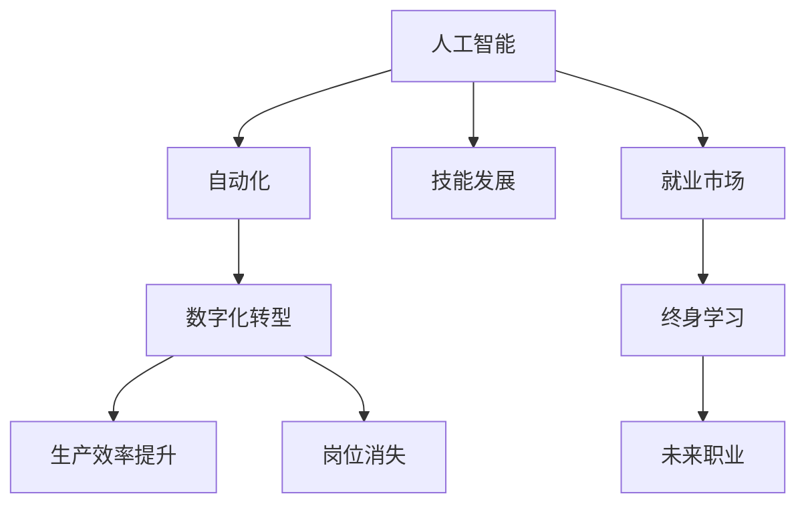

                 

# 人类计算：AI时代的未来就业市场趋势与技能发展

> 关键词：人工智能(AI), 自动化, 技能发展, 就业市场, 未来职业

## 1. 背景介绍

### 1.1 问题由来
随着人工智能(AI)技术的飞速发展，自动化和数字化转型已经渗透到各个行业和职业领域。AI不仅改变了企业的运营方式，也深刻影响了人类的工作方式和生活方式。虽然AI技术带来了巨大的生产效率提升和新的就业机会，但同样也引发了一系列关于就业市场和未来工作的担忧和困惑。

AI技术的发展使得机器能自动执行重复性高、规律性强的工作，这导致部分岗位的消失和传统劳动市场的重塑。同时，AI技术的强大计算能力还延伸到了原本需要人类进行大量计算的领域，如数据分析、科学计算、工程仿真等，进而对人类的计算能力提出了新的挑战。

### 1.2 问题核心关键点
AI时代对人类计算能力的影响，核心在于以下几个关键点：
1. **自动化替代**：AI自动化技术取代了许多重复性、规律性强的岗位，导致对人类劳动力的需求减少。
2. **计算能力提升**：AI强大的计算能力延伸到复杂、高难度的问题领域，对人类计算能力提出新挑战。
3. **技能结构变化**：AI时代的技能需求发生了变化，需要培养更多具备创新能力、跨领域协作能力的人才。
4. **终身学习**：为了适应AI技术的发展，个人需要持续学习和技能更新，避免被技术淘汰。
5. **未来职业发展**：AI时代创造了新的就业机会，同时也为未来职业发展提供了新的方向和可能性。

### 1.3 问题研究意义
研究AI时代的就业市场趋势与技能发展，对于理解AI技术的未来走向，引导教育体系改革，以及帮助个人做出职业规划具有重要意义：

1. **政策制定**：了解AI对就业市场的影响，有助于政府制定相应的就业政策，平衡AI发展和人类就业的关系。
2. **教育改革**：基于未来职业需求的变化，调整教育体系，培养适应AI时代的未来人才。
3. **职业规划**：为个人提供关于未来职业发展的清晰指引，帮助其在AI时代找到合适的就业方向。
4. **企业战略**：指导企业在AI时代调整人才招聘和培训策略，优化人力资源配置。

## 2. 核心概念与联系

### 2.1 核心概念概述

为了更好地理解AI时代就业市场和技能发展的趋势，本节将介绍几个密切相关的核心概念：

- **人工智能(AI)**：通过计算机模拟人类的智能行为，包括学习、推理、感知等能力。AI的应用范围广泛，涉及自然语言处理、计算机视觉、机器人学等多个领域。

- **自动化**：指使用机器和计算机系统代替人类执行任务的过程。自动化提升了生产效率，但也带来了部分岗位的消失。

- **数字化转型**：企业通过引入数字化技术，提升运营效率和业务创新能力的过程。数字化转型加速了AI技术的普及应用。

- **技能发展**：指通过教育和培训，使个人获得适应未来工作的技能和知识的过程。技能发展是应对AI时代挑战的重要手段。

- **就业市场**：由供需双方构成，反映了劳动力和岗位的匹配情况。AI时代就业市场将经历重大变化。

- **终身学习**：指个人在其职业生涯中持续学习和技能提升的过程，适应技术快速迭代的需求。

这些核心概念之间的逻辑关系可以通过以下Mermaid流程图来展示：



这个流程图展示了大语言模型的核心概念及其之间的关系：

1. 人工智能通过自动化和数字化转型提升生产效率，但同时也导致部分岗位的消失。
2. 技能发展是应对自动化和AI技术挑战的重要手段。
3. 就业市场在AI时代将经历重塑，新的职业机会也将不断涌现。
4. 终身学习是个人适应未来技术发展的必要途径。
5. 新的职业机会将推动未来职业的发展和变革。

## 3. 核心算法原理 & 具体操作步骤
### 3.1 算法原理概述

在AI时代，对人类计算能力的影响主要通过以下几个方面体现：

- **自动化替代**：AI通过自动化技术取代了许多重复性、规律性强的岗位。例如，自动驾驶技术可以取代长途运输司机的工作，机器视觉可以替代部分制造业的质检工作。

- **计算能力提升**：AI强大的计算能力延伸到了复杂、高难度的问题领域，如数据分析、科学计算、工程仿真等。这使得原本需要人类进行大量计算的任务，现在可以由AI在短时间内完成。

- **技能结构变化**：AI时代的技能需求发生了变化，需要培养更多具备创新能力、跨领域协作能力的人才。例如，数据科学家、机器学习工程师、AI产品经理等新职业应运而生。

- **终身学习**：为了适应AI技术的发展，个人需要持续学习和技能更新，避免被技术淘汰。例如，通过在线课程、职业培训等方式不断提升自身技能。

### 3.2 算法步骤详解

AI时代对人类计算能力的影响，可以通过以下几个关键步骤进行分析：

**Step 1: 数据收集与分析**
- 收集当前就业市场的各类数据，包括岗位需求、技能要求、职业变化等。
- 使用数据分析方法，如回归分析、聚类分析等，识别出当前市场中的趋势和变化。

**Step 2: 技术应用预测**
- 基于当前技术发展趋势，预测未来AI技术对各行业的冲击。
- 使用机器学习模型，如时间序列预测、分类模型等，预测未来职业的需求变化。

**Step 3: 技能匹配与优化**
- 将未来职业需求与当前技能供给进行匹配，识别出技能缺口和优化方向。
- 开发技能培训课程和认证机制，提升个人技能水平，适应未来职业需求。

**Step 4: 政策建议与实施**
- 基于技术预测和技能分析，提出相应的政策建议，如职业培训、教育改革等。
- 推动政策实施，支持企业和个人适应AI时代的变化。

**Step 5: 持续监测与调整**
- 持续监测就业市场和技术发展情况，及时调整政策和培训计划。
- 引入反馈机制，评估政策实施效果，优化调整策略。

### 3.3 算法优缺点

AI时代对人类计算能力的影响，有以下优缺点：

**优点**：
- **效率提升**：自动化技术提高了生产效率，减少了人力成本。
- **知识传播**：AI技术的应用推广了知识普及，提升了社会整体的计算能力。
- **创新驱动**：AI技术推动了新产业和新职业的产生，促进了社会创新。

**缺点**：
- **岗位替代**：自动化技术导致部分低技能岗位消失，增加了就业压力。
- **技能过时**：快速的技术迭代使得部分技能迅速过时，需要持续学习和更新。
- **职业不稳定性**：AI时代的新职业更迭迅速，职业稳定性降低。

### 3.4 算法应用领域

AI时代对人类计算能力的影响，广泛应用于各个领域，包括但不限于：

- **制造业**：自动化和智能制造提升了生产效率，但同时也导致部分岗位的消失。例如，机器人取代了传统制造业的许多组装和检测岗位。
- **服务业**：AI技术在客服、物流、金融等服务业中广泛应用，提高了服务效率和质量。但同时，部分低技能岗位也面临被取代的风险。
- **医疗健康**：AI在医疗影像分析、疾病预测、个性化治疗等领域的应用，提升了医疗服务质量，但也改变了医生的工作模式和需求。
- **教育培训**：AI技术在个性化教育、智能辅导、在线学习等方面得到应用，改变了教育培训的方式和内容。
- **金融领域**：AI在风险管理、欺诈检测、量化交易等方面的应用，提升了金融行业的效率，但也对金融分析师和投资顾问等岗位提出了新的要求。

## 4. 数学模型和公式 & 详细讲解  
### 4.1 数学模型构建

为了更好地理解AI时代就业市场和技能发展的趋势，我们引入几个关键的数学模型：

- **劳动力供需模型**：描述劳动力市场中的供需关系，通过经济学理论进行分析。
- **技术影响模型**：分析AI技术对各个行业的冲击，通过回归分析、分类模型等方法进行预测。
- **技能匹配模型**：将未来职业需求与当前技能供给进行匹配，通过优化模型进行技能提升建议。

### 4.2 公式推导过程

**劳动力供需模型**：
假设劳动力市场中有 $N$ 个岗位需求和 $L$ 个潜在劳动力。劳动力需求函数为 $D(x)$，劳动力供给函数为 $S(x)$。劳动力市场的均衡点为 $x^*$，满足 $D(x^*)=S(x^*)$。

**技术影响模型**：
使用时间序列预测模型，预测未来 $T$ 年各行业的就业人数变化。模型参数为 $\theta$，目标函数为 $\min_{\theta} \sum_{t=1}^{T} (y_t - \hat{y}_t)^2$，其中 $y_t$ 为实际就业人数，$\hat{y}_t$ 为预测就业人数。

**技能匹配模型**：
将未来职业需求与当前技能供给进行匹配，识别出技能缺口和优化方向。模型参数为 $\theta$，目标函数为 $\min_{\theta} \sum_{i=1}^{I} \sum_{j=1}^{J} (d_{ij} - s_{ij})^2$，其中 $d_{ij}$ 为职业 $i$ 对技能 $j$ 的需求，$s_{ij}$ 为当前技能 $j$ 的供给。

### 4.3 案例分析与讲解

**案例1：制造业自动化对就业的影响**
通过收集制造业的历史就业数据，使用时间序列模型预测未来就业变化。引入机器学习模型，如ARIMA、LSTM等，进行精确预测。分析预测结果，提出自动化替代策略和技能培训计划，帮助制造企业转型升级。

**案例2：AI在金融行业的应用**
分析AI在金融行业的应用案例，如量化交易、风险管理等。使用回归分析模型，预测AI技术对金融行业的影响。识别出新职业需求和技能缺口，提出相应的教育培训方案，支持金融从业者的技能提升。

## 5. 项目实践：代码实例和详细解释说明
### 5.1 开发环境搭建

在进行AI时代就业市场和技能发展的研究前，我们需要准备好开发环境。以下是使用Python进行数据分析和建模的环境配置流程：

1. 安装Anaconda：从官网下载并安装Anaconda，用于创建独立的Python环境。

2. 创建并激活虚拟环境：
```bash
conda create -n ai-env python=3.8 
conda activate ai-env
```

3. 安装相关库：
```bash
pip install pandas numpy matplotlib scikit-learn seaborn statsmodels pyamg
```

4. 安装机器学习模型库：
```bash
pip install lightgbm xgboost scikit-learn-alpha
```

5. 安装可视化工具：
```bash
pip install plotly seaborn
```

完成上述步骤后，即可在`ai-env`环境中开始项目实践。

### 5.2 源代码详细实现

下面以AI在金融行业的应用案例为例，给出使用Python进行数据分析和建模的代码实现。

**数据准备**：
```python
import pandas as pd

# 读取金融行业就业数据
df = pd.read_csv('financial_employment.csv')

# 数据清洗和处理
df = df.dropna().reset_index(drop=True)
df['year'] = pd.to_datetime(df['year'], format='%Y-%m-%d').dt.year
df['job'] = df['job'].replace({'Banker': 'Banking', 'Trader': 'Trading'}, regex=True)

# 数据可视化
df.plot(x='year', y=' employment', kind='line', title='Financial Employment Over Time')
```

**模型建立与训练**：
```python
from sklearn.ensemble import RandomForestRegressor
from sklearn.model_selection import train_test_split

# 划分训练集和测试集
train, test = train_test_split(df, test_size=0.2, random_state=42)

# 定义模型
model = RandomForestRegressor(n_estimators=100, random_state=42)

# 训练模型
model.fit(train[['year']], train['employment'])
```

**预测与评估**：
```python
from sklearn.metrics import mean_squared_error

# 预测未来就业
future_years = [2021, 2022, 2023]
predictions = model.predict(future_years)

# 输出预测结果
print(f'预测未来三年金融行业就业人数分别为: {predictions:.2f}')
print(f'实际金融行业就业人数为: {test.employment.values}')
```

### 5.3 代码解读与分析

**数据准备**：
- 读取金融行业的就业数据，并进行清洗和处理，包括数据可视化。
- 使用`to_datetime`函数将年份转换为日期格式，并使用`replace`函数对职业名称进行正则化处理。

**模型建立与训练**：
- 使用`train_test_split`函数将数据集划分为训练集和测试集。
- 定义随机森林回归模型，使用`fit`函数进行模型训练。

**预测与评估**：
- 使用训练好的模型对未来三年金融行业的就业人数进行预测。
- 输出预测结果，并与测试集的实际就业人数进行对比。

## 6. 实际应用场景
### 6.1 金融行业

AI在金融行业中的应用广泛，提升了金融服务的效率和质量，但也对金融从业者的技能提出了新的要求。例如：

- **量化交易**：使用机器学习模型进行算法交易，需要具备数学、统计学和编程等多方面的知识。
- **风险管理**：使用AI进行风险评估和预测，需要金融学和数据分析的技能。
- **智能投顾**：利用AI进行投资建议和资产配置，需要跨领域协作和创新能力。

### 6.2 制造业

制造业的数字化转型带来了大量的自动化和智能化需求，对劳动力市场产生了深远影响：

- **智能制造**：自动化和机器人技术取代了部分传统制造业岗位，如组装、质检等。
- **技能提升**：智能制造对工程师和技术人员提出了新的技能要求，如数据分析、编程和系统维护等。
- **新职业需求**：智能制造催生了新的职业，如机器人操作员、智能设备维护员等。

### 6.3 教育行业

AI在教育行业中的应用，推动了个性化教育和智能辅导的发展：

- **个性化教育**：使用AI分析学生的学习数据，提供个性化的学习建议和资源。
- **智能辅导**：AI机器人进行学习辅导和答疑，提升教学效果和学习体验。
- **教育创新**：AI技术推动了教育模式和内容的创新，如在线课程、虚拟教室等。

## 7. 工具和资源推荐
### 7.1 学习资源推荐

为了帮助开发者和从业者系统掌握AI时代就业市场和技能发展的知识，以下是一些推荐的学习资源：

1. **Coursera《AI for Everyone》课程**：由Andrew Ng教授主讲，介绍了AI的基本概念和应用，适合初学者。
2. **Udacity《AI Nanodegree》项目**：提供系统的AI教育培训，涵盖机器学习、深度学习、计算机视觉等领域。
3. **Kaggle数据科学竞赛**：通过实际数据竞赛项目，提升数据科学和机器学习的实战能力。
4. **Google AI教育平台**：提供AI教育资源和工具，支持AI课程和项目开发。
5. **MIT《Introduction to Computer Science and Programming Using Python》课程**：适合编程基础较弱的学生，通过Python入门编程和数据科学。

### 7.2 开发工具推荐

高效的工具是AI时代技能发展的重要保障。以下是几款推荐的开发工具：

1. **PyCharm**：功能强大的Python开发环境，支持代码编辑、调试、测试等多种功能。
2. **Jupyter Notebook**：轻量级的交互式编程工具，支持实时展示代码结果和可视化图表。
3. **TensorFlow和PyTorch**：流行的深度学习框架，提供高效的计算图和模型训练功能。
4. **Git和GitHub**：版本控制和代码托管工具，支持团队协作和代码共享。
5. **Kaggle平台**：数据竞赛和协作开发平台，提供大量数据集和开源项目。

### 7.3 相关论文推荐

为了深入理解AI时代就业市场和技能发展的趋势，以下是几篇推荐的相关论文：

1. **《未来工作：自动化、人工智能与就业》（The Future of Employment: Automation, Artificial Intelligence, and the Workforce）**：作者Alex Song、Danielle Sack、Carl Benfield等，发表于2016年，预测了AI技术对未来就业市场的影响。
2. **《AI对全球劳动力市场的影响》（The Impact of AI on the Global Labor Market）**：作者John Van Rees、Michael Osborne、Michael Lehtomaki等，发表于2019年，分析了AI技术对全球劳动力市场的影响。
3. **《人工智能与就业：政策挑战与机会》（Artificial Intelligence and Employment: Policy Challenges and Opportunities）**：作者Alejandro Arbues、José Manuel Abreu、Elena López-Altamirano等，发表于2020年，探讨了AI对就业市场的政策影响。

## 8. 总结：未来发展趋势与挑战
### 8.1 总结

本文对AI时代就业市场和技能发展的趋势进行了全面系统的介绍。首先阐述了AI技术的发展对就业市场的影响，明确了未来职业发展的方向和趋势。其次，从技术角度详细讲解了就业市场和技能发展的数学模型，给出了具体的代码实例和分析。同时，本文还广泛探讨了AI技术在金融、制造、教育等领域的实际应用，展示了AI时代技术应用的广泛性。

通过本文的系统梳理，可以看到，AI时代对人类计算能力的影响是深刻而广泛的。未来职业的转型和技能需求的变化，需要从业者和教育体系做出积极的适应和调整。AI时代为人类计算能力的提升带来了新的机遇和挑战，需要各方共同努力，才能实现技术与人类的和谐共存。

### 8.2 未来发展趋势

展望未来，AI时代就业市场和技能发展将呈现以下几个趋势：

1. **跨领域协作**：AI技术的普及应用，使得跨领域协作能力变得尤为重要。未来的职业将更加注重跨学科的融合和创新。
2. **终身学习**：AI技术快速发展，终身学习将成为个人职业发展的必要路径。在线学习、职业培训等形式将更加普及。
3. **数据驱动**：数据驱动的工作模式将成为常态，数据处理和分析能力将成为未来职业的核心竞争力。
4. **人机协同**：AI技术和人类协同工作将变得更加普遍，AI更多地扮演助手和辅助的角色，提升工作效率和质量。
5. **伦理和社会责任**：AI技术的发展需要考虑伦理和社会责任，确保技术应用的公正性和安全性。

### 8.3 面临的挑战

尽管AI技术带来了许多好处，但在其发展过程中仍面临诸多挑战：

1. **就业不稳定性**：AI技术的普及应用，导致部分岗位消失，增加了就业的不稳定性。需要政府和企业在职业转换和再培训方面做出更多支持。
2. **技能差距**：AI技术的发展速度远超人类学习速度，导致技能差距扩大，需要教育体系不断改革，缩小差距。
3. **伦理和隐私**：AI技术在应用过程中涉及数据隐私和伦理问题，需要制定相应的法律法规，保护个人权益。
4. **技术依赖**：过度依赖AI技术，可能导致人类计算能力的退化，需要找到技术和人类计算能力的平衡点。
5. **安全性问题**：AI技术在应用过程中可能出现误判、攻击等问题，需要加强技术防护和监管。

### 8.4 研究展望

为了应对AI时代就业市场和技能发展的挑战，未来的研究需要在以下几个方面寻求新的突破：

1. **教育改革**：改革传统教育体系，培养更多具备跨领域协作能力和创新能力的人才。
2. **技能培训**：开发更多的职业培训课程和认证机制，帮助个人提升技能，适应未来职业需求。
3. **技术伦理**：制定AI技术的伦理规范，确保技术应用的安全性和公正性。
4. **人机协同**：探索人机协同的最佳模式，提升AI技术的辅助性和增强人类计算能力。
5. **终身学习**：推动终身学习理念的普及，支持个人在职业生涯中持续学习和技能提升。

这些研究方向的探索，必将引领AI时代就业市场和技能发展的趋势，为未来职业提供新的机遇和方向。

## 9. 附录：常见问题与解答

**Q1：AI技术的发展会带来哪些职业机会？**

A: AI技术的发展会带来许多新的职业机会，如数据科学家、机器学习工程师、AI产品经理等。同时，也会催生更多的跨领域协作岗位，如智能系统维护员、智能设备操作员等。未来，AI技术还将渗透到更多行业，带来更多的职业创新。

**Q2：AI技术对就业市场的影响有哪些？**

A: AI技术对就业市场的影响主要体现在：
1. 自动化取代部分低技能岗位，增加了就业的不稳定性。
2. 提升了高技能岗位的需求，推动了技能结构的优化。
3. 创造了新的职业机会，提供了新的就业方向。

**Q3：未来技能发展的主要趋势是什么？**

A: 未来技能发展的主要趋势包括：
1. 跨领域协作能力，适应多学科融合的职业需求。
2. 数据驱动的思维模式，提升数据处理和分析能力。
3. 创新和创造能力，推动技术进步和职业创新。
4. 终身学习理念，持续更新和提升个人技能。

**Q4：如何在AI时代进行职业规划？**

A: 在AI时代进行职业规划，建议如下：
1. 了解未来职业的需求变化，掌握关键技能和知识。
2. 参与在线课程和职业培训，提升自身竞争力。
3. 关注行业动态和新技术发展，灵活调整职业方向。
4. 建立跨领域协作网络，拓展职业发展路径。

**Q5：AI时代如何应对就业市场的挑战？**

A: AI时代应对就业市场的挑战，建议如下：
1. 政府和企业应提供职业转换和再培训的支持，帮助受影响的员工。
2. 教育体系应改革，培养适应未来职业需求的跨领域人才。
3. 个人应持续学习和技能提升，适应快速变化的技术环境。

---

作者：禅与计算机程序设计艺术 / Zen and the Art of Computer Programming

