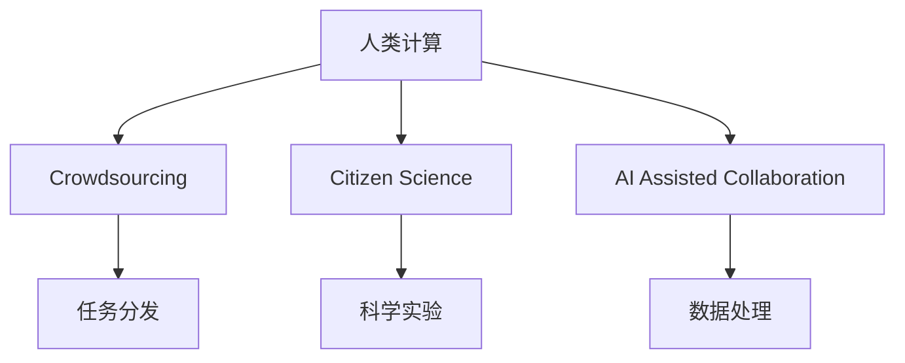

                 

# 人类计算：应用与案例分析

人类计算（Human Computation）是指通过人力的参与，尤其是人类智能的介入，来解决问题、推动科学和技术发展的计算模式。它不仅涵盖了传统数学计算、物理实验等直接参与计算的案例，也包括了诸如大众科学研究、众包、AI辅助协作等间接利用人类智慧和劳动的计算方式。本文将深入探讨人类计算的原理、应用场景、案例分析及其未来发展趋势，助力读者全面理解这一新兴领域。

## 1. 背景介绍

### 1.1 问题由来

随着科技的飞速发展，计算领域对速度、精度和资源的需求不断增加。传统的计算机算法和硬件结构已难以应对所有挑战，尤其是涉及人类思维、情感、创造力等领域的问题。在此背景下，人类计算的概念应运而生。通过引入人类的智慧和劳动力，借助互联网和大数据等工具，人类计算在诸如科学探索、艺术创作、社会服务等多个领域展现了巨大潜力。

### 1.2 问题核心关键点

人类计算的核心在于利用人类的优势来弥补计算资源的不足，尤其是个性化、创造性、复杂性问题。相较于传统的计算方式，人类计算具有以下特点：

1. **高灵活性**：人类能够适应各种复杂问题，灵活调整解决方案。
2. **创造力**：人类具有创新思维，能够提出新颖的解决方案。
3. **情感参与**：人类计算过程中，情感和道德考量更加重要，有助于提升计算结果的社会价值。
4. **协同合作**：通过众包、协作等方式，能够有效整合多个人的智慧和力量。

## 2. 核心概念与联系

### 2.1 核心概念概述

为了更好地理解人类计算，本节将介绍几个关键概念：

- **人类计算（Human Computation）**：指通过人力的参与，特别是人类智能的介入，来解决问题、推动科学和技术发展的计算模式。
- **众包（Crowdsourcing）**：通过互联网平台，将需要处理的任务分发给大量独立个体，以高效、低成本的方式获取解决方案。
- **大众科学研究（Citizen Science）**：利用大众的参与，进行科学实验、数据收集和分析，以提升科学研究的覆盖面和深度。
- **人工智能辅助协作（AI Assisted Collaboration）**：通过智能算法和大数据分析，辅助人类在复杂计算任务中做出更优的决策。

这些核心概念之间的逻辑关系可以通过以下Mermaid流程图来展示：



这个流程图展示了人类计算的核心概念及其相互关系：

1. 人类计算利用众包、大众科学研究、人工智能辅助协作等方式，将任务分散给多个人或系统，充分利用人类的智慧和资源。
2. 众包通过任务分发，将工作分派给大量独立个体。
3. 大众科学研究通过大众参与，进行科学实验和数据收集。
4. AI辅助协作通过智能算法辅助人类决策。

## 3. 核心算法原理 & 具体操作步骤

### 3.1 算法原理概述

人类计算的核心算法原理主要基于以下几个步骤：

1. **任务定义**：将复杂问题拆分为可操作的小任务。
2. **任务分配**：将小任务分配给不同的个体或系统，以并行处理或协同合作的方式完成。
3. **数据收集**：收集个体或系统处理任务过程中产生的数据。
4. **数据融合**：将不同个体或系统收集的数据进行综合分析和融合，得到最终结果。

### 3.2 算法步骤详解

以一个大众科学研究项目为例，其操作步骤如下：

**Step 1: 定义科学问题**
- 确定研究目标，如探索某地理区域的生物多样性。
- 制定详细的研究方案，包括研究方法、数据需求、实验设计等。

**Step 2: 任务拆分与分配**
- 将研究任务拆分为多个小任务，如数据收集、图像标注、数据分析等。
- 通过互联网平台，将任务分发给志愿者或研究人员，确保任务覆盖面广，减少遗漏。

**Step 3: 数据收集与提交**
- 志愿者或研究人员按照任务要求提交数据或研究结果。
- 平台自动验证数据的准确性和完整性，避免冗余和错误。

**Step 4: 数据融合与分析**
- 利用智能算法对收集的数据进行综合分析，生成科学报告。
- 邀请专家评审科学报告，提出改进建议。
- 发布科学研究成果，供公众查看和讨论。

### 3.3 算法优缺点

人类计算的优势在于：

1. **灵活性高**：能够适应各种复杂问题，灵活调整解决方案。
2. **创新能力强**：利用人类的创造力和智慧，可能提出新颖的解决方案。
3. **社会价值高**：通过集思广益，可以提升计算结果的社会价值和影响力。

缺点在于：

1. **质量难以保证**：个体差异可能导致结果不一致，影响整体质量。
2. **成本高**：组织大规模人群参与，需要投入较多时间和资源。
3. **数据隐私问题**：需要确保参与者的隐私和安全。

### 3.4 算法应用领域

人类计算的应用领域非常广泛，涵盖了科学、工程、艺术、社会服务等多个领域，例如：

- **科学探索**：利用众包平台，进行大规模科学实验和数据收集，如大规模天文学观测、基因组学研究等。
- **社会服务**：通过社区参与，解决公共卫生、环境保护、灾害应对等社会问题。
- **艺术创作**：借助AI辅助，进行音乐创作、绘画、电影制作等艺术创作。
- **工业生产**：利用智能工具和系统，辅助复杂工艺设计和生产管理。
- **商业决策**：通过众包平台，收集市场反馈和用户意见，辅助企业决策。

## 4. 数学模型和公式 & 详细讲解  
### 4.1 数学模型构建

假设一个科学研究的总体目标为 $O$，通过人类计算将 $O$ 分解为多个子任务 $T_1, T_2, ..., T_n$，每个子任务由 $m$ 个人独立完成。每个子任务 $T_i$ 的完成度为 $r_i$，且 $r_i \sim \mathcal{B}(m,p_i)$，其中 $p_i$ 为任务 $T_i$ 的成功概率。

**目标函数**：
$$
R = \sum_{i=1}^n r_i
$$

**优化目标**：
$$
\maximize R \quad \text{subject to} \quad r_i \sim \mathcal{B}(m,p_i)
$$

### 4.2 公式推导过程

通过二项分布的期望和方差公式，可以得到任务完成度的期望和方差：

$$
E(r_i) = m p_i
$$
$$
\text{Var}(r_i) = m p_i (1-p_i)
$$

对所有任务求期望，得到总体完成度的期望：

$$
E(R) = \sum_{i=1}^n m p_i
$$

假设所有子任务的完成度相互独立，可以进一步简化为：

$$
E(R) = m \sum_{i=1}^n p_i
$$

### 4.3 案例分析与讲解

考虑一个大型科学研究项目，该项目需收集10000份生物多样性数据，每个子任务为收集1份数据。假设每个志愿者收集数据的能力为 $p_i=0.95$，志愿者的数量为 $m=10000$。

首先，将10000份数据拆分为多个子任务，每个子任务收集1份数据。

然后，每个志愿者独立完成分配给自己的任务，完成度为 $r_i \sim \mathcal{B}(10000,0.95)$。

最后，计算总体完成度 $R$ 的期望值：

$$
E(R) = 10000 \times 0.95 = 9500
$$

这意味着，如果每个志愿者高效完成任务，总体数据收集效率可以达到95%。

## 5. 项目实践：代码实例和详细解释说明

### 5.1 开发环境搭建

在进行人类计算实践前，我们需要准备好开发环境。以下是使用Python进行Python开发的环境配置流程：

1. 安装Anaconda：从官网下载并安装Anaconda，用于创建独立的Python环境。

2. 创建并激活虚拟环境：
```bash
conda create -n pyth-env python=3.8 
conda activate pyth-env
```

3. 安装Python和其他必要的工具包：
```bash
pip install numpy pandas matplotlib scikit-learn nltk
```

4. 安装相关库：
```bash
pip install requests beautifulsoup4
```

完成上述步骤后，即可在`pyth-env`环境中开始人类计算实践。

### 5.2 源代码详细实现

下面我们以一个众包平台为例，给出使用Python实现的任务分发和数据收集的代码实现。

```python
import requests
from bs4 import BeautifulSoup

# 定义任务信息
tasks = [
    {'name': '数据收集任务', 'url': 'https://example.com/task1', 'description': '收集数据1'},
    {'name': '数据标注任务', 'url': 'https://example.com/task2', 'description': '标注数据2'},
    {'name': '数据分析任务', 'url': 'https://example.com/task3', 'description': '分析数据3'}
]

# 定义志愿者信息
volunteers = [
    {'name': '志愿者1', 'email': 'volunteer1@example.com'},
    {'name': '志愿者2', 'email': 'volunteer2@example.com'},
    {'name': '志愿者3', 'email': 'volunteer3@example.com'}
]

# 定义任务分配函数
def assign_tasks(tasks, volunteers):
    for task in tasks:
        volunteer = random.choice(volunteers)
        send_email(volunteer['email'], task['url'], task['description'])

# 定义发送邮件函数
def send_email(email, url, description):
    headers = {
        'Content-Type': 'text/plain'
    }
    data = {
        'url': url,
        'description': description
    }
    response = requests.post(email, headers=headers, data=data)
    print(response.status_code, response.text)

# 执行任务分配
assign_tasks(tasks, volunteers)
```

这个代码实现了任务分发和邮件通知的功能。每个志愿者通过邮件接收任务信息，并按照要求完成指定任务。

### 5.3 代码解读与分析

让我们再详细解读一下关键代码的实现细节：

**任务信息**：
- 任务名、URL、描述信息，用于生成邮件内容。

**志愿者信息**：
- 每个志愿者的姓名和电子邮件，用于分配任务时选择。

**任务分配函数**：
- 通过`random.choice`从志愿者列表中选择一个志愿者，并调用`send_email`函数发送任务信息。

**发送邮件函数**：
- 通过`requests.post`方法发送邮件，设置`Content-Type`为纯文本，包含任务的URL和描述信息。

通过这些代码，我们可以初步构建一个简单的众包平台，实现任务分配和志愿者通知。

### 5.4 运行结果展示

运行上述代码，即可在志愿者的邮箱中收到任务信息。志愿者打开邮件后，根据提供的URL和描述信息，完成指定的数据收集或标注任务，并将结果提交给平台。

## 6. 实际应用场景

### 6.1 科学探索

在科学探索领域，人类计算可以大规模地进行数据收集和实验设计，加速科学发现过程。例如，天文学家利用众包平台进行大规模观测数据的标注，通过众包平台收集全球各地的天文观测数据，极大地提升了科学研究的速度和精度。

### 6.2 社会服务

社会服务领域利用人类计算解决公共卫生、环境保护、灾害应对等复杂问题。例如，利用众包平台收集空气质量数据，通过数据分析预测环境污染趋势，辅助决策制定。

### 6.3 艺术创作

艺术创作领域借助AI辅助协作，提高创意工作的效率和质量。例如，利用众包平台进行音乐创作，艺术家们可以在众包平台上提交乐谱和音符，其他艺术家通过评价和反馈进行修改，最终形成高质量的音乐作品。

### 6.4 工业生产

工业生产领域利用智能工具和系统，辅助复杂工艺设计和生产管理。例如，通过众包平台进行产品设计，工程师和设计师可以共同讨论设计方案，集思广益，提升产品竞争力。

### 6.5 商业决策

商业决策领域通过众包平台收集市场反馈和用户意见，辅助企业决策。例如，利用众包平台进行市场调研，企业可以了解消费者需求和趋势，制定更科学的市场策略。

## 7. 工具和资源推荐

### 7.1 学习资源推荐

为了帮助开发者系统掌握人类计算的理论基础和实践技巧，这里推荐一些优质的学习资源：

1. 《大众科学研究：理论与实践》书籍：介绍大众科学研究的原理和应用，帮助读者深入理解这一新兴领域。
2. Coursera《Crowdsourcing in Science》课程：斯坦福大学开设的课程，讲解众包在科学研究中的应用。
3. 《Human Computation and Collaborative Science》文章集：汇集多篇关于人类计算和协作科学的学术论文，提供丰富的理论知识。
4. GitHub上的Human Computation项目：包含大量人类计算实践案例，提供丰富的代码和文档。

通过对这些资源的学习实践，相信你一定能够快速掌握人类计算的精髓，并用于解决实际的计算问题。

### 7.2 开发工具推荐

高效的开发离不开优秀的工具支持。以下是几款用于人类计算开发的常用工具：

1. Python：功能强大的编程语言，广泛用于科学计算、数据分析、人工智能等领域。
2. Jupyter Notebook：交互式编程环境，方便代码调试和数据分析。
3. IPython：Python的交互式命令行工具，提供更丰富的终端操作功能。
4. Google Colab：免费的在线Jupyter Notebook环境，方便实验和分享学习笔记。

合理利用这些工具，可以显著提升人类计算任务的开发效率，加快创新迭代的步伐。

### 7.3 相关论文推荐

人类计算的研究源于学界的持续研究。以下是几篇奠基性的相关论文，推荐阅读：

1. "Crowdsourcing Design Principles: Tasks, Question Design, and Rewards" by Eric Wieser, James A. Tygar（2006）：提出任务设计、问题设计和奖励机制的原则，为众包平台的设计提供指导。
2. "Crowdsourcing for Scientific Research: Successes, Challenges and Future Directions" by Yaron Tishby（2015）：总结众包在科学研究中的应用案例和挑战，探讨未来发展方向。
3. "Human Computation" by Paul Dourish（2011）：探讨人类计算的概念、原理和应用，为这一新兴领域提供理论基础。
4. "Human-Centered Crowdsourcing" by Philipp Janert（2013）：探讨如何设计更好的众包平台，提高用户参与度和任务完成质量。

这些论文代表了大规模计算技术的发展脉络。通过学习这些前沿成果，可以帮助研究者把握学科前进方向，激发更多的创新灵感。

## 8. 总结：未来发展趋势与挑战

### 8.1 总结

本文对人类计算的原理、应用场景、案例分析及其未来发展趋势进行了全面系统的介绍。首先阐述了人类计算的研究背景和意义，明确了人类计算在解决复杂问题、推动科学和技术发展中的独特价值。其次，从原理到实践，详细讲解了人类计算的数学模型和操作步骤，给出了人类计算任务开发的完整代码实例。同时，本文还广泛探讨了人类计算在科学探索、社会服务、艺术创作、工业生产等多个领域的应用前景，展示了人类计算范式的巨大潜力。此外，本文精选了人类计算技术的各类学习资源，力求为读者提供全方位的技术指引。

通过本文的系统梳理，可以看到，人类计算为计算技术的发展注入了新的活力，极大地拓展了计算任务的应用边界，推动了计算技术的产业化进程。未来，伴随人类计算技术的不断演进，必将在更多领域带来颠覆性的变革，为社会的进步和发展提供新的动力。

### 8.2 未来发展趋势

展望未来，人类计算技术将呈现以下几个发展趋势：

1. **技术融合**：人类计算将与其他人工智能技术进行更深入的融合，如自然语言处理、计算机视觉、增强现实等，提升计算任务的自动化和智能化水平。
2. **社交计算**：利用社交网络平台，进行更大规模、更深层次的人类计算活动，提升社会协作和创新能力。
3. **全球计算**：通过全球范围内的协作计算，解决更复杂的科学和工程问题，推动全球科技的协同发展。
4. **个性化计算**：结合个性化数据分析，进行更精确、更灵活的人类计算任务设计，满足个体化需求。
5. **伦理和隐私**：随着人类计算的普及，对数据隐私和伦理问题的研究将日益重要，需要建立完善的法律法规和伦理规范。

以上趋势凸显了人类计算技术的广阔前景。这些方向的探索发展，必将进一步提升计算任务的效果和应用范围，为社会带来深远的变革。

### 8.3 面临的挑战

尽管人类计算技术已经取得了瞩目成就，但在迈向更加智能化、普适化应用的过程中，它仍面临着诸多挑战：

1. **数据质量**：数据噪声和偏差可能导致计算结果不准确，需要引入更严格的数据验证机制。
2. **参与者激励**：如何激励志愿者和研究人员积极参与，保持任务的高质量完成率，仍是一个难题。
3. **隐私保护**：需要确保参与者的数据和隐私安全，防止数据泄露和滥用。
4. **协作难度**：跨地域、跨文化的协作计算，面临沟通和协调的困难。
5. **计算资源**：需要高效利用计算资源，避免资源浪费和计算成本过高。

这些挑战需要通过技术创新和制度完善来解决，才能真正实现人类计算技术的普及和应用。

### 8.4 研究展望

面向未来，人类计算技术需要在以下几个方面进行深入研究：

1. **数据治理**：建立完善的法律法规和数据治理机制，保障数据隐私和数据质量。
2. **协作平台**：开发更高效、更灵活的协作平台，支持大规模、深层次的人类计算活动。
3. **算法优化**：研究更高效、更可靠的人类计算算法，提升计算任务的效果和可靠性。
4. **伦理规范**：建立完善的伦理规范和伦理审查机制，确保人类计算任务的道德和社会价值。
5. **教育培训**：普及人类计算技术，培养更多具备计算思维和创新能力的人才。

这些研究方向的探索，必将引领人类计算技术迈向更高的台阶，为社会的进步和发展提供新的动力。

## 9. 附录：常见问题与解答

**Q1：人类计算和机器计算有什么区别？**

A: 人类计算和机器计算的本质区别在于算力来源不同。机器计算依赖计算机的计算能力和存储能力，而人类计算则依赖人类的智慧和劳动力。人类计算适用于需要人类智慧和创造力介入的复杂问题，如科学探索、艺术创作、社会服务等。

**Q2：人类计算的效率和机器计算相比如何？**

A: 人类计算在处理某些特定类型的任务时，可能比机器计算效率更高。例如，在数据标注、社会调查等需要人类智慧和协作的领域，人类计算具有独特的优势。但在大规模数据处理、高精度计算等领域，机器计算仍然具有更高的效率和可靠性。

**Q3：如何进行有效的任务设计？**

A: 任务设计是影响人类计算效果的关键因素之一。有效的任务设计应具备以下特点：
1. **明确目标**：任务目标要清晰明确，让参与者明确任务的最终目标。
2. **难度适中**：任务难度要适中，避免过于简单或复杂。
3. **奖励机制**：建立合理的奖励机制，激励参与者积极完成任务。
4. **反馈及时**：及时提供反馈和评价，帮助参与者改进任务完成质量。

**Q4：如何保障数据隐私？**

A: 数据隐私是人类计算中的重要问题。保障数据隐私的措施包括：
1. **数据匿名化**：对数据进行匿名化处理，避免个人信息泄露。
2. **数据加密**：采用加密技术保护数据传输和存储安全。
3. **访问控制**：建立严格的访问控制机制，限制数据的访问和使用权限。
4. **合规审查**：确保数据处理符合法律法规和伦理规范。

这些措施可以有效保障参与者的数据隐私和数据安全。

**Q5：如何提高人类计算的协作效果？**

A: 提高协作效果的措施包括：
1. **建立沟通渠道**：建立有效的沟通渠道，确保参与者之间的信息流畅。
2. **提供协作工具**：提供协作工具和平台，支持多人同时协作。
3. **培养协作精神**：通过培训和引导，培养参与者的协作精神和团队合作能力。
4. **建立信任机制**：建立信任机制，增强参与者之间的互信和合作。

通过这些措施，可以提升人类计算的协作效果，实现更高效、更协调的计算任务。

---

作者：禅与计算机程序设计艺术 / Zen and the Art of Computer Programming

