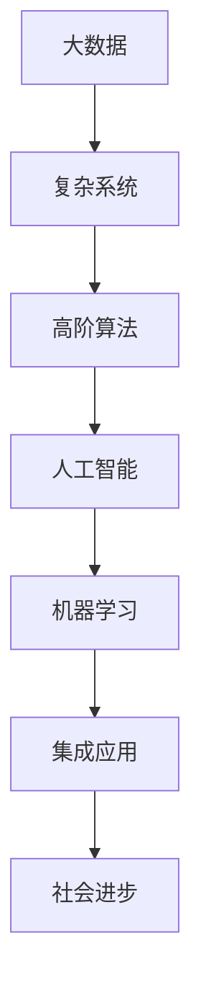

                 

# 人类计算：解决人类面临的重大挑战

> 关键词：人类计算, 人工智能, 机器学习, 大数据, 复杂系统优化, 高阶算法, 集成应用, 社会进步

## 1. 背景介绍

### 1.1 问题由来

当今社会，人类面临着诸多重大挑战，包括气候变化、全球疫情、能源短缺、环境污染、粮食安全、资源枯竭等。这些问题复杂多变，解决难度大，亟需新的方法来应对。传统计算方法面临瓶颈，需要借助更先进的计算技术来处理大规模、复杂的问题。

与此同时，随着计算机技术的不断进步，人工智能（AI）、机器学习（ML）等技术逐渐崭露头角。这些技术在多个领域展现出巨大的应用潜力，特别是在数据处理、决策优化、智能控制等方面，为解决人类面临的重大挑战提供了新的解决途径。

### 1.2 问题核心关键点

AI和ML技术的核心在于通过数据驱动的计算方法，在短时间内处理和分析海量数据，从而获得高效、精准的决策支持。这些技术能够帮助人类应对复杂系统的挑战，通过模型训练和优化，不断提升解决现实问题的能力。

AI和ML技术对解决人类面临的重大挑战具有以下关键作用：
- 数据整合与分析：通过AI和ML，可以将来自不同来源的数据整合起来，进行全面、深入的分析，挖掘出有用的信息。
- 预测与决策支持：利用AI和ML进行预测，帮助人们更好地理解未来趋势，做出科学合理的决策。
- 自动化与智能化：通过自动化技术，减少人力成本，提高决策和执行效率。
- 优化与创新：优化算法和模型，提升问题解决的创新性，推动科技进步。

## 2. 核心概念与联系

### 2.1 核心概念概述

要深刻理解AI和ML在解决人类面临重大挑战中的应用，首先需要对以下核心概念有所了解：

- **人工智能（Artificial Intelligence, AI）**：指的是通过模拟人类智能行为，使机器能够完成某些原本需要人类智能才能解决的任务。
- **机器学习（Machine Learning, ML）**：是指让机器通过数据驱动的方法，从经验中学习，提升自身的性能和能力。
- **大数据（Big Data）**：指海量、高速、多样化的数据集合，是AI和ML的重要数据基础。
- **复杂系统（Complex Systems）**：指由多种因素相互影响、相互作用的系统，如生态系统、社会系统等。
- **高阶算法（High-Level Algorithms）**：指能够处理复杂问题的算法，如深度学习、强化学习、遗传算法等。
- **集成应用（Integrated Applications）**：指将AI和ML技术与现实问题结合，形成解决具体问题的应用系统。

这些核心概念之间存在着紧密的联系，构成了AI和ML在解决人类面临重大挑战中的应用框架：

1. 大数据提供了AI和ML所需的数据资源，是机器学习的基础。
2. 复杂系统是AI和ML技术解决的问题背景，需要模型对其进行分析与优化。
3. 高阶算法是解决复杂系统的工具，通过算法训练和优化，提升模型性能。
4. 集成应用将AI和ML技术应用到具体问题中，实现优化与创新。
5. 社会进步是AI和ML技术应用的目标，为人类社会带来实质性的提升。

这些概念之间的联系可以通过以下Mermaid流程图来展示：



这个流程图展示了从数据到技术再到社会进步的路径，揭示了AI和ML在解决重大挑战中的重要角色。

## 3. 核心算法原理 & 具体操作步骤

### 3.1 算法原理概述

AI和ML在解决人类面临的重大挑战时，主要依赖于数据驱动的计算方法。以下是对AI和ML核心算法的简要介绍：

- **监督学习（Supervised Learning）**：通过有标签的数据集训练模型，使其能够对新的数据进行分类或回归预测。
- **无监督学习（Unsupervised Learning）**：在没有标签的情况下，通过对数据进行聚类、降维等操作，发现数据中的潜在结构和规律。
- **强化学习（Reinforcement Learning）**：通过与环境互动，优化行为策略，使模型能够在特定环境下取得最优决策。
- **深度学习（Deep Learning）**：通过多层神经网络结构，提取数据中的高层次特征，解决复杂系统问题。
- **集成学习（Ensemble Learning）**：通过将多个模型组合起来，提升整体预测性能。
- **迁移学习（Transfer Learning）**：将在一个领域上训练好的模型迁移到另一个领域，减少新任务的数据需求。
- **对抗学习（Adversarial Learning）**：通过对抗样本训练模型，增强其鲁棒性和泛化能力。

### 3.2 算法步骤详解

AI和ML在解决人类面临的重大挑战时，一般遵循以下步骤：

**Step 1: 数据收集与预处理**
- 从不同来源收集数据，确保数据的多样性和完备性。
- 清洗数据，去除噪声和异常值，进行数据归一化等预处理。

**Step 2: 模型训练与优化**
- 选择合适的算法，建立模型框架。
- 将数据划分为训练集、验证集和测试集，进行模型训练。
- 利用验证集评估模型性能，调整超参数，进行模型优化。
- 使用测试集对优化后的模型进行评估。

**Step 3: 模型部署与应用**
- 将训练好的模型部署到实际应用中，进行线上服务。
- 实时监测模型性能，及时调整和优化。
- 将AI和ML技术与具体问题结合，形成集成应用。

**Step 4: 结果评估与迭代**
- 评估模型对重大挑战的解决效果，确保目标达成。
- 对模型进行调整和优化，进行迭代更新。
- 收集用户反馈，不断改进应用系统。

### 3.3 算法优缺点

AI和ML技术在解决人类面临重大挑战时，具有以下优点：
- 处理大规模数据能力强：能够高效处理海量、复杂的数据。
- 模型学习能力强：通过数据驱动，模型能够自动学习，不断提升性能。
- 决策优化能力强：利用算法优化，可以做出更科学合理的决策。
- 跨领域应用广泛：在多个领域中都有广泛应用，如医疗、金融、教育等。

同时，这些技术也存在一些局限性：
- 数据需求量大：需要大量高质量的数据进行训练，数据获取成本高。
- 模型复杂度高：模型结构复杂，需要较高的计算资源和专业知识。
- 模型解释性差：部分模型如深度学习缺乏可解释性，难以理解其内部工作机制。
- 鲁棒性不足：面对新数据和新场景，模型泛化能力有限，容易过拟合。

### 3.4 算法应用领域

AI和ML技术在解决人类面临的重大挑战中，已经被广泛应用于多个领域，例如：

- **环境保护**：利用遥感数据和AI技术，监测和分析环境变化，提出环境治理方案。
- **公共卫生**：通过大数据和ML技术，分析疫情数据，预测流行病趋势，优化医疗资源分配。
- **能源管理**：利用智能电网和ML技术，优化电力系统运行，提高能源利用效率。
- **交通管理**：通过AI技术，优化交通信号灯控制，减少交通拥堵，提升出行效率。
- **农业生产**：利用机器视觉和ML技术，监测作物生长，优化农业生产，提升粮食安全。
- **金融风险管理**：通过大数据和ML技术，分析市场数据，预测金融风险，制定应对策略。
- **教育改革**：利用AI和ML技术，分析学生学习数据，提供个性化教学方案，提升教育效果。

## 4. 数学模型和公式 & 详细讲解 & 举例说明

### 4.1 数学模型构建

在AI和ML中，许多算法和模型都依赖于数学模型的构建。以下是几个常见的数学模型：

- **线性回归模型（Linear Regression）**：表示因变量与自变量之间的线性关系，用于预测和回归分析。
- **逻辑回归模型（Logistic Regression）**：用于分类问题，将因变量映射到二值输出。
- **支持向量机（Support Vector Machine, SVM）**：通过在高维空间中寻找最优超平面，进行分类和回归。
- **神经网络模型（Neural Network）**：通过多层神经元结构，提取数据中的高层次特征，用于分类和回归。
- **深度神经网络（Deep Neural Network, DNN）**：多层神经网络，用于处理复杂非线性关系。
- **卷积神经网络（Convolutional Neural Network, CNN）**：用于图像处理，通过卷积操作提取局部特征。
- **循环神经网络（Recurrent Neural Network, RNN）**：用于序列数据处理，通过记忆机制处理时间序列信息。

### 4.2 公式推导过程

以下以线性回归模型为例，推导其公式和推导过程：

假设有一组数据集 $(x_i, y_i), i=1,2,...,N$，其中 $x_i$ 为自变量，$y_i$ 为因变量，目标是找到一个线性函数 $y=wx+b$ 来拟合这些数据。

最小二乘法（Ordinary Least Squares, OLS）的目标是最小化预测值与真实值之间的平方误差：

$$
\min_{w,b} \sum_{i=1}^N (y_i - (wx_i + b))^2
$$

对其进行一阶偏导数求解：

$$
\frac{\partial}{\partial w} \sum_{i=1}^N (y_i - (wx_i + b))^2 = -2\sum_{i=1}^N (y_i - (wx_i + b))x_i = 0
$$

$$
\frac{\partial}{\partial b} \sum_{i=1}^N (y_i - (wx_i + b))^2 = -2\sum_{i=1}^N (y_i - (wx_i + b)) = 0
$$

解得：

$$
w = \frac{\sum_{i=1}^N x_iy_i}{\sum_{i=1}^N x_i^2}, b = \frac{\sum_{i=1}^N y_i - w\sum_{i=1}^N x_i}{N}
$$

这就是线性回归模型的参数求解公式。

### 4.3 案例分析与讲解

以环境污染监测为例，介绍如何利用AI和ML技术解决该问题：

**Step 1: 数据收集与预处理**
- 收集卫星遥感数据、地面监测数据、气象数据等，确保数据的完整性和代表性。
- 清洗数据，去除缺失值和异常值，进行归一化处理。

**Step 2: 模型训练与优化**
- 选择合适的算法，如随机森林、神经网络等，建立模型框架。
- 将数据划分为训练集、验证集和测试集，进行模型训练。
- 利用验证集评估模型性能，调整超参数，进行模型优化。
- 使用测试集对优化后的模型进行评估。

**Step 3: 模型部署与应用**
- 将训练好的模型部署到环境监测系统，进行实时数据处理。
- 实时监测环境数据，预测污染趋势，提出治理方案。

**Step 4: 结果评估与迭代**
- 评估模型对环境污染的监测效果，确保目标达成。
- 对模型进行调整和优化，进行迭代更新。
- 收集用户反馈，不断改进环境监测系统。

## 5. 项目实践：代码实例和详细解释说明

### 5.1 开发环境搭建

在进行AI和ML项目实践前，首先需要准备开发环境：

1. 安装Python：从官网下载并安装Python，确保版本稳定。
2. 安装相关库：安装Numpy、Pandas、Scikit-learn、TensorFlow、PyTorch等常用库。
3. 安装开发工具：安装Jupyter Notebook、Git、GitHub等开发工具。

### 5.2 源代码详细实现

以下是一个使用Python实现线性回归模型的代码示例：

```python
import numpy as np
import matplotlib.pyplot as plt

# 定义数据集
x = np.array([1, 2, 3, 4, 5])
y = np.array([2, 4, 5, 4, 6])

# 计算线性回归模型参数
w = (np.sum(x * y) - np.sum(x) * np.sum(y) / len(x)) / (np.sum(x ** 2) - np.sum(x) ** 2 / len(x))
b = (np.sum(y) - w * np.sum(x)) / len(x)

# 预测数据
y_pred = w * x + b

# 绘制散点图和回归线
plt.scatter(x, y, color='blue')
plt.plot(x, y_pred, color='red')
plt.xlabel('x')
plt.ylabel('y')
plt.show()
```

以上代码实现了线性回归模型的参数求解和预测过程。

### 5.3 代码解读与分析

**代码实现流程**
- 定义数据集，使用Numpy库进行数据处理。
- 计算线性回归模型的参数 $w$ 和 $b$。
- 使用计算出的参数，预测数据并绘制散点图和回归线。
- 利用Matplotlib库进行数据可视化。

**参数求解公式**
- $w = \frac{\sum_{i=1}^N x_iy_i}{\sum_{i=1}^N x_i^2}$
- $b = \frac{\sum_{i=1}^N y_i - w\sum_{i=1}^N x_i}{N}$

以上公式可以推导得到线性回归模型的参数求解过程。

## 6. 实际应用场景

### 6.1 环境保护

**案例：环境污染监测系统**

利用AI和ML技术，建立环境污染监测系统，实时监测大气污染、水污染等环境数据，预测污染趋势，提出治理方案。该系统通过遥感数据和地面监测数据，建立模型，进行数据分析和预测，能够帮助政府和企业制定环境治理策略，提升环境质量。

**步骤：**
- 收集遥感数据、地面监测数据等，进行数据预处理。
- 利用神经网络等模型，进行数据建模和预测。
- 建立数据可视化界面，实时展示环境数据和预测结果。

### 6.2 公共卫生

**案例：流行病预测系统**

利用AI和ML技术，建立流行病预测系统，分析疫情数据，预测流行病趋势，优化医疗资源分配。该系统通过疫情数据，建立模型，进行数据分析和预测，能够帮助政府和医疗机构制定防控措施，提升公共卫生水平。

**步骤：**
- 收集疫情数据，进行数据预处理。
- 利用机器学习模型，进行数据分析和预测。
- 建立数据可视化界面，实时展示预测结果和防控措施。

### 6.3 能源管理

**案例：智能电网优化系统**

利用AI和ML技术，建立智能电网优化系统，优化电力系统运行，提高能源利用效率。该系统通过电网数据，建立模型，进行数据分析和优化，能够帮助电力公司制定最优的电网运行策略，提升能源利用效率。

**步骤：**
- 收集电网数据，进行数据预处理。
- 利用深度学习模型，进行数据分析和优化。
- 建立数据可视化界面，实时展示电网运行状态和优化结果。

### 6.4 未来应用展望

随着AI和ML技术的不断发展，其在解决人类面临的重大挑战中的应用将更加广泛和深入。未来，AI和ML技术将可能涵盖以下几个领域：

- **医疗健康**：利用AI和ML技术，提升疾病诊断和治疗效果，优化医疗资源分配，提升公共卫生水平。
- **教育培训**：利用AI和ML技术，提供个性化教学方案，提升教育效果，优化教学资源分配。
- **智慧城市**：利用AI和ML技术，提升城市管理水平，优化交通、能源、环境等方面的管理，提升城市生活质量。
- **金融安全**：利用AI和ML技术，提升金融风险管理能力，预测市场趋势，优化投资策略。
- **环境保护**：利用AI和ML技术，提升环境监测和治理能力，减少环境污染，保护生态环境。

## 7. 工具和资源推荐

### 7.1 学习资源推荐

为了帮助开发者系统掌握AI和ML技术，以下是几本优秀的学习资源：

1. **《深度学习》（Deep Learning）**：由Goodfellow等著，全面介绍了深度学习的基本概念和应用。
2. **《Python数据科学手册》（Python Data Science Handbook）**：由Jake VanderPlas著，介绍了Python在数据科学中的应用。
3. **《机器学习实战》（Machine Learning in Action）**：由Peter Harrington著，介绍了机器学习的基本算法和应用。
4. **《TensorFlow实战》（TensorFlow in Action）**：由Vincent Vanhoucke等著，介绍了TensorFlow框架的基本使用和应用。
5. **《PyTorch实战》（PyTorch in Action）**：由Jurgen Schmitz等著，介绍了PyTorch框架的基本使用和应用。

### 7.2 开发工具推荐

以下几款工具可以用于AI和ML开发：

1. **Jupyter Notebook**：用于编写和运行Python代码，支持代码块的可重复执行和数据可视化。
2. **GitHub**：用于版本控制和代码协作，支持代码仓库的管理和共享。
3. **TensorFlow**：由Google开发的深度学习框架，支持分布式计算和高性能计算。
4. **PyTorch**：由Facebook开发的深度学习框架，支持动态图和静态图，易于使用和调试。
5. **Scikit-learn**：用于机器学习算法的封装和调用，支持多种机器学习模型的实现。
6. **Keras**：用于高层次的深度学习模型实现，支持多种深度学习模型的构建和训练。

### 7.3 相关论文推荐

AI和ML技术的发展离不开学界的不断探索和研究。以下是几篇具有代表性的论文，推荐阅读：

1. **《神经网络与深度学习》（Neural Networks and Deep Learning）**：由Michael Nielsen著，介绍了神经网络的基本概念和深度学习的应用。
2. **《深度学习入门》（Deep Learning with Python）**：由Francois Chollet著，介绍了深度学习的基本框架和应用。
3. **《机器学习实战》（Machine Learning in Action）**：由Peter Harrington著，介绍了机器学习的基本算法和应用。
4. **《计算机视觉：算法与应用》（Computer Vision: Algorithms and Applications）**：由Richard Szeliski著，介绍了计算机视觉的基本概念和应用。
5. **《自然语言处理综论》（Natural Language Processing in Action）**：由Steve Bird等著，介绍了自然语言处理的基本概念和应用。

## 8. 总结：未来发展趋势与挑战

### 8.1 研究成果总结

本文介绍了AI和ML技术在解决人类面临重大挑战中的应用，涵盖了多个实际案例和理论基础。通过系统性的讲解和分析，帮助读者理解AI和ML技术的核心原理和实际应用。

### 8.2 未来发展趋势

未来，AI和ML技术将在多个领域得到广泛应用，推动人类社会的发展和进步。以下是几个可能的发展趋势：

1. **智能化水平提升**：随着AI和ML技术的不断发展，智能化水平将进一步提升，逐步实现人类社会的全面智能化。
2. **跨领域融合**：AI和ML技术将在多个领域进行融合，形成新的交叉学科，推动各行业的智能化转型。
3. **人性化设计**：AI和ML技术将更加注重人性化设计，提升用户体验，实现人机协同。
4. **伦理和安全**：AI和ML技术将注重伦理和安全问题，确保技术的可控性和安全性，避免对人类社会造成负面影响。
5. **可持续性**：AI和ML技术将注重可持续性，减少能源消耗，保护环境，实现人类社会的可持续发展。

### 8.3 面临的挑战

尽管AI和ML技术在解决人类面临重大挑战中发挥着重要作用，但仍面临诸多挑战：

1. **数据隐私和安全**：AI和ML技术需要大量数据，数据隐私和安全问题亟待解决。
2. **算法透明性**：AI和ML算法的透明性问题，难以理解和解释其内部工作机制，亟待解决。
3. **伦理道德**：AI和ML技术的伦理道德问题，需要制定相关规范和标准，确保技术的可控性。
4. **资源消耗**：AI和ML技术需要大量计算资源和能源，亟需提升资源利用效率，减少环境污染。
5. **法律和政策**：AI和ML技术的法律和政策问题，需要制定相关法律法规，保障技术的规范应用。

### 8.4 研究展望

未来，AI和ML技术将在多个领域得到广泛应用，推动人类社会的发展和进步。以下是几个可能的研究方向：

1. **跨领域融合**：AI和ML技术将在多个领域进行融合，形成新的交叉学科，推动各行业的智能化转型。
2. **人性化设计**：AI和ML技术将更加注重人性化设计，提升用户体验，实现人机协同。
3. **伦理和安全**：AI和ML技术的伦理和安全问题，需要制定相关规范和标准，确保技术的可控性。
4. **可持续性**：AI和ML技术将注重可持续性，减少能源消耗，保护环境，实现人类社会的可持续发展。
5. **大模型和超大规模计算**：未来，大模型和超大规模计算技术将得到广泛应用，提升AI和ML技术的性能和能力。

## 9. 附录：常见问题与解答

**Q1: 如何选择合适的AI和ML算法？**

A: 选择合适的AI和ML算法需要综合考虑以下几个因素：
- 数据类型：根据数据类型选择合适的算法，如分类、回归、聚类等。
- 数据量：根据数据量选择合适的算法，如在线学习、批处理学习等。
- 问题类型：根据问题类型选择合适的算法，如监督学习、无监督学习、强化学习等。
- 模型复杂度：根据模型复杂度选择合适的算法，如线性模型、非线性模型、深度学习等。

**Q2: 如何选择数据预处理方法？**

A: 数据预处理方法的选择需要综合考虑以下几个因素：
- 数据类型：根据数据类型选择合适的预处理方法，如数据清洗、数据归一化、数据转换等。
- 数据质量：根据数据质量选择合适的预处理方法，如数据去噪、数据补全等。
- 数据特征：根据数据特征选择合适的预处理方法，如特征选择、特征提取等。
- 数据分布：根据数据分布选择合适的预处理方法，如数据采样、数据降维等。

**Q3: 如何评估AI和ML模型的性能？**

A: 评估AI和ML模型的性能需要综合考虑以下几个指标：
- 准确率：模型预测结果与真实结果之间的匹配度。
- 召回率：模型正确预测的正样本占真实正样本的比例。
- F1值：准确率和召回率的调和平均值。
- ROC曲线：ROC曲线下方的面积（AUC），用于评估分类模型的性能。
- MSE：均方误差，用于评估回归模型的性能。
- MAE：平均绝对误差，用于评估回归模型的性能。

以上是对AI和ML技术的系统性介绍和分析，通过本文的学习，相信读者能够更好地理解AI和ML技术的核心原理和实际应用，为解决人类面临的重大挑战提供新的思路和方向。

---

作者：禅与计算机程序设计艺术 / Zen and the Art of Computer Programming

