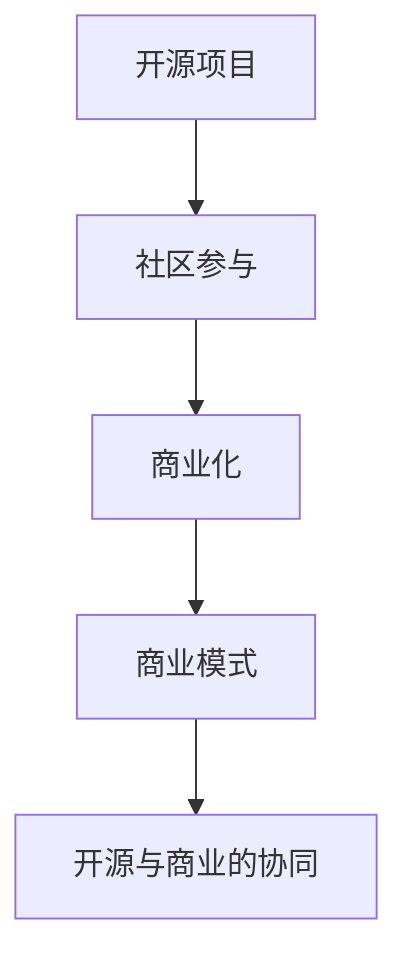

                 

## 1. 背景介绍

在现代科技产业中，开源项目已成为创新和协作的重要驱动力。从Linux到Apache Hadoop，再到今天无处不在的Web框架和库，开源社区孕育了众多具有重大影响力的软件和工具。然而，开源项目的开发者并非总是以利润为目标，这使得一些优秀的开源技术难以广泛落地，并转化成商业价值。

为了帮助开发者将他们的开源项目商业化，本文将探讨一系列策略和最佳实践，帮助开发者从代码走向现金。

## 2. 核心概念与联系

### 2.1 核心概念概述

要成功将开源项目商业化，必须理解以下几个关键概念：

- **开源项目**：指那些源代码公开，允许任何人自由使用、修改和分享的软件项目。开源项目通常通过社区贡献和协作，实现快速迭代和改进。

- **商业化**：指将开源项目的技术转化为商业产品或服务，实现盈利的过程。这包括但不限于售卖软件许可证、提供SaaS服务、集成到商业解决方案中等。

- **社区参与**：指通过活跃的社区讨论和贡献，确保开源项目持续发展和改进。高质量的社区是开源项目成功的重要因素。

- **商业模式**：指开源项目商业化的具体方式，如订阅模式、按需付费、广告收入、赞助等。

- **开源与商业的协同**：指如何在开源和商业之间建立良性互动，促进技术创新和商业化进程。

这些概念之间存在紧密联系，形成一个有机整体。本文将通过详细阐述这些概念，帮助开发者更好地理解开源项目的商业化之路。

### 2.2 核心概念原理和架构的 Mermaid 流程图

此图展示了开源项目从开发到商业化的整体流程，突出了社区参与、商业化策略和商业模式的重要性，以及开源与商业协同的关键作用。

## 3. 核心算法原理 & 具体操作步骤

### 3.1 算法原理概述

开源项目商业化的算法原理基于价值创造和转化。具体而言，它包括以下几个步骤：

1. **价值创造**：通过高质量的开源代码和持续创新，创造用户需求，为潜在客户带来实际价值。
2. **价值传递**：通过合适的商业模式和市场策略，将创造的价值传递给客户，实现商业化。
3. **价值获取**：通过客户反馈和数据分析，优化产品和服务，持续提升用户满意度，从而获取更多客户和收入。

### 3.2 算法步骤详解

**Step 1: 选择合适的商业模型**

选择合适的商业模式是开源项目商业化的关键。常见的商业模型包括：

- **开源 + 支持**：提供免费的开源软件，并通过付费支持、咨询和培训服务盈利。
- **开源 + SaaS**：将开源软件封装成SaaS产品，按需付费或按用付费。
- **开源 + 广告**：在开源软件或社区网站提供广告服务，通过点击率和展示量获得收入。
- **开源 + 赞助**：通过企业赞助和合作伙伴关系，获得资金支持。

**Step 2: 建立稳定的收入来源**

确保开源项目的商业化成功，需要建立稳定的收入来源。常见的收入来源包括：

- **订阅模式**：用户按月或按年订阅，支付许可费或SaaS服务费。
- **按需付费**：用户按使用量或功能模块支付费用。
- **赞助和捐赠**：企业或个人通过赞助或捐赠支持项目。
- **广告和联盟营销**：通过展示广告和联盟营销获得收入。

**Step 3: 维护社区参与**

社区参与对于开源项目的持续发展和商业化至关重要。维护社区参与的方法包括：

- **开放代码**：确保代码开放，鼓励社区贡献。
- **积极互动**：与社区成员建立良好关系，及时回应问题和建议。
- **定期更新**：持续发布新功能和改进，保持项目的活跃度。
- **社区活动**：组织线上线下的社区活动，增强社区凝聚力。

**Step 4: 打造产品和服务**

商业化过程中，产品和服务的设计至关重要。成功的做法包括：

- **用户体验优先**：确保产品易用、稳定、安全，满足用户需求。
- **灵活性和可定制性**：提供定制化解决方案，适应不同客户需求。
- **快速迭代**：通过快速反馈和迭代，不断优化产品功能。

**Step 5: 市场推广和销售**

市场推广和销售是商业化的关键步骤。具体策略包括：

- **品牌建设**：建立项目品牌，增强用户认知和信任。
- **市场细分**：识别目标客户群体，制定有针对性的市场策略。
- **销售渠道**：通过直销、渠道合作、线上销售等多种渠道推广产品。
- **客户关系管理**：建立CRM系统，维护客户关系，提升客户满意度。

### 3.3 算法优缺点

开源项目商业化的算法具有以下优点：

- **创新速度快**：开源社区协作和贡献能力强，可以快速迭代和改进。
- **成本低**：大部分开发工作由社区承担，成本相对较低。
- **市场接受度高**：开源项目通常具备较高的知名度和信任度。

同时，该算法也存在一定的局限性：

- **商业模式单一**：开源项目往往依赖单一的商业模式，缺乏多元化收入。
- **资源依赖性强**：开源项目依赖社区贡献和资金支持，存在不确定性。
- **缺乏专业销售团队**：开源项目通常缺乏专业的销售和市场团队，难以覆盖更广泛的市场。

### 3.4 算法应用领域

开源项目商业化算法在多个领域得到了成功应用，包括：

- **软件开发**：如Red Hat、IBM等企业，通过开源项目实现商业软件销售和支持服务。
- **云服务**：如Amazon Web Services、Microsoft Azure等，通过开源项目提供云基础设施服务。
- **大数据和分析**：如Apache Hadoop、Apache Spark等，通过开源项目提供数据处理和分析工具。
- **移动应用**：如Apache Cordova、React Native等，通过开源项目开发跨平台移动应用。
- **人工智能**：如TensorFlow、PyTorch等，通过开源项目提供机器学习和AI工具库。

## 4. 数学模型和公式 & 详细讲解

### 4.1 数学模型构建

假设开源项目为 $S$，社区为 $C$，商业化收入为 $R$。则开源项目商业化的数学模型可以表示为：

$$
R = f(S, C)
$$

其中 $f$ 为商业化函数，依赖开源项目质量 $S$ 和社区活跃度 $C$。

### 4.2 公式推导过程

根据上述模型，商业化收入 $R$ 的推导过程如下：

1. **社区活跃度 $C$**：社区活跃度直接影响开源项目的质量和创新能力。假设社区活跃度为 $C = k_1S$，其中 $k_1$ 为活跃度系数。
2. **商业化收入 $R$**：商业化收入依赖于开源项目质量和社区活跃度。假设商业化收入为 $R = k_2S^2C$，其中 $k_2$ 为收入系数。
3. **商业化函数 $f$**：将 $S$ 和 $C$ 代入收入模型，得 $R = k_2S^2k_1S = k_2k_1S^3$。

因此，开源项目商业化收入与社区活跃度和项目质量成正比。

### 4.3 案例分析与讲解

以Apache Hadoop为例，分析其开源项目商业化的成功案例：

1. **开源项目**：Apache Hadoop是一个开源分布式计算框架，广泛用于大数据处理。
2. **社区活跃度**：Apache Hadoop拥有一个庞大的社区，全球数以万计的贡献者。社区的活跃贡献和持续改进，使得Hadoop的质量不断提升。
3. **商业化**：Apache Hadoop通过开源 + 支持的模式，提供商业版Hadoop分布式平台，同时提供技术支持和咨询服务。
4. **收入来源**：Hadoop的商业版和支持服务成为主要收入来源，同时通过赞助和捐赠获得资金支持。
5. **商业模式**：Apache Hadoop的商业模式包括开源 + 支持、开源 + SaaS和开源 + 广告等。

通过以上分析，可以看出Apache Hadoop成功商业化的关键在于高质量的开源代码和活跃的社区参与。

## 5. 项目实践：代码实例和详细解释说明

### 5.1 开发环境搭建

在开始开源项目商业化的实践前，需要先搭建开发环境。以下是一个简单的Python开发环境搭建流程：

1. 安装Python：从官网下载并安装Python，建议使用3.8及以上版本。
2. 安装PyCharm：下载并安装PyCharm IDE，一个功能强大的Python开发工具。
3. 安装虚拟环境：使用 `python -m venv myenv` 命令创建虚拟环境。
4. 激活虚拟环境：运行 `source myenv/bin/activate` 命令激活虚拟环境。

### 5.2 源代码详细实现

以下是一个简单的开源项目示例，演示如何通过GitHub实现开源代码管理和社区贡献：

1. 创建GitHub仓库：在GitHub上创建一个新的仓库，并设置项目的README文件和LICENSE文件。
2. 提交代码：使用Git命令行工具，将本地代码提交到GitHub仓库。
3. 邀请社区成员：邀请其他开发者加入GitHub仓库，并赋予相应的权限。
4. 代码审查：使用GitHub的Pull Request功能，对社区成员的贡献进行代码审查和合并。

### 5.3 代码解读与分析

上述代码实现涉及多个步骤：

1. **创建GitHub仓库**：通过GitHub创建仓库，设置README和LICENSE文件，定义项目的开发方向和使用规范。
2. **提交代码**：使用Git命令行工具，通过 `git add` 和 `git commit` 命令提交代码，确保代码版本管理和备份。
3. **邀请社区成员**：在GitHub上邀请其他开发者加入项目，并赋予贡献者、审核者和管理员等权限。
4. **代码审查**：通过Pull Request功能，对社区成员的代码贡献进行审查和合并，确保代码质量。

### 5.4 运行结果展示

通过上述代码实现，可以将开源项目托管到GitHub，并与社区成员共同贡献和维护代码。这不仅提高了代码的质量和效率，也为商业化提供了坚实的基础。

## 6. 实际应用场景

### 6.1 开源软件开发

开源软件开发是开源项目商业化的重要场景之一。例如，Apache Foundation通过开源软件项目，为全球数百万开发者提供免费、高质量的软件和工具。

### 6.2 云服务提供商

云服务提供商利用开源项目提供基础设施和平台服务。例如，AWS的Elastic Kubernetes Service(EKS)和Azure的Kubernetes Service(AKS)都是基于Kubernetes的开源项目。

### 6.3 大数据分析

大数据分析是开源项目商业化的另一个重要领域。Apache Hadoop和Apache Spark等项目，为全球企业提供大数据处理和分析解决方案。

### 6.4 人工智能

人工智能领域，TensorFlow和PyTorch等开源项目，通过社区贡献和商业支持，成为全球领先的AI工具库。

### 6.5 移动应用开发

移动应用开发是开源项目的另一个重要应用场景。Apache Cordova和React Native等项目，为开发者提供了跨平台移动应用开发框架。

### 6.6 未来应用展望

未来，开源项目商业化的趋势将更加明显。随着技术的发展和应用场景的扩展，开源项目将更加广泛地渗透到各行各业，并转化为商业价值。

## 7. 工具和资源推荐

### 7.1 学习资源推荐

- **《开源软件开发实践》**：详细介绍了开源项目的开发、管理和商业化流程。
- **《开源项目最佳实践》**：提供了开源项目的最佳实践和成功案例。
- **《GitHub入门与高级应用》**：介绍了GitHub的使用方法和社区贡献技巧。
- **《GitHub API编程指南》**：提供了GitHub API的编程接口和使用方法。

### 7.2 开发工具推荐

- **PyCharm**：功能强大的Python开发工具，支持Git版本控制和社区贡献。
- **GitHub Desktop**：跨平台的Git客户端，方便管理GitHub仓库。
- **Git**：开源的分布式版本控制系统，支持代码提交和管理。
- **GitLab**：另一个流行的Git仓库托管平台，支持开源项目的开发和管理。

### 7.3 相关论文推荐

- **《开源项目社区参与的定量分析》**：研究开源社区参与度对项目质量的影响。
- **《开源项目商业化的经济模型》**：探讨开源项目商业化的经济模型和收入来源。
- **《开源项目与商业化的协同效应》**：分析开源项目与商业化之间的协同效应和相互作用。

## 8. 总结：未来发展趋势与挑战

### 8.1 研究成果总结

开源项目商业化是现代科技产业发展的重要趋势。通过高质量的开源代码和活跃的社区参与，可以实现技术创新和商业价值的转化。

### 8.2 未来发展趋势

开源项目商业化的未来趋势包括：

1. **多元化商业模式**：未来开源项目将不再依赖单一商业模式，而是通过多种方式实现收入。
2. **全球化拓展**：开源项目将进一步拓展到全球市场，覆盖更多用户和行业。
3. **社区驱动**：社区参与将成为开源项目成功的关键，更多企业和开发者将加入开源社区。
4. **技术融合**：开源项目将与其他新兴技术如AI、区块链等进行深度融合，形成新的商业机会。

### 8.3 面临的挑战

开源项目商业化也面临一些挑战：

1. **商业模式单一**：开源项目往往依赖单一的商业模式，难以应对市场变化。
2. **社区管理难度**：开源项目通常依赖社区贡献，管理难度较大。
3. **技术迭代快**：开源项目需要快速迭代和改进，否则容易被市场淘汰。
4. **资金和资源限制**：开源项目缺乏稳定资金和资源支持，难以持续发展。

### 8.4 研究展望

未来的研究应关注以下几个方面：

1. **多模态商业模式**：研究如何通过多种方式实现开源项目的收入，提高项目的可持续性。
2. **社区激励机制**：探索有效的社区激励机制，吸引更多开发者参与开源项目。
3. **技术融合创新**：研究如何将开源项目与其他新兴技术进行深度融合，形成新的商业机会。
4. **资源优化**：研究如何优化开源项目的资源配置，提高效率和效益。

## 9. 附录：常见问题与解答

**Q1: 开源项目如何选择合适的商业模型？**

A: 选择合适的商业模型需要考虑项目的特点和市场需求。常见的商业模型包括开源 + 支持、开源 + SaaS和开源 + 广告等。通过市场调研和用户反馈，选择最适合的商业模式。

**Q2: 开源项目如何进行市场推广和销售？**

A: 市场推广和销售是开源项目商业化的关键步骤。通过品牌建设、市场细分、销售渠道和客户关系管理等策略，推广开源项目和产品。

**Q3: 开源项目如何应对社区管理和技术迭代的速度？**

A: 开源项目需要建立有效的社区管理和技术迭代机制。通过开源社区的贡献和反馈，快速响应市场变化和技术迭代。

**Q4: 开源项目如何进行多元化商业化的探索？**

A: 开源项目可以通过多种方式实现商业化，如开源 + 支持、开源 + SaaS、开源 + 广告等。通过不断探索和尝试，找到最适合的商业化路径。

**Q5: 开源项目如何提升社区活跃度和参与度？**

A: 通过开放代码、积极互动、定期更新和社区活动等措施，提升社区的活跃度和参与度。建立良好的社区关系，增强社区凝聚力。

---

作者：禅与计算机程序设计艺术 / Zen and the Art of Computer Programming

