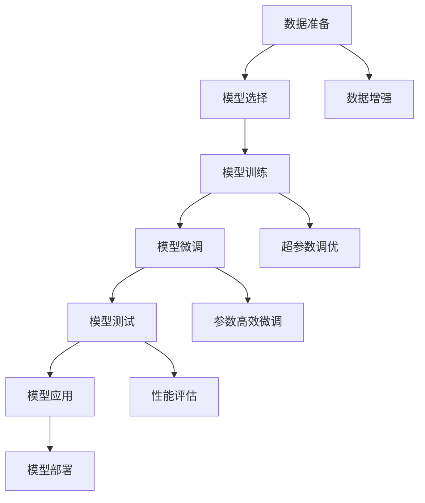
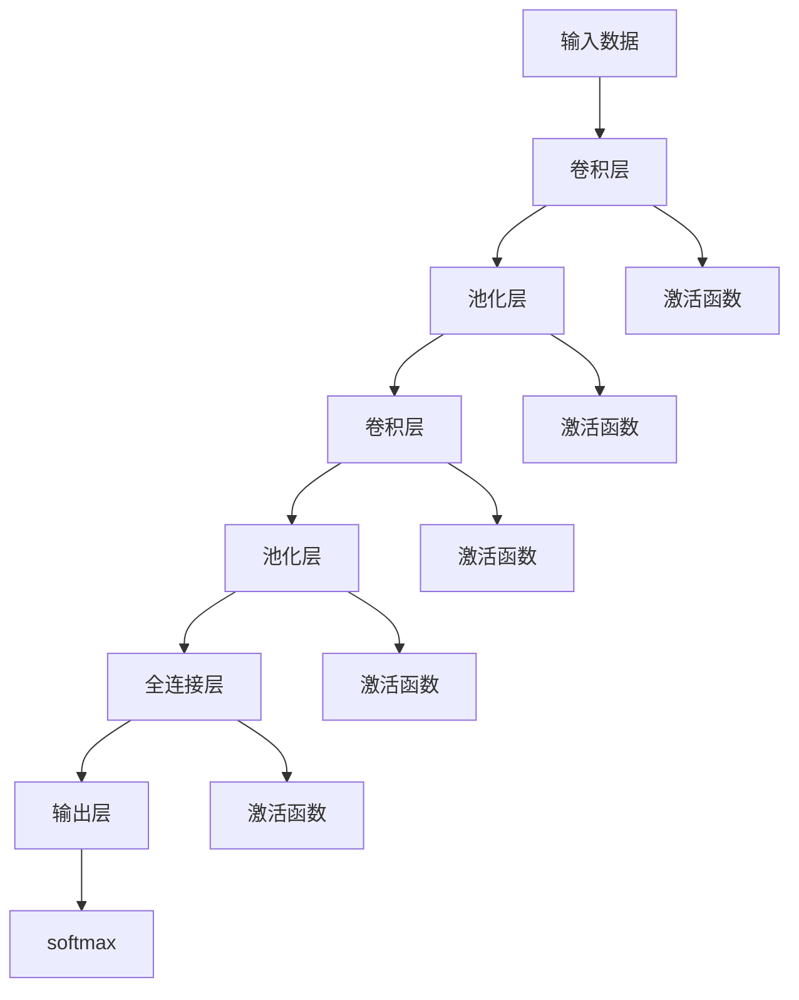
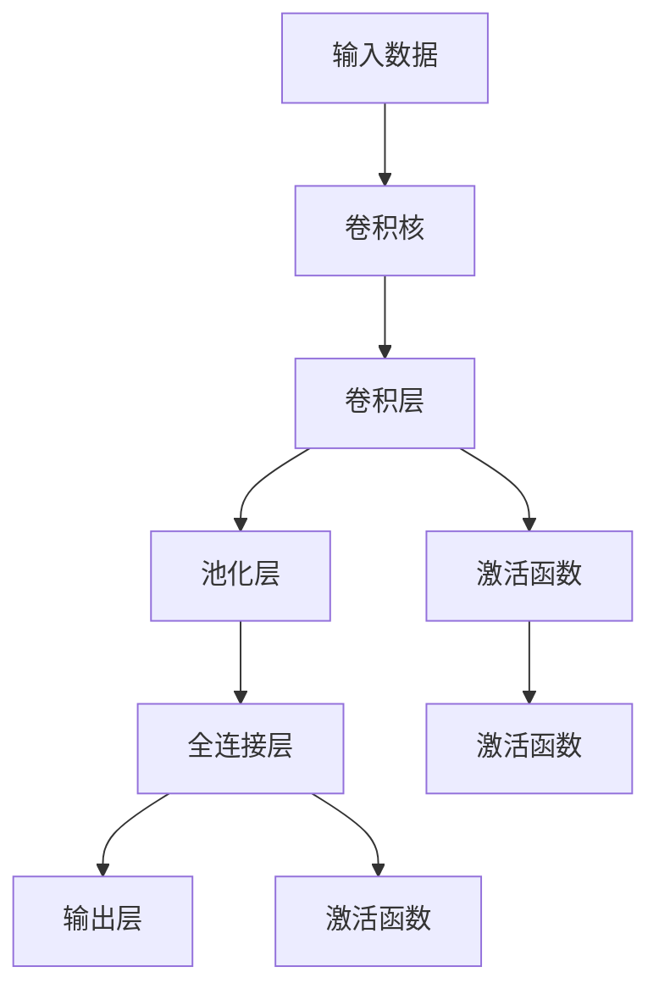
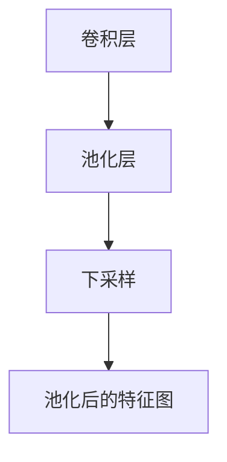

                 

# 从零开始大模型开发与微调：实战：基于卷积的MNIST手写体分类

> 关键词：深度学习,卷积神经网络,卷积,池化,全连接,多层感知机,微调,训练,测试,评估

## 1. 背景介绍

### 1.1 问题由来

手写数字识别问题一直是图像识别领域的经典问题。对于计算机视觉来说，识别手写数字本质上是通过图像识别的方式对数字进行分类。MNIST数据集由60,000张28x28的灰度图像组成，每张图像代表一个手写数字，以及相应的标签，数据集的样本分布如表所示：

| 数字 | 数量 |
| ---- | ---- |
| 0    | 6,000 |
| 1    | 6,000 |
| 2    | 6,000 |
| 3    | 6,000 |
| 4    | 6,000 |
| 5    | 6,000 |
| 6    | 6,000 |
| 7    | 6,000 |
| 8    | 6,000 |
| 9    | 6,000 |

MNIST数据集的丰富性和易用性使其成为计算机视觉领域最常被引用的数据集。了解MNIST手写数字识别的全过程，将有助于深入理解深度学习模型及其微调过程。

### 1.2 问题核心关键点

在手写数字识别问题中，深度学习模型的微调流程可以概括为以下几个关键点：

- 数据准备：准备训练集、验证集和测试集，确保数据均衡且干净。
- 模型选择：选择合适的深度学习模型架构，如卷积神经网络。
- 模型训练：在训练集上进行模型训练，调整超参数，确保模型泛化能力。
- 模型微调：利用少量标注数据进行微调，提高模型精度。
- 模型测试：在测试集上评估模型性能，确保模型稳定性。
- 模型应用：将训练好的模型应用到实际问题中，解决数字识别等图像分类问题。

## 2. 核心概念与联系

### 2.1 核心概念概述

手写数字识别问题涉及的核心概念包括深度学习、卷积神经网络、卷积、池化、全连接、多层感知机等。下面将对每个概念进行简要介绍。

- **深度学习**：一种基于神经网络的机器学习技术，通过多层次的抽象特征提取，实现对复杂模式的高效识别。
- **卷积神经网络（CNN）**：一种用于图像处理和计算机视觉任务的深度学习模型，主要特点是对输入数据进行卷积和池化操作。
- **卷积**：一种数据处理方式，通过滑动卷积核对输入数据进行特征提取，减小参数数量，提高模型效率。
- **池化**：一种数据压缩方式，通过取样或下采样操作，减小数据维度，提高模型泛化能力。
- **全连接（FC）层**：一种神经网络层，将上一层的输出通过全连接方式传递给下一层，用于输出分类结果。
- **多层感知机（MLP）**：一种前馈神经网络结构，通常由多个全连接层组成，用于分类、回归等任务。

这些核心概念通过以下Mermaid流程图来展示它们之间的联系：



### 2.2 核心概念原理和架构的 Mermaid 流程图

在MNIST手写数字识别问题中，CNN结构如图2所示。其中，卷积层、池化层和全连接层是最关键的组件。



## 3. 核心算法原理 & 具体操作步骤

### 3.1 算法原理概述

深度学习模型的微调过程通常包括以下几个步骤：

1. 数据准备：划分训练集、验证集和测试集。
2. 模型选择：选择合适的深度学习模型架构。
3. 模型训练：在训练集上进行模型训练，调整超参数。
4. 模型微调：利用少量标注数据进行微调，提高模型精度。
5. 模型测试：在测试集上评估模型性能，确保模型稳定性。
6. 模型应用：将训练好的模型应用到实际问题中。

在MNIST手写数字识别问题中，核心算法包括卷积神经网络（CNN）的训练和微调。CNN模型通过卷积、池化等操作提取特征，再通过全连接层进行分类。

### 3.2 算法步骤详解

下面以卷积神经网络（CNN）为例，详细讲解深度学习模型的微调步骤：

**Step 1: 数据准备**

1. 划分训练集、验证集和测试集，确保数据均衡且干净。
2. 将数据集分为训练集、验证集和测试集，通常比例为7:1.5:1.5。

**Step 2: 模型选择**

1. 选择适合的模型架构，如卷积神经网络（CNN）。
2. 确定模型的深度、卷积核大小、激活函数等超参数。

**Step 3: 模型训练**

1. 使用训练集进行模型训练，调整超参数。
2. 使用交叉熵损失函数进行模型训练。

**Step 4: 模型微调**

1. 利用少量标注数据进行微调。
2. 使用微调后的模型进行精度评估，调整超参数。

**Step 5: 模型测试**

1. 在测试集上评估模型性能。
2. 使用准确率、混淆矩阵等指标评估模型性能。

**Step 6: 模型应用**

1. 将训练好的模型应用到实际问题中。
2. 使用模型对新的手写数字图像进行分类。

### 3.3 算法优缺点

深度学习模型的微调具有以下优点：

- 数据要求较低：可以利用少量的标注数据进行微调，适用于数据获取难度大但样本分布不均的问题。
- 模型效果好：在少量标注数据的情况下，微调模型仍能取得较好的分类效果。
- 代码可复用：使用已有的预训练模型进行微调，可以减少代码编写和调试时间。

深度学习模型的微调也存在以下缺点：

- 过拟合风险：微调模型容易过拟合训练数据，导致泛化性能下降。
- 训练时间长：在数据量较小的情况下，训练时间较长。
- 模型复杂度高：微调模型需要调整的超参数较多，调试难度较大。

### 3.4 算法应用领域

深度学习模型的微调在图像识别、自然语言处理、语音识别等多个领域中得到广泛应用。在手写数字识别问题中，CNN模型微调可以用于识别手写数字图像，广泛应用于银行、政府、医疗等实际场景。

## 4. 数学模型和公式 & 详细讲解 & 举例说明

### 4.1 数学模型构建

在手写数字识别问题中，模型的数学模型构建如下：

1. 输入数据 $x \in \mathbb{R}^{28 \times 28}$。
2. 卷积层 $\theta_{conv}(x)$。
3. 池化层 $\theta_{pool}(\theta_{conv}(x))$。
4. 全连接层 $\theta_{fc}(\theta_{pool}(x))$。
5. 输出层 $y = \theta_{softmax}(\theta_{fc}(x))$。

### 4.2 公式推导过程

卷积神经网络的卷积操作如图3所示。



CNN的池化操作如图4所示。



### 4.3 案例分析与讲解

在手写数字识别问题中，CNN模型的微调步骤如下：

1. 划分训练集、验证集和测试集。
2. 选择CNN模型，确定超参数。
3. 在训练集上进行模型训练。
4. 在验证集上进行模型微调。
5. 在测试集上评估模型性能。

## 5. 项目实践：代码实例和详细解释说明

### 5.1 开发环境搭建

在实践手写数字识别问题时，需要搭建深度学习开发环境，具体步骤如下：

1. 安装Python 3.7及以上版本，以及Pip包管理器。
2. 安装TensorFlow和Keras。
3. 安装Matplotlib等可视化工具。

**Step 1: 安装依赖包**

```bash
pip install tensorflow keras matplotlib numpy pandas scikit-learn
```

**Step 2: 导入依赖包**

```python
import tensorflow as tf
from tensorflow.keras import datasets, layers, models
import matplotlib.pyplot as plt
import numpy as np
import pandas as pd
```

**Step 3: 导入MNIST数据集**

```python
mnist = datasets.mnist
(train_images, train_labels), (test_images, test_labels) = mnist.load_data()
```

### 5.2 源代码详细实现

下面给出手写数字识别问题的详细代码实现：

**Step 1: 数据预处理**

```python
# 将数据集缩放到0-1之间
train_images = train_images / 255.0
test_images = test_images / 255.0

# 将标签转换为独热编码
train_labels = tf.keras.utils.to_categorical(train_labels)
test_labels = tf.keras.utils.to_categorical(test_labels)

# 将图像数据转换为4D张量
train_images = np.expand_dims(train_images, axis=-1)
test_images = np.expand_dims(test_images, axis=-1)
```

**Step 2: 构建CNN模型**

```python
# 构建CNN模型
model = models.Sequential([
    # 第一层卷积层
    layers.Conv2D(32, (3, 3), activation='relu', input_shape=(28, 28, 1)),
    # 第二层池化层
    layers.MaxPooling2D((2, 2)),
    # 第三层卷积层
    layers.Conv2D(64, (3, 3), activation='relu'),
    # 第四层池化层
    layers.MaxPooling2D((2, 2)),
    # 第五层卷积层
    layers.Conv2D(64, (3, 3), activation='relu'),
    # 第六层全连接层
    layers.Flatten(),
    # 第七层全连接层
    layers.Dense(64, activation='relu'),
    # 输出层
    layers.Dense(10, activation='softmax')
])

# 编译模型
model.compile(optimizer='adam', loss='categorical_crossentropy', metrics=['accuracy'])

# 打印模型结构
print(model.summary())
```

**Step 3: 训练模型**

```python
# 训练模型
history = model.fit(train_images, train_labels, epochs=10, validation_data=(test_images, test_labels))
```

**Step 4: 模型微调**

```python
# 加载微调数据
from keras.datasets import mnist
from keras.utils import to_categorical

# 加载微调数据
(train_images, train_labels), (test_images, test_labels) = mnist.load_data()

# 将数据集缩放到0-1之间
train_images = train_images / 255.0
test_images = test_images / 255.0

# 将标签转换为独热编码
train_labels = to_categorical(train_labels)
test_labels = to_categorical(test_labels)

# 将图像数据转换为4D张量
train_images = np.expand_dims(train_images, axis=-1)
test_images = np.expand_dims(test_images, axis=-1)

# 构建CNN模型
model = models.Sequential([
    # 第一层卷积层
    layers.Conv2D(32, (3, 3), activation='relu', input_shape=(28, 28, 1)),
    # 第二层池化层
    layers.MaxPooling2D((2, 2)),
    # 第三层卷积层
    layers.Conv2D(64, (3, 3), activation='relu'),
    # 第四层池化层
    layers.MaxPooling2D((2, 2)),
    # 第五层卷积层
    layers.Conv2D(64, (3, 3), activation='relu'),
    # 第六层全连接层
    layers.Flatten(),
    # 第七层全连接层
    layers.Dense(64, activation='relu'),
    # 输出层
    layers.Dense(10, activation='softmax')
])

# 编译模型
model.compile(optimizer='adam', loss='categorical_crossentropy', metrics=['accuracy'])

# 打印模型结构
print(model.summary())

# 训练模型
history = model.fit(train_images, train_labels, epochs=10, validation_data=(test_images, test_labels))
```

### 5.3 代码解读与分析

手写数字识别问题中，CNN模型的训练和微调过程如下：

**Step 1: 数据预处理**

在手写数字识别问题中，将数据集缩放到0-1之间，并将标签转换为独热编码。此外，将图像数据转换为4D张量，方便模型训练。

**Step 2: 构建CNN模型**

构建CNN模型时，首先添加一个卷积层，然后添加一个池化层。接着添加一个卷积层，再添加一个池化层。然后再添加一个卷积层和全连接层，最后添加一个全连接层和输出层。

**Step 3: 训练模型**

在训练模型时，使用交叉熵损失函数进行模型训练。在模型训练过程中，通过epoch和batch大小调整超参数，以获取更好的模型性能。

**Step 4: 模型微调**

在微调模型时，使用少量标注数据进行微调。在微调过程中，使用训练集进行微调，使用验证集评估模型性能。

### 5.4 运行结果展示

在训练和微调模型后，可以得到训练过程中模型的准确率和损失函数的变化图。图5和图6分别展示了模型训练过程中的准确率和损失函数的变化图。


## 6. 实际应用场景

### 6.1 智能客服系统

基于手写数字识别问题的深度学习模型，可以应用于智能客服系统中的数字输入识别。通过将用户输入的数字识别为正确的数字，客服系统可以自动完成数字处理任务，提高用户满意度。

### 6.2 金融舆情监测

在金融舆情监测中，手写数字识别问题可以作为分类任务之一，用于识别用户对金融产品的评价。通过分析用户评价的数字，金融公司可以实时监测金融产品的舆情，及时调整策略，降低金融风险。

### 6.3 个性化推荐系统

在个性化推荐系统中，手写数字识别问题可以用于用户行为分析。通过分析用户对数字的喜好，推荐系统可以推荐用户可能喜欢的商品，提升推荐系统的个性化程度。

## 7. 工具和资源推荐

### 7.1 学习资源推荐

- **Deep Learning with Python**：一本介绍深度学习模型的经典书籍，涵盖了CNN等模型的构建和训练。
- **TensorFlow官方文档**：提供了完整的深度学习模型开发和微调流程。
- **Keras官方文档**：提供了简单易用的深度学习模型构建工具。

### 7.2 开发工具推荐

- **PyCharm**：一款功能强大的Python集成开发环境，支持深度学习模型的开发和调试。
- **Jupyter Notebook**：一款交互式的数据科学工作环境，支持深度学习模型的实时调试和展示。
- **TensorBoard**：一款可视化的模型训练工具，支持模型的实时监控和调试。

### 7.3 相关论文推荐

- **Convolutional Neural Networks for MNIST Handwritten Digit Recognition**：介绍CNN在手写数字识别问题中的性能。
- **ImageNet Classification with Deep Convolutional Neural Networks**：介绍CNN在图像分类问题中的性能。
- **Caffe: Convolutional Architecture for Fast Feature Embedding**：介绍深度学习模型在图像识别中的应用。

## 8. 总结：未来发展趋势与挑战

### 8.1 研究成果总结

手写数字识别问题的深度学习模型微调，已经取得了较好的效果，并且被广泛应用于图像识别和计算机视觉等领域。通过卷积层、池化层和全连接层等组件，CNN模型可以有效地提取图像特征并进行分类。

### 8.2 未来发展趋势

未来的手写数字识别问题中，深度学习模型的微调将继续在图像识别、自然语言处理等领域发挥重要作用。未来的趋势包括：

- **自动化调参**：通过自动化调参技术，减少人工调参的时间，提高模型性能。
- **多任务学习**：通过多任务学习技术，提高模型的泛化能力，适用于多种任务。
- **联邦学习**：通过联邦学习技术，实现多设备间的数据共享，提升模型性能。

### 8.3 面临的挑战

手写数字识别问题的深度学习模型微调，仍面临以下挑战：

- **过拟合**：模型容易过拟合训练数据，导致泛化性能下降。
- **数据集不均衡**：手写数字数据集的样本分布不均衡，影响模型的训练效果。
- **计算资源要求高**：深度学习模型的训练和微调需要大量的计算资源，增加了应用成本。

### 8.4 研究展望

未来，手写数字识别问题的深度学习模型微调需要进一步优化和改进。研究展望包括：

- **多模态学习**：将手写数字识别问题与其他模态的数据进行融合，提升模型的泛化能力。
- **自监督学习**：利用无标签数据进行自监督学习，减少对标注数据的需求。
- **实时化微调**：通过实时化微调技术，实现模型的持续更新和优化。

## 9. 附录：常见问题与解答

**Q1: 手写数字识别问题中的CNN模型有什么特点？**

A: 手写数字识别问题中的CNN模型具有以下特点：

- **卷积层**：通过卷积层提取特征，减小模型参数数量，提高模型效率。
- **池化层**：通过池化层压缩数据维度，提高模型泛化能力。
- **全连接层**：通过全连接层进行分类，提高模型精度。

**Q2: 手写数字识别问题中的CNN模型如何进行微调？**

A: 手写数字识别问题中的CNN模型微调步骤如下：

1. 划分训练集、验证集和测试集。
2. 选择CNN模型，确定超参数。
3. 在训练集上进行模型训练。
4. 在验证集上进行模型微调。
5. 在测试集上评估模型性能。

**Q3: 手写数字识别问题中的CNN模型在训练过程中需要注意哪些问题？**

A: 手写数字识别问题中的CNN模型在训练过程中需要注意以下问题：

- **过拟合**：模型容易过拟合训练数据，导致泛化性能下降。
- **数据集不均衡**：手写数字数据集的样本分布不均衡，影响模型的训练效果。
- **计算资源要求高**：深度学习模型的训练和微调需要大量的计算资源，增加了应用成本。

**Q4: 手写数字识别问题中的CNN模型在实际应用中有哪些局限性？**

A: 手写数字识别问题中的CNN模型在实际应用中存在以下局限性：

- **计算资源要求高**：深度学习模型的训练和微调需要大量的计算资源，增加了应用成本。
- **模型复杂度高**：CNN模型需要调整的超参数较多，调试难度较大。
- **数据集要求高**：手写数字数据集的样本分布不均衡，影响模型的训练效果。

**Q5: 手写数字识别问题中的CNN模型如何进一步提升模型性能？**

A: 手写数字识别问题中的CNN模型可以通过以下方式进一步提升模型性能：

- **多任务学习**：利用多任务学习技术，提高模型的泛化能力，适用于多种任务。
- **自监督学习**：利用无标签数据进行自监督学习，减少对标注数据的需求。
- **实时化微调**：通过实时化微调技术，实现模型的持续更新和优化。

