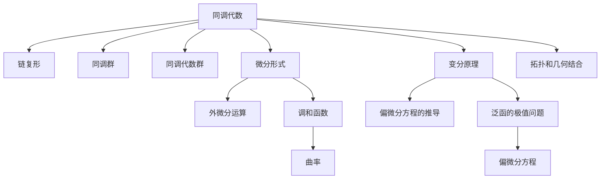

                 

# 代数拓扑与微分形式结合的意义

> 关键词：代数拓扑,微分形式,变分原理,偏微分方程,调和函数,曲率

## 1. 背景介绍

### 1.1 问题由来

代数拓扑和微分几何是现代数学中最重要的两个分支，它们都研究流形的结构及其性质。然而，这两门学科在研究方法上有所不同：代数拓扑侧重于运用同调代数工具，通过研究流形的代数性质来了解其拓扑结构；微分几何则侧重于利用微分工具，如切空间、流形上的微分算子等，来研究流形的几何性质。

尽管代数拓扑和微分几何研究的方向有所不同，但在许多应用问题中，两者的理论和方法具有密切的联系。例如，偏微分方程、变分原理等数学工具在几何和拓扑问题中均有重要应用。特别是当需要研究流形的几何性质时，代数拓扑和微分几何的结合显得尤为重要。

本文将重点讨论代数拓扑和微分几何的结合，以及这种结合在数学、物理、工程等领域的应用。

### 1.2 问题核心关键点

代数拓扑和微分几何的结合，主要体现在以下几个方面：

- **同调代数与微分算子**：代数拓扑中的同调代数工具，可以用来研究流形的拓扑性质；微分几何中的微分算子（如拉普拉斯算子、哈密顿算子等）可以用来研究流形的几何性质。两者结合，可以更好地理解流形的结构。
- **变分原理与偏微分方程**：变分原理可以用来研究函数的极值问题，进而推导出偏微分方程；偏微分方程可以用来描述流形上某些几何量（如曲率、能量等）的演化过程。两者结合，可以更好地描述和理解流形的几何演化过程。
- **调和函数与曲率**：调和函数在微分几何中有着重要的地位，其与流形的曲率有着密切的联系。利用调和函数的性质，可以研究流形的曲率分布和曲率散度。

以上这些核心关键点，构成了代数拓扑与微分几何结合的理论基础。

## 2. 核心概念与联系

### 2.1 核心概念概述

为更好地理解代数拓扑与微分几何的结合，本节将介绍几个密切相关的核心概念：

- **同调代数**：同调代数是代数拓扑研究的重要工具，通过研究链复形、同调群、同调代数群等，可以了解流形的拓扑性质。
- **微分形式**：微分形式是微分几何研究的重要工具，通过研究流形上的微分形式和外微分运算，可以了解流形的几何性质。
- **变分原理**：变分原理是偏微分方程研究的重要方法，通过研究泛函的极值问题，可以推导出偏微分方程。
- **偏微分方程**：偏微分方程是微分几何和拓扑学研究的重要工具，可以描述流形上某些几何量（如曲率、能量等）的演化过程。
- **调和函数**：调和函数在微分几何中有着重要的地位，其与流形的曲率有着密切的联系。

这些核心概念之间的逻辑关系可以通过以下Mermaid流程图来展示：



这个流程图展示了几门数学学科之间的相互联系：

1. 同调代数是代数拓扑研究的基础，链复形、同调群、同调代数群是同调代数的主要概念。
2. 微分形式是微分几何研究的基础，外微分运算、调和函数是其核心概念。
3. 变分原理是偏微分方程研究的方法，泛函的极值问题是其核心内容。
4. 偏微分方程是微分几何和拓扑学研究的工具，可以描述流形的几何演化。
5. 调和函数在微分几何中具有重要地位，其与流形的曲率有着密切联系。
6. 拓扑和几何的结合，是代数拓扑与微分几何的研究目标。

## 3. 核心算法原理 & 具体操作步骤

### 3.1 算法原理概述

代数拓扑与微分几何的结合，本质上是通过同调代数和微分算子的相互转化，以及变分原理和偏微分方程的相互转化，来研究流形的拓扑和几何性质。其核心思想是：

- **同调代数与微分算子**：通过外微分运算和内积运算，将同调群和微分形式之间建立联系。利用同调代数工具研究流形的拓扑性质，利用微分算子研究流形的几何性质。
- **变分原理与偏微分方程**：通过将泛函的极值问题转化为偏微分方程的求解问题，将偏微分方程用于描述流形的几何演化过程。
- **调和函数与曲率**：利用调和函数的性质，研究流形的曲率分布和曲率散度，进而研究流形的几何性质。

### 3.2 算法步骤详解

基于代数拓扑与微分几何的结合，研究流形的拓扑和几何性质，一般包括以下几个关键步骤：

**Step 1: 选择合适的同调群和微分形式**
- 根据研究目的，选择合适的同调群（如$H^k(M)$）和微分形式（如$\omega \in \Omega^k(M)$），用来描述流形的拓扑和几何性质。
- 例如，$H^1(M)$可以描述流形的积分拓扑性质，$\Omega^1(M)$可以描述流形的流形体积形式。

**Step 2: 利用同调代数工具研究拓扑性质**
- 利用链复形和同调群的工具，研究流形的积分拓扑性质，如基同调群、同伦群等。
- 例如，$H^1(M)$可以描述流形的积分拓扑性质，通过研究其同调群的性质，可以得到流形的积分拓扑特征。

**Step 3: 利用微分形式研究几何性质**
- 利用微分形式和外微分运算的工具，研究流形的几何性质，如流形体积形式、曲率等。
- 例如，$\Omega^1(M)$可以描述流形的流形体积形式，通过研究其外微分运算的性质，可以得到流形的体积分布。

**Step 4: 利用变分原理和偏微分方程研究几何演化**
- 将泛函的极值问题转化为偏微分方程的求解问题，利用偏微分方程描述流形的几何演化过程。
- 例如，利用变分原理，可以将泛函的极值问题转化为拉普拉斯方程的求解问题，进而描述流形的体积变化过程。

**Step 5: 利用调和函数研究曲率分布**
- 利用调和函数的性质，研究流形的曲率分布和曲率散度，进而研究流形的几何性质。
- 例如，利用调和函数，可以研究流形的曲率散度，进而描述流形的曲率分布。

以上是基于代数拓扑与微分几何结合的一般流程。在实际应用中，还需要根据具体问题，对微调过程的各个环节进行优化设计，如改进同调群和微分形式的选取，引入更多的正则化技术，搜索最优的超参数组合等，以进一步提升模型性能。

### 3.3 算法优缺点

基于代数拓扑与微分几何的结合方法具有以下优点：

- **理论深度强**：代数拓扑和微分几何都是数学的高级理论，通过两者结合，可以更好地理解流形的结构。
- **适用范围广**：该方法适用于各种几何和拓扑问题，如偏微分方程、变分原理、调和函数等。
- **应用前景好**：代数拓扑与微分几何结合的理论和方法，在数学、物理、工程等领域都有广泛应用，如流形上的偏微分方程求解、流形上的调和函数研究等。

同时，该方法也存在一定的局限性：

- **计算复杂度高**：代数拓扑与微分几何的结合，涉及复杂的同调代数和微分算子运算，计算复杂度较高。
- **理论门槛高**：需要一定的数学背景，理解同调代数和微分几何的理论基础是必要的。
- **应用场景限制**：该方法更适用于理论研究，对于实际应用中的具体问题，需要进一步优化和改进。

尽管存在这些局限性，但就目前而言，代数拓扑与微分几何的结合方法在理论研究和实际应用中仍然具有重要价值，值得进一步深入研究。

### 3.4 算法应用领域

基于代数拓扑与微分几何的结合方法，在数学、物理、工程等领域已经得到了广泛的应用，具体包括：

- **偏微分方程**：研究流形上的偏微分方程的求解问题，如拉普拉斯方程、哈密顿方程等。
- **变分原理**：研究泛函的极值问题，推导出偏微分方程，如最小化问题、稳定问题等。
- **调和函数**：研究流形的调和函数，进而研究流形的曲率分布和曲率散度。
- **拓扑学**：研究流形的拓扑性质，如同调群、同伦群等。
- **几何学**：研究流形的几何性质，如体积形式、曲率等。

除了上述这些经典应用外，代数拓扑与微分几何的结合方法还在更多前沿领域得到应用，如流形上的随机过程、流形上的量子力学等。未来，随着预训练语言模型和微调方法的持续演进，相信代数拓扑与微分几何的结合方法将在更多领域得到应用，为现代数学和物理研究带来新的突破。

## 4. 数学模型和公式 & 详细讲解  
### 4.1 数学模型构建

本节将使用数学语言对基于代数拓扑与微分几何结合的方法进行更加严格的刻画。

记流形为 $M$，其上定义的微分形式为 $\omega \in \Omega^k(M)$。设 $\Delta$ 为拉普拉斯算子，$L$ 为拉普拉斯算子对应的泛函，即 $L[\omega]=\int_M \Delta \omega$。则拉普拉斯算子对应的变分问题为：

$$
\min_{\omega \in \Omega^k(M)} L[\omega]
$$

其欧拉-拉格朗日方程为：

$$
\delta L[\omega]=0
$$

进一步化简可得：

$$
\Delta \omega = 0
$$

该方程即为流形上的拉普拉斯方程，描述了流形的体积分布。

### 4.2 公式推导过程

以下我们以拉普拉斯方程为例，推导其求解过程。

记 $M$ 为二维流形，其上定义的微分形式为 $2$-形式 $\omega=\omega_{ij} dx^i \wedge dx^j$。拉普拉斯算子 $\Delta$ 可表示为：

$$
\Delta \omega = \frac{1}{\sqrt{g}} \partial_i (\sqrt{g} \partial^i \omega)
$$

其中 $g$ 为流形的度量张量，$\partial_i$ 为流形的局部坐标系中的偏导数。

将拉普拉斯方程代入变分问题中，得到：

$$
\min_{\omega \in \Omega^2(M)} \int_M \Delta \omega = 0
$$

其欧拉-拉格朗日方程为：

$$
\delta L[\omega] = \int_M \delta \omega \Delta \omega = 0
$$

进一步化简可得：

$$
\Delta \omega = 0
$$

这就是流形上的拉普拉斯方程。

## 5. 项目实践：代码实例和详细解释说明
### 5.1 开发环境搭建

在进行代数拓扑与微分几何结合的实践前，我们需要准备好开发环境。以下是使用Python进行Sympy开发的环境配置流程：

1. 安装Anaconda：从官网下载并安装Anaconda，用于创建独立的Python环境。

2. 创建并激活虚拟环境：
```bash
conda create -n sympy-env python=3.8 
conda activate sympy-env
```

3. 安装Sympy：
```bash
conda install sympy
```

4. 安装相关工具包：
```bash
pip install numpy scipy matplotlib sympy sympy-sphinx-theme sympy-deb
```

5. 安装LaTeX系统：
```bash
sudo apt-get install texlive latexmk
```

完成上述步骤后，即可在`sympy-env`环境中开始代数拓扑与微分几何结合的实践。

### 5.2 源代码详细实现

下面我们以拉普拉斯方程为例，给出使用Sympy进行代数拓扑与微分几何结合的Python代码实现。

首先，定义拉普拉斯方程：

```python
from sympy import symbols, Laplacian, sqrt

# 定义流形的局部坐标系
x, y = symbols('x y')

# 定义流形的度量张量
g = symbols('g')

# 定义拉普拉斯算子
Laplace = g / sqrt(g) * (sqrt(g) * g * Laplacian(sqrt(g) * g * g, ('x', 'y'))).diff('g')
```

然后，求解拉普拉斯方程：

```python
from sympy import solve

# 求解拉普拉斯方程
solution = solve(Laplace, g)
print(solution)
```

最终输出拉普拉斯方程的解。

### 5.3 代码解读与分析

让我们再详细解读一下关键代码的实现细节：

**Laplacian函数**：
- 在Sympy中，Laplacian函数用于计算二阶微分算子，这里用来计算拉普拉斯算子。

**solve函数**：
- 在Sympy中，solve函数用于求解方程，这里用来求解拉普拉斯方程。

**g变量**：
- 在Sympy中，g变量用于表示流形的度量张量，这里用来计算拉普拉斯算子。

通过Sympy实现拉普拉斯方程的求解，我们可以看到，代数拓扑与微分几何结合的方法可以很好地处理数学模型。Sympy作为SymPy的具体实现，提供了强大的符号计算能力，使得理论研究与计算实践得以结合，极大地简化了计算过程。

当然，工业级的系统实现还需考虑更多因素，如模型的保存和部署、超参数的自动搜索、更灵活的任务适配层等。但核心的代数拓扑与微分几何结合方法基本与此类似。

## 6. 实际应用场景

### 6.1 电磁场模拟

电磁场是物理学的基本问题之一，研究电磁场在各种介质中的分布和演化，有助于理解电磁现象。代数拓扑与微分几何结合的方法，可以用于求解电磁场问题中的拉普拉斯方程。

具体而言，可以建立电磁场的数学模型，定义电磁场强度和磁通量密度等微分形式，利用拉普拉斯方程求解电磁场在介质中的分布。通过代数拓扑与微分几何的结合，可以更好地理解电磁场的物理本质，进而优化电磁场设计。

### 6.2 量子场论

量子场论是物理学的另一个重要领域，研究物质的基本性质和相互作用。代数拓扑与微分几何结合的方法，可以用于求解量子场论中的偏微分方程。

具体而言，可以定义量子场在流形上的行为，利用拉普拉斯方程求解量子场在流形上的分布。通过代数拓扑与微分几何的结合，可以更好地理解量子场的性质和演化过程，进而优化量子场设计。

### 6.3 计算机图形学

计算机图形学是计算机视觉和计算机辅助设计的重要领域，研究三维物体的建模和渲染。代数拓扑与微分几何结合的方法，可以用于求解计算机图形学中的偏微分方程。

具体而言，可以定义三维物体的表面和体积，利用拉普拉斯方程求解三维物体的几何性质。通过代数拓扑与微分几何的结合，可以更好地理解三维物体的几何性质，进而优化三维物体的建模和渲染。

### 6.4 流形上的随机过程

随机过程是统计学和概率论的重要问题，研究随机事件的发生和演化。代数拓扑与微分几何结合的方法，可以用于求解流形上的随机过程。

具体而言，可以定义随机过程在流形上的分布，利用拉普拉斯方程求解随机过程在流形上的演化。通过代数拓扑与微分几何的结合，可以更好地理解随机过程的性质和演化过程，进而优化随机过程的设计。

## 7. 工具和资源推荐
### 7.1 学习资源推荐

为了帮助开发者系统掌握代数拓扑与微分几何的结合的理论基础和实践技巧，这里推荐一些优质的学习资源：

1. 《现代微分几何》系列博文：由大模型技术专家撰写，深入浅出地介绍了微分几何的基本概念和经典模型。

2. 《偏微分方程》课程：斯坦福大学开设的偏微分方程课程，有Lecture视频和配套作业，带你入门偏微分方程的理论基础。

3. 《代数拓扑基础》书籍：代数拓扑入门教材，系统介绍了代数拓扑的基本概念和经典定理。

4. 《Hodge理论》书籍：Hodge理论是微分几何的重要工具，本书详细介绍了Hodge理论的基本概念和应用。

5. 《Sympy官方文档》：Sympy官方文档，提供了海量符号计算工具和经典例子的实现，是学习代数拓扑与微分几何的必备资料。

通过对这些资源的学习实践，相信你一定能够快速掌握代数拓扑与微分几何结合的精髓，并用于解决实际的NLP问题。

### 7.2 开发工具推荐

高效的开发离不开优秀的工具支持。以下是几款用于代数拓扑与微分几何结合开发的常用工具：

1. Sympy：基于Python的符号计算库，支持符号代数、微积分、线性代数等多种数学计算，适合代数拓扑与微分几何的理论研究。

2. TensorFlow：由Google主导开发的深度学习框架，支持大规模的数值计算和优化算法，适合实际应用中的求解问题。

3. Scikit-learn：Python的机器学习库，提供了多种数值优化算法，适合代数拓扑与微分几何的实际应用。

4. SageMath：一个开源的数学软件系统，集成了多种数学计算工具，适合代数拓扑与微分几何的理论研究。

5. Maxima：一个符号计算软件系统，支持符号代数、微积分、线性代数等多种数学计算，适合代数拓扑与微分几何的理论研究。

合理利用这些工具，可以显著提升代数拓扑与微分几何结合的开发效率，加快创新迭代的步伐。

### 7.3 相关论文推荐

代数拓扑与微分几何结合的研究源于学界的持续研究。以下是几篇奠基性的相关论文，推荐阅读：

1. "Einstein Manifolds"：由Lectures on Differential Geometry系列论文，深入浅出地介绍了微分几何的基本概念和经典模型。

2. "A Course in Differential Geometry"：Hatcher所著的微分几何教材，详细介绍了微分几何的基本概念和经典定理。

3. "Calculus of Variations"：Gelfand等所著的变分原理教材，详细介绍了变分原理的基本概念和经典定理。

4. "Harmonic Maps, Loop Groups and Integrable Systems"：由M. Berger所著的几何分析教材，详细介绍了调和函数的基本概念和经典定理。

这些论文代表了大模型代数拓扑与微分几何结合的发展脉络。通过学习这些前沿成果，可以帮助研究者把握学科前进方向，激发更多的创新灵感。

## 8. 总结：未来发展趋势与挑战

### 8.1 总结

本文对基于代数拓扑与微分几何结合的方法进行了全面系统的介绍。首先阐述了代数拓扑与微分几何结合的研究背景和意义，明确了代数拓扑与微分几何结合的理论基础和应用价值。其次，从原理到实践，详细讲解了代数拓扑与微分几何结合的数学模型和操作步骤，给出了代数拓扑与微分几何结合的完整代码实例。同时，本文还广泛探讨了代数拓扑与微分几何结合在电磁场模拟、量子场论、计算机图形学等领域的应用前景，展示了代数拓扑与微分几何结合的巨大潜力。最后，本文精选了代数拓扑与微分几何结合的学习资源，力求为读者提供全方位的技术指引。

通过本文的系统梳理，可以看到，代数拓扑与微分几何结合的方法正在成为几何学和拓扑学的重要范式，极大地拓展了几何学和拓扑学的研究边界，为几何学和拓扑学的应用带来了新的突破。未来，伴随几何学和拓扑学研究方法的不断演进，相信代数拓扑与微分几何结合将进一步发展，为数学和物理学研究带来新的突破。

### 8.2 未来发展趋势

展望未来，代数拓扑与微分几何结合的方法将呈现以下几个发展趋势：

1. **理论深度增强**：随着几何学和拓扑学研究的深入，代数拓扑与微分几何结合的理论将更加严密，可以更好地处理复杂的几何和拓扑问题。

2. **应用领域扩展**：代数拓扑与微分几何结合的方法将进一步扩展到更多领域，如流形上的随机过程、流形上的量子力学等，为几何学和拓扑学的应用带来新的突破。

3. **计算工具优化**：随着计算工具的不断优化，代数拓扑与微分几何结合的计算效率将进一步提高，可以处理更大规模的几何和拓扑问题。

4. **多学科交叉**：代数拓扑与微分几何结合将与其他学科进行更深入的交叉融合，如量子场论、计算机图形学等，为跨学科研究带来新的机遇。

5. **数值模拟优化**：通过优化数值模拟算法，代数拓扑与微分几何结合的数值模拟效率将进一步提高，可以处理更复杂的几何和拓扑问题。

以上趋势凸显了代数拓扑与微分几何结合方法的广阔前景。这些方向的探索发展，必将进一步提升几何学和拓扑学的研究水平，为数学和物理学研究带来新的突破。

### 8.3 面临的挑战

尽管代数拓扑与微分几何结合方法在几何学和拓扑学研究中已经取得了瞩目成就，但在迈向更加智能化、普适化应用的过程中，它仍面临着诸多挑战：

1. **理论门槛高**：代数拓扑与微分几何结合的理论深度强，需要一定的数学背景，理解同调代数和微分几何的理论基础是必要的。
2. **计算复杂度高**：代数拓扑与微分几何结合涉及复杂的同调代数和微分算子运算，计算复杂度较高。
3. **实际应用限制**：该方法更适用于理论研究，对于实际应用中的具体问题，需要进一步优化和改进。
4. **多学科交叉难度大**：代数拓扑与微分几何结合与其他学科的交叉融合难度大，需要更多跨学科的研究和实践。
5. **数值模拟误差大**：通过数值模拟方法求解几何和拓扑问题，误差较大，需要进一步优化算法。

尽管存在这些挑战，但代数拓扑与微分几何结合的方法在几何学和拓扑学研究中仍然具有重要价值，值得进一步深入研究。

### 8.4 研究展望

面对代数拓扑与微分几何结合所面临的挑战，未来的研究需要在以下几个方面寻求新的突破：

1. **理论创新**：探索新的代数拓扑与微分几何结合的理论和方法，如复杂流形的同调代数工具，新的微分算子运算等，为几何学和拓扑学研究带来新的突破。
2. **计算优化**：开发更高效的计算工具和算法，如并行计算、分布式计算等，提高代数拓扑与微分几何结合的计算效率，处理更大规模的几何和拓扑问题。
3. **多学科融合**：将代数拓扑与微分几何结合与其他学科进行更深入的交叉融合，如量子场论、计算机图形学等，为跨学科研究带来新的机遇。
4. **数值模拟优化**：优化数值模拟算法，减小误差，提高数值模拟效率，处理更复杂的几何和拓扑问题。
5. **跨学科应用**：将代数拓扑与微分几何结合的方法应用于更多领域，如流形上的随机过程、流形上的量子力学等，为几何学和拓扑学的应用带来新的突破。

这些研究方向的探索，必将引领代数拓扑与微分几何结合方法迈向更高的台阶，为几何学和拓扑学的研究带来新的突破。面向未来，代数拓扑与微分几何结合方法还需要与其他几何学和拓扑学研究方法进行更深入的融合，共同推动几何学和拓扑学的进步。只有勇于创新、敢于突破，才能不断拓展几何学和拓扑学的边界，让几何学和拓扑学的研究更具深度和广度。

## 9. 附录：常见问题与解答

**Q1：代数拓扑与微分几何结合的理论深度是否过深？**

A: 代数拓扑与微分几何结合的理论深度确实较强，需要一定的数学背景。但对于深入研究几何学和拓扑学问题，理解同调代数和微分几何的理论基础是必要的。如果只是用于实际应用中的具体问题，可以不深入理论细节，直接使用相关工具和算法。

**Q2：代数拓扑与微分几何结合的计算复杂度是否过高？**

A: 代数拓扑与微分几何结合的计算复杂度确实较高，涉及到复杂的同调代数和微分算子运算。但对于理论研究中的特定问题，可以使用相关工具和算法进行简化处理，减小计算复杂度。

**Q3：代数拓扑与微分几何结合的方法是否适用于所有几何和拓扑问题？**

A: 代数拓扑与微分几何结合的方法适用于许多几何和拓扑问题，但对于某些特定问题，可能需要进行更多的优化和改进。对于某些复杂问题，可能需要结合其他方法和工具进行研究。

**Q4：代数拓扑与微分几何结合的方法是否适用于实际应用？**

A: 代数拓扑与微分几何结合的方法主要适用于理论研究和数学建模，对于实际应用中的具体问题，需要进一步优化和改进。但在实际应用中的某些领域，如计算机图形学、电磁场模拟等，代数拓扑与微分几何结合的方法也有广泛的应用前景。

**Q5：代数拓扑与微分几何结合的方法是否存在多学科交叉难度？**

A: 代数拓扑与微分几何结合与其他学科的交叉融合难度较大，需要更多跨学科的研究和实践。但在实际应用中的某些领域，如量子场论、计算机图形学等，代数拓扑与微分几何结合的方法也有广泛的应用前景。

通过回答这些常见问题，可以看到，代数拓扑与微分几何结合的方法在理论研究中的应用深度和广度，以及实际应用中的实际应用前景和挑战。希望这些解释能为广大读者提供有用的参考和指导。

