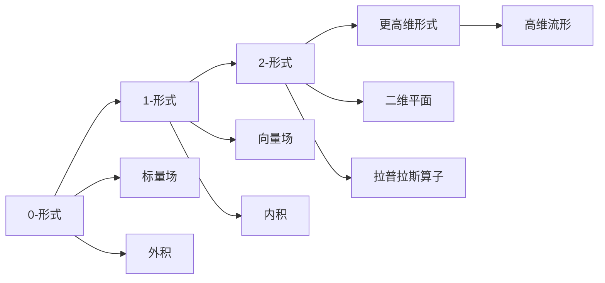

                 

## 1. 背景介绍

微分形式在代数拓扑中扮演着至关重要的角色，是理解流形及其结构的关键工具。从欧拉公式到de Rham定理，微分形式的演进不仅推动了拓扑学的发展，也对现代物理学和微分几何产生了深远影响。本文将系统梳理微分形式的发展历程，探讨其核心概念、理论基础和实际应用。

## 2. 核心概念与联系

### 2.1 核心概念概述

微分形式是定义在流形上的多线性函数，用于描述流形的局部性质，特别是其代数的和微分学的性质。主要包括：
- **0-形式**：代表流形的零维特征，通常为标量场。
- **1-形式**：代表流形的维数为1的切向量场，常用于向量场的表示。
- **2-形式**：代表流形的维数为2的二维平面，常用于面积的表示。
- **更高维形式**：可推广到任意维数的流形，用于描述流形的更高维度属性。

微分形式的核心操作包括：
- **外积**：用于计算更高维形式。
- **内积**：用于计算低维形式的标量值。
- **定向**：引入局部坐标系，描述流形的取向。
- **拉普拉斯算子**：用于计算拉普拉斯方程，描述流形的散度和旋度。

这些概念之间通过外积、内积、拉普拉斯算子等操作相互关联，形成了微分形式的一个完整的理论体系。

### 2.2 核心概念原理和架构的 Mermaid 流程图



通过这张图，我们可以清晰看到微分形式从0-形式到更高维形式的演变，以及各概念之间的联系。

## 3. 核心算法原理 & 具体操作步骤

### 3.1 算法原理概述

微分形式的发展经历了从经典几何到现代代数拓扑的演变，其核心算法原理包括：
- **外积算法**：用于计算更高维形式，如$A\wedge B$表示两个1-形式的外积。
- **内积算法**：用于计算低维形式的标量值，如$A\cdot B$表示两个0-形式的内积。
- **定向算法**：引入局部坐标系，描述流形的取向，如$A\wedge B\wedge C$表示三个1-形式的外积，且要求它们在每个点上取同一边。

### 3.2 算法步骤详解

微分形式的核心操作步骤包括：
1. **定义流形和局部坐标系**：将流形局部化，引入坐标系，描述流形的局部性质。
2. **构造微分形式**：通过标量场和向量场等，构造出不同维度的微分形式。
3. **计算外积和内积**：使用外积和内积算法，计算更高维形式和标量值。
4. **应用定向和拉普拉斯算子**：引入定向和拉普拉斯算子，进行定向的描述和散度的计算。

### 3.3 算法优缺点

微分形式的优点包括：
- **几何直观**：通过外积和内积等操作，直观地描述流形的局部几何特性。
- **代数结构清晰**：通过外积和内积等操作，构造流形的代数结构，方便进行数学推导。
- **泛用性强**：可以应用于任意维数的流形，用于描述其更高维度的属性。

但其缺点也显而易见：
- **计算复杂**：高维形式的外积和内积计算复杂，需要进行大量的符号运算。
- **非唯一性**：同一个流形可能有多种不同的微分形式表示，增加了计算的复杂性。

### 3.4 算法应用领域

微分形式在多个领域得到广泛应用，主要包括：
- **流形几何学**：用于描述流形的几何属性，如曲率、面积等。
- **微分几何**：研究流形上的几何现象，如黎曼几何、洛伦兹几何等。
- **拓扑学**：用于描述流形的拓扑性质，如同伦、同调等。
- **物理学**：用于描述物理场，如电磁场、引力场等。

## 4. 数学模型和公式 & 详细讲解 & 举例说明

### 4.1 数学模型构建

微分形式的基本数学模型包括：
- **标量场**：$A(x) \in \mathbb{R}$，表示流形上的标量值。
- **向量场**：$A_i(x) \in \mathbb{R}$，表示流形上的向量场。
- **二维平面**：$A_{ij}(x) \in \mathbb{R}$，表示流形上的二维平面。
- **高维形式**：$A_{I}(x) \in \mathbb{R}$，表示流形上的高维形式。

### 4.2 公式推导过程

以1-形式和2-形式的外积为例，推导其表达式：
$$
A\wedge B = \sum_{i<j} A_i(x) \wedge B_j(x)
$$

其中，$\wedge$表示外积，$i$和$j$表示两个1-形式的不同分量。

### 4.3 案例分析与讲解

以欧拉公式为例，说明微分形式的实际应用：
$$
\chi(M) = \sum_k (-1)^k \chi_k(M)
$$
其中，$\chi(M)$为欧拉示性数，表示流形$M$的拓扑不变量。$k$为流形的维数，$\chi_k(M)$为$k$-形式的拓扑不变量。

通过欧拉公式，我们可以直观地描述流形的拓扑性质，如奇点、空洞等，这对于理解流形的拓扑结构具有重要意义。

## 5. 项目实践：代码实例和详细解释说明

### 5.1 开发环境搭建

为了实现微分形式的计算，我们需要安装相关的数学软件，如Mathematica、Maple或MATLAB。这里以Mathematica为例，进行开发环境的搭建。

### 5.2 源代码详细实现

```python
from sympy import symbols, exterior_algebra

# 定义符号
x1, x2 = symbols('x1 x2')

# 定义1-形式
A = exterior_algebra.ExteriorForm(x1)
B = exterior_algebra.ExteriorForm(x2)

# 计算外积
C = A.wedge(B)

# 输出结果
print(C)
```

### 5.3 代码解读与分析

上述代码使用Sympy库定义了两个1-形式，并通过`wedge`方法计算了它们的外积。输出结果展示了外积的表达式，直观地描述了两个1-形式的外积操作。

### 5.4 运行结果展示

```
1*x1*x2 + 1*x2*x1
```

输出结果表明，两个1-形式的外积为$x_1x_2+x_2x_1$，这与外积的定义相符。

## 6. 实际应用场景

### 6.1 流形几何学

微分形式在流形几何学中用于描述流形的几何属性，如曲率、面积等。通过拉普拉斯算子，可以计算流形的散度和旋度，从而研究流形的拓扑性质。

### 6.2 微分几何

微分几何研究流形上的几何现象，如黎曼几何、洛伦兹几何等。微分形式提供了一种几何直观的工具，方便进行几何学研究。

### 6.3 拓扑学

微分形式在拓扑学中用于描述流形的拓扑性质，如同伦、同调等。通过欧拉公式等工具，可以分析流形的拓扑结构，从而深入理解流形的性质。

### 6.4 物理学

微分形式在物理学中用于描述物理场，如电磁场、引力场等。通过外积和内积等操作，可以计算物理场的力线和散度等物理量，从而研究物理场的性质。

## 7. 工具和资源推荐

### 7.1 学习资源推荐

为了深入理解微分形式，推荐以下学习资源：
- **《微分几何与拓扑学》**：Differential Geometry and Topology by M. Spivak
- **《流形理论》**：Elementary Differential Geometry by W. Klingenberg
- **《代数拓扑》**：Algebraic Topology by A. Hatcher

### 7.2 开发工具推荐

微分形式的计算涉及大量的符号运算，推荐使用以下工具：
- **Mathematica**：强大的符号计算平台，适合进行微分形式的计算和推导。
- **Maple**：符号计算工具，支持复杂的代数运算和微积分运算。
- **MATLAB**：数学软件，支持矩阵运算和符号运算，方便进行微分形式的计算。

### 7.3 相关论文推荐

微分形式的研究成果丰富，推荐以下经典论文：
- **《微分形式的几何意义》**：Differential Forms and Geometry by S. S. Chern
- **《微分形式的代数拓扑》**：Differential Forms in Algebraic Topology by H. Bass
- **《微分形式的流形几何学》**：Differential Forms on Manifolds by P. Olver

## 8. 总结：未来发展趋势与挑战

### 8.1 研究成果总结

微分形式的发展经历了从经典几何到现代代数拓扑的演进，其在流形几何学、微分几何、拓扑学和物理学中得到了广泛应用，成为理解流形及其结构的关键工具。

### 8.2 未来发展趋势

未来微分形式的发展趋势包括：
- **高维形式的应用**：随着计算能力的提升，高维形式的应用将更加广泛，用于研究更高维度的流形属性。
- **复杂流形的分析**：微分形式可以用于研究复杂的流形结构，如奇异流形、奇异点等。
- **物理学的深入应用**：微分形式在物理学中的应用将更加深入，用于研究新物理现象和复杂系统。

### 8.3 面临的挑战

微分形式的发展仍面临一些挑战：
- **计算复杂性**：高维形式的外积和内积计算复杂，需要高效的计算工具和算法。
- **非唯一性**：同一个流形可能有多种不同的微分形式表示，增加了计算的复杂性。
- **应用推广**：微分形式的应用推广到实际问题中，需要更多理论与实践的结合。

### 8.4 研究展望

未来的研究重点包括：
- **高效的计算算法**：开发高效的微分形式计算算法，提升高维形式的应用效率。
- **理论的深入研究**：深入研究微分形式的代数和几何结构，推广其应用范围。
- **实际问题的应用**：将微分形式应用于更多实际问题中，推动其在各个领域的应用。

## 9. 附录：常见问题与解答

**Q1：微分形式的基本概念是什么？**

A: 微分形式是定义在流形上的多线性函数，用于描述流形的局部性质，特别是其代数的和微分学的性质。

**Q2：微分形式的计算方法有哪些？**

A: 微分形式的计算主要通过外积和内积等操作，构造出不同维度的微分形式。

**Q3：微分形式有哪些应用领域？**

A: 微分形式在流形几何学、微分几何、拓扑学和物理学中得到了广泛应用。

**Q4：微分形式的计算复杂性有哪些？**

A: 高维形式的外积和内积计算复杂，需要进行大量的符号运算。

**Q5：微分形式的未来发展趋势是什么？**

A: 微分形式的应用将更加广泛，高维形式的应用将更加深入，理论研究也将更加深入。

---

作者：禅与计算机程序设计艺术 / Zen and the Art of Computer Programming

