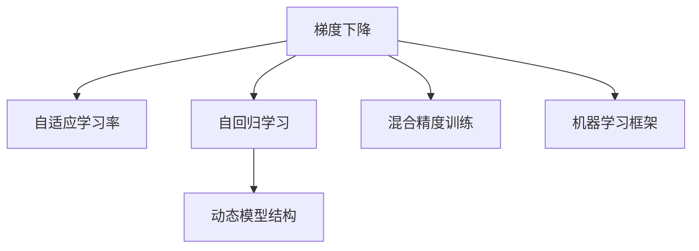

                 

# 优化器 (Optimizer)

> 关键词：优化器,梯度下降,Adam,SGD,自适应学习率,自回归学习,混合精度训练,动态模型结构,机器学习

## 1. 背景介绍

在机器学习领域，优化器（Optimizer）是一种用于更新模型参数以最小化损失函数的工具。优化器的主要作用是根据损失函数对模型参数的梯度信息，调整模型参数值，使得模型逐渐逼近损失函数的最小值，从而优化模型。

优化器在训练深度学习模型时尤为重要，尤其是在训练大模型和复杂模型时。不同的优化器方法具有不同的特点和适用场景，选择合适的优化器可以显著提高模型训练的效率和效果。

## 2. 核心概念与联系

### 2.1 核心概念概述

优化器是机器学习中非常重要的一环，其核心思想是通过调整模型参数来最小化损失函数。本节将介绍几个与优化器密切相关的核心概念：

- 梯度下降（Gradient Descent）：梯度下降是一种基本的优化方法，通过计算损失函数对模型参数的梯度，不断调整参数值，使损失函数值减小。
- 自适应学习率（Adaptive Learning Rate）：自适应学习率优化器能够根据梯度的大小和方向自动调整学习率，从而更有效地更新模型参数。
- 自回归学习（Adaptive Regression）：自回归学习优化器通过回归算法来预测学习率，实现动态调整学习率的效果。
- 混合精度训练（Mixed-Precision Training）：混合精度训练是一种优化训练速度和资源消耗的方法，通过使用半精度浮点数（float16）来代替全精度浮点数（float32），加速训练过程。
- 动态模型结构（Dynamic Model Structure）：动态模型结构优化器能够在训练过程中调整模型结构，如网络深度、宽度等，从而适应不同的训练阶段和数据分布。
- 机器学习框架（Machine Learning Framework）：如TensorFlow、PyTorch等，提供了丰富的优化器库和实现，方便开发者使用。

这些核心概念之间的逻辑关系可以通过以下Mermaid流程图来展示：



这个流程图展示了几大核心概念的相互关系：

1. 梯度下降是优化器的基本原理。
2. 自适应学习率和自回归学习率优化器在梯度下降的基础上，提高了学习率的自适应性。
3. 混合精度训练和动态模型结构优化器通过技术手段提升训练效率和效果。
4. 机器学习框架提供了优化器库和实现，方便开发者使用。

## 3. 核心算法原理 & 具体操作步骤

### 3.1 算法原理概述

优化器算法的基本原理是通过计算损失函数对模型参数的梯度，不断更新模型参数，使损失函数值最小化。梯度的计算通常涉及对损失函数求偏导数，通过反向传播算法实现。优化器则根据梯度信息，更新模型参数。

不同的优化器算法在梯度更新方法上有所不同，但都遵循以下基本步骤：

1. 计算损失函数对模型参数的梯度。
2. 根据梯度信息，计算更新方向和学习率。
3. 根据更新方向和学习率，调整模型参数。
4. 重复步骤1到3，直到损失函数收敛。

### 3.2 算法步骤详解

优化器算法的具体实现过程包括以下几个关键步骤：

**Step 1: 初始化模型参数**
- 随机初始化模型参数 $\theta_0$。

**Step 2: 计算梯度**
- 计算损失函数 $L(\theta)$ 对模型参数 $\theta$ 的梯度 $\nabla L(\theta)$。

**Step 3: 计算更新方向**
- 根据梯度 $\nabla L(\theta)$ 和学习率 $\eta$，计算模型参数的更新方向 $\Delta \theta = -\eta \nabla L(\theta)$。

**Step 4: 更新模型参数**
- 将更新方向 $\Delta \theta$ 应用于模型参数 $\theta$，得到新的参数值 $\theta_{t+1} = \theta_t + \Delta \theta$。

**Step 5: 迭代优化**
- 重复上述步骤，直到损失函数收敛或达到预设的迭代次数。

### 3.3 算法优缺点

优化器算法具有以下优点：
1. 能够自动调整学习率，适应不同的训练阶段和数据分布。
2. 能够处理大规模数据和高维参数空间。
3. 能够避免某些局部极小值，提高模型训练的效果。

同时，优化器算法也存在一些局限性：
1. 对初始参数的敏感性较高。
2. 容易陷入局部极小值。
3. 对异常数据敏感，可能导致模型发散。
4. 计算复杂度高，训练时间较长。

### 3.4 算法应用领域

优化器算法在机器学习和深度学习领域得到了广泛应用，特别是在大模型和复杂模型训练中。以下是几个典型的应用场景：

- 图像分类：优化器算法在卷积神经网络中，用于调整卷积核参数和全连接层参数，提高图像分类性能。
- 自然语言处理：优化器算法在循环神经网络和变换器（Transformer）中，用于调整词向量表示和解码器参数，提高自然语言处理任务的效果。
- 强化学习：优化器算法在策略梯度算法中，用于调整策略参数，提高智能体的决策能力。
- 自适应系统：优化器算法在自适应控制系统（如自动驾驶、机器人控制）中，用于调整控制参数，提高系统的稳定性和鲁棒性。

## 4. 数学模型和公式 & 详细讲解 & 举例说明

### 4.1 数学模型构建

优化器算法通常基于以下数学模型进行优化：

- 损失函数：$L(\theta) = \frac{1}{N}\sum_{i=1}^N l(y_i, \hat{y}_i(\theta))$
- 梯度函数：$\nabla L(\theta) = \frac{1}{N}\sum_{i=1}^N \nabla l(y_i, \hat{y}_i(\theta))$
- 学习率：$\eta_t = \eta_0 \cdot f(\theta_t)$

其中 $l(y_i, \hat{y}_i(\theta))$ 为样本 $i$ 的损失函数，$\hat{y}_i(\theta)$ 为模型在参数 $\theta$ 下的预测值，$N$ 为样本总数，$y_i$ 为真实标签，$f(\theta_t)$ 为自适应学习率函数，$\eta_0$ 为初始学习率。

### 4.2 公式推导过程

以经典的梯度下降算法为例，推导其具体公式。梯度下降算法的更新公式为：

$$
\theta_{t+1} = \theta_t - \eta \nabla L(\theta)
$$

其中 $\eta$ 为学习率，$\nabla L(\theta)$ 为损失函数对模型参数的梯度。

在实际训练过程中，通常使用小批量梯度下降（Mini-Batch Gradient Descent），将样本集分为多个小批量进行更新：

$$
\theta_{t+1} = \theta_t - \eta \frac{1}{m}\sum_{i=1}^m \nabla l(y_i, \hat{y}_i(\theta))
$$

其中 $m$ 为小批量大小，$l(y_i, \hat{y}_i(\theta))$ 为样本 $i$ 的损失函数。

### 4.3 案例分析与讲解

以Adam优化器为例，其更新公式为：

$$
\theta_{t+1} = \theta_t - \eta \frac{m_t}{\sqrt{v_t+\epsilon}} \nabla L(\theta)
$$

其中 $\theta_t$ 为当前模型参数，$\eta$ 为学习率，$m_t$ 为动量（Momentum），$v_t$ 为梯度平方的移动平均值，$\epsilon$ 为防止除以零的常数。

Adam优化器引入了动量和梯度平方的移动平均值，可以更好地适应大规模数据和高维参数空间，同时避免了梯度爆炸或消失的问题。

## 5. 项目实践：代码实例和详细解释说明

### 5.1 开发环境搭建

在进行优化器实践前，我们需要准备好开发环境。以下是使用Python进行TensorFlow开发的环境配置流程：

1. 安装Anaconda：从官网下载并安装Anaconda，用于创建独立的Python环境。

2. 创建并激活虚拟环境：
```bash
conda create -n tf-env python=3.8 
conda activate tf-env
```

3. 安装TensorFlow：根据CUDA版本，从官网获取对应的安装命令。例如：
```bash
conda install tensorflow=2.5 -c conda-forge
```

4. 安装TensorBoard：
```bash
pip install tensorboard
```

5. 安装sklearn：
```bash
pip install scikit-learn
```

完成上述步骤后，即可在`tf-env`环境中开始优化器实践。

### 5.2 源代码详细实现

下面我们以TensorFlow中的Adam优化器为例，给出优化器算法的Python代码实现。

```python
import tensorflow as tf
from tensorflow.keras.optimizers import Adam

# 定义优化器
optimizer = Adam(learning_rate=0.001)

# 定义模型和损失函数
model = tf.keras.models.Sequential([
    tf.keras.layers.Dense(64, activation='relu'),
    tf.keras.layers.Dense(10, activation='softmax')
])
loss = tf.keras.losses.SparseCategoricalCrossentropy()

# 编译模型
model.compile(optimizer=optimizer, loss=loss, metrics=['accuracy'])

# 训练模型
model.fit(x_train, y_train, epochs=10, batch_size=32, validation_data=(x_val, y_val))
```

以上代码实现了使用Adam优化器训练一个简单的全连接神经网络。首先，使用`tf.keras.optimizers.Adam`创建Adam优化器，并指定学习率为0.001。然后，定义模型和损失函数，并使用`model.compile`编译模型。最后，调用`model.fit`训练模型。

### 5.3 代码解读与分析

让我们再详细解读一下关键代码的实现细节：

**optimizer变量**：
- `optimizer = Adam(learning_rate=0.001)` 创建Adam优化器，指定学习率为0.001。

**模型定义**：
- `model = tf.keras.models.Sequential([...])` 定义一个简单的全连接神经网络，包含一个64个神经元的隐藏层和一个10个神经元的输出层。

**损失函数定义**：
- `loss = tf.keras.losses.SparseCategoricalCrossentropy()` 定义交叉熵损失函数。

**模型编译**：
- `model.compile(optimizer=optimizer, loss=loss, metrics=['accuracy'])` 编译模型，指定使用Adam优化器、交叉熵损失函数和精度指标。

**模型训练**：
- `model.fit(x_train, y_train, epochs=10, batch_size=32, validation_data=(x_val, y_val))` 训练模型，指定训练数据集、训练轮数、批次大小和验证数据集。

可以看到，使用TensorFlow实现优化器算法非常简单，只需要通过简单的API调用，即可完成优化器的定义、模型编译和训练。

## 6. 实际应用场景

### 6.1 图像分类

优化器算法在图像分类任务中得到了广泛应用。卷积神经网络（CNN）通常用于图像分类，其参数更新可以通过优化器算法实现。优化器算法在CNN中，主要用于调整卷积核参数和全连接层参数，提高图像分类性能。

### 6.2 自然语言处理

优化器算法在自然语言处理（NLP）任务中也得到了广泛应用。循环神经网络（RNN）和变换器（Transformer）通常用于NLP任务，其参数更新可以通过优化器算法实现。优化器算法在RNN和Transformer中，主要用于调整词向量表示和解码器参数，提高NLP任务的效果。

### 6.3 强化学习

优化器算法在强化学习（RL）中得到了广泛应用。策略梯度算法（Policy Gradient）通常用于强化学习，其参数更新可以通过优化器算法实现。优化器算法在策略梯度算法中，主要用于调整策略参数，提高智能体的决策能力。

### 6.4 未来应用展望

随着优化器算法的不断发展，其在机器学习和深度学习领域的应用前景将更加广阔。未来，优化器算法可能会在以下方面得到进一步发展：

- 自适应学习率优化器：更加智能地调整学习率，提高模型的训练效果。
- 混合精度训练：通过使用半精度浮点数（float16）来代替全精度浮点数（float32），加速训练过程。
- 动态模型结构优化器：在训练过程中调整模型结构，如网络深度、宽度等，从而适应不同的训练阶段和数据分布。
- 混合优化器：结合多种优化器算法，取长补短，提高模型的训练效果。

## 7. 工具和资源推荐

### 7.1 学习资源推荐

为了帮助开发者系统掌握优化器的理论基础和实践技巧，这里推荐一些优质的学习资源：

1. 《深度学习》（Ian Goodfellow等著）：系统介绍了深度学习的基本原理和优化器算法，适合入门学习。

2. 《Python深度学习》（Francois Chollet著）：介绍了如何使用TensorFlow和Keras实现深度学习模型，包括优化器算法。

3. 《机器学习》（Tom Mitchell著）：介绍了机器学习的基本概念和算法，包括梯度下降和优化器算法。

4. 《深度学习入门：基于TensorFlow 2.0的理论与实现》（李沐等著）：介绍了如何使用TensorFlow实现深度学习模型，包括优化器算法。

5. 《TensorFlow深度学习》（Zhang Bo等著）：介绍了如何使用TensorFlow实现深度学习模型，包括优化器算法。

通过对这些资源的学习实践，相信你一定能够快速掌握优化器的精髓，并用于解决实际的机器学习问题。

### 7.2 开发工具推荐

高效的开发离不开优秀的工具支持。以下是几款用于优化器开发的常用工具：

1. TensorFlow：基于Python的开源深度学习框架，灵活动态的计算图，适合快速迭代研究。提供丰富的优化器库和实现。

2. PyTorch：基于Python的开源深度学习框架，动态计算图，适合快速迭代研究。提供丰富的优化器库和实现。

3. Keras：基于TensorFlow和Theano的高级神经网络API，简单易用，适合快速实现和实验深度学习模型。

4. Optimizers：TensorFlow和Keras中集成的优化器库，提供了各种优化器算法及其API接口。

5. Jupyter Notebook：交互式开发环境，支持代码编写、运行和展示，适合快速迭代研究和实验。

6. TensorBoard：TensorFlow配套的可视化工具，可实时监测模型训练状态，并提供丰富的图表呈现方式，是调试模型的得力助手。

合理利用这些工具，可以显著提升优化器算法的开发效率，加快创新迭代的步伐。

### 7.3 相关论文推荐

优化器算法的发展源于学界的持续研究。以下是几篇奠基性的相关论文，推荐阅读：

1. On the Importance of Initialization and Momentum in Deep Learning（使用动量的梯度下降算法）：提出动量（Momentum）优化器，提高了梯度更新的稳定性。

2. RMSProp: Divide the Gradient by a Running Average of Its Recent Magnitudes（RMSProp算法）：提出RMSProp优化器，进一步优化了梯度更新的稳定性。

3. Adaptive Moment Estimation（Adam算法）：提出Adam优化器，引入了动量和梯度平方的移动平均值，提高了梯度更新的稳定性。

4. Adaptive Learning Rate Methods for Online Environments：提出自适应学习率优化器，能够根据梯度的大小和方向自动调整学习率。

5. Deep Learning with Adaptive Learning Rates（Adagrad算法）：提出Adagrad优化器，能够自适应地调整学习率，加速收敛。

6. Efficient Backprop（BP算法）：提出BP算法，实现了反向传播训练神经网络，奠定了深度学习的基础。

这些论文代表了大优化器算法的演变过程。通过学习这些前沿成果，可以帮助研究者把握学科前进方向，激发更多的创新灵感。

## 8. 总结：未来发展趋势与挑战

### 8.1 总结

本文对优化器算法进行了全面系统的介绍。首先阐述了优化器在机器学习中的重要性和基本原理，明确了优化器在深度学习模型训练中的核心地位。其次，从原理到实践，详细讲解了梯度下降、自适应学习率、自回归学习率等核心算法及其操作步骤，给出了优化器算法的完整代码实例。同时，本文还探讨了优化器算法在图像分类、自然语言处理、强化学习等多个领域的实际应用，展示了优化器算法的强大功能。最后，本文精选了优化器算法的各类学习资源，力求为读者提供全方位的技术指引。

通过本文的系统梳理，可以看到，优化器算法在大规模深度学习模型训练中起着至关重要的作用，是提升模型效果和训练效率的重要手段。未来，优化器算法还需与模型压缩、模型蒸馏等技术进一步结合，进一步优化模型结构，提高训练效率和效果。

### 8.2 未来发展趋势

展望未来，优化器算法将呈现以下几个发展趋势：

1. 自适应学习率优化器：更加智能地调整学习率，提高模型的训练效果。
2. 混合精度训练：通过使用半精度浮点数（float16）来代替全精度浮点数（float32），加速训练过程。
3. 动态模型结构优化器：在训练过程中调整模型结构，如网络深度、宽度等，从而适应不同的训练阶段和数据分布。
4. 混合优化器：结合多种优化器算法，取长补短，提高模型的训练效果。
5. 多任务学习：在多任务场景下，优化器算法需要同时优化多个任务的目标函数，提高模型在多任务上的性能。
6. 分布式优化：在分布式计算环境下，优化器算法需要优化多个节点上的模型参数，提高模型训练的效率和效果。

以上趋势凸显了优化器算法的发展方向，未来的研究将更加注重优化算法的智能性、灵活性和高效性，以适应更复杂和更大规模的训练任务。

### 8.3 面临的挑战

尽管优化器算法已经取得了显著的进展，但在向更加智能化、普适化应用的过程中，它仍面临着诸多挑战：

1. 优化器算法对初始参数的敏感性较高，需要更好的初始化方法。
2. 优化器算法容易陷入局部极小值，需要更好的逃逸局部极小值的方法。
3. 优化器算法对异常数据敏感，可能导致模型发散。
4. 优化器算法的计算复杂度高，训练时间较长。
5. 优化器算法的理论基础仍需进一步深化，如梯度消失和梯度爆炸等问题仍需解决。

### 8.4 研究展望

面对优化器算法面临的挑战，未来的研究需要在以下几个方面寻求新的突破：

1. 优化算法的多样性：探索更多的优化算法，如Nadam、AdaBound等，以应对不同场景和需求。
2. 优化算法的智能性：通过引入深度学习思想，实现动态调整学习率、自回归学习率等更加智能的优化算法。
3. 优化算法的计算效率：通过引入并行计算、分布式训练等技术，提高优化算法的计算效率。
4. 优化算法的稳定性和鲁棒性：通过引入剪枝、正则化等技术，提高优化算法的稳定性和鲁棒性。
5. 优化算法的可解释性：通过引入可解释性技术，如梯度可视化、模型剪枝等，提高优化算法的可解释性。

这些研究方向的探索，必将引领优化器算法迈向更高的台阶，为构建安全、可靠、可解释、可控的智能系统铺平道路。面向未来，优化器算法还需要与其他人工智能技术进行更深入的融合，如知识表示、因果推理、强化学习等，多路径协同发力，共同推动人工智能技术的进步。只有勇于创新、敢于突破，才能不断拓展优化器算法的边界，让智能技术更好地造福人类社会。

## 9. 附录：常见问题与解答

**Q1：什么是梯度下降算法？**

A: 梯度下降算法是一种基本的优化方法，通过计算损失函数对模型参数的梯度，不断调整参数值，使损失函数值减小。

**Q2：梯度下降算法有哪些变种？**

A: 梯度下降算法有以下几种变种：

- 批量梯度下降（Batch Gradient Descent）：每次使用全部样本计算梯度。
- 小批量梯度下降（Mini-Batch Gradient Descent）：每次使用小批量样本计算梯度。
- 随机梯度下降（Stochastic Gradient Descent）：每次使用一个样本计算梯度。

**Q3：什么是动量优化器？**

A: 动量优化器是一种基于梯度下降的优化器，通过引入动量项（momentum），使梯度更新的过程更加稳定。

**Q4：什么是RMSProp优化器？**

A: RMSProp优化器是一种基于梯度下降的优化器，通过引入梯度平方的移动平均值，进一步优化了梯度更新的稳定性。

**Q5：什么是Adam优化器？**

A: Adam优化器是一种基于梯度下降的优化器，引入了动量和梯度平方的移动平均值，提高了梯度更新的稳定性。

**Q6：优化器算法在深度学习中有什么应用？**

A: 优化器算法在深度学习中主要应用于神经网络的参数更新，包括卷积神经网络（CNN）、循环神经网络（RNN）、变换器（Transformer）等。

通过本文的系统梳理，可以看到，优化器算法在大规模深度学习模型训练中起着至关重要的作用，是提升模型效果和训练效率的重要手段。未来，优化器算法还需与模型压缩、模型蒸馏等技术进一步结合，进一步优化模型结构，提高训练效率和效果。

---

作者：禅与计算机程序设计艺术 / Zen and the Art of Computer Programming

