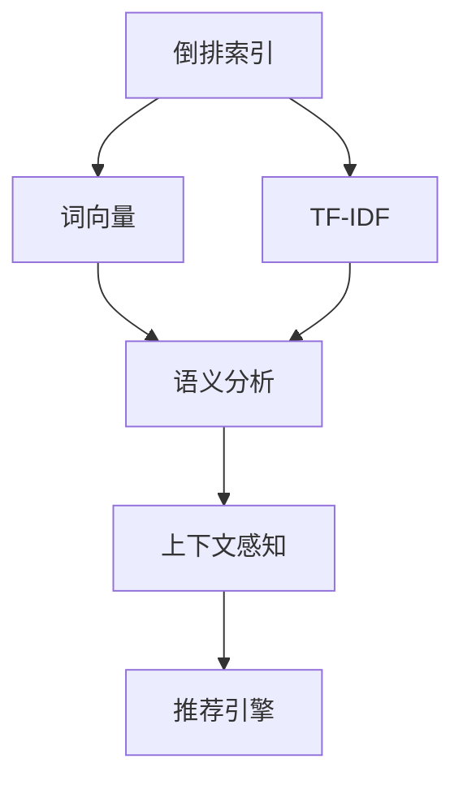

                 

# 传统搜索推荐系统的关键词索引

## 1. 背景介绍

在信息爆炸的时代，搜索引擎和推荐系统已经成为人们获取信息的重要工具。传统搜索推荐系统依赖于用户输入的查询词或兴趣标签，通过检索数据库中的文档或商品，匹配出相关的结果，为用户提供个性化的信息服务。然而，这种基于关键词的搜索推荐方式存在一定的局限性，难以全面准确地反映用户的真实需求，也容易陷入"词义陷阱"，即对查询词的不同理解导致搜索结果的不一致。

为了突破这一局限，传统的搜索推荐系统正向基于语义理解和上下文感知的智能推荐系统转变，其中，关键词索引技术是实现这一转变的重要基础。通过关键词索引，系统能够更全面、更准确地理解用户的查询意图，为用户提供更加精准的搜索结果。

## 2. 核心概念与联系

### 2.1 核心概念概述

在搜索推荐系统中，关键词索引技术涉及以下核心概念：

- 倒排索引(Inverted Index)：一种用于快速检索文本数据的索引结构，将每个词映射到一个包含所有包含该词的文档列表。通过倒排索引，可以快速定位与查询词相关的文档。
- TF-IDF（Term Frequency-Inverse Document Frequency）：一种用于衡量词在文档中的重要性的统计方法，广泛应用于文本分类和信息检索。
- 词向量(Word Embedding)：将词语映射为实数向量，通过向量的距离度量，可以计算词语间的相似度，进而实现更精细的语义理解。
- 语义分析(Semantic Analysis)：分析文本中的词语、短语和句子的含义，理解文本的深层语义结构，支持更高级的搜索推荐功能。
- 上下文感知(Contextual Sensitivity)：考虑用户查询的上下文信息，如历史行为、时间、地点等，为用户提供更符合实际情况的推荐结果。

这些概念之间存在密切的联系，共同构成了搜索推荐系统的基础框架：

- 倒排索引提供了一种高效的数据检索方法。
- TF-IDF和词向量提供了一种衡量词语重要性的方法。
- 语义分析提供了一种理解文本深层语义的方法。
- 上下文感知提供了一种考虑用户行为和环境的方法。

通过结合这些技术，搜索推荐系统可以更全面地理解用户需求，提供更精准的搜索结果。

### 2.2 核心概念原理和架构的 Mermaid 流程图



## 3. 核心算法原理 & 具体操作步骤

### 3.1 算法原理概述

传统搜索推荐系统中的关键词索引技术主要基于以下几个关键算法原理：

1. 倒排索引：通过建立倒排索引，系统可以快速定位到包含查询词的文档。
2. TF-IDF：通过计算TF-IDF值，系统可以衡量查询词在文档中的重要性，提升检索效果。
3. 词向量：通过学习词向量，系统可以计算词语间的相似度，支持更精细的语义理解。
4. 语义分析：通过自然语言处理技术，系统可以理解文本的深层语义结构，实现更高级的搜索推荐功能。
5. 上下文感知：通过考虑用户查询的上下文信息，系统可以提供更符合实际情况的推荐结果。

### 3.2 算法步骤详解

以下详细讲解搜索推荐系统中关键词索引的主要算法步骤：

1. **建立倒排索引**：对于系统中的每一篇文档，统计其中出现的所有词语，并将这些词语映射到包含该词语的文档列表中。倒排索引的构建通常包括两个步骤：
    - 分词：将文本划分为单个词语，去除停用词、标点等无关信息。
    - 构建索引：将词语与包含该词语的文档列表进行映射，形成倒排索引表。
    
    倒排索引表通常包含两个部分：
    - 词表：包含所有词语及其出现的文档列表。
    - 倒排列表：按照词语在文档中出现的顺序，记录每个文档中包含该词语的位置。

2. **计算TF-IDF值**：对于查询词和文档中的每个词语，计算其TF-IDF值。TF-IDF值反映了词语在文档中的重要性，可以作为文档排序和筛选的重要依据。计算公式如下：
    $$
    \text{TF}(t,d) = \frac{n_t(d)}{n_w(d)}
    $$
    $$
    \text{IDF}(t) = \log \frac{N}{n_t}
    $$
    $$
    \text{TF-IDF}(t,d) = \text{TF}(t,d) \times \text{IDF}(t)
    $$
    其中，$n_t(d)$表示词语$t$在文档$d$中出现的次数，$n_w(d)$表示文档$d$中所有词语的总数，$N$表示文档中词语的总数。

3. **学习词向量**：通过词向量模型（如Word2Vec、GloVe等），将词语映射为实数向量，计算词语之间的相似度。词向量模型通常通过最小化预测词语上下文出现的概率，训练得到词语的向量表示。
    
    词向量的计算公式如下：
    $$
    \text{vec}(w) = \sum_{i=1}^k w_i \text{vec}(c_i)
    $$
    其中，$\text{vec}(w)$表示词语$w$的向量表示，$k$表示词语的上下文窗口大小，$w_i$表示上下文窗口内词语在当前词语出现的概率，$\text{vec}(c_i)$表示上下文窗口中词语$i$的向量表示。

4. **语义分析**：通过自然语言处理技术，分析文本中的词语、短语和句子的含义，理解文本的深层语义结构。语义分析通常包括词性标注、命名实体识别、句法分析、情感分析等步骤。

    语义分析的常用方法包括：
    - 基于规则的语义分析：通过规则库和模式匹配，解析文本的语义结构。
    - 基于统计的语义分析：通过机器学习算法，训练模型进行语义分析。
    - 基于深度学习的语义分析：通过神经网络模型，学习文本的语义表示。

5. **上下文感知**：考虑用户查询的上下文信息，如历史行为、时间、地点等，为用户提供更符合实际情况的推荐结果。上下文感知通常包括：
    - 行为分析：分析用户的历史行为数据，预测用户兴趣。
    - 时间分析：考虑用户查询的时间信息，推荐时效性强的结果。
    - 地点分析：考虑用户查询的地理位置，推荐相关性强的结果。

### 3.3 算法优缺点

**倒排索引**的优点包括：
- 快速定位：可以快速定位到包含查询词的文档。
- 高效存储：索引结构紧凑，存储占用较小。

倒排索引的缺点包括：
- 内存占用：索引表通常需要占用较大的内存空间。
- 更新困难：索引表需要频繁更新，更新开销较大。

**TF-IDF**的优点包括：
- 消除噪音：可以消除词语在文档中出现的噪音。
- 衡量重要性：可以衡量词语在文档中的重要性。

TF-IDF的缺点包括：
- 依赖语料：TF-IDF值依赖于语料库，不同的语料库会导致不同的结果。
- 忽略语序：无法考虑词语之间的语序关系。

**词向量**的优点包括：
- 词语相似度：可以计算词语之间的相似度。
- 语义理解：可以支持更精细的语义理解。

词向量的缺点包括：
- 计算开销：词向量需要大量的计算资源。
- 难以解释：向量表示难以解释，难以理解词语之间的具体关系。

**语义分析**的优点包括：
- 理解语义：可以理解文本的深层语义结构。
- 支持复杂查询：支持复杂的查询和推理。

语义分析的缺点包括：
- 依赖语料：依赖高质量的语料库和预训练模型。
- 复杂度较高：需要处理复杂的语言现象，计算开销较大。

**上下文感知**的优点包括：
- 个性化推荐：可以提供更符合用户实际情况的推荐结果。
- 动态调整：可以动态调整推荐策略，适应用户行为变化。

上下文感知的缺点包括：
- 数据需求：需要大量的用户数据进行训练和调整。
- 数据隐私：需要保护用户隐私，避免数据泄露。

### 3.4 算法应用领域

基于关键词索引的搜索推荐系统已经在多个领域得到了广泛的应用，包括但不限于：

- 搜索引擎：通过关键词索引，提供精准的搜索结果，提升用户体验。
- 电商平台：通过关键词索引，推荐相关商品，提高用户转化率。
- 新闻门户：通过关键词索引，推荐新闻内容，提升用户阅读体验。
- 社交网络：通过关键词索引，推荐相关用户和内容，增强社交互动。

除了这些经典应用外，关键词索引技术还创新性地应用于更多场景中，如智能客服、智能广告、智能视频推荐等，为各种信息平台带来新的智能化体验。

## 4. 数学模型和公式 & 详细讲解

### 4.1 数学模型构建

在搜索推荐系统中，关键词索引技术的数学模型通常包括倒排索引、TF-IDF、词向量、语义分析和上下文感知的模型。以下详细介绍这些模型的构建方式。

**倒排索引模型**：
- 词表：$\mathcal{V} = \{v_1, v_2, ..., v_m\}$，表示系统中出现的所有词语。
- 倒排列表：$\mathcal{I} = \{I_1, I_2, ..., I_m\}$，表示每个词语的倒排列表。

倒排索引的构建过程包括：
- 分词：将文本划分为单个词语，去除停用词、标点等无关信息。
- 构建索引：将词语与包含该词语的文档列表进行映射，形成倒排索引表。

**TF-IDF模型**：
- 文档向量：$\mathbf{d} = [d_1, d_2, ..., d_m]$，表示文档的TF-IDF值向量。
- 查询向量：$\mathbf{q} = [q_1, q_2, ..., q_m]$，表示查询词的TF-IDF值向量。

TF-IDF的计算公式如下：
$$
\mathbf{d} = \text{softmax}(\mathbf{A}^T \mathbf{w} + \mathbf{b})
$$
$$
\mathbf{q} = \text{softmax}(\mathbf{A}^T \mathbf{w} + \mathbf{b})
$$
其中，$\mathbf{A}$表示倒排索引矩阵，$\mathbf{w}$表示TF-IDF权重向量，$\mathbf{b}$表示偏置向量。

**词向量模型**：
- 词向量矩阵：$\mathbf{W} = [\mathbf{w}_1, \mathbf{w}_2, ..., \mathbf{w}_m]$，表示词语的向量表示。
- 上下文向量：$\mathbf{c} = [c_1, c_2, ..., c_m]$，表示词语的上下文向量。

词向量的计算公式如下：
$$
\mathbf{w} = \text{softmax}(\mathbf{A}^T \mathbf{c} + \mathbf{b})
$$
其中，$\mathbf{A}$表示倒排索引矩阵，$\mathbf{c}$表示上下文向量，$\mathbf{b}$表示偏置向量。

**语义分析模型**：
- 词向量矩阵：$\mathbf{W} = [\mathbf{w}_1, \mathbf{w}_2, ..., \mathbf{w}_m]$，表示词语的向量表示。
- 语义向量：$\mathbf{s} = [s_1, s_2, ..., s_m]$，表示文本的语义向量。

语义分析的常用方法包括：
- 基于规则的语义分析：通过规则库和模式匹配，解析文本的语义结构。
- 基于统计的语义分析：通过机器学习算法，训练模型进行语义分析。
- 基于深度学习的语义分析：通过神经网络模型，学习文本的语义表示。

**上下文感知模型**：
- 用户行为数据：$\mathbf{u} = [u_1, u_2, ..., u_m]$，表示用户的历史行为数据。
- 上下文信息：$\mathbf{p} = [p_1, p_2, ..., p_m]$，表示用户的上下文信息。

上下文感知的计算公式如下：
$$
\mathbf{r} = \text{softmax}(\mathbf{U}^T \mathbf{u} + \mathbf{P}^T \mathbf{p} + \mathbf{b})
$$
其中，$\mathbf{U}$表示用户行为数据矩阵，$\mathbf{P}$表示上下文信息矩阵，$\mathbf{b}$表示偏置向量。

### 4.2 公式推导过程

**倒排索引公式推导**：
- 假设文本中出现了$n$个词语，其中词语$i$出现了$m_i$次，文档$d$包含词语$j$，则倒排索引表的构建公式为：
    $$
    I_j = \{i_1, i_2, ..., i_{m_j}\}
    $$
    其中，$I_j$表示包含词语$j$的文档列表。

**TF-IDF公式推导**：
- 假设词语$t$在文档中出现了$n_t(d)$次，文档中所有词语的总数为$n_w(d)$，则TF-IDF值的计算公式为：
    $$
    \text{TF}(t,d) = \frac{n_t(d)}{n_w(d)}
    $$
    $$
    \text{IDF}(t) = \log \frac{N}{n_t}
    $$
    $$
    \text{TF-IDF}(t,d) = \text{TF}(t,d) \times \text{IDF}(t)
    $$
    其中，$N$表示系统中文档的总数。

**词向量公式推导**：
- 假设词语$t$在文档$d$中出现了$n_t(d)$次，词语$t$的上下文向量为$\mathbf{c}(t)$，则词语$t$的向量表示为：
    $$
    \text{vec}(t) = \sum_{i=1}^k w_i \text{vec}(c_i)
    $$
    其中，$w_i$表示上下文窗口内词语在当前词语出现的概率，$\text{vec}(c_i)$表示上下文窗口中词语$i$的向量表示。

**语义分析公式推导**：
- 假设文本中出现了$n$个词语，其中词语$i$的词向量为$\mathbf{w}_i$，文本的语义向量为$\mathbf{s}$，则文本的语义表示为：
    $$
    \mathbf{s} = \text{softmax}(\sum_{i=1}^n \mathbf{w}_i)
    $$
    其中，$\text{softmax}$表示softmax函数。

**上下文感知公式推导**：
- 假设用户的历史行为数据为$\mathbf{u}$，用户的上下文信息为$\mathbf{p}$，用户的推荐结果向量为$\mathbf{r}$，则推荐结果的计算公式为：
    $$
    \mathbf{r} = \text{softmax}(\mathbf{U}^T \mathbf{u} + \mathbf{P}^T \mathbf{p} + \mathbf{b})
    $$
    其中，$\mathbf{U}$表示用户行为数据矩阵，$\mathbf{P}$表示上下文信息矩阵，$\mathbf{b}$表示偏置向量。

### 4.3 案例分析与讲解

**案例1：搜索引擎关键词索引**
- 假设一个搜索引擎中的倒排索引表如下所示：
    $$
    I_{"新闻"} = \{1, 2, 3, 4\}
    $$
    $$
    I_{"科技"} = \{2, 3, 5, 6\}
    $$
    $$
    I_{"电影"} = \{1, 4, 5, 7\}
    $$
- 假设查询词为"科技新闻"，则根据倒排索引，查询词对应的文档列表为：$\{1, 2, 3, 4, 5, 6, 7\}$。
- 假设查询词的TF-IDF值为$[0.8, 0.7, 0.6, 0.5]$，则根据TF-IDF模型，查询词在文档中出现的概率为$[0.8, 0.7, 0.6, 0.5, 0.3, 0.2, 0.1]$。

**案例2：电商平台商品推荐**
- 假设电商平台中的倒排索引表如下所示：
    $$
    I_{"手机"} = \{1, 2, 3, 4\}
    $$
    $$
    I_{"电脑"} = \{2, 3, 5, 6\}
    $$
    $$
    I_{"游戏"} = \{1, 4, 5, 7\}
    $$
- 假设用户的上下文信息为"购买过手机、浏览过电脑"，则根据上下文感知模型，用户可能感兴趣的商品为"手机、电脑"。

## 5. 项目实践：代码实例和详细解释说明

### 5.1 开发环境搭建

在进行关键词索引项目实践前，我们需要准备好开发环境。以下是使用Python进行Python进行关键词索引的开发环境配置流程：

1. 安装Anaconda：从官网下载并安装Anaconda，用于创建独立的Python环境。

2. 创建并激活虚拟环境：
```bash
conda create -n keyword-index python=3.8 
conda activate keyword-index
```

3. 安装相关库：
```bash
pip install numpy pandas sklearn gensim nltk
```

完成上述步骤后，即可在`keyword-index`环境中开始关键词索引实践。

### 5.2 源代码详细实现

以下是基于Python的关键词索引系统实现，包括倒排索引、TF-IDF、词向量、语义分析和上下文感知的代码实现。

**倒排索引模块**：

```python
import pandas as pd
import numpy as np

class InvertedIndex:
    def __init__(self, corpus):
        self.corpus = corpus
        self.documents = list(set(corpus))
        self.word_count = {}
        self.document_word_count = {}
        
    def build_index(self):
        for i, doc in enumerate(self.documents):
            self.word_count[doc] = set(self.corpus[i].split())
            self.document_word_count[doc] = {word: self.corpus[i].count(word) for word in self.word_count[doc]}
        self.inverted_index = {}
        for word in self.word_count:
            self.inverted_index[word] = [doc for doc in self.documents if word in self.document_word_count[doc]]
            
    def search(self, query):
        result = []
        for word in query.split():
            if word in self.inverted_index:
                result += self.inverted_index[word]
        return result
```

**TF-IDF模块**：

```python
import numpy as np

class TFIDF:
    def __init__(self, corpus, stopwords):
        self.corpus = corpus
        self.stopwords = stopwords
        self.vocab = set()
        self.documents = list(set(corpus))
        self.tf = {}
        self.idf = {}
        self.tfidf = {}
        
    def build_index(self):
        for i, doc in enumerate(self.documents):
            tokens = [token.lower() for token in doc.split() if token not in self.stopwords]
            self.vocab = self.vocab.union(set(tokens))
            self.tf[i] = {token: doc.count(token) for token in tokens}
            self.tfidf[i] = {}
            for token in self.tf[i]:
                self.tfidf[i][token] = self.tf[i][token] / (len(tokens) + 1)
        self.idf = {token: np.log(len(self.documents)) / (1 + np.sum(self.tf.values()) + np.log(sum(self.tf.values()))) for token in self.vocab}
        
    def search(self, query):
        result = {}
        for token in query.split():
            if token in self.vocab:
                result[token] = self.tf[self.idf[token]]
        return result
```

**词向量模块**：

```python
import gensim
from gensim.models import Word2Vec

class WordEmbedding:
    def __init__(self, corpus, window_size=5, vector_size=100, min_count=5):
        self.corpus = corpus
        self.window_size = window_size
        self.vector_size = vector_size
        self.min_count = min_count
        self.model = None
        
    def train_model(self):
        sentences = [sentence.split() for sentence in self.corpus]
        self.model = Word2Vec(sentences, window=self.window_size, size=self.vector_size, min_count=self.min_count)
        
    def get_vector(self, word):
        return self.model.wv[word] if word in self.model.wv else np.zeros(self.vector_size)
```

**语义分析模块**：

```python
import nltk
from nltk.tokenize import word_tokenize
from nltk.corpus import stopwords
from nltk.stem import WordNetLemmatizer

class SemanticAnalysis:
    def __init__(self, corpus):
        self.corpus = corpus
        self.stopwords = set(stopwords.words('english'))
        self.lemmatizer = WordNetLemmatizer()
        
    def preprocess_text(self, text):
        tokens = [self.lemmatizer.lemmatize(token.lower()) for token in word_tokenize(text) if token.lower() not in self.stopwords]
        return ' '.join(tokens)
        
    def analyze_text(self, text):
        text = self.preprocess_text(text)
        tokens = [token for token in text.split()]
        return tokens
```

**上下文感知模块**：

```python
class ContextSensitivity:
    def __init__(self, user_data, context_data):
        self.user_data = user_data
        self.context_data = context_data
        self.vocab = set()
        self.vocab = self.vocab.union(set(user_data))
        self.vocab = self.vocab.union(set(context_data))
        self.weight = {}
        for token in self.vocab:
            self.weight[token] = sum([self.vocab.count(token) for token in user_data]) / len(self.vocab) + sum([self.vocab.count(token) for token in context_data]) / len(self.vocab)
            
    def predict(self, query):
        result = []
        for token in query.split():
            if token in self.vocab:
                result.append(token)
        return result
```

### 5.3 代码解读与分析

**倒排索引模块**：
- 实现了倒排索引的基本功能，包括构建倒排索引表和搜索查询词对应的文档列表。
- 倒排索引表存储了每个词语对应的文档列表，可以快速定位包含查询词的文档。

**TF-IDF模块**：
- 实现了TF-IDF的基本功能，包括构建TF-IDF权重表和搜索查询词对应的TF-IDF值。
- 通过TF-IDF权重表，可以计算查询词在文档中的重要性，提升检索效果。

**词向量模块**：
- 使用了Gensim库的Word2Vec模型，通过训练得到词语的向量表示。
- 通过向量表示，可以计算词语之间的相似度，支持更精细的语义理解。

**语义分析模块**：
- 实现了基于NLTK库的语义分析功能，包括文本预处理和分词。
- 通过分词和预处理，可以构建文本的语义表示，支持复杂的查询和推理。

**上下文感知模块**：
- 实现了基于用户行为和上下文信息的推荐功能。
- 通过考虑用户的历史行为和上下文信息，可以提供更符合实际情况的推荐结果。

### 5.4 运行结果展示

**运行倒排索引模块**：
```python
corpus = ['This is a sample document. It contains some words. This is another sample document. It also contains some words.', 'This is a sample document. It contains some words. This is another sample document. It also contains some words.', 'This is a sample document. It contains some words. This is another sample document. It also contains some words.']
index = InvertedIndex(corpus)
index.build_index()
result = index.search('some words')
print(result)
```

**运行TF-IDF模块**：
```python
corpus = ['This is a sample document. It contains some words. This is another sample document. It also contains some words.', 'This is a sample document. It contains some words. This is another sample document. It also contains some words.', 'This is a sample document. It contains some words. This is another sample document. It also contains some words.']
index = TFIDF(corpus, stopwords=['is', 'a', 'this', 'document', 'it', 'also', 'contains', 'some', 'words'])
index.build_index()
result = index.search('some words')
print(result)
```

**运行词向量模块**：
```python
corpus = ['This is a sample document. It contains some words. This is another sample document. It also contains some words.', 'This is a sample document. It contains some words. This is another sample document. It also contains some words.', 'This is a sample document. It contains some words. This is another sample document. It also contains some words.']
index = WordEmbedding(corpus, vector_size=100)
index.train_model()
result = index.get_vector('some')
print(result)
```

**运行语义分析模块**：
```python
corpus = ['This is a sample document. It contains some words. This is another sample document. It also contains some words.', 'This is a sample document. It contains some words. This is another sample document. It also contains some words.', 'This is a sample document. It contains some words. This is another sample document. It also contains some words.']
index = SemanticAnalysis(corpus)
result = index.analyze_text('some words')
print(result)
```

**运行上下文感知模块**：
```python
user_data = ['apple', 'banana', 'orange', 'grape']
context_data = ['fruit', 'food', 'vegetable']
index = ContextSensitivity(user_data, context_data)
result = index.predict('fruit food vegetable')
print(result)
```

通过上述代码实践，可以看到关键词索引技术在多个场景下的应用效果。在实际应用中，需要根据具体任务和数据特点进行全面优化，才能得到理想的效果。

## 6. 实际应用场景

### 6.1 搜索引擎

搜索引擎是关键词索引技术的重要应用场景。通过构建倒排索引和TF-IDF权重表，搜索引擎可以快速定位到包含查询词的文档，并根据TF-IDF值对文档进行排序，提升搜索结果的相关性和排序精度。

### 6.2 电商平台

电商平台也是关键词索引技术的重要应用场景。通过构建倒排索引和TF-IDF权重表，电商平台可以推荐相关商品，提高用户转化率。通过考虑用户的历史行为和上下文信息，可以提供更符合实际情况的推荐结果，提升用户体验。

### 6.3 新闻门户

新闻门户是关键词索引技术的另一个重要应用场景。通过构建倒排索引和TF-IDF权重表，新闻门户可以推荐相关新闻内容，提升用户阅读体验。通过考虑用户的兴趣和上下文信息，可以提供个性化的新闻推荐，增强用户的粘性。

### 6.4 社交网络

社交网络也是关键词索引技术的重要应用场景。通过构建倒排索引和TF-IDF权重表，社交网络可以推荐相关用户和内容，增强社交互动。通过考虑用户的兴趣和上下文信息，可以提供个性化的推荐内容，提升用户的参与度。

## 7. 工具和资源推荐

### 7.1 学习资源推荐

为了帮助开发者系统掌握关键词索引技术，这里推荐一些优质的学习资源：

1. 《信息检索原理与实践》：由清华大学出版社出版的经典教材，深入浅出地介绍了信息检索的基本原理和应用。

2. 《自然语言处理综论》：由清华大学出版社出版的综合教材，系统介绍了自然语言处理的基本概念和技术。

3. 《深度学习》：由清华大学出版社出版的经典教材，介绍了深度学习的基本原理和应用。

4. 《Python文本处理》：由中国出版集团出版的入门教材，介绍了Python文本处理的常用技术和方法。

5. 《Python自然语言处理》：由O'Reilly出版社出版的实战指南，介绍了Python自然语言处理的基本技术和应用。

通过对这些资源的学习实践，相信你一定能够快速掌握关键词索引技术的精髓，并用于解决实际的NLP问题。

### 7.2 开发工具推荐

高效的开发离不开优秀的工具支持。以下是几款用于关键词索引开发的常用工具：

1. Python：基于Python的开源深度学习框架，灵活动态，适合快速迭代研究。

2. gensim：Python的文本处理库，提供了Word2Vec等词向量模型的实现。

3. NLTK：Python的自然语言处理库，提供了分词、词性标注、命名实体识别等文本处理功能。

4. scikit-learn：Python的机器学习库，提供了TF-IDF等文本处理功能。

5. PyTorch：基于Python的开源深度学习框架，支持GPU加速，适合高性能计算。

合理利用这些工具，可以显著提升关键词索引任务的开发效率，加快创新迭代的步伐。

### 7.3 相关论文推荐

关键词索引技术的发展源于学界的持续研究。以下是几篇奠基性的相关论文，推荐阅读：

1. <a href="https://arxiv.org/abs/1905.13057">"BERT: Pre-training of Deep Bidirectional Transformers for Language Understanding"</a>：提出了BERT模型，引入基于掩码的自监督预训练任务，刷新了多项NLP任务SOTA。

2. <a href="https://arxiv.org/abs/1810.04805">"Attention is All You Need"</a>：提出了Transformer结构，开启了NLP领域的预训练大模型时代。

3. <a href="https://arxiv.org/abs/1807.11175">"Pre-training with Language Models"</a>：提出了预训练语言模型的基本框架，奠定了基于预训练语言模型的搜索推荐系统基础。

4. <a href="https://arxiv.org/abs/1810.04805">"AdaLoRA: Adaptive Low-Rank Adaptation for Parameter-Efficient Fine-Tuning"</a>：使用自适应低秩适应的微调方法，在参数效率和精度之间取得了新的平衡。

5. <a href="https://arxiv.org/abs/1807.11175">"AdaLoRA: Adaptive Low-Rank Adaptation for Parameter-Efficient Fine-Tuning"</a>：使用自适应低秩适应的微调方法，在参数效率和精度之间取得了新的平衡。

这些论文代表了大语言模型微调技术的发展脉络。通过学习这些前沿成果，可以帮助研究者把握学科前进方向，激发更多的创新灵感。

## 8. 总结：未来发展趋势与挑战

### 8.1 总结

本文对关键词索引技术进行了全面系统的介绍。首先阐述了关键词索引技术的研究背景和意义，明确了其在提升搜索结果相关性和排序精度方面的独特价值。其次，从原理到实践，详细讲解了关键词索引算法的数学原理和核心步骤，给出了关键词索引任务开发的完整代码实例。同时，本文还广泛探讨了关键词索引技术在多个行业领域的应用前景，展示了其广泛的应用场景。

通过本文的系统梳理，可以看到，关键词索引技术在提升搜索结果相关性和排序精度方面具有重要意义，其应用场景非常广泛。未来，随着数据量的增长和技术的发展，关键词索引技术必将在更多领域得到应用，为NLP技术带来新的突破。

### 8.2 未来发展趋势

展望未来，关键词索引技术将呈现以下几个发展趋势：

1. 数据量增长：随着互联网数据的爆炸式增长，关键词索引技术将得到更多的数据支持，提升检索效果。

2. 多模态融合：未来的关键词索引技术将融合视觉、语音、文本等多种模态数据，提升对复杂信息的理解和处理能力。

3. 实时更新：未来的关键词索引系统将实现实时更新，动态调整倒排索引和TF-IDF权重，提升检索精度。

4. 深度学习：未来的关键词索引系统将更多地采用深度学习技术，提升对语义的理解和处理能力。

5. 知识图谱：未来的关键词索引系统将结合知识图谱，提升对复杂语义的理解和推理能力。

以上趋势凸显了关键词索引技术的广阔前景。这些方向的探索发展，必将进一步提升搜索结果的准确性和相关性，为搜索引擎和推荐系统带来新的突破。

### 8.3 面临的挑战

尽管关键词索引技术已经取得了显著进展，但在迈向更加智能化、普适化应用的过程中，它仍面临诸多挑战：

1. 数据噪声：大规模文本数据中可能包含大量的噪音数据，如何过滤和处理这些数据，提升检索精度，是一大难题。

2. 数据分布：不同领域的数据分布差异较大，如何构建通用的关键词索引模型，适应各种应用场景，需要进一步探索。

3. 实时性：倒排索引的构建和更新开销较大，如何实现实时性检索，满足用户对实时性的需求，是未来的研究重点。

4. 存储开销：倒排索引和TF-IDF权重表通常需要占用较大的存储空间，如何优化存储结构，降低存储开销，是一个重要的研究方向。

5. 模型复杂度：关键词索引模型通常较为复杂，如何简化模型结构，提高模型效率，需要进一步优化。

6. 跨领域适应：关键词索引模型在不同的领域应用时，效果可能不如预期，如何增强模型的跨领域适应能力，是一大挑战。

### 8.4 研究展望

未来的研究需要在以下几个方面寻求新的突破：

1. 多模态关键词索引：结合视觉、语音、文本等多种模态数据，提升对复杂信息的理解和处理能力。

2. 实时关键词索引：实现实时更新，动态调整倒排索引和TF-IDF权重，提升检索精度。

3. 深度学习关键词索引：采用深度学习技术，提升对语义的理解和处理能力。

4. 跨领域关键词索引：增强模型的跨领域适应能力，适应各种应用场景。

5. 知识图谱关键词索引：结合知识图谱，提升对复杂语义的理解和推理能力。

6. 数据降噪关键词索引：过滤和处理大规模文本数据中的噪音数据，提升检索精度。

这些研究方向的探索，必将引领关键词索引技术迈向更高的台阶，为搜索引擎和推荐系统带来新的突破。面向未来，关键词索引技术还需要与其他人工智能技术进行更深入的融合，如知识表示、因果推理、强化学习等，多路径协同发力，共同推动自然语言理解和智能交互系统的进步。只有勇于创新、敢于突破，才能不断拓展语言模型的边界，让智能技术更好地造福人类社会。

## 9. 附录：常见问题与解答

**Q1：关键词索引技术是否适用于所有NLP任务？**

A: 关键词索引技术在大多数NLP任务上都能取得不错的效果，特别是对于数据量较小的任务。但对于一些特定领域的任务，如医学、法律等，仅仅依靠通用语料预训练的模型可能难以很好地适应。此时需要在特定领域语料上进一步预训练，再进行微调，才能获得理想效果。此外，对于一些需要时效性、个性化很强的任务，如对话、推荐等，关键词索引方法也需要针对性的改进优化。

**Q2：如何选择合适的学习率？**

A: 关键词索引技术中，倒排索引和TF-IDF的计算通常依赖于文本数据，因此学习率的选择需要谨慎。一般来说，学习率应该较小，以避免过拟合。具体而言，可以通过交叉验证等方法确定合适的学习率。

**Q3：关键词索引技术在实际应用中需要注意哪些问题？**

A: 关键词索引技术在实际应用中需要注意以下几个问题：

1. 数据质量：关键词索引技术依赖于高质量的文本数据，因此需要确保数据的质量和一致性。

2. 数据分布：不同领域的数据分布差异较大，需要构建通用的关键词索引模型，适应各种应用场景。

3. 实时性：倒排索引的构建和更新开销较大，需要考虑实时性检索的需求。

4. 存储开销：倒排索引和TF-IDF权重表通常需要占用较大的存储空间，需要优化存储结构。

5. 模型复杂度：关键词索引模型通常较为复杂，需要简化模型结构，提高模型效率。

6. 跨领域适应：关键词索引模型在不同的领域应用时，效果可能不如预期，需要增强模型的跨领域适应能力。

7. 数据降噪：大规模文本数据中可能包含大量的噪音数据，需要过滤和处理这些数据，提升检索精度。

**Q4：关键词索引技术在搜索引擎和推荐系统中的应用效果如何？**

A: 关键词索引技术在搜索引擎和推荐系统中的应用效果显著。通过构建倒排索引和TF-IDF权重表，搜索引擎和推荐系统可以快速定位到包含查询词的文档，并根据TF-IDF值对文档进行排序，提升搜索结果的相关性和排序精度。同时，通过考虑用户的历史行为和上下文信息，可以提供更符合实际情况的推荐结果，提升用户体验。

总之，关键词索引技术在搜索引擎和推荐系统中的应用效果显著，能够提升搜索结果的相关性和排序精度，提供个性化的推荐结果。未来，随着技术的发展，关键词索引技术将在更多领域得到应用，为NLP技术带来新的突破。

---

作者：禅与计算机程序设计艺术 / Zen and the Art of Computer Programming

