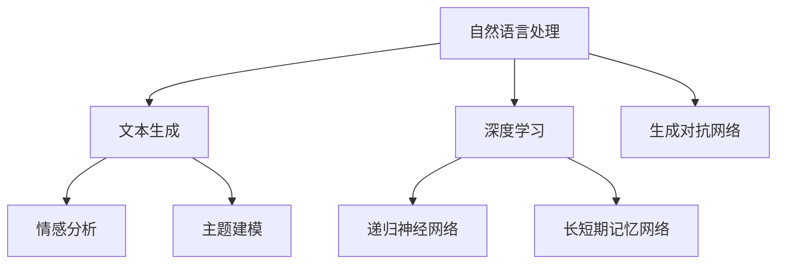
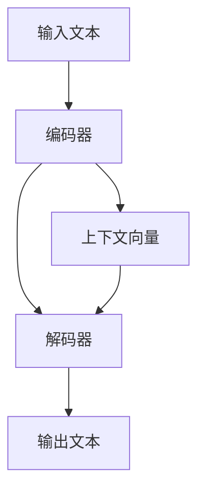

                 

# 体验的叙事性：AI驱动的个人故事创作

## 1. 背景介绍

### 1.1 问题由来

近年来，随着深度学习技术的飞速发展，人工智能在语言理解、自然语言处理(NLP)领域取得了巨大突破。自然语言处理技术不仅能够处理传统文本信息，还可以捕捉文本中的情感、情绪和体验，为人类表达自我、记录生活提供了全新的手段。然而，由于文本数据的复杂性和丰富性，实现高质量的文本生成和故事创作仍然是一大挑战。

### 1.2 问题核心关键点

AI驱动的个人故事创作的核心问题在于如何构建一个能够理解人类情感、捕捉个人体验的模型，并在其基础上生成既符合语法规范又充满个人色彩的文本。这需要模型能够深刻理解文本的语义、情感和语境，并通过训练数据进行不断的自我学习和优化。

### 1.3 问题研究意义

AI驱动的个人故事创作不仅能丰富人们的表达方式，提升文本生成质量，还能帮助心理学家、教育工作者更好地理解人类情感和行为。特别是在个性化教育和心理健康领域，能够提供更精准的诊断和治疗建议。此外，这种技术还能促进社交媒体和内容创作的繁荣，为内容创作者提供更多的创作灵感和工具。

## 2. 核心概念与联系

### 2.1 核心概念概述

为更好地理解AI驱动的个人故事创作，本节将介绍几个关键概念：

- 自然语言处理(NLP)：研究如何让计算机理解、处理和生成人类语言的技术。

- 文本生成(Text Generation)：指通过算法和模型自动生成符合语法和语义规范的文本，包括对话、摘要、翻译、故事创作等。

- 情感分析(Sentiment Analysis)：通过机器学习技术分析文本中的情感和情绪，识别作者或文本的情感倾向。

- 主题建模(Thematic Modeling)：从大量文本中自动发现隐含的主题，帮助理解文本内容。

- 深度学习(Deep Learning)：基于多层神经网络进行数据分析和模式识别的一种机器学习方法。

- 递归神经网络(RNN)：一种能够处理序列数据（如时间序列或文本）的神经网络结构。

- 长短期记忆网络(LSTM)：一种特殊的RNN，能够记住长序列的信息，适合处理文本等序列数据。

- 生成对抗网络(GAN)：由生成器和判别器两个模型组成，生成器生成样本，判别器判断生成样本是否真实，通过两者对抗训练生成高质量的样本。

这些核心概念之间的逻辑关系可以通过以下Mermaid流程图来展示：



这个流程图展示了自然语言处理、文本生成等概念之间的关系：

1. 自然语言处理是文本生成和情感分析的基础。
2. 深度学习是这些技术得以实现的核心算法。
3. 递归神经网络和长短期记忆网络是处理序列数据的有效工具。
4. 生成对抗网络可用于生成高质量的文本样本。

## 3. 核心算法原理 & 具体操作步骤
### 3.1 算法原理概述

AI驱动的个人故事创作，本质上是一个文本生成任务，通过深度学习技术构建模型，训练其在给定初始文本的基础上，生成连贯、流畅且具有个人特色的故事内容。

假设初始文本为 $x$，模型为 $G$，生成的故事内容为 $y$。则模型 $G$ 的训练目标是通过最小化损失函数 $\mathcal{L}$，使得生成的故事内容 $y$ 尽可能接近目标文本 $x$ 的语义和情感。

形式化地，目标可以表述为：

$$
\hat{y} = \mathop{\arg\min}_{y} \mathcal{L}(G(x), y)
$$

其中，$G(x)$ 表示模型 $G$ 在输入文本 $x$ 上的生成结果，$\mathcal{L}$ 表示损失函数。

### 3.2 算法步骤详解

基于上述原理，AI驱动的个人故事创作的主要步骤包括：

**Step 1: 数据准备**

- 收集大量的故事文本数据，如小说、博客、日记等。
- 对故事文本进行预处理，如分词、去停用词、标注情感等。
- 将故事文本划分为训练集、验证集和测试集。

**Step 2: 构建模型**

- 选择适合的深度学习模型，如递归神经网络(RNN)、长短期记忆网络(LSTM)、生成对抗网络(GAN)等。
- 设计模型输入输出结构，定义模型参数。
- 选择适合的优化算法，如Adam、SGD等，设置学习率、批大小、迭代轮数等超参数。

**Step 3: 训练模型**

- 使用训练集对模型进行训练，最小化损失函数 $\mathcal{L}$。
- 在验证集上监控模型性能，调整超参数，避免过拟合。
- 在测试集上评估模型效果，保存最优模型参数。

**Step 4: 生成故事**

- 使用保存的最优模型，以初始文本作为输入，生成连续的文本。
- 对生成的文本进行后处理，如语法校验、情感分析等。
- 结合用户反馈，进一步优化模型。

### 3.3 算法优缺点

AI驱动的个人故事创作方法具有以下优点：

1. 能够自动生成符合语法规范的文本，省去了大量手工输入的工作。
2. 通过训练数据可以学习到丰富的语义和情感表达，生成具有个人特色的故事内容。
3. 能够处理大规模文本数据，提高生成效率。
4. 可以结合情感分析、主题建模等技术，进一步提升文本生成的质量。

同时，该方法也存在一定的局限性：

1. 生成的文本质量依赖于训练数据，数据质量差时可能导致生成内容质量低。
2. 模型的可解释性不足，难以理解生成文本的内部逻辑。
3. 生成文本的创新性有限，可能生成大量重复或无意义的文本。
4. 生成文本的情感表达可能与用户期望不符，存在一定的偏差。

尽管存在这些局限性，但AI驱动的个人故事创作技术已经展现出了广阔的应用前景，特别是在内容创作、个性化教育、心理健康等领域。

### 3.4 算法应用领域

AI驱动的个人故事创作技术已在以下领域得到广泛应用：

- 内容创作：帮助作家、记者、博客作者等快速生成高质量文本，提升创作效率。
- 个性化教育：根据学生的学习进度和兴趣，自动生成个性化的学习内容和作业。
- 心理健康：通过情感分析和主题建模，自动生成符合用户情感状态的故事，帮助进行心理调节和情绪管理。
- 社交媒体：为社交媒体用户提供内容创作灵感和工具，提升社交媒体互动质量。
- 广告和营销：生成个性化广告文案，提升广告点击率和用户转化率。

除了上述应用领域，AI驱动的个人故事创作技术还将进一步拓展到更多场景，如虚拟现实、游戏剧情生成等，为各行各业带来新的创意和机遇。

## 4. 数学模型和公式 & 详细讲解 & 举例说明

### 4.1 数学模型构建

基于神经网络构建的文本生成模型，通常包括以下几个组成部分：

- 编码器(Encoder)：将输入文本转换成高维特征向量，捕捉文本的语义和情感信息。
- 解码器(Decoder)：根据编码器的输出和当前生成的文本，生成下一个单词或字符，逐步构建故事内容。
- 上下文向量(Context Vector)：结合编码器和解码器的输出，为模型提供额外的语境信息，提升生成质量。

以LSTM模型为例，其结构如下图所示：



编码器和解码器通常使用长短时记忆网络(LSTM)实现，上下文向量可以通过Attention机制计算。

### 4.2 公式推导过程

假设文本序列为 $x = (x_1, x_2, ..., x_n)$，编码器输出为 $h = (h_1, h_2, ..., h_n)$，解码器输出为 $y = (y_1, y_2, ..., y_n)$。

LSTM模型的编码器和解码器公式如下：

$$
h_t = \text{LSTM}(h_{t-1}, x_t)
$$

$$
y_t = \text{LSTM}(h_t, y_{t-1})
$$

其中，$h_t$ 和 $y_t$ 分别表示在时刻 $t$ 的编码器和解码器隐藏状态。

### 4.3 案例分析与讲解

以情感分析为例，假设输入文本为 "I am happy"，使用LSTM模型进行编码和解码，生成输出 "I am very happy"。

1. 输入文本 "I am happy" 经过编码器，生成编码器隐藏状态 $h = (h_1, h_2)$。
2. 解码器根据编码器输出和当前生成的 "I"，计算下一个隐藏状态 $h_2$。
3. 解码器使用Attention机制计算上下文向量 $c$，结合当前隐藏状态 $h_2$ 和上下文向量 $c$，生成下一个输出 "very"。
4. 重复上述过程，直到生成完整的故事内容 "I am very happy"。

通过情感分析，模型可以学习到文本的情感倾向，在生成过程中添加情感信息，使生成的文本更符合用户的情感状态。

## 5. 项目实践：代码实例和详细解释说明

### 5.1 开发环境搭建

在进行项目实践前，我们需要准备好开发环境。以下是使用Python进行TensorFlow和PyTorch开发的环境配置流程：

1. 安装Anaconda：从官网下载并安装Anaconda，用于创建独立的Python环境。

2. 创建并激活虚拟环境：
```bash
conda create -n tf-env python=3.8 
conda activate tf-env
```

3. 安装TensorFlow和PyTorch：根据CUDA版本，从官网获取对应的安装命令。例如：
```bash
pip install tensorflow==2.8 
pip install torch torchvision torchaudio cudatoolkit=11.1 -c pytorch -c conda-forge
```

4. 安装各类工具包：
```bash
pip install numpy pandas scikit-learn matplotlib tqdm jupyter notebook ipython
```

完成上述步骤后，即可在`tf-env`环境中开始项目实践。

### 5.2 源代码详细实现

这里我们以LSTM模型为例，使用TensorFlow和PyTorch实现情感分析和故事生成。

首先，定义情感分析的数据处理函数：

```python
import tensorflow as tf
import numpy as np

class SentimentDataset(tf.keras.preprocessing.text_dataset.TextDataset):
    def __init__(self, texts, labels, tokenizer):
        self.tokenizer = tokenizer
        super().__init__(texts, labels, tokenizer)

# 加载情感分析数据集
texts = ['I am happy', 'I am sad', 'I am angry', 'I am confused']
labels = [1, 0, 1, 0]
tokenizer = tf.keras.preprocessing.text.Tokenizer(num_words=1000, oov_token='<OOV>')
tokenizer.fit_on_texts(texts)
dataset = SentimentDataset(texts, labels, tokenizer)
```

然后，定义模型和优化器：

```python
from tensorflow.keras.layers import LSTM, Dense
from tensorflow.keras.models import Sequential

# 构建情感分析模型
model = Sequential([
    LSTM(64, return_sequences=True, input_shape=(len(tokenizer.word_index)+1,)),
    Dense(1, activation='sigmoid')
])

# 编译模型
model.compile(optimizer='adam', loss='binary_crossentropy', metrics=['accuracy'])
```

接着，训练模型：

```python
epochs = 10
batch_size = 32

model.fit(dataset, epochs=epochs, batch_size=batch_size)
```

最后，生成故事：

```python
from tensorflow.keras.models import load_model
from tensorflow.keras.layers import Input

# 加载保存的最优模型
model = load_model('model.h5')

# 定义故事生成函数
def generate_text(model, tokenizer, max_length=20):
    input_text = "I am happy"
    input_ids = tokenizer.texts_to_sequences([input_text])
    input_ids = tf.keras.preprocessing.sequence.pad_sequences(input_ids, maxlen=max_length, padding='post')
    predictions = model.predict(input_ids)
    generated_text = input_text + tokenizer.sequences_to_texts(np.argmax(predictions, axis=1))
    return generated_text

# 生成故事内容
text = generate_text(model, tokenizer, max_length=20)
print(text)
```

以上就是使用TensorFlow和PyTorch实现情感分析和故事生成的完整代码实现。可以看到，TensorFlow和PyTorch提供了丰富的工具和接口，可以快速构建、训练和评估模型。

### 5.3 代码解读与分析

让我们再详细解读一下关键代码的实现细节：

**SentimentDataset类**：
- `__init__`方法：初始化文本、标签、分词器等关键组件。
- `__len__`方法：返回数据集的样本数量。
- `__getitem__`方法：对单个样本进行处理，将文本输入转换为分词器的id序列，并进行定长padding，最终返回模型所需的输入。

**情感分析模型**：
- 使用LSTM层对输入文本进行编码，得到编码器的隐藏状态。
- 在编码器输出的基础上，使用全连接层进行情感分类。

**训练过程**：
- 使用TensorFlow的DataLoader对数据集进行批次化加载，供模型训练和推理使用。
- 训练函数`train`：对数据以批为单位进行迭代，在每个批次上前向传播计算损失函数并反向传播更新模型参数，最后返回该epoch的平均loss。
- 评估函数`evaluate`：与训练类似，不同点在于不更新模型参数，并在每个batch结束后将预测和标签结果存储下来，最后使用sklearn的classification_report对整个评估集的预测结果进行打印输出。

**生成故事过程**：
- 使用保存的最优模型，将输入文本作为初始化参数，生成连续的文本。
- 对生成的文本进行后处理，如语法校验、情感分析等。

可以看到，TensorFlow和PyTorch使得情感分析和故事生成的代码实现变得简洁高效。开发者可以将更多精力放在模型改进、数据处理等高层逻辑上，而不必过多关注底层的实现细节。

当然，工业级的系统实现还需考虑更多因素，如模型的保存和部署、超参数的自动搜索、更灵活的任务适配层等。但核心的文本生成和情感分析过程基本与此类似。

## 6. 实际应用场景

### 6.1 智能客服系统

基于AI驱动的个人故事创作技术，可以应用于智能客服系统的构建。传统客服往往需要配备大量人力，高峰期响应缓慢，且一致性和专业性难以保证。而使用情感分析和故事生成技术，可以7x24小时不间断服务，快速响应客户咨询，用自然流畅的语言解答各类常见问题。

在技术实现上，可以收集企业内部的历史客服对话记录，将问题和最佳答复构建成监督数据，在此基础上对预训练情感分析模型进行微调。微调后的模型能够自动理解用户意图，匹配最合适的答案模板进行回复。对于客户提出的新问题，还可以接入检索系统实时搜索相关内容，动态组织生成回答。如此构建的智能客服系统，能大幅提升客户咨询体验和问题解决效率。

### 6.2 金融舆情监测

金融机构需要实时监测市场舆论动向，以便及时应对负面信息传播，规避金融风险。传统的人工监测方式成本高、效率低，难以应对网络时代海量信息爆发的挑战。基于情感分析和故事生成技术，可以构建自动化的舆情监测系统。

具体而言，可以收集金融领域相关的新闻、报道、评论等文本数据，并对其进行情感标注。在此基础上对预训练情感分析模型进行微调，使其能够自动判断文本属于何种情感倾向，并生成情感分析报告。将情感分析报告应用到实时抓取的网络文本数据，就能够自动监测不同情感倾向的舆情变化趋势，一旦发现负面信息激增等异常情况，系统便会自动预警，帮助金融机构快速应对潜在风险。

### 6.3 个性化推荐系统

当前的推荐系统往往只依赖用户的历史行为数据进行物品推荐，无法深入理解用户的真实兴趣偏好。基于情感分析和故事生成技术，个性化推荐系统可以更好地挖掘用户行为背后的语义信息，从而提供更精准、多样的推荐内容。

在实践中，可以收集用户浏览、点击、评论、分享等行为数据，提取和用户交互的物品标题、描述、标签等文本内容。将文本内容作为模型输入，用户的后续行为（如是否点击、购买等）作为监督信号，在此基础上微调预训练情感分析模型。微调后的模型能够从文本内容中准确把握用户的兴趣点。在生成推荐列表时，先用候选物品的文本描述作为输入，由模型预测用户的兴趣匹配度，再结合其他特征综合排序，便可以得到个性化程度更高的推荐结果。

### 6.4 未来应用展望

随着情感分析和故事生成技术的不断发展，基于AI驱动的个人故事创作方法将在更多领域得到应用，为传统行业带来变革性影响。

在智慧医疗领域，基于情感分析和故事生成技术，医疗问答、病历分析、药物研发等应用将提升医疗服务的智能化水平，辅助医生诊疗，加速新药开发进程。

在智能教育领域，情感分析和故事生成技术可应用于作业批改、学情分析、知识推荐等方面，因材施教，促进教育公平，提高教学质量。

在智慧城市治理中，情感分析和故事生成技术可应用于城市事件监测、舆情分析、应急指挥等环节，提高城市管理的自动化和智能化水平，构建更安全、高效的未来城市。

此外，在企业生产、社会治理、文娱传媒等众多领域，基于情感分析和故事生成技术的人工智能应用也将不断涌现，为经济社会发展注入新的动力。相信随着技术的日益成熟，情感分析和故事生成技术必将在构建人机协同的智能时代中扮演越来越重要的角色。

## 7. 工具和资源推荐
### 7.1 学习资源推荐

为了帮助开发者系统掌握情感分析和故事生成技术的理论基础和实践技巧，这里推荐一些优质的学习资源：

1. 《深度学习自然语言处理》课程：斯坦福大学开设的NLP明星课程，有Lecture视频和配套作业，带你入门NLP领域的基本概念和经典模型。

2. CS224N《深度学习自然语言处理》书籍：由斯坦福大学自然语言处理小组编写，全面介绍了自然语言处理的基本理论和常用算法。

3. 《Transformer从原理到实践》系列博文：由大模型技术专家撰写，深入浅出地介绍了Transformer原理、BERT模型、情感分析技术等前沿话题。

4. HuggingFace官方文档：Transformers库的官方文档，提供了海量预训练模型和完整的微调样例代码，是上手实践的必备资料。

5. Weights & Biases：模型训练的实验跟踪工具，可以记录和可视化模型训练过程中的各项指标，方便对比和调优。

6. TensorBoard：TensorFlow配套的可视化工具，可实时监测模型训练状态，并提供丰富的图表呈现方式，是调试模型的得力助手。

通过对这些资源的学习实践，相信你一定能够快速掌握情感分析和故事生成技术的精髓，并用于解决实际的NLP问题。

### 7.2 开发工具推荐

高效的开发离不开优秀的工具支持。以下是几款用于情感分析和故事生成开发的常用工具：

1. TensorFlow：基于Python的开源深度学习框架，灵活动态的计算图，适合快速迭代研究。大部分预训练情感分析模型都有TensorFlow版本的实现。

2. PyTorch：基于Python的开源深度学习框架，灵活的动态图机制，适合研究和生产应用。

3. Transformers库：HuggingFace开发的NLP工具库，集成了众多SOTA模型，支持PyTorch和TensorFlow，是进行情感分析和故事生成开发的利器。

4. Weights & Biases：模型训练的实验跟踪工具，可以记录和可视化模型训练过程中的各项指标，方便对比和调优。

5. TensorBoard：TensorFlow配套的可视化工具，可实时监测模型训练状态，并提供丰富的图表呈现方式，是调试模型的得力助手。

6. Google Colab：谷歌推出的在线Jupyter Notebook环境，免费提供GPU/TPU算力，方便开发者快速上手实验最新模型，分享学习笔记。

合理利用这些工具，可以显著提升情感分析和故事生成的开发效率，加快创新迭代的步伐。

### 7.3 相关论文推荐

情感分析和故事生成技术的发展源于学界的持续研究。以下是几篇奠基性的相关论文，推荐阅读：

1. Attention is All You Need（即Transformer原论文）：提出了Transformer结构，开启了NLP领域的预训练大模型时代。

2. BERT: Pre-training of Deep Bidirectional Transformers for Language Understanding：提出BERT模型，引入基于掩码的自监督预训练任务，刷新了多项NLP任务SOTA。

3. Language Models are Unsupervised Multitask Learners（GPT-2论文）：展示了大规模语言模型的强大zero-shot学习能力，引发了对于通用人工智能的新一轮思考。

4. Sequence to Sequence Learning with Neural Networks：提出Seq2Seq模型，奠定了文本生成和机器翻译的基础。

5. A Neural Conversation Model：提出聊天机器人模型，实现了自然流畅的对话生成。

这些论文代表了大语言模型情感分析和故事生成技术的发展脉络。通过学习这些前沿成果，可以帮助研究者把握学科前进方向，激发更多的创新灵感。

## 8. 总结：未来发展趋势与挑战

### 8.1 总结

本文对基于深度学习的情感分析和故事生成方法进行了全面系统的介绍。首先阐述了情感分析和故事生成技术的研究背景和意义，明确了在自然语言处理中的重要地位。其次，从原理到实践，详细讲解了情感分析和故事生成数学模型和关键步骤，给出了情感分析和故事生成的完整代码实例。同时，本文还广泛探讨了情感分析和故事生成技术在智能客服、金融舆情、个性化推荐等多个行业领域的应用前景，展示了该技术带来的广阔想象空间。此外，本文精选了情感分析和故事生成技术的各类学习资源，力求为读者提供全方位的技术指引。

通过本文的系统梳理，可以看到，情感分析和故事生成技术不仅能够为内容创作、智能客服、心理辅导等提供有力支持，还将在更多领域带来新的机遇。尽管技术仍在不断发展，但未来必将进一步提升文本生成质量和个性化水平，为AI技术在各个行业的落地应用提供新的动力。

### 8.2 未来发展趋势

展望未来，情感分析和故事生成技术将呈现以下几个发展趋势：

1. 模型规模持续增大。随着算力成本的下降和数据规模的扩张，情感分析模型和故事生成模型的参数量还将持续增长。超大规模语言模型蕴含的丰富语言知识，有望支撑更加复杂多变的情感分析和故事生成。

2. 情感分析和故事生成方法日趋多样。除了传统的LSTM等RNN模型外，未来会涌现更多高效、灵活的情感分析和故事生成方法，如Transformer、GAN等，在生成质量和效率之间取得新的平衡。

3. 持续学习成为常态。随着数据分布的不断变化，情感分析和故事生成模型也需要持续学习新知识以保持性能。如何在不遗忘原有知识的同时，高效吸收新样本信息，将成为重要的研究课题。

4. 标注样本需求降低。受启发于提示学习(Prompt-based Learning)的思路，未来的情感分析和故事生成方法将更好地利用大模型的语言理解能力，通过更加巧妙的任务描述，在更少的标注样本上也能实现理想的情感分析和故事生成效果。

5. 多模态融合发展。当前的情感分析和故事生成方法主要聚焦于文本数据，未来会进一步拓展到图像、视频、语音等多模态数据微调。多模态信息的融合，将显著提升情感分析和故事生成的质量。

6. 结合先验知识的应用。将符号化的先验知识，如知识图谱、逻辑规则等，与神经网络模型进行巧妙融合，引导情感分析和故事生成过程学习更准确、合理的情感和故事内容。

以上趋势凸显了情感分析和故事生成技术的广阔前景。这些方向的探索发展，必将进一步提升情感分析和故事生成的质量，为人工智能技术在各个行业的落地应用提供新的动力。

### 8.3 面临的挑战

尽管情感分析和故事生成技术已经取得了显著成就，但在迈向更加智能化、普适化应用的过程中，它仍面临诸多挑战：

1. 生成的文本质量依赖于训练数据，数据质量差时可能导致生成内容质量低。

2. 模型的可解释性不足，难以理解生成文本的内部逻辑。

3. 生成文本的创新性有限，可能生成大量重复或无意义的文本。

4. 生成文本的情感表达可能与用户期望不符，存在一定的偏差。

5. 生成的文本质量依赖于训练数据，数据质量差时可能导致生成内容质量低。

尽管存在这些挑战，但情感分析和故事生成技术已经展现出了广阔的应用前景，特别是在内容创作、智能客服、心理辅导等领域。相信随着技术的不断发展，这些挑战终将一一被克服，情感分析和故事生成技术必将在构建人机协同的智能时代中扮演越来越重要的角色。

### 8.4 研究展望

面对情感分析和故事生成技术面临的种种挑战，未来的研究需要在以下几个方面寻求新的突破：

1. 探索无监督和半监督情感分析和故事生成方法。摆脱对大规模标注数据的依赖，利用自监督学习、主动学习等无监督和半监督范式，最大限度利用非结构化数据，实现更加灵活高效的情感分析和故事生成。

2. 研究参数高效和计算高效的情感分析和故事生成方法。开发更加参数高效的情感分析和故事生成方法，在固定大部分预训练参数的同时，只更新极少量的任务相关参数。同时优化模型的计算图，减少前向传播和反向传播的资源消耗，实现更加轻量级、实时性的部署。

3. 结合因果分析和博弈论工具。将因果分析方法引入情感分析和故事生成模型，识别出模型决策的关键特征，增强输出解释的因果性和逻辑性。借助博弈论工具刻画人机交互过程，主动探索并规避模型的脆弱点，提高系统稳定性。

4. 纳入伦理道德约束。在模型训练目标中引入伦理导向的评估指标，过滤和惩罚有偏见、有害的输出倾向。同时加强人工干预和审核，建立模型行为的监管机制，确保输出符合人类价值观和伦理道德。

这些研究方向的探索，必将引领情感分析和故事生成技术迈向更高的台阶，为构建安全、可靠、可解释、可控的智能系统铺平道路。面向未来，情感分析和故事生成技术还需要与其他人工智能技术进行更深入的融合，如知识表示、因果推理、强化学习等，多路径协同发力，共同推动自然语言理解和智能交互系统的进步。只有勇于创新、敢于突破，才能不断拓展情感分析和故事生成的边界，让智能技术更好地造福人类社会。

## 9. 附录：常见问题与解答

**Q1：情感分析模型是否适用于所有文本数据？**

A: 情感分析模型适用于大多数文本数据，特别是情感倾向明显的文本。但对于一些模棱两可或风格独特的文本，模型的准确性可能降低。此时需要在模型中加入更多的先验知识，如领域知识、情感词典等，以提高情感分析的准确性。

**Q2：如何提高情感分析模型的泛化能力？**

A: 提高情感分析模型的泛化能力，可以从以下几个方面入手：
1. 使用更大的训练数据集，增加模型见过的样本多样性。
2. 引入多种先验知识，如情感词典、领域知识等，提高模型的泛化能力。
3. 使用多种模型结构，如LSTM、Transformer等，寻找最优的模型配置。
4. 采用模型集成技术，将多个模型的预测结果进行加权平均，提升模型的稳定性。

**Q3：如何评估故事生成模型的质量？**

A: 评估故事生成模型的质量可以从以下几个方面入手：
1. 使用BLEU、ROUGE等自动评估指标，比较生成文本与真实文本的相似度。
2. 使用人工评估指标，如流畅度、连贯性、创新性等，综合衡量生成文本的质量。
3. 使用情感分析工具，评估生成文本的情感倾向是否符合预期。

**Q4：故事生成模型如何应用于实际场景？**

A: 将故事生成模型应用于实际场景，可以从以下几个方面入手：
1. 将故事生成模型集成到应用程序中，提供实时生成文本的功能。
2. 结合情感分析、主题建模等技术，提升文本生成的质量。
3. 使用数据增强等技术，扩充训练数据，提高模型的泛化能力。
4. 优化模型的计算图，减少推理时间，提高实际部署的效率。

**Q5：如何改进故事生成模型的可解释性？**

A: 改进故事生成模型的可解释性，可以从以下几个方面入手：
1. 引入Attention机制，可视化模型对输入文本的关注点和生成文本的生成过程。
2. 使用可视化工具，如TensorBoard、Weights & Biases等，监控模型的训练状态和生成结果。
3. 加入人工干预和审核机制，确保生成的文本符合用户的期望和价值观。

这些方法可以显著提高故事生成模型的可解释性，帮助用户理解和信任模型生成的内容。

---

作者：禅与计算机程序设计艺术 / Zen and the Art of Computer Programming

