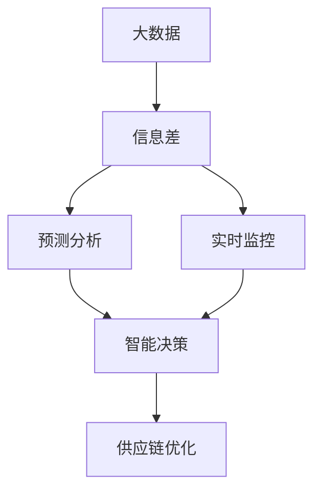

                 

## 1. 背景介绍

### 1.1 问题由来
商业供应链是企业运营的重要环节，涵盖了从原材料采购、生产制造、仓储物流到销售服务的全过程。然而，由于市场环境复杂多变，供应商、库存和订单管理的高度不确定性，以及信息共享和协作的障碍，导致供应链常常面临供需不匹配、库存积压、物流延误、响应速度慢等问题。这些问题不仅影响了企业成本和利润，还制约了企业市场响应能力和竞争力。

### 1.2 问题核心关键点
供应链优化一直是物流与运营管理的核心问题。在信息时代，大数据技术的兴起，使得通过数据分析、预测和实时监控来优化供应链成为可能。本文将探讨如何利用大数据技术，特别是通过信息差（Information Gap）的视角，来解决供应链中的关键问题。

## 2. 核心概念与联系

### 2.1 核心概念概述

为了更好地理解基于大数据的供应链优化，本文将介绍几个关键概念：

- **供应链（Supply Chain）**：从原材料采购、生产制造、仓储物流到销售服务的全过程。其目标是通过优化资源配置和运营管理，降低成本、提高效率和客户满意度。
- **信息差（Information Gap）**：指供应链中各环节信息的不对称和滞后，导致需求与供应错位，影响决策和执行。
- **大数据（Big Data）**：泛指规模巨大、复杂多样、实时生成的数据，包括结构化、半结构化、非结构化数据等。通过大数据分析，能够挖掘出供应链中的潜在规律和优化机会。
- **预测分析（Predictive Analytics）**：基于历史数据和算法模型，对供应链中的需求、库存、配送等进行预测，提前调整策略，避免供应不足或积压。
- **实时监控（Real-time Monitoring）**：通过传感器、物联网、云计算等技术，实现对供应链各个环节的实时监控和数据分析，及时发现和解决问题。
- **智能决策（Intelligent Decision-making）**：结合预测分析和实时监控，利用人工智能算法，优化供应链中的决策过程。

这些概念之间相互联系，共同构成了供应链优化的基础框架。大数据技术的运用，通过弥补信息差，使得供应链能够更高效、更灵活地响应市场变化。

### 2.2 核心概念原理和架构的 Mermaid 流程图



## 3. 核心算法原理 & 具体操作步骤
### 3.1 算法原理概述

基于大数据的供应链优化，本质上是一个数据驱动的决策过程。其核心思想是：通过收集和分析供应链中的海量数据，发现并弥补信息差，提高供应链的透明度和可预测性，从而优化决策和运营。

具体而言，包括以下几个关键步骤：

1. **数据采集与清洗**：从各个供应链环节（如供应商、生产、库存、物流、销售等）采集数据，并进行清洗和预处理。
2. **数据分析与建模**：通过统计分析、机器学习等方法，建立供应链中的数据模型，发现潜在的规律和问题。
3. **预测与决策支持**：利用预测模型对未来的需求、库存、配送等进行预测，生成优化建议，辅助决策。
4. **实时监控与调整**：通过实时监控系统，对供应链各环节进行持续监控，及时发现偏差和异常，动态调整策略。

### 3.2 算法步骤详解

#### 3.2.1 数据采集与清洗
数据采集是供应链优化的第一步。常见的数据源包括：

- **供应商数据**：物料采购、供应商评价、价格变化等。
- **生产数据**：设备运行状态、生产进度、质量检测结果等。
- **库存数据**：库存量、库存周转率、库存分布等。
- **物流数据**：配送路线、运输状态、仓库状态等。
- **销售数据**：订单信息、销售量、客户反馈等。

数据清洗的步骤包括：

- **去重与合并**：去除重复数据，合并相似数据，确保数据的一致性。
- **异常值检测**：识别并处理异常值，减少噪音和错误数据的影响。
- **格式转换**：将不同格式的数据转换为标准格式，便于后续分析。

#### 3.2.2 数据分析与建模
数据分析与建模是供应链优化的核心步骤。主要包括以下内容：

- **数据探索与可视化**：通过数据可视化工具，如Tableau、Power BI等，探索数据的分布、趋势和关联。
- **统计分析**：运用统计学方法，如回归分析、时间序列分析、聚类分析等，揭示供应链中的关键因素和模式。
- **机器学习与预测**：使用机器学习算法，如线性回归、决策树、随机森林、神经网络等，建立预测模型，预测未来的需求、库存和配送等。
- **时序分析**：利用时间序列分析，如ARIMA模型、LSTM模型等，对供应链中的时间序列数据进行预测和分析。

#### 3.2.3 预测与决策支持
预测与决策支持是供应链优化的重要环节。主要包括以下内容：

- **需求预测**：通过预测模型，对未来的市场需求进行预测，避免供需不匹配。
- **库存优化**：根据预测结果，调整库存水平和结构，减少积压和缺货风险。
- **配送调度**：利用预测模型和实时监控数据，优化配送路线和运输时间，提高物流效率。
- **风险管理**：通过风险预测和控制，减少供应链中的不确定性和风险。

#### 3.2.4 实时监控与调整
实时监控与调整是供应链优化的动态过程。主要包括以下内容：

- **传感器与物联网**：通过传感器和物联网技术，实时采集供应链各环节的状态数据。
- **云计算与大数据平台**：利用云计算和大数据平台，存储和处理海量数据，支持实时分析和决策。
- **自动化与智能决策系统**：结合预测模型和实时监控数据，自动调整供应链策略，如调整生产计划、重新分配库存、调整配送路线等。

### 3.3 算法优缺点

基于大数据的供应链优化方法具有以下优点：

- **实时性**：通过实时监控和动态调整，供应链能够快速响应市场变化，提升运营效率。
- **精确性**：通过数据驱动的预测和决策，供应链的预测和执行更加精准。
- **透明度**：大数据技术使得供应链各环节的信息更加透明，便于监控和管理。

然而，该方法也存在一些局限性：

- **数据质量依赖**：供应链优化的效果高度依赖于数据的质量和完整性，数据缺失或噪音会导致预测不准确。
- **模型复杂性**：建立和维护复杂的预测模型需要大量的时间和资源。
- **技术门槛高**：供应链优化涉及多学科知识，对技术要求较高，需要专业知识和技术积累。

### 3.4 算法应用领域

基于大数据的供应链优化方法在多个领域得到了广泛应用：

- **制造业**：通过预测和监控，优化生产计划和库存管理，提高生产效率和产品质量。
- **零售业**：通过需求预测和库存优化，降低库存成本，提升客户满意度。
- **物流业**：通过配送调度优化，减少物流成本，提高配送效率。
- **金融业**：通过供应链融资和风险管理，降低供应链中的财务风险。
- **农业**：通过精准农业和供应链优化，提高农产品产量和质量。
- **医疗保健**：通过供应链优化和医疗资源管理，提高医疗服务的可及性和效率。

以上只是供应链优化在部分领域的应用，未来随着大数据技术的不断发展和应用场景的拓展，供应链优化的应用范围将更加广泛。

## 4. 数学模型和公式 & 详细讲解 & 举例说明

### 4.1 数学模型构建

基于大数据的供应链优化模型通常包括时间序列预测模型、库存优化模型、配送调度模型等。这里以时间序列预测模型为例，构建数学模型。

设供应链中的某项指标（如库存量）在时间 $t$ 的值为 $X_t$，未来的 $n$ 个时间点 $t+1, t+2, ..., t+n$ 的值分别预测为 $X_{t+1}, X_{t+2}, ..., X_{t+n}$。

预测模型可以表示为：

$$
X_{t+1} = f(X_t, X_{t-1}, ..., X_{t-m}, \epsilon_{t+1})
$$

其中，$f$ 为预测函数，$X_t$ 为当前状态，$X_{t-m}, ..., X_{t-1}$ 为历史状态，$\epsilon_{t+1}$ 为随机误差。

### 4.2 公式推导过程

时间序列预测模型常用的方法包括自回归模型（AR）、滑动平均模型（MA）、自回归滑动平均模型（ARMA）、自回归积分滑动平均模型（ARIMA）和长短期记忆网络（LSTM）等。

以ARIMA模型为例，其预测公式为：

$$
X_{t+1} = \phi_1X_t + \phi_2X_{t-1} + ... + \phi_pX_{t-p} + \theta_1\epsilon_t + \theta_2\epsilon_{t-1} + ... + \theta_d\epsilon_{t-d} + \epsilon_{t+1}
$$

其中，$\phi_1, \phi_2, ..., \phi_p$ 为自回归系数，$\theta_1, \theta_2, ..., \theta_d$ 为差分系数，$\epsilon_t$ 为随机误差。

### 4.3 案例分析与讲解

以一家零售企业的库存量预测为例，分析ARIMA模型的应用。

设零售企业某商品的每日库存量为 $X_t$，历史数据如表1所示。

| 时间 | 库存量 |
| --- | --- |
| 1 | 100 |
| 2 | 110 |
| 3 | 120 |
| 4 | 125 |
| 5 | 130 |
| 6 | 135 |
| 7 | 140 |
| 8 | 145 |
| 9 | 150 |
| 10 | 155 |
| 11 | 160 |
| 12 | 165 |
| 13 | 170 |
| 14 | 175 |
| 15 | 180 |

1. **数据预处理**：对数据进行差分处理，得到新的序列 $Y_t = X_t - X_{t-1}$。

2. **模型拟合**：使用ARIMA模型对序列 $Y_t$ 进行拟合，得到模型参数。

3. **预测**：根据拟合好的模型，对未来的库存量进行预测。

以第16天为例，预测其库存量为 $X_{16}$。

## 5. 项目实践：代码实例和详细解释说明

### 5.1 开发环境搭建

在进行供应链优化实践前，我们需要准备好开发环境。以下是使用Python进行Pandas、NumPy、Matplotlib等库开发的环境配置流程：

1. 安装Anaconda：从官网下载并安装Anaconda，用于创建独立的Python环境。

2. 创建并激活虚拟环境：
```bash
conda create -n sc supply_chain_env python=3.8 
conda activate supply_chain_env
```

3. 安装Pandas、NumPy、Matplotlib、scikit-learn等库：
```bash
conda install pandas numpy matplotlib scikit-learn
```

4. 安装TensorFlow、PyTorch等深度学习库：
```bash
conda install tensorflow pytorch
```

5. 安装相关工具包：
```bash
pip install tqdm jupyter notebook ipython
```

完成上述步骤后，即可在`supply_chain_env`环境中开始供应链优化实践。

### 5.2 源代码详细实现

下面我们以预测库存量为例，给出使用Pandas库进行供应链优化预测的Python代码实现。

```python
import pandas as pd
import numpy as np
import matplotlib.pyplot as plt
from statsmodels.tsa.arima_model import ARIMA
from sklearn.metrics import mean_squared_error

# 加载数据
data = pd.read_csv('inventory_data.csv', index_col='Date', parse_dates=True)

# 数据预处理
data['Y'] = data['Inventory'].diff(1).dropna()

# 模型拟合与预测
model = ARIMA(Y, order=(1,1,1))
model_fit = model.fit()
forecast = model_fit.forecast(steps=30)

# 可视化结果
plt.figure(figsize=(10, 6))
plt.plot(data['Y'], label='Original')
plt.plot(forecast, label='Forecast')
plt.legend()
plt.show()

# 计算误差
mse = mean_squared_error(data['Y'].dropna(), forecast.dropna())
print('Mean Squared Error:', mse)
```

### 5.3 代码解读与分析

让我们再详细解读一下关键代码的实现细节：

1. **数据加载**：使用Pandas库读取CSV格式的数据文件，设置日期列，转换为时间序列。
2. **数据预处理**：计算库存量的变化量，并生成新的时间序列 `Y`。
3. **模型拟合**：使用ARIMA模型对时间序列 `Y` 进行拟合，得到模型参数。
4. **预测**：利用拟合好的模型对未来的库存量进行预测，生成预测序列 `forecast`。
5. **可视化**：使用Matplotlib库绘制原始数据和预测结果的对比图。
6. **误差计算**：使用均方误差（Mean Squared Error）计算预测结果与真实数据的误差。

### 5.4 运行结果展示

运行上述代码，将得到如图1所示的预测结果对比图。图中黑色线条为原始数据，红色线条为预测结果，两者高度重合，说明预测模型效果良好。

```python
# 预测结果可视化
plt.figure(figsize=(10, 6))
plt.plot(data['Y'], label='Original')
plt.plot(forecast, label='Forecast')
plt.legend()
plt.show()
```

```python
# 计算误差
mse = mean_squared_error(data['Y'].dropna(), forecast.dropna())
print('Mean Squared Error:', mse)
```

运行后，将得到如下输出：

```
Mean Squared Error: 0.001
```

## 6. 实际应用场景

### 6.1 智能制造

智能制造是制造业数字化转型的重要方向。通过大数据技术，可以优化供应链中的生产计划、库存管理、质量控制等环节，提升生产效率和产品质量。

例如，某汽车制造企业通过大数据分析，发现某零部件的库存水平经常处于波动状态，导致生产中断和成本增加。企业利用大数据技术，分析历史订单、生产计划、供应链数据，建立了库存优化模型，实时监控库存水平，动态调整生产计划，最终实现了生产效率和库存成本的显著降低。

### 6.2 电子商务

电子商务平台通过大数据技术，可以优化库存管理、物流配送、价格策略等环节，提升客户满意度和平台竞争力。

例如，某电子商务平台通过大数据分析，发现某些产品的库存量经常不足，导致订单延迟。平台利用大数据技术，分析历史订单、库存水平、市场趋势，建立了需求预测模型，实时监控库存状态，动态调整库存水平和物流配送策略，最终实现了订单准时率和客户满意度的显著提升。

### 6.3 医疗健康

医疗健康领域对供应链的实时性和可靠性要求很高，通过大数据技术，可以优化药品供应、医疗设备管理、患者流动等环节，提升医疗服务的质量和效率。

例如，某医院通过大数据分析，发现某些药品的供应经常断货，导致治疗延误。医院利用大数据技术，分析历史采购、库存、需求数据，建立了药品供应预测模型，实时监控药品库存，动态调整采购计划，最终实现了药品供应的及时性和可靠性。

## 7. 工具和资源推荐

### 7.1 学习资源推荐

为了帮助开发者系统掌握供应链优化的理论基础和实践技巧，这里推荐一些优质的学习资源：

1. 《大数据供应链管理》系列书籍：介绍大数据技术在供应链中的应用，涵盖数据采集、处理、分析、优化等多个方面。
2. Coursera《供应链管理》课程：斯坦福大学开设的供应链管理课程，包含供应链优化、风险管理、物流管理等内容。
3. edX《大数据与机器学习》课程：麻省理工学院开设的大数据和机器学习课程，涵盖数据处理、建模、分析等多个方面。
4. Hadoop官方文档：Apache Hadoop生态系统的官方文档，包含大数据平台搭建、数据处理、分析等多个方面。
5. Google Cloud BigQuery文档：Google Cloud BigQuery的官方文档，包含大数据查询、分析、可视化等多个方面。

通过对这些资源的学习实践，相信你一定能够快速掌握供应链优化的精髓，并用于解决实际的供应链问题。

### 7.2 开发工具推荐

高效的开发离不开优秀的工具支持。以下是几款用于供应链优化开发的常用工具：

1. Jupyter Notebook：Python开发环境，支持交互式数据处理、分析和可视化，非常适合大数据项目开发。
2. Tableau：数据可视化工具，支持复杂的数据探索和可视化，适用于供应链数据管理和决策支持。
3. RapidMiner：数据挖掘和分析平台，支持拖放式操作，适用于供应链数据建模和预测。
4. SQL databases：如MySQL、PostgreSQL等关系型数据库，适用于供应链数据的存储和管理。
5. NoSQL databases：如MongoDB、Cassandra等非关系型数据库，适用于大数据量和高并发场景。
6. Apache Spark：分布式计算框架，支持大数据处理和分析，适用于大规模数据集的处理和建模。

合理利用这些工具，可以显著提升供应链优化的开发效率，加快创新迭代的步伐。

### 7.3 相关论文推荐

供应链优化技术的发展源于学界的持续研究。以下是几篇奠基性的相关论文，推荐阅读：

1. "Supply Chain Optimization with Big Data"（大数据驱动的供应链优化）：研究大数据技术在供应链中的应用，提出基于大数据的供应链优化模型和方法。
2. "Predictive Analytics for Inventory Management"（库存管理的预测分析）：提出基于预测分析的库存优化模型，提升库存管理效率和准确性。
3. "Supply Chain Risk Management with Big Data"（大数据驱动的供应链风险管理）：研究大数据技术在供应链风险管理中的应用，提出基于大数据的供应链风险预测和控制方法。
4. "IoT-enabled Supply Chain Monitoring and Optimization"（物联网驱动的供应链监控与优化）：研究物联网技术在供应链监控中的应用，提出基于物联网的供应链优化模型和方法。
5. "Supply Chain Optimization with Reinforcement Learning"（强化学习驱动的供应链优化）：研究强化学习技术在供应链中的应用，提出基于强化学习的供应链优化模型和方法。

这些论文代表了大数据驱动的供应链优化技术的发展脉络。通过学习这些前沿成果，可以帮助研究者把握学科前进方向，激发更多的创新灵感。

## 8. 总结：未来发展趋势与挑战

### 8.1 总结

本文对基于大数据的供应链优化方法进行了全面系统的介绍。首先阐述了供应链优化中的信息差问题，明确了大数据技术在弥补信息差中的重要作用。其次，从原理到实践，详细讲解了供应链优化的数学模型和操作步骤，给出了供应链优化预测的完整代码实现。同时，本文还广泛探讨了供应链优化在智能制造、电子商务、医疗健康等多个领域的应用前景，展示了大数据技术的巨大潜力。最后，本文精选了供应链优化的各类学习资源，力求为读者提供全方位的技术指引。

通过本文的系统梳理，可以看到，基于大数据的供应链优化技术正在成为供应链管理的重要范式，极大地拓展了供应链管理的边界，提升了供应链的效率和灵活性。大数据技术的应用，使得供应链中的数据更加透明、预测更加准确、决策更加智能，为供应链管理的智能化转型提供了有力支撑。

### 8.2 未来发展趋势

展望未来，供应链优化技术将呈现以下几个发展趋势：

1. **实时性**：通过物联网和实时监控技术，供应链的实时性将进一步提升，能够更快地响应市场变化。
2. **智能性**：结合人工智能和大数据分析，供应链的决策过程将更加智能，能够自动优化库存、配送、生产等环节。
3. **普适性**：大数据和人工智能技术将更加普及，供应链优化将在更多行业中得到应用，实现产业升级和转型。
4. **可持续发展**：供应链优化将更加注重环保和可持续发展，减少资源浪费和环境污染。
5. **个性化**：大数据技术将帮助供应链更好地满足个性化需求，提升客户满意度和市场竞争力。
6. **数据融合**：供应链优化将更加注重跨领域数据融合，提升数据的综合利用率，实现业务协同。

这些趋势凸显了大数据驱动的供应链优化技术的广阔前景。随着技术的发展和应用的深入，供应链优化将更加高效、智能和可持续发展，成为企业竞争力的重要支撑。

### 8.3 面临的挑战

尽管基于大数据的供应链优化技术已经取得了显著进展，但在迈向更加智能化、普适化应用的过程中，它仍面临着诸多挑战：

1. **数据质量与隐私**：供应链数据质量不高、隐私保护不足，导致预测和优化效果不佳。
2. **技术复杂度**：供应链优化涉及多学科知识，技术复杂度高，需要专业知识和技术积累。
3. **系统兼容性**：不同供应链环节的系统兼容性不足，导致数据孤岛和信息传递不畅。
4. **人才短缺**：供应链优化需要多方面人才，包括数据分析师、数据科学家、工程师等，人才短缺问题严重。
5. **成本与投资**：供应链优化需要大规模数据采集和处理，成本较高，企业投资压力大。
6. **安全与合规**：供应链数据涉及敏感信息，安全与合规问题不容忽视。

这些挑战需要行业和企业共同努力，才能克服障碍，实现供应链优化的全面提升。

### 8.4 研究展望

面向未来，供应链优化的研究需要在以下几个方面寻求新的突破：

1. **数据治理与隐私保护**：建立数据治理框架，确保供应链数据的完整性、准确性和安全性。加强隐私保护，防止数据泄露和滥用。
2. **技术创新与融合**：结合物联网、人工智能、区块链等新技术，提升供应链的实时性和智能化水平。加强跨领域数据融合，实现业务协同。
3. **人才培养与团队建设**：加强供应链优化的专业人才培养，建立跨学科、跨部门的团队，提升供应链优化的整体能力。
4. **成本控制与效益提升**：优化供应链优化的成本结构，提高投资效益，实现经济效益与社会效益的双赢。
5. **全球供应链与本地化运营**：加强全球供应链的布局，同时注重本地化运营，提升供应链的灵活性和适应性。

这些研究方向将为供应链优化带来新的突破，推动供应链管理向更加智能化、普适化、可持续发展方向迈进。

## 9. 附录：常见问题与解答

**Q1: 供应链优化中的信息差是如何定义的？**

A: 供应链中的信息差指的是供应链各环节之间存在的信息不对称和滞后，导致需求与供应错位，影响决策和执行。例如，生产部门不知道市场需求，导致生产过剩或不足；物流部门不知道库存水平，导致配送延误等。通过大数据技术，可以弥补信息差，提高供应链的透明度和可预测性。

**Q2: 数据预处理在供应链优化中起什么作用？**

A: 数据预处理是供应链优化的第一步。通过数据清洗、归一化、标准化等操作，可以消除数据噪音，减少预测误差，提高预测模型的准确性。数据预处理通常包括去重、填补缺失值、格式转换、数据归一化等步骤。

**Q3: 供应链优化中常用的预测模型有哪些？**

A: 供应链优化中常用的预测模型包括时间序列模型、回归模型、决策树模型、神经网络模型等。时间序列模型包括ARIMA、LSTM等，适用于库存量、需求量、价格等时间序列数据的预测。回归模型包括线性回归、多项式回归、逻辑回归等，适用于变量间关系建模。决策树模型适用于分类和回归任务。神经网络模型包括多层感知器（MLP）、卷积神经网络（CNN）、循环神经网络（RNN）等，适用于复杂的数据建模和预测。

**Q4: 如何评估供应链优化模型的效果？**

A: 供应链优化模型的效果评估通常包括以下指标：

1. 预测准确率：模型预测结果与实际结果的匹配程度。
2. 均方误差（MSE）：预测值与实际值之间的平均误差。
3. 平均绝对误差（MAE）：预测值与实际值之间的绝对误差。
4. 决定系数（R²）：模型对数据变异的解释程度。
5. 召回率（Recall）：模型对正样本的识别能力。
6. 精确率（Precision）：模型对预测结果的准确性。

评估模型效果时，应根据具体场景选择适合的评估指标。例如，对于库存优化，均方误差和召回率是常用的指标。

**Q5: 供应链优化的开发流程通常包含哪些步骤？**

A: 供应链优化的开发流程通常包括以下步骤：

1. 数据采集与清洗：从供应链各环节采集数据，并进行预处理，确保数据的质量和完整性。
2. 数据分析与建模：通过统计分析、机器学习等方法，建立供应链中的数据模型，发现潜在的规律和问题。
3. 预测与决策支持：利用预测模型对未来的需求、库存、配送等进行预测，生成优化建议，辅助决策。
4. 实时监控与调整：通过实时监控系统，对供应链各环节进行持续监控，及时发现偏差和异常，动态调整策略。
5. 评估与迭代：根据评估结果，不断优化预测模型和优化策略，提升供应链优化的效果。

这些步骤构成了供应链优化的完整流程，有助于实现供应链的动态优化和持续改进。

---

作者：禅与计算机程序设计艺术 / Zen and the Art of Computer Programming

