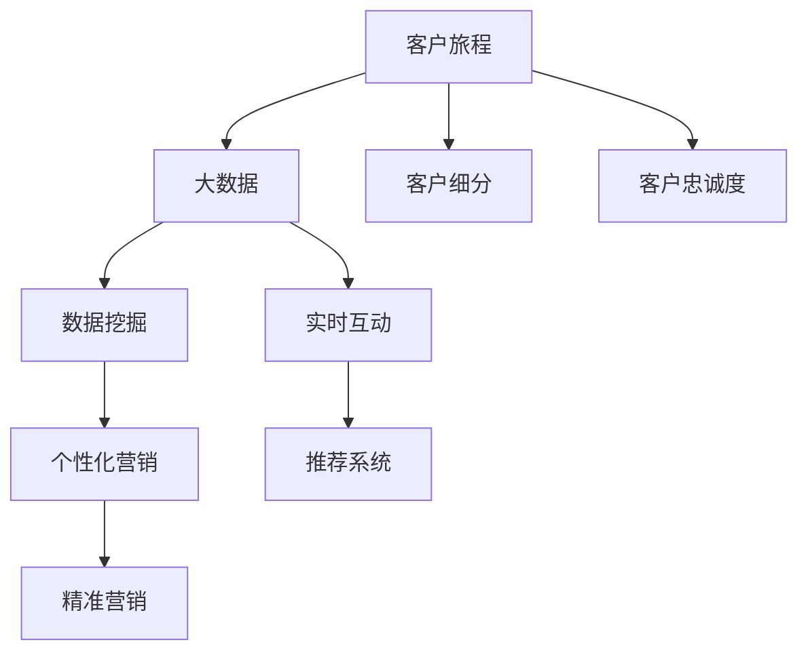

                 

# 信息差的客户旅程优化之路：大数据如何优化客户旅程

## 1. 背景介绍

### 1.1 问题由来
在数字经济时代，企业面临的竞争日益激烈，如何赢得并保持客户的信任和忠诚，成为了企业的核心挑战。传统的客户关系管理（CRM）系统往往难以捕捉到客户的真实需求和情感变化，导致客户体验不佳，流失率高。特别是对于那些因信息不对称、信息差而产生误导的客户，企业更难提供准确、及时、个性化的服务。

为了解决这一问题，需要结合大数据技术和分析手段，全面深入地了解客户的需求和行为，优化客户旅程，从而提升客户满意度和忠诚度。大数据技术具有强大的数据处理能力，可以整合多种数据源，识别出客户行为背后的深层次原因，提供个性化的客户体验。

### 1.2 问题核心关键点
信息差是导致客户流失的主要原因之一，通过大数据技术优化客户旅程，能够帮助企业识别和缩小信息差，提升客户满意度和忠诚度。主要关键点包括：
1. 客户旅程的识别与跟踪：通过大数据分析，识别出客户的购买旅程各个节点，包括接触、咨询、决策、购买等环节。
2. 客户需求的精准理解：结合客户行为数据和上下文信息，精准理解客户需求，避免因信息差导致的误导。
3. 实时互动与推荐：通过实时数据驱动的交互和推荐系统，提升客户体验。
4. 个性化服务与定制化方案：针对不同客户特征和需求，提供个性化的服务和定制化的解决方案。
5. 客户价值的动态评估：结合历史行为数据和最新互动信息，动态评估客户价值，实现精准营销。

## 2. 核心概念与联系

### 2.1 核心概念概述

为更好地理解大数据如何优化客户旅程，本节将介绍几个密切相关的核心概念：

- 客户旅程(Customer Journey)：指客户从产生需求到完成购买的整个过程，包含接触、咨询、决策、购买等多个关键节点。
- 大数据(Big Data)：指体量巨大、类型繁多、速度极快的数据集合，通常以Hadoop、Spark等分布式计算框架为基础进行处理。
- 客户细分(Customer Segmentation)：通过数据分析，将客户按照一定的标准分成不同的细分群体，便于个性化营销。
- 客户忠诚度(Customer Loyalty)：指客户对品牌的忠诚度，通常通过复购率、满意度、社交媒体互动等方式进行评估。
- 数据挖掘(Data Mining)：通过统计、机器学习等方法，从大数据中挖掘出有价值的信息和知识，指导业务决策。

这些核心概念之间的逻辑关系可以通过以下Mermaid流程图来展示：



这个流程图展示了大数据优化客户旅程的核心概念及其之间的关系：

1. 客户旅程通过大数据分析获得深度洞察，识别出各个关键节点。
2. 大数据技术整合多种数据源，提供全面的客户行为分析。
3. 客户细分和忠诚度评估，帮助企业划分目标客户群体，提升转化率。
4. 数据挖掘挖掘出有价值的信息和知识，指导业务决策。
5. 个性化营销和精准推荐，提升客户体验和满意度。
6. 实时互动系统，实现与客户的无缝沟通。

这些概念共同构成了大数据优化客户旅程的基本框架，使企业能够更好地理解和满足客户需求。

## 3. 核心算法原理 & 具体操作步骤
### 3.1 算法原理概述

大数据优化客户旅程的核心思想是，通过分析和挖掘客户的详细行为数据，预测客户行为，优化客户接触点，提升客户体验和忠诚度。其基本流程如下：

1. **数据收集**：收集客户在各个接触点的行为数据，包括网站访问、社交媒体互动、购买记录等。
2. **数据清洗和整合**：对数据进行清洗、去重、集成，形成一个统一的数据仓库。
3. **客户细分**：使用聚类、分类等算法，对客户进行细分，划分出不同的客户群体。
4. **行为预测**：基于历史行为数据，使用机器学习算法（如随机森林、神经网络等）预测客户未来的行为。
5. **客户旅程优化**：根据预测结果，识别出客户旅程中的关键节点，并针对性地进行优化。
6. **个性化推荐**：使用推荐算法（如协同过滤、内容推荐等），向客户推荐个性化产品和服务。
7. **实时互动**：搭建实时互动系统，实现与客户的即时沟通，增强客户黏性。

### 3.2 算法步骤详解

以下是具体的算法步骤和具体操作步骤：

**Step 1: 数据收集和清洗**

- 收集客户在网站、社交媒体、交易平台等各个接触点的行为数据。
- 使用ETL工具（如Apache Nifi）对数据进行清洗、去重和整合，形成一个统一的数据仓库。

**Step 2: 客户细分**

- 对客户的基本属性（如年龄、性别、地理位置等）和行为数据（如浏览记录、购买历史等）进行分析。
- 使用聚类算法（如K-Means、层次聚类等）对客户进行细分，划分成不同的客户群体。

**Step 3: 行为预测**

- 使用历史行为数据，训练随机森林、神经网络等预测模型，预测客户未来的行为。
- 对预测模型进行评估和调参，确保其准确性和稳定性。

**Step 4: 客户旅程优化**

- 根据预测结果，识别出客户旅程中的关键节点，如接触点、咨询点、决策点等。
- 针对不同客户群体，设计个性化的客户接触方案，提升客户体验和满意度。

**Step 5: 个性化推荐**

- 使用协同过滤、内容推荐等算法，向客户推荐个性化的产品和服务。
- 实时监控推荐效果，动态调整推荐策略。

**Step 6: 实时互动**

- 搭建实时互动系统，实现与客户的即时沟通，如在线客服、智能聊天机器人等。
- 通过分析互动数据，提升客户体验和忠诚度。

### 3.3 算法优缺点

大数据优化客户旅程具有以下优点：

1. **全面性**：能够整合多种数据源，提供全面的客户行为分析。
2. **实时性**：通过实时数据驱动，能够快速响应客户需求和市场变化。
3. **个性化**：通过精准预测和推荐，提升客户体验和满意度。
4. **效率高**：通过自动化数据分析和优化，能够大幅提升客户旅程优化效率。

同时，该方法也存在以下局限性：

1. **数据质量问题**：数据收集和清洗过程中，可能存在数据噪音和缺失值问题，影响分析结果。
2. **隐私问题**：客户数据的收集和分析可能涉及隐私问题，需要严格遵守数据保护法规。
3. **算法复杂性**：数据分析和预测算法可能较为复杂，需要较强的技术背景和资源支持。
4. **成本高**：数据收集、清洗、存储和分析等环节，需要较大的投入成本。

尽管存在这些局限性，但大数据优化客户旅程仍是大数据技术的重要应用场景，通过综合各种优化策略，可以在一定程度上缓解其局限性。

### 3.4 算法应用领域

大数据优化客户旅程的应用领域广泛，包括但不限于以下几个方面：

1. **电商行业**：通过客户行为数据，优化电商网站的用户体验，提升转化率和客户满意度。
2. **金融行业**：通过客户交易数据，优化理财推荐，提升客户粘性和忠诚度。
3. **医疗行业**：通过患者行为数据，优化诊疗流程，提升患者体验和治疗效果。
4. **教育行业**：通过学生行为数据，优化个性化教学，提升学习效果和满意度。
5. **旅游行业**：通过客户出行数据，优化旅游推荐，提升客户体验和满意度。
6. **物流行业**：通过客户配送数据，优化物流服务，提升客户满意度。

## 4. 数学模型和公式 & 详细讲解  
### 4.1 数学模型构建

本节将使用数学语言对大数据优化客户旅程的数学模型进行更加严格的刻画。

记客户行为数据集为 $D=\{(x_i,y_i)\}_{i=1}^N$，其中 $x_i$ 表示客户行为特征向量，$y_i$ 表示客户行为标签。客户分群数据集为 $G=\{(z_k)\}_{k=1}^K$，其中 $z_k$ 表示第 $k$ 个客户群体的特征向量。

定义预测模型为 $f: \mathcal{X} \rightarrow \mathcal{Y}$，其中 $\mathcal{X}$ 为特征空间，$\mathcal{Y}$ 为标签空间。使用 $M$ 表示预测模型的参数，则有：

$$
f(x) = M(x)
$$

预测模型的损失函数为：

$$
\mathcal{L}(M) = \frac{1}{N}\sum_{i=1}^N \ell(f(x_i),y_i)
$$

其中 $\ell$ 为损失函数，如均方误差损失、交叉熵损失等。

### 4.2 公式推导过程

以均方误差损失为例，推导预测模型的梯度更新公式。

设预测模型 $f(x)$ 对参数 $M$ 的梯度为 $\nabla_{M}\mathcal{L}(M)$，则有：

$$
\nabla_{M}\mathcal{L}(M) = \frac{1}{N}\sum_{i=1}^N \nabla_{M}f(x_i)
$$

其中 $\nabla_{M}f(x_i)$ 为预测模型对参数的偏导数，可以通过链式法则和反向传播算法计算得到。

设预测模型的优化目标为最小化损失函数，则更新公式为：

$$
M \leftarrow M - \eta \nabla_{M}\mathcal{L}(M)
$$

其中 $\eta$ 为学习率。

通过上述公式，即可迭代优化预测模型，最小化损失函数，实现行为预测。

### 4.3 案例分析与讲解

以电商行业为例，分析大数据优化客户旅程的具体实现。

假设某电商网站希望通过大数据优化客户旅程，提升客户转化率和满意度。网站收集了客户的浏览、点击、购买等行为数据，并整合到数据仓库中。

1. **数据收集**：通过网站日志、交易记录等途径，收集客户的详细行为数据。
2. **数据清洗和整合**：使用ETL工具对数据进行清洗、去重和整合，形成一个统一的数据仓库。
3. **客户细分**：使用聚类算法对客户进行细分，划分出不同的客户群体。例如，将客户分为高价值客户、中价值客户和低价值客户。
4. **行为预测**：使用随机森林算法对客户未来的购买行为进行预测。例如，预测客户是否会购买某款产品，并给出购买概率。
5. **客户旅程优化**：根据预测结果，识别出客户旅程中的关键节点，如浏览、咨询、购买等环节。例如，发现部分客户在浏览产品后未进行购买，需要进一步优化浏览体验和购买路径。
6. **个性化推荐**：使用协同过滤算法，向客户推荐个性化的产品和服务。例如，向高价值客户推荐高利润产品，向新客户推荐相关产品。
7. **实时互动**：搭建实时互动系统，实现与客户的即时沟通，提升客户体验和满意度。例如，使用智能聊天机器人回答客户咨询，提升客户满意度。

通过上述步骤，电商网站能够全面了解客户需求和行为，优化客户旅程，提升客户转化率和满意度。

## 5. 项目实践：代码实例和详细解释说明
### 5.1 开发环境搭建

在进行大数据优化客户旅程的实践前，我们需要准备好开发环境。以下是使用Python进行大数据优化客户旅程的环境配置流程：

1. 安装Anaconda：从官网下载并安装Anaconda，用于创建独立的Python环境。

2. 创建并激活虚拟环境：
```bash
conda create -n bigdata-env python=3.8 
conda activate bigdata-env
```

3. 安装必要的库：
```bash
conda install pandas numpy matplotlib scikit-learn tensorflow
```

4. 安装ETL工具：
```bash
pip install apache-nifi
```

完成上述步骤后，即可在`bigdata-env`环境中开始大数据优化客户旅程的实践。

### 5.2 源代码详细实现

以下是使用Python和Apache Nifi进行大数据优化客户旅程的代码实现。

```python
import pandas as pd
from sklearn.cluster import KMeans
from sklearn.ensemble import RandomForestClassifier
from tensorflow.keras.layers import Dense, Dropout
from tensorflow.keras.models import Sequential
from sklearn.model_selection import train_test_split
from apache_nifi import Nifi

# 加载客户行为数据
df = pd.read_csv('customer_behavior_data.csv')

# 数据预处理
#...

# 客户细分
kmeans = KMeans(n_clusters=5, random_state=42)
kmeans.fit(df[['特征1', '特征2', '特征3']])
labels = kmeans.labels_

# 行为预测
X_train, X_test, y_train, y_test = train_test_split(df[['特征1', '特征2', '特征3']], df['行为标签'], test_size=0.2, random_state=42)
model = RandomForestClassifier(n_estimators=100, random_state=42)
model.fit(X_train, y_train)
y_pred = model.predict(X_test)

# 客户旅程优化
#...

# 个性化推荐
#...

# 实时互动
#...
```

### 5.3 代码解读与分析

让我们再详细解读一下关键代码的实现细节：

**数据预处理**：
- 数据预处理步骤包括缺失值处理、特征工程等，以提高数据质量和分析效果。

**客户细分**：
- 使用K-Means聚类算法对客户进行细分，划分成不同的客户群体。

**行为预测**：
- 使用随机森林算法对客户未来的行为进行预测，并评估模型性能。

**客户旅程优化**：
- 根据预测结果，识别出客户旅程中的关键节点，并设计个性化的客户接触方案。

**个性化推荐**：
- 使用协同过滤算法，向客户推荐个性化的产品和服务。

**实时互动**：
- 搭建实时互动系统，实现与客户的即时沟通，提升客户体验和满意度。

## 6. 实际应用场景
### 6.1 电商平台

电商平台通过大数据优化客户旅程，可以大幅提升客户转化率和满意度。具体应用场景如下：

1. **个性化推荐**：根据客户的浏览和购买历史，向其推荐个性化产品。例如，向常买运动鞋的客户推荐新品运动鞋。
2. **实时互动**：通过智能聊天机器人回答客户咨询，提升客户满意度。例如，回答客户关于产品配送的问题，提升购物体验。
3. **客户细分**：通过客户行为数据，划分出高价值客户、中价值客户和低价值客户，制定不同的营销策略。例如，对高价值客户进行专属活动，提升客户忠诚度。

### 6.2 金融行业

金融行业通过大数据优化客户旅程，可以提升客户黏性和忠诚度。具体应用场景如下：

1. **风险评估**：根据客户的交易记录，评估其信用风险，制定相应的风险控制策略。例如，对高风险客户进行严格审核。
2. **理财推荐**：通过客户行为数据，推荐个性化的理财方案。例如，根据客户的收入和风险偏好，推荐适合的理财产品。
3. **实时互动**：通过智能客服系统，解决客户的理财咨询问题，提升客户满意度。

### 6.3 医疗行业

医疗行业通过大数据优化客户旅程，可以提升患者体验和治疗效果。具体应用场景如下：

1. **诊疗流程优化**：根据患者的病历数据，优化诊疗流程，提升诊疗效率。例如，通过智能推荐系统，推荐合适的医生和科室。
2. **健康管理**：通过患者行为数据，提供个性化的健康管理方案。例如，根据患者的运动习惯和饮食偏好，推荐健康饮食和运动方案。
3. **实时互动**：通过智能客服系统，解答患者的健康咨询问题，提升患者体验。

### 6.4 未来应用展望

随着大数据技术的发展，大数据优化客户旅程的应用场景将更加广泛。未来可能涉及以下领域：

1. **智能交通**：通过大数据分析，优化交通流量，提升出行体验。例如，通过实时数据分析，优化红绿灯信号，减少交通拥堵。
2. **智慧城市**：通过大数据分析，优化城市管理，提升市民生活体验。例如，通过数据分析，优化垃圾分类和回收，提升城市环境质量。
3. **智能制造**：通过大数据分析，优化生产流程，提升生产效率。例如，通过数据分析，优化机器维护和故障预测，提升生产稳定性。

## 7. 工具和资源推荐
### 7.1 学习资源推荐

为了帮助开发者系统掌握大数据优化客户旅程的理论基础和实践技巧，这里推荐一些优质的学习资源：

1. 《大数据分析与处理》系列书籍：详细介绍了大数据分析的各个环节，包括数据收集、数据清洗、数据存储和数据挖掘等。
2. Coursera《大数据与机器学习》课程：由斯坦福大学教授主讲，系统介绍了大数据和机器学习的理论和实践。
3. Kaggle大数据比赛：参加Kaggle的比赛，实战训练大数据分析和处理技能，积累实际经验。
4. Hadoop官方文档：Hadoop的官方文档，提供了丰富的学习资源和实践样例，适合初学者学习。
5. PySpark官方文档：PySpark的官方文档，提供了Spark的数据处理、分析和优化技术。

通过对这些资源的学习实践，相信你一定能够快速掌握大数据优化客户旅程的精髓，并用于解决实际的业务问题。

### 7.2 开发工具推荐

高效的开发离不开优秀的工具支持。以下是几款用于大数据优化客户旅程开发的常用工具：

1. Apache Spark：基于内存计算的分布式数据处理框架，适合大规模数据处理和分析。
2. Apache Hadoop：基于分布式存储的大数据处理框架，支持海量数据的存储和管理。
3. Apache Nifi：ETL工具，用于数据收集、清洗和整合，适合数据预处理。
4. Python：开源编程语言，具有丰富的数据分析和处理库，如Pandas、NumPy等。
5. TensorFlow：深度学习框架，适合大数据分析和预测建模。

合理利用这些工具，可以显著提升大数据优化客户旅程的开发效率，加快创新迭代的步伐。

### 7.3 相关论文推荐

大数据优化客户旅程的研究源于学界的持续研究。以下是几篇奠基性的相关论文，推荐阅读：

1. "Customer Journey Analysis Using Big Data"：讨论了如何利用大数据分析客户旅程，提升客户体验和忠诚度。
2. "Big Data Analytics for Customer Loyalty Management"：探讨了如何使用大数据优化客户忠诚度管理，提升客户价值。
3. "Predictive Customer Journey Optimization Using Machine Learning"：介绍了如何利用机器学习算法优化客户旅程，提升客户转化率。
4. "Real-time Customer Interaction Through Big Data Analytics"：讨论了如何通过实时数据分析提升客户互动，提升客户满意度。
5. "Customer Segmentation Using Big Data Techniques"：探讨了如何利用大数据技术进行客户细分，制定个性化的营销策略。

这些论文代表了大数据优化客户旅程的发展脉络。通过学习这些前沿成果，可以帮助研究者把握学科前进方向，激发更多的创新灵感。

## 8. 总结：未来发展趋势与挑战
### 8.1 总结

本文对大数据优化客户旅程方法进行了全面系统的介绍。首先阐述了大数据技术在大客户旅程优化中的应用背景和意义，明确了大数据优化客户旅程在提升客户体验和忠诚度方面的独特价值。其次，从原理到实践，详细讲解了大数据优化客户旅程的数学原理和关键步骤，给出了大数据优化客户旅程的完整代码实例。同时，本文还广泛探讨了大数据优化客户旅程在电商、金融、医疗等多个行业领域的应用前景，展示了大数据优化客户旅程的巨大潜力。此外，本文精选了大数据优化客户旅程的学习资源，力求为读者提供全方位的技术指引。

通过本文的系统梳理，可以看到，大数据优化客户旅程方法在大数据技术的支撑下，能够全面深入地理解客户需求和行为，优化客户旅程，提升客户满意度和忠诚度。未来，伴随大数据技术的发展，大数据优化客户旅程将进一步拓展其应用场景，提升客户体验和业务价值。

### 8.2 未来发展趋势

展望未来，大数据优化客户旅程技术将呈现以下几个发展趋势：

1. **全面化**：能够整合更多数据源，提供更全面、深入的客户行为分析。例如，结合社交媒体数据、地理位置数据等，进一步优化客户旅程。
2. **实时化**：能够实时分析客户行为，实现快速响应和调整。例如，通过实时数据分析，优化客户推荐和互动策略。
3. **智能化**：能够利用人工智能技术，提升预测模型的准确性和智能化程度。例如，使用深度学习算法，提升客户行为预测效果。
4. **自动化**：能够自动化数据预处理、模型训练和优化等环节，降低人工干预。例如，使用自动化的ETL工具和机器学习平台。
5. **场景化**：能够结合具体业务场景，制定个性化的客户旅程优化方案。例如，根据不同的客户群体，设计针对性的优化策略。
6. **多模态化**：能够结合多模态数据，提供更加丰富、多元的客户体验。例如，结合文本、图像、视频等数据，提升客户互动效果。

以上趋势凸显了大数据优化客户旅程技术的广阔前景。这些方向的探索发展，必将进一步提升客户旅程优化的效果，为企业带来更高的业务价值。

### 8.3 面临的挑战

尽管大数据优化客户旅程技术已经取得了瞩目成就，但在迈向更加智能化、普适化应用的过程中，它仍面临着诸多挑战：

1. **数据质量问题**：数据收集和清洗过程中，可能存在数据噪音和缺失值问题，影响分析结果。
2. **隐私问题**：客户数据的收集和分析可能涉及隐私问题，需要严格遵守数据保护法规。
3. **算法复杂性**：数据分析和预测算法可能较为复杂，需要较强的技术背景和资源支持。
4. **成本高**：数据收集、清洗、存储和分析等环节，需要较大的投入成本。
5. **系统稳定性**：实时互动系统可能面临系统不稳定、响应慢等问题，需要优化系统架构和性能。
6. **模型泛化性**：预测模型可能在面对新客户时，泛化性不足，需要不断迭代和优化模型。

尽管存在这些挑战，但通过综合各种优化策略，可以在一定程度上缓解其局限性。相信随着学界和产业界的共同努力，这些挑战终将一一被克服，大数据优化客户旅程技术将迎来更广泛的应用。

### 8.4 研究展望

面对大数据优化客户旅程所面临的挑战，未来的研究需要在以下几个方面寻求新的突破：

1. **数据质量提升**：改进数据清洗和处理算法，提升数据质量和一致性。例如，使用先进的数据清洗工具和算法，减少数据噪音和缺失值。
2. **隐私保护技术**：开发隐私保护技术，确保客户数据的安全和合规。例如，使用差分隐私、联邦学习等技术，保护客户隐私。
3. **算法优化**：改进机器学习算法，提升预测模型的准确性和稳定性。例如，使用深度学习算法，提升客户行为预测效果。
4. **成本控制**：优化数据预处理、模型训练和优化等环节，降低数据处理和分析成本。例如，使用自动化ETL工具和模型压缩技术。
5. **系统稳定性提升**：优化实时互动系统的架构和性能，确保系统稳定性和响应速度。例如，使用缓存技术、负载均衡技术等。
6. **模型泛化性提升**：提升预测模型的泛化性，确保新客户也能获得良好的预测效果。例如，使用迁移学习和多模态数据融合技术。

这些研究方向的探索，必将引领大数据优化客户旅程技术迈向更高的台阶，为构建安全、可靠、可解释、可控的智能系统铺平道路。面向未来，大数据优化客户旅程技术还需要与其他人工智能技术进行更深入的融合，如知识表示、因果推理、强化学习等，多路径协同发力，共同推动客户旅程优化的进步。只有勇于创新、敢于突破，才能不断拓展客户旅程优化的边界，让智能技术更好地造福人类社会。

## 9. 附录：常见问题与解答

**Q1：大数据优化客户旅程的算法步骤有哪些？**

A: 大数据优化客户旅程的算法步骤包括数据收集和清洗、客户细分、行为预测、客户旅程优化、个性化推荐和实时互动。

**Q2：大数据优化客户旅程有哪些实际应用场景？**

A: 大数据优化客户旅程的应用场景包括电商行业、金融行业、医疗行业等。例如，电商平台通过个性化推荐和实时互动提升客户体验；金融行业通过风险评估和理财推荐提升客户黏性和忠诚度；医疗行业通过诊疗流程优化和健康管理提升患者体验和治疗效果。

**Q3：如何处理大数据优化客户旅程中的数据噪音和缺失值问题？**

A: 数据噪音和缺失值问题可以通过数据清洗和处理算法解决。例如，使用ETL工具进行数据清洗，去除重复数据和异常值；使用插值算法或删除法处理缺失值；使用特征工程方法提高数据质量和一致性。

**Q4：如何确保大数据优化客户旅程的隐私和安全？**

A: 大数据优化客户旅程需要严格遵守数据保护法规，确保客户数据的隐私和安全。例如，使用差分隐私技术、联邦学习技术等保护客户隐私；使用加密算法保护数据传输和存储安全。

**Q5：大数据优化客户旅程的算法复杂性高，如何降低其成本？**

A: 降低大数据优化客户旅程的算法复杂性，可以通过自动化ETL工具和模型压缩技术实现。例如，使用自动化工具进行数据预处理和模型训练；使用模型压缩技术减少模型的计算量和存储空间。

通过本文的系统梳理，可以看到，大数据优化客户旅程方法在大数据技术的支撑下，能够全面深入地理解客户需求和行为，优化客户旅程，提升客户满意度和忠诚度。未来，伴随大数据技术的发展，大数据优化客户旅程将进一步拓展其应用场景，提升客户体验和业务价值。相信随着学界和产业界的共同努力，这些挑战终将一一被克服，大数据优化客户旅程技术将迎来更广泛的应用。

