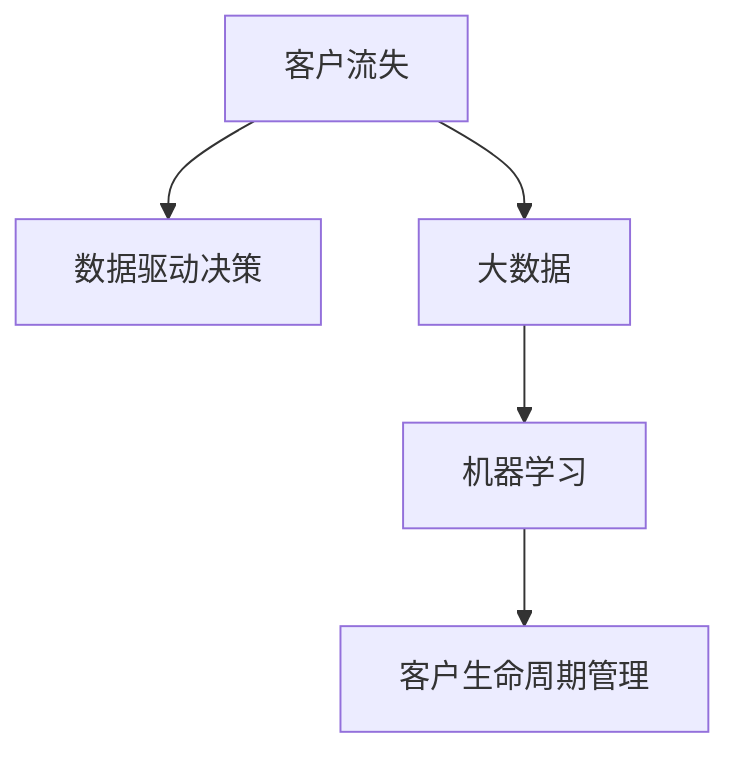

                 

# 信息差的客户流失降低：大数据如何降低客户流失率

> 关键词：客户流失,数据驱动决策,大数据,机器学习,客户生命周期管理,行为分析

## 1. 背景介绍

### 1.1 问题由来

客户流失是企业面临的一大挑战，尤其是在竞争激烈的行业，如电信、金融、电子商务等。客户流失不仅会带来直接的收入损失，还会引起口碑传播，进一步加大品牌维护成本。因此，如何有效地预测和管理客户流失，是企业提升竞争力和盈利能力的关键。

传统上，客户流失的预测和管理依赖于人工经验和历史数据的统计分析。但随着数据量的激增和处理技术的进步，大数据和机器学习技术逐渐成为企业客户流失管理的重要工具。

### 1.2 问题核心关键点

大数据在客户流失管理中的应用，主要围绕以下几个关键点展开：

1. **数据收集**：从各种渠道收集客户的交易、行为、交互等数据。
2. **数据处理**：清洗、整合和标准化数据，为后续分析奠定基础。
3. **特征工程**：提取和构造反映客户流失风险的关键特征。
4. **模型建立**：使用机器学习模型对客户流失进行预测和管理。
5. **决策支持**：根据预测结果，制定有效的客户挽留策略。

## 2. 核心概念与联系

### 2.1 核心概念概述

为更好地理解大数据在客户流失管理中的应用，本节将介绍几个密切相关的核心概念：

- **客户流失(Customer Churn)**：客户停止使用服务或终止订阅的现象。通常分为显性流失和隐性流失。
- **大数据(Big Data)**：指体量巨大、类型多样、价值密度低的数据集合，通常通过分布式存储和处理技术进行管理和分析。
- **数据驱动决策(Data-Driven Decision Making)**：基于数据的洞察和分析，而非传统经验和直觉，进行决策的过程。
- **机器学习(Machine Learning)**：通过数据训练模型，自动发现数据中的规律，并做出预测或决策。
- **客户生命周期管理(Customer Lifecycle Management, CLM)**：对客户的各个阶段进行管理，包括获取、激活、保留、增长和流失等。

这些概念之间的逻辑关系可以通过以下Mermaid流程图来展示：



这个流程图展示了大数据在客户流失管理中的核心概念及其之间的关系：

1. 大数据为企业提供了丰富的客户数据。
2. 机器学习模型在数据上训练，自动提取客户流失的规律。
3. 数据驱动决策基于机器学习模型的预测结果，制定挽留策略。
4. 客户生命周期管理通过数据驱动决策，优化客户各个阶段的管理。

## 3. 核心算法原理 & 具体操作步骤
### 3.1 算法原理概述

大数据在客户流失管理中的应用，主要基于机器学习模型对客户流失进行预测和管理。其核心思想是：通过收集和分析客户的历史行为数据，发现和提取反映流失风险的关键特征，建立模型进行预测，最后根据预测结果制定挽留策略。

形式化地，假设我们有一组历史客户数据 $D=\{(x_i,y_i)\}_{i=1}^N, x_i \in \mathbb{R}^d, y_i \in \{0,1\}$，其中 $x_i$ 表示客户在第 $i$ 天的行为特征向量，$y_i$ 表示该客户是否在第 $i$ 天后流失。目标是构建一个模型 $M$，使得在给定新的客户行为特征 $x$ 时，能够预测客户流失的概率 $p$，即：

$$
p = M(x)
$$

常见的机器学习模型包括逻辑回归、决策树、随机森林、梯度提升树、神经网络等。

### 3.2 算法步骤详解

基于大数据的客户流失预测和管理的一般步骤如下：

**Step 1: 数据收集和预处理**
- 收集客户的交易记录、行为数据、交互数据等，形成一个综合的客户行为数据集。
- 对数据进行清洗、去重、标准化处理，确保数据质量。
- 将数据按时间顺序排列，以便进行时间序列分析。

**Step 2: 特征工程**
- 对客户行为数据进行特征提取，如购买频率、消费金额、点击率等。
- 构造反映客户流失风险的特征，如流失前行为、流失后行为、客户满意度等。
- 使用特征选择方法，如卡方检验、信息增益等，选择对流失预测影响较大的特征。

**Step 3: 模型训练**
- 选择合适的机器学习模型，如逻辑回归、随机森林等。
- 将处理好的数据分为训练集和测试集。
- 在训练集上训练模型，优化模型参数，使得模型能够较好地拟合训练数据。
- 在测试集上评估模型性能，使用准确率、召回率、F1-score等指标衡量模型预测效果。

**Step 4: 预测与挽留策略**
- 将新客户的实时行为数据输入训练好的模型，预测其流失概率。
- 根据预测结果，制定针对性的挽留策略，如优惠券、个性化推荐、客户关怀等。
- 持续监测客户行为，调整策略以应对不同的客户流失风险。

**Step 5: 结果分析与优化**
- 定期对模型预测结果进行分析和评估，识别模型不足和改进空间。
- 根据分析结果，优化数据收集、特征工程和模型选择等环节，提升预测准确率。
- 对挽留策略的效果进行监控，优化策略实施的流程和工具。

### 3.3 算法优缺点

基于大数据的客户流失管理具有以下优点：
1. 数据全面。大数据涵盖客户的各个行为层面，提供丰富的数据源。
2. 模型可解释性。传统的统计模型和机器学习模型可以提供可解释的预测逻辑。
3. 实时性。大数据技术可以支持实时处理和预测，及时响应客户流失风险。
4. 个性化。基于个性化特征的预测和挽留策略，提升客户体验。

同时，该方法也存在一些局限性：
1. 数据质量要求高。大数据分析依赖于数据质量，不完整、不准确的数据会严重影响预测结果。
2. 模型复杂度。复杂模型可能带来较高的计算成本和维护成本。
3. 数据隐私。客户数据的隐私保护是一个重要问题，需要严格的数据治理和合规管理。
4. 数据噪音。大数据通常包含大量的噪音数据，需要有效的特征选择和数据清洗技术。

尽管存在这些局限性，但就目前而言，大数据在客户流失管理中的应用仍是大数据技术落地的一个重要范式。未来相关研究的重点在于如何进一步提升数据质量，简化模型结构，优化数据隐私保护，以及提高预测的实时性。

### 3.4 算法应用领域

基于大数据的客户流失管理方法，在多个行业领域得到了广泛应用，包括：

- 零售：通过购买频率、消费金额等行为特征预测客户流失，制定差异化的购物体验和促销策略。
- 电信：利用通话时长、话费支付、网络质量等数据预测用户流失，提供个性化的服务和套餐。
- 金融：分析账户余额、交易频率、服务评价等数据，识别潜在的高流失风险客户，实施精准营销和客户关怀。
- 电子商务：利用浏览历史、购买记录、评价反馈等数据，预测用户流失，进行再营销和客户保留策略。
- 旅游：通过预订记录、出行习惯、满意度反馈等数据，预测客户流失，优化产品和服务。

## 4. 数学模型和公式 & 详细讲解  
### 4.1 数学模型构建

本节将使用数学语言对基于大数据的客户流失预测模型进行更加严格的刻画。

假设我们有 $N$ 个历史客户数据 $(x_i,y_i)$，其中 $x_i \in \mathbb{R}^d$ 为行为特征向量，$y_i \in \{0,1\}$ 表示流失与否。目标是训练一个分类器 $M(x)$，使得在给定新客户行为特征 $x$ 时，能够预测其流失概率 $p$。

定义损失函数为：

$$
L(y,\hat{y}) = -y\log \hat{y} - (1-y)\log(1-\hat{y})
$$

其中 $\hat{y} = M(x)$ 为模型的预测结果。

我们采用逻辑回归模型，其预测公式为：

$$
\hat{y} = \frac{1}{1+\exp(-\beta_0 - \sum_{j=1}^{d}\beta_j x_{ij})}
$$

其中 $\beta_0, \beta_j$ 为模型的参数。

目标是最小化损失函数：

$$
\mathcal{L}(\beta) = \frac{1}{N}\sum_{i=1}^N L(y_i,M(x_i))
$$

使用梯度下降等优化算法，求解上述最优化问题，得到最优参数 $\beta^*$。

### 4.2 公式推导过程

以下是逻辑回归模型的详细推导过程：

**目标函数**：

$$
\mathcal{L}(\beta) = \frac{1}{N}\sum_{i=1}^N L(y_i,\hat{y}_i)
$$

其中 $L(y_i,\hat{y}_i)$ 为二分类交叉熵损失函数。

**目标函数的梯度**：

$$
\frac{\partial \mathcal{L}(\beta)}{\partial \beta_k} = \frac{1}{N}\sum_{i=1}^N \frac{\partial L(y_i,\hat{y}_i)}{\partial \beta_k}
$$

代入交叉熵损失函数：

$$
\frac{\partial L(y_i,\hat{y}_i)}{\partial \beta_k} = y_i - \hat{y}_i \frac{1}{1+\exp(-\beta_0 - \sum_{j=1}^{d}\beta_j x_{ij})}
$$

化简得：

$$
\frac{\partial L(y_i,\hat{y}_i)}{\partial \beta_k} = y_i - \frac{\hat{y}_i}{1+\exp(-\beta_0 - \sum_{j=1}^{d}\beta_j x_{ij})}
$$

**参数更新**：

使用梯度下降法，更新模型参数 $\beta_k$：

$$
\beta_k \leftarrow \beta_k - \eta \frac{\partial \mathcal{L}(\beta)}{\partial \beta_k}
$$

代入梯度公式：

$$
\beta_k \leftarrow \beta_k - \eta \frac{1}{N}\sum_{i=1}^N \left(y_i - \frac{\hat{y}_i}{1+\exp(-\beta_0 - \sum_{j=1}^{d}\beta_j x_{ij})}\right) x_{ik}
$$

其中 $\eta$ 为学习率，$x_{ik}$ 为特征向量 $x_i$ 的第 $k$ 个特征。

通过上述过程，可以不断迭代更新模型参数，使得模型能够更好地拟合历史数据，并应用于新的客户行为数据的流失预测。

### 4.3 案例分析与讲解

以一个简单的客户流失预测案例来说明大数据在客户流失管理中的应用。

假设我们有一组历史客户数据，如交易金额、购买频率、账户余额、客服评价等，目的是预测这些客户是否会在未来一个月内流失。我们首先进行数据预处理和特征工程，得到 $x_i \in \mathbb{R}^d$ 表示第 $i$ 个客户的特征向量。

然后，我们采用逻辑回归模型进行训练，得到模型参数 $\beta^*$。在给定新的客户行为特征 $x$ 时，模型的预测公式为：

$$
\hat{y} = \frac{1}{1+\exp(-\beta_0^* - \sum_{j=1}^{d}\beta_j^* x_{j})}
$$

最后，我们根据模型预测结果，针对高流失风险的客户，采取针对性挽留措施，如优惠券、个性化推荐、客户关怀等，以降低客户流失率。

## 5. 项目实践：代码实例和详细解释说明
### 5.1 开发环境搭建

在进行客户流失预测实践前，我们需要准备好开发环境。以下是使用Python进行Scikit-learn开发的环境配置流程：

1. 安装Anaconda：从官网下载并安装Anaconda，用于创建独立的Python环境。

2. 创建并激活虚拟环境：
```bash
conda create -n customer-env python=3.8 
conda activate customer-env
```

3. 安装Scikit-learn和其他必要的Python包：
```bash
pip install scikit-learn pandas numpy matplotlib seaborn sklearn
```

完成上述步骤后，即可在`customer-env`环境中开始客户流失预测实践。

### 5.2 源代码详细实现

下面我们以客户流失预测为例，给出使用Scikit-learn进行逻辑回归模型训练的Python代码实现。

首先，定义数据处理函数：

```python
import pandas as pd
from sklearn.model_selection import train_test_split
from sklearn.linear_model import LogisticRegression
from sklearn.metrics import roc_auc_score, roc_curve

def load_data(filename):
    df = pd.read_csv(filename)
    return df

def preprocess_data(df, target_col, features):
    X = df[features]
    y = df[target_col]
    return X, y

def train_model(X_train, y_train, X_test, y_test):
    model = LogisticRegression()
    model.fit(X_train, y_train)
    y_pred = model.predict_proba(X_test)[:, 1]
    auc = roc_auc_score(y_test, y_pred)
    return model, auc

def evaluate_model(model, X_test, y_test):
    y_pred = model.predict_proba(X_test)[:, 1]
    auc = roc_auc_score(y_test, y_pred)
    return auc
```

然后，加载数据并进行预处理：

```python
filename = 'customer_data.csv'
data = load_data(filename)

features = ['transaction_amount', 'purchase_frequency', 'account_balance', 'customer_age']
target = 'churn'

X, y = preprocess_data(data, target, features)
X_train, X_test, y_train, y_test = train_test_split(X, y, test_size=0.2, random_state=42)
```

接着，训练模型并评估性能：

```python
model, auc = train_model(X_train, y_train, X_test, y_test)
print(f'ROC-AUC: {auc:.4f}')

auc_test = evaluate_model(model, X_test, y_test)
print(f'Test ROC-AUC: {auc_test:.4f}')
```

以上就是使用Scikit-learn进行客户流失预测的完整代码实现。可以看到，Scikit-learn提供了便捷的接口，可以轻松完成模型训练和评估。

### 5.3 代码解读与分析

让我们再详细解读一下关键代码的实现细节：

**load_data函数**：
- 从指定文件中加载数据，返回Pandas DataFrame对象。

**preprocess_data函数**：
- 将数据分为特征和目标变量，进行标准化处理。

**train_model函数**：
- 创建逻辑回归模型，使用训练集数据拟合模型。
- 在测试集上计算模型预测的概率，并计算AUC值。

**evaluate_model函数**：
- 使用模型在测试集上进行预测，并计算AUC值。

在实际应用中，还需要针对具体问题进行优化，如调整特征工程策略、选择合适的模型等。通过合理利用Scikit-learn的机器学习算法和工具，可以显著提升客户流失预测的效果。

## 6. 实际应用场景
### 6.1 客户流失预测系统

基于大数据的客户流失预测系统，可以广泛应用于企业客户管理中。企业通过收集客户的交易、行为、交互等数据，训练机器学习模型，预测客户流失概率，从而采取针对性的挽留策略。

在技术实现上，系统可以实时收集客户的最新行为数据，输入模型进行预测，及时识别高流失风险客户，并触发挽留策略，如个性化推荐、优惠券、客户关怀等。

### 6.2 实时客户关怀

实时客户关怀系统可以利用大数据和机器学习技术，对客户的实时行为进行监测，提前预警客户流失风险，并提供个性化的关怀措施。

例如，电信公司可以通过实时监测用户的通话时长、话费支付、网络质量等数据，识别高流失风险用户，并推送个性化的优惠套餐或服务提升方案，提升用户满意度，降低流失率。

### 6.3 营销活动优化

营销活动是提升客户满意度和忠诚度的重要手段。通过大数据和机器学习技术，企业可以更好地理解和预测客户的流失风险，制定更加精准的营销策略。

例如，电商企业可以通过分析用户的浏览历史、购买记录、评价反馈等数据，预测客户流失概率，针对高流失风险用户进行再营销，如优惠券、推荐商品、个性化邮件等，提升客户留存率。

### 6.4 未来应用展望

随着大数据和机器学习技术的不断进步，基于大数据的客户流失管理将展现出更广阔的应用前景：

1. **多模态数据融合**：除了传统的行为数据，企业可以进一步引入图像、语音等多模态数据，提升客户流失预测的准确性。
2. **实时性增强**：通过流式处理技术，实时监测客户行为数据，实现实时预测和即时响应。
3. **个性化推荐**：利用客户个性化特征，进行精准推荐，提升客户满意度和忠诚度。
4. **模型自适应**：通过在线学习技术，模型能够持续学习新数据，自动调整预测模型，提升预测效果。
5. **情感分析**：通过分析客户的反馈和评论，识别客户的情感倾向，及时调整服务和营销策略。

## 7. 工具和资源推荐
### 7.1 学习资源推荐

为了帮助开发者系统掌握大数据在客户流失管理中的应用，这里推荐一些优质的学习资源：

1. 《Python数据科学手册》：全面介绍Python在数据科学中的应用，包括数据处理、特征工程、模型训练等。
2. 《机器学习实战》：深入浅出地介绍机器学习算法和实战案例，适合初学者入门。
3. 《Data Science for Business》：介绍数据科学在商业决策中的应用，包括数据驱动决策、客户流失预测等。
4. 《Big Data for Business: How to Make Data-Driven Data Your Most Valuable Asset》：介绍大数据在企业中的应用，包括数据收集、处理和分析。
5. Kaggle：在线数据科学竞赛平台，提供丰富的数据集和案例，帮助开发者提升实战能力。

通过对这些资源的学习实践，相信你一定能够快速掌握大数据在客户流失管理中的应用，并用于解决实际的客户流失问题。

### 7.2 开发工具推荐

高效的开发离不开优秀的工具支持。以下是几款用于大数据客户流失管理开发的常用工具：

1. Python：数据科学和机器学习的主流语言，拥有丰富的数据处理和机器学习库。
2. Scikit-learn：Python机器学习库，提供便捷的接口和丰富的算法支持。
3. Pandas：Python数据处理库，支持高效的数据清洗和特征工程。
4. TensorFlow：谷歌开源的机器学习框架，支持大规模深度学习模型的训练。
5. Apache Spark：分布式计算框架，支持大数据的处理和分析。

合理利用这些工具，可以显著提升大数据客户流失管理的开发效率，加快创新迭代的步伐。

### 7.3 相关论文推荐

大数据在客户流失管理中的应用，得益于学界的持续研究。以下是几篇奠基性的相关论文，推荐阅读：

1. HAN: High-Order Relationships and Hierarchical Structure in Network Data：提出使用网络数据分析客户流失，识别网络中的关键关系和结构。
2. Customer Churn Prediction in Telecommunications Industry: A Critical Review：综述了电信行业客户流失预测的研究现状和最新进展。
3. A Random Forest Classification Model for Customer Churn Prediction：提出使用随机森林算法进行客户流失预测，并结合数据增强技术提升预测准确率。
4. Customer Churn Prediction Using Support Vector Machines：使用支持向量机进行客户流失预测，并对比了不同特征选择方法的效果。
5. Customer Churn Prediction with Deep Learning Techniques：综述了深度学习在客户流失预测中的应用，包括循环神经网络、卷积神经网络等。

这些论文代表了大数据客户流失预测技术的发展脉络。通过学习这些前沿成果，可以帮助研究者把握学科前进方向，激发更多的创新灵感。

## 8. 总结：未来发展趋势与挑战

### 8.1 总结

本文对基于大数据的客户流失管理方法进行了全面系统的介绍。首先阐述了客户流失管理的背景和重要性，明确了大数据技术在其中的关键作用。其次，从原理到实践，详细讲解了大数据在客户流失预测中的数学模型和实现步骤，给出了代码实例。同时，本文还探讨了大数据在客户流失管理中的应用场景，展示了大数据技术的广阔前景。

通过本文的系统梳理，可以看到，大数据在客户流失管理中能够通过分析客户行为数据，实现精准的客户流失预测和管理，帮助企业提升客户留存率和竞争力。未来，随着大数据技术和机器学习方法的不断发展，客户流失预测将更加高效和精准，为客户管理带来更多价值。

### 8.2 未来发展趋势

展望未来，大数据在客户流失管理中的应用将呈现以下几个发展趋势：

1. **数据质量提升**：随着数据采集和处理技术的进步，大数据的质量将逐步提升，数据噪音和缺失问题得到有效解决。
2. **模型复杂性降低**：未来的模型将更加轻量级和高效，能够在实时场景中快速预测客户流失风险。
3. **多模态融合**：除了传统的行为数据，将更多引入图像、语音等多模态数据，提升客户流失预测的准确性。
4. **实时性增强**：通过流式处理技术，实时监测客户行为数据，实现实时预测和即时响应。
5. **个性化推荐**：利用客户个性化特征，进行精准推荐，提升客户满意度和忠诚度。
6. **情感分析**：通过分析客户的反馈和评论，识别客户的情感倾向，及时调整服务和营销策略。

这些趋势将进一步拓展大数据在客户流失管理中的应用边界，推动企业客户管理向智能化、个性化和实时化的方向发展。

### 8.3 面临的挑战

尽管大数据在客户流失管理中的应用已经取得了显著成效，但在迈向更加智能化、普适化应用的过程中，仍面临诸多挑战：

1. **数据隐私保护**：客户数据的隐私保护是一个重要问题，需要严格的数据治理和合规管理。
2. **数据质量不稳定**：大数据通常包含大量的噪音数据，需要有效的特征选择和数据清洗技术。
3. **模型复杂度高**：复杂的模型可能带来较高的计算成本和维护成本。
4. **实时性要求高**：实时预测和响应需要高性能计算和大数据处理技术。
5. **个性化推荐挑战**：个性化推荐需要解决长尾问题，提升推荐的精准度。

尽管存在这些挑战，但大数据在客户流失管理中的应用前景广阔，未来的研究需要在数据质量、模型复杂度、实时性、个性化推荐等方面寻求新的突破，才能进一步提升客户流失预测的准确性和效果。

### 8.4 研究展望

面向未来，大数据客户流失管理的研究方向如下：

1. **数据融合技术**：进一步融合多模态数据，提升客户流失预测的准确性。
2. **实时预测技术**：探索实时处理和预测技术，实现即时响应。
3. **模型优化算法**：研究轻量级模型和高性能优化算法，降低计算成本。
4. **个性化推荐策略**：开发更精准的个性化推荐系统，提升客户体验。
5. **情感分析工具**：利用自然语言处理技术，提升情感分析的准确性和自动化水平。

这些研究方向将进一步推动大数据在客户流失管理中的应用，为构建智能、高效、个性化的客户管理系统提供技术支持。总之，大数据和机器学习技术将持续在客户流失管理中发挥重要作用，推动企业向数据驱动决策的方向迈进。

## 9. 附录：常见问题与解答

**Q1：大数据在客户流失管理中如何获取客户数据？**

A: 大数据在客户流失管理中的应用，依赖于对客户行为数据的收集和整合。主要渠道包括：
1. 内部数据：通过企业内部的交易记录、互动记录、客户反馈等数据，获取客户行为信息。
2. 第三方数据：通过合作伙伴、社交媒体、公开数据等渠道，获取更广泛的数据来源。
3. 调查问卷：通过问卷调查等方式，获取客户主观评价和反馈信息。

**Q2：如何处理大数据中的噪音数据？**

A: 大数据通常包含大量的噪音数据，需要进行有效的数据清洗和特征选择。常见的方法包括：
1. 数据去重：去除重复和冗余数据，确保数据唯一性。
2. 数据标准化：对数据进行归一化和标准化处理，统一数据格式。
3. 数据预处理：使用数据清洗工具，如Pandas、NumPy等，进行缺失值填充、异常值处理等操作。
4. 特征选择：通过特征选择方法，如卡方检验、信息增益等，选择对流失预测影响较大的特征。

**Q3：如何选择最优的机器学习模型？**

A: 选择最优的机器学习模型需要综合考虑数据特点和业务需求。常见的方法包括：
1. 交叉验证：使用交叉验证方法，评估不同模型的预测性能，选择表现最优的模型。
2. 模型对比：对比不同模型的AUC、准确率、召回率等指标，选择预测效果最好的模型。
3. 领域知识：结合领域知识，选择适合特定场景的模型，如逻辑回归、随机森林、神经网络等。
4. 实时性要求：考虑模型的实时性和计算效率，选择适合实时场景的模型，如线性模型、随机森林等。

**Q4：如何评估大数据客户流失预测模型的性能？**

A: 评估大数据客户流失预测模型的性能，主要通过以下指标：
1. 准确率(Accuracy)：预测正确的样本比例。
2. 召回率(Recall)：预测出的正样本占真实正样本的比例。
3. 精确率(Precision)：预测出的正样本中，实际为正样本的比例。
4. F1-score：综合考虑精确率和召回率，表示模型整体的性能。
5. ROC曲线和AUC值：绘制ROC曲线，计算AUC值，评估模型在不同阈值下的性能。

通过综合分析这些指标，可以全面评估模型的预测效果，指导模型的优化和改进。

**Q5：如何应对大数据客户流失预测中的高维问题？**

A: 大数据客户流失预测中的高维问题可以通过以下方法解决：
1. 特征选择：选择对流失预测影响较大的特征，去除冗余特征，降低维度。
2. 降维技术：使用PCA、LDA等降维技术，将高维特征映射到低维空间。
3. 模型压缩：使用模型压缩技术，如剪枝、量化等，减小模型大小和计算成本。
4. 稀疏表示：使用稀疏表示方法，如L1正则化，减少模型参数。

这些方法可以有效应对大数据中的高维问题，提升模型的预测效果和计算效率。

---

作者：禅与计算机程序设计艺术 / Zen and the Art of Computer Programming

