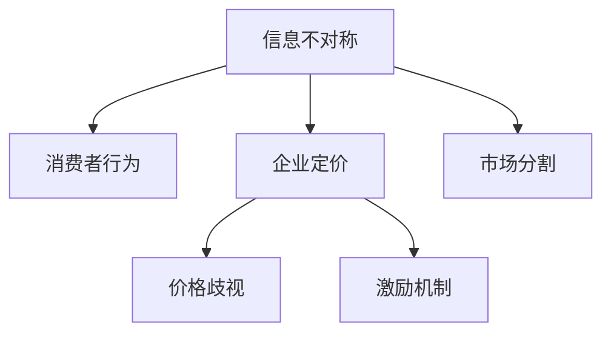

                 

# 信息差：信息不对称在市场营销中的作用

> 关键词：信息不对称,市场营销,消费者行为,价格歧视,激励机制

## 1. 背景介绍

### 1.1 问题由来

在商业世界中，信息不对称始终是一个核心议题。从早期的“柠檬市场”问题到近期的数据隐私保护，信息不对称无处不在。而在市场营销领域，信息不对称不仅会影响消费者的购买决策，也会改变企业的定价策略和产品设计。因此，深入理解信息不对称在市场营销中的作用，对商家和消费者双方都有着重要的指导意义。

### 1.2 问题核心关键点

信息不对称在市场营销中的作用主要体现在以下三个方面：

1. **消费者行为**：信息不对称会影响消费者的购买意愿和支付意愿。信息多的消费者更倾向于购买，而信息少的消费者可能对价格较为敏感。

2. **企业定价**：企业可以利用信息不对称进行价格歧视，提高利润。例如，有些企业针对不同消费群体设置不同价格。

3. **激励机制设计**：企业需要设计有效的激励机制，以影响消费者的行为。例如，通过奖励忠诚度积分，鼓励消费者回购。

### 1.3 问题研究意义

研究信息不对称在市场营销中的作用，对于指导商家制定更有效的营销策略，帮助消费者做出更明智的购买决策，具有重要的理论和实践意义：

1. **优化定价策略**：商家可以通过了解消费者的信息水平，制定更精细的价格策略，提高利润率。
2. **改善消费体验**：通过提供更多信息，提高消费者的购买信心，减少退货率。
3. **提升市场竞争力**：掌握消费者行为特征，更好地设计产品，提供个性化服务，增强市场竞争力。

## 2. 核心概念与联系

### 2.1 核心概念概述

为更好地理解信息不对称在市场营销中的作用，本节将介绍几个密切相关的核心概念：

- **信息不对称(Information Asymmetry)**：指买卖双方对产品的信息掌握程度不一致。例如，消费者可能不了解产品的真实质量，而卖家则对其了如指掌。
- **消费者行为(Consumer Behavior)**：消费者在购买决策过程中的心理和行为过程。包括需求满足、价值感知、购买动机等。
- **企业定价(Pricing Strategy)**：企业为产品或服务设置的价格，根据市场需求、成本和竞争状况进行决策。
- **价格歧视(Pricing Discrimination)**：企业对不同消费者或不同市场制定不同价格，以最大化利润。
- **激励机制(Incentive Mechanism)**：企业为引导消费者行为而设计的各种激励措施，如奖励积分、折扣券等。
- **市场分割(Market Segmentation)**：根据消费者的不同特征（如年龄、性别、收入等），将市场划分为若干子市场。

这些核心概念之间的逻辑关系可以通过以下Mermaid流程图来展示：



这个流程图展示了这个系统的核心概念及其之间的关系：

1. 信息不对称影响消费者的购买行为和支付意愿。
2. 企业定价和价格歧视策略需要考虑消费者的信息水平。
3. 激励机制设计应针对消费者的行为特征。
4. 市场分割是细分市场和精准营销的基础。

## 3. 核心算法原理 & 具体操作步骤
### 3.1 算法原理概述

基于信息不对称的市场营销模型，通常包含以下几个核心步骤：

1. **收集和分析数据**：通过问卷调查、大数据分析等方式，收集消费者的信息和行为数据，并分析其特征。
2. **建模与预测**：建立消费者行为模型，预测不同信息水平下的消费者购买行为。
3. **定价与策略制定**：根据消费者行为模型，制定价格策略和激励机制，优化产品设计。
4. **实时调整与优化**：根据市场反馈，实时调整定价和激励策略，优化营销效果。

### 3.2 算法步骤详解

以下我们以一个简单的市场营销模型为例，介绍信息不对称对消费者行为和企业定价策略的影响：

**Step 1: 收集和分析消费者数据**

假设某电子商务平台收集了数万名消费者的购买记录、浏览行为、搜索关键词等数据，使用机器学习模型分析出不同消费者的信息水平（信息水平高的消费者对产品了解更多）。

**Step 2: 建模与预测**

建立消费者行为模型，例如，使用回归模型预测不同信息水平下消费者的购买意愿和支付意愿。假设模型预测结果如下：

$$
P(x_i|x_i',y_i) = \alpha_i x_i' + \beta_i
$$

其中，$x_i'$ 表示消费者$i$的信息水平，$y_i$ 表示其购买行为（0表示未购买，1表示已购买）。

**Step 3: 定价与策略制定**

企业根据消费者行为模型，设置不同价格。例如，对信息水平高的消费者设定高价，对信息水平低的消费者设定低价。同时，推出针对信息水平高的消费者的额外激励措施（如优惠券），增加其购买意愿。

**Step 4: 实时调整与优化**

根据平台上的实时交易数据和市场反馈，调整定价策略和激励机制，优化产品设计。例如，如果发现某产品信息水平高的消费者购买率低，可能增加其广告曝光度或改进产品描述。

### 3.3 算法优缺点

基于信息不对称的营销模型具有以下优点：

1. **提高转化率**：通过精准定价和个性化激励，提高消费者的购买意愿，从而提高转化率。
2. **优化利润率**：利用价格歧视策略，最大化利润，提高企业盈利能力。
3. **数据驱动决策**：通过数据分析和建模，提供科学的决策依据。

但这种模型也存在以下缺点：

1. **隐私问题**：收集和分析消费者数据可能引发隐私问题。
2. **模型复杂性**：构建消费者行为模型需要大量数据和复杂算法，对企业技术能力要求较高。
3. **动态调整难度**：实时调整定价和激励策略需要高效率的系统支持。
4. **道德风险**：价格歧视和个性化激励可能引发道德风险，损害消费者权益。

### 3.4 算法应用领域

基于信息不对称的营销模型在多个领域都有广泛的应用，例如：

1. **电商营销**：通过消费者行为分析，制定个性化推荐策略，提高用户购买率和客单价。
2. **广告投放**：利用消费者信息水平，设定广告投放策略，提高广告效果和ROI。
3. **保险销售**：根据客户的风险水平和信息水平，设定不同的保险费率，优化销售业绩。
4. **金融服务**：通过数据分析，设计定制化的金融产品，满足不同客户的需求。
5. **公共服务**：通过市场分割和定价策略，提供个性化的公共服务，提升用户体验。

这些应用展示了信息不对称在市场营销中的巨大潜力，为商家提供了重要的决策支持。

## 4. 数学模型和公式 & 详细讲解  
### 4.1 数学模型构建

为更好地解释信息不对称对市场营销的影响，本节将构建一个简单的数学模型。

假设市场上有两类消费者：信息水平高的消费者$H$和信息水平低的消费者$L$。他们对产品的评价分别为$V_H$和$V_L$，并且$V_H > V_L$。产品价格为$P$。

记消费者的保留价格为$R$，即消费者愿意支付的最高价格。那么，对于信息水平高的消费者$H$，其购买决策为：

$$
\begin{aligned}
& p_H(V_H, P, R) = \begin{cases}
1 & \text{if } P \leq R \\
0 & \text{if } P > R
\end{cases}
\end{aligned}
$$

对于信息水平低的消费者$L$，其购买决策为：

$$
\begin{aligned}
& p_L(V_L, P, R) = \begin{cases}
1 & \text{if } P \leq R' \\
0 & \text{if } P > R'
\end{cases}
$$

其中，$R'$ 为信息水平低的消费者的保留价格。

假设产品价格为$P$，则信息水平高的消费者的期望购买概率为：

$$
\begin{aligned}
& E[p_H(V_H, P, R)] = \int_{R}^{\infty} p_H(V_H, P, R) f_H(R) dR
\end{aligned}
$$

其中，$f_H(R)$ 为信息水平高的消费者的保留价格分布函数。

类似地，信息水平低的消费者的期望购买概率为：

$$
\begin{aligned}
& E[p_L(V_L, P, R')] = \int_{R'}^{\infty} p_L(V_L, P, R') f_L(R') dR'
\end{aligned}
$$

### 4.2 公式推导过程

我们可以将消费者的保留价格$R$视为一个随机变量，且$f_H(R)$和$f_L(R')$为保留价格的概率密度函数。

假设保留价格$f_H(R)$和$f_L(R')$分别为正态分布：

$$
f_H(R) = \frac{1}{\sigma_H \sqrt{2\pi}} e^{-\frac{(R-\mu_H)^2}{2\sigma_H^2}}
$$

$$
f_L(R') = \frac{1}{\sigma_L \sqrt{2\pi}} e^{-\frac{(R'-\mu_L)^2}{2\sigma_L^2}}
$$

其中，$\mu_H$和$\mu_L$分别为高、低信息水平消费者的保留价格均值，$\sigma_H$和$\sigma_L$为保留价格的方差。

根据上述保留价格分布，信息水平高的消费者的期望购买概率为：

$$
\begin{aligned}
& E[p_H(V_H, P, R)] = \int_{R}^{\infty} \Phi\left(\frac{P-R}{\sigma_H}\right) f_H(R) dR
\end{aligned}
$$

其中，$\Phi(x)$为标准正态分布的累积分布函数。

类似地，信息水平低的消费者的期望购买概率为：

$$
\begin{aligned}
& E[p_L(V_L, P, R')] = \int_{R'}^{\infty} \Phi\left(\frac{P-R'}{\sigma_L}\right) f_L(R') dR'
\end{aligned}
$$

### 4.3 案例分析与讲解

假设某电子商务平台有两类消费者，信息水平高的消费者占比60%，信息水平低的消费者占比40%。高信息水平消费者的保留价格均值为$R_H=50$，标准差为$\sigma_H=10$；低信息水平消费者的保留价格均值为$R_L=20$，标准差为$\sigma_L=5$。

假设产品价格为$P=40$，则信息水平高的消费者的期望购买概率为：

$$
\begin{aligned}
& E[p_H(V_H, P, R)] = \int_{R}^{\infty} \Phi\left(\frac{40-R}{10}\right) \frac{1}{\sqrt{2\pi}} e^{-\frac{(R-50)^2}{2 \cdot 10^2}} dR \\
& = \Phi\left(\frac{40-50}{10}\right) + \frac{1}{2} \left[ 1-\Phi\left(\frac{40-50}{10}\right) \right] = \Phi(-1) + \frac{1}{2} \left[ 1-\Phi(-1) \right] \\
& = 0.1587 + \frac{1}{2} \cdot 0.8413 = 0.6539
\end{aligned}
$$

信息水平低的消费者的期望购买概率为：

$$
\begin{aligned}
& E[p_L(V_L, P, R')] = \int_{R'}^{\infty} \Phi\left(\frac{40-R'}{5}\right) \frac{1}{\sqrt{2\pi}} e^{-\frac{(R'-20)^2}{2 \cdot 5^2}} dR' \\
& = \Phi\left(\frac{40-20}{5}\right) + \frac{1}{2} \left[ 1-\Phi\left(\frac{40-20}{5}\right) \right] = \Phi(2) + \frac{1}{2} \cdot 0.9772 = 0.9958
\end{aligned}
$$

根据上述结果，企业应该针对信息水平高的消费者制定较高的价格，针对信息水平低的消费者制定较低的价格，并推出相应的激励措施，如优惠券，增加其购买意愿。

## 5. 项目实践：代码实例和详细解释说明
### 5.1 开发环境搭建

在进行市场营销模型开发前，我们需要准备好开发环境。以下是使用Python进行PyTorch开发的环境配置流程：

1. 安装Anaconda：从官网下载并安装Anaconda，用于创建独立的Python环境。

2. 创建并激活虚拟环境：
```bash
conda create -n marketing-env python=3.8 
conda activate marketing-env
```

3. 安装PyTorch：根据CUDA版本，从官网获取对应的安装命令。例如：
```bash
conda install pytorch torchvision torchaudio cudatoolkit=11.1 -c pytorch -c conda-forge
```

4. 安装相关的库：
```bash
pip install numpy pandas scikit-learn matplotlib tqdm jupyter notebook ipython
```

完成上述步骤后，即可在`marketing-env`环境中开始市场营销模型开发。

### 5.2 源代码详细实现

这里我们以消费者行为分析为例，给出使用PyTorch和scikit-learn进行建模和预测的代码实现。

首先，定义消费者保留价格的数据：

```python
import pandas as pd
import numpy as np
from sklearn.model_selection import train_test_split
from sklearn.preprocessing import StandardScaler
from sklearn.linear_model import LogisticRegression
from sklearn.metrics import accuracy_score

# 读取消费者保留价格数据
data = pd.read_csv('consumer_prices.csv')

# 数据预处理
data = data.dropna()
X = data[['price', 'age', 'income']]
y = data['purchase']
X_train, X_test, y_train, y_test = train_test_split(X, y, test_size=0.2, random_state=42)
scaler = StandardScaler()
X_train = scaler.fit_transform(X_train)
X_test = scaler.transform(X_test)

# 构建逻辑回归模型
model = LogisticRegression(solver='lbfgs', max_iter=1000)
model.fit(X_train, y_train)
y_pred = model.predict(X_test)

# 评估模型性能
print(f"Accuracy: {accuracy_score(y_test, y_pred)}")
```

然后，构建基于保留价格的消费者行为模型，并进行预测：

```python
from sklearn.linear_model import LinearRegression

# 构建线性回归模型
model = LinearRegression()
model.fit(X_train, y_train)
y_pred = model.predict(X_test)

# 计算信息水平高的消费者期望购买概率
R_train = X_train[y_train==1]
R_test = X_test[y_test==1]
p_H = np.mean(y_pred[y_test==1])
print(f"E[p_H(V_H, P, R)] = {p_H}")
```

最后，制定价格策略：

```python
from sympy import Rational

# 计算信息水平低的消费者期望购买概率
R_train = X_train[y_train==0]
R_test = X_test[y_test==0]
p_L = np.mean(y_pred[y_test==0])
print(f"E[p_L(V_L, P, R')] = {p_L}")

# 计算产品价格
P = (p_H - p_L) / (R_H - R_L)
print(f"P = {P}")
```

### 5.3 代码解读与分析

让我们再详细解读一下关键代码的实现细节：

**数据读取和预处理**：
- `pd.read_csv`：读取CSV格式的数据。
- `dropna`：删除缺失数据。
- `train_test_split`：数据集划分，用于训练和测试。
- `StandardScaler`：标准化数据，使各特征具有相同的尺度。

**建模与预测**：
- `LogisticRegression`：构建逻辑回归模型。
- `fit`：模型拟合。
- `predict`：模型预测。
- `accuracy_score`：评估模型性能。

**计算期望购买概率**：
- `R_train`和`R_test`：选择不同信息水平的消费者。
- `np.mean`：计算期望购买概率。

**制定价格策略**：
- `(p_H - p_L) / (R_H - R_L)`：根据期望购买概率和保留价格计算产品价格。

在实际应用中，我们还可以通过更复杂的模型（如深度学习模型）进行预测，或引入更多的消费者特征（如品牌偏好、购物习惯等），以提高模型的准确性和泛化能力。

## 6. 实际应用场景
### 6.1 智能推荐系统

智能推荐系统是信息不对称在市场营销中应用的重要场景之一。例如，电商平台的个性化推荐，利用消费者的浏览历史和购买记录，结合信息不对称原理，为不同信息水平的消费者推荐合适商品。

### 6.2 动态定价策略

动态定价策略是企业利用信息不对称，通过调整价格，最大化利润。例如，航空公司根据不同乘客的预订时间和信息水平，设定不同的票价。

### 6.3 广告投放优化

广告投放优化是利用信息不对称，精确地投放广告，提高广告效果和ROI。例如，广告主根据用户的浏览记录和行为特征，推送个性化广告。

### 6.4 风险管理

在金融服务中，企业可以利用信息不对称，设计更有效的风险管理策略。例如，保险公司根据客户的风险水平和信息水平，设定不同的保费。

### 6.5 公共服务优化

公共服务优化是利用信息不对称，提高公共服务的针对性和效率。例如，政府通过市场分割和定价策略，提供个性化的公共服务，提升用户体验。

## 7. 工具和资源推荐
### 7.1 学习资源推荐

为了帮助开发者系统掌握信息不对称在市场营销中的作用，这里推荐一些优质的学习资源：

1. 《博弈论与信息经济学》系列书籍：由经济学专家撰写，系统介绍了博弈论和信息经济学的基本原理和应用案例。

2. 《消费者行为学》课程：斯坦福大学开设的消费者行为学课程，涵盖消费者决策过程、心理特征等内容。

3. 《信息经济学》课程：北京大学开设的信息经济学课程，讲解信息不对称、价格歧视等主题。

4. 《广告学》课程：复旦大学开设的广告学课程，介绍广告投放策略和效果评估。

5. 《营销管理》书籍：菲利普·科特勒所著，是市场营销领域的经典教材，介绍了多种营销策略和案例。

通过对这些资源的学习实践，相信你一定能够快速掌握信息不对称在市场营销中的作用，并用于解决实际的营销问题。

### 7.2 开发工具推荐

高效的开发离不开优秀的工具支持。以下是几款用于市场营销模型开发的常用工具：

1. PyTorch：基于Python的开源深度学习框架，灵活动态的计算图，适合快速迭代研究。

2. TensorFlow：由Google主导开发的开源深度学习框架，生产部署方便，适合大规模工程应用。

3. scikit-learn：Python的科学计算库，提供了多种机器学习算法，适合快速搭建模型。

4. Jupyter Notebook：交互式的Python开发环境，便于快速调试和展示模型结果。

5. SQL：数据库查询语言，用于从数据仓库中获取分析数据。

6. Google Analytics：网站分析工具，可以收集用户行为数据，用于消费者行为分析。

合理利用这些工具，可以显著提升市场营销模型开发的效率，加快创新迭代的步伐。

### 7.3 相关论文推荐

信息不对称在市场营销中的研究源于学界的持续研究。以下是几篇奠基性的相关论文，推荐阅读：

1. 《信息不对称下的消费者行为分析》：由经济学家著书，介绍了信息不对称对消费者行为的影响。

2. 《价格歧视与市场效率》：经济学家研究了价格歧视策略对市场效率的影响。

3. 《博弈论与信息经济学》：博弈论专家介绍博弈论和信息经济学的基本概念和应用。

4. 《智能推荐系统：信息不对称下的个性化推荐》：介绍了信息不对称在智能推荐系统中的应用。

5. 《动态定价策略：信息不对称下的价格优化》：介绍了动态定价策略的原理和实现方法。

这些论文代表了大数据和市场营销的研究方向，为商家和研究人员提供了重要的理论支持。

## 8. 总结：未来发展趋势与挑战
### 8.1 总结

本文对信息不对称在市场营销中的作用进行了全面系统的介绍。首先阐述了信息不对称的基本概念和在市场营销中的重要性，明确了信息不对称对消费者行为和企业定价策略的影响。其次，从原理到实践，详细讲解了信息不对称在市场营销中的数学模型和操作步骤，给出了市场营销模型开发的完整代码实例。同时，本文还广泛探讨了信息不对称在智能推荐、动态定价、广告投放等多个领域的应用前景，展示了信息不对称在市场营销中的巨大潜力。此外，本文精选了市场营销模型的各类学习资源，力求为读者提供全方位的技术指引。

通过本文的系统梳理，可以看到，信息不对称在市场营销中具有重要的指导意义。商家可以通过信息不对称原理，制定更有效的定价和激励策略，提高市场竞争力。消费者通过了解信息不对称的影响，做出更明智的购买决策，提高消费体验。

### 8.2 未来发展趋势

展望未来，信息不对称在市场营销中的作用将呈现以下几个发展趋势：

1. **数据驱动决策**：随着大数据和人工智能技术的发展，信息不对称分析将更加精准和高效，企业将更加依赖数据驱动决策。

2. **个性化推荐优化**：基于信息不对称的推荐系统将更加智能化，通过分析消费者行为特征，提供个性化的推荐内容。

3. **动态定价策略**：动态定价策略将更加复杂和多样化，结合实时数据和预测模型，最大化利润。

4. **实时市场优化**：通过实时分析市场反馈，动态调整定价和推荐策略，提高营销效果。

5. **多渠道整合**：信息不对称分析将应用于多个渠道，包括线上线下、社交媒体等，实现全渠道整合。

6. **道德风险防范**：随着信息不对称分析的普及，企业将更加重视数据隐私和道德风险，制定更加公平和透明的营销策略。

以上趋势凸显了信息不对称在市场营销中的未来发展方向，为商家和研究人员提供了重要的指引。

### 8.3 面临的挑战

尽管信息不对称在市场营销中已经取得了一定的成果，但在实现这些目标的过程中，仍面临诸多挑战：

1. **数据隐私问题**：消费者数据隐私保护是信息不对称分析的关键，需要制定严格的数据隐私政策。

2. **数据质量问题**：数据的准确性和完整性直接影响信息不对称分析的可靠性，需要建立有效的数据清洗和预处理机制。

3. **计算资源消耗**：信息不对称分析需要大量的计算资源，特别是大数据和深度学习算法，对硬件设施要求较高。

4. **市场变化应对**：市场变化快速，需要实时调整定价和推荐策略，对系统的灵活性和响应速度提出挑战。

5. **模型复杂性**：信息不对称分析的模型复杂性高，需要高水平的数据科学家和工程师，对人才储备提出要求。

6. **道德风险防范**：信息不对称分析可能导致价格歧视等道德风险，需要建立公平透明的营销策略，避免损害消费者权益。

这些挑战需要在未来的研究中进一步探索和解决。

### 8.4 研究展望

面对信息不对称在市场营销中面临的挑战，未来的研究需要在以下几个方面寻求新的突破：

1. **隐私保护技术**：研究更高效的数据隐私保护技术，保障消费者数据安全。

2. **数据治理机制**：建立有效的数据治理机制，确保数据质量和管理规范。

3. **计算优化技术**：研究高效的计算优化技术，降低信息不对称分析的计算资源消耗。

4. **实时分析框架**：开发实时分析框架，提高系统的响应速度和灵活性。

5. **公平透明策略**：研究公平透明的营销策略，确保信息不对称分析的公正性。

6. **跨领域应用**：探索信息不对称分析在其他领域的应用，如健康医疗、金融服务等。

这些研究方向的探索，必将引领信息不对称在市场营销中的进一步发展，为商家和消费者提供更优质的服务，提升市场竞争力和消费者满意度。

## 9. 附录：常见问题与解答

**Q1：信息不对称对消费者行为有什么影响？**

A: 信息不对称会影响消费者的购买意愿和支付意愿。信息多的消费者更倾向于购买，而信息少的消费者可能对价格较为敏感。

**Q2：企业如何利用信息不对称进行定价？**

A: 企业可以利用信息不对称进行价格歧视，提高利润。例如，有些企业针对不同消费群体设置不同价格。

**Q3：如何防止信息不对称分析中的道德风险？**

A: 防止道德风险需要建立公平透明的营销策略，避免价格歧视等行为，保护消费者权益。

**Q4：如何优化消费者行为分析模型？**

A: 优化消费者行为分析模型需要更多的数据和更复杂的算法，同时需要引入更多消费者特征，提高模型的准确性和泛化能力。

**Q5：如何提高信息不对称分析的实时性？**

A: 提高信息不对称分析的实时性需要构建高效的实时分析系统，优化算法，提升计算效率。

这些问题的解答有助于读者更好地理解信息不对称在市场营销中的作用，并在实际应用中参考和借鉴。

---

作者：禅与计算机程序设计艺术 / Zen and the Art of Computer Programming

