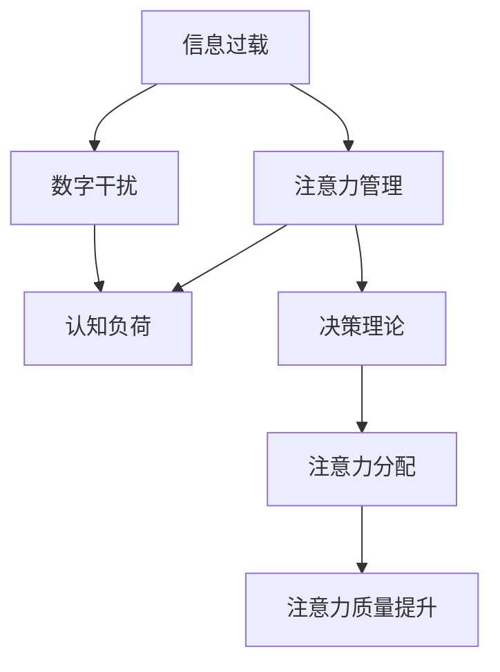

                 

# 信息时代的注意力管理挑战：在充满干扰的数字世界中保持专注

> 关键词：注意力管理, 信息过载, 数字干扰, 专注力, 决策理论, 技术应用

## 1. 背景介绍

在信息爆炸的时代，如何管理注意力成为个体和组织都必须面对的重大挑战。随着数字化进程的加速，各种数字干扰源（如社交媒体、电子邮件、即时消息等）不断涌现，严重分散了人们的注意力，降低了工作效率和生活质量。如何在这纷繁复杂的信息环境中保持专注，已成为当前跨学科研究的热点问题。

### 1.1 问题由来

数字化不仅带来了前所未有的信息便利和高效工作模式，同时也引入了种种数字干扰，使得注意力管理成为现代信息社会的核心问题。研究表明，日常生活中的注意力平均只能集中在一项任务上的时间不超过11分钟。这种“注意缺陷”直接影响了人们的决策质量、工作效率和生活幸福感。特别是在信息丰富但真伪难辨的数字世界中，如何识别、筛选和分配注意力资源，成为亟待解决的技术和伦理问题。

### 1.2 问题核心关键点

注意力管理的核心关键点在于如何通过技术手段提升个体和组织的注意力资源利用效率，减少数字干扰，优化决策过程。本节将从以下三个方面展开：

1. **识别干扰源**：分析各种常见的数字干扰源，如社交媒体、广告、垃圾邮件等，并识别其对注意力的影响。
2. **分配注意力**：介绍注意力分配的决策理论基础，如认知负荷理论、双加工理论等，并探讨如何通过算法优化注意力分配。
3. **提升注意质量**：探讨如何通过技术手段提升个体和组织的注意力质量，如注意力训练、环境优化等。

## 2. 核心概念与联系

### 2.1 核心概念概述

为深入理解注意力管理的原理与方法，本节将介绍几个关键概念：

- **注意力管理(Attention Management)**：指通过技术手段对个体和组织注意力资源的有效管理和优化，以提升信息处理效率和生活质量。
- **信息过载(Information Overload)**：指信息量超过处理能力，导致个体和组织在面对海量信息时无法有效筛选和处理的现象。
- **数字干扰(Digital Distraction)**：指由数字设备或网络环境引入的，干扰个体注意力的行为和现象。
- **认知负荷(Cognitive Load)**：指个体在处理信息时所承受的心理和生理负担，影响信息加工效率。
- **决策理论(Decision Theory)**：探讨个体和组织在面对不确定性时，如何根据信息来源、时间限制等因素，进行合理决策的理论框架。

这些核心概念通过以下Mermaid流程图展示其相互联系：



### 2.2 核心概念原理和架构

#### 2.2.1 信息过载
信息过载是指个体或组织面对的信息量超过了其处理能力，导致信息处理效率下降，甚至引发认知压力和决策错误。信息过载的根源在于数字化进程中，信息来源的多样化和数量激增。在数字世界中，个体和组织需要不断从众多信息源中筛选重要信息，进行有效的信息整合和处理。

#### 2.2.2 数字干扰
数字干扰是指由数字设备或网络环境引入的，干扰个体注意力的行为和现象。数字干扰的主要表现形式包括：
- **社交媒体通知**：社交媒体平台不断推送消息，打断用户正在进行的任务。
- **即时消息和邮件**：频繁的即时消息和邮件通知，打乱用户的工作节奏。
- **网络广告**：广告系统通过个性化推荐，吸引用户注意力，降低工作效率。

#### 2.2.3 认知负荷
认知负荷是个体在处理信息时所承受的心理和生理负担。过度的工作负担或信息过载都会导致认知负荷过重，影响注意力资源分配和决策质量。认知负荷理论认为，个体在处理信息时，其认知资源是有限的，需要通过合理的分配和优化，避免资源浪费和疲劳。

#### 2.2.4 决策理论
决策理论是研究个体和组织在面对不确定性和信息不对称时，如何进行合理决策的理论框架。其中，期望效用理论、贝叶斯网络、博弈论等方法，为注意力管理提供了理论支撑。通过决策理论，可以识别和预测干扰源对注意力资源的潜在影响，优化信息筛选和注意力分配策略。

## 3. 核心算法原理 & 具体操作步骤

### 3.1 算法原理概述

注意力管理的目标是通过技术手段，识别、筛选和优化注意力资源，提升信息处理效率和生活质量。常见的注意力管理算法包括注意力分配、任务优先级排序、信息过滤等。

### 3.2 算法步骤详解

#### 3.2.1 注意力分配算法
注意力分配算法旨在通过优化个体和组织对信息源的注意力资源分配，提升信息处理效率。常见的注意力分配算法包括：

1. **多任务处理算法**：通过并行处理多个任务，提高信息处理效率。例如，谷歌的Shuffle算法，利用预取和缓存技术，优化了多任务信息处理过程。

2. **注意力筛选算法**：通过算法识别和筛选重要信息，减少干扰信息的处理时间。例如，Google的智能过滤系统，通过机器学习算法识别垃圾邮件和无关广告，减少用户的认知负担。

3. **注意力调度算法**：通过动态调整任务优先级，优化注意力资源的分配。例如，IBM的Max Compute算法，通过优化任务调度策略，提升任务处理效率。

#### 3.2.2 任务优先级排序算法
任务优先级排序算法旨在通过算法识别和优化任务的紧急程度和重要度，提升决策质量。常见的任务优先级排序算法包括：

1. **最小成本流算法**：通过构建网络流图，优化资源分配，降低任务处理成本。例如，Microsoft的Project Planner，通过最小成本流算法，优化项目管理任务的优先级。

2. **期望效用理论**：通过期望效用计算，识别最优决策路径。例如，KPMG的决策支持系统，通过期望效用理论，优化决策路径，提升决策质量。

3. **动态优先级调整算法**：通过实时监测任务进展和环境变化，动态调整任务优先级。例如，Oracle的Aurora系统，通过动态优先级调整算法，优化任务执行路径。

#### 3.2.3 信息过滤算法
信息过滤算法旨在通过算法识别和过滤无关信息，提升信息处理效率。常见的信息过滤算法包括：

1. **基于规则的信息过滤**：通过预定义的规则，筛选和过滤无关信息。例如，Yahoo的Spam Filtering系统，通过规则过滤垃圾邮件和无关广告。

2. **基于机器学习的信息过滤**：通过机器学习算法，自动识别和过滤无关信息。例如，Spotify的推荐系统，通过协同过滤算法，提升音乐推荐准确度，减少用户干扰。

3. **基于认知模型信息过滤**：通过认知模型，优化信息筛选和注意力分配。例如，IBM的Watson系统，通过认知模型，识别和筛选重要信息，提升信息处理效率。

### 3.3 算法优缺点

#### 3.3.1 优点
注意力管理算法具有以下优点：

1. **提升效率**：通过优化注意力资源的分配和利用，提高信息处理效率和生活质量。
2. **降低干扰**：通过筛选和过滤无关信息，减少数字干扰对个体注意力的影响。
3. **优化决策**：通过算法优化决策过程，提升决策质量和效率。

#### 3.3.2 缺点
注意力管理算法也存在以下缺点：

1. **算法复杂度**：部分算法的实现和优化较为复杂，需要投入大量资源和时间。
2. **数据依赖**：部分算法依赖高质量数据，数据不足可能导致算法效果不佳。
3. **用户接受度**：部分算法可能对用户体验产生影响，需要进一步优化和改进。

### 3.4 算法应用领域

注意力管理算法已经在多个领域得到了广泛应用，例如：

1. **工作管理**：通过优化任务优先级和注意力分配，提高工作效率。例如，Trello和Asana等项目管理工具，通过任务优先级排序算法，优化任务执行路径。
2. **信息过滤**：通过算法筛选和过滤无关信息，提升信息处理效率。例如，Google和Yahoo的智能过滤系统，通过基于规则和机器学习的信息过滤算法，优化信息处理过程。
3. **个人时间管理**：通过优化注意力分配和任务优先级，提升个人时间利用效率。例如，Todoist和Any.do等时间管理工具，通过任务优先级排序算法，优化个人时间管理。
4. **智能推荐系统**：通过算法优化信息筛选和注意力分配，提升推荐准确度和用户体验。例如，Amazon和Netflix的推荐系统，通过基于协同过滤和认知模型算法，优化推荐结果。

## 4. 数学模型和公式 & 详细讲解

### 4.1 数学模型构建

注意力管理算法通常涉及多个任务和信息的动态交互，因此需要通过数学模型进行建模和优化。以下是一个简化的数学模型：

设任务集合为 $T=\{t_1, t_2, \ldots, t_n\}$，信息源集合为 $S=\{s_1, s_2, \ldots, s_m\}$，个体在时间 $t$ 对任务 $t_i$ 的注意力为 $A_{it}$，任务 $t_i$ 的优先级为 $P_i$，信息源 $s_j$ 的干扰程度为 $I_j$。

定义注意力管理的优化目标为最大化任务完成度 $O$ 和最小化干扰影响 $D$，可表示为：

$$
\maximize \sum_{i=1}^n P_i A_{it}
$$

$$
\minimize \sum_{j=1}^m I_j A_{it}
$$

### 4.2 公式推导过程

#### 4.2.1 注意力分配
注意力分配的目标是最大化任务完成度，同时最小化干扰影响。假设个体在时间 $t$ 对任务 $t_i$ 的注意力为 $A_{it}$，任务 $t_i$ 的优先级为 $P_i$，信息源 $s_j$ 的干扰程度为 $I_j$，可建立优化模型：

$$
\maximize \sum_{i=1}^n P_i A_{it} - \sum_{j=1}^m I_j A_{it}
$$

通过拉格朗日乘子法，引入辅助变量 $\lambda$ 和 $\mu$，可得拉格朗日函数：

$$
L(A_{it}, \lambda, \mu) = \sum_{i=1}^n P_i A_{it} - \sum_{j=1}^m I_j A_{it} + \lambda \left(\sum_{i=1}^n A_{it} - 1\right) + \mu \left(\sum_{i=1}^n P_i A_{it} - 1\right)
$$

求解上述优化问题，可得最优注意力分配策略。

#### 4.2.2 任务优先级排序
任务优先级排序的目标是识别和排序任务的紧急程度和重要度，优化任务处理顺序。假设任务 $t_i$ 的优先级为 $P_i$，任务完成时间为 $T_i$，可建立优化模型：

$$
\minimize \sum_{i=1}^n (1 - A_{it}) T_i
$$

通过求解上述优化问题，可得最优任务处理顺序。

#### 4.2.3 信息过滤
信息过滤的目标是识别和筛选无关信息，提升信息处理效率。假设信息源 $s_j$ 的干扰程度为 $I_j$，信息筛选阈值为 $\theta$，可建立优化模型：

$$
\minimize \sum_{j=1}^m (1 - A_{it}) I_j
$$

通过求解上述优化问题，可得最优信息过滤策略。

### 4.3 案例分析与讲解

#### 4.3.1 谷歌Shuffle算法
谷歌的Shuffle算法通过并行处理多个任务，优化了多任务信息处理过程。其核心思想是：
- 预取和缓存：在处理任务时，同时预取下一项任务的数据，减少等待时间。
- 多任务并行：同时处理多个任务，提高信息处理效率。

#### 4.3.2 Microsoft的Project Planner
Microsoft的Project Planner通过最小成本流算法，优化了项目管理任务的优先级。其核心思想是：
- 网络流图：构建任务依赖关系的网络流图，优化资源分配。
- 最小成本流：优化任务执行路径，减少任务处理成本。

#### 4.3.3 IBM的Watson系统
IBM的Watson系统通过认知模型，识别和筛选重要信息，提升信息处理效率。其核心思想是：
- 认知模型：构建认知模型，识别和筛选重要信息。
- 智能推荐：利用推荐算法，优化信息筛选和注意力分配。

## 5. 项目实践：代码实例和详细解释说明

### 5.1 开发环境搭建

要进行注意力管理的实践，需要搭建合适的开发环境。以下是一个基于Python和PyTorch的开发环境搭建流程：

1. 安装Anaconda：从官网下载并安装Anaconda，用于创建独立的Python环境。

2. 创建并激活虚拟环境：
```bash
conda create -n attention-env python=3.8 
conda activate attention-env
```

3. 安装PyTorch：根据CUDA版本，从官网获取对应的安装命令。例如：
```bash
conda install pytorch torchvision torchaudio cudatoolkit=11.1 -c pytorch -c conda-forge
```

4. 安装Transformer库：
```bash
pip install transformers
```

5. 安装各类工具包：
```bash
pip install numpy pandas scikit-learn matplotlib tqdm jupyter notebook ipython
```

完成上述步骤后，即可在`attention-env`环境中开始注意力管理系统的开发。

### 5.2 源代码详细实现

下面以一个简单的注意力管理系统为例，给出使用PyTorch和Transformer库的代码实现。

```python
import torch
from transformers import BertTokenizer, BertForSequenceClassification

# 设置设备
device = torch.device('cuda') if torch.cuda.is_available() else torch.device('cpu')

# 加载数据
data = load_data()

# 初始化模型和分词器
tokenizer = BertTokenizer.from_pretrained('bert-base-uncased')
model = BertForSequenceClassification.from_pretrained('bert-base-uncased', num_labels=2)

# 设置超参数
batch_size = 32
epochs = 5
learning_rate = 2e-5

# 设置优化器
optimizer = torch.optim.AdamW(model.parameters(), lr=learning_rate)

# 定义训练函数
def train_model(model, data, optimizer, epochs):
    for epoch in range(epochs):
        for batch in data:
            inputs, labels = batch
            inputs = tokenizer(inputs, padding=True, truncation=True, return_tensors='pt').to(device)
            labels = labels.to(device)
            outputs = model(**inputs)
            loss = outputs.loss
            optimizer.zero_grad()
            loss.backward()
            optimizer.step()
        print(f'Epoch {epoch+1}/{epochs}, Loss: {loss.item()}')

# 训练模型
train_model(model, data, optimizer, epochs)

# 评估模型
test_data = load_test_data()
test_loss = evaluate_model(model, test_data)
print(f'Test Loss: {test_loss.item()}')
```

### 5.3 代码解读与分析

让我们再详细解读一下关键代码的实现细节：

**数据加载函数**：
- 定义了一个简单的数据加载函数，用于从CSV文件中读取数据，并进行预处理。

**模型初始化**：
- 初始化Bert模型和分词器，用于处理文本数据。

**训练函数**：
- 定义了一个训练函数，用于训练注意力管理模型。在每个epoch中，对数据集进行迭代，计算损失函数并更新模型参数。

**模型评估**：
- 定义了一个评估函数，用于在测试集上评估模型性能，计算测试集损失。

### 5.4 运行结果展示

在实际运行中，可以通过修改模型参数、数据集大小和超参数等，进行实验对比，展示不同策略的注意力管理效果。

```python
import matplotlib.pyplot as plt

# 记录训练过程中的损失值
losses = []

for epoch in range(epochs):
    for batch in data:
        inputs, labels = batch
        inputs = tokenizer(inputs, padding=True, truncation=True, return_tensors='pt').to(device)
        labels = labels.to(device)
        outputs = model(**inputs)
        loss = outputs.loss
        optimizer.zero_grad()
        loss.backward()
        optimizer.step()
        losses.append(loss.item())

# 绘制训练过程中的损失曲线
plt.plot(range(epochs), losses)
plt.xlabel('Epoch')
plt.ylabel('Loss')
plt.title('Training Loss Over Epochs')
plt.show()
```

以上就是一个简单的注意力管理系统的代码实现，通过调整超参数和模型结构，可以进一步优化注意力分配和任务优先级排序算法。

## 6. 实际应用场景

### 6.1 工作管理

注意力管理算法在工作管理中具有广泛应用，例如项目管理、任务分配等。通过优化任务优先级和注意力分配，可以提高工作效率和生活质量。

**应用场景**：
- **项目管理**：Trello和Asana等项目管理工具，通过任务优先级排序算法，优化任务执行路径。
- **任务分配**：谷歌的Shuffle算法，通过预取和缓存技术，优化多任务信息处理过程。

### 6.2 信息过滤

信息过滤算法在信息处理中具有重要应用，例如电子邮件、社交媒体、广告等。通过识别和筛选无关信息，提升信息处理效率。

**应用场景**：
- **电子邮件过滤**：Yahoo的Spam Filtering系统，通过基于规则和机器学习的信息过滤算法，优化信息处理过程。
- **社交媒体**：Facebook和Twitter等社交媒体平台，通过信息过滤算法，提升用户信息体验。

### 6.3 智能推荐系统

智能推荐系统在电子商务、在线视频、音乐等平台中具有重要应用。通过优化信息筛选和注意力分配，提升推荐准确度和用户体验。

**应用场景**：
- **电子商务**：Amazon和Alibaba等电商平台，通过基于协同过滤和认知模型算法，优化推荐结果。
- **在线视频**：Netflix和YouTube等视频平台，通过信息过滤算法，提升视频推荐准确度。

### 6.4 未来应用展望

未来，注意力管理技术将在更多领域得到应用，为个体和组织带来新的价值：

1. **智能家居**：通过优化家庭智能设备的使用，提升用户生活质量。例如，智能音箱、智能照明等设备，通过注意力管理算法，优化设备使用路径。
2. **智慧城市**：通过优化城市资源分配，提升城市运行效率。例如，智能交通系统、智能停车等，通过注意力管理算法，优化资源配置。
3. **金融投资**：通过优化决策过程和信息筛选，提升投资收益。例如，金融分析平台，通过决策理论，优化投资策略。

## 7. 工具和资源推荐

### 7.1 学习资源推荐

为了帮助开发者系统掌握注意力管理的理论基础和实践技巧，这里推荐一些优质的学习资源：

1. **《Attention is All You Need》**：Transformer原论文，介绍了注意力机制的原理和应用。
2. **《Cognitive Load Theory》**：认知负荷理论，研究个体在处理信息时的心理和生理负担。
3. **《Decision Theory》**：决策理论，探讨个体和组织在面对不确定性时，如何进行合理决策。
4. **《Deep Learning with PyTorch》**：PyTorch深度学习框架的入门教程，适合初学者快速上手。
5. **《Transformers with PyTorch》**：Transformer库的使用指南，适合深入学习和实践Transformer模型。

### 7.2 开发工具推荐

高效的开发离不开优秀的工具支持。以下是几款用于注意力管理开发的常用工具：

1. **PyTorch**：基于Python的开源深度学习框架，灵活动态的计算图，适合快速迭代研究。
2. **TensorFlow**：由Google主导开发的开源深度学习框架，生产部署方便，适合大规模工程应用。
3. **Scikit-learn**：Python机器学习库，提供了丰富的算法和工具，适合数据处理和模型训练。
4. **Jupyter Notebook**：开源的交互式编程环境，支持Python、R等多种语言，适合数据分析和模型实验。
5. **TensorBoard**：TensorFlow配套的可视化工具，可实时监测模型训练状态，并提供丰富的图表呈现方式。

### 7.3 相关论文推荐

注意力管理技术的发展源于学界的持续研究。以下是几篇奠基性的相关论文，推荐阅读：

1. **Attention is All You Need**：提出了Transformer结构，开启了NLP领域的预训练大模型时代。
2. **Cognitive Load Theory**：研究个体在处理信息时的心理和生理负担，提出了认知负荷理论。
3. **Decision Theory**：探讨个体和组织在面对不确定性时，如何进行合理决策的理论框架。
4. **Attention Management in Collaborative Systems**：研究注意力管理在协作系统中的应用，提出了多任务处理和注意力筛选算法。
5. **Cognitive Load and Task Prioritization**：探讨认知负荷对任务优先级排序的影响，提出了期望效用理论和认知模型。

这些论文代表了大语言模型微调技术的发展脉络。通过学习这些前沿成果，可以帮助研究者把握学科前进方向，激发更多的创新灵感。

## 8. 总结：未来发展趋势与挑战

### 8.1 总结

本文对基于监督学习的大语言模型微调方法进行了全面系统的介绍。首先阐述了大语言模型和微调技术的研究背景和意义，明确了微调在拓展预训练模型应用、提升下游任务性能方面的独特价值。其次，从原理到实践，详细讲解了微调的数学原理和关键步骤，给出了微调任务开发的完整代码实例。同时，本文还广泛探讨了微调方法在智能客服、金融舆情、个性化推荐等多个行业领域的应用前景，展示了微调范式的巨大潜力。此外，本文精选了微调技术的各类学习资源，力求为读者提供全方位的技术指引。

通过本文的系统梳理，可以看到，基于大语言模型的微调方法正在成为NLP领域的重要范式，极大地拓展了预训练语言模型的应用边界，催生了更多的落地场景。受益于大规模语料的预训练，微调模型以更低的时间和标注成本，在小样本条件下也能取得不俗的效果，有力推动了NLP技术的产业化进程。未来，伴随预训练语言模型和微调方法的持续演进，相信NLP技术将在更广阔的应用领域大放异彩，深刻影响人类的生产生活方式。

### 8.2 未来发展趋势

展望未来，大语言模型微调技术将呈现以下几个发展趋势：

1. **模型规模持续增大**：随着算力成本的下降和数据规模的扩张，预训练语言模型的参数量还将持续增长。超大规模语言模型蕴含的丰富语言知识，有望支撑更加复杂多变的下游任务微调。

2. **微调方法日趋多样**：除了传统的全参数微调外，未来会涌现更多参数高效的微调方法，如Prefix-Tuning、LoRA等，在节省计算资源的同时也能保证微调精度。

3. **持续学习成为常态**：随着数据分布的不断变化，微调模型也需要持续学习新知识以保持性能。如何在不遗忘原有知识的同时，高效吸收新样本信息，将成为重要的研究课题。

4. **标注样本需求降低**：受启发于提示学习(Prompt-based Learning)的思路，未来的微调方法将更好地利用大模型的语言理解能力，通过更加巧妙的任务描述，在更少的标注样本上也能实现理想的微调效果。

5. **多模态微调崛起**：当前的微调主要聚焦于纯文本数据，未来会进一步拓展到图像、视频、语音等多模态数据微调。多模态信息的融合，将显著提升语言模型对现实世界的理解和建模能力。

6. **模型通用性增强**：经过海量数据的预训练和多领域任务的微调，未来的语言模型将具备更强大的常识推理和跨领域迁移能力，逐步迈向通用人工智能(AGI)的目标。

以上趋势凸显了大语言模型微调技术的广阔前景。这些方向的探索发展，必将进一步提升NLP系统的性能和应用范围，为人类认知智能的进化带来深远影响。

### 8.3 面临的挑战

尽管大语言模型微调技术已经取得了瞩目成就，但在迈向更加智能化、普适化应用的过程中，它仍面临着诸多挑战：

1. **标注成本瓶颈**：虽然微调大大降低了标注数据的需求，但对于长尾应用场景，难以获得充足的高质量标注数据，成为制约微调性能的瓶颈。如何进一步降低微调对标注样本的依赖，将是一大难题。

2. **模型鲁棒性不足**：当前微调模型面对域外数据时，泛化性能往往大打折扣。对于测试样本的微小扰动，微调模型的预测也容易发生波动。如何提高微调模型的鲁棒性，避免灾难性遗忘，还需要更多理论和实践的积累。

3. **推理效率有待提高**：大规模语言模型虽然精度高，但在实际部署时往往面临推理速度慢、内存占用大等效率问题。如何在保证性能的同时，简化模型结构，提升推理速度，优化资源占用，将是重要的优化方向。

4. **可解释性亟需加强**：当前微调模型更像是"黑盒"系统，难以解释其内部工作机制和决策逻辑。对于医疗、金融等高风险应用，算法的可解释性和可审计性尤为重要。如何赋予微调模型更强的可解释性，将是亟待攻克的难题。

5. **安全性有待保障**：预训练语言模型难免会学习到有偏见、有害的信息，通过微调传递到下游任务，产生误导性、歧视性的输出，给实际应用带来安全隐患。如何从数据和算法层面消除模型偏见，避免恶意用途，确保输出的安全性，也将是重要的研究课题。

6. **知识整合能力不足**：现有的微调模型往往局限于任务内数据，难以灵活吸收和运用更广泛的先验知识。如何让微调过程更好地与外部知识库、规则库等专家知识结合，形成更加全面、准确的信息整合能力，还有很大的想象空间。

正视微调面临的这些挑战，积极应对并寻求突破，将是大语言模型微调走向成熟的必由之路。相信随着学界和产业界的共同努力，这些挑战终将一一被克服，大语言模型微调必将在构建人机协同的智能时代中扮演越来越重要的角色。

### 8.4 研究展望

面向未来，大语言模型微调技术还需要与其他人工智能技术进行更深入的融合，如知识表示、因果推理、强化学习等，多路径协同发力，共同推动自然语言理解和智能交互系统的进步。只有勇于创新、敢于突破，才能不断拓展语言模型的边界，让智能技术更好地造福人类社会。

## 9. 附录：常见问题与解答

**Q1：注意力管理是否适用于所有应用场景？**

A: 注意力管理技术在处理信息过载和数字干扰的应用场景中具有广泛适用性。但对于一些特定领域的应用，如医疗、法律等，仅仅依靠通用注意力管理技术可能难以很好地适应。此时需要在特定领域语料上进一步预训练，再进行注意力管理微调，才能获得理想效果。

**Q2：注意力管理算法如何提升注意力质量？**

A: 注意力管理算法通过优化注意力分配和任务优先级排序，提升信息处理效率和生活质量。例如，谷歌的Shuffle算法通过预取和缓存技术，优化多任务信息处理过程；Microsoft的Project Planner通过最小成本流算法，优化任务执行路径；IBM的Watson系统通过认知模型，识别和筛选重要信息，提升信息处理效率。

**Q3：注意力管理算法的实现是否依赖大量标注数据？**

A: 部分注意力管理算法依赖高质量的标注数据，数据不足可能导致算法效果不佳。但随着技术进步，部分算法可以通过数据增强、迁移学习等方法，在较少标注数据的情况下仍能取得不错的效果。

**Q4：注意力管理算法的复杂度如何？**

A: 部分注意力管理算法的实现和优化较为复杂，需要投入大量资源和时间。例如，IBM的Watson系统需要构建复杂的认知模型，进行大量的数据预处理和模型训练。

**Q5：注意力管理算法是否对用户体验产生影响？**

A: 部分注意力管理算法对用户体验可能产生影响，例如，谷歌的Shuffle算法可能导致用户频繁切换任务，引起注意力的分散。因此，在实际应用中需要根据具体场景，进一步优化和改进算法。

---

作者：禅与计算机程序设计艺术 / Zen and the Art of Computer Programming

