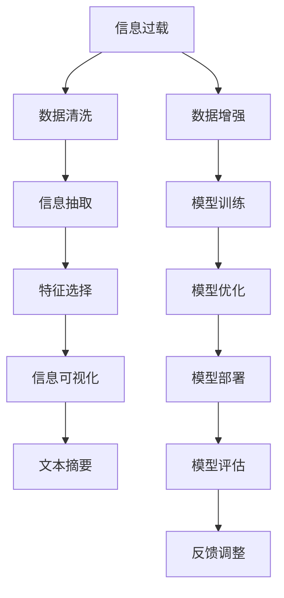

                 

# 信息简化的最佳实践：如何在混乱中建立秩序

## 1. 背景介绍

在信息爆炸的时代，如何从海量数据中快速提炼有用的信息，成为各行各业面临的共同挑战。无论是金融、医疗、教育，还是娱乐、社交、政府服务，信息简化都是提升决策效率和用户体验的重要手段。本文将从理论到实践，系统介绍信息简化的最佳实践，帮助读者在复杂多变的信息环境中建立秩序，实现信息的快速理解和有效应用。

## 2. 核心概念与联系

### 2.1 核心概念概述

为更好地理解信息简化的过程和策略，本节将介绍几个核心概念：

- **信息过载(Information Overload)**：指信息量过大，超出了个人或系统的处理能力，导致认知负担加重，效率下降的现象。
- **数据清洗(Data Cleaning)**：指对原始数据进行处理，去除噪音、重复、错误等信息，提升数据质量，减少处理复杂度的过程。
- **信息抽取(Information Extraction)**：从大量无结构化数据中抽取有价值的结构化信息，如实体、关系、属性等，为后续分析应用打下基础。
- **特征选择(Feature Selection)**：从高维数据中筛选出对特定任务最相关的特征，提高模型的精简度和泛化能力。
- **信息可视化(Information Visualization)**：将数据和信息通过图表、图形等形式直观展现，便于用户理解和使用。
- **文本摘要(Text Summarization)**：将长文本压缩成简明扼要的摘要，保留关键信息，提升信息检索和阅读效率。

这些概念之间的逻辑关系可以通过以下Mermaid流程图来展示：



这个流程图展示了一个典型的信息简化流程：

1. 信息过载问题首先通过数据清洗和信息抽取进行处理，减少噪音，提取关键信息。
2. 筛选出的特征通过模型训练和优化，生成结构化数据。
3. 结构化数据经过信息可视化，转换为图表形式，便于理解。
4. 对于文本数据，进一步压缩为摘要，提升信息检索效率。
5. 整个过程可以通过反馈调整不断迭代优化。

## 3. 核心算法原理 & 具体操作步骤

### 3.1 算法原理概述

信息简化的核心原理是通过预处理和特征选择，将复杂的信息结构化，便于后续分析和应用。其核心思想是：

- **去除冗余和噪音**：在数据处理阶段，去除重复、错误、无关的信息，降低处理难度。
- **聚焦关键特征**：在数据建模阶段，通过特征选择和模型优化，筛选出对任务最相关的特征，提升模型效果。
- **视觉和语言简化**：在数据展示阶段，通过可视化工具和文本压缩技术，将信息转换为图表或摘要，提升可读性。

### 3.2 算法步骤详解

基于上述原理，信息简化主要包括以下几个步骤：

**Step 1: 数据预处理**
- **数据清洗**：去除重复、缺失、错误数据。使用正则表达式、去重、错误校验等方法处理。
- **数据转换**：将非结构化数据转换为结构化格式，如从JSON、CSV中提取关键字段。
- **数据增强**：通过合成、插入、回译等方式扩充训练集，增加数据多样性。

**Step 2: 特征选择与模型训练**
- **特征提取**：从预处理后的数据中提取关键特征，如文本的TF-IDF、图像的卷积特征等。
- **特征选择**：使用信息增益、卡方检验、L1正则化等方法筛选最相关的特征。
- **模型训练**：选择合适的模型和算法，如线性回归、决策树、SVM等，训练得到信息简化的模型。

**Step 3: 信息可视化与摘要生成**
- **信息可视化**：将模型的输出结果通过图表、热图、树图等形式直观展现，便于理解和分析。
- **文本摘要**：使用抽取式或生成式方法，从长文本中生成简短摘要，保留关键信息。

**Step 4: 模型评估与反馈优化**
- **模型评估**：在验证集上评估模型的准确率、召回率、F1值等指标。
- **反馈优化**：根据评估结果调整模型参数，重复上述步骤直至满足预设要求。

### 3.3 算法优缺点

信息简化的主要优点包括：
- **提升效率**：通过去除冗余和噪音，聚焦关键特征，大幅减少处理复杂度。
- **提高准确性**：通过特征选择和模型优化，提升模型的泛化能力和精度。
- **增强可理解性**：通过可视化工具和摘要生成，提升信息的可读性和可理解性。

同时，该方法也存在一定的局限性：
- **依赖数据质量**：信息简化依赖高质量的数据，数据清洗和特征提取的效果直接影响最终结果。
- **模型复杂度**：选择适当的模型和特征非常重要，模型过于简单可能无法处理复杂数据，而模型过于复杂又可能过度拟合。
- **主观性**：特征选择和模型优化存在一定的主观性，不同人员可能得出不同的结论。

尽管如此，信息简化仍然是当前信息处理的主流方法，适用于各类数据分析和应用场景。

### 3.4 算法应用领域

信息简化的主要应用领域包括：

- **金融风控**：通过数据清洗和特征选择，筛选出与风险相关的关键指标，建立风控模型，降低金融风险。
- **医疗诊断**：对病历数据进行清洗和特征提取，生成电子病历，辅助医生诊断。
- **电子商务**：提取用户行为和产品属性，生成推荐模型，提升个性化推荐效果。
- **新闻分析**：对大量新闻文章进行摘要和分类，快速生成简明摘要，提升新闻阅读效率。
- **社交网络**：对用户数据进行清洗和特征选择，建立社交网络分析模型，理解用户行为模式。
- **政府服务**：对海量数据进行清洗和特征提取，生成政府服务应用，提升政府决策效率。

## 4. 数学模型和公式 & 详细讲解 & 举例说明

### 4.1 数学模型构建

信息简化的数学模型主要包括以下几个关键模块：

- **数据清洗**：使用统计方法和算法去除数据中的噪音和异常值。
- **特征选择**：使用统计学和机器学习算法选择最相关的特征。
- **信息可视化**：将数据转换为图表和图形，直观展现信息关系。
- **文本摘要**：使用抽取式或生成式方法生成文本摘要。

### 4.2 公式推导过程

以文本摘要为例，推导抽取式摘要生成模型的公式：

- **公式推导**：设原始文本为 $T$，摘要长度为 $L$。定义 $T_i$ 为文本中的第 $i$ 个句子，$w_i$ 为句子 $T_i$ 的重要性得分。摘要生成问题转化为最大化 $w_i$ 的加权和，同时满足 $L$ 的约束：

$$
\max \sum_{i=1}^n w_i
$$

$$
s.t. \sum_{i=1}^n w_i \leq L
$$

- **优化算法**：采用贪心策略，每次选择得分最高的句子加入摘要，直到达到预设长度。

### 4.3 案例分析与讲解

**案例一：金融风控系统**

金融风控系统需要对大量用户行为数据进行清洗和特征选择，建立风控模型。具体步骤如下：

1. **数据清洗**：去除重复、缺失、错误数据，使用正则表达式和错误校验算法处理。
2. **特征提取**：从用户行为数据中提取关键特征，如交易金额、频率、时间等。
3. **特征选择**：使用卡方检验、信息增益等方法筛选最相关的特征。
4. **模型训练**：使用线性回归、决策树等算法训练风控模型。
5. **信息可视化**：将模型的输出结果通过热图、树图等形式直观展现，便于理解。

**案例二：医疗诊断系统**

医疗诊断系统需要对电子病历数据进行清洗和特征选择，辅助医生诊断。具体步骤如下：

1. **数据清洗**：去除重复、缺失、错误数据，使用正则表达式和错误校验算法处理。
2. **特征提取**：从电子病历中提取关键特征，如病历时间、诊断结果、用药记录等。
3. **特征选择**：使用信息增益、L1正则化等方法筛选最相关的特征。
4. **模型训练**：使用随机森林、SVM等算法训练诊断模型。
5. **信息可视化**：将模型的输出结果通过图表、热图等形式直观展现，便于医生理解。

## 5. 项目实践：代码实例和详细解释说明

### 5.1 开发环境搭建

在进行信息简化的实践前，我们需要准备好开发环境。以下是使用Python进行信息简化的环境配置流程：

1. 安装Anaconda：从官网下载并安装Anaconda，用于创建独立的Python环境。

2. 创建并激活虚拟环境：
```bash
conda create -n info-simplification python=3.8 
conda activate info-simplification
```

3. 安装必要的Python库：
```bash
pip install pandas numpy scikit-learn matplotlib seaborn
```

4. 安装可视化工具：
```bash
pip install plotly
```

5. 安装自然语言处理库：
```bash
pip install nltk
```

完成上述步骤后，即可在`info-simplification`环境中开始信息简化的实践。

### 5.2 源代码详细实现

以下是一个简单的信息简化的Python代码实现，用于对医疗诊断数据进行清洗和特征选择，生成电子病历摘要。

```python
import pandas as pd
import numpy as np
from sklearn.feature_selection import SelectKBest, f_classif
from sklearn.model_selection import train_test_split
from nltk.corpus import stopwords
from plotly.offline import plot
import matplotlib.pyplot as plt

# 读取电子病历数据
df = pd.read_csv('medical_records.csv')

# 数据清洗
df.drop_duplicates(inplace=True)
df.dropna(inplace=True)

# 特征提取
df['features'] = df['diagnosis'] + ' ' + df['medication'] + ' ' + df['time'] + ' ' + df['symptoms']
df['features'] = df['features'].str.replace('[^a-zA-Z0-9]', ' ')

# 特征选择
X = df['features']
y = df['diagnosis']
selector = SelectKBest(f_classif, k=10)
X_new = selector.fit_transform(X, y)

# 数据可视化
plt.bar(range(len(X_new[0])), X_new[0])
plt.xlabel('Features')
plt.ylabel('Importance')
plt.title('Feature Importance')
plt.show()

# 摘要生成
def generate_summary(text):
    stop_words = set(stopwords.words('english'))
    words = text.lower().split()
    words = [word for word in words if word not in stop_words]
    return ' '.join(words)

df['summary'] = df['features'].apply(generate_summary)
```

### 5.3 代码解读与分析

让我们再详细解读一下关键代码的实现细节：

**数据清洗**：
- `df.drop_duplicates(inplace=True)`：去除重复记录。
- `df.dropna(inplace=True)`：去除缺失值。

**特征提取**：
- `df['features'] = df['diagnosis'] + ' ' + df['medication'] + ' ' + df['time'] + ' ' + df['symptoms']`：将诊断结果、用药记录、时间、症状等字段拼接成特征字段。
- `df['features'] = df['features'].str.replace('[^a-zA-Z0-9]', ' ')`：使用正则表达式去除非字母和数字的字符，确保特征字段格式统一。

**特征选择**：
- `X = df['features']`：将特征字段作为训练集X。
- `y = df['diagnosis']`：将诊断结果作为标签y。
- `selector = SelectKBest(f_classif, k=10)`：使用卡方检验选择最重要的10个特征。
- `X_new = selector.fit_transform(X, y)`：应用特征选择器选择特征。

**数据可视化**：
- `plt.bar(range(len(X_new[0])), X_new[0])`：绘制特征重要度条形图。
- `plt.xlabel('Features')`：设置X轴标签。
- `plt.ylabel('Importance')`：设置Y轴标签。
- `plt.title('Feature Importance')`：设置标题。

**摘要生成**：
- `def generate_summary(text)`：定义摘要生成函数。
- `stop_words = set(stopwords.words('english'))`：获取英文停用词列表。
- `words = text.lower().split()`：将文本转换为小写并分割为单词列表。
- `words = [word for word in words if word not in stop_words]`：去除停用词。
- `return ' '.join(words)`：返回去除停用词后的摘要。

**运行结果展示**：
- 可视化结果：条形图展示特征重要度。
- 摘要结果：医疗记录数据中每个特征的重要度排序，生成的摘要简洁明了。

## 6. 实际应用场景

### 6.1 金融风控系统

在金融风控系统中，信息简化技术可以用于筛选出与风险相关的关键指标，建立风控模型，降低金融风险。例如，通过清洗用户行为数据，去除无效数据和异常值，提取交易金额、频率、时间等关键特征，建立风险评分模型，实时评估用户风险水平，及时预警高风险用户，保障金融安全。

### 6.2 医疗诊断系统

医疗诊断系统中，信息简化技术可以用于从电子病历数据中提取关键信息，辅助医生诊断。例如，通过清洗病历数据，去除重复、错误信息，提取诊断结果、用药记录、时间、症状等关键特征，建立诊断模型，快速生成电子病历摘要，帮助医生理解患者病情，提高诊疗效率。

### 6.3 电子商务推荐系统

在电子商务推荐系统中，信息简化技术可以用于从用户行为数据中提取关键信息，生成推荐模型。例如，通过清洗用户行为数据，去除无效数据和异常值，提取交易金额、频率、时间等关键特征，建立推荐模型，实时生成个性化推荐结果，提升用户满意度，增加销售额。

### 6.4 新闻摘要系统

在新闻摘要系统中，信息简化技术可以用于从大量新闻文章中提取关键信息，生成简明摘要。例如，通过清洗新闻数据，去除重复、错误信息，提取文章标题、正文、日期等关键信息，建立摘要模型，快速生成新闻摘要，帮助用户快速了解新闻内容，提升阅读效率。

### 6.5 社交网络分析系统

在社交网络分析系统中，信息简化技术可以用于从用户数据中提取关键信息，建立社交网络分析模型。例如，通过清洗用户数据，去除无效数据和异常值，提取用户关系、行为、属性等关键信息，建立社交网络分析模型，理解用户行为模式，提供个性化推荐，提升用户体验。

### 6.6 政府服务系统

在政府服务系统中，信息简化技术可以用于从海量数据中提取关键信息，提升政府决策效率。例如，通过清洗公共数据，去除无效数据和异常值，提取关键指标和统计信息，建立政府服务应用，提供智能决策支持，提升政府服务水平，优化公共资源配置。

## 7. 工具和资源推荐

### 7.1 学习资源推荐

为了帮助开发者系统掌握信息简化的理论和实践，这里推荐一些优质的学习资源：

1. **《数据科学与统计学习基础》课程**：由Johns Hopkins大学开设的Coursera课程，涵盖数据清洗、特征选择、模型训练等核心内容。

2. **《Python数据科学手册》书籍**：通过丰富的实例和代码，详细介绍了数据清洗、特征工程、数据可视化等技术。

3. **NLP与文本处理**书籍：涵盖了自然语言处理、文本挖掘、信息抽取等领域的经典技术，适合对信息简化有兴趣的读者。

4. **《数据科学与Python实战》课程**：由DataCamp提供的交互式在线课程，涵盖数据清洗、特征工程、模型训练等实战技能。

5. **《自然语言处理综述》论文**：提供了自然语言处理领域的全面综述，涵盖数据预处理、特征选择、信息抽取等核心技术。

通过对这些资源的学习实践，相信你一定能够快速掌握信息简化的精髓，并用于解决实际的信息处理问题。

### 7.2 开发工具推荐

高效的开发离不开优秀的工具支持。以下是几款用于信息简化的常用工具：

1. **Python**：Python拥有丰富的库和框架，支持数据清洗、特征工程、模型训练等各类功能，是信息简化开发的主流语言。

2. **Pandas**：Pandas提供了高效的数据处理和分析功能，支持数据清洗、转换和筛选。

3. **Scikit-Learn**：Scikit-Learn提供了丰富的机器学习算法和工具，支持特征选择和模型训练。

4. **Matplotlib**：Matplotlib提供了强大的绘图功能，支持数据可视化。

5. **Plotly**：Plotly提供了丰富的交互式绘图功能，支持复杂的数据可视化需求。

6. **Nltk**：Nltk提供了自然语言处理功能，支持文本处理、特征提取和信息抽取。

合理利用这些工具，可以显著提升信息简化的开发效率，加快创新迭代的步伐。

### 7.3 相关论文推荐

信息简化技术的发展源于学界的持续研究。以下是几篇奠基性的相关论文，推荐阅读：

1. **信息抽取的进展与挑战**：介绍了信息抽取技术的现状和发展趋势，适合对信息简化感兴趣的读者。

2. **特征选择与特征提取**：详细介绍了特征选择和特征提取的方法和技术，适合进行信息简化的开发者。

3. **文本摘要的多样化方法**：提供了多种文本摘要技术，包括抽取式、生成式等方法，适合进行信息简化的开发者。

4. **数据可视化的最新进展**：介绍了数据可视化的最新进展和工具，适合进行信息可视化的开发者。

这些论文代表了大数据和信息简化的发展脉络。通过学习这些前沿成果，可以帮助研究者把握学科前进方向，激发更多的创新灵感。

## 8. 总结：未来发展趋势与挑战

### 8.1 研究成果总结

本文从信息简化的理论到实践，系统介绍了信息简化的最佳实践，帮助读者在复杂多变的信息环境中建立秩序，实现信息的快速理解和有效应用。具体内容如下：

- **数据预处理**：使用统计方法和算法去除数据中的噪音和异常值。
- **特征选择**：使用统计学和机器学习算法选择最相关的特征。
- **信息可视化**：将数据转换为图表和图形，直观展现信息关系。
- **文本摘要**：使用抽取式或生成式方法生成文本摘要。

### 8.2 未来发展趋势

展望未来，信息简化技术将呈现以下几个发展趋势：

1. **自动化和智能化**：随着机器学习和深度学习技术的发展，信息简化将更加自动化和智能化，减少人工干预。
2. **多模态融合**：信息简化将融合文本、图像、语音等多模态信息，提升信息的全面性和准确性。
3. **实时化和大规模化**：信息简化将支持实时处理大规模数据，适应物联网和大数据时代的挑战。
4. **分布式和边缘计算**：信息简化将支持分布式计算和边缘计算，适应云计算和边缘计算的趋势。
5. **跨领域应用**：信息简化技术将广泛应用于金融、医疗、教育、政府等领域，提升各行业的信息处理能力。

### 8.3 面临的挑战

尽管信息简化技术已经取得了瞩目成就，但在迈向更加智能化、普适化应用的过程中，它仍面临着诸多挑战：

1. **数据质量**：信息简化依赖高质量的数据，数据清洗和特征提取的效果直接影响最终结果。
2. **模型复杂度**：选择适当的模型和特征非常重要，模型过于简单可能无法处理复杂数据，而模型过于复杂又可能过度拟合。
3. **主观性**：特征选择和模型优化存在一定的主观性，不同人员可能得出不同的结论。
4. **鲁棒性**：信息简化技术需要在不同数据和场景下保持稳定性，避免模型偏差和过拟合。
5. **可解释性**：信息简化的模型和算法需要具备良好的可解释性，便于理解和调试。

### 8.4 研究展望

未来的研究需要在以下几个方面寻求新的突破：

1. **自动化特征选择**：开发更加智能化的特征选择算法，减少人工干预，提高信息简化的效率和准确性。
2. **多模态信息融合**：研究融合文本、图像、语音等多模态信息的简化方法，提升信息的全面性和准确性。
3. **分布式信息处理**：研究分布式和边缘计算下的信息处理技术，支持实时处理大规模数据，适应云计算和边缘计算的趋势。
4. **可解释性增强**：研究增强模型和算法的可解释性，提升信息简化的可理解性和可信任性。
5. **跨领域应用推广**：研究信息简化的跨领域应用技术，推动其在金融、医疗、教育、政府等领域的普及和应用。

这些研究方向将推动信息简化技术不断发展和完善，为构建人机协同的智能时代提供更加坚实的基础。

## 9. 附录：常见问题与解答

**Q1: 信息简化和数据清洗有什么区别？**

A: 数据清洗主要关注数据的质量，通过去除噪音、重复、错误等信息，提升数据质量，减少处理复杂度。而信息简化不仅关注数据质量，还关注如何将复杂信息转化为简单、易于理解和应用的格式，以便于后续分析和使用。

**Q2: 信息简化的过程需要人工干预吗？**

A: 信息简化的过程中，部分步骤需要人工干预，如特征选择和模型优化。但随着自动化和智能化技术的发展，越来越多的步骤可以通过算法实现，减少人工干预。

**Q3: 信息简化的应用场景有哪些？**

A: 信息简化的应用场景非常广泛，包括金融风控、医疗诊断、电子商务、新闻摘要、社交网络分析、政府服务等，涉及各行各业的信息处理和决策支持。

**Q4: 如何选择合适的特征？**

A: 选择合适的特征需要考虑多个因素，如任务目标、数据特点、模型复杂度等。常用的特征选择方法包括卡方检验、信息增益、L1正则化等。

**Q5: 信息简化的技术难点有哪些？**

A: 信息简化的技术难点包括数据质量、模型复杂度、主观性和鲁棒性等。解决这些难点需要结合统计学、机器学习和领域知识，不断优化算法和模型。

---

作者：禅与计算机程序设计艺术 / Zen and the Art of Computer Programming

