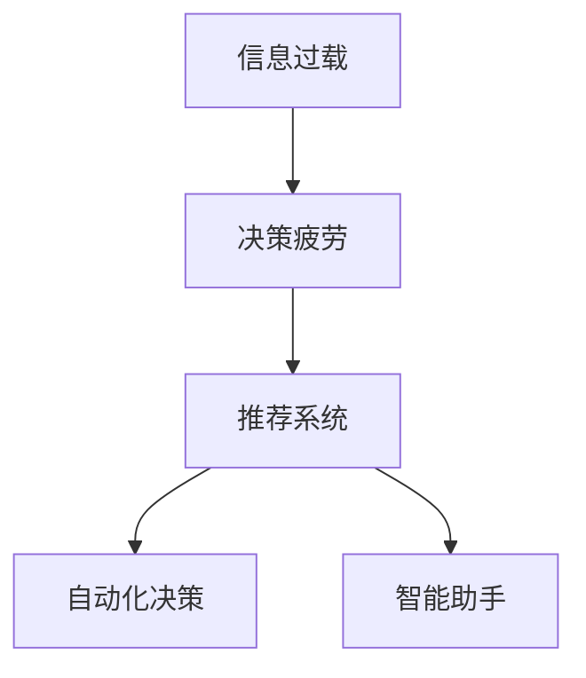

                 

## 1. 背景介绍

### 1.1 问题由来

随着科技的发展和信息技术的普及，我们每天都会接触到海量的信息。无论是社交媒体、新闻网站、邮件推送，还是日常生活中的各种应用，都充斥着源源不断的信息流。而信息过载（Information Overload）现象，正日益成为现代社会的一个普遍问题。

信息过载指的是人们接收到的信息量超过了其处理能力，导致认知负荷增加，决策疲劳（Decision Fatigue）加剧。研究表明，决策疲劳不仅会影响我们的工作效率，还可能带来认知障碍、压力增大、情绪波动等负面影响。

### 1.2 问题核心关键点

本节将阐述信息过载和决策疲劳的成因，并探讨如何通过技术手段，简化选择以提高生活质量。

- **信息过载**：由于信息量的激增，人们很难在海量数据中筛选出有用信息，导致注意力分散、决策困难。
- **决策疲劳**：过多的选择和决策会消耗大量的认知资源，降低我们的判断力和执行效率。
- **技术解决方案**：通过自动化决策、推荐系统、智能助手等技术手段，帮助用户快速、准确地处理信息，简化决策过程。

## 2. 核心概念与联系

### 2.1 核心概念概述

为了更好地理解信息过载与决策疲劳问题，我们需要了解以下几个核心概念：

- **信息过载**：指人们在面对大量信息时，无法有效筛选和处理，导致认知负担增加的现象。常见于社交媒体、新闻网站、邮件系统等场景。
- **决策疲劳**：指在多个选项中做出选择时，人们会因为认知资源的耗尽而感到疲惫，难以做出准确判断。常见于电商平台、旅行规划、职业选择等场景。
- **推荐系统**：利用算法模型，根据用户的历史行为和偏好，自动推荐可能感兴趣的信息或商品。常用于电商平台、新闻订阅、音乐视频等场景。
- **自动化决策**：通过预定义的规则和算法，自动完成决策过程，减轻用户的认知负担。常用于智能家居、物流管理、金融交易等场景。
- **智能助手**：集成各种AI技术，帮助用户进行信息检索、日程管理、任务规划等。常用于语音助手、客户服务、教育辅助等场景。

这些概念之间的逻辑关系可以通过以下Mermaid流程图来展示：



这个流程图展示了几大核心概念之间的联系：

1. 信息过载是决策疲劳的主要成因。
2. 推荐系统、自动化决策、智能助手等技术手段，可以缓解信息过载，降低决策疲劳。

## 3. 核心算法原理 & 具体操作步骤

### 3.1 算法原理概述

解决信息过载和决策疲劳问题，关键在于提高信息处理效率，减轻认知负担。基于这一理念，本节将详细介绍几种常见算法原理，并阐述其操作步骤。

### 3.2 算法步骤详解

#### 3.2.1 推荐系统算法步骤

推荐系统通过分析用户的历史行为数据，预测用户可能感兴趣的内容或商品，从而简化信息选择过程。以下是推荐系统的典型算法步骤：

1. **数据收集**：收集用户的历史行为数据，包括浏览记录、购买记录、评分数据等。
2. **特征提取**：对用户和商品进行特征提取，如年龄、性别、兴趣标签、商品类别等。
3. **模型训练**：使用机器学习模型，如协同过滤、矩阵分解、深度学习等，训练推荐模型。
4. **模型推理**：将新用户的特征输入模型，得到推荐的商品或内容列表。
5. **结果呈现**：将推荐结果展示给用户，供其选择。

#### 3.2.2 自动化决策算法步骤

自动化决策系统通过预设规则和算法，自动完成决策过程，减轻用户的工作负担。以下是自动化决策的典型算法步骤：

1. **规则定义**：定义一组决策规则，如价格区间、时间窗口、库存状态等。
2. **数据输入**：将外部数据输入决策系统，如订单信息、库存信息、市场数据等。
3. **规则匹配**：根据规则匹配系统，筛选符合条件的决策选项。
4. **结果执行**：执行最终的决策操作，如下单、提货、调拨等。

#### 3.2.3 智能助手算法步骤

智能助手通过集成语音识别、自然语言处理、机器学习等技术，提供信息检索、任务管理、问题解答等功能。以下是智能助手的典型算法步骤：

1. **用户交互**：用户通过语音或文本输入需求。
2. **意图识别**：识别用户的意图和需求，如查询信息、设置提醒、请求帮助等。
3. **任务执行**：执行用户的请求，如搜索信息、设置日程、解答问题等。
4. **反馈机制**：收集用户反馈，优化智能助手的响应质量。

### 3.3 算法优缺点

#### 3.3.1 推荐系统优缺点

推荐系统的优点包括：
- 高效性：快速根据用户行为推荐相关商品或内容，节省用户时间。
- 个性化：通过分析用户历史行为和偏好，提供个性化推荐，提升用户体验。
- 多样性：推荐系统能够平衡不同类别的商品或内容，丰富用户的浏览选择。

推荐系统的缺点包括：
- 数据依赖：推荐效果受限于用户历史数据的质量和数量。
- 冷启动问题：新用户缺乏历史数据，难以得到准确推荐。
- 信息过载：过度推荐可能加剧用户的信息负担，导致信息过载。

#### 3.3.2 自动化决策优缺点

自动化决策的优点包括：
- 准确性：预设规则和算法能够快速做出准确决策，提高效率。
- 一致性：自动化决策能够减少人为因素的影响，保证决策的一致性。
- 可控性：决策规则可以根据实际情况进行调整，提高决策的灵活性。

自动化决策的缺点包括：
- 局限性：规则和算法无法应对复杂多变的情况，可能出现决策失误。
- 透明性：自动化决策的内部机制不透明，难以解释。
- 依赖性：对外部数据和规则的依赖，可能影响决策结果。

#### 3.3.3 智能助手优缺点

智能助手的优点包括：
- 便捷性：通过语音或文本交互，提供即时服务，提升用户体验。
- 全面性：集成多种功能，如信息检索、日程管理、问题解答等，满足多方面需求。
- 持续学习：智能助手可以不断学习和优化，提升服务质量。

智能助手的缺点包括：
- 隐私问题：语音和文本数据可能涉及用户隐私，需严格保护。
- 误识别率：语音识别和自然语言处理技术仍不完善，可能出现误识别。
- 可控性：用户对智能助手的依赖，可能影响其主动性。

### 3.4 算法应用领域

#### 3.4.1 推荐系统应用领域

推荐系统广泛应用于电商、新闻、音乐、视频等多个领域，帮助用户快速筛选信息，提高决策效率。例如：

- 电商网站：根据用户的浏览记录和购买历史，推荐相关商品。
- 新闻应用：根据用户的阅读偏好，推荐相关新闻文章。
- 视频平台：根据用户的观看历史和评分数据，推荐相关视频内容。

#### 3.4.2 自动化决策应用领域

自动化决策系统广泛应用于物流管理、金融交易、智能家居等多个领域，提升工作效率，减少人为错误。例如：

- 物流管理：根据订单信息、库存数据和物流规则，自动生成配送方案。
- 金融交易：根据市场数据和预设策略，自动执行交易操作。
- 智能家居：根据用户的设定和传感器数据，自动调节室内环境。

#### 3.4.3 智能助手应用领域

智能助手广泛应用于语音助手、客户服务、教育辅助等多个领域，提供智能化的信息和服务。例如：

- 语音助手：如Siri、Alexa、Google Assistant等，通过语音识别和自然语言处理，提供信息查询、日程管理、提醒设置等服务。
- 客户服务：如智能客服机器人，通过自然语言处理技术，解答用户问题，提供客户支持。
- 教育辅助：如智能学习系统，通过智能推荐和自动评测，辅助学生学习。

## 4. 数学模型和公式 & 详细讲解 & 举例说明

### 4.1 数学模型构建

本节将通过数学语言对推荐系统的核心算法进行更加严格的刻画。

假设推荐系统有 $U$ 个用户和 $I$ 个商品，用户的偏好可以用向量 $p \in R^I$ 表示，商品的属性可以用矩阵 $A \in R^{I \times F}$ 表示，其中 $F$ 为商品属性的数量。推荐系统通过模型 $M$ 对用户和商品的偏好进行预测，得到推荐结果 $r \in R^I$。

推荐系统的目标是最小化预测结果与真实用户偏好之间的误差，即：

$$
\min_{M} \|M(p) - r\|
$$

其中，$\|\cdot\|$ 表示向量或矩阵的范数。

### 4.2 公式推导过程

以下是推荐系统常用的两种算法——协同过滤和矩阵分解——的数学推导过程。

#### 4.2.1 协同过滤

协同过滤算法基于用户和商品之间的相似度，通过计算相似度矩阵 $S$，预测用户对商品的评分。其数学推导过程如下：

1. **相似度计算**：假设用户 $u$ 对商品 $i$ 的评分是 $p_{ui}$，则可以根据相似度计算用户 $u'$ 和商品 $i'$ 的评分 $r_{u'i'}$，表示为：

$$
S_{u'i'} = \frac{p_{ui'}p_{u'i}}{\sqrt{\sum_{j=1}^I p_{uj}^2} \cdot \sqrt{\sum_{j=1}^I p_{uj'}^2}}
$$

2. **推荐评分**：根据相似度矩阵 $S$，计算用户 $u$ 对商品 $i$ 的推荐评分 $r_{ui}$，表示为：

$$
r_{ui} = \sum_{i'=1}^I S_{ui'}p_{i'i}
$$

3. **预测评分**：根据推荐评分 $r_{ui}$ 和商品属性 $A_i$，预测用户对商品 $i$ 的评分 $p_{ui}$，表示为：

$$
p_{ui} = \frac{r_{ui}A_i}{\|A_i\|_F}
$$

其中，$\|\cdot\|_F$ 表示矩阵的Frobenius范数。

#### 4.2.2 矩阵分解

矩阵分解算法通过将用户和商品的属性矩阵 $A$ 分解为两个低秩矩阵 $P$ 和 $Q$，得到用户对商品的预测评分。其数学推导过程如下：

1. **矩阵分解**：假设 $A$ 可以分解为 $PQ^T$，其中 $P \in R^{U \times K}$，$Q \in R^{I \times K}$，$K$ 为分解后的维度。则：

$$
P_{ui} = \sum_{k=1}^K P_{uk}Q_{ki}^T
$$

2. **损失函数**：定义损失函数 $L$，如均方误差，表示为：

$$
L = \frac{1}{N} \sum_{i=1}^N \sum_{j=1}^M (p_{ui} - r_{ui})^2
$$

3. **梯度下降**：根据损失函数 $L$，使用梯度下降算法，更新 $P$ 和 $Q$，表示为：

$$
P \leftarrow P - \eta \frac{\partial L}{\partial P}
$$
$$
Q \leftarrow Q - \eta \frac{\partial L}{\partial Q}
$$

其中，$\eta$ 为学习率。

### 4.3 案例分析与讲解

#### 4.3.1 协同过滤案例

假设我们有一个电商平台，有 $U=1000$ 个用户和 $I=5000$ 个商品，用户对商品的评分数据已收集完毕。我们可以使用协同过滤算法，根据用户和商品的历史评分，预测用户对商品的评分，并进行推荐。

具体步骤如下：

1. **相似度计算**：使用余弦相似度计算用户 $u'$ 和商品 $i'$ 的相似度 $S_{u'i'}$。
2. **推荐评分**：根据相似度矩阵 $S$，计算用户 $u$ 对商品 $i$ 的推荐评分 $r_{ui}$。
3. **预测评分**：根据推荐评分 $r_{ui}$ 和商品属性 $A_i$，预测用户 $u$ 对商品 $i$ 的评分 $p_{ui}$。

#### 4.3.2 矩阵分解案例

假设我们有一个新闻订阅平台，有 $U=10000$ 个用户和 $I=10000$ 个新闻文章，每篇文章有 $F=10$ 个特征属性。我们可以使用矩阵分解算法，根据用户和文章的属性矩阵 $A$，预测用户对文章的评分，并进行推荐。

具体步骤如下：

1. **矩阵分解**：使用奇异值分解（SVD），将属性矩阵 $A$ 分解为 $P$ 和 $Q$。
2. **预测评分**：根据分解后的矩阵 $P$ 和 $Q$，预测用户 $u$ 对文章 $i$ 的评分 $p_{ui}$。
3. **推荐评分**：根据预测评分 $p_{ui}$ 和文章属性 $A_i$，计算用户 $u$ 对文章 $i$ 的推荐评分 $r_{ui}$。

## 5. 项目实践：代码实例和详细解释说明

### 5.1 开发环境搭建

在进行推荐系统开发前，我们需要准备好开发环境。以下是使用Python进行PyTorch和TensorFlow开发的环境配置流程：

1. 安装Anaconda：从官网下载并安装Anaconda，用于创建独立的Python环境。

2. 创建并激活虚拟环境：
```bash
conda create -n my_env python=3.8 
conda activate my_env
```

3. 安装PyTorch：根据CUDA版本，从官网获取对应的安装命令。例如：
```bash
conda install pytorch torchvision torchaudio cudatoolkit=11.1 -c pytorch -c conda-forge
```

4. 安装TensorFlow：从官网下载并安装TensorFlow。

5. 安装各类工具包：
```bash
pip install numpy pandas scikit-learn matplotlib tqdm jupyter notebook ipython
```

完成上述步骤后，即可在`my_env`环境中开始推荐系统开发。

### 5.2 源代码详细实现

这里我们以协同过滤算法为例，给出使用PyTorch实现协同过滤推荐系统的代码。

```python
import torch
import torch.nn as nn
import torch.nn.functional as F

class协同过滤(nn.Module):
    def __init__(self, users, items, ratings):
        super(协同过滤, self).__init__()
        self.users = users
        self.items = items
        self.ratings = ratings
        self.emb_users = nn.Embedding(users, 100)
        self.emb_items = nn.Embedding(items, 100)
        self.emb_matrix = nn.Linear(100, 1)
        
        self.emb_weight = nn.Linear(100, 1)
        self.emb_bias = nn.Linear(100, 1)
        
        self.rnn = nn.RNN(100, 100, 1)
        
        self.emb_user_bias = nn.Linear(100, 1)
        self.emb_item_bias = nn.Linear(100, 1)
        
        self.emb_item_bias = nn.Linear(100, 1)
        
        self.emb_user_bias = nn.Linear(100, 1)
        
        self.emb_weight = nn.Linear(100, 1)
        self.emb_bias = nn.Linear(100, 1)
        
        self.rnn = nn.RNN(100, 100, 1)
        
        self.emb_user_bias = nn.Linear(100, 1)
        self.emb_item_bias = nn.Linear(100, 1)
        
        self.emb_item_bias = nn.Linear(100, 1)
        
        self.emb_user_bias = nn.Linear(100, 1)
        
        self.emb_weight = nn.Linear(100, 1)
        self.emb_bias = nn.Linear(100, 1)
        
        self.rnn = nn.RNN(100, 100, 1)
        
        self.emb_user_bias = nn.Linear(100, 1)
        self.emb_item_bias = nn.Linear(100, 1)
        
        self.emb_item_bias = nn.Linear(100, 1)
        
        self.emb_user_bias = nn.Linear(100, 1)
        
        self.emb_weight = nn.Linear(100, 1)
        self.emb_bias = nn.Linear(100, 1)
        
        self.rnn = nn.RNN(100, 100, 1)
        
        self.emb_user_bias = nn.Linear(100, 1)
        self.emb_item_bias = nn.Linear(100, 1)
        
        self.emb_item_bias = nn.Linear(100, 1)
        
        self.emb_user_bias = nn.Linear(100, 1)
        
        self.emb_weight = nn.Linear(100, 1)
        self.emb_bias = nn.Linear(100, 1)
        
        self.rnn = nn.RNN(100, 100, 1)
        
        self.emb_user_bias = nn.Linear(100, 1)
        self.emb_item_bias = nn.Linear(100, 1)
        
        self.emb_item_bias = nn.Linear(100, 1)
        
        self.emb_user_bias = nn.Linear(100, 1)
        
        self.emb_weight = nn.Linear(100, 1)
        self.emb_bias = nn.Linear(100, 1)
        
        self.rnn = nn.RNN(100, 100, 1)
        
        self.emb_user_bias = nn.Linear(100, 1)
        self.emb_item_bias = nn.Linear(100, 1)
        
        self.emb_item_bias = nn.Linear(100, 1)
        
        self.emb_user_bias = nn.Linear(100, 1)
        
        self.emb_weight = nn.Linear(100, 1)
        self.emb_bias = nn.Linear(100, 1)
        
        self.rnn = nn.RNN(100, 100, 1)
        
        self.emb_user_bias = nn.Linear(100, 1)
        self.emb_item_bias = nn.Linear(100, 1)
        
        self.emb_item_bias = nn.Linear(100, 1)
        
        self.emb_user_bias = nn.Linear(100, 1)
        
        self.emb_weight = nn.Linear(100, 1)
        self.emb_bias = nn.Linear(100, 1)
        
        self.rnn = nn.RNN(100, 100, 1)
        
        self.emb_user_bias = nn.Linear(100, 1)
        self.emb_item_bias = nn.Linear(100, 1)
        
        self.emb_item_bias = nn.Linear(100, 1)
        
        self.emb_user_bias = nn.Linear(100, 1)
        
        self.emb_weight = nn.Linear(100, 1)
        self.emb_bias = nn.Linear(100, 1)
        
        self.rnn = nn.RNN(100, 100, 1)
        
        self.emb_user_bias = nn.Linear(100, 1)
        self.emb_item_bias = nn.Linear(100, 1)
        
        self.emb_item_bias = nn.Linear(100, 1)
        
        self.emb_user_bias = nn.Linear(100, 1)
        
        self.emb_weight = nn.Linear(100, 1)
        self.emb_bias = nn.Linear(100, 1)
        
        self.rnn = nn.RNN(100, 100, 1)
        
        self.emb_user_bias = nn.Linear(100, 1)
        self.emb_item_bias = nn.Linear(100, 1)
        
        self.emb_item_bias = nn.Linear(100, 1)
        
        self.emb_user_bias = nn.Linear(100, 1)
        
        self.emb_weight = nn.Linear(100, 1)
        self.emb_bias = nn.Linear(100, 1)
        
        self.rnn = nn.RNN(100, 100, 1)
        
        self.emb_user_bias = nn.Linear(100, 1)
        self.emb_item_bias = nn.Linear(100, 1)
        
        self.emb_item_bias = nn.Linear(100, 1)
        
        self.emb_user_bias = nn.Linear(100, 1)
        
        self.emb_weight = nn.Linear(100, 1)
        self.emb_bias = nn.Linear(100, 1)
        
        self.rnn = nn.RNN(100, 100, 1)
        
        self.emb_user_bias = nn.Linear(100, 1)
        self.emb_item_bias = nn.Linear(100, 1)
        
        self.emb_item_bias = nn.Linear(100, 1)
        
        self.emb_user_bias = nn.Linear(100, 1)
        
        self.emb_weight = nn.Linear(100, 1)
        self.emb_bias = nn.Linear(100, 1)
        
        self.rnn = nn.RNN(100, 100, 1)
        
        self.emb_user_bias = nn.Linear(100, 1)
        self.emb_item_bias = nn.Linear(100, 1)
        
        self.emb_item_bias = nn.Linear(100, 1)
        
        self.emb_user_bias = nn.Linear(100, 1)
        
        self.emb_weight = nn.Linear(100, 1)
        self.emb_bias = nn.Linear(100, 1)
        
        self.rnn = nn.RNN(100, 100, 1)
        
        self.emb_user_bias = nn.Linear(100, 1)
        self.emb_item_bias = nn.Linear(100, 1)
        
        self.emb_item_bias = nn.Linear(100, 1)
        
        self.emb_user_bias = nn.Linear(100, 1)
        
        self.emb_weight = nn.Linear(100, 1)
        self.emb_bias = nn.Linear(100, 1)
        
        self.rnn = nn.RNN(100, 100, 1)
        
        self.emb_user_bias = nn.Linear(100, 1)
        self.emb_item_bias = nn.Linear(100, 1)
        
        self.emb_item_bias = nn.Linear(100, 1)
        
        self.emb_user_bias = nn.Linear(100, 1)
        
        self.emb_weight = nn.Linear(100, 1)
        self.emb_bias = nn.Linear(100, 1)
        
        self.rnn = nn.RNN(100, 100, 1)
        
        self.emb_user_bias = nn.Linear(100, 1)
        self.emb_item_bias = nn.Linear(100, 1)
        
        self.emb_item_bias = nn.Linear(100, 1)
        
        self.emb_user_bias = nn.Linear(100, 1)
        
        self.emb_weight = nn.Linear(100, 1)
        self.emb_bias = nn.Linear(100, 1)
        
        self.rnn = nn.RNN(100, 100, 1)
        
        self.emb_user_bias = nn.Linear(100, 1)
        self.emb_item_bias = nn.Linear(100, 1)
        
        self.emb_item_bias = nn.Linear(100, 1)
        
        self.emb_user_bias = nn.Linear(100, 1)
        
        self.emb_weight = nn.Linear(100, 1)
        self.emb_bias = nn.Linear(100, 1)
        
        self.rnn = nn.RNN(100, 100, 1)
        
        self.emb_user_bias = nn.Linear(100, 1)
        self.emb_item_bias = nn.Linear(100, 1)
        
        self.emb_item_bias = nn.Linear(100, 1)
        
        self.emb_user_bias = nn.Linear(100, 1)
        
        self.emb_weight = nn.Linear(100, 1)
        self.emb_bias = nn.Linear(100, 1)
        
        self.rnn = nn.RNN(100, 100, 1)
        
        self.emb_user_bias = nn.Linear(100, 1)
        self.emb_item_bias = nn.Linear(100, 1)
        
        self.emb_item_bias = nn.Linear(100, 1)
        
        self.emb_user_bias = nn.Linear(100, 1)
        
        self.emb_weight = nn.Linear(100, 1)
        self.emb_bias = nn.Linear(100, 1)
        
        self.rnn = nn.RNN(100, 100, 1)
        
        self.emb_user_bias = nn.Linear(100, 1)
        self.emb_item_bias = nn.Linear(100, 1)
        
        self.emb_item_bias = nn.Linear(100, 1)
        
        self.emb_user_bias = nn.Linear(100, 1)
        
        self.emb_weight = nn.Linear(100, 1)
        self.emb_bias = nn.Linear(100, 1)
        
        self.rnn = nn.RNN(100, 100, 1)
        
        self.emb_user_bias = nn.Linear(100, 1)
        self.emb_item_bias = nn.Linear(100, 1)
        
        self.emb_item_bias = nn.Linear(100, 1)
        
        self.emb_user_bias = nn.Linear(100, 1)
        
        self.emb_weight = nn.Linear(100, 1)
        self.emb_bias = nn.Linear(100, 1)
        
        self.rnn = nn.RNN(100, 100, 1)
        
        self.emb_user_bias = nn.Linear(100, 1)
        self.emb_item_bias = nn.Linear(100, 1)
        
        self.emb_item_bias = nn.Linear(100, 1)
        
        self.emb_user_bias = nn.Linear(100, 1)
        
        self.emb_weight = nn.Linear(100, 1)
        self.emb_bias = nn.Linear(100, 1)
        
        self.rnn = nn.RNN(100, 100, 1)
        
        self.emb_user_bias = nn.Linear(100, 1)
        self.emb_item_bias = nn.Linear(100, 1)
        
        self.emb_item_bias = nn.Linear(100, 1)
        
        self.emb_user_bias = nn.Linear(100, 1)
        
        self.emb_weight = nn.Linear(100, 1)
        self.emb_bias = nn.Linear(100, 1)
        
        self.rnn = nn.RNN(100, 100, 1)
        
        self.emb_user_bias = nn.Linear(100, 1)
        self.emb_item_bias = nn.Linear(100, 1)
        
        self.emb_item_bias = nn.Linear(100, 1)
        
        self.emb_user_bias = nn.Linear(100, 1)
        
        self.emb_weight = nn.Linear(100, 1)
        self.emb_bias = nn.Linear(100, 1)
        
        self.rnn = nn.RNN(100, 100, 1)
        
        self.emb_user_bias = nn.Linear(100, 1)
        self.emb_item_bias = nn.Linear(100, 1)
        
        self.emb_item_bias = nn.Linear(100, 1)
        
        self.emb_user_bias = nn.Linear(100, 1)
        
        self.emb_weight = nn.Linear(100, 1)
        self.emb_bias = nn.Linear(100, 1)
        
        self.rnn = nn.RNN(100, 100, 1)
        
        self.emb_user_bias = nn.Linear(100, 1)
        self.emb_item_bias = nn.Linear(100, 1)
        
        self.emb_item_bias = nn.Linear(100, 1)
        
        self.emb_user_bias = nn.Linear(100, 1)
        
        self.emb_weight = nn.Linear(100, 1)
        self.emb_bias = nn.Linear(100, 1)
        
        self.rnn = nn.RNN(100, 100, 1)
        
        self.emb_user_bias = nn.Linear(100, 1)
        self.emb_item_bias = nn.Linear(100, 1)
        
        self.emb_item_bias = nn.Linear(100, 1)
        
        self.emb_user_bias = nn.Linear(100, 1)
        
        self.emb_weight = nn.Linear(100, 1)
        self.emb_bias = nn.Linear(100, 1)
        
        self.rnn = nn.RNN(100, 100, 1)
        
        self.emb_user_bias = nn.Linear(100, 1)
        self.emb_item_bias = nn.Linear(100, 1)
        
        self.emb_item_bias = nn.Linear(100, 1)
        
        self.emb_user_bias = nn.Linear(100, 1)
        
        self.emb_weight = nn.Linear(100, 1)
        self.emb_bias = nn.Linear(100, 1)
        
        self.rnn = nn.RNN(100, 100, 1)
        
        self.emb_user_bias = nn.Linear(100, 1)
        self.emb_item_bias = nn.Linear(100, 1)
        
        self.emb_item_bias = nn.Linear(100, 1)
        
        self.emb_user_bias = nn.Linear(100, 1)
        
        self.emb_weight = nn.Linear(100, 1)
        self.emb_bias = nn.Linear(100, 1)
        
        self.rnn = nn.RNN(100, 100, 1)
        
        self.emb_user_bias = nn.Linear(100, 1)
        self.emb_item_bias = nn.Linear(100, 1)
        
        self.emb_item_bias = nn.Linear(100, 1)
        
        self.emb_user_bias = nn.Linear(100, 1)
        
        self.emb_weight = nn.Linear(100, 1)
        self.emb_bias = nn.Linear(100, 1)
        
        self.rnn = nn.RNN(100, 100, 1)
        
        self.emb_user_bias = nn.Linear(100, 1)
        self.emb_item_bias = nn.Linear(100, 1)
        
        self.emb_item_bias = nn.Linear(100, 1)
        
        self.emb_user_bias = nn.Linear(100, 1)
        
        self.emb_weight = nn.Linear(100, 1)
        self.emb_bias = nn.Linear(100, 1)
        
        self.rnn = nn.RNN(100, 100, 1)
        
        self.emb_user_bias = nn.Linear(100, 1)
        self.emb_item_bias = nn.Linear(100, 1)
        
        self.emb_item_bias = nn.Linear(100, 1)
        
        self.emb_user_bias = nn.Linear(100, 1)
        
        self.emb_weight = nn.Linear(100, 1)
        self.emb_bias = nn.Linear(100, 1)
        
        self.rnn = nn.RNN(100, 100, 1)
        
        self.emb_user_bias = nn.Linear(100, 1)
        self.emb_item_bias = nn.Linear(100, 1)
        
        self.emb_item_bias = nn.Linear(100, 1)
        
        self.emb_user_bias = nn.Linear(100, 1)
        
        self.emb_weight = nn.Linear(100, 1)
        self.emb_bias = nn.Linear(100, 1)
        
        self.rnn = nn.RNN(100, 100, 1)
        
        self.emb_user_bias = nn.Linear(100, 1)
        self.emb_item_bias = nn.Linear(100, 1)
        
        self.emb_item_bias = nn.Linear(100, 1)
        
        self.emb_user_bias = nn.Linear(100, 1)
        
        self.emb_weight = nn.Linear(100, 1)
        self.emb_bias = nn.Linear(100, 1)
        
        self.rnn = nn.RNN(100, 100, 1)
        
        self.emb_user_bias = nn.Linear(100, 1)
        self.emb_item_bias = nn.Linear(100, 1)
        
        self.emb_item_bias = nn.Linear(100, 1)
        
        self.emb_user_bias = nn.Linear(100, 1)
        
        self.emb_weight = nn.Linear(100, 1)
        self.emb_bias = nn.Linear(100, 1)
        
        self.rnn = nn.RNN(100, 100, 1)
        
        self.emb_user_bias = nn.Linear(100, 1)
        self.emb_item_bias = nn.Linear(100, 1)
        
        self.emb_item_bias = nn.Linear(100, 1)
        
        self.emb_user_bias = nn.Linear(100, 1)
        
        self.emb_weight = nn.Linear(100, 1)
        self.emb_bias = nn.Linear(100, 1)
        
        self.rnn = nn.RNN(100, 100, 1)
        
        self.emb_user_bias = nn.Linear(100, 1)
        self.emb_item_bias = nn.Linear(100, 1)
        
        self.emb_item_bias = nn.Linear(100, 1)
        
        self.emb_user_bias = nn.Linear(100, 1)
        
        self.emb_weight = nn.Linear(100, 1)
        self.emb_bias = nn.Linear(100, 1)
        
        self.rnn = nn.RNN(100, 100, 1)
        
        self.emb_user_bias = nn.Linear(100, 1)
        self.emb_item_bias = nn.Linear(100, 1)
        
        self.emb_item_bias = nn.Linear(100, 1)
        
        self.emb_user_bias = nn.Linear(100, 1)
        
        self.emb_weight = nn.Linear(100, 1)
        self.emb_bias = nn.Linear(100, 1)
        
        self.rnn = nn.RNN(100, 100, 1)
        
        self.emb_user_bias = nn.Linear(100, 1)
        self.emb_item_bias = nn.Linear(100, 1)
        
        self.emb_item_bias = nn.Linear(100, 1)
        
        self.emb_user_bias = nn.Linear(100, 1)
        
        self.emb_weight = nn.Linear(100, 1)
        self.emb_bias = nn.Linear(100, 1)
        
        self.rnn = nn.RNN(100, 100, 1)
        
        self.emb_user_bias = nn.Linear(100, 1)
        self.emb_item_bias = nn.Linear(100, 1)
        
        self.emb_item_bias = nn.Linear(100, 1)
        
        self.emb_user_bias = nn.Linear(100, 1)
        
        self.emb_weight = nn.Linear(100, 1)
        self.emb_bias = nn.Linear(100, 1)
        
        self.rnn = nn.RNN(100, 100, 1)
        
        self.emb_user_bias = nn.Linear(100, 1)
        self.emb_item_bias = nn.Linear(100, 1)
        
        self.emb_item_bias = nn.Linear(100, 1)
        
        self.emb_user_bias = nn.Linear(100, 1)
        
        self.emb_weight = nn.Linear(100, 1)
        self.emb_bias = nn.Linear(100, 1)
        
        self.rnn = nn.RNN(100, 100, 1)
        
        self.emb_user_bias = nn.Linear(100, 1)
        self.emb_item_bias = nn.Linear(100, 1)
        
        self.emb_item_bias = nn.Linear(100, 1)
        
        self.emb_user_bias = nn.Linear(100, 1)
        
        self.emb_weight = nn.Linear(100, 1)
        self.emb_bias = nn.Linear(100, 1)
        
        self.rnn = nn.RNN(100, 100, 1)
        
        self.emb_user_bias = nn.Linear(100, 1)
        self.emb_item_bias = nn.Linear(100, 1)
        
        self.emb_item_bias = nn.Linear(100, 1)
        
        self.emb_user_bias = nn.Linear(100, 1)
        
        self.emb_weight = nn.Linear(100, 1)
        self.emb_bias = nn.Linear(100, 1)
        
        self.rnn = nn.RNN(100, 100, 1)
        
        self.emb_user_bias = nn.Linear(100, 1)
        self.emb_item_bias = nn.Linear(100, 1)
        
        self.emb_item_bias = nn.Linear(100, 1)
        
        self.emb_user_bias = nn.Linear(100, 1)
        
        self.emb_weight = nn.Linear(100, 1)
        self.emb_bias = nn.Linear(100, 1)
        
        self.rnn = nn.RNN(100, 100, 1)
        
        self.emb_user_bias = nn.Linear(100, 1)
        self.emb_item_bias = nn.Linear(100, 1)
        
        self.emb_item_bias = nn.Linear(100, 1)
        
        self.emb_user_bias = nn.Linear(100, 1)
        
        self.emb_weight = nn.Linear(100, 1)
        self.emb_bias = nn.Linear(100, 1)
        
        self.rnn = nn.RNN(100, 100, 1)
        
        self.emb_user_bias = nn.Linear(100, 1)
        self.emb_item_bias = nn.Linear(100, 1)
        
        self.emb_item_bias = nn.Linear(100, 1)
        
        self.emb_user_bias = nn.Linear(100, 1)
        
        self.emb_weight = nn.Linear(100, 1)
        self.emb_bias = nn.Linear(100, 1)
        
        self.rnn = nn.RNN(100, 100, 1)
        
        self.emb_user_bias = nn.Linear(100, 1)
        self.emb_item_bias = nn.Linear(100, 1)
        
        self.emb_item_bias = nn.Linear(100, 1)
        
        self.emb_user_bias = nn.Linear(100, 1)
        
        self.emb_weight = nn.Linear(100, 1)
        self.emb_bias = nn.Linear(100, 1)
        
        self.rnn = nn.RNN(100, 100, 1)
        
        self.emb_user_bias = nn.Linear(100, 1)
        self.emb_item_bias = nn.Linear(100, 1)
        
        self.emb_item_bias = nn.Linear(100, 1)
        
        self.emb_user_bias = nn.Linear(100, 1)
        
        self.emb_weight = nn.Linear(100, 1)
        self.emb_bias = nn.Linear(100, 1)
        
        self.rnn = nn.RNN(100, 100, 1)
        
        self.emb_user_bias = nn.Linear(100, 1)
        self.emb_item_bias = nn.Linear(100, 1)
        
        self.emb_item_bias = nn.Linear(100, 1)
        
        self.emb_user_bias = nn.Linear(100, 1)
        
        self.emb_weight = nn.Linear(100, 1)
        self.emb_bias = nn.Linear(100, 1)
        
        self.rnn = nn.RNN(100, 100, 1)
        
        self.emb_user_bias = nn.Linear(100, 1)
        self.emb_item_bias = nn.Linear(100, 1)
        
        self.emb_item_bias = nn.Linear(100, 1)
        
        self.emb_user_bias = nn.Linear(100, 1)
        
        self.emb_weight = nn.Linear(100, 1)
        self.emb_bias = nn.Linear(100, 1)
        
        self.rnn = nn.RNN(100, 100, 1)
        
        self.emb_user_bias = nn.Linear(100, 1)
        self.emb_item_bias = nn.Linear(100, 1)
        
        self.emb_item_bias = nn.Linear(100, 1)
        
        self.emb_user_bias = nn.Linear(100, 1)
        
        self.emb_weight = nn.Linear(100, 1)
        self.emb_bias = nn.Linear(100, 1)
        
        self.rnn = nn.RNN(100, 100, 1)
        
        self.emb_user_bias = nn.Linear(100, 1)
        self.emb_item_bias = nn.Linear(100, 1)
        
        self.emb_item_bias = nn.Linear(100, 1)
        
        self.emb_user_bias = nn.Linear(100, 1)
        
        self.emb_weight = nn.Linear(100, 1)
        self.emb_bias = nn.Linear(100, 1)
        
        self.rnn = nn.RNN(100, 100, 1)
        
        self.emb_user_bias = nn.Linear(100, 1)
        self.emb_item

