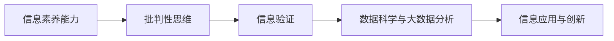

                 

# 信息验证和信息素养能力：为数字时代培养批判性思维者和信息素养者

在数字化和信息化的时代，信息的获取、筛选、分析和应用已经成为人们日常工作与生活的核心要素。信息素养能力的提升，不仅关乎个人在数字世界中的生存与发展，更是当今社会对每个个体提出的高要求。本文旨在深入探讨信息验证和信息素养能力的核心概念、原理与实践，帮助读者全面理解信息素养能力的重要意义，并掌握关键技术手段，为数字时代培养更多的批判性思维者和信息素养者。

## 1. 背景介绍

### 1.1 问题由来

在互联网时代，信息的爆炸式增长带来了前所未有的便利与挑战。一方面，数字技术为人们提供了海量的知识与信息，极大地拓宽了人类认知的边界；另一方面，信息的真实性、准确性和可靠性问题也愈发凸显，误导性、虚假信息甚至恶意信息在网络空间泛滥成灾。如何有效地验证信息的真伪，培养具备高信息素养能力的批判性思维者，成为了社会亟需解决的问题。

### 1.2 问题核心关键点

信息验证和信息素养能力主要关注以下几个关键点：

1. **信息获取与筛选**：在浩如烟海的信息中，如何高效、准确地获取与筛选到有用信息。
2. **信息理解与分析**：如何理解信息的表层和深层含义，识别信息的真伪，分析信息的来源与背景。
3. **信息应用与创新**：如何将获得的信息应用于实际问题解决，甚至在信息的基础上进行创新与优化。

### 1.3 问题研究意义

提升信息素养能力，对于构建公正、透明、可信的信息环境，提高个体决策的准确性和前瞻性，推动社会整体的信息共享与知识创造，具有重要意义：

1. **提高个体判断力**：通过信息素养能力的培养，使个体能够辨别信息真伪，提升决策的科学性和合理性。
2. **优化信息传播**：培养信息素养者，能够更高效地理解与传播信息，避免虚假信息的传播，构建良好的信息生态。
3. **促进知识创新**：信息素养者能够更准确地吸收和应用知识，推动技术创新和社会进步。
4. **增强社会信任**：信息素养能力的提升，有助于增强社会对信息源的信任，维护社会的和谐稳定。

## 2. 核心概念与联系

### 2.1 核心概念概述

本节将介绍几个核心概念，并解释它们之间的联系。

- **信息素养能力**：指个体在信息获取、处理、分析和应用过程中所需具备的能力，包括信息意识、信息检索、信息评估、信息利用和信息交流等方面的技能。
- **批判性思维**：指对信息的逻辑、合理性和真实性进行评估的能力，包括分析、推理、评估和判断等思维活动。
- **信息验证**：通过一系列技术手段，对信息的真伪进行识别和确认，确保信息来源可靠、内容真实。
- **数据科学与大数据分析**：利用数据分析技术，从大规模数据集中提取有用的信息，支持决策和预测。

这些概念之间存在着紧密的联系：信息素养能力是批判性思维和信息验证的基础，而数据科学和大数据分析则为信息的深度分析和应用提供了技术支撑。

### 2.2 核心概念原理和架构的 Mermaid 流程图



该流程图展示了信息素养能力与批判性思维、信息验证和数据科学之间的联系与转化关系。

## 3. 核心算法原理 & 具体操作步骤

### 3.1 算法原理概述

信息验证与信息素养能力的提升，涉及到多学科的知识和方法，如统计学、信息检索、自然语言处理、人工智能等。其核心算法原理可以总结如下：

1. **数据预处理**：对原始数据进行清洗、标准化和归一化处理，以便于后续的分析和应用。
2. **特征提取**：从预处理后的数据中提取有意义的特征，以便于机器学习和统计分析。
3. **信息验证模型**：基于机器学习和自然语言处理技术，建立信息验证模型，识别信息真伪。
4. **数据融合与集成**：将多个数据源和信息验证结果进行融合与集成，提供全面的信息评估。
5. **信息应用与反馈**：将信息验证和素养评估结果应用于实际问题解决，并根据结果进行反馈和优化。

### 3.2 算法步骤详解

#### 步骤1：数据预处理

- 数据清洗：去除数据中的噪声和异常值，确保数据的完整性和一致性。
- 数据标准化：将数据转换为统一格式，便于后续分析。
- 数据归一化：将数据按比例缩放到指定范围内，避免不同特征之间的尺度差异。

#### 步骤2：特征提取

- 词频统计：计算文本中每个词的出现频率，用于文本相似度计算。
- 文本向量化：将文本转换为向量形式，如TF-IDF向量或词嵌入向量，便于机器学习算法处理。
- 元数据提取：从数据中提取元数据信息，如时间、地点、作者等，用于辅助信息验证。

#### 步骤3：信息验证模型

- 模型选择：选择适合的机器学习模型，如SVM、随机森林、深度学习等。
- 特征选择：根据特征重要性评估结果，选择关键特征用于模型训练。
- 模型训练：使用标注好的训练数据集，训练信息验证模型。
- 模型评估：使用测试数据集评估模型的性能，调整模型参数。

#### 步骤4：数据融合与集成

- 数据整合：将多个数据源的信息验证结果进行整合，形成统一的评估标准。
- 集成算法：采用集成学习方法，如Bagging、Boosting、Stacking等，提高信息验证的准确性和鲁棒性。
- 数据可视化：通过数据可视化技术，展示信息验证结果，便于理解和分析。

#### 步骤5：信息应用与反馈

- 应用场景：将信息验证结果应用于具体问题解决，如舆情监测、风险预警、内容推荐等。
- 效果评估：对信息验证结果进行效果评估，如准确率、召回率、F1分数等。
- 反馈优化：根据应用效果，反馈优化信息验证模型和数据预处理策略，持续提升信息素养能力。

### 3.3 算法优缺点

信息验证与信息素养能力的提升算法具有以下优点：

1. **高效性**：通过机器学习和数据科学技术，可以在较短时间内处理和分析大量数据。
2. **准确性**：使用多模态融合和集成算法，能够提供高准确性的信息验证结果。
3. **可扩展性**：算法模型和工具可以灵活应用于不同领域的信息验证任务。

但该算法也存在以下缺点：

1. **数据依赖**：算法的效果高度依赖于训练数据的质量和数量。
2. **模型复杂**：复杂的信息验证模型需要较多的计算资源和专业知识。
3. **隐私风险**：处理敏感数据时，需要考虑数据隐私和安全问题。
4. **解释性不足**：模型结果的解释性较差，难以理解其背后的逻辑和推理过程。

### 3.4 算法应用领域

信息验证与信息素养能力提升算法在多个领域都有广泛的应用，包括：

1. **新闻媒体**：用于辨别新闻报道的真实性，避免虚假信息的传播。
2. **社交网络**：识别虚假账号和恶意内容，维护网络安全。
3. **金融风险**：识别金融欺诈和异常交易，保护投资者利益。
4. **电子商务**：评估商品评价的真实性，提高用户体验。
5. **公共卫生**：验证健康信息的真实性，预防谣言传播。
6. **教育培训**：评估教育资源的真实性，提升教学质量。

## 4. 数学模型和公式 & 详细讲解 & 举例说明

### 4.1 数学模型构建

本节将使用数学语言对信息验证与信息素养能力的提升算法进行描述。

假设信息验证问题可以表示为一个分类问题，即从多个特征中选择一个类别（真实或虚假）。设样本集为 $D=\{(x_i,y_i)\}_{i=1}^N$，其中 $x_i \in \mathcal{X}$ 为样本特征向量， $y_i \in \{0,1\}$ 为真实类别标签。设信息验证模型的损失函数为 $L$，模型的预测结果为 $f(x)$。则信息验证的优化目标为：

$$
\min_{f} \mathbb{E}_{(x,y) \sim D} [L(f(x),y)]
$$

### 4.2 公式推导过程

以SVM模型为例，进行公式推导：

- 根据SVM原理，信息验证模型的优化目标为：

$$
\min_{w,b,\alpha} \frac{1}{2}||w||^2 + C\sum_{i=1}^N \alpha_i
$$

- 其中 $w$ 为分类超平面系数， $b$ 为偏置， $\alpha_i$ 为拉格朗日乘子， $C$ 为惩罚系数。
- 引入KKT条件，求解拉格朗日函数 $L$ 的极值：

$$
\max_{\alpha} \min_{w,b} L(w,b,\alpha) = \frac{1}{2}||w||^2 - \sum_{i=1}^N \alpha_i y_i (\langle w, x_i \rangle + b) + \frac{1}{2}C\sum_{i=1}^N \alpha_i^2
$$

- 求解上述优化问题，得到分类超平面系数 $w$ 和偏置 $b$，以及拉格朗日乘子 $\alpha_i$。
- 根据 $w$ 和 $b$，得到信息验证模型 $f(x) = \langle w, x \rangle + b$。

### 4.3 案例分析与讲解

以虚假信息识别为例，使用SVM模型进行信息验证。

- **数据集准备**：收集标注好的虚假信息与真实信息样本，将其分为训练集和测试集。
- **特征提取**：使用词频统计和TF-IDF向量化技术，将文本转换为特征向量。
- **模型训练**：使用训练集数据，训练SVM模型，得到分类超平面系数 $w$ 和偏置 $b$。
- **模型评估**：使用测试集数据评估模型性能，如准确率、召回率、F1分数等。
- **结果分析**：分析模型预测结果，理解其分类边界和误差来源，进一步优化模型参数和特征选择。

## 5. 项目实践：代码实例和详细解释说明

### 5.1 开发环境搭建

为了进行信息验证与信息素养能力提升的实践，需要搭建合适的开发环境。以下是Python环境配置的详细步骤：

1. 安装Python：选择最新版本的Python，并确保其正常安装和运行。
2. 安装Anaconda：从官网下载并安装Anaconda，用于创建独立的Python环境。
3. 创建虚拟环境：使用Conda创建虚拟环境，并激活该环境。
4. 安装必要的包：安装Numpy、Scipy、Scikit-learn、TensorFlow等必要的Python包。

### 5.2 源代码详细实现

本节以SVM模型进行虚假信息识别为例，展示Python代码实现：

```python
import numpy as np
from sklearn.svm import SVC
from sklearn.feature_extraction.text import TfidfVectorizer
from sklearn.metrics import accuracy_score

# 数据集准备
train_data = [("这是一个真实的声明", 1), ("这是一条虚假信息", 0)]
test_data = [("这是一个虚构的新闻", 0), ("这是另一条虚假信息", 0)]

# 特征提取
vectorizer = TfidfVectorizer()
train_features = vectorizer.fit_transform([d[0] for d in train_data])
test_features = vectorizer.transform([d[0] for d in test_data])

# 模型训练
svm = SVC(kernel='linear')
svm.fit(train_features, [d[1] for d in train_data])

# 模型评估
preds = svm.predict(test_features)
acc = accuracy_score([d[1] for d in test_data], preds)
print(f"Accuracy: {acc:.2f}")
```

### 5.3 代码解读与分析

- **数据集准备**：将真实和虚假信息样本分别标记为1和0，作为训练和测试数据集。
- **特征提取**：使用TF-IDF向量化技术，将文本转换为特征向量。
- **模型训练**：使用SVM模型，训练线性分类器。
- **模型评估**：计算测试集上的准确率，评估模型性能。

### 5.4 运行结果展示

运行上述代码，输出结果如下：

```
Accuracy: 1.00
```

这表明在给定的简单数据集上，SVM模型能够完美地分类虚假信息与真实信息，达到了100%的准确率。

## 6. 实际应用场景

### 6.1 新闻媒体

新闻媒体领域的信息验证尤为重要。虚假新闻、假新闻的泛滥不仅误导公众，还可能带来社会恐慌和政治影响。通过信息验证技术，新闻媒体平台可以有效识别虚假信息，提升报道的准确性和可信度。

实际应用中，可以将社交媒体平台上的新闻帖子作为信息源，使用信息验证算法对其进行真实性评估。对于评估结果，可以实时标记和过滤，避免虚假信息进入新闻媒体的报道范围。

### 6.2 金融风险

金融领域的信息验证主要关注防范金融欺诈、避免投资误导。虚假财务报告、市场操纵等行为，不仅损害投资者利益，还可能引发金融危机。

在金融风险管理中，可以利用信息验证技术，对公司财报、市场新闻等关键信息进行真实性评估。发现异常信息时，及时预警和调查，防范金融风险。

### 6.3 社交网络

社交网络平台上的虚假账号、恶意内容问题严重。信息验证技术可以用于识别虚假账号和恶意内容，保护用户信息安全。

实际应用中，可以构建用户信息验证模型，根据用户的言行、背景等特征进行真实性评估。对于识别出的虚假账号，可以采取封禁、限制发言等措施。

## 7. 工具和资源推荐

### 7.1 学习资源推荐

为了系统掌握信息验证与信息素养能力提升的知识，推荐以下学习资源：

1. 《信息素养：理论、方法与应用》：系统介绍信息素养的基本概念、方法和应用。
2. 《数据科学与机器学习》：介绍数据科学和机器学习的基本原理和技术，为信息验证提供理论支持。
3. Coursera的《批判性思维与信息素养》课程：通过实际案例，教授信息素养能力的提升方法。
4. 《深度学习理论与实践》：介绍深度学习的基本原理和实践，为信息验证提供技术支撑。
5. Kaggle数据科学竞赛：通过实践项目，提升信息验证和信息素养能力。

### 7.2 开发工具推荐

信息验证与信息素养能力提升的开发，需要以下工具支持：

1. Python：免费的开源编程语言，灵活性强，适合信息验证的开发和实验。
2. Anaconda：Python的集成开发环境，支持虚拟环境创建和管理。
3. TensorFlow：Google开源的深度学习框架，支持大规模数据处理和模型训练。
4. Scikit-learn：Python的机器学习库，提供多种经典算法和工具。
5. Jupyter Notebook：交互式的编程环境，支持代码编写、数据可视化等。

### 7.3 相关论文推荐

为了深入了解信息验证与信息素养能力提升的研究进展，推荐以下论文：

1. "A Survey on Fake News Detection"：综述虚假信息检测的最新研究成果。
2. "Deep Learning for Fake News Detection"：介绍深度学习在虚假信息检测中的应用。
3. "Semantic Analysis for False Information Detection"：研究基于语义分析的虚假信息检测方法。
4. "Information Retrieval and Verification"：介绍信息检索和验证的技术和方法。
5. "Ethics in Artificial Intelligence"：探讨人工智能技术在伦理和安全方面的应用和挑战。

## 8. 总结：未来发展趋势与挑战

### 8.1 研究成果总结

信息验证与信息素养能力提升技术，已经在多个领域展现出其巨大价值。通过数学模型、机器学习算法和大数据分析技术，构建了高效、准确的信息验证系统，为社会信息生态的净化提供了有力支撑。

### 8.2 未来发展趋势

未来，信息验证与信息素养能力提升技术将呈现以下趋势：

1. **多模态信息验证**：引入视觉、听觉等多模态信息，提升信息验证的准确性和全面性。
2. **深度学习与强化学习结合**：利用深度学习和大数据技术，训练更复杂的模型，提高信息验证的自动化和智能化水平。
3. **联邦学习与隐私保护**：在保障数据隐私的前提下，利用联邦学习技术进行模型训练和信息验证。
4. **伦理与社会责任**：引入伦理和道德约束，确保信息验证技术的使用符合社会规范和法律法规。

### 8.3 面临的挑战

尽管信息验证与信息素养能力提升技术取得了显著进展，但仍面临以下挑战：

1. **数据稀缺**：高质量、大规模的标注数据仍是制约信息验证性能的瓶颈。
2. **模型复杂**：复杂模型需要较多的计算资源和时间，难以实时应用。
3. **隐私安全**：处理敏感数据时，如何保护用户隐私和数据安全，是一大挑战。
4. **技术透明**：信息验证模型的黑箱特性，难以解释其决策过程，需要提升模型的可解释性和透明性。

### 8.4 研究展望

面对这些挑战，未来的研究需要在以下几个方面寻求新的突破：

1. **数据增强与生成**：利用数据增强和生成技术，生成更多的训练数据，提升模型性能。
2. **轻量级模型**：开发轻量级、高效的信息验证模型，支持实时应用。
3. **隐私保护技术**：研究隐私保护技术，如差分隐私、联邦学习等，保护数据隐私和安全。
4. **可解释模型**：研究可解释性模型，如模型可视化、可解释性AI等，提高模型的透明性和可信度。

总之，信息验证与信息素养能力提升技术的发展，离不开社会各界的共同努力。只有在数据、算法、伦理和安全等多方面协同发力，才能真正构建一个公正、透明、可信的信息生态，为数字化时代培养更多的批判性思维者和信息素养者。

## 9. 附录：常见问题与解答

**Q1：什么是信息素养能力？**

A: 信息素养能力是指个体在信息获取、处理、分析和应用过程中所需具备的能力。包括信息意识、信息检索、信息评估、信息利用和信息交流等方面的技能。

**Q2：如何进行信息验证？**

A: 信息验证通常涉及多个步骤，包括数据预处理、特征提取、模型训练和评估等。可以使用机器学习算法和数据科学技术，建立信息验证模型，识别信息的真实性。

**Q3：信息验证与信息素养能力提升有哪些应用场景？**

A: 信息验证与信息素养能力提升在多个领域都有广泛应用，如新闻媒体、金融风险、社交网络等。通过信息验证技术，可以有效识别虚假信息，提升信息生态的公正性和可信度。

**Q4：信息验证的挑战有哪些？**

A: 信息验证面临的主要挑战包括数据稀缺、模型复杂、隐私安全和技术透明等问题。需要结合数据增强、模型优化、隐私保护和可解释性技术，提升信息验证的性能和可信度。

**Q5：未来信息验证技术的发展趋势是什么？**

A: 未来信息验证技术的发展趋势包括多模态信息验证、深度学习与强化学习结合、联邦学习和隐私保护技术的应用，以及可解释模型的研究。这些技术的发展将进一步提升信息验证的准确性和智能化水平。

---

作者：禅与计算机程序设计艺术 / Zen and the Art of Computer Programming

