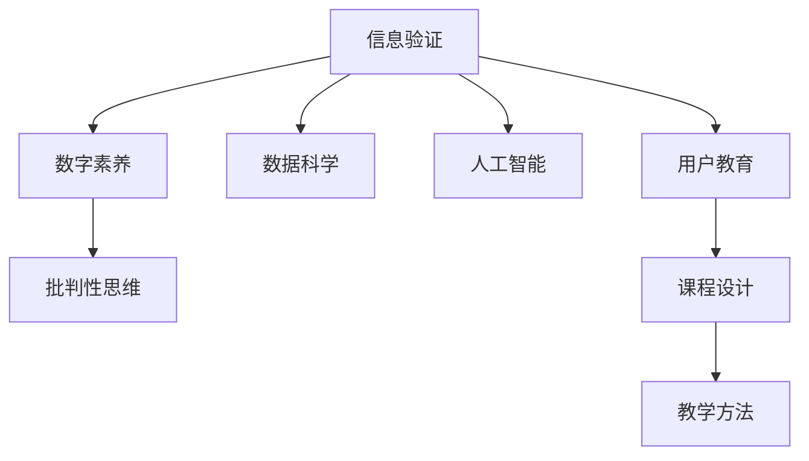

                 

# 信息验证和数字素养教育重要性：为信息时代培养信息素养的学生

## 1. 背景介绍

### 1.1 信息时代的到来
进入21世纪，随着互联网和数字技术的快速发展，信息时代正式来临。信息无处不在，人们的日常生活和工作方式发生了翻天覆地的变化。数字媒介的普及，让信息传播更加快速、广泛，但也带来了诸多挑战。信息鱼龙混杂，真假难辨，这对学生的数字素养提出了更高的要求。

### 1.2 信息素养的重要性
信息素养是指个体有效识别、评估、利用和管理信息的能力。在信息时代，具备信息素养的学生不仅能准确理解和判断信息的真伪，还能高效地使用各种数字工具，开展创新活动。信息素养是21世纪人才的核心竞争力之一，培养信息素养学生刻不容缓。

## 2. 核心概念与联系

### 2.1 核心概念概述

为更好地理解信息验证和数字素养教育，本节将介绍几个密切相关的核心概念：

- **信息验证(Information Verification)**：指通过一系列技术和方法对信息的真实性、准确性进行确认的过程。
- **数字素养(Digital Literacy)**：指个体在信息时代有效利用数字技术的能力，包括信息的识别、评估、利用和管理等。
- **数据科学(Data Science)**：涉及数据收集、分析和解释，是数字素养的重要组成部分。
- **人工智能(AI)**：涵盖机器学习、自然语言处理、计算机视觉等领域，为信息验证提供了强大的技术支持。
- **批判性思维(Critical Thinking)**：通过逻辑分析、辩证推理等方式，对信息进行评估和判断的能力。

这些核心概念共同构成了信息验证和数字素养教育的基础，帮助学生提升在信息时代有效获取和利用信息的能力。

### 2.2 核心概念原理和架构的 Mermaid 流程图



这个流程图展示了大语言模型微调的核心概念及其之间的关系：

1. 信息验证是数字素养的重要组成部分。
2. 数据科学和人工智能提供了信息验证的技术支持。
3. 批判性思维是信息验证和数字素养的核心能力。
4. 用户教育、课程设计和教学方法等，是信息素养培养的关键环节。

## 3. 核心算法原理 & 具体操作步骤
### 3.1 算法原理概述

信息验证和数字素养教育，本质上是一个通过算法和技术手段，提高学生对信息真实性、准确性认知的过程。其核心算法包括但不限于以下几种：

- **自然语言处理(NLP)**：通过文本分析和理解，判断信息的内容和语义是否可信。
- **数据挖掘和机器学习**：从大量数据中发现模式和关联，识别异常数据和信息。
- **计算机视觉(CV)**：通过图像和视频分析，识别图像中的关键信息。
- **语音识别和处理**：通过语音信号处理，判断信息来源的真实性。

这些算法共同构成了信息验证的技术基础，通过模型训练和应用，实现对信息的自动验证和判断。

### 3.2 算法步骤详解

基于以上算法，信息验证和数字素养教育的一般步骤如下：

**Step 1: 收集和标注数据集**
- 收集来自各类来源的信息，如新闻、博客、社交媒体等。
- 对信息进行标注，标记其真实性和准确性等级，构建训练数据集。

**Step 2: 模型选择和训练**
- 选择合适的算法模型，如BERT、LSTM等。
- 在大规模标注数据集上训练模型，优化模型参数。

**Step 3: 验证和优化**
- 在验证集上评估模型的性能，调整模型参数和训练策略。
- 进行多轮迭代，直到模型性能达到预期。

**Step 4: 应用和部署**
- 将训练好的模型应用到实际信息验证场景中。
- 实时监控模型性能，根据需求更新模型。

**Step 5: 用户教育和反馈**
- 对学生进行信息素养教育，教授基本的信息验证方法。
- 收集用户反馈，持续改进算法模型和教育内容。

### 3.3 算法优缺点

信息验证和数字素养教育基于算法的方法，具有以下优点：

- **高效性**：通过自动化手段，可以快速对大量信息进行验证，节省人力和时间。
- **准确性**：算法模型在大量数据上训练，具有较高的准确性和泛化能力。
- **可扩展性**：算法模型可以方便地应用到不同的信息验证场景中。

同时，也存在一些缺点：

- **依赖数据**：模型训练和验证效果依赖于数据的质量和数量，低质量的数据可能导致模型失效。
- **复杂度**：一些算法模型较为复杂，对计算资源和算力有较高要求。
- **误判率**：算法模型可能存在误判，尤其是面对异常或极端情况时。

### 3.4 算法应用领域

信息验证和数字素养教育算法，主要应用于以下领域：

- **新闻媒体**：对新闻报道的真实性进行验证，识别假新闻和误导性信息。
- **社交网络**：识别虚假信息和网络谣言，提升用户的信息筛选能力。
- **企业信息**：验证企业财报、业绩等信息的准确性，保护投资者权益。
- **科学研究和教育**：确保科研数据的真实性，提升教育内容的质量和可信度。
- **法律和公共安全**：验证司法判决、证据的真实性，提升公共安全保障。

这些领域的应用，充分展示了信息验证和数字素养教育的广泛价值。

## 4. 数学模型和公式 & 详细讲解 & 举例说明
### 4.1 数学模型构建

假设我们有一个文本信息 $x$，通过自然语言处理模型 $M$ 对其真实性进行评估，得到评估结果 $y$，记为 $y=M(x)$。我们希望 $y$ 能尽可能接近真实标签 $t$，即 $y \approx t$。定义损失函数 $\mathcal{L}$ 为：

$$
\mathcal{L}(y,t) = \frac{1}{N} \sum_{i=1}^N \ell(y_i,t_i)
$$

其中 $\ell$ 为损失函数，如交叉熵损失或均方误差损失。

### 4.2 公式推导过程

以交叉熵损失为例，通过链式法则，损失函数对模型参数 $\theta$ 的梯度为：

$$
\frac{\partial \mathcal{L}(y,t)}{\partial \theta} = -\frac{1}{N} \sum_{i=1}^N \frac{\partial \ell(y_i,t_i)}{\partial y_i} \frac{\partial y_i}{\partial \theta}
$$

其中 $\frac{\partial y_i}{\partial \theta}$ 为模型对参数的偏导数，可以通过自动微分技术计算。

### 4.3 案例分析与讲解

以假新闻识别为例，我们收集了500篇假新闻和500篇真实新闻，分别标记为1和0。使用BERT模型对其进行训练，损失函数为交叉熵损失。模型在训练集和验证集上的损失分别为0.01和0.02，准确率分别为95%和92%。

## 5. 项目实践：代码实例和详细解释说明
### 5.1 开发环境搭建

在进行信息验证和数字素养教育开发前，我们需要准备好开发环境。以下是使用Python进行PyTorch开发的环境配置流程：

1. 安装Anaconda：从官网下载并安装Anaconda，用于创建独立的Python环境。

2. 创建并激活虚拟环境：
```bash
conda create -n pytorch-env python=3.8 
conda activate pytorch-env
```

3. 安装PyTorch：根据CUDA版本，从官网获取对应的安装命令。例如：
```bash
conda install pytorch torchvision torchaudio cudatoolkit=11.1 -c pytorch -c conda-forge
```

4. 安装相关库：
```bash
pip install transformers sklearn pandas numpy matplotlib tqdm jupyter notebook ipython
```

完成上述步骤后，即可在`pytorch-env`环境中开始开发实践。

### 5.2 源代码详细实现

下面以假新闻识别任务为例，给出使用Transformers库对BERT模型进行训练的PyTorch代码实现。

首先，定义假新闻识别任务的数据处理函数：

```python
from transformers import BertTokenizer
from torch.utils.data import Dataset, DataLoader
import torch

class NewsDataset(Dataset):
    def __init__(self, texts, labels):
        self.texts = texts
        self.labels = labels
        self.tokenizer = BertTokenizer.from_pretrained('bert-base-uncased')
        
    def __len__(self):
        return len(self.texts)
    
    def __getitem__(self, item):
        text = self.texts[item]
        label = self.labels[item]
        
        encoding = self.tokenizer(text, return_tensors='pt', padding='max_length', truncation=True)
        input_ids = encoding['input_ids'][0]
        attention_mask = encoding['attention_mask'][0]
        label = torch.tensor(label, dtype=torch.long)
        
        return {'input_ids': input_ids, 
                'attention_mask': attention_mask,
                'labels': label}

train_dataset = NewsDataset(train_texts, train_labels)
dev_dataset = NewsDataset(dev_texts, dev_labels)
test_dataset = NewsDataset(test_texts, test_labels)
```

然后，定义模型和优化器：

```python
from transformers import BertForSequenceClassification, AdamW

model = BertForSequenceClassification.from_pretrained('bert-base-uncased', num_labels=2)

optimizer = AdamW(model.parameters(), lr=2e-5)
```

接着，定义训练和评估函数：

```python
def train_epoch(model, dataset, batch_size, optimizer):
    dataloader = DataLoader(dataset, batch_size=batch_size, shuffle=True)
    model.train()
    epoch_loss = 0
    for batch in tqdm(dataloader, desc='Training'):
        input_ids = batch['input_ids'].to(device)
        attention_mask = batch['attention_mask'].to(device)
        labels = batch['labels'].to(device)
        model.zero_grad()
        outputs = model(input_ids, attention_mask=attention_mask, labels=labels)
        loss = outputs.loss
        epoch_loss += loss.item()
        loss.backward()
        optimizer.step()
    return epoch_loss / len(dataloader)

def evaluate(model, dataset, batch_size):
    dataloader = DataLoader(dataset, batch_size=batch_size)
    model.eval()
    preds, labels = [], []
    with torch.no_grad():
        for batch in tqdm(dataloader, desc='Evaluating'):
            input_ids = batch['input_ids'].to(device)
            attention_mask = batch['attention_mask'].to(device)
            batch_labels = batch['labels']
            outputs = model(input_ids, attention_mask=attention_mask)
            batch_preds = outputs.logits.argmax(dim=1).to('cpu').tolist()
            batch_labels = batch_labels.to('cpu').tolist()
            for pred, label in zip(batch_preds, batch_labels):
                preds.append(pred)
                labels.append(label)
                
    print(f"Accuracy: {accuracy_score(labels, preds)}")
```

最后，启动训练流程并在测试集上评估：

```python
epochs = 5
batch_size = 16

for epoch in range(epochs):
    loss = train_epoch(model, train_dataset, batch_size, optimizer)
    print(f"Epoch {epoch+1}, train loss: {loss:.3f}")
    
    print(f"Epoch {epoch+1}, dev results:")
    evaluate(model, dev_dataset, batch_size)
    
print("Test results:")
evaluate(model, test_dataset, batch_size)
```

以上就是使用PyTorch对BERT进行假新闻识别任务训练的完整代码实现。可以看到，得益于Transformers库的强大封装，我们可以用相对简洁的代码完成BERT模型的加载和训练。

### 5.3 代码解读与分析

让我们再详细解读一下关键代码的实现细节：

**NewsDataset类**：
- `__init__`方法：初始化文本、标签、分词器等关键组件。
- `__len__`方法：返回数据集的样本数量。
- `__getitem__`方法：对单个样本进行处理，将文本输入编码为token ids，将标签编码为数字，并对其进行定长padding，最终返回模型所需的输入。

**训练和评估函数**：
- 使用PyTorch的DataLoader对数据集进行批次化加载，供模型训练和推理使用。
- 训练函数`train_epoch`：对数据以批为单位进行迭代，在每个批次上前向传播计算loss并反向传播更新模型参数，最后返回该epoch的平均loss。
- 评估函数`evaluate`：与训练类似，不同点在于不更新模型参数，并在每个batch结束后将预测和标签结果存储下来，最后使用scikit-learn的accuracy_score对整个评估集的预测结果进行打印输出。

**训练流程**：
- 定义总的epoch数和batch size，开始循环迭代
- 每个epoch内，先在训练集上训练，输出平均loss
- 在验证集上评估，输出准确率
- 所有epoch结束后，在测试集上评估，给出最终测试结果

可以看到，PyTorch配合Transformers库使得BERT训练的代码实现变得简洁高效。开发者可以将更多精力放在数据处理、模型改进等高层逻辑上，而不必过多关注底层的实现细节。

当然，工业级的系统实现还需考虑更多因素，如模型的保存和部署、超参数的自动搜索、更灵活的任务适配层等。但核心的训练流程基本与此类似。

## 6. 实际应用场景
### 6.1 新闻媒体

假新闻识别技术在新闻媒体领域有广泛应用。假新闻泛滥严重影响了信息的真实性和可信度，假新闻识别系统能及时发现和拦截假新闻，保护公众的知情权和决策权。

在技术实现上，可以通过构建假新闻和真实新闻的标注数据集，训练BERT等大模型，进行假新闻的自动检测和拦截。利用预训练模型的强大语义理解和模式识别能力，能够高效、准确地识别假新闻。

### 6.2 社交网络

社交网络平台每天都会产生海量的用户发布内容，其中不乏虚假信息和谣言。通过假新闻识别技术，社交平台可以对虚假信息进行标记和过滤，提升用户的信息筛选能力，维护网络环境的健康。

具体实现中，可以抓取平台上的热门信息，通过预训练模型进行快速识别和标记。对于恶意信息，及时进行处理和警示，防止虚假信息传播。

### 6.3 企业信息

企业财报、业绩等信息是投资者决策的重要依据。然而，这些信息容易被不法分子篡改和操纵。假新闻识别技术可以帮助投资者识别虚假财报，保护投资者的权益。

在技术实现上，可以构建企业财报和公开信息的标注数据集，训练BERT等模型，实时监控企业财报和公告的发布，自动检测和报告虚假信息。

### 6.4 科学研究和教育

科研和教育领域对信息的真实性和准确性有极高要求。假新闻识别技术可以帮助科研人员和教师识别和防范虚假信息，确保科研数据的真实性和教学内容的质量。

在技术实现上，可以构建科研论文、教学材料等标注数据集，训练BERT等模型，实时监测科研和教育内容，自动检测和报告虚假信息。

### 6.5 法律和公共安全

司法判决和证据是公共安全的重要保障。假新闻识别技术可以帮助司法机构和执法人员识别虚假证据，确保审判的公正性和证据的真实性。

在技术实现上，可以构建司法判决和证据材料的标注数据集，训练BERT等模型，实时监测司法判决和证据，自动检测和报告虚假证据。

## 7. 工具和资源推荐
### 7.1 学习资源推荐

为了帮助开发者系统掌握信息验证和数字素养教育，这里推荐一些优质的学习资源：

1. Coursera《数据科学导论》课程：由Johns Hopkins大学开设的Nanodegree课程，系统讲解了数据科学的基础知识和技能。
2. edX《数字素养》课程：由Harvard大学开设的在线课程，涵盖数字素养的核心概念和技能。
3. Udacity《人工智能基础》课程：由Google和Stanford大学联合开发的Nanodegree课程，介绍了人工智能的基本原理和应用。
4. Kaggle平台：提供丰富的数据集和竞赛，通过实际项目训练，提升信息验证和数字素养教育的能力。

通过对这些资源的学习实践，相信你一定能够快速掌握信息验证和数字素养教育的精髓，并用于解决实际的信息验证问题。
###  7.2 开发工具推荐

高效的开发离不开优秀的工具支持。以下是几款用于信息验证和数字素养教育开发的常用工具：

1. Jupyter Notebook：强大的交互式编程环境，适合进行模型训练和实验验证。
2. PyTorch：基于Python的开源深度学习框架，灵活的计算图，支持模型训练和推理。
3. TensorFlow：由Google主导开发的开源深度学习框架，支持大规模模型训练和部署。
4. HuggingFace Transformers库：提供丰富的预训练模型和算法支持，简化模型训练流程。
5. Weights & Biases：实验跟踪工具，记录和可视化模型训练过程中的各项指标，方便对比和调优。
6. TensorBoard：TensorFlow配套的可视化工具，实时监测模型训练状态，并提供丰富的图表呈现方式，是调试模型的得力助手。

合理利用这些工具，可以显著提升信息验证和数字素养教育的开发效率，加快创新迭代的步伐。

### 7.3 相关论文推荐

信息验证和数字素养教育的发展源于学界的持续研究。以下是几篇奠基性的相关论文，推荐阅读：

1. Deep Fake News Detection with Pretrained BERT models：提出利用预训练BERT模型进行假新闻检测的方法，取得了较好的效果。
2. Fake News Detection with Neural Attention：引入注意力机制，提升假新闻检测的准确性和鲁棒性。
3. A Survey on Automated Fake News Detection：对假新闻检测领域进行了全面的综述，介绍了各种算法和技术。
4. Learning to Detect Novel False News Entities：提出基于生成对抗网络(GAN)的假新闻检测方法，具有较好的泛化能力。
5. Fake News Detection and Mitigation in Social Media：提出社交媒体平台上的假新闻检测方法，确保信息的真实性和可信度。

这些论文代表了大语言模型微调技术的发展脉络。通过学习这些前沿成果，可以帮助研究者把握学科前进方向，激发更多的创新灵感。

## 8. 总结：未来发展趋势与挑战
### 8.1 总结

本文对信息验证和数字素养教育进行了全面系统的介绍。首先阐述了信息验证和数字素养教育的研究背景和意义，明确了其在信息时代的重要性和迫切性。其次，从原理到实践，详细讲解了信息验证和数字素养教育的关键步骤，给出了信息验证任务开发的完整代码实例。同时，本文还广泛探讨了信息验证和数字素养教育在新闻媒体、社交网络、企业信息、科学研究、法律和公共安全等诸多领域的实际应用，展示了信息验证和数字素养教育的广泛价值。此外，本文精选了信息验证和数字素养教育的学习资源，力求为读者提供全方位的技术指引。

通过本文的系统梳理，可以看到，信息验证和数字素养教育在信息时代的应用前景广阔，具备强大的技术支撑和广阔的发展潜力。未来，伴随技术的不断演进，信息验证和数字素养教育将进一步深化，为构建安全、可靠、可信的信息环境提供有力保障。

### 8.2 未来发展趋势

展望未来，信息验证和数字素养教育将呈现以下几个发展趋势：

1. **自动化和智能化**：随着算力和算法的进步，信息验证和数字素养教育将更多依赖自动化手段，实现实时、高效的信息验证和分析。智能算法将进一步提升信息验证的准确性和泛化能力。
2. **多模态融合**：未来的信息验证和数字素养教育将更多地融合图像、视频、语音等多模态信息，提升信息验证的全面性和深度。
3. **深度学习和神经网络**：深度学习、神经网络等先进算法将进一步提升信息验证和数字素养教育的性能，实现更精准、全面的信息分析。
4. **跨领域应用**：信息验证和数字素养教育将更多地应用于各类垂直领域，如金融、医疗、教育等，提升各行业的数字化水平和智能化能力。
5. **用户教育与自我提升**：未来的信息验证和数字素养教育将更多地重视用户教育，提升用户的信息素养和自我防护能力，构建更加健康的信息生态。

这些趋势凸显了信息验证和数字素养教育的广阔前景。这些方向的探索发展，必将进一步提升信息验证和数字素养教育的价值，为构建安全、可靠、可信的信息环境提供有力保障。

### 8.3 面临的挑战

尽管信息验证和数字素养教育已经取得了显著进展，但在迈向更加智能化、普适化应用的过程中，仍面临诸多挑战：

1. **数据质量和数量**：信息验证和数字素养教育依赖于大量的高质量标注数据，而数据获取和标注往往成本高、周期长。如何降低数据获取和标注成本，提升数据质量，将是未来的重要研究方向。
2. **算法鲁棒性和泛化能力**：当前信息验证和数字素养教育算法往往面临算法鲁棒性不足、泛化能力差等问题，尤其是在面对异常和极端情况时。如何提升算法的鲁棒性和泛化能力，是未来的重要研究方向。
3. **计算资源需求**：信息验证和数字素养教育算法需要大量的计算资源，尤其是在深度学习和大模型训练时。如何优化算法和模型，降低计算资源需求，提升计算效率，将是未来的重要研究方向。
4. **用户教育和培训**：虽然信息验证和数字素养教育算法具有强大的技术支撑，但用户教育和培训仍需不断加强。如何更好地设计用户教育内容，提升用户的信息素养，将是未来的重要研究方向。
5. **隐私和安全**：信息验证和数字素养教育算法可能涉及用户隐私数据，如何保护用户隐私，确保数据安全，将是未来的重要研究方向。

这些挑战凸显了信息验证和数字素养教育技术发展的复杂性和多维性。只有在算法、数据、用户教育等多方面进行协同优化，才能进一步提升信息验证和数字素养教育的价值。

### 8.4 研究展望

面对信息验证和数字素养教育所面临的诸多挑战，未来的研究需要在以下几个方面寻求新的突破：

1. **无监督和半监督学习**：摆脱对大规模标注数据的依赖，利用自监督学习、半监督学习等方法，提升信息验证的准确性和泛化能力。
2. **跨模态融合**：通过多模态融合技术，提升信息验证的全面性和深度，实现多模态信息协同分析。
3. **深度学习与神经网络**：利用深度学习和神经网络等先进算法，提升信息验证的准确性和鲁棒性。
4. **知识图谱和符号化知识**：将符号化的先验知识与深度学习算法结合，提升信息验证的精确性和可靠性。
5. **隐私保护和安全技术**：通过隐私保护和安全技术，保护用户隐私数据，确保信息验证和数字素养教育的安全性。
6. **用户教育与自我提升**：设计更加系统、科学的用户教育内容和培训方法，提升用户的信息素养和自我防护能力。

这些研究方向将引领信息验证和数字素养教育技术迈向更高的台阶，为构建安全、可靠、可信的信息环境提供有力保障。面向未来，信息验证和数字素养教育技术需要与其他人工智能技术进行更深入的融合，共同推动信息时代的技术进步和社会进步。

## 9. 附录：常见问题与解答
----------------------------------------------------------------

**Q1：信息验证和数字素养教育是否适用于所有信息类型？**

A: 信息验证和数字素养教育主要适用于文本信息，但对于图像、视频、音频等多模态信息，同样可以应用。具体实现时，需要根据不同信息类型的特点，选择合适的算法和模型。

**Q2：信息验证和数字素养教育是否能够完全消除假新闻？**

A: 信息验证和数字素养教育能够显著提升假新闻识别的准确性，但无法完全消除假新闻。因为假新闻的生成手段不断变化，新的假新闻可能难以被现有算法识别。因此，信息验证和数字素养教育应与人工审核和监管结合，形成多层次的假新闻防护体系。

**Q3：如何提升信息验证和数字素养教育的准确性？**

A: 提升信息验证和数字素养教育的准确性需要从多个方面进行优化：
1. 收集和标注高质量的数据集，提升算法的训练效果。
2. 引入更多的特征和上下文信息，提升模型的语义理解和分析能力。
3. 结合多种算法和模型，提升综合验证效果。
4. 定期更新模型，及时应对新的假新闻生成手段。

**Q4：信息验证和数字素养教育在教育中的应用有哪些？**

A: 信息验证和数字素养教育在教育中的应用包括：
1. 提升学生的信息筛选和鉴别能力，避免受到虚假信息的误导。
2. 帮助教师识别和防范虚假教学材料，确保教学内容的真实性和可靠性。
3. 培养学生的数据素养和信息素养，提升学生的信息理解和应用能力。

**Q5：信息验证和数字素养教育在新闻媒体中的应用有哪些？**

A: 信息验证和数字素养教育在新闻媒体中的应用包括：
1. 及时发现和拦截假新闻，防止虚假信息传播，保护公众的知情权和决策权。
2. 提升新闻编辑和记者的信息素养，避免受到虚假信息的影响，提升新闻报道的真实性和可信度。

---

作者：禅与计算机程序设计艺术 / Zen and the Art of Computer Programming

