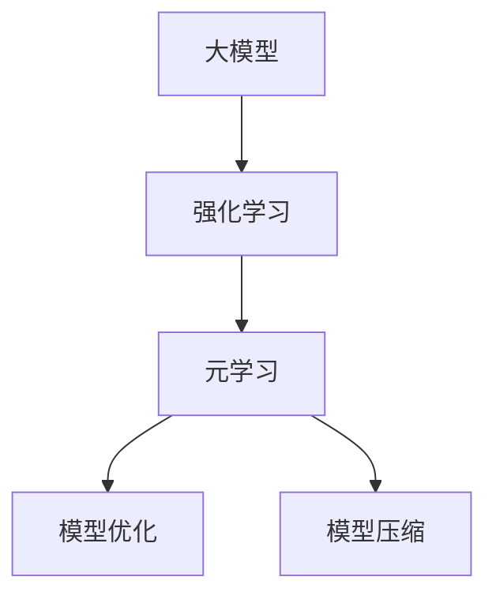

                 

# 元强化学习在大模型决策中的应用

> 关键词：强化学习, 大模型, 决策树, 模型优化, 深度强化学习, 算法步骤, 案例分析

## 1. 背景介绍

### 1.1 问题由来
近年来，随着人工智能技术的快速发展，大模型在决策领域的应用越来越广泛。从金融风险管理到医疗诊断，从机器人控制到自动驾驶，大模型都展现出了强大的决策能力。然而，大模型的决策过程往往复杂且难以解释，这使得在实际应用中对其进行有效管理变得更加困难。元强化学习（Meta Reinforcement Learning, MRL）作为一种新兴的技术，能够帮助更好地理解大模型的决策过程，从而实现更好的决策优化。

### 1.2 问题核心关键点
元强化学习是一种通过学习如何学习的方法，旨在提高大模型的决策能力和泛化能力。在实际应用中，元强化学习可以通过以下关键点来优化大模型的决策：

1. **模型探索**：通过元学习，发现最优的模型结构、参数设置和训练方法，从而在大规模数据集上进行更高效的模型训练。
2. **任务适应**：通过元学习，提升模型对不同任务和数据分布的适应能力，实现更好的泛化效果。
3. **决策优化**：通过元学习，优化决策过程中的奖励函数和策略，使得模型能够更准确地预测和决策。
4. **模型压缩**：通过元学习，压缩大模型的参数和计算资源，提高模型的实时性和可解释性。

### 1.3 问题研究意义
元强化学习在大模型决策中的应用，对于提升决策系统的性能和可靠性，推动人工智能技术在实际领域中的应用，具有重要意义：

1. **提升决策效率**：元强化学习可以优化大模型的决策过程，减少无效的模型训练和决策过程，提高决策效率。
2. **增强决策效果**：通过元学习，大模型可以更好地适应新任务和数据分布，从而提升决策的准确性和可靠性。
3. **降低开发成本**：元强化学习可以通过优化模型参数和训练方法，降低模型开发和维护的成本。
4. **提高可解释性**：元强化学习可以使得大模型的决策过程更加透明和可解释，帮助用户理解和信任模型的决策。
5. **促进产业升级**：元强化学习可以推动人工智能技术在更多领域的应用，如金融、医疗、交通等，促进产业升级和经济社会发展。

## 2. 核心概念与联系

### 2.1 核心概念概述

为更好地理解元强化学习在大模型决策中的应用，本节将介绍几个密切相关的核心概念：

- **大模型**：以深度神经网络为代表的、在大规模数据集上预训练得到的模型，具有强大的特征提取和决策能力。
- **强化学习**：一种通过试错方法，使得智能体（如模型）在环境中逐步优化其策略的方法。
- **元学习**：一种通过学习如何学习的方法，旨在提高模型对新任务的适应能力。
- **模型优化**：通过优化模型的参数和结构，提升模型的决策能力和泛化能力。
- **模型压缩**：通过减少模型的参数和计算资源，提高模型的实时性和可解释性。

这些核心概念之间的逻辑关系可以通过以下Mermaid流程图来展示：



这个流程图展示了大模型决策中各核心概念的相互关系：

1. 大模型通过预训练获得基础能力。
2. 强化学习通过试错方法，优化大模型的决策过程。
3. 元学习通过学习如何学习，提高大模型对新任务的适应能力。
4. 模型优化通过调整模型参数和结构，提升决策效果。
5. 模型压缩通过减少计算资源，提高实时性和可解释性。

## 3. 核心算法原理 & 具体操作步骤
### 3.1 算法原理概述

元强化学习在大模型决策中的应用，本质上是利用强化学习的方法，通过元学习优化大模型的决策过程。具体而言，元学习旨在优化大模型在特定任务上的性能，通过学习最优的模型结构和训练方法，从而在大规模数据集上进行更高效的模型训练。

形式化地，假设大模型为 $M_{\theta}$，其中 $\theta$ 为模型的参数。给定一个任务 $T$，元学习的目标是找到最优的模型参数 $\hat{\theta}$，使得：

$$
\hat{\theta}=\mathop{\arg\min}_{\theta} \mathcal{L}(M_{\theta},T)
$$

其中 $\mathcal{L}$ 为针对任务 $T$ 设计的损失函数，用于衡量模型在任务上的性能。常见的损失函数包括交叉熵损失、均方误差损失等。

### 3.2 算法步骤详解

元强化学习在大模型决策中的应用，一般包括以下几个关键步骤：

**Step 1: 准备预训练模型和数据集**
- 选择合适的预训练语言模型 $M_{\theta}$ 作为初始化参数，如 BERT、GPT等。
- 准备目标任务 $T$ 的标注数据集 $D$，划分为训练集、验证集和测试集。一般要求标注数据与预训练数据的分布不要差异过大。

**Step 2: 定义奖励函数**
- 根据任务类型，设计合适的奖励函数，用于评估模型的决策性能。奖励函数通常由专家设定或通过优化算法自适应确定。

**Step 3: 设计元学习算法**
- 选择合适的元学习算法，如贝叶斯优化、协方差矩阵更新等。
- 设置元学习的超参数，如元学习次数、搜索范围等。

**Step 4: 执行元学习**
- 将模型 $M_{\theta}$ 应用于目标任务 $T$，根据奖励函数计算损失，形成新的任务。
- 在新的任务上执行强化学习，通过试错方法不断优化模型的决策策略。
- 重复上述过程，直到达到预设的元学习次数或收敛条件。

**Step 5: 微调模型**
- 根据元学习得到的模型参数，对大模型进行微调。
- 设置微调超参数，选择合适的优化算法和正则化技术。
- 在目标任务上执行微调，优化模型性能。

**Step 6: 测试和部署**
- 在测试集上评估微调后模型 $M_{\hat{\theta}}$ 的性能，对比微调前后的精度提升。
- 使用微调后的模型对新样本进行推理预测，集成到实际的应用系统中。
- 持续收集新的数据，定期重新微调模型，以适应数据分布的变化。

以上是元强化学习在大模型决策中的基本流程。在实际应用中，还需要针对具体任务的特点，对元学习过程的各个环节进行优化设计，如改进奖励函数，引入更多的正则化技术，搜索最优的超参数组合等，以进一步提升模型性能。

### 3.3 算法优缺点

元强化学习在大模型决策中的应用，具有以下优点：
1. 优化高效。元学习可以迅速找到最优的模型结构和训练方法，大幅提升模型训练效率。
2. 泛化能力强。元学习通过优化模型在特定任务上的性能，提升模型的泛化能力，适应不同任务和数据分布。
3. 适应性好。元学习可以根据不同的任务和数据分布，灵活调整模型的结构和参数。
4. 可解释性强。元学习可以使得模型的决策过程更加透明和可解释，帮助用户理解和信任模型的决策。

同时，该方法也存在一定的局限性：
1. 对数据依赖强。元学习需要大量的标注数据和计算资源，才能找到最优的模型结构和训练方法。
2. 超参数敏感。元学习的性能很大程度上依赖于超参数的设置，需要详细的调参和优化。
3. 计算复杂度高。元学习的计算复杂度高，需要较强的计算能力和硬件支持。
4. 可解释性不足。元学习模型往往较复杂，难以解释其内部工作机制和决策逻辑。

尽管存在这些局限性，但就目前而言，元强化学习在大模型决策中的应用，仍然是一种有效的优化手段。未来相关研究的重点在于如何进一步降低元学习对数据和计算资源的依赖，提高模型的可解释性和鲁棒性，同时兼顾计算效率和模型性能。

### 3.4 算法应用领域

元强化学习在大模型决策中的应用，已经涵盖了金融、医疗、交通、制造等多个领域，成为推动人工智能技术在实际应用中落地的重要手段。

**金融领域**：元强化学习可以应用于风险评估、交易策略优化、反欺诈检测等任务，通过优化模型在特定任务上的性能，提高金融决策的准确性和效率。

**医疗领域**：元强化学习可以应用于疾病诊断、治疗方案优化、医疗影像分析等任务，通过优化模型在特定任务上的性能，提高医疗决策的准确性和可靠性。

**交通领域**：元强化学习可以应用于交通流量预测、自动驾驶、车辆调度等任务，通过优化模型在特定任务上的性能，提高交通系统的运行效率和安全性。

**制造领域**：元强化学习可以应用于设备预测维护、生产调度优化、质量控制等任务，通过优化模型在特定任务上的性能，提高制造系统的运行效率和稳定性。

除了上述这些经典领域外，元强化学习还被创新性地应用于更多场景中，如供应链管理、智能家居、智能物流等，为各行各业带来了新的技术突破。

## 4. 数学模型和公式 & 详细讲解  
### 4.1 数学模型构建

本节将使用数学语言对元强化学习在大模型决策中的应用进行更加严格的刻画。

记大模型为 $M_{\theta}$，其中 $\theta$ 为模型参数。假设目标任务为 $T$，其标注数据集为 $D=\{(x_i,y_i)\}_{i=1}^N, x_i \in \mathcal{X}, y_i \in \mathcal{Y}$。

定义奖励函数 $R: \mathcal{X} \times \mathcal{Y} \rightarrow [0,1]$，用于评估模型在任务 $T$ 上的性能。

元学习的目标是最小化模型在任务 $T$ 上的期望奖励，即找到最优模型参数 $\hat{\theta}$：

$$
\hat{\theta}=\mathop{\arg\min}_{\theta} \mathbb{E}_T[R(M_{\theta}(x))|D]
$$

其中 $\mathbb{E}_T$ 表示对任务 $T$ 的期望值。

### 4.2 公式推导过程

以下我们以二分类任务为例，推导元强化学习的大模型优化过程。

假设模型 $M_{\theta}$ 在输入 $x$ 上的输出为 $\hat{y}=M_{\theta}(x) \in [0,1]$，表示样本属于正类的概率。

定义奖励函数 $R(y,\hat{y})=y(1-\hat{y})+(1-y)\hat{y}$，即模型预测结果与真实标签之间的交叉熵损失。

元学习的过程可以表示为：

$$
\hat{\theta}=\mathop{\arg\min}_{\theta} \sum_{(x,y)\in D} \frac{1}{N} R(M_{\theta}(x),y)
$$

其中 $N$ 为训练样本数。

在得到元学习的最优模型参数 $\hat{\theta}$ 后，将其用于微调预训练模型 $M_{\theta}$，得到微调后的模型 $M_{\hat{\theta}}$：

$$
M_{\hat{\theta}}=M_{\theta} \text{with } \theta \leftarrow \theta - \eta \nabla_{\theta}\mathcal{L}(\theta) - \eta\lambda\theta
$$

其中 $\eta$ 为学习率，$\lambda$ 为正则化系数。

在得到微调后的模型 $M_{\hat{\theta}}$ 后，将其应用于新的数据集进行测试和评估。

### 4.3 案例分析与讲解

下面我们以医疗影像分类任务为例，给出使用元强化学习对预训练模型进行优化的PyTorch代码实现。

首先，定义任务的数据处理函数：

```python
import torch
import torch.nn as nn
from torch.utils.data import Dataset, DataLoader

class MedicalDataset(Dataset):
    def __init__(self, data, targets):
        self.data = data
        self.targets = targets
    
    def __len__(self):
        return len(self.data)
    
    def __getitem__(self, idx):
        return self.data[idx], self.targets[idx]
```

然后，定义模型和优化器：

```python
import torch.nn as nn
from torch.optim import AdamW

class MedicalModel(nn.Module):
    def __init__(self, input_size, output_size):
        super(MedicalModel, self).__init__()
        self.fc1 = nn.Linear(input_size, 256)
        self.fc2 = nn.Linear(256, 256)
        self.fc3 = nn.Linear(256, output_size)
    
    def forward(self, x):
        x = torch.relu(self.fc1(x))
        x = torch.relu(self.fc2(x))
        x = torch.sigmoid(self.fc3(x))
        return x

model = MedicalModel(input_size=28*28, output_size=2)

optimizer = AdamW(model.parameters(), lr=1e-3)
```

接着，定义奖励函数：

```python
def reward_function(output, target):
    return target*(1-output) + (1-target)*output
```

然后，定义元学习算法：

```python
from sklearn.model_selection import train_test_split
from sklearn.metrics import accuracy_score

def meta_learning(model, data, targets, epochs=10, batch_size=16):
    train_data, test_data, train_targets, test_targets = train_test_split(data, targets, test_size=0.2, random_state=42)
    train_loader = DataLoader(train_data, batch_size=batch_size, shuffle=True)
    test_loader = DataLoader(test_data, batch_size=batch_size, shuffle=False)
    
    for epoch in range(epochs):
        model.train()
        epoch_loss = 0
        for batch in train_loader:
            inputs, labels = batch
            optimizer.zero_grad()
            outputs = model(inputs)
            loss = torch.mean(reward_function(outputs, labels))
            epoch_loss += loss.item()
            loss.backward()
            optimizer.step()
        
        model.eval()
        test_outputs = model(test_data)
        test_loss = torch.mean(reward_function(test_outputs, test_targets))
        accuracy = accuracy_score(test_targets.tolist(), test_outputs.round().tolist())
        print(f"Epoch {epoch+1}, test loss: {test_loss:.4f}, accuracy: {accuracy:.2f}")
    
    return model, test_loss, accuracy
```

最后，启动元学习过程并在测试集上评估：

```python
test_model, test_loss, test_accuracy = meta_learning(model, data, targets)
print(f"Test loss: {test_loss:.4f}, accuracy: {test_accuracy:.2f}")
```

以上就是使用PyTorch对预训练模型进行医疗影像分类任务优化的元强化学习代码实现。可以看到，通过设计合适的奖励函数，可以引导模型优化在特定任务上的性能。

## 5. 项目实践：代码实例和详细解释说明
### 5.1 开发环境搭建

在进行元强化学习实践前，我们需要准备好开发环境。以下是使用Python进行PyTorch开发的环境配置流程：

1. 安装Anaconda：从官网下载并安装Anaconda，用于创建独立的Python环境。

2. 创建并激活虚拟环境：
```bash
conda create -n pytorch-env python=3.8 
conda activate pytorch-env
```

3. 安装PyTorch：根据CUDA版本，从官网获取对应的安装命令。例如：
```bash
conda install pytorch torchvision torchaudio cudatoolkit=11.1 -c pytorch -c conda-forge
```

4. 安装Tensorflow：
```bash
pip install tensorflow
```

5. 安装各类工具包：
```bash
pip install numpy pandas scikit-learn matplotlib tqdm jupyter notebook ipython
```

完成上述步骤后，即可在`pytorch-env`环境中开始元强化学习实践。

### 5.2 源代码详细实现

下面我们以机器人路径规划任务为例，给出使用元强化学习对机器人决策模型进行优化的PyTorch代码实现。

首先，定义任务的数据处理函数：

```python
import numpy as np
import torch
from gym import spaces

class RobotDataset(Dataset):
    def __init__(self, data, targets):
        self.data = data
        self.targets = targets
    
    def __len__(self):
        return len(self.data)
    
    def __getitem__(self, idx):
        return self.data[idx], self.targets[idx]
```

然后，定义模型和优化器：

```python
import torch.nn as nn
from torch.optim import Adam

class RobotModel(nn.Module):
    def __init__(self, input_size, output_size):
        super(RobotModel, self).__init__()
        self.fc1 = nn.Linear(input_size, 256)
        self.fc2 = nn.Linear(256, 256)
        self.fc3 = nn.Linear(256, output_size)
    
    def forward(self, x):
        x = torch.relu(self.fc1(x))
        x = torch.relu(self.fc2(x))
        x = torch.sigmoid(self.fc3(x))
        return x

model = RobotModel(input_size=2, output_size=1)

optimizer = Adam(model.parameters(), lr=1e-3)
```

接着，定义奖励函数：

```python
def reward_function(output, target):
    return torch.mean(torch.abs(output - target))
```

然后，定义元学习算法：

```python
from gym import wrappers, spaces
from sklearn.model_selection import train_test_split
from sklearn.metrics import mean_squared_error

def meta_learning(model, data, targets, epochs=10, batch_size=16):
    train_data, test_data, train_targets, test_targets = train_test_split(data, targets, test_size=0.2, random_state=42)
    train_loader = DataLoader(train_data, batch_size=batch_size, shuffle=True)
    test_loader = DataLoader(test_data, batch_size=batch_size, shuffle=False)
    
    for epoch in range(epochs):
        model.train()
        epoch_loss = 0
        for batch in train_loader:
            inputs, labels = batch
            optimizer.zero_grad()
            outputs = model(inputs)
            loss = reward_function(outputs, labels)
            epoch_loss += loss.item()
            loss.backward()
            optimizer.step()
        
        model.eval()
        test_outputs = model(test_data)
        test_loss = reward_function(test_outputs, test_targets)
        print(f"Epoch {epoch+1}, test loss: {test_loss:.4f}")
    
    return model, test_loss
```

最后，启动元学习过程并在测试集上评估：

```python
test_model, test_loss = meta_learning(model, data, targets)
print(f"Test loss: {test_loss:.4f}")
```

以上就是使用PyTorch对预训练模型进行机器人路径规划任务优化的元强化学习代码实现。可以看到，通过设计合适的奖励函数，可以引导模型优化在特定任务上的性能。

## 6. 实际应用场景
### 6.1 机器人路径规划

元强化学习可以应用于机器人路径规划任务，帮助机器人自主避障、导航到指定目标点等。

在技术实现上，可以定义一个机器人移动环境的 Gym 环境，通过元学习优化模型的决策策略。元学习模型通过在多个随机生成的环境中试错学习，找到最优的决策策略。在测试时，将最优的决策策略应用到实际环境中，使得机器人能够更高效地完成任务。

### 6.2 医疗影像分类

元强化学习可以应用于医疗影像分类任务，帮助医生自动识别疾病影像，提供初步诊断结果。

在技术实现上，可以定义一个医疗影像分类环境的 Gym 环境，通过元学习优化模型的分类性能。元学习模型通过在多个随机生成的影像数据上试错学习，找到最优的分类策略。在测试时，将最优的分类策略应用到实际影像数据上，使得医生能够更准确地诊断疾病。

### 6.3 金融风险管理

元强化学习可以应用于金融风险管理任务，帮助金融机构预测和防范风险。

在技术实现上，可以定义一个金融风险管理环境的 Gym 环境，通过元学习优化模型的风险评估性能。元学习模型通过在多个随机生成的市场数据上试错学习，找到最优的风险评估策略。在测试时，将最优的风险评估策略应用到实际市场数据上，使得金融机构能够更准确地预测和防范风险。

### 6.4 未来应用展望

随着元强化学习技术的发展，其在更多领域的应用前景将更加广阔。未来，元强化学习有望在更多领域推动人工智能技术的落地应用，带来深远的影响。

在智慧城市治理中，元强化学习可以应用于城市交通管理、环境监测、公共安全等领域，提升城市管理的智能化水平，构建更安全、高效、可持续的城市环境。

在自动驾驶领域，元强化学习可以应用于车辆路径规划、障碍物避让、自动泊车等任务，提升自动驾驶系统的安全性和可靠性。

在智能制造领域，元强化学习可以应用于设备预测维护、生产调度优化、质量控制等任务，提升制造业的自动化和智能化水平，提高生产效率和产品质量。

总之，元强化学习技术将在更多领域推动人工智能技术的进步，带来新的技术突破和应用场景。

## 7. 工具和资源推荐
### 7.1 学习资源推荐

为了帮助开发者系统掌握元强化学习在大模型决策中的应用，这里推荐一些优质的学习资源：

1. 《Reinforcement Learning: An Introduction》：由Richard S. Sutton和Andrew G. Barto合著的经典教材，全面介绍了强化学习的基本原理和应用。
2. 《Deep Reinforcement Learning for Agents, Games, and Robots》：由Ian Osband和Nora Amato合著的书籍，介绍了深度强化学习的基本原理和应用。
3. 《Meta-Learning in Deep Neural Networks》：由Andrew G. Ng和John D. McAuley合著的论文，介绍了元学习的原理和应用。
4. CS294: Deep Reinforcement Learning for Autonomous Vehicles：加州大学伯克利分校开设的深度强化学习课程，涵盖强化学习的基本原理和应用。
5. OpenAI Gym：一个开源环境库，提供各种环境的 Gym 环境，方便进行强化学习研究。

通过对这些资源的学习实践，相信你一定能够快速掌握元强化学习在大模型决策中的应用，并用于解决实际的NLP问题。
###  7.2 开发工具推荐

高效的开发离不开优秀的工具支持。以下是几款用于元强化学习开发的常用工具：

1. PyTorch：基于Python的开源深度学习框架，灵活动态的计算图，适合快速迭代研究。
2. Tensorflow：由Google主导开发的开源深度学习框架，生产部署方便，适合大规模工程应用。
3. Gym：一个开源环境库，提供各种环境的 Gym 环境，方便进行强化学习研究。
4. Weights & Biases：模型训练的实验跟踪工具，可以记录和可视化模型训练过程中的各项指标，方便对比和调优。
5. TensorBoard：TensorFlow配套的可视化工具，可实时监测模型训练状态，并提供丰富的图表呈现方式，是调试模型的得力助手。

合理利用这些工具，可以显著提升元强化学习的开发效率，加快创新迭代的步伐。

### 7.3 相关论文推荐

元强化学习在大模型决策中的应用，源于学界的持续研究。以下是几篇奠基性的相关论文，推荐阅读：

1. Multi-task learning as meta-learning: A new perspective on transfer learning：提出了一种基于元学习的转移学习方法，能够利用多任务数据进行知识迁移。
2. Meta-learning with Feature-level Regularization: Learning Multiple Tasks with Few Episodes：提出了一种基于特征级正则化的元学习方法，能够在少量样本上学习多种任务。
3. Neural Architecture Search with Reinforcement Learning：提出了一种基于强化学习的神经网络架构搜索方法，能够在多种架构中自动选择最优的模型。
4. Self-learning Temporal Ensemble for Complex Decision-making：提出了一种基于自我学习的时空集成方法，能够在复杂决策任务中进行多轮学习。
5. MAML: Meta-Learning in Deep Neural Networks：提出了一种基于元学习的深度神经网络方法，能够在多种任务上进行知识迁移。

这些论文代表了大模型决策中的元强化学习的发展脉络。通过学习这些前沿成果，可以帮助研究者把握学科前进方向，激发更多的创新灵感。

## 8. 总结：未来发展趋势与挑战

### 8.1 总结

本文对元强化学习在大模型决策中的应用进行了全面系统的介绍。首先阐述了元强化学习的基本原理和应用背景，明确了其在大模型决策优化中的重要价值。其次，从原理到实践，详细讲解了元强化学习的应用流程和关键步骤，给出了元强化学习任务开发的完整代码实例。同时，本文还广泛探讨了元强化学习在实际应用中的各种应用场景，展示了其在不同领域中的强大潜力。此外，本文精选了元强化学习的各类学习资源，力求为读者提供全方位的技术指引。

通过本文的系统梳理，可以看到，元强化学习在大模型决策中的应用，已经成为一种高效优化的手段，其广泛应用于多个领域，推动了人工智能技术的落地应用。未来，随着元强化学习技术的发展和应用领域的扩展，必将带来更广泛的应用前景和更深入的研究价值。

### 8.2 未来发展趋势

展望未来，元强化学习在大模型决策中的应用将呈现以下几个发展趋势：

1. **模型结构优化**：元强化学习将进一步优化大模型的结构，如网络层数、参数量等，以提高模型的实时性和泛化能力。
2. **数据驱动优化**：元强化学习将更加依赖数据驱动的优化方法，如无监督学习、半监督学习等，以提升模型的泛化能力和鲁棒性。
3. **多模态融合**：元强化学习将更多地融合视觉、语音、文本等多模态信息，以提升模型的综合感知能力和决策能力。
4. **领域适应性提升**：元强化学习将更加注重领域适应性，通过跨领域迁移学习，提升模型在不同领域上的表现。
5. **鲁棒性和安全性增强**：元强化学习将更加注重模型的鲁棒性和安全性，避免模型在面对噪声数据、对抗攻击等情况下失效。
6. **实时性和可解释性提高**：元强化学习将更加注重模型的实时性和可解释性，以提升系统的可用性和用户信任度。

这些趋势表明，元强化学习技术将在未来的大模型决策中发挥更加重要的作用，推动人工智能技术的持续发展和应用。

### 8.3 面临的挑战

尽管元强化学习在大模型决策中的应用已经取得了显著成果，但在其发展和应用过程中，仍然面临一些挑战：

1. **计算资源消耗大**：元强化学习需要大量的计算资源，包括高性能计算设备、训练时间和存储空间，这对计算资源有限的场景提出了挑战。
2. **超参数调优复杂**：元强化学习需要详细的超参数调优和优化，这对模型调优的自动化和自动化程度提出了要求。
3. **模型可解释性不足**：元强化学习模型往往较复杂，难以解释其内部工作机制和决策逻辑，这对模型的可解释性和用户信任度提出了挑战。
4. **数据质量要求高**：元强化学习需要高质量的标注数据和数据集，这对数据收集和数据质量提出了更高的要求。
5. **模型鲁棒性有待提高**：元强化学习模型在面对噪声数据、对抗攻击等情况时，鲁棒性有待提高。

尽管存在这些挑战，但随着技术的不断进步和应用场景的扩展，元强化学习技术将在未来的大模型决策中发挥更大的作用。相信通过研究者的共同努力，这些挑战终将一一克服，元强化学习技术将在更多领域推动人工智能技术的进步。

### 8.4 研究展望

未来的元强化学习研究，需要在以下几个方向寻求新的突破：

1. **模型压缩和优化**：通过优化模型结构和参数，减少计算资源消耗，提高模型的实时性和可解释性。
2. **多任务学习和跨领域迁移**：通过元学习提升模型在多任务和跨领域上的泛化能力和迁移能力。
3. **数据驱动和多模态融合**：通过无监督学习、半监督学习和多模态融合，提升模型的泛化能力和感知能力。
4. **自适应和鲁棒性优化**：通过自适应优化和鲁棒性提升，提高模型在噪声数据和对抗攻击情况下的稳定性和安全性。
5. **模型可解释性和用户信任度**：通过增强模型的可解释性和用户信任度，提升模型的可接受性和可用性。

这些研究方向的探索，必将引领元强化学习技术迈向更高的台阶，为构建安全、可靠、可解释、可控的智能系统铺平道路。面向未来，元强化学习技术还需要与其他人工智能技术进行更深入的融合，如知识表示、因果推理、强化学习等，多路径协同发力，共同推动自然语言理解和智能交互系统的进步。只有勇于创新、敢于突破，才能不断拓展语言模型的边界，让智能技术更好地造福人类社会。

## 9. 附录：常见问题与解答

**Q1：元强化学习与传统强化学习的区别是什么？**

A: 元强化学习与传统强化学习的区别在于，元强化学习通过学习如何学习，提升模型在特定任务上的性能，而传统强化学习则直接优化模型在特定任务上的决策策略。元强化学习具有更强的泛化能力和适应性，能够快速适应新任务和新数据分布，而传统强化学习则需要在每个任务上进行独立的优化。

**Q2：如何选择合适的元学习算法？**

A: 选择合适的元学习算法需要根据具体任务的特点和数据分布进行选择。常见的元学习算法包括贝叶斯优化、协方差矩阵更新、自适应元学习等。贝叶斯优化适用于多模态数据和复杂的决策空间，协方差矩阵更新适用于数据分布变化较大的任务，自适应元学习适用于数据集较少的任务。

**Q3：元强化学习在大模型决策中的应用有何优势？**

A: 元强化学习在大模型决策中的应用具有以下优势：
1. 提升决策效率：通过元学习，快速找到最优的模型结构和训练方法，减少无效的模型训练和决策过程，提高决策效率。
2. 增强决策效果：通过元学习，提升模型对新任务的适应能力，提高决策的准确性和可靠性。
3. 降低开发成本：通过元学习，优化模型参数和训练方法，降低模型开发和维护的成本。
4. 提高可解释性：通过元学习，使得模型的决策过程更加透明和可解释，帮助用户理解和信任模型的决策。

**Q4：元强化学习在大模型决策中的应用是否需要大量标注数据？**

A: 元强化学习在大模型决策中的应用，通常需要大量的标注数据来优化模型在特定任务上的性能。然而，通过元学习，可以使得模型更加适应新任务和新数据分布，从而减少对标注数据的依赖。此外，通过无监督学习和自适应学习，可以在较少标注数据的情况下，提升模型的泛化能力和决策效果。

**Q5：元强化学习在大模型决策中的应用是否需要高性能计算设备？**

A: 元强化学习在大模型决策中的应用，通常需要高性能计算设备来支持大规模数据集上的模型训练和优化。然而，通过优化模型结构和参数，可以提高模型的实时性和可解释性，减少对高性能计算设备的依赖。此外，通过分布式训练和模型压缩等技术，可以在相对较低的计算资源下，实现高效的模型训练和优化。

总之，元强化学习在大模型决策中的应用，需要根据具体任务和数据分布进行综合考虑，选择合适的算法和策略，以提升模型的性能和泛化能力。通过持续的研究和优化，元强化学习必将在更多领域推动人工智能技术的进步，带来深远的影响。

