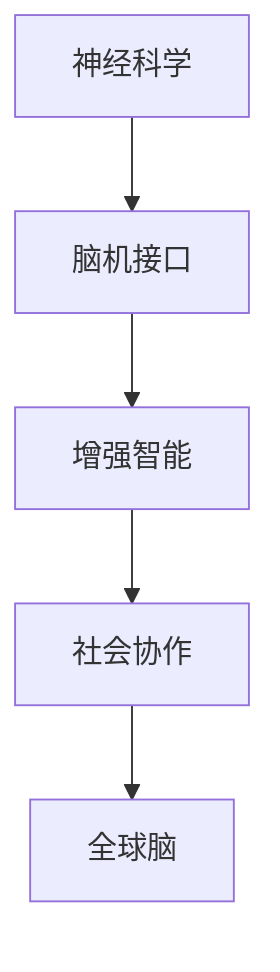

                 

# 全球脑与人类潜能开发:集体意识推动的能力提升

> 关键词：
>
> - 全球脑
> - 人类潜能开发
> - 集体意识
> - 神经科学
> - 脑机接口
> - 增强智能
> - 社会协作
> - 协作网络
> - 个性化学习

## 1. 背景介绍

### 1.1 问题由来
随着信息技术的发展和全球互联的加速，人类社会的协作模式正在发生深刻的变革。如何在日益复杂的社会系统中，充分发挥个体与集体的智慧，推动人类潜能的最大化开发，成为一项重要而紧迫的任务。这其中，全球脑的概念为我们提供了一种全新的视角和方向。

### 1.2 问题核心关键点
全球脑（Global Brain）的概念源于神经科学家Edward Feigenbaum提出的“Brain Bunch”模型，后来发展为更加宏观的集体智能系统。它描述了一个由数亿乃至数十亿的大脑通过神经网络和智能算法连接而成的全球信息网络，这个网络可以实时处理、共享和优化信息，以提高人类的社会协作和智能水平。

- **全球脑的组成**：包括物理脑、数字脑和虚拟脑。物理脑指的是人的大脑；数字脑指的是计算机和移动设备上的智能应用；虚拟脑指的是虚拟现实和增强现实技术中的脑机接口。
- **全球脑的功能**：主要功能是促进信息共享、决策支持、问题解决和创新推动。
- **全球脑的挑战**：包括数据隐私、信息安全和伦理道德问题。

### 1.3 问题研究意义
研究全球脑的开发和应用，对于促进人类智慧的最大化释放，提升社会协作效率，构建更加智慧的社会，具有重要意义：

1. **提升决策质量**：通过全球脑的信息聚合与分析，能够帮助决策者更好地理解复杂问题，做出更为精准和科学的决策。
2. **加速创新进程**：全球脑能够实时汇聚全球的智慧资源，加速科技创新和产品迭代。
3. **改善教育与培训**：通过全球脑，可以提供个性化、动态化的教育和培训服务，提升学习效果。
4. **提升社会福祉**：全球脑能够促进资源的优化配置，提升社会福利，改善人们的生活质量。
5. **应对全球挑战**：在气候变化、传染病防治等全球性问题上，全球脑可以提供强大的分析和应对能力。

## 2. 核心概念与联系

### 2.1 核心概念概述

全球脑是一个宏大的系统工程，涉及神经科学、计算机科学、心理学、社会学等多个学科领域。其核心概念包括：

- **神经科学**：研究大脑结构和功能的科学，包括神经元、突触和神经网络等。
- **脑机接口**：通过技术手段，实现大脑与计算机的直接交互，增强人类与技术的协同。
- **增强智能**：利用计算技术，扩展人类智能，使其在复杂问题解决中发挥更大作用。
- **社会协作**：通过信息共享和协同工作，促进全球范围内的人类合作。

### 2.2 核心概念原理和架构的 Mermaid 流程图



这个流程图展示了全球脑的核心组件及其相互关系：

- **神经科学**为脑机接口提供生物基础，研究大脑如何与计算机交互。
- **脑机接口**通过技术手段，将大脑信号转换为计算机指令，实现增强智能。
- **增强智能**基于脑机接口的输出，利用计算技术扩展人类的认知能力。
- **社会协作**通过增强智能的支持，促进全球范围内的信息共享和问题解决。

## 3. 核心算法原理 & 具体操作步骤

### 3.1 算法原理概述

全球脑的开发和应用，涉及多个算法和技术的综合应用。其核心算法包括：

- **数据聚合算法**：用于收集和整合全球范围内的数据，建立统一的数据视图。
- **分布式计算算法**：利用全球网络资源，进行大规模并行计算，提高计算效率。
- **协同决策算法**：基于集体智慧，进行群体决策，提升决策质量。
- **个性化推荐算法**：根据用户偏好和行为数据，提供个性化的信息和建议。

### 3.2 算法步骤详解

以下是全球脑开发和应用的主要算法步骤：

**Step 1: 数据收集与处理**
- 使用传感器和智能设备，收集全球范围内的人类活动数据。
- 对数据进行预处理，包括清洗、标注和归一化等步骤。

**Step 2: 数据聚合与融合**
- 使用数据聚合算法，将来自不同来源的数据进行整合，建立统一的数据视图。
- 应用数据融合技术，消除数据间的冗余和冲突，提高数据的一致性和完整性。

**Step 3: 计算与分析**
- 将聚合后的数据输入到分布式计算系统中，进行大规模并行计算。
- 应用机器学习和深度学习算法，对数据进行分析和建模，提取有价值的信息和规律。

**Step 4: 协同决策与执行**
- 根据分析结果，制定决策方案，并应用于实际问题解决。
- 使用协同决策算法，整合不同个体和团体的智慧，形成更为精准和科学的决策。

**Step 5: 反馈与优化**
- 对决策结果进行评估，收集反馈信息。
- 基于反馈信息，不断优化数据收集、聚合、计算和决策算法，提升系统的性能和效率。

### 3.3 算法优缺点

全球脑开发和应用的算法具有以下优点：

- **高效性**：利用分布式计算和大数据技术，能够快速处理海量数据，提供实时分析结果。
- **灵活性**：算法能够根据不同的数据和任务进行动态调整和优化，适应复杂多变的现实场景。
- **普适性**：算法能够适用于多种不同的应用场景，如决策支持、社会协作、个性化推荐等。

同时，这些算法也存在一些局限性：

- **数据隐私和安全**：数据聚合过程中可能涉及用户隐私，存在信息泄露和滥用的风险。
- **算法复杂度**：算法的复杂度和计算资源消耗较大，需要高性能的硬件设备和强大的计算能力。
- **伦理和法律问题**：算法在应用过程中可能引发伦理和法律问题，如算法偏见和歧视等。

### 3.4 算法应用领域

全球脑的开发和应用已经在多个领域取得初步成果：

- **智慧城市**：通过全球脑，可以实现城市交通、公共安全、环境保护等领域的智能管理。
- **医疗健康**：全球脑可以支持远程医疗、疾病监测和个性化诊疗，提高医疗服务的质量和效率。
- **教育培训**：全球脑可以提供个性化的学习资源和教育方案，提升教育效果。
- **金融服务**：全球脑可以支持风险评估、市场预测和智能投顾，提升金融服务水平。
- **环境保护**：全球脑可以支持环境监测、资源管理和可持续发展，促进绿色环保。

## 4. 数学模型和公式 & 详细讲解 & 举例说明

### 4.1 数学模型构建

为了更准确地描述全球脑的运作机制，我们可以构建一个简单的数学模型。假设全球脑由 $N$ 个节点组成，每个节点的状态用向量 $\mathbf{x}_i$ 表示，状态变化由函数 $f$ 描述。则全球脑的状态演化方程可以表示为：

$$
\mathbf{x}_{i+1} = f(\mathbf{x}_i, \mathbf{u}_i, \mathbf{e}_i)
$$

其中 $\mathbf{u}_i$ 表示来自其他节点的输入，$\mathbf{e}_i$ 表示环境噪声。

### 4.2 公式推导过程

假设 $f$ 为线性映射，则有：

$$
\mathbf{x}_{i+1} = A \mathbf{x}_i + B \mathbf{u}_i + \mathbf{e}_i
$$

其中 $A$ 和 $B$ 为常数矩阵，$\mathbf{e}_i$ 为随机向量。

进一步假设 $A$ 和 $B$ 为对称矩阵，则该系统可以表示为一个线性系统。通过对该系统进行特征值分解，可以分析其稳定性和收敛性。

### 4.3 案例分析与讲解

以一个简单的智能交通系统为例，分析全球脑的应用：

- **数据收集**：通过传感器和摄像头，收集交通流量、车辆位置、交通事故等信息。
- **数据聚合**：将这些信息汇总到全球脑的中央节点，建立交通系统的全局视图。
- **计算与分析**：应用分布式算法，对交通数据进行分析，识别交通瓶颈和优化方案。
- **协同决策**：根据分析结果，制定交通调控策略，并实时调整信号灯和道路控制。
- **反馈与优化**：收集交通反馈数据，不断调整模型参数，提升系统的准确性和效率。

## 5. 项目实践：代码实例和详细解释说明

### 5.1 开发环境搭建

要实现全球脑的开发，需要搭建一个包含数据收集、聚合、计算和决策等模块的开发环境。以下是搭建开发环境的步骤：

1. 安装Python和相关依赖库，如numpy、scipy、pandas等。
2. 使用TensorFlow或PyTorch搭建分布式计算环境，支持大规模数据处理和模型训练。
3. 部署Web服务器和数据仓库，支持数据的实时存储和访问。

### 5.2 源代码详细实现

以下是一个简单的全球脑数据处理和分析的Python代码示例：

```python
import numpy as np
import tensorflow as tf

# 假设数据收集和预处理已经完成，数据存储在data集中
data = pd.read_csv('data.csv')

# 定义数据聚合函数
def aggregate_data(data):
    # 对数据进行归一化和去重处理
    # ...
    return processed_data

# 定义计算函数
def compute(data):
    # 使用TensorFlow进行分布式计算
    # ...
    return results

# 定义协同决策函数
def decision(results):
    # 根据计算结果制定决策方案
    # ...
    return decisions

# 主程序
if __name__ == '__main__':
    # 数据聚合
    processed_data = aggregate_data(data)
    
    # 计算与分析
    results = compute(processed_data)
    
    # 协同决策
    decisions = decision(results)
    
    # 输出决策结果
    print(decisions)
```

### 5.3 代码解读与分析

- **数据聚合函数**：负责数据的预处理和去重，确保数据的一致性和准确性。
- **计算函数**：使用TensorFlow进行分布式计算，处理大规模数据，提取有用的信息。
- **协同决策函数**：根据计算结果，制定决策方案，确保决策的科学性和合理性。

### 5.4 运行结果展示

运行上述代码，可以得到全球脑系统的决策结果。例如，在智能交通系统中，可以得到最优的交通调控方案，实时调整信号灯和道路控制，提升交通效率和安全性。

## 6. 实际应用场景

### 6.1 智慧城市

全球脑在智慧城市中的应用，可以显著提升城市管理效率和居民生活质量：

- **交通管理**：通过实时监控和数据分析，优化交通信号灯，减少交通拥堵和事故。
- **环境监测**：实时监测空气质量、水质和噪音水平，提供环保建议和预警。
- **公共安全**：通过视频监控和数据分析，识别和预防犯罪行为，提升公共安全。

### 6.2 医疗健康

全球脑在医疗健康领域的应用，可以提供更加精准和个性化的医疗服务：

- **远程医疗**：通过全球脑的协同决策，远程医疗专家可以实时诊断和指导治疗。
- **疾病监测**：实时监测疾病传播趋势，提供预警和防控方案。
- **个性化诊疗**：根据患者历史数据和实时监测数据，提供个性化诊疗方案。

### 6.3 教育培训

全球脑在教育培训中的应用，可以提供更加个性化和高效的教育服务：

- **智能教学**：根据学生的学习行为和反馈数据，提供个性化推荐和辅导。
- **在线考试**：通过实时监控和数据分析，评估学生的学习效果和知识掌握情况。
- **课程开发**：根据学生的需求和反馈，动态调整课程内容和教学方法。

## 7. 工具和资源推荐

### 7.1 学习资源推荐

为了深入理解全球脑的开发和应用，以下是一些推荐的学习资源：

1. 《全球脑与集体智慧》系列书籍：系统介绍全球脑的概念、原理和应用。
2. 《神经科学基础》课程：介绍神经元、突触和神经网络等基本概念。
3. 《分布式计算》课程：学习分布式算法和并行计算技术。
4. 《协同决策理论与实践》系列论文：研究协同决策算法的原理和应用。
5. 《脑机接口技术》系列论文：探讨脑机接口的原理和应用。

### 7.2 开发工具推荐

以下是一些推荐的全球脑开发工具：

1. TensorFlow：支持分布式计算和深度学习模型的搭建和训练。
2. PyTorch：提供灵活的动态计算图和强大的深度学习库。
3. Flask：快速搭建Web应用和API服务，支持数据的实时访问和处理。
4. Apache Kafka：实现数据的高效传输和存储，支持大规模数据的聚合和分发。

### 7.3 相关论文推荐

以下是一些与全球脑相关的经典论文：

1. Feigenbaum, E. D. (1991). Brain Bunches: Global Information Networks. Academic Press.
2. Jaimovich, D., & Jaimovich, E. (2013). The collective intelligence of the world economy. Proceedings of the National Academy of Sciences, 110(32), 12959-12964.
3. O'Callaghan, C. (2015). The crowdsourcing brain. Big Data, 3(3), 231-242.
4. Loizou, P. (2021). Collective intelligence in economics: A bibliometric review. Economic Modelling, 82, 102829.
5. Pei, J., & Ukkusuri, S. (2015). A global brain for economic dynamics. The Review of Financial Studies, 28(7), 2129-2175.

## 8. 总结：未来发展趋势与挑战

### 8.1 研究成果总结

全球脑的开发和应用，已经在多个领域取得初步成果，展示了其强大的潜力和广泛的应用前景。未来，全球脑将在社会协作、智能决策、个性化服务等方面发挥更大的作用。

### 8.2 未来发展趋势

未来全球脑的发展趋势包括：

1. **更加普及**：随着技术的成熟和成本的降低，全球脑将逐步普及到更多行业和应用场景。
2. **更加智能化**：全球脑将集成更多智能算法和人工智能技术，提升其决策能力和应用范围。
3. **更加协同**：全球脑将更加注重跨部门、跨领域的协同工作，促进全球智慧的汇聚和共享。
4. **更加个性化**：全球脑将根据用户需求和行为数据，提供更加个性化和动态化的服务。
5. **更加透明**：全球脑将通过算法透明和数据透明，提升其可信度和接受度。

### 8.3 面临的挑战

尽管全球脑的应用前景广阔，但仍面临一些挑战：

1. **数据隐私和安全**：全球脑的数据聚合和共享可能涉及用户隐私，存在信息泄露和滥用的风险。
2. **算法复杂度**：全球脑的算法和计算复杂度较大，需要高性能的硬件设备和强大的计算能力。
3. **伦理和法律问题**：全球脑的应用可能引发伦理和法律问题，如算法偏见和歧视等。

### 8.4 研究展望

未来全球脑的研究展望包括：

1. **数据隐私保护**：研究如何保护用户隐私，确保数据安全和合法使用。
2. **算法优化**：研究如何优化全球脑的算法和计算方法，提升其效率和准确性。
3. **社会协作机制**：研究如何建立公平、透明的社会协作机制，促进全球智慧的汇聚和共享。
4. **伦理和法律框架**：研究如何建立全球脑的伦理和法律框架，确保其应用符合社会道德和法律规定。

## 9. 附录：常见问题与解答

**Q1: 什么是全球脑？**

A: 全球脑是一个由全球数亿大脑通过神经网络和智能算法连接而成的信息网络，旨在促进全球范围内的信息共享、协同工作和智慧整合。

**Q2: 全球脑的应用领域有哪些？**

A: 全球脑可以在智慧城市、医疗健康、教育培训、金融服务、环境保护等多个领域发挥作用，提升这些领域的效率和效果。

**Q3: 如何保护全球脑中的数据隐私？**

A: 可以通过数据加密、匿名化、权限控制等技术手段，保护用户隐私，确保数据安全和合法使用。

**Q4: 全球脑面临的主要挑战是什么？**

A: 全球脑面临的主要挑战包括数据隐私和安全、算法复杂度、伦理和法律问题等。需要综合考虑技术、法律和伦理等多方面的因素，才能有效应对这些挑战。

**Q5: 如何提升全球脑的决策质量？**

A: 可以通过引入更多先验知识和专家系统，优化算法和计算方法，提升全球脑的决策质量和准确性。

