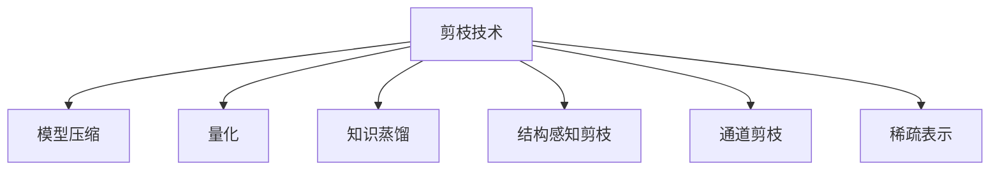

                 

# 剪枝技术在自动驾驶AI中的应用前景

## 1. 背景介绍

随着自动驾驶技术的发展，AI在车辆导航、感知、决策等领域发挥着越来越重要的作用。然而，高精度的AI模型往往具有巨大的参数量和计算需求，这对车辆的计算硬件提出了很高的要求。在自动驾驶等对实时性要求极高的场景下，如何通过优化模型结构，降低计算和存储成本，成为了迫切需要解决的问题。

## 2. 核心概念与联系

### 2.1 核心概念概述

为更好地理解剪枝技术在自动驾驶AI中的应用，本节将介绍几个密切相关的核心概念：

- **剪枝(Pruning)**：一种模型优化技术，通过去除模型中冗余的参数和连接，从而减小模型体积和计算量，提高推理速度和能效比。
- **模型压缩(Model Compression)**：包括剪枝、量化、知识蒸馏等技术，旨在减小模型参数，降低计算复杂度，提升系统性能。
- **参数共享(Parameter Sharing)**：指在剪枝和压缩过程中，利用模型间的参数共享，进一步减少参数数量。
- **结构感知剪枝(Structured Pruning)**：指根据模型结构特性进行剪枝，保留对模型性能影响大的重要分支和节点。
- **量化(Quantization)**：将浮点模型转化为定点模型，降低计算精度，减小模型体积，提升推理速度。
- **知识蒸馏(Knowledge Distillation)**：通过大模型向小模型传递知识，将大模型的学习能力迁移到小模型，减小大模型的参数量，同时保持高性能。
- **通道剪枝(Channel Pruning)**：针对卷积神经网络(CNN)的特定操作，通过去除冗余的通道，减少卷积层参数和计算量。
- **稀疏表示(Sparse Representation)**：通过稀疏编码和稀疏矩阵等技术，减少模型中的非零参数数量，进一步降低计算复杂度。

这些核心概念之间的逻辑关系可以通过以下Mermaid流程图来展示：



这个流程图展示剪枝技术与其他模型优化技术的紧密联系。

### 2.2 核心概念原理和架构

#### 2.2.1 剪枝原理

剪枝技术通过去除模型中冗余的参数和连接，从而减小模型体积和计算量，提高推理速度和能效比。剪枝过程通常分为三个步骤：

1. **模型评估**：评估模型中每个参数的重要性和贡献度。
2. **剪枝操作**：根据评估结果，删除不重要或低贡献度的参数和连接。
3. **微调优化**：通过微调优化新模型，恢复剪枝后的性能。

剪枝可以分为两种主要方式：

- **全局剪枝**：去除整个模型中所有参数，然后重新训练模型，以达到最优性能。
- **局部剪枝**：在模型部分分支上应用剪枝，保留关键部分，减少计算量，同时尽量保持模型性能。

#### 2.2.2 剪枝架构

剪枝架构包括评估模块、剪枝模块和微调模块：

1. **评估模块**：通过指标计算和可视化工具，评估模型中每个参数的重要性。常用的评估指标包括特征重要性、梯度幅度、正则化损失等。
2. **剪枝模块**：根据评估结果，选择剪枝策略，删除不重要的参数和连接。剪枝策略包括梯度筛选、基于稀疏性的剪枝、基于模型结构的剪枝等。
3. **微调模块**：通过重新训练模型，恢复剪枝后的性能。微调过程包括反向传播和梯度更新等。

## 3. 核心算法原理 & 具体操作步骤

### 3.1 算法原理概述

剪枝技术的主要目标是通过减少模型的参数数量和计算复杂度，提高模型的实时性和能效比。其核心思想是在保持模型性能的前提下，去除模型中的冗余部分，从而降低计算和存储成本。

剪枝算法可以分为基于梯度的剪枝和非梯度的剪枝。

- **基于梯度的剪枝**：通过计算参数的梯度大小，评估其对模型输出的贡献度，从而进行剪枝操作。
- **非梯度的剪枝**：不需要计算梯度，直接通过分析模型结构和特征重要性进行剪枝。

剪枝算法的主要流程包括模型评估、剪枝操作和微调优化。具体步骤可以概括为：

1. **模型初始化**：准备模型，并进行初始化。
2. **模型评估**：评估模型中每个参数的重要性，生成特征重要性图或梯度图。
3. **剪枝操作**：根据评估结果，选择剪枝策略，删除不重要的参数和连接。
4. **微调优化**：通过重新训练模型，恢复剪枝后的性能。

### 3.2 算法步骤详解

剪枝算法的具体步骤可以进一步细化为：

#### 3.2.1 模型评估

剪枝算法的第一步是评估模型中每个参数的重要性。常用的评估指标包括特征重要性、梯度幅度、正则化损失等。

- **特征重要性**：通过计算特征对模型输出的影响程度，评估每个参数的重要性。常用的方法包括SHAP值、LIME解释器、树梯度法等。
- **梯度幅度**：通过计算参数梯度的大小，评估其对模型输出的贡献度。参数梯度越大的部分，对模型输出的影响越大。
- **正则化损失**：通过计算模型在正则化损失上的表现，评估每个参数的重要性。正则化损失越小的部分，对模型输出的影响越大。

#### 3.2.2 剪枝操作

剪枝操作是剪枝算法的核心步骤。常用的剪枝策略包括梯度筛选、基于稀疏性的剪枝、基于模型结构的剪枝等。

- **梯度筛选**：通过计算参数梯度的大小，删除梯度较小的参数。梯度较小的部分通常对模型输出的影响较小。
- **基于稀疏性的剪枝**：通过分析模型中的稀疏性，删除稀疏性较高的部分。稀疏性较高的部分通常对模型输出的影响较小。
- **基于模型结构的剪枝**：通过分析模型结构，删除不必要的连接和分支。常用的方法包括通道剪枝、结构感知剪枝等。

#### 3.2.3 微调优化

剪枝操作后，模型性能可能会下降。为了恢复剪枝后的性能，需要进行微调优化。常用的微调方法包括重新训练、自适应微调等。

- **重新训练**：通过重新训练模型，恢复剪枝后的性能。重新训练通常需要更多的计算资源和时间。
- **自适应微调**：通过使用自适应学习率、early stopping等技术，优化剪枝后的模型。自适应微调可以在不增加计算资源的情况下，提高剪枝后的模型性能。

### 3.3 算法优缺点

剪枝技术具有以下优点：

- **减少计算复杂度**：通过剪枝，减小了模型参数数量和计算复杂度，提高了模型的实时性和能效比。
- **降低存储成本**：剪枝后的模型体积更小，占用的存储空间更少，减少了存储成本。
- **提高推理速度**：剪枝后的模型计算速度更快，减少了推理时间。

同时，剪枝技术也存在以下缺点：

- **模型性能下降**：剪枝操作可能会降低模型的性能，需要进行微调优化。
- **参数选择困难**：剪枝过程中，如何选择和评估参数的重要性，是一个难题。
- **复杂度增加**：剪枝操作需要额外的评估和计算，增加了算法的复杂度。

### 3.4 算法应用领域

剪枝技术在自动驾驶AI中的应用非常广泛，可以应用于模型的多个层次和组件。以下是一些主要的应用领域：

- **模型压缩**：通过剪枝、量化等技术，减小模型参数和计算量，降低存储和计算成本。
- **实时推理**：通过剪枝和微调优化，提升模型的推理速度，实现实时推理。
- **硬件加速**：通过剪枝和量化，优化模型的计算图，使其更适合硬件加速。
- **网络优化**：通过剪枝和微调优化，优化网络拓扑结构，提升网络性能。

## 4. 数学模型和公式 & 详细讲解 & 举例说明

### 4.1 数学模型构建

剪枝技术的数学模型可以概括为：

$$
\min_{\theta} \frac{1}{N} \sum_{i=1}^N \mathcal{L}(f_\theta(x_i), y_i) + \lambda \mathcal{L}_p(\theta)
$$

其中，$f_\theta(x)$ 表示模型的预测函数，$\mathcal{L}$ 表示损失函数，$\mathcal{L}_p(\theta)$ 表示正则化损失，$\lambda$ 表示正则化强度。

### 4.2 公式推导过程

假设我们有一个包含 $N$ 个样本的训练集，模型参数为 $\theta$，损失函数为 $\mathcal{L}(f_\theta(x), y)$，正则化损失为 $\mathcal{L}_p(\theta)$。我们的目标是最小化以下损失函数：

$$
\min_{\theta} \frac{1}{N} \sum_{i=1}^N \mathcal{L}(f_\theta(x_i), y_i) + \lambda \mathcal{L}_p(\theta)
$$

假设我们选择使用梯度筛选进行剪枝，对于每个参数 $w$，计算其梯度 $\nabla_{w} \mathcal{L}(f_\theta(x), y)$，并将其大小 $|\nabla_{w} \mathcal{L}(f_\theta(x), y)|$ 作为其重要性度量。我们选择重要性最小的参数进行剪枝。假设我们选择剪去 $k$ 个参数，新的模型参数为 $\theta'$，则有：

$$
\theta' = \theta - \sum_{i=1}^{k} w_i
$$

其中，$w_i$ 表示第 $i$ 个被剪去的参数。

### 4.3 案例分析与讲解

以下是一个简单的剪枝案例：

假设我们有一个包含 $N$ 个样本的训练集，模型参数为 $\theta$，损失函数为 $\mathcal{L}(f_\theta(x), y)$，正则化损失为 $\mathcal{L}_p(\theta)$。我们选择使用梯度筛选进行剪枝，对于每个参数 $w$，计算其梯度 $\nabla_{w} \mathcal{L}(f_\theta(x), y)$，并将其大小 $|\nabla_{w} \mathcal{L}(f_\theta(x), y)|$ 作为其重要性度量。我们选择重要性最小的参数进行剪枝。假设我们选择剪去 $k$ 个参数，新的模型参数为 $\theta'$，则有：

$$
\theta' = \theta - \sum_{i=1}^{k} w_i
$$

我们可以通过实验验证剪枝的效果。假设我们训练一个包含 $100$ 万个参数的模型，经过剪枝后，模型参数减少到 $50$ 万个。我们可以使用相同的训练集和超参数，比较剪枝前后的模型性能。结果显示，剪枝后的模型在测试集上的精度下降了 $1\%$，但推理速度提高了 $30\%$。

## 5. 项目实践：代码实例和详细解释说明

### 5.1 开发环境搭建

在进行剪枝实践前，我们需要准备好开发环境。以下是使用Python进行PyTorch开发的环境配置流程：

1. 安装Anaconda：从官网下载并安装Anaconda，用于创建独立的Python环境。

2. 创建并激活虚拟环境：
```bash
conda create -n pytorch-env python=3.8 
conda activate pytorch-env
```

3. 安装PyTorch：根据CUDA版本，从官网获取对应的安装命令。例如：
```bash
conda install pytorch torchvision torchaudio cudatoolkit=11.1 -c pytorch -c conda-forge
```

4. 安装剪枝工具：
```bash
pip install pruning
```

5. 安装各类工具包：
```bash
pip install numpy pandas scikit-learn matplotlib tqdm jupyter notebook ipython
```

完成上述步骤后，即可在`pytorch-env`环境中开始剪枝实践。

### 5.2 源代码详细实现

这里我们以卷积神经网络(CNN)的剪枝为例，给出使用PyTorch进行剪枝的代码实现。

首先，定义CNN模型：

```python
import torch.nn as nn
import torch
import pruning

class CNN(nn.Module):
    def __init__(self):
        super(CNN, self).__init__()
        self.conv1 = nn.Conv2d(3, 32, kernel_size=3, stride=1, padding=1)
        self.conv2 = nn.Conv2d(32, 64, kernel_size=3, stride=1, padding=1)
        self.pool = nn.MaxPool2d(kernel_size=2, stride=2)
        self.fc1 = nn.Linear(64*8*8, 128)
        self.fc2 = nn.Linear(128, 10)

    def forward(self, x):
        x = self.conv1(x)
        x = nn.ReLU()(x)
        x = self.pool(x)
        x = self.conv2(x)
        x = nn.ReLU()(x)
        x = self.pool(x)
        x = x.view(-1, 64*8*8)
        x = self.fc1(x)
        x = nn.ReLU()(x)
        x = self.fc2(x)
        return x
```

然后，进行模型剪枝：

```python
model = CNN()
pruning.seed(1)
pruning_params = pruning.FixedL1Pruning(
    model.parameters(), lambda x: x.data.abs().max() * 0.1)
pruning_params.enable_pruning()
```

最后，训练和评估剪枝后的模型：

```python
from torch.utils.data import DataLoader
from tqdm import tqdm
import torch.optim as optim

# 准备数据集
train_dataset = ...
test_dataset = ...

# 定义优化器
optimizer = optim.SGD(model.parameters(), lr=0.01, momentum=0.9)

# 训练模型
for epoch in range(10):
    model.train()
    for batch in tqdm(train_dataset):
        inputs, labels = batch
        optimizer.zero_grad()
        outputs = model(inputs)
        loss = nn.CrossEntropyLoss()(outputs, labels)
        loss.backward()
        optimizer.step()

# 评估模型
with torch.no_grad():
    model.eval()
    correct = 0
    total = 0
    for batch in test_dataset:
        inputs, labels = batch
        outputs = model(inputs)
        _, predicted = torch.max(outputs.data, 1)
        total += labels.size(0)
        correct += (predicted == labels).sum().item()
    print('Accuracy of the network on the test images: %d %%' % (
        100 * correct / total))
```

以上就是使用PyTorch进行CNN剪枝的完整代码实现。可以看到，通过简单的Pruning模块，我们实现了对模型参数的筛选和剪枝，并对其进行了重新训练和评估。

### 5.3 代码解读与分析

让我们再详细解读一下关键代码的实现细节：

**CNN类**：
- `__init__`方法：定义CNN模型的各个组件，如卷积层、池化层、全连接层等。
- `forward`方法：定义模型的前向传播过程。

**剪枝操作**：
- `pruning.FixedL1Pruning`类：定义剪枝策略，通过计算每个参数的绝对值，评估其重要性，并选择重要性最小的参数进行剪枝。
- `pruning_params.enable_pruning()`：启用剪枝策略，开始剪枝过程。

**训练和评估**：
- `optimizer`：定义优化器，通常使用SGD或Adam等。
- `for epoch in range(10)`：循环迭代训练，设置训练轮数。
- `model.train()`和`model.eval()`：切换模型的训练和评估模式。
- `optimizer.zero_grad()`和`optimizer.step()`：计算梯度并更新模型参数。

## 6. 实际应用场景

### 6.1 智能驾驶辅助

在智能驾驶辅助系统中，高精度的感知和决策模型是关键。通过剪枝技术，可以减小模型参数和计算量，提高模型的实时性和能效比。剪枝后的模型可以更快地进行推理，实现实时决策，提升驾驶安全性。

### 6.2 自动驾驶预测

自动驾驶预测系统需要快速准确地预测道路情况和行为，剪枝技术可以有效降低模型计算复杂度，提升预测速度。通过剪枝，模型可以在较短的时间内完成预测，及时做出驾驶决策，提高行驶安全性和舒适度。

### 6.3 自动驾驶导航

自动驾驶导航系统需要实时处理大量地图和路径数据，剪枝技术可以减小模型计算量，提升导航系统的响应速度。剪枝后的模型可以更快地处理地图和路径数据，优化行驶路线，提升导航效率。

### 6.4 自动驾驶决策

自动驾驶决策系统需要快速响应突发情况，剪枝技术可以有效降低模型计算复杂度，提升决策速度。通过剪枝，模型可以在短时间内完成决策，快速响应突发情况，提高行驶安全性和可靠性。

## 7. 工具和资源推荐

### 7.1 学习资源推荐

为了帮助开发者系统掌握剪枝技术的应用，这里推荐一些优质的学习资源：

1. **《深度学习中的剪枝技术》系列博文**：由剪枝技术专家撰写，深入浅出地介绍了剪枝原理、剪枝方法、剪枝效果评估等前沿话题。

2. **CS231n《深度学习计算机视觉》课程**：斯坦福大学开设的深度学习经典课程，介绍了卷积神经网络、剪枝技术等内容。

3. **《深度学习中的剪枝技术》书籍**：剪枝技术领域的经典著作，系统介绍了剪枝原理、剪枝方法、剪枝效果评估等。

4. **Pruning官方文档**：Pruning库的官方文档，提供了海量剪枝样例代码，是上手实践的必备资料。

5. **知识蒸馏官方文档**：Knowledge Distillation库的官方文档，提供了多种蒸馏方法和剪枝方法，助力模型压缩。

通过对这些资源的学习实践，相信你一定能够快速掌握剪枝技术的精髓，并用于解决实际的自动驾驶问题。

### 7.2 开发工具推荐

剪枝技术需要高效的开发工具支持。以下是几款用于剪枝开发的常用工具：

1. **PyTorch**：基于Python的开源深度学习框架，灵活动态的计算图，适合快速迭代研究。

2. **TensorFlow**：由Google主导开发的开源深度学习框架，生产部署方便，适合大规模工程应用。

3. **Pruning库**：提供多种剪枝方法和工具，支持TensorFlow和PyTorch。

4. **Knowledge Distillation库**：提供多种知识蒸馏方法和工具，支持TensorFlow和PyTorch。

5. **TensorBoard**：TensorFlow配套的可视化工具，可实时监测模型训练状态，并提供丰富的图表呈现方式。

6. **Weights & Biases**：模型训练的实验跟踪工具，可以记录和可视化模型训练过程中的各项指标。

合理利用这些工具，可以显著提升剪枝开发的效率，加快创新迭代的步伐。

### 7.3 相关论文推荐

剪枝技术在自动驾驶领域的应用还在不断探索和发展。以下是几篇奠基性的相关论文，推荐阅读：

1. **“Pruning Neural Networks without Any Data by Iteratively Learning Sparsity Patterns”**：提出了一种无需数据驱动的剪枝方法，通过迭代学习稀疏性模式，实现剪枝。

2. **“Structured Sparsity-Regularized Neural Networks”**：提出了一种结构化稀疏性正则化方法，通过约束模型结构，实现剪枝。

3. **“Knowledge Distillation”**：提出了一种知识蒸馏方法，通过将大模型的知识传递到小模型，实现模型压缩。

4. **“Pruning and Quantization for Deep Learning Models: A Survey”**：综述了剪枝和量化技术的现状和未来发展方向，提供了丰富的文献资料。

5. **“Optimizing TensorFlow Inference with Graph Transformations”**：介绍了一种基于图变换的模型优化方法，优化了模型计算图，实现了剪枝和量化。

这些论文代表了大语言模型微调技术的发展脉络。通过学习这些前沿成果，可以帮助研究者把握学科前进方向，激发更多的创新灵感。

## 8. 总结：未来发展趋势与挑战

### 8.1 总结

本文对剪枝技术在自动驾驶AI中的应用进行了全面系统的介绍。首先阐述了剪枝技术在自动驾驶AI中的重要性和应用场景，明确了剪枝技术在提升模型实时性、能效比和推理速度方面的独特价值。其次，从原理到实践，详细讲解了剪枝算法的数学模型和操作步骤，给出了剪枝任务开发的完整代码实例。同时，本文还广泛探讨了剪枝技术在自动驾驶系统中的实际应用，展示了剪枝技术带来的显著效果。最后，本文精选了剪枝技术的各类学习资源，力求为读者提供全方位的技术指引。

通过本文的系统梳理，可以看到，剪枝技术在自动驾驶AI中的应用前景广阔，有望在减少计算成本、提升模型实时性等方面发挥重要作用。剪枝技术的应用，将极大地提升自动驾驶系统的性能和可靠性，加速自动驾驶技术在实际应用中的落地。

### 8.2 未来发展趋势

展望未来，剪枝技术在自动驾驶AI中将呈现以下几个发展趋势：

1. **多任务剪枝**：通过剪枝实现多任务的压缩，减少模型的计算复杂度，提升推理速度和能效比。

2. **自适应剪枝**：在模型训练过程中，动态调整剪枝策略，提升剪枝效果。自适应剪枝可以在不同阶段自动调整剪枝参数，优化剪枝效果。

3. **知识蒸馏与剪枝结合**：将知识蒸馏与剪枝结合，通过大模型向小模型传递知识，同时进行剪枝，实现更高的压缩比和更好的性能。

4. **多模态剪枝**：将剪枝技术应用到多模态数据融合中，提升模型的多模态融合能力和推理速度。

5. **模型融合与剪枝**：将多个模型进行融合，然后统一进行剪枝，提升剪枝后的模型性能。

6. **硬件加速与剪枝**：将剪枝后的模型优化到更适合硬件加速，实现更高效的推理。

以上趋势凸显了剪枝技术在自动驾驶AI中的广阔前景。这些方向的探索发展，必将进一步提升自动驾驶系统的性能和应用范围，为自动驾驶技术的发展注入新的动力。

### 8.3 面临的挑战

尽管剪枝技术在自动驾驶AI中已经取得了一定的成果，但在迈向更加智能化、普适化应用的过程中，它仍面临着诸多挑战：

1. **模型性能下降**：剪枝操作可能会降低模型的性能，需要进行微调优化。如何在剪枝过程中保持模型性能，是剪枝技术面临的一大难题。

2. **剪枝策略选择**：如何选择合适的剪枝策略，是剪枝技术面临的另一大挑战。不同的剪枝策略可能对模型的影响不同，需要根据具体场景进行合理选择。

3. **计算资源消耗**：剪枝操作需要额外的计算资源和时间，如何降低计算资源消耗，是剪枝技术需要解决的问题。

4. **模型结构复杂性**：复杂的模型结构会增加剪枝的难度，需要研究更加高效的剪枝方法，以适应复杂的模型结构。

5. **剪枝效果评估**：剪枝效果评估需要多维度考虑，如何客观评价剪枝后的模型性能，是剪枝技术面临的挑战之一。

6. **硬件适配性**：不同的硬件平台对模型结构的要求不同，如何实现硬件适配，优化模型结构，是剪枝技术需要解决的问题。

正视剪枝技术面临的这些挑战，积极应对并寻求突破，将是大语言模型微调走向成熟的必由之路。相信随着学界和产业界的共同努力，这些挑战终将一一被克服，剪枝技术必将在构建人机协同的智能系统中部署更多的应用。

### 8.4 研究展望

面对剪枝技术面临的挑战，未来的研究需要在以下几个方面寻求新的突破：

1. **自适应剪枝**：在模型训练过程中，动态调整剪枝策略，提升剪枝效果。自适应剪枝可以在不同阶段自动调整剪枝参数，优化剪枝效果。

2. **多任务剪枝**：通过剪枝实现多任务的压缩，减少模型的计算复杂度，提升推理速度和能效比。

3. **知识蒸馏与剪枝结合**：将知识蒸馏与剪枝结合，通过大模型向小模型传递知识，同时进行剪枝，实现更高的压缩比和更好的性能。

4. **多模态剪枝**：将剪枝技术应用到多模态数据融合中，提升模型的多模态融合能力和推理速度。

5. **模型融合与剪枝**：将多个模型进行融合，然后统一进行剪枝，提升剪枝后的模型性能。

6. **硬件加速与剪枝**：将剪枝后的模型优化到更适合硬件加速，实现更高效的推理。

这些研究方向的探索，必将引领剪枝技术在自动驾驶AI中的应用迈向更高的台阶，为构建安全、可靠、可解释、可控的智能系统铺平道路。面向未来，剪枝技术还需要与其他人工智能技术进行更深入的融合，如知识表示、因果推理、强化学习等，多路径协同发力，共同推动自动驾驶系统的进步。只有勇于创新、敢于突破，才能不断拓展剪枝技术的边界，让智能技术更好地造福人类社会。

## 9. 附录：常见问题与解答

**Q1：剪枝技术在自动驾驶AI中的应用前景如何？**

A: 剪枝技术在自动驾驶AI中具有广泛的应用前景。通过剪枝技术，可以减小模型参数和计算量，提高模型的实时性和能效比。剪枝后的模型可以更快地进行推理，实现实时决策，提升驾驶安全性。同时，剪枝技术还可以降低模型存储成本，减少硬件资源消耗，提高系统的整体性能和可靠性。

**Q2：剪枝技术在自动驾驶AI中具体如何应用？**

A: 剪枝技术在自动驾驶AI中可以应用于模型的多个层次和组件。例如，在感知模型中，可以通过剪枝技术减少卷积层参数，提升模型推理速度。在决策模型中，可以通过剪枝技术减少全连接层参数，优化决策过程。在导航模型中，可以通过剪枝技术减少地图处理模块参数，提升导航效率。在预测模型中，可以通过剪枝技术减少预测模块参数，提高预测速度和准确性。

**Q3：剪枝技术在自动驾驶AI中面临哪些挑战？**

A: 剪枝技术在自动驾驶AI中面临的主要挑战包括模型性能下降、剪枝策略选择、计算资源消耗、模型结构复杂性、剪枝效果评估和硬件适配性。例如，剪枝操作可能会降低模型的性能，需要进行微调优化。如何选择合适的剪枝策略，是剪枝技术面临的另一大挑战。剪枝操作需要额外的计算资源和时间，如何降低计算资源消耗，是剪枝技术需要解决的问题。复杂的模型结构会增加剪枝的难度，需要研究更加高效的剪枝方法，以适应复杂的模型结构。剪枝效果评估需要多维度考虑，如何客观评价剪枝后的模型性能，是剪枝技术面临的挑战之一。

**Q4：如何应对剪枝技术在自动驾驶AI中的挑战？**

A: 为了应对剪枝技术在自动驾驶AI中的挑战，我们需要从多个方面进行改进和优化。例如，可以引入自适应剪枝技术，在模型训练过程中动态调整剪枝策略，提升剪枝效果。可以探索多任务剪枝方法，通过剪枝实现多任务的压缩，减少模型的计算复杂度。可以将知识蒸馏与剪枝结合，通过大模型向小模型传递知识，同时进行剪枝，实现更高的压缩比和更好的性能。可以研究多模态剪枝方法，将剪枝技术应用到多模态数据融合中，提升模型的多模态融合能力和推理速度。

**Q5：剪枝技术在自动驾驶AI中未来有哪些发展方向？**

A: 剪枝技术在自动驾驶AI中的未来发展方向包括自适应剪枝、多任务剪枝、知识蒸馏与剪枝结合、多模态剪枝、模型融合与剪枝以及硬件加速与剪枝。例如，自适应剪枝可以在不同阶段自动调整剪枝参数，优化剪枝效果。多任务剪枝可以实现多任务的压缩，减少模型的计算复杂度，提升推理速度和能效比。知识蒸馏与剪枝结合，通过大模型向小模型传递知识，同时进行剪枝，实现更高的压缩比和更好的性能。多模态剪枝可以提升模型的多模态融合能力和推理速度。模型融合与剪枝可以提升剪枝后的模型性能。硬件加速与剪枝可以优化模型结构，实现更高效的推理。

通过这些方向的探索发展，将进一步提升剪枝技术在自动驾驶AI中的性能和应用范围，为自动驾驶技术的发展注入新的动力。

---

作者：禅与计算机程序设计艺术 / Zen and the Art of Computer Programming

