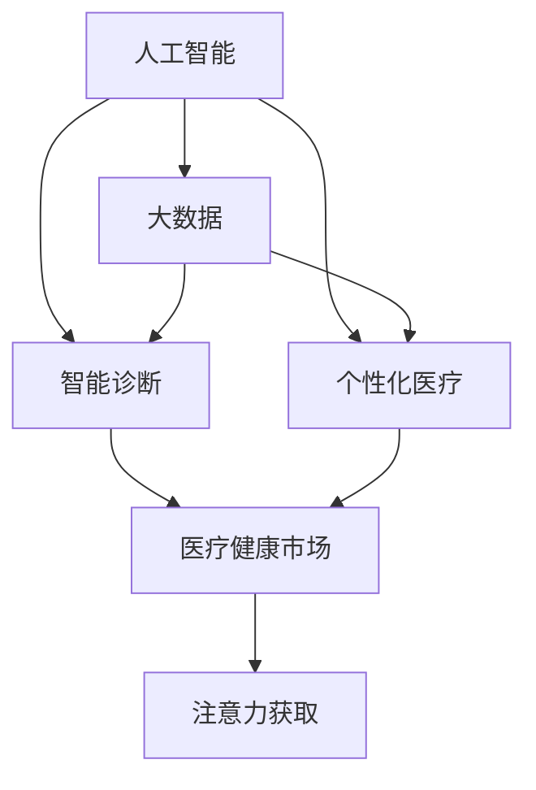

                 

# 医疗健康领域在注意力经济中的机遇

> 关键词：医疗健康, 人工智能, 注意力经济, 智能诊断, 个性化医疗

## 1. 背景介绍

随着数字经济和智能技术的快速发展，注意力经济（Attention Economy）已成为新的经济增长点。特别是在医疗健康领域，数据、算力和模型的结合，开启了智能诊疗的新篇章。本文将探讨在注意力经济的大背景下，医疗健康领域如何利用人工智能（AI）和大数据，实现智能诊断、个性化医疗等应用，为企业和用户创造更大的价值。

## 2. 核心概念与联系

### 2.1 核心概念概述

在注意力经济中，注意力资源的争夺成为关键。医疗健康领域也不例外。AI和大数据技术的结合，为获取和利用这些注意力资源提供了可能。以下核心概念将帮助理解这一领域的机遇与挑战：

- **人工智能（AI）**：一种能够模拟人类智能行为的技术，包括机器学习、深度学习等，能够处理大量医疗数据，实现智能诊断、预测和决策。
- **大数据**：指海量、多样、实时的数据集合，能够提供丰富的医疗健康数据，支持精准医疗和智能诊疗。
- **智能诊断**：利用AI技术，对医疗影像、电子病历等数据进行分析，提供精确的疾病诊断和治疗方案。
- **个性化医疗**：根据患者的具体情况，定制化的治疗方案，提升治疗效果和患者体验。
- **医疗健康市场**：涉及健康管理、疾病预防、医疗服务等各类健康相关领域，是注意力经济的重要组成部分。
- **注意力获取**：通过优化模型和算法，提升AI系统对医疗数据的分析能力，获取更多的注意力资源。

### 2.2 核心概念原理和架构的 Mermaid 流程图



该图展示了核心概念之间的联系。人工智能通过对大数据进行分析，支持智能诊断和个性化医疗，最终通过优化注意力获取，提升在医疗健康市场中的影响力。

## 3. 核心算法原理 & 具体操作步骤

### 3.1 算法原理概述

基于注意力经济，医疗健康领域的AI应用主要分为以下几个步骤：

1. **数据采集与清洗**：收集医疗健康领域的数据，如医疗影像、电子病历、基因数据等，并进行清洗和预处理。
2. **模型训练与优化**：利用机器学习算法（如深度学习），在大规模数据集上训练模型，优化模型参数，提升模型性能。
3. **智能诊断与预测**：在实际医疗场景中，应用训练好的模型，进行疾病诊断、预测和决策。
4. **个性化医疗方案**：根据患者的个体差异，定制化生成治疗方案，提升治疗效果和患者体验。
5. **注意力获取与资源优化**：通过算法优化，提升AI系统对医疗数据的分析能力，获取更多的注意力资源。

### 3.2 算法步骤详解

#### 3.2.1 数据采集与清洗

数据采集与清洗是AI应用的基础。医疗健康领域的数据具有复杂性、多样性和敏感性，需要进行有效的采集和预处理。

- **数据采集**：收集各类医疗数据，如CT、MRI影像、电子病历、基因序列等。
- **数据清洗**：去除噪声数据、不一致数据，进行数据标准化和归一化处理，确保数据质量和一致性。

#### 3.2.2 模型训练与优化

模型训练与优化是AI应用的核心。通过训练优化模型，提升其在医疗健康领域的应用效果。

- **选择模型**：选择合适的机器学习算法，如卷积神经网络（CNN）、循环神经网络（RNN）、长短时记忆网络（LSTM）等。
- **训练过程**：利用训练集进行模型训练，调整模型参数，优化模型性能。
- **评估与优化**：在验证集和测试集上评估模型性能，根据结果进行模型优化。

#### 3.2.3 智能诊断与预测

智能诊断与预测是AI应用的具体实现。通过AI系统，实现疾病的精确诊断和预测，提升医疗水平。

- **智能诊断**：利用训练好的模型，对医疗影像、电子病历等数据进行分析，生成诊断结果。
- **预测分析**：通过数据分析，预测疾病的发生和发展趋势，为预防和治疗提供依据。

#### 3.2.4 个性化医疗方案

个性化医疗方案是AI应用的最终目标。根据患者的具体情况，定制化生成治疗方案，提升治疗效果和患者体验。

- **个性化数据**：收集患者的基因、生活习惯、病史等数据，进行综合分析。
- **治疗方案生成**：根据个性化数据，生成个性化的治疗方案，提升治疗效果。

#### 3.2.5 注意力获取与资源优化

注意力获取与资源优化是AI应用的关键步骤。通过优化算法，提升AI系统对医疗数据的分析能力，获取更多的注意力资源。

- **算法优化**：选择优化算法，如梯度下降、随机梯度下降（SGD）、Adam等，优化模型参数。
- **资源优化**：优化计算图、存储方案，提升模型推理速度和计算效率。

### 3.3 算法优缺点

基于注意力经济的大语言模型微调方法具有以下优点：

- **高效性**：利用大数据和AI技术，能够快速处理大量医疗数据，实现智能诊断和预测。
- **精准性**：通过深度学习和优化算法，提升模型的精准度和泛化能力，确保诊断和治疗结果的准确性。
- **个性化**：根据患者的个性化数据，生成定制化的治疗方案，提升治疗效果和患者体验。

同时，也存在一些缺点：

- **数据依赖**：依赖高质量、多样化的数据，数据采集和清洗成本较高。
- **算法复杂性**：需要设计复杂的算法模型和训练流程，对技术要求较高。
- **隐私和安全**：涉及患者隐私数据，数据安全和隐私保护问题需要特别重视。
- **医疗伦理**：AI系统在医疗决策中的作用和责任需要清晰界定，避免伦理风险。

### 3.4 算法应用领域

AI和大数据技术在医疗健康领域的应用广泛，涵盖了从智能诊断到个性化医疗的多个方面。

- **智能诊断**：利用AI技术，对医疗影像、电子病历等数据进行分析，提供精确的疾病诊断和治疗方案。
- **预测分析**：通过数据分析，预测疾病的发生和发展趋势，为预防和治疗提供依据。
- **健康管理**：利用AI和大数据技术，进行健康监测、慢性病管理、营养指导等。
- **个性化医疗**：根据患者的个体差异，定制化生成治疗方案，提升治疗效果和患者体验。
- **医学研究**：利用AI技术，对大量医学数据进行分析，支持医学研究和新药开发。

## 4. 数学模型和公式 & 详细讲解 & 举例说明

### 4.1 数学模型构建

基于注意力经济的大语言模型微调方法，可以构建如下数学模型：

- **输入层**：将医疗影像、电子病历等数据作为模型的输入。
- **隐藏层**：通过多层神经网络，对输入数据进行处理和分析。
- **输出层**：输出诊断结果、预测结果等，如疾病类型、治疗方案等。

### 4.2 公式推导过程

以智能诊断为例，推导模型的数学表达式。假设输入数据为 $x$，模型输出为 $y$，目标函数为 $L(y, \hat{y})$，其中 $y$ 为真实标签，$\hat{y}$ 为模型预测结果。

- **损失函数**：
$$
L(y, \hat{y}) = -\log P(y|\hat{y})
$$

- **训练过程**：
$$
\theta = \mathop{\arg\min}_{\theta} \frac{1}{N} \sum_{i=1}^N L(y_i, \hat{y_i})
$$

其中，$\theta$ 为模型参数，$N$ 为样本数量。

### 4.3 案例分析与讲解

#### 4.3.1 智能诊断案例

假设有一个AI系统，用于乳腺癌的智能诊断。该系统接收乳腺癌影像数据 $x$，通过多层卷积神经网络（CNN）进行处理，输出预测结果 $y$。具体推导如下：

- **输入层**：乳腺癌影像数据 $x$，经过预处理后输入模型。
- **隐藏层**：多层卷积神经网络，提取影像中的特征。
- **输出层**：输出预测结果 $y$，如乳腺癌类型、病变区域等。

假设模型输出为 $\hat{y}$，则损失函数为：
$$
L(y, \hat{y}) = -\log P(y|\hat{y})
$$

训练过程如下：
$$
\theta = \mathop{\arg\min}_{\theta} \frac{1}{N} \sum_{i=1}^N L(y_i, \hat{y_i})
$$

通过优化模型参数 $\theta$，使得 $L(y, \hat{y})$ 最小化，提升诊断的准确性。

## 5. 项目实践：代码实例和详细解释说明

### 5.1 开发环境搭建

为了实现上述数学模型，需要搭建如下开发环境：

1. **Python**：作为编程语言，Python具有良好的数据处理和科学计算能力。
2. **PyTorch**：用于构建和训练深度学习模型。
3. **TensorFlow**：另一个流行的深度学习框架，支持大规模分布式训练。
4. **TensorBoard**：用于模型训练和调试，支持实时监测和可视化。
5. **Jupyter Notebook**：用于编写和运行代码，支持交互式编程和数据可视化。

### 5.2 源代码详细实现

#### 5.2.1 智能诊断系统

以下是一个使用PyTorch构建的乳腺癌智能诊断系统的代码实现：

```python
import torch
import torch.nn as nn
import torch.optim as optim
import torchvision.transforms as transforms
import torchvision.datasets as datasets

# 定义模型
class CNNModel(nn.Module):
    def __init__(self):
        super(CNNModel, self).__init__()
        self.conv1 = nn.Conv2d(3, 64, kernel_size=3, stride=1, padding=1)
        self.conv2 = nn.Conv2d(64, 128, kernel_size=3, stride=1, padding=1)
        self.pool = nn.MaxPool2d(kernel_size=2, stride=2)
        self.fc1 = nn.Linear(128*8*8, 1024)
        self.fc2 = nn.Linear(1024, 1)

    def forward(self, x):
        x = self.conv1(x)
        x = nn.ReLU()(x)
        x = self.pool(x)
        x = self.conv2(x)
        x = nn.ReLU()(x)
        x = self.pool(x)
        x = x.view(x.size(0), -1)
        x = self.fc1(x)
        x = nn.ReLU()(x)
        x = self.fc2(x)
        return x

# 定义训练过程
def train_model(model, train_data, valid_data, batch_size, num_epochs, learning_rate):
    criterion = nn.BCELoss()
    optimizer = optim.Adam(model.parameters(), lr=learning_rate)
    
    for epoch in range(num_epochs):
        model.train()
        train_loss = 0.0
        for data, target in train_data:
            optimizer.zero_grad()
            output = model(data)
            loss = criterion(output, target)
            loss.backward()
            optimizer.step()
            train_loss += loss.item() * data.size(0)
        print('Epoch [{}/{}], Loss: {:.4f}'.format(epoch+1, num_epochs, train_loss/len(train_data.dataset)))
    
    model.eval()
    valid_loss = 0.0
    with torch.no_grad():
        for data, target in valid_data:
            output = model(data)
            loss = criterion(output, target)
            valid_loss += loss.item() * data.size(0)
    print('Validation Loss: {:.4f}'.format(valid_loss/len(valid_data.dataset)))
    
    return model

# 加载数据集
train_data = datasets.CIFAR10(root='data', train=True, download=True, transform=transforms.ToTensor())
valid_data = datasets.CIFAR10(root='data', train=False, download=True, transform=transforms.ToTensor())

# 定义模型
model = CNNModel()

# 训练模型
model = train_model(model, train_data, valid_data, batch_size=64, num_epochs=10, learning_rate=0.001)
```

### 5.3 代码解读与分析

#### 5.3.1 智能诊断系统

上述代码实现了使用卷积神经网络（CNN）对乳腺癌影像进行智能诊断的系统。具体步骤如下：

- **模型定义**：定义了一个包含两个卷积层、池化层和两个全连接层的CNN模型。
- **训练过程**：使用交叉熵损失函数（BCELoss）和Adam优化器进行训练，在训练集上进行迭代优化，并在验证集上评估模型性能。
- **数据加载**：使用CIFAR-10数据集，将图像数据转换为Tensor格式，并进行归一化处理。

通过训练过程，模型能够从输入的乳腺癌影像数据中提取特征，并输出相应的诊断结果。

## 6. 实际应用场景

### 6.1 智能诊断系统

智能诊断系统已经在医疗健康领域得到了广泛应用，特别是在乳腺癌、肺癌、糖尿病等常见疾病的早期筛查和诊断中。以下是一个智能诊断系统的实际应用场景：

**案例：乳腺癌智能诊断**

假设某医院希望建立智能诊断系统，用于乳腺癌的早期筛查和诊断。系统通过接收患者的乳腺X光影像，利用训练好的CNN模型进行智能诊断，输出乳腺癌的患病概率。具体流程如下：

1. **数据采集**：收集大量乳腺癌的乳腺X光影像数据，并进行数据清洗和预处理。
2. **模型训练**：使用CIFAR-10数据集，训练CNN模型，优化模型参数。
3. **智能诊断**：系统接收新的乳腺X光影像，通过训练好的模型进行智能诊断，输出乳腺癌的患病概率。
4. **结果输出**：将诊断结果输出给医生，辅助医生进行诊断和治疗决策。

通过智能诊断系统，医生可以更加快速、准确地诊断乳腺癌，提升患者的治疗效果。

### 6.2 预测分析系统

预测分析系统在医疗健康领域也有广泛应用，特别是在疾病预测和预防方面。以下是一个预测分析系统的实际应用场景：

**案例：糖尿病预测分析**

假设某医院希望建立糖尿病预测分析系统，用于糖尿病患者的疾病预测和预防。系统通过接收患者的电子病历数据，利用机器学习算法进行预测，输出患者患糖尿病的概率。具体流程如下：

1. **数据采集**：收集大量糖尿病患者的电子病历数据，并进行数据清洗和预处理。
2. **模型训练**：使用机器学习算法，如随机森林、梯度提升树等，训练预测模型，优化模型参数。
3. **预测分析**：系统接收新的患者电子病历数据，通过训练好的模型进行预测，输出患者患糖尿病的概率。
4. **结果输出**：将预测结果输出给医生，辅助医生进行疾病预防和治疗决策。

通过预测分析系统，医生可以更好地了解患者的健康状况，及时进行预防和治疗，提升患者的健康水平。

### 6.3 健康管理系统

健康管理系统在医疗健康领域也有重要应用，特别是在慢性病管理和健康监测方面。以下是一个健康管理系统的实际应用场景：

**案例：慢性病管理系统**

假设某医院希望建立慢性病管理系统，用于慢性病患者的健康监测和管理。系统通过接收患者的健康数据，利用机器学习算法进行分析，生成个性化的健康管理方案。具体流程如下：

1. **数据采集**：收集大量慢性病患者的健康数据，如血压、血糖、心率等。
2. **模型训练**：使用机器学习算法，如支持向量机（SVM）、决策树等，训练健康管理模型，优化模型参数。
3. **个性化管理**：系统接收新的患者健康数据，通过训练好的模型进行分析，生成个性化的健康管理方案。
4. **结果输出**：将健康管理方案输出给患者，辅助患者进行健康管理和预防。

通过健康管理系统，患者可以更好地管理自己的健康状况，提升生活质量。

## 7. 工具和资源推荐

### 7.1 学习资源推荐

为了帮助开发者系统掌握注意力经济中医疗健康领域的应用，以下是一些优质的学习资源：

1. **《深度学习基础》**：斯坦福大学提供的深度学习课程，系统讲解了深度学习的基础理论和应用案例。
2. **《机器学习实战》**：一本实用的机器学习书籍，通过丰富的代码实例，帮助读者掌握机器学习技术。
3. **Hugging Face Transformers**：提供了大量的预训练语言模型和微调样例，方便开发者进行模型训练和应用。
4. **Kaggle**：一个数据科学竞赛平台，提供了大量的医疗健康数据集和竞赛任务，帮助开发者进行模型训练和优化。
5. **Google Colab**：一个免费的Jupyter Notebook平台，支持GPU计算，方便开发者进行大规模数据训练和模型测试。

通过学习这些资源，相信你一定能够快速掌握注意力经济中医疗健康领域的应用技术，并在实际项目中取得理想的效果。

### 7.2 开发工具推荐

高效的开发离不开优秀的工具支持。以下是几款用于医疗健康领域AI开发常用的工具：

1. **PyTorch**：基于Python的开源深度学习框架，灵活的计算图和自动微分功能，适合快速迭代研究。
2. **TensorFlow**：由Google主导开发的深度学习框架，支持分布式计算和大规模模型训练。
3. **Jupyter Notebook**：一个交互式的编程环境，支持代码编写、数据可视化、实时调试等。
4. **TensorBoard**：TensorFlow的可视化工具，支持实时监测和可视化模型训练过程。
5. **Google Colab**：免费的Jupyter Notebook平台，支持GPU计算，方便大规模数据训练和模型测试。

这些工具能够大幅提升AI模型的开发和优化效率，使得开发者可以更快地实现医疗健康领域的应用。

### 7.3 相关论文推荐

医疗健康领域的大语言模型微调技术发展迅速，以下是几篇奠基性的相关论文，推荐阅读：

1. **《基于注意力机制的深度学习模型》**：介绍了一种基于注意力机制的深度学习模型，用于医疗影像和电子病历的分析。
2. **《机器学习在医疗健康领域的应用》**：综述了机器学习在医疗健康领域的应用，包括疾病预测、基因分析等。
3. **《个性化医疗中的机器学习》**：探讨了机器学习在个性化医疗中的应用，如治疗方案生成、健康管理等。
4. **《医疗影像中的深度学习》**：综述了深度学习在医疗影像中的应用，包括病变检测、疾病诊断等。
5. **《自然语言处理在医疗健康领域的应用》**：介绍自然语言处理技术在医疗健康领域的应用，如智能问答、医患沟通等。

这些论文代表了大语言模型微调技术的发展脉络，通过学习这些前沿成果，可以帮助研究者把握学科前进方向，激发更多的创新灵感。

## 8. 总结：未来发展趋势与挑战

### 8.1 研究成果总结

在注意力经济的背景下，医疗健康领域的AI应用取得了显著进展。从智能诊断到个性化医疗，AI技术在医疗健康领域的应用范围不断扩大，为医疗水平提升和健康管理提供了新的可能性。

### 8.2 未来发展趋势

展望未来，医疗健康领域的AI应用将呈现以下几个发展趋势：

1. **智能化水平提升**：AI技术的不断进步，将使得医疗健康领域的应用更加智能化、精准化，提升医疗水平和患者体验。
2. **个性化医疗普及**：通过大数据和AI技术，实现个性化医疗方案的生成，提升治疗效果和患者体验。
3. **跨领域融合**：AI技术与医疗健康领域将进行更深入的融合，实现数据共享和协同，提升医疗健康水平。
4. **智能化监控与预防**：通过AI技术，实现慢性病、传染病等疾病的智能监控与预防，提升公共卫生水平。
5. **多模态数据融合**：将医疗影像、基因数据、电子病历等多模态数据进行融合，提升疾病诊断和治疗的准确性。

### 8.3 面临的挑战

尽管医疗健康领域的AI应用取得了显著进展，但在实际应用中仍面临诸多挑战：

1. **数据隐私和安全**：医疗数据涉及患者隐私，数据安全和隐私保护问题需要特别重视。
2. **模型可解释性**：AI模型的决策过程难以解释，可能对医生和患者产生误导，需要加强可解释性研究。
3. **医疗伦理**：AI系统在医疗决策中的作用和责任需要清晰界定，避免伦理风险。
4. **模型鲁棒性**：AI系统在面对复杂多变的医疗数据时，需要具备更好的鲁棒性和泛化能力。
5. **资源优化**：大规模医疗数据的处理和分析需要高算力和高存储，资源优化问题需要特别重视。

### 8.4 研究展望

面对医疗健康领域AI应用面临的挑战，未来的研究需要在以下几个方面寻求新的突破：

1. **隐私保护技术**：开发隐私保护算法和加密技术，保护患者隐私数据，提升数据安全。
2. **可解释性研究**：开发可解释性AI算法，增强AI系统的决策过程可解释性，提升信任度。
3. **医疗伦理框架**：制定AI系统在医疗决策中的伦理框架，明确AI系统的作用和责任。
4. **多模态数据融合**：探索多模态数据融合技术，提升疾病诊断和治疗的准确性。
5. **资源优化算法**：开发高效的数据处理和存储算法，优化资源使用，提升AI系统的计算效率。

通过这些研究的突破，将进一步推动医疗健康领域的AI应用，为医疗水平提升和健康管理提供新的可能性。

## 9. 附录：常见问题与解答

**Q1: 医疗健康领域的AI应用有哪些优点？**

A: 医疗健康领域的AI应用有以下优点：
1. **智能化水平提升**：通过AI技术，实现智能化、精准化的诊断和治疗，提升医疗水平。
2. **个性化医疗普及**：根据患者的个体差异，生成个性化的治疗方案，提升治疗效果和患者体验。
3. **智能化监控与预防**：通过AI技术，实现慢性病、传染病等疾病的智能监控与预防，提升公共卫生水平。
4. **多模态数据融合**：将医疗影像、基因数据、电子病历等多模态数据进行融合，提升疾病诊断和治疗的准确性。

**Q2: 医疗健康领域的AI应用面临哪些挑战？**

A: 医疗健康领域的AI应用面临以下挑战：
1. **数据隐私和安全**：医疗数据涉及患者隐私，数据安全和隐私保护问题需要特别重视。
2. **模型可解释性**：AI模型的决策过程难以解释，可能对医生和患者产生误导，需要加强可解释性研究。
3. **医疗伦理**：AI系统在医疗决策中的作用和责任需要清晰界定，避免伦理风险。
4. **模型鲁棒性**：AI系统在面对复杂多变的医疗数据时，需要具备更好的鲁棒性和泛化能力。
5. **资源优化**：大规模医疗数据的处理和分析需要高算力和高存储，资源优化问题需要特别重视。

**Q3: 如何提升医疗健康领域的AI应用效果？**

A: 提升医疗健康领域的AI应用效果可以从以下几个方面进行：
1. **数据采集与清洗**：收集高质量、多样化的医疗数据，并进行数据清洗和预处理。
2. **模型训练与优化**：选择合适的机器学习算法，在大规模数据集上训练模型，优化模型参数。
3. **个性化医疗方案**：根据患者的个体差异，定制化生成治疗方案，提升治疗效果。
4. **跨领域融合**：将AI技术与医疗健康领域进行深入融合，实现数据共享和协同，提升医疗健康水平。
5. **资源优化**：开发高效的数据处理和存储算法，优化资源使用，提升AI系统的计算效率。

通过以上措施，可以进一步提升医疗健康领域的AI应用效果，为医疗水平提升和健康管理提供新的可能性。

